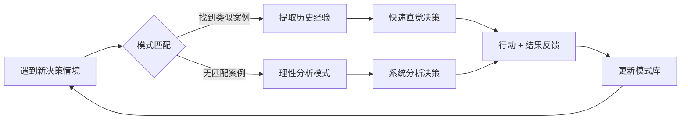

## 四、案例库与学习资源

理论和工具为决策提供了框架，但真正让决策能力发生质变的，是大量的案例积累和系统化的学习实践。本节构建一个完整的"案例学习生态系统"——从为什么案例学习有效（理论基础），到如何建立自己的案例库（方法论），再到具体的高质量资源推荐（工具箱），最后到如何将案例转化为决策能力（实践闭环）。

### 4.1 为什么案例学习是决策能力的核心引擎

#### 4.1.1 案例学习的认知科学基础

人类大脑并不是通过抽象规则来学习决策的——它是通过**模式识别**（Pattern Recognition）来积累经验的。认知心理学家Gary Klein在其"识别启动决策模型"（Recognition-Primed Decision Model, RPD）中发现：专家做决策时，并不会像教科书描述的那样系统分析所有选项，而是在看到情境的瞬间，凭借过去积累的大量案例，快速匹配到一个"差不多"的方案，然后在头脑中模拟验证。

这意味着：**你见过的案例越多，你的"模式库"就越丰富，面对新问题时就越能快速找到参考方案。** 案例学习本质上是在为你的大脑建立一个高质量的"决策模式数据库"。



#### 4.1.2 案例学习 vs 纯理论学习的差异

| 维度 | 纯理论学习 | 案例学习 |
|------|-----------|---------|
| 记忆持久度 | 概念容易遗忘，平均保留率约10% | 故事和情境记忆深刻，保留率约60-70% |
| 迁移能力 | 抽象规则难以直接套用到具体情境 | 案例提供"半成品"，可快速改编适用 |
| 决策速度 | 需要从头推理，速度慢 | 模式匹配后快速出方案，速度快 |
| 认知负荷 | 高——需要同时处理规则和情境 | 中——情境已被案例预先消化 |
| 适用场景 | 适合建立框架和原理 | 适合实际决策和经验积累 |
| 最佳组合 | 先学理论建立框架 | 再用案例填充框架，两者缺一不可 |

哈佛商学院的教学方法论正是基于这一洞察：MBA课程中约80%的教学时间用于案例讨论，而非理论讲授。学生在一个学年中要分析300-500个真实商业案例，这种密集的案例训练让他们的决策"直觉"得到了系统化锻炼。

#### 4.1.3 个人案例学习的三个层次

案例学习不是简单地"看故事"，而是有明确的层次递进：

**第一层：被动阅读（信息获取）**——读一个案例，了解了"发生了什么"。这是最浅层的学习，信息留存率最低。

**第二层：主动分析（理解重构）**——不只看结果，而是分析决策者在当时的约束条件下为什么做出那个选择，有哪些信息是他知道的、哪些是他不知道的，如果你处在他的位置会怎么做。这一层的学习效果是第一层的3-5倍。

**第三层：模式提炼（知识生成）**——从多个类似案例中抽象出通用模式，形成自己的"决策原则"。例如，从Netflix转型、微软云转型、Adobe订阅制转型三个案例中提炼出"在核心业务仍盈利时主动转型"的通用原则，并理解其适用条件和边界。这一层的学习效果是第一层的10倍以上。

### 4.2 如何构建个人案例库

#### 4.2.1 案例库的结构设计

一个高效的个人案例库不是"收藏夹"——它需要有清晰的分类体系、标准化的记录格式和便于检索的组织方式。以下是推荐的案例库结构：

我的案例库/
├── 按决策类型/
│   ├── 战略转型案例/
│   ├── 竞争策略案例/
│   ├── 产品创新案例/
│   ├── 组织管理案例/
│   ├── 个人职业案例/
│   ├── 投资决策案例/
│   └── 危机处理案例/
├── 按行业领域/
│   ├── 科技行业/
│   ├── 消费品行业/
│   ├── 金融服务/
│   └── ...
├── 按决策要素/
│   ├── 高不确定性决策/
│   ├── 多方博弈决策/
│   ├── 资源受限决策/
│   └── 时间压力决策/
└── 我的决策日志/
    ├── 2024年/
    │   ├── 01-换工作决策.md
    │   ├── 03-投资某基金决策.md
    │   └── ...
    └── 模板/

#### 4.2.2 标准化案例记录模板

每个案例都应该用统一的格式记录，方便后续检索和对比分析：

```markdown
## 案例名称：[简明扼要的标题]

### 基本信息
- **时间**：事件发生的时间段
- **主体**：个人/公司/组织名称
- **行业**：所属行业
- **决策类型**：战略/竞争/创新/危机/个人

### 背景与情境
[用3-5句话描述决策发生时的关键约束条件]

### 决策者面临的核心问题
[一句话概括]

### 可选项
| 选项 | 优势 | 劣势 | 风险 |
|------|------|------|------|
| A    | ...  | ...  | ...  |
| B    | ...  | ...  | ...  |

### 实际决策
[决策者最终选择的方案]

### 决策过程分析
- **信息基础**：决策时掌握了哪些信息？遗漏了哪些？
- **决策逻辑**：基于什么推理做出了选择？
- **心理因素**：有哪些认知偏差可能影响了判断？
- **外部压力**：时间、利益相关方、竞争等外部因素如何影响决策？

### 结果与影响
- **短期结果**：...
- **长期结果**：...
- **意外后果**：...

### 我的分析
- **我会怎么做**：在相同信息和约束下，我会选择什么？
- **差距分析**：我的判断和实际结果之间的差距，说明了什么？
- **提取的原则**：这个案例可以提炼出什么通用原则？

### 标签
#战略转型 #科技行业 #高不确定性
```

#### 4.2.3 案例积累的日常习惯

案例积累不需要专门腾出大块时间，关键是建立"碎片化收集 + 定期整理"的节奏：

| 频率 | 动作 | 时间投入 | 工具 |
|------|------|---------|------|
| 每天 | 阅读商业新闻时标记值得记录的事件 | 5-10分钟 | 微信收藏/Instapaper |
| 每周 | 从收藏中选择1-2个有价值的事件，按模板整理成案例 | 30-60分钟 | Notion/Obsidian/飞书文档 |
| 每月 | 回顾本月案例，提取共性模式和原则 | 1-2小时 | 思维导图/白板 |
| 每季 | 用新案例验证和修正过去提炼的原则 | 2-3小时 | 专题深度分析 |
| 每年 | 做年度案例复盘，更新个人决策原则库 | 半天 | 完整的年度回顾 |

### 4.3 系统化案例分析框架

有了案例库还不够，你需要一套标准化的分析方法来从案例中提取最大价值。以下是三个经过验证的分析框架。

#### 4.3.1 框架一：哈佛案例分析法（HBS Method）

这是哈佛商学院最经典的方法，分为七个步骤：

1. **界定问题**（Define the Problem）——用一句话写出决策者面临的核心问题
2. **识别利益相关方**（Stakeholder Analysis）——列出所有受影响的人/群体，分析他们的诉求和影响力
3. **分析约束条件**（Constraints）——时间、资金、信息、法规、竞争等限制因素
4. **生成选项**（Generate Alternatives）——列出所有可能的方案，包括"不行动"选项
5. **评估选项**（Evaluate）——用决策矩阵对每个选项进行多维度打分
6. **做出推荐**（Recommend）——选择最优方案并给出理由
7. **制定行动计划**（Action Plan）——具体的时间表、资源分配、里程碑

#### 4.3.2 框架二：OODA循环分析法

源于军事战略家John Boyd的OODA循环（观察-判断-决策-行动），特别适合分析动态竞争环境中的决策：

| 步骤 | 分析问题 | 适用场景 |
|------|---------|---------|
| **观察**（Observe） | 决策者观察到了什么信息？忽略了什么？信息来源是否可靠？ | 信息收集阶段 |
| **判断**（Orient） | 决策者如何解读这些信息？他的认知框架是什么？有哪些偏差？ | 信息解读阶段 |
| **决策**（Decide） | 在当时的判断下，决策逻辑是否合理？ | 方案选择阶段 |
| **行动**（Act） | 执行过程是否顺利？有哪些调整？ | 落地执行阶段 |

通过这个框架分析案例，你不仅能看到"做了什么"，还能理解"为什么这么做"以及"判断是否正确"。

#### 4.3.3 框架三：反事实推演法

这是Charlie Munger最推崇的分析方法——通过"如果...会怎样"的反事实思考来深化对案例的理解：

1. **改变一个关键变量**：如果当时资金充裕/不足会怎样？如果竞争对手做了不同选择会怎样？
2. **替换决策者**：如果是Elon Musk/张一鸣来做这个决策，他们会怎么选？为什么？
3. **时间轴推移**：如果这个决策推迟6个月做出，结果会不同吗？
4. **可逆性分析**：这个决策的可逆程度如何？如果不可逆，决策标准是否应该更高？

反事实推演的价值在于：它迫使你超越表面的"成败归因"，真正理解决策的内在逻辑和边界条件。

### 4.4 商业与战略案例库资源

#### 4.4.1 权威商业案例库

**哈佛商学院案例库（HBS Case Studies）**

这是全球最权威的商业案例库，拥有超过10,000个经过严格审核的真实商业案例，覆盖战略、营销、运营、财务、领导力等所有商业领域。每个案例都经过哈佛教授团队的深度加工，包含详细的企业数据、决策情境描述和教学笔记。

- **内容特点**：每个案例约15-30页，包含企业背景、财务数据、竞争环境、决策时刻的详细描述。部分案例附有A/B/C系列（同一个企业在不同阶段的决策），可以追踪决策的长期影响
- **价格**：单个案例约$5-15，教育机构可购买案例包
- **获取方式**：hbsp.harvard.edu，注册后可浏览和购买
- **适合人群**：MBA学生、企业管理者、创业者、战略咨询从业者
- **使用建议**：先独立分析，再看教学笔记（Teaching Note），不要先入为主地接受"标准答案"。选择与你所在行业相关的案例开始，逐步扩展到跨行业案例

**毅伟商学院案例库（Ivey Publishing）**

加拿大毅伟商学院的案例库，全球第二大，特点是案例更注重"决策点"的设计——案例通常在一个关键决策时刻戛然而止，迫使读者自己做判断。

- **内容特点**：约6,000个案例，在亚洲和新兴市场案例方面比哈佛更强
- **价格**：单个案例约$5-10
- **获取方式**：iveycases.com
- **适合人群**：关注亚洲市场和新兴市场的决策者

**中国管理案例共享中心（CMCC）**

中国最权威的本土商业案例库，收录了大量中国企业的管理案例，由全国MBA教育指导委员会主管。

- **内容特点**：聚焦中国本土企业，案例场景更贴近国内读者的实际情况
- **价格**：大部分免费
- **获取方式**：case.dlut.edu.cn
- **适合人群**：在中国市场做决策的管理者和创业者

#### 4.4.2 商业分析与案例平台

**混沌学园（原混沌大学）**

中国最具影响力的商业分析平台之一，以案例拆解和创新思维课程见长。其核心课程"创新院"每年深度拆解约50个全球商业案例，由国内顶级商学院教授和企业家主讲。

- **内容特点**：案例拆解注重"第一性原理"分析，不只讲"发生了什么"，更追问"本质是什么"
- **价格**：年费约¥1000-3000（基础版/创新院）
- **获取方式**：xdf.com/app/hundun 或混沌学园APP
- **适合人群**：创业者、企业中高层管理者、关注中国商业创新的人
- **使用建议**：建议从"创新院"经典案例开始，比如其对拼多多、美团、字节跳动等公司的深度拆解质量很高

**得到"每天听本书"**

得到APP的旗舰产品，将商业和自我提升类书籍浓缩为20-30分钟的音频解读。虽然不是严格意义上的"案例库"，但其对商业经典书籍的解读中包含了大量案例精华。

- **内容特点**：覆盖商业、心理、历史、科技等领域，每个解读包含书籍的核心案例和关键论点
- **价格**：VIP年费约¥365
- **获取方式**：得到APP
- **适合人群**：时间有限但希望快速获取商业知识的人
- **使用建议**：先听解读版筛选值得深入的书籍，再买原版精读。直接用解读版替代原版阅读是错误的——解读版帮你筛选，原版给你深度

**36氪 / 虎嗅 / 晚点LatePost**

这三家是中国最优质的科技商业媒体，长期跟踪和分析中国科技公司的战略决策。

- **36氪**：覆盖创业、投融资、科技趋势，案例分析短平快，适合日常跟踪
- **虎嗅**：商业评论深度更强，经常有高质量的长篇案例分析
- **晚点LatePost**：聚焦中国互联网大厂的战略决策，报道深度在业内首屈一指，经常有独家信息
- **使用建议**：养成每天花10-15分钟浏览的习惯，遇到有价值的案例立刻收藏，周末统一整理到案例库

#### 4.4.3 全球商业案例的中文替代方案

对于英文阅读有障碍的读者，以下是中文可用的替代资源：

| 英文原版资源 | 中文替代方案 | 质量对比 |
|------------|-------------|---------|
| Harvard Business Review | 哈佛商业评论中文版（微信公众号） | 核心文章翻译质量高，但比英文版少约40%内容 |
| McKinsey Quarterly | 麦肯锡大中华区官网（中文报告） | 原创中文研究报告质量与全球同步 |
| The Economist | 经济学人·全球商业评论（微信小程序） | 精选翻译，覆盖主要商业分析 |
| Stratechery（Ben Thompson） | 极客公园 / 少数派的深度分析 | 分析角度不同，但深度可比 |
| a]16z blog | 创业邦 / 甲子光年的深度报道 | 聚焦国内创投，案例更接地气 |

### 4.5 个人成长与决策案例资源

#### 4.5.1 职业决策案例

**80,000 Hours**

这是一个由牛津大学研究者创建的职业选择研究机构，用严格的量化方法分析不同职业路径的社会影响力和个人回报。其核心理念是：你的职业生涯大约有80,000小时（40年×2000小时/年），值得花大量时间研究如何用好这些时间。

- **核心内容**：职业路径评估框架、高影响力职业分析、职业决策指南
- **特色**：用数据和案例说话，而不是鸡汤式建议
- **获取方式**：80000hours.org（英文，免费）
- **使用建议**：重点阅读其"Career Decision Framework"和各类职业路径的深度报告，即使你不完全认同其价值观，其分析框架也值得学习

**LinkedIn Economic Graph / 脉脉行业报告**

职业决策需要真实的行业数据支撑。LinkedIn的经济图谱提供了全球劳动力市场的宏观数据，脉脉则提供了中国职场的微观洞察。

- **LinkedIn**：行业趋势、薪资数据、技能需求变化
- **脉脉**：中国职场真实案例、薪资匿名分享、行业八卦中的决策信息
- **使用建议**：做重大职业决策前，先在这两个平台搜索相关行业和岗位的数据，不要只凭感觉

#### 4.5.2 投资决策案例

**伯克希尔·哈撒韦年度股东信**

Warren Buffett每年写给股东的信是投资决策案例学习的顶级资源。从1977年至今，这些信件记录了Buffett在不同市场环境下的投资决策逻辑、对风险的评估方法、以及对错误决策的坦诚反思。

- **核心价值**：不只看"买了什么"，而是理解"为什么买"和"为什么在那个时间点买"
- **获取方式**：berkshirehathaway.com/letters（免费，英文）
- **中文翻译**：微信搜索"巴菲特股东信中文版"，有多个高质量翻译版本
- **使用建议**：从2008年金融危机前后的信开始读，这是理解"在极端环境下如何做决策"的最佳材料

**段永平的投资博客和雪球发言**

段永平（步步高/OPPO/vivo创始人）在雪球上的发言是中国价值投资案例学习的宝藏。他用极其直白的语言分享了对苹果、茅台、腾讯等公司的投资逻辑，以及对"不做不对的事"这一核心原则的反复阐释。

- **获取方式**：雪球APP搜索"大道无形我有型"（段永平的ID）
- **使用建议**：不要只看他买了什么，重点学习他的"排除法"思维——他花更多时间说"不投什么"以及"为什么不投"

#### 4.5.3 决策日志与个人复盘

**建立决策日志系统**

所有外部案例的学习，最终都要和你自己的决策实践结合。决策日志是连接"别人的故事"和"自己的行动"的桥梁。

```markdown
# 决策日志

## 基本信息
- **日期**：2024-03-15
- **决策事项**：是否接受A公司的offer
- **重要程度**：★★★★★（重大决策）
- **可逆程度**：中等（可以再换，但成本较高）

## 决策情境
[描述当时的背景、约束条件、时间压力]

## 可选方案
| 方案 | 优势 | 劣势 | 风险概率 | 风险影响 |
|------|------|------|---------|---------|
| 接受A公司 | 薪资高30%，成长空间大 | 行业不确定，通勤远 | 中 | 高 |
| 留在现公司 | 稳定，人际关系好 | 成长空间有限 | 低 | 低 |
| 继续找其他机会 | 可能找到更好的 | 时间成本高，不确定性大 | 高 | 中 |

## 决策依据
我选择______，核心原因是______。
参考了以下案例/经验：______。

## 三个月后回顾
- **预期结果**：______
- **实际结果**：______
- **差距分析**：______
- **更新的原则**：______
```

**复盘的节奏**

| 时间点 | 复盘内容 | 目的 |
|-------|---------|------|
| 决策后1周 | 检查决策过程是否合理 | 趁记忆清晰时记录过程 |
| 决策后1个月 | 评估短期结果是否符合预期 | 检验预期准确性 |
| 决策后3个月 | 评估中期结果和意外后果 | 发现决策中的盲点 |
| 决策后1年 | 全面评估和原则提炼 | 为案例库贡献个人案例 |

### 4.6 免费与开放学习资源

#### 4.6.1 MOOC平台的战略与决策课程

| 平台 | 推荐课程 | 语言 | 费用 | 特点 |
|------|---------|------|------|------|
| Coursera | "Strategic Management"（哥本哈根商学院） | 英文（有中文字幕） | 免费旁听 | 系统性最强的战略管理入门课 |
| Coursera | "Modeling Risk and Realities"（沃顿商学院） | 英文 | 免费旁听 | 决策建模与不确定性分析 |
| edX | "The Science of Decision Making"（MIT） | 英文 | 免费旁听 | 从认知科学角度理解决策 |
| 中国大学MOOC | "战略管理"（清华大学） | 中文 | 免费 | 中国情境下的战略管理 |
| 中国大学MOOC | "管理决策与博弈"（北京大学） | 中文 | 免费 | 博弈论在决策中的应用 |
| B站 | 各商学院公开课 | 中英混合 | 免费 | 内容质量参差不齐，但有宝藏 |
| Khan Academy | "Microeconomics"决策相关章节 | 英文（有中文字幕） | 免费 | 决策经济学基础，极其易懂 |

**使用建议**：不要贪多，选1-2门课程完整学完，比"收藏了20门课一门没学完"有效得多。建议先从中文课程入门，建立基础概念后再用英文课程深化。

#### 4.6.2 高质量播客与音频资源

播客是碎片时间学习案例的极佳媒介。以下推荐聚焦于有深度案例分析的节目：

| 播客名称 | 平台 | 内容特点 | 更新频率 |
|---------|------|---------|---------|
| 疯投圈 | 小宇宙/Apple Podcasts | 用投资视角拆解消费和科技行业案例 | 双周 |
| 商业就是这样 | 小宇宙/Apple Podcasts | 深入拆解单一商业事件的前因后果 | 周更 |
| Acquired | Apple Podcasts/Spotify | 史诗级深度案例（单集3-6小时），覆盖NVIDIA、Costco等 | 月更 |
| How I Built This | NPR | 创业者亲述创业过程中的关键决策 | 周更 |
| The Knowledge Project | Farnam Street | 与顶级决策者和研究者的深度对话 | 双周 |
| 忽左忽右 | 小宇宙/Apple Podcasts | 历史和商业交叉的深度案例分析 | 周更 |
| 枫言枫语 | 小宇宙/Apple Podcasts | 科技产品和商业模式分析 | 周更 |

#### 4.6.3 高质量免费书面资源

**Farnam Street Blog（fs.blog）**

由Shane Parrish创建的思维模型和决策博客，是全球最受欢迎的"思考如何思考"类资源之一。其核心内容包括：思维模型库（Mental Models）、经典书籍深度拆解、认知偏差分析、历史决策案例研究。

- **核心价值**：将跨学科的思维模型用通俗语言讲解，每个模型都配有真实案例
- **推荐文章系列**："Mental Models: The Best Way to Make Intelligent Decisions"系列
- **获取方式**：fs.blog（免费，英文）

**Stratechery（stratechery.com）**

由Ben Thompson创建的科技战略分析平台，被誉为"科技行业的哈佛案例课"。每日一篇短分析（Daily Update），每周一篇深度长文（Article）。其分析框架——特别是"聚合理论"（Aggregation Theory）——已经成为理解数字平台战略的标准工具。

- **核心价值**：用统一的分析框架拆解科技公司的战略决策
- **获取方式**：部分免费文章 + 付费订阅（$12/月）
- **替代方案**：如果不想付费，其免费文章和播客"The Stratechery Interview"已经有大量高质量内容

**哈佛商业评论中文版（微信公众号：haborchinesereview）**

每周推送3-5篇精选文章的中文版，涵盖领导力、战略、创新、个人发展等主题。

- **获取方式**：微信关注公众号（免费）
- **使用建议**：置顶公众号，养成每天快速扫描标题的习惯，对感兴趣的文章收藏后集中阅读

### 4.7 社群与交流平台

案例学习不是孤立行为——与他人讨论、辩论、分享，能让案例学习的价值倍增。

#### 4.7.1 线上社群

| 平台/社群 | 主要内容 | 适合人群 | 使用建议 |
|----------|---------|---------|---------|
| 知识星球 | 各类主题的付费深度社群 | 希望和同频的人深度交流 | 选择1-2个与你行业相关的星球，深度参与比广撒网更重要 |
| 豆瓣小组 | 兴趣小组讨论、书评、案例分享 | 喜欢文字交流和深度阅读 | "商业经典阅读""战略思维"等小组质量较高 |
| 即刻 | 创业和投资圈的高质量讨论 | 互联网和科技行业从业者 | 关注"商业案例""产品分析"等话题标签 |
| Twitter/X | 全球视野的商业讨论和信息 | 英文能力强、关注全球趋势 | 建立一个专门的学习列表，只关注高质量的信息源 |
| 雪球 | 投资决策讨论和案例分享 | 对投资决策感兴趣 | 学习段永平、唐朝等高水平投资者的分析思路 |
| GitHub Discussions | 开源项目和知识库的讨论区 | 技术决策学习 | 关注顶级开源项目的架构决策讨论 |

#### 4.7.2 线下活动

| 活动类型 | 推荐平台/渠道 | 适合人群 | 参与建议 |
|---------|-------------|---------|---------|
| 行业会议 | 各行业官方网站、活动行 | 希望拓展行业视野和人脉 | 每年选1-2个高质量会议参加，重质不重量 |
| 读书会 | 豆瓣同城、微信读书会、混沌各地分社 | 希望深度阅读和讨论 | 带着自己的案例和分析参加，不要只做旁听者 |
| 工作坊 | 各类培训机构、创业孵化器 | 希望学习具体技能和方法论 | 选择有实操环节的工作坊，纯讲授式的价值有限 |
| 创业路演 | 创业邦、36氪活动、各地孵化器 | 创业者、投资人 | 即使不投资，旁听路演也是学习商业案例的绝佳机会 |
| 行业沙龙 | 各地商会、行业协会、LinkedIn本地活动 | 各行业从业者 | 重点参与有案例分享环节的活动 |

#### 4.7.3 学习小组的组建与运营

如果你想将案例学习的社群效应最大化，可以组建一个3-5人的案例学习小组：

**组建原则**：
- 人数控制在3-5人——太少缺乏多样性，太多讨论效率下降
- 成员背景最好有差异——不同行业、不同职能、不同年龄段
- 每个人都需要有"输出"的意愿——只消费不产出的成员会拖累小组

**运行节奏**：

| 环节 | 频率 | 时间 | 内容 |
|------|------|------|------|
| 案例分享 | 每周1次 | 60-90分钟 | 1人主讲1个案例，其他人提问和讨论 |
| 读书拆解 | 每月1次 | 2-3小时 | 共读一本书，每人负责一章的拆解 |
| 决策复盘 | 每月1次 | 60分钟 | 分享各自本月的重大决策和反思 |
| 主题深潜 | 每季1次 | 半天 | 选定一个主题（如"AI对各行业的影响"），每人准备一个子题 |

**讨论模板**：
1. 主讲人用15分钟呈现案例（背景→决策→结果）
2. 其他人用10分钟提问澄清
3. 自由讨论20分钟："如果是我，我会怎么做？"
4. 最后5分钟：每人用一句话总结从这个案例学到的最重要的一点

### 4.8 行业数据与研究报告

高质量的决策离不开可靠的数据支撑。以下是按领域分类的权威数据来源。

#### 4.8.1 行业研究报告

| 来源 | 内容特点 | 获取方式 | 适合场景 |
|------|---------|---------|---------|
| 艾瑞咨询 | 中国互联网行业深度报告，数据详实 | iresearch.cn（部分免费） | 互联网行业决策 |
| 麦肯锡全球研究院 | 全球商业趋势和技术影响报告 | mckinsey.com（免费） | 宏观战略判断 |
| 贝恩公司 | 消费和投资趋势报告，中国报告质量高 | bain.com（免费） | 消费和投资决策 |
| 中金公司 | 中国各行业研究报告 | 中金研报（部分免费） | 中国市场投资决策 |
| CB Insights | 科技创业趋势、行业分析图谱 | cbinsights.com（部分免费） | 创业和投资方向判断 |
| 德勤/普华永道/安永/毕马威 | 各行业年度报告 | 各官网（免费） | 行业全景了解 |
| 亿欧智库 | 中国新经济行业研究报告 | iyiou.com（部分免费） | 中国新经济领域决策 |

#### 4.8.2 个人发展研究资源

| 来源 | 内容特点 | 获取方式 | 适合场景 |
|------|---------|---------|---------|
| Harvard Business Review | 管理和个人发展前沿研究 | hbr.org（部分免费） | 管理方法和个人效能提升 |
| Greater Good Science Center | 伯克利大学积极心理学研究中心 | greatergood.berkeley.edu（免费） | 幸福感、人际关系、意义感研究 |
| 80,000 Hours | 用数据驱动的职业选择研究 | 80000hours.org（免费） | 职业路径决策 |
| Farnam Street | 思维模型和决策科学的综合博客 | fs.blog（免费） | 思维框架和决策方法论 |
| 混沌学园研究院 | 中国商业创新研究报告 | 混沌学园APP（部分免费） | 中国商业创新趋势 |
| 前瞻产业研究院 | 中国各产业深度报告 | qianzhan.com（部分免费） | 产业投资和发展决策 |

#### 4.8.3 学术资源的个人应用

学术论文通常被认为"太理论化"，但其中的数据和结论如果善加利用，可以大幅提升决策质量。以下是将学术资源转化为个人决策工具的方法：

**Google Scholar（scholar.google.com）**
- 使用方法：搜索你想了解的决策主题，如"career decision-making framework"或"investment decision bias"
- 过滤技巧：按引用次数排序，高引用论文通常是该领域的奠基性研究
- 实用化方法：不需要读完全文，只看摘要（Abstract）和结论（Conclusion），提取关键发现即可

**SSRN（ssrn.com）**
- 社会科学研究网络，大量最新的预印本论文
- 特点：比正式出版早6-12个月，可以提前获取最新研究成果
- 适合：想了解某个领域最新研究动态的进阶读者

**中文核心期刊数据库**
- 中国知网（cnki.com.cn）：搜索"决策""战略""规划"等关键词
- 使用建议：关注《管理世界》《南开管理评论》《中国工业经济》等顶级期刊的文章

### 4.9 如何评估学习资源的质量

信息过载时代，"选对资源"比"用对方法"更重要。以下是评估学习资源质量的系统框架。

#### 4.9.1 资源质量评估清单

| 评估维度 | 高质量信号 | 低质量信号 |
|---------|-----------|-----------|
| 作者资质 | 有相关领域的一线经验或学术研究 | 只有营销背景，无实质专业经历 |
| 论据支撑 | 有数据、案例、引用来源 | 只有观点和口号，没有论据 |
| 逻辑结构 | 论点层层递进，有清晰的推理链 | 罗列要点，没有逻辑关联 |
| 时效性 | 标注数据来源和时间 | 使用过时数据，不标注时间 |
| 反面论证 | 主动讨论局限性和反对意见 | 只讲优点，回避所有批评 |
| 可验证性 | 提供可追溯的来源和可验证的数据 | "据研究表明""有人说过"但不给出处 |
| 作者利益关系 | 公开利益关系，观点一致 | 推荐的产品恰好是他卖的 |

#### 4.9.2 常见的"伪优质"资源特征

识别以下特征，可以帮助你避开大量看起来专业但实际上价值有限的资源：

1. **"XX条黄金法则"类标题**——通常是为了传播性牺牲了深度，每条法则都是蜻蜓点水
2. **只有成功案例没有失败案例**——幸存者偏差，无法学到真正有价值的教训
3. **频繁使用"绝对""一定""必须"等绝对化表述**——决策领域几乎没有绝对的真理
4. **大量使用名人名言但缺乏实质分析**——用权威感替代逻辑论证
5. **结论过于简单化**——"只要做到XX就能成功"——真实世界的决策远比这复杂
6. **发布时间密集但篇幅短小**——日更的短文通常是为了维持更新频率而非提供深度

### 4.10 常见误区与纠正

在案例学习和资源利用方面，以下误区最为普遍：

**误区一：只收藏不消化**

大量收藏文章、书籍、课程，但从不花时间深入学习。收藏夹变成了"稍后遗忘"列表。

纠正方法：执行"一周法则"——收藏的内容必须在一周内整理到案例库或学习计划中，超过一周未处理的直接删除。如果你真的需要它，你会再找到的。

**误区二：只看结论不看过程**

只关心案例中"最后怎么了"，不关心"当时是怎么想的"。这导致你只记住了几个"秘诀"，但无法在新情境中灵活运用。

纠正方法：每次读案例时，强制自己在看到结果之前先做一次判断："如果是我，我会怎么选？"然后再对比实际结果。

**误区三：案例选择存在偏差**

只看成功案例，不看失败案例；只看本行业案例，不看跨行业案例；只看大公司案例，不看小公司和个人案例。

纠正方法：刻意保持案例库的多样性，目标比例是：成功案例60%、失败案例40%；本行业50%、跨行业50%。

**误区四：过度类比，忽视差异**

看到一个成功案例就急于套用到自己的情况，忽视了两个情境之间的关键差异。

纠正方法：每次类比时，必须列出至少3个"不可比因素"——即两个情境之间的关键差异点。如果找不到不可比因素，说明你分析得还不够深入。

**误区五：追求"权威"资源，忽视身边案例**

总觉得商学院案例、名人传记才是"正经"案例，忽视了身边同事、朋友、家人的决策经验。

纠正方法：你身边3-5年经验的同行的决策案例，对你来说可能比哈佛案例更有参考价值——因为你们面对的约束条件更相似。

**误区六：信息源过于单一**

只从一两个平台获取案例和信息，导致认知框架单一、视野受限。

纠正方法：建立"信息源矩阵"——至少覆盖：1个国际英文源、1个国内深度分析、1个行业垂直媒体、1个社群讨论平台、1个学术数据源。

### 4.11 进阶：建立个人决策知识系统

当你积累了足够多的案例后，下一步是将零散的案例整合为一个有机的决策知识系统。

#### 4.11.1 从案例到原则的提炼方法

[50+ 案例积累]
    ↓
[按决策类型分类]
    ↓
[寻找共性模式] → 成功案例的共同特征是什么？失败案例的共同错误是什么？
    ↓
[提炼决策原则] → 用一句话概括，如："在信息不完整时，选择可逆性更高的方案"
    ↓
[明确适用条件] → 这条原则在什么条件下成立？什么条件下不成立？
    ↓
[创建检验机制] → 如何用未来的案例验证/修正这条原则？
    ↓
[定期更新迭代]

#### 4.11.2 个人决策原则库示例

以下是通过大量案例学习可能提炼出的决策原则示例：

| 原则 | 适用场景 | 边界条件 | 来源案例 |
|------|---------|---------|---------|
| 在两个选项差距不大时，选择可逆性更高的那个 | 信息不完整的二选一决策 | 不适用于必须all-in的极端场景 | Amazon的"双向门vs单向门"决策框架 |
| 当核心业务仍在盈利但趋势下行时，主动转型比等到被迫转型成本低10倍 | 企业/个人的战略转型 | 需要对"趋势下行"有准确判断，过早转型也有代价 | Netflix DVD→流媒体、微软→云 |
| 决策时优先考虑"第二序效应"——不仅想"这个选择直接带来什么"，更要想"它会导致什么后续变化" | 所有重大决策 | 需要一定的系统思维能力 | Munger的"反过来想"方法论 |
| 当所有理性分析都无法得出结论时，选那个让你晚上睡得着的选项 | 高不确定性下的最终选择 | 只在理性分析穷尽后才使用 | 个人决策日志中的统计规律 |

这些原则不是放之四海而皆准的真理，而是你在特定案例积累基础上形成的个人决策智慧。随着案例库的扩充和经验的积累，这些原则会不断被验证、修正和丰富。

---

> **本节小结**：案例库和学习资源是决策能力的"燃料"——没有充足的高质量案例积累，再好的分析框架也只是空壳。从今天开始：选1个权威案例库注册、建1个案例记录模板、找1个高质量社群加入。不需要一步到位，但需要开始行动。案例学习是一个复利过程——初期投入看不到明显回报，但积累到一定量级后，你的决策质量会出现质的飞跃。
