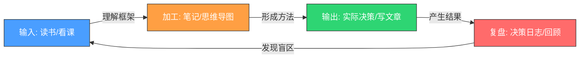

## 本节小结

本节从四个维度为你构建了一个完整的"策略与规划"学习资源体系：**20本经典书籍**建立了从认知到执行的思维地基，**精选在线课程**提供了结构化的学习路径，**决策工具与软件**将抽象方法论变成可操作的流程，**案例库与学习资源**则为持续精进提供了永不枯竭的养料。这四者不是孤立的推荐清单，而是一个互相咬合的系统——书教你"怎么想"，课教你"怎么做"，工具帮你"做出来"，案例帮你"做对"。

本小节的目的不是让你把所有资源都用一遍，而是帮你建立一套**筛选、组合、执行**的方法论，让你在有限的时间和精力下获得最大的认知回报。

---

### 核心原则：四条铁律

#### 铁律一：工具为目标服务，而非相反

本节推荐了大量工具——从决策矩阵到思维导图，从 Notion 到 Obsidian，从 Todoist 到 Forest。但工具不是越多越好。**工具焦虑**（Tool Anxiety）是策略学习中最隐蔽的陷阱：你花了一周对比 Notion 和 Obsidian 的优劣，又花了一周搭建精美的模板系统，结果决策日志写了三篇就再也不更新了。

**正确做法**：选一个任务管理工具、一个日历、一个笔记系统，然后坚持使用至少3个月再考虑更换。工具的80%价值来自持续使用，而非功能多寡。

**最小可行工具栈**：

| 需求 | 推荐工具（选一个即可） | 年成本 |
|------|----------------------|--------|
| 任务管理 | 滴答清单或Todoist | 免费或¥139/年 |
| 笔记与知识管理 | Obsidian（本地免费）或Notion（云端免费） | ¥0 |
| 日历 | Google Calendar | ¥0 |
| 思维导图 | XMind免费版或Draw.io | ¥0 |
| 决策分析 | Excel/Google Sheets | ¥0 |

以上工具栈的总成本为零，但足以支撑完整的策略与规划工作流。把选工具省下来的时间用在真正重要的事上——读完《思考，快与慢》的第38章。

#### 铁律二：输入要精不要多

20本书、数十门课程、上百个案例——面对海量资源，最常见的反应是"先收藏再说"。但收藏夹里的内容99%不会再被打开。认知科学研究反复证实：**泛读10本书不如精读3本**。精读意味着你不仅能复述核心观点，还能用自己的话解释它、在不同场景中应用它、发现它与其他知识的关联。

**精读的检验标准**：读完一本书后，合上书，能否在白纸上画出该书的核心框架？能否举出3个你在现实中可以立刻应用的具体方法？如果不能，说明你只是"翻过"而非"读过"。

**量化建议**：

- 每个季度精读2-3本书，而非每个月泛读5本
- 每门课程完成后做一个完整的笔记或思维导图，而非看了就忘
- 每个工具深度使用3个月后再评估是否需要更换，而非每个都试两天

#### 铁律三：输出是最好的学习

单纯输入（读书、看课、听播客）的留存率极低——学习科学中的"学习金字塔"理论指出，单纯阅读的内容平均留存率仅约10%，而教授给他人的留存率高达90%。虽然这些具体数字存在争议，但方向是一致的：**主动输出远优于被动输入**。

**高质量输出的五种形式**：

1. **决策日志**：每做完一个重大决策，用前面推荐的模板记录下来。3个月后回顾，你会发现自己的决策盲区——也许是过于乐观、也许是信息收集不足、也许是情绪干扰了判断。
2. **读书笔记/博客**：不是摘抄金句，而是用自己的话重述核心逻辑，并举出个人化的应用案例。写一篇2000字的读书笔记，比划50条金句更能帮你内化知识。
3. **教别人**：给朋友讲解一个决策框架，或者在知识星球上分享你的思考。教学过程中你会被迫理清自己的理解——发现自己"以为懂了但其实没懂"的地方。
4. **决策实践**：读完《好战略，坏战略》后，立刻用它的框架分析你当前面临的一个真实选择。读完SWOT分析后，立刻做一个关于你职业发展的SWOT。
5. **知识图谱**：每读完一本书或完成一门课程，用思维导图画出核心概念，并与之前的知识做关联。长期积累后，你会拥有一张属于自己的"思维地图"。

#### 铁律四：实践比理论重要

战略思维不是知识竞赛——你不需要记住所有框架的名称和定义，你需要的是在真实决策中**自然而然地调用**正确的思维模型。这只有通过反复实践才能做到。

**"最小可行实践"法则**：学完一个概念后，24小时内找到一个真实场景去应用它。读完贝叶斯思维，当天就用它分析一个你正在犹豫的选择。读完决策矩阵，当晚就用它比较你纠结的两个选项。不需要等到"完全准备好"——边做边学的效果远好于学完再做。

---

### 资源组合策略：不同阶段的学习路径

不是所有资源都适合所有人。以下是根据你当前阶段推荐的资源组合：

#### 初级阶段：从零到一建立决策框架

**目标**：理解基本思维模型，建立最简单的决策工具栈。

| 维度 | 推荐资源 | 预计投入 |
|------|---------|---------|
| 核心阅读 | 《原子习惯》→《思考，快与慢》→《好战略，坏战略》 | 8-12周 |
| 课程 | Coursera "Learning How to Learn"（免费） | 4周 |
| 工具 | 滴答清单 + Obsidian + Google Sheets | 1天搭建 |
| 实践 | 每周写1篇决策日志 | 持续 |

**关键提醒**：初级阶段最容易犯的错误是"贪多求全"。不要同时读5本书、学3门课、试4个工具。先用最简单的工具栈建立习惯，再逐步升级。

#### 中级阶段：体系化构建认知框架

**目标**：建立跨学科的思维模型体系，能独立做出高质量决策。

| 维度 | 推荐资源 | 预计投入 |
|------|---------|---------|
| 核心阅读 | 《穷查理宝典》→《反脆弱》→《第五项修炼》→《创新者的窘境》 | 12-16周 |
| 课程 | 得到App相关课程 或 Coursera战略类课程 | 6-8周 |
| 工具 | 添加Notion决策数据库 + XMind思维导图 | 1周搭建 |
| 实践 | 建立个人案例库，每季度做1次SWOT分析 | 持续 |

**关键提醒**：中级阶段的核心挑战是"知行差距"——你知道很多框架，但在真实决策中仍然凭直觉。解决方案是建立"决策前检查清单"：在做任何重大决策前，强制自己先过一遍"我是否用了正确的框架？我是否考虑了对立观点？我是否做了敏感性分析？"

#### 高级阶段：深度整合与持续精进

**目标**：形成自己的决策体系，能在复杂不确定环境中做出高质量判断。

| 维度 | 推荐资源 | 预计投入 |
|------|---------|---------|
| 核心阅读 | 完成剩余书目 + HBR/Farnam Street等持续阅读 | 持续 |
| 课程 | 麦肯锡/哈佛案例方法论 + 行业深度课程 | 按需 |
| 工具 | 完整知识管理系统（Obsidian图谱 + Notion项目管理） | 1-2周搭建 |
| 实践 | 决策复盘机制 + 导师/同侪反馈 + 写作输出 | 持续 |

**关键提醒**：高级阶段最大的风险是"知道太多反而不会做"——当你的思维模型太多时，可能在两个模型之间犹豫不决。解决方案是建立优先级：在任何决策中，先问"这个决策的核心不确定性是什么"，然后选择最能解决那个不确定性的模型。

---

### 常见误区与纠正

| 误区 | 表现 | 纠正方法 |
|------|------|---------|
| 工具崇拜 | 花大量时间搭建精美系统，却不持续使用 | 先用最简工具3个月，确认需求后再升级 |
| 收藏=学习 | 收藏了200篇文章，实际读了不到10篇 | 设"收藏夹清理日"，超过1个月未读的直接删除 |
| 框架迷信 | 遇到任何问题都想套用某个框架 | 先判断问题的类型，再选择匹配的框架；没有框架适用于所有场景 |
| 孤立学习 | 只读书不实践，只实践不复盘 | 建立"输入→实践→输出→复盘"的闭环 |
| 完美主义 | 等到"准备好了"才开始行动 | 用"最小可行行动"打破僵局——现在就开始用决策矩阵分析一个真实选择 |
| 信息焦虑 | 总觉得还有更好的资源没找到 | 本节推荐的资源已经足够建立完整的策略思维体系，停止搜索，开始使用 |

---

### 从资源到能力的转化模型

资源本身不会自动转化为能力。以下是将推荐资源转化为真实决策能力的四步闭环：

**第一步：输入（Input）**——有目的地选择资源。不是随机阅读，而是基于当前阶段的需求选择最匹配的书籍、课程和工具。每次开始新的学习单元前，先明确：我要解决什么问题？学完后我要能做什么？

**第二步：加工（Process）**——把被动输入转化为主动理解。读完一章后用自己的话写一段总结；学完一个框架后画出它的核心逻辑图；看完一个案例后分析"如果是我，我会怎么决策？"。

**第三步：输出（Output）**——在真实场景中应用所学。每学完一个决策工具，立刻用它分析一个真实选择。每读完一本战略书籍，写一篇至少1000字的读书笔记。把你的分析分享给朋友或同事，接受反馈。

**第四步：复盘（Review）**——定期回顾决策结果。决策日志的价值不在记录当下，而在回顾过去。每个月花1小时回顾过去30天的决策记录：哪些决策的预期和实际一致？哪些偏差最大？偏差的原因是什么——是信息不足、认知偏差、还是情绪干扰？

---

### 本节推荐资源速查表

为了方便你快速定位，以下是按使用频率排列的资源优先级：

**第一梯队：必读/必用**（覆盖80%的核心需求）

| 资源 | 类型 | 为什么必选 |
|------|------|-----------|
| 《思考，快与慢》 | 书籍 | 理解认知偏差是一切理性决策的基础 |
| 《好战略，坏战略》 | 书籍 | 区分真战略和愿望清单 |
| 《原子习惯》 | 书籍 | 没有执行力，再好的战略都是空谈 |
| 决策矩阵 | 工具 | 最通用的量化决策方法，适用场景最广 |
| 决策日志 | 实践 | 唯一能让你的决策能力持续迭代的机制 |
| Obsidian或Notion | 工具 | 建立个人知识体系的基础平台 |

**第二梯队：强烈推荐**（进一步提升决策质量）

| 资源 | 类型 | 为什么推荐 |
|------|------|-----------|
| 《穷查理宝典》 | 书籍 | 跨学科思维模型的集大成者 |
| 《反脆弱》 | 书籍 | 在不确定时代最重要的生存法则 |
| Learning How to Learn | 课程 | 元认知能力的入门课，免费且高效 |
| SWOT/PEST分析 | 框架 | 结构化评估个人和环境的经典方法 |
| Google Calendar + 时间块法 | 工具 | 把决策转化为可执行的时间安排 |

**第三梯队：按需选用**（针对特定场景的深度资源）

| 资源 | 类型 | 适用场景 |
|------|------|---------|
| 《创新者的窘境》 | 书籍 | 需要理解颠覆式创新和行业变革 |
| 贝叶斯思维工具（Guesstimate） | 工具 | 需要在高度不确定的环境中做概率判断 |
| 哈佛商学院案例库 | 案例 | 需要学习真实商业决策的深度分析 |
| 麦肯锡/贝恩研究报告 | 数据 | 需要基于行业数据做出战略判断 |
| XMind/Draw.io | 工具 | 需要将复杂决策过程可视化 |

---

### 最后的建议：从今天开始

不要等到"读完所有推荐的书"才开始实践策略思维。今天就做这三件事：

1. **打开一个空白文档**，写下你当前面临的最重要的一个决策（可以是职业选择、项目方向、投资决定、甚至是生活方式的改变）。
2. **用决策矩阵**列出所有选项和评估维度，给每个维度赋权重、给每个选项打分。
3. **把这个过程记录下来**，3个月后回顾——这是你决策日志的第一条记录。

策略与规划不是一种知识，而是一种习惯。工具和资源只是起点，真正的成长发生在你把它们用在每一个真实决策中的那一刻。
