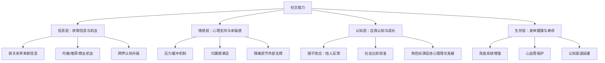
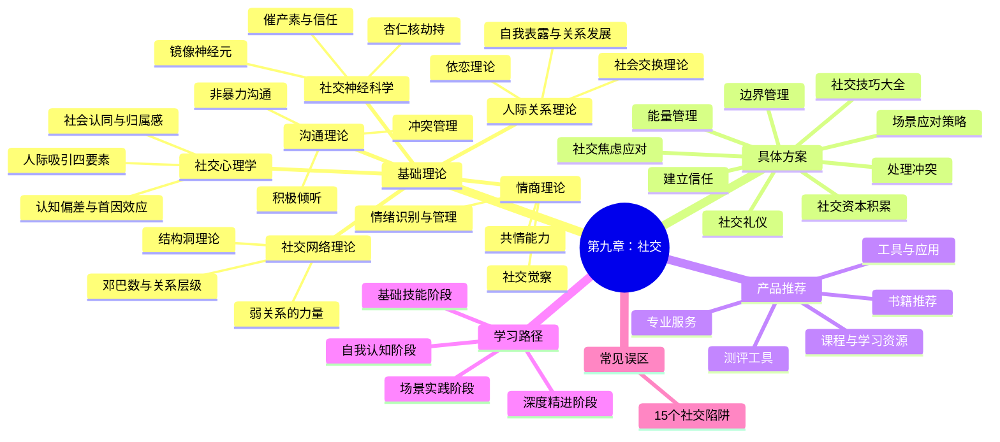

# 第九章：社交——从人际吸引到深度关系的完整指南

## 为什么这一章值得你认真读完

人是社会性动物。这不是一句鸡汤，而是进化生物学的基本事实。人类之所以在漫长的进化历程中脱颖而出，不是因为我们跑得最快、力量最大，而是因为我们拥有动物界最复杂、最精密的社交能力——语言、合作、信任、文化，这些人类文明的基石全部建立在社交的基础之上。

哈佛大学历时85年的「格兰特研究」（Grant Study）追踪了724名男性从青年到老年的完整人生轨迹，最终得出的核心结论只有一句话：**良好的人际关系是幸福和健康的最重要预测因素。** 不是财富，不是名望，不是职业成就，而是你与他人的关系质量。

然而，这个结论在当代面临一个悖论——

社交媒体让我们拥有了前所未有的「连接数」，微信好友可以加到5000人，但真正能在深夜打电话倾诉的人可能不超过3个。我们拥有了更多「认识的人」，却不一定拥有更深层的「关系」。中国青年报2023年的一项调查显示，超过60%的年轻人认为自己「社交能力不足」，近半数人感到「经常性孤独」。

本章的目标不是教你成为「社交达人」或「八面玲珑」的人——那种目标本身就是一种误区。我们的目标是：**帮助你理解社交的底层规律，掌握核心社交技能，建立健康、真诚、有深度的人际关系。** 无论你是内向还是外向，无论你是学生还是职场人，无论你是想改善亲密关系还是拓展职业人脉，本章都能为你提供系统化的指导。

## 社交能力的四层价值模型

在进入具体内容之前，让我们先建立一个清晰的认知框架，理解社交对个人发展的系统性价值。

### 第一层：信息与机会

你的社交网络是你获取信息和机会的核心渠道。社会学家马克·格兰诺维特（Mark Granovetter）在1973年的经典研究中提出了「弱关系的力量」理论：**那些不太亲密的社交关系（弱关系）往往能带来最有价值的新信息和新机会。** 原因很简单——你的亲密朋友和你共享的信息高度重叠，而弱关系连接着你社交圈之外的世界。

一个具体的例子：你最好的朋友知道的招聘信息和你差不多，但一个在不同行业工作的前同事，可能偶然听到一个恰好适合你的岗位。LinkedIn 2022年的数据证实了这一点：平台上58%的求职成功来自二度人脉（弱关系），而非直接联系人（强关系）。

弱关系的价值不仅限于求职。在创业领域，很多关键的商业合作、技术灵感、投资机会都来自跨圈层的弱关系连接。这就是为什么「社交网络的宽度」和「社交网络的深度」同样重要。

### 第二层：情感支持与心理韧性

良好的社交关系为你提供情感上的支持和缓冲。心理学家谢尔顿·科恩（Sheldon Cohen）的经典实验发现，在接触感冒病毒后，拥有更多样化社交网络的人感染感冒的概率显著更低——社交网络不仅保护心理健康，还直接影响免疫系统。

在面对压力、挫折和困难时，有人倾诉和陪伴，可以显著降低皮质醇（压力激素）水平。反之，长期的社交孤立会使皮质醇持续偏高，导致慢性炎症、睡眠障碍、免疫力下降等一系列健康问题。

社会神经科学的研究进一步揭示了机制：积极的社交互动会触发催产素（oxytocin）的释放，这种激素不仅能降低焦虑、增强信任感，还能直接降低血压和心率。换句话说，一次真诚的深度对话，对你的身体来说相当于一次轻度的有氧运动。

### 第三层：自我认知与成长

他人是你认识自己的一面镜子。发展心理学指出，人类的「心理理论」（Theory of Mind）——理解他人想法和感受的能力——正是通过社交互动发展起来的。同样，你对自己的认知也在很大程度上依赖于他人的反馈。

一个从未接受过他人真实反馈的人，很难准确认识自己的优势和盲点。社会心理学中的「乔哈里窗口」（Johari Window）模型将自我认知分为四个区域：

| | 自己知道 | 自己不知道 |
|---|---|---|
| **他人知道** | 公开区（Open） | 盲区（Blind） |
| **他人不知道** | 隐藏区（Hidden） | 未知区（Unknown） |

社交的核心功能之一就是扩大「公开区」——通过自我表露让他人了解你（缩小隐藏区），通过接受反馈来了解自己（缩小盲区）。每一次真诚的社交互动，都是一次自我认知的校准机会。

### 第四层：身体健康与寿命

这可能是最令人震惊的发现：**社交孤立对健康的危害堪比每天吸15支烟。**

杨百翰大学心理学教授朱莉安·霍尔特-伦斯塔德（Julianne Holt-Lunstad）在2015年对340万人的荟萃分析发现：

- 社交孤立使全因死亡风险增加29%
- 孤独感使全因死亡风险增加26%
- 社交网络的规模与死亡率呈显著负相关

反过来看，良好的社交关系可以降低心血管疾病风险、延缓认知衰退、增强免疫功能、促进术后康复。日本冲绳、意大利撒丁岛等世界「蓝色区域」（百岁老人密度最高的地区）的共同特征之一，就是紧密的社区纽带和频繁的面对面社交互动。

## 自我诊断：你的社交健康度是多少？

在开始系统学习之前，先花5分钟做一次自我诊断。以下10个问题没有标准答案，但它们能帮你快速定位自己在社交能力光谱上的位置，以及你在本章中最需要关注的内容。

**请对以下每个陈述打分（1=完全不符合，5=完全符合）：**

**基础社交能力（1-4题）：**

1. 我能在陌生的社交场合中感到自在，并主动与人交谈
2. 我能够准确识别他人的情绪状态（如对方是在生气、焦虑还是开心）
3. 我在倾听别人说话时，能够做到不打断、不急着给建议
4. 我能够在冲突中保持冷静，用建设性的方式表达不同意见

**关系维护能力（5-7题）：**

5. 我有至少3个可以在深夜打电话倾诉的亲密朋友
6. 我会主动维护重要关系，而不仅仅是在需要帮助时才联系
7. 我能够设定健康的社交边界，对不合理的要求说「不」

**社交满足度（8-10题）：**

8. 我对自己的社交圈质量和规模感到满意
9. 我在社交中感到大部分时间是「做自己」而非「表演」
10. 我能够平衡社交时间和独处时间，不会感到过度消耗或过度孤立

**评分解读：**

| 总分区间 | 你的社交状态 | 本章学习重点 |
|---|---|---|
| 40-50分 | 社交状态良好 | 精进：深挖情商理论、社交网络优化、高级沟通策略 |
| 30-39分 | 有提升空间 | 补短板：聚焦得分最低的维度，针对性学习对应章节 |
| 20-29分 | 社交基础薄弱 | 打基础：从基础理论开始，重点练习具体方案中的核心技能 |
| 10-19分 | 社交困境 | 全面学习：理论→方案→误区，必要时考虑专业心理咨询辅助 |

## 本章知识地图

本章内容按照「道→法→术→器」的逻辑组织，从底层理论到实操工具，层层递进：

## 本章内容框架详解

### 第一节：基础理论——理解社交的底层逻辑

这一节是整章的理论地基。不了解规律就去实践，就像不懂力学原理就去造桥——也许能搭个独木桥，但造不了跨海大桥。

我们将从六个维度构建你的社交认知框架：

**社交心理学**揭示的是「我们为什么会这样社交」——为什么第一印象如此强大？为什么我们更容易喜欢和自己相似的人？为什么在群体中我们会做出独处时不会做的事？你将学习首因效应、光环效应、社会认同理论、社会比较理论等核心概念，这些概念将帮你理解社交中那些「说不清道不明」的现象背后的心理机制。

**人际关系理论**回答的是「关系是怎么发展的」——从陌生人到朋友，从朋友到亲密伙伴，关系的每一步升级遵循什么规律？你将学习社会交换理论（关系的「经济学」）、依恋理论（你的早期经历如何影响你现在的亲密关系模式）、社会渗透理论（为什么有些关系只能停留在表面）、戈特曼的关系研究（预测关系成败的四个致命因素）。

**沟通理论**解决的是「怎么说和怎么听」——为什么同样一件事，换个说法效果天差地别？为什么很多争吵的根源不是分歧本身，而是沟通方式？你将系统学习非暴力沟通（NVC）、关键对话框架、积极倾听技术、冲突管理的五种策略。

**社交网络理论**帮你理解「关系的结构」——你的社交网络是怎样的形状？不同位置的关系发挥什么功能？邓巴数告诉你能维护多少关系，弱关系理论告诉你哪些关系最可能带来新机会，结构洞理论告诉你如何成为信息枢纽。

**情商理论**关注的是「社交中的情绪管理」——如何准确识别自己和他人的情绪？如何在高情绪场景中保持理性？如何用共情建立深层连接？你将学习戈尔曼的情商四维模型，并了解情商如何通过刻意练习持续提升。

**社交神经科学**揭示的是「大脑如何处理社交信息」——镜像神经元如何让我们「感同身受」？催产素如何在信任建立中发挥作用？「杏仁核劫持」为什么让我们在冲突中失去理智？理解这些神经机制，能帮你从根源上理解自己的社交行为模式。

### 第二节：具体方案——从理论到实操的桥梁

如果说基础理论是「知道为什么」，具体方案就是「知道怎么做」。这一节提供九大社交场景的完整实操方案：

| 方案 | 核心问题 | 关键技能 |
|---|---|---|
| 社交技巧大全 | 如何在各种场景中自然地社交？ | 破冰、寒暄、深度对话、告别 |
| 社交场景应对 | 不同场合该怎么做？ | 聚会、饭局、会议、线上社交 |
| 社交焦虑应对 | 紧张、害怕怎么办？ | 认知重构、暴露疗法、呼吸技术 |
| 社交资本积累 | 如何系统性地建设人脉？ | 弱关系维护、跨界连接、价值输出 |
| 社交礼仪 | 基本的社交规范是什么？ | 中西方礼仪差异、数字化社交礼仪 |
| 建立信任 | 如何赢得他人信任？ | 可靠性公式、脆弱性展示、一致性 |
| 处理冲突 | 发生矛盾怎么办？ | 非暴力沟通实操、关键对话练习 |
| 边界管理 | 如何保护自己的精力和空间？ | 说「不」的技术、识别毒性关系 |
| 能量管理 | 如何避免社交疲劳？ | 内向者策略、社交节奏、充电方法 |

### 第三节：产品推荐——精选社交领域的优质资源

不是所有的社交类书籍和课程都值得你的时间。这一节按照「书籍→课程→工具→测评→专业服务」的层次，为你筛选出经过验证的高质量资源。每一项推荐都附有适用人群、核心价值和使用建议，帮你在最短时间内找到最适合自己的学习材料。

### 第四节：学习路径——从入门到精通的路线图

基于「认知→技能→实践→精进」的四阶段模型，为你设计了一条为期6-12个月的社交能力提升路径。每个阶段都有明确的目标、学习内容、练习任务和检验标准。你可以根据自我诊断的结果，找到最适合自己当前阶段的起点。

### 第五节：常见误区——15个社交陷阱与纠正方法

很多人社交能力停滞不前，不是因为不够努力，而是方向错误。这一节系统梳理15个最常见的社交误区——从「把社交等同于认识很多人」到「认为高情商就是让所有人舒服」——每一个误区都配有具体的表现描述、心理机制分析和可执行的纠正方案。

## 学习本章的前置准备

本章假设你具备基本的阅读能力和学习意愿。除此之外，你需要：

**心理准备：**
- 接受「社交能力是可以提升的技能」这一前提。如果你认为社交是天赋、自己天生不行，建议先翻到第五节「误区十」阅读
- 做好面对不舒服真相的准备。本章会指出一些你可能一直在犯的错误，接受这些是改变的第一步
- 建立「实验心态」：把每次社交互动当作一次练习，而不是一场考试

**工具准备：**
- 一个笔记本或电子文档，用于记录学习笔记和自我反思
- 一个可信赖的朋友或伴侣，作为练习社交技能的「安全基地」
- 每周至少2-3次真实的社交互动机会（可以是线下也可以是线上）

**时间准备：**
- 通读本章大约需要8-12小时
- 完成全部练习和实践任务大约需要3-6个月
- 社交能力的持续精进是一个终身过程

## 本章学习目标

完成本章的系统学习后，你将能够：

1. **理解社交的心理学基础**——说出人际吸引的四个核心因素，解释首因效应和晕轮效应如何影响社交判断，描述社会认同理论和归属感需求的基本原理
2. **运用关系发展理论**——识别自己和他人的依恋类型，理解社会交换理论和自我表露理论在实际关系中的应用，判断一段关系所处的发展阶段
3. **掌握核心沟通技能**——运用非暴力沟通的四步框架处理敏感话题，在关键对话中保持安全感和有效性，实践积极倾听的五个层次
4. **识别和管理社交中的情绪**——觉察「杏仁核劫持」的发生并及时调节，运用共情技术建立深层连接，在冲突中保持建设性态度
5. **掌握九大社交场景的实操方案**——从破冰到深度对话，从职场社交到亲密关系，从社交焦虑应对到能量管理
6. **建立可持续的社交习惯**——设计适合自己的社交维护节奏，平衡社交投入与个人充电，在忙碌的生活中持续发展人际关系
7. **识别并规避社交误区**——自查15个常见社交陷阱，制定针对性的改进计划

## 如何使用本章

本章设计了多条阅读路径，你可以根据自己的情况选择：

### 路径一：系统学习（推荐）

如果你有充足的时间和学习意愿，建议按照以下顺序完整学习：

基础理论（建立认知框架）
  → 具体方案（掌握实操技能）
  → 产品推荐（选择辅助资源）
  → 学习路径（制定个人计划）
  → 常见误区（排查已有问题）

这条路径的优势是：理论基础扎实，实践有章法，不容易走弯路。预计总投入时间：6-12个月。

### 路径二：问题导向

如果你已经清楚自己的社交短板，可以直接跳到对应的章节：

- **社交紧张/焦虑** → 具体方案/社交焦虑应对 + 基础理论/社交神经科学
- **不知道怎么和人聊天** → 具体方案/社交技巧大全 + 基础理论/沟通理论
- **职场关系处理不好** → 具体方案/社交技巧大全 + 具体方案/建立信任 + 具体方案/处理冲突
- **亲密关系有困难** → 基础理论/人际关系理论（重点：依恋理论 + 戈特曼研究）
- **感觉孤独但不知道怎么改善** → 基础理论/社交网络理论 + 具体方案/社交资本积累 + 学习路径
- **总是在社交中吃亏** → 具体方案/边界管理 + 常见误区

### 路径三：快速浏览

如果你时间有限，只做以下三件事也能获得显著收益：

1. 完成本章开头的「社交健康度自评」，定位自己的薄弱维度
2. 阅读基础理论中与你最相关的1-2个理论
3. 阅读常见误区中的前5个误区，反思自己的社交模式

这大约需要1-2小时，但足以让你对社交有更清晰的认知。

## 核心理念：真诚 × 技巧 = 健康的社交

在开始学习之前，请记住这个本章的核心公式：

**真诚 × 技巧 = 健康的社交**

缺少真诚的技巧是操纵——你可能短期内「人缘很好」，但别人迟早会看穿，关系也会随之崩塌。缺少技巧的真诚是笨拙——你可能出发点很好，但表达方式让人不适，效果适得其反。

最好的社交状态是：**用恰当的方式表达真实的自己。** 这需要真诚作为基础，也需要技巧作为载体。本章将帮你同时提升这两个维度。

> **一个重要的提醒：** 社交能力的提升是一个渐进的过程，就像健身一样——你不会去一次健身房就变成肌肉男，也不会读完这一章就变成社交高手。但只要你持续练习，从最简单的小步骤开始，逐步挑战更复杂的场景，你一定会看到变化。关键不是追求完美，而是追求进步。

让我们开始这段社交学习之旅。
