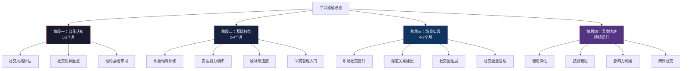
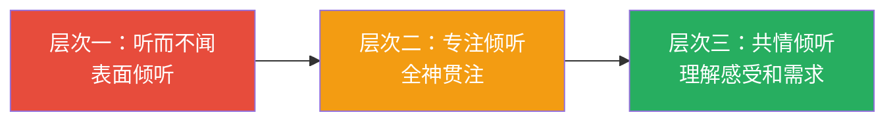
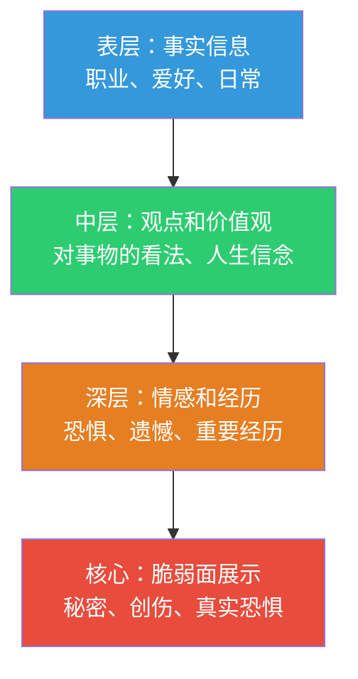
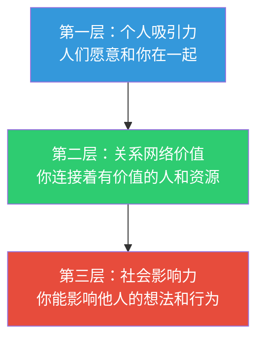

# 社交的学习路径

社交能力不是天赋，而是一套可以系统训练的技能组合。认知心理学家安德斯·埃里克森（Anders Ericsson）在"刻意练习"理论中指出：任何复杂技能的习得都需要明确的目标、即时的反馈、持续的练习和逐步提升的难度。社交能力完全符合这一模型——它由倾听、表达、共情、冲突管理等子技能构成，每一项都可以被拆解、训练和评估。

本节为你设计了一条从"社交小白"到"社交高手"的完整学习路径。这条路径基于"认知→技能→实践→精进"的四阶段模型，融合了社会心理学、认知行为疗法（CBT）、人际关系研究和大量实践案例。每个阶段都有明确的目标、具体的学习内容、可量化的检验标准和常见误区提醒。

***

## 一、为什么需要系统的学习路径

### 1.1 碎片化学习的陷阱

大多数人的社交能力提升是碎片化的：看了一篇"社交技巧"文章，学到几个话术，试了几次，效果不好就放弃了。这种方式的问题在于：

| 碎片化学习 | 系统化学习 |
|-----------|-----------|
| 只学技巧，不学原理 | 理解原理后，技巧自然涌现 |
| 东一榔头西一棒子 | 循序渐进，层层递进 |
| 遇到困难就放弃 | 有明确的阶段目标和支撑体系 |
| 只在舒适区练习 | 有意识地在学习区拓展 |
| 效果不可测量 | 有量化的评估和反馈机制 |

心理学家亚伯拉罕·马斯洛（Abraham Maslow）说过："如果你手里只有一把锤子，你会把所有问题都看成钉子。"碎片化的社交技巧就是那把锤子——它只能解决表面问题，无法构建真正的社交能力。

### 1.2 学习路径的设计原理

本学习路径的设计基于三个核心理论：

**维果茨基的"最近发展区"理论**：学习最有效发生在"当前能力"和"潜在能力"之间的区域。太简单的内容让人无聊，太难的内容让人焦虑。本路径的每个阶段都精确瞄准你的"最近发展区"，确保你始终在最有效的学习区间内。

**德雷福斯技能习得模型（Dreyfus Model）**：技能学习分为五个阶段——新手（依赖规则）→高级新手（开始识别情境）→胜任者（能制定计划）→精通者（凭直觉判断）→专家（无需思考就能行动）。本路径的四个阶段与这五个层次精确对应。

**库伯的经验学习圈（Kolb's Experiential Learning）**：真正的学习不是单向的"学→用"，而是循环的"具体经验→反思观察→抽象概念化→主动实验"。本路径在每个阶段都内建了这四个环节。



### 1.3 学习原则

在开始之前，请牢记以下原则，它们贯穿整个学习路径：

1. **循序渐进原则**：不要跳过基础阶段直接进入高级实践。就像盖房子，地基不牢，上面再漂亮也会塌。很多人社交失败不是因为技巧不够，而是因为基础能力（如倾听、共情）没有建立。
2. **学以致用原则**：每学一个概念或技能，必须在24小时内找到机会练习。认知科学表明，"学"和"用"之间的时间间隔越短，知识留存率越高——24小时内应用，留存率可达75%；超过一周不应用，留存率降至10%以下。
3. **刻意练习原则**：不是"多社交"就能提升，而是要针对弱项进行有目的的练习。每周社交10小时但没有反思和改进，不如每周社交3小时但每次都带着明确的练习目标。
4. **反馈驱动原则**：没有反馈的练习是盲目的练习。你需要建立多渠道的反馈机制——自我反思、朋友反馈、专业指导。
5. **耐心坚持原则**：社交能力的提升需要时间。心理学研究表明，养成一个新的行为习惯平均需要66天（不是广为流传的21天）。不要期望立竿见影，但也不要因为短期看不到效果就放弃。

***

## 二、阶段一：自我认知（第1-8周）

### 2.1 为什么从自我认知开始

社交能力的起点不是学习技巧，而是理解自己。认知行为疗法（CBT）的核心理念是：我们的想法（认知）决定了我们的感受和行为。如果你不了解自己的社交模式、触发点和盲区，学习再多技巧也只是表面功夫。

心理学家丹尼尔·戈尔曼（Daniel Goleman）在《情商》中指出：自我意识是情商的基石。一个不了解自己情绪模式的人，不可能有效管理自己在社交中的表现。

**阶段目标**：建立对自己的社交模式的清晰认知，明确优势、劣势和改进方向，为后续的技能训练打下坚实的认知基础。

### 2.2 第1-2周：社交风格评估

**核心任务**：通过科学测评和自我观察，绘制你的"社交画像"。

**步骤一：完成三套标准化测评**

| 测评工具 | 测评内容 | 推荐平台 | 参考价值 |
|---------|---------|---------|---------|
| MBTI人格类型 | 你的能量来源、信息处理方式、决策偏好、生活风格 | 16personalities.com | 了解你的社交倾向和盲区 |
| 大五人格测试 | 开放性、尽责性、外向性、宜人性、神经质 | truity.com/test/type/big-five | 科学性最强的人格模型，精准定位社交风格 |
| 成人依恋量表ECR | 你的依恋类型（安全型/焦虑型/回避型/混乱型）| 搜索"ECR亲密关系体验量表" | 理解你在亲密关系中的行为模式 |

**重要提示**：测评结果是参考，不是标签。MBTI的科学性在学术界有争议，但它作为自我探索的起点是有价值的。大五人格是目前心理学界公认最可靠的人格模型。依恋类型可以通过后续的关系经验发生改变（称为"习得性安全感"）。

**步骤二：完成社交自画像**

在完成测评后，花一个安静的下午，填写以下社交自画像。不要急于回答，每个问题至少思考5分钟：

```markdown
# 我的社交自画像

## 基本信息
- 姓名：______
- 日期：______

## 社交风格
1. 我的社交能量来源是：独处充电 / 社交充电 / 两者兼有
2. 我偏好的社交规模是：1对1 / 小团体(3-5人) / 中型聚会(6-15人) / 大型活动(15人以上)
3. 我偏好的沟通方式是：面对面 / 电话 / 文字消息 / 视频通话
4. 我在社交中的自然角色是：倾听者 / 引导者 / 活跃气氛者 / 观察者

## 优势与挑战
5. 我在社交中的三个优势：
   - 优势一：______ （举例说明：______）
   - 优势二：______ （举例说明：______）
   - 优势三：______ （举例说明：______）
6. 我在社交中的三个挑战：
   - 挑战一：______ （具体表现：______）
   - 挑战二：______ （具体表现：______）
   - 挑战三：______ （具体表现：______）

## 场景分析
7. 我最舒适的社交场景：______（为什么舒适：______）
8. 我最不舒适的社交场景：______（为什么不舒适：______）
9. 我最想改善的社交场景：______

## 关系模式
10. 我的依恋类型是：______
11. 在亲密关系中，我最常出现的问题是：______
12. 当关系出现冲突时，我的第一反应是：______

## 未来愿景
13. 我理想中的社交状态是：______
14. 一年后，我希望在社交方面达到的状态是：______
15. 我愿意为社交提升投入的精力是：每天______分钟，每周______小时
```

**步骤三：分析你的社交触发点**

社交触发点是指那些让你产生强烈情绪反应的社交情境。识别触发点是自我认知的关键一步。

用一周时间，每天记录至少一个社交触发点：

| 日期 | 触发情境 | 我的情绪反应 | 我的行为反应 | 强度(1-10) | 可能的原因 |
|------|---------|------------|------------|-----------|-----------|
| 例：周一 | 同事当众批评我的方案 | 愤怒、羞耻 | 沉默不语，后来在心里反复回想 | 8 | 害怕被否定，对公开批评敏感 |

### 2.3 第3-4周：社交现状盘点

**核心任务**：客观评估你当前的社交状况，找出最需要改善的领域。

**步骤一：绘制你的社交圈地图**

邓巴数（Dunbar's Number）是人类学家罗宾·邓巴提出的社会大脑假说的核心发现：人类能够维持的稳定社交关系数量约为150人，其中可以进一步分为四个同心圆。

拿出一张纸，画四个同心圆，从内到外填入你的人际关系：

| 层级 | 人数上限 | 关系特征 | 维护频率 | 你的人数 | 满意度(1-10) |
|------|---------|---------|---------|---------|-------------|
| 核心圈 | 5人 | 你愿意在凌晨3点打电话求助的人 | 每天或隔天 | ___人 | ___分 |
| 亲密圈 | 15人 | 你愿意分享个人秘密和情感的人 | 每周至少一次 | ___人 | ___分 |
| 朋友圈 | 50人 | 你愿意一起吃饭、参加活动的人 | 每月至少一次 | ___人 | ___分 |
| 认识的人 | 150人 | 你能认出名字和基本背景的人 | 每季度或更少 | ___人 | ___分 |

**分析要点**：

- **核心圈是否过空**：如果核心圈不到3人，说明你可能缺乏深度情感连接，这是需要优先改善的
- **亲密圈是否失衡**：如果亲密圈中同事占大多数，说明你的社交过度依赖工作场景
- **朋友圈是否活跃**：如果朋友圈中超过一半的人超过3个月没有联系，说明你的弱关系维护不足
- **整体满意度**：如果任何一层的满意度低于5分，那就是你需要重点改善的领域

**步骤二：分析你的社交时间分配**

用一周时间记录你的社交时间分配：

| 社交类型 | 每周时间 | 占比 | 理想占比 | 差距 |
|---------|---------|------|---------|------|
| 工作相关社交 | ___小时 | ___% | ___% | ___% |
| 家庭社交 | ___小时 | ___% | ___% | ___% |
| 朋友社交 | ___小时 | ___% | ___% | ___% |
| 陌生社交/拓展 | ___小时 | ___% | ___% | ___% |
| 线上社交 | ___小时 | ___% | ___% | ___% |
| 独处/恢复时间 | ___小时 | ___% | ___% | ___% |

**步骤三：确定优先改善领域**

基于以上分析，选择1-2个最需要改善的领域作为本学习路径的重点。选择标准：

1. **重要性**：这个领域对你的生活质量和幸福感影响最大
2. **紧迫性**：这个领域的问题如果不解决，会持续造成困扰
3. **可行性**：你目前有精力和条件去改善这个领域

### 2.4 第5-8周：理论基础学习

**核心任务**：建立社交心理学的基础知识框架，理解人际互动背后的原理。

**必读内容清单**：

| 学习主题 | 核心概念 | 推荐资源 | 学习时长 |
|---------|---------|---------|---------|
| 沟通基础 | 非暴力沟通四要素（观察-感受-需要-请求） | 《非暴力沟通》马歇尔·卢森堡 | 2周 |
| 人际吸引 | 首因效应、晕轮效应、相似性原则、接近性效应 | 《社会心理学》戴维·迈尔斯 第11章 | 1周 |
| 情绪智力 | 自我意识、自我管理、社会意识、关系管理 | 《情商》丹尼尔·戈尔曼 | 1周 |
| 依恋理论 | 安全型/焦虑型/回避型依恋的形成和影响 | 《依恋》阿米尔·莱文 | 1周 |
| 社会交换 | 关系的成本-收益分析、公平原则、承诺升级 | 《亲密关系》罗兰·米勒 第6章 | 1周 |

**学习方法**：不要只是"读"，要用以下方法深度学习：

1. **费曼学习法**：读完一个概念后，尝试用最简单的语言向一个假想的12岁小孩解释它。如果你解释不清楚，说明你还没真正理解。
2. **案例联想法**：每学一个概念，立刻回忆你生活中对应的例子。比如学了"首因效应"，回忆你对某人第一印象影响后续判断的经历。
3. **教是最好的学**：找一个朋友，把你学到的内容讲给他听。教学过程中暴露的理解漏洞是最有价值的学习机会。

### 2.5 阶段一检验标准

完成阶段一后，你必须能够自信地回答以下问题。如果任何一个答案是"不确定"或"不能"，请回到对应内容重新学习：

| 检验项 | 合格标准 | 你的答案 |
|-------|---------|---------|
| 社交风格 | 能用3句话清晰描述自己的社交风格 | ☐ 合格 ☐ 待提升 |
| 依恋类型 | 知道自己的依恋类型及其在关系中的具体表现 | ☐ 合格 ☐ 待提升 |
| 优势劣势 | 能列出3个优势（附具体例子）和3个挑战（附具体表现） | ☐ 合格 ☐ 待提升 |
| 社交圈现状 | 完成了社交圈地图，知道每层的满意度和改善方向 | ☐ 合格 ☐ 待提升 |
| 理论基础 | 能解释非暴力沟通四要素、首因效应、依恋类型、社会交换理论 | ☐ 合格 ☐ 待提升 |
| 提升目标 | 有明确的、可衡量的社交提升目标 | ☐ 合格 ☐ 待提升 |

**阶段一常见误区**：

- **误区一**："测评结果就是我的命运"——测评是起点，不是终点。人格是可以通过有意识的努力改变的
- **误区二**："我知道了就行，不用写下来"——书写是深度思考的工具，不写下来的认知是浅层的
- **误区三**："我了解自己了，可以直接学技巧"——理论基础不扎实，技巧就是无根之木

***

## 三、阶段二：基础技能（第9-24周）

### 3.1 为什么基础技能如此重要

社交能力的"基础技能"就像建筑的地基。你可能见过那种一开口就很尴尬的人——不是因为他不懂"高级技巧"，而是因为他的基础技能（如倾听、基本表达）有严重缺陷。

社会心理学家约翰·戈特曼（John Gottman）通过长达40年的婚姻研究发现：决定关系质量的不是"高深的沟通技巧"，而是最基础的互动模式——积极回应 vs 消极回应的比例。当正面互动与负面互动的比例低于5:1时，关系就处于危险区。

**阶段目标**：掌握倾听、表达、破冰、冲突管理四项核心基础技能，使其成为你的"默认反应模式"而非需要刻意调用的"特殊技能"。

### 3.2 第9-12周：积极倾听训练

**为什么倾听是第一项技能**：哈佛商学院的研究表明，在人际互动中，被认为"善于倾听"的人比被认为"善于表达"的人更受欢迎、更容易获得信任。倾听是社交能力的基础中的基础。

**倾听能力的三个层次**：



| 层次 | 表现 | 常见行为 | 对方感受 |
|------|------|---------|---------|
| 听而不闻 | 身体在场，心思不在 | 玩手机、心不在焉、急于转移话题 | "他根本不在乎我说什么" |
| 专注倾听 | 全神贯注听内容 | 保持眼神接触、点头、不打断 | "他在认真听我说" |
| 共情倾听 | 听到内容背后的感受和需求 | 回应情绪、确认感受、不急于给建议 | "他真正理解我" |

**四周训练计划**：

**第1周：专注倾听基础训练**

每天进行一次"全神贯注倾听"练习。选择一个你每天都会进行的对话场景（如和同事聊天、和家人吃饭时的对话）。

练习要点：
- 全程保持眼神接触（不是死盯，而是自然地注视对方的眼睛或面部三角区）
- 手机静音并放进口袋或包里（不是翻面放在桌上——研究表明，仅仅是手机的"存在"就会降低对话质量，这被称为"iPhone效应"）
- 不打断对方——即使你不同意、即使你有更好的观点、即使你已经知道对方要说什么
- 用身体语言表示在听：点头、前倾、适当的表情反应
- 对方说完后，停顿2-3秒再回应（这个停顿非常重要，它让对方知道你在消化他说的内容）

**第2周：反映式倾听训练**

反映式倾听（Reflective Listening）是心理咨询师的核心技能之一。它的做法是：用自己的话复述对方的观点和感受，确认你的理解是否正确。

模板：
- "你的意思是……对吗？"
- "听起来你感到……是因为……？"
- "我理解你的感受，你觉得……是这样吗？"

每天至少练习3次反映式倾听。注意：不要鹦鹉学舌般地重复对方的话，而是用你自己的语言重新表达。

**第3周：深度倾听——听出"弦外之音"**

人们说的话和真正想表达的意思之间往往有差距。深度倾听的核心是：不仅听"说了什么"，还要听"没说什么"以及"怎么说的"。

练习要点：
- 注意对方的语气、语速、音量变化（这些比语言本身更能反映真实情绪）
- 注意对方回避了什么话题（回避本身就是一种信息）
- 注意对方的肢体语言（交叉双臂、避免眼神接触、坐立不安等）
- 练习提问来确认你的理解："我注意到你提到XX时语气变了，是有什么特别的感受吗？"

**第4周：倾听中的情绪验证**

情绪验证（Emotional Validation）是倾听的最高级形式。它的核心是：让对方知道他的感受是合理的、被理解的、被接纳的。

情绪验证的六个层次（由浅到深）：

1. **在场**：身体和注意力都在对方身上
2. **准确反映**：准确识别并表达对方的感受
3. **读出未说的**：察觉对方没有直接表达的感受
4. **基于历史的理解**：用对方的过去经历来理解当前感受
5. **正常化**：让对方知道他的感受在当前情境下是完全正常的
6. **真诚对待**：以完全平等的态度对待对方的感受，不评判、不贬低

**练习**：每天找一个机会，对某人进行一次完整的情绪验证。比如朋友抱怨工作压力大，不要说"别想太多"（这是无效回应），而是说"听起来你最近工作压力确实很大，连续加班加上领导的要求，换了谁都会觉得累"（这是有效的情绪验证）。

**倾听练习记录表**：

| 日期 | 对话对象 | 场景 | 倾听层次 | 使用技巧 | 对方反应 | 自评(1-10) | 反思与改进 |
|------|---------|------|---------|---------|---------|-----------|-----------|
| | | | ☐专注 ☐反映 ☐深度 ☐情绪验证 | | | | |
| | | | ☐专注 ☐反映 ☐深度 ☐情绪验证 | | | | |

### 3.3 第13-16周：表达能力训练

**为什么表达排在倾听之后**：只有当你学会了倾听——理解他人——你才能知道如何有效地表达。不先学会听，你的表达就是"自说自话"。

**表达能力的四个维度**：

| 维度 | 定义 | 常见问题 | 训练方法 |
|------|------|---------|---------|
| 清晰性 | 能否让人准确理解你的意思 | 说话含糊、逻辑混乱、重点不明 | 结构化表达练习（PREP法） |
| 真诚性 | 表达是否真实反映你的想法和感受 | 讨好性表达、压抑真实想法 | 自我表露练习 |
| 恰当性 | 表达方式是否适合当前情境 | 不分场合的直率、过度委婉 | 情境判断练习 |
| 建设性 | 表达是否有助于解决问题 | 只抱怨不提解决方案 | NVC四步骤练习 |

**四周训练计划**：

**第1-2周：非暴力沟通（NVC）四步骤**

非暴力沟通是由马歇尔·卢森堡（Marshall Rosenberg）博士开发的沟通方法。它的核心是：区分观察和评判、识别感受和需要、提出具体请求。大量研究表明，NVC可以显著减少冲突、增进理解。

四步骤详解：

| 步骤 | 含义 | 错误示范 | 正确示范 |
|------|------|---------|---------|
| 观察 | 客观描述事实，不带评判 | "你总是迟到" | "这周你有三次在9:30之后到" |
| 感受 | 表达你的真实情绪 | "我觉得你不尊重我"（这是想法不是感受） | "我感到焦虑和不被重视" |
| 需要 | 说出感受背后的深层需求 | "你能不能别这样" | "我需要感受到我们的时间都被尊重" |
| 请求 | 提出具体、可执行的请求 | "你以后注意点" | "你能在9:00之前到吗？如果会迟到，能提前告诉我吗？" |

**练习方法**：每天选择一个日常互动，用NVC四步骤来表达。第一周先练习"观察"——学会区分事实和评判。第二周练习完整的四步骤。

一个完整的NVC表达示例：
> "当你说'这个方案不行'的时候（观察），我感到沮丧和困惑（感受），因为我需要了解具体的改进方向（需要）。你能告诉我具体哪些部分需要修改吗？（请求）"

**第3周：自我表露训练**

自我表露（Self-Disclosure）是建立深度关系的核心机制。社会心理学家阿尔特曼和泰勒（Altman & Taylor）的"社会渗透理论"指出：关系的发展就是自我表露逐渐深入的过程——从表层信息（兴趣爱好）到中层信息（价值观、观点）再到深层信息（恐惧、创伤、秘密）。

自我表露的递进层次：



**自我表露的原则**：
- **对等原则**：表露的深度应与对方的表露深度大致匹配。对方只聊天气，你就大谈童年创伤，会让对方不适
- **渐进原则**：从浅到深，逐步递进。不要一开始就进行深层表露
- **观察反馈**：如果对方表现出不适（转移话题、身体后倾、简短回应），说明你的表露深度超过了当前关系的舒适区
- **选择对象**：不是所有人都值得你进行深层表露。选择那些已经表现出信任和接纳的人

**练习**：每周与一个朋友进行一次"更深一层"的分享。比如从"我周末去爬山了"升级到"我发现爬山的时候是我最放松的时候，平时工作压力大的时候就很想逃到山里去"。

**第4周：表达欣赏与感激**

心理学家约翰·戈特曼的研究发现：在健康的关系中，正面互动与负面互动的比例至少为5:1。表达欣赏和感激是增加正面互动最简单、最有效的方式。

有效的欣赏表达公式：
> **具体行为 + 产生的影响 + 你的感受**
> 例："你今天帮我审了那个方案（具体行为），让我少走了很多弯路（影响），我真的很感激有你这样的同事（感受）。"

无效的欣赏：
> "你真好"（太笼统）、"干得不错"（太敷衍）

**练习**：每天真诚地对一个人表达一次具体的欣赏。坚持一周，你会发现你的人际关系质量有明显提升。

**社交日记模板**：

```markdown
# 社交日记
日期：______

## 今日主要社交互动

### 互动一
- 对象：______
- 场景：______
- 持续时间：______
- 我使用了哪些技巧：______
- 对方的反应：______
- 我的感受：______
- 做得好的地方：______
- 可以改进的地方：______

### 互动二（可选）
- ......

## 今日反思
- 最有收获的社交互动是：______
- 最需要改进的地方是：______
- 明天的社交练习目标：______
```

### 3.4 第17-20周：破冰与建立连接

**为什么破冰是一项需要专门训练的技能**：很多人认为"会聊天"是天生的，其实不然。破冰和开场对话是一套可以学习和训练的技能。社会心理学研究表明，人们在初次互动的前7秒就会形成对你的初步印象（首因效应），而这个印象会在很长时间内影响后续的互动。

**破冰的五种策略**：

| 策略 | 适用场景 | 示例 | 优势 | 风险 |
|------|---------|------|------|------|
| 环境评论 | 任何公共场合 | "这个咖啡馆的装修挺有意思的" | 自然、无压力 | 可能得到简短回应 |
| 真诚赞美 | 任何场合 | "你这个背包很好看，在哪买的？" | 让对方心情好 | 过度会显得刻意 |
| 共同点发现 | 有共同背景的场合 | "你也在用这款笔记本？我也用" | 快速建立连接感 | 需要观察力 |
| 求助式开场 | 对方可能有你需要的信息 | "你知道这附近有好餐厅推荐吗？" | 给对方价值感 | 不要过度使用 |
| 直接介绍 | 社交活动、聚会 | "你好，我是XX，第一次参加这个活动" | 简单直接 | 需要一定自信 |

**记住别人名字的技巧**：

名字是社交中最甜蜜的声音——戴尔·卡耐基的这句话至今仍然是社交金律。但大多数人都有"名字健忘症"。以下是经过验证的记忆技巧：

1. **重复法**：对方说出名字后，立刻在对话中使用至少3次。"你好李明……李明你是做什么工作的？……原来是这样，李明你这个想法很有意思"
2. **关联法**：把名字和一个你熟悉的事物关联。比如"李明"→联想"黎明"→想象日出的画面
3. **书写法**：对话结束后，立刻在手机备忘录里记下"李明-戴眼镜-做产品经理-在XX公司-对摄影感兴趣"
4. **面孔锚定法**：把名字和对方的一个面部特征关联。比如"王强-浓眉"→"浓眉大强"

**建立连接的深层技巧**：

破冰只是开始，真正的目标是建立连接。建立连接的关键是找到"共鸣点"——让对方感到"这个人理解我"。

寻找共鸣点的四个方向：
1. **共同经历**：都在某个城市生活过、都经历过类似的职场困境、都有相同的兴趣爱好
2. **共同价值观**：对某件事有相似的看法、有相同的人生追求
3. **共同挑战**：面临类似的困难、有相同的困惑
4. **情感共鸣**：对对方的经历表示真正的理解和共情

### 3.5 第21-24周：冲突管理入门

**为什么冲突管理是基础技能而非高级技能**：很多人把"不发生冲突"当作社交能力强的表现，这是一个严重的误区。心理学家约翰·戈特曼的研究明确表明：健康的关系不是没有冲突的关系，而是能够建设性地处理冲突的关系。回避冲突反而会导致关系的慢性恶化。

**冲突处理的五种风格**（托马斯-基尔曼模型）：

| 风格 | 特征 | 适用场景 | 不适用场景 |
|------|------|---------|-----------|
| 竞争 | 坚持自己的立场，不顾对方 | 紧急决策、原则性问题 | 需要维护关系的场景 |
| 回避 | 退出或忽略冲突 | 问题不重要、需要冷静时间 | 重要问题需要解决时 |
| 妥协 | 双方各让一步 | 时间紧迫、需要临时方案 | 有更好解决方案时 |
| 迁就 | 优先满足对方需求 | 对方更重要、维护关系优先 | 自己的核心利益受损时 |
| 合作 | 寻找双方都满意的方案 | 问题重要、关系重要、有时间 | 紧急情况、对方不配合时 |

**识别你的默认冲突风格**：回想你最近3次冲突的经历，你用了哪种风格？大多数人都有一个默认风格，而这个默认风格不一定总是最合适的。

**冲突中的"杏仁核劫持"管理**：

"杏仁核劫持"是丹尼尔·戈尔曼提出的概念：当我们感到威胁时，大脑的杏仁核（负责情绪反应的部分）会"劫持"我们的理性思维，导致我们做出非理性的行为——大喊大叫、说出伤人的话、完全关闭沟通。

应对策略：

1. **识别信号**：心跳加速、肌肉紧绷、呼吸变浅、思维变窄——这些都是杏仁核劫持的前兆
2. **暂停技术**：当识别到信号时，说"我需要5分钟冷静一下"，然后离开现场做深呼吸（4秒吸气-7秒屏气-8秒呼气）
3. **认知重评**：问自己"5年后这件事还重要吗？"、"对方真的是在攻击我吗？还是我过度解读了？"
4. **回来继续**：冷静后回到对话中，用"我"语言表达你的感受和需要

**"我"语言 vs "你"语言**：

| "你"语言（指责性） | "我"语言（表达性） |
|-------------------|-------------------|
| "你从来不听我说话" | "我感到不被重视，当我说话的时候你看着手机" |
| "你太自私了" | "我需要在做决定时被考虑进去" |
| "你怎么又迟到了" | "等待的时候我会感到焦虑" |
| "你总是批评我" | "当你指出我的问题时，我希望能先听到你认可的部分" |

### 3.6 阶段二检验标准

| 检验项 | 合格标准 | 你的答案 |
|-------|---------|---------|
| 倾听 | 能够在日常对话中自然运用积极倾听，朋友反馈"和你聊天很舒服" | ☐ 合格 ☐ 待提升 |
| NVC表达 | 能够用非暴力沟通四步骤表达冲突性需求 | ☐ 合格 ☐ 待提升 |
| 自我表露 | 能够根据关系深度进行恰当的自我表露 | ☐ 合格 ☐ 待提升 |
| 破冰 | 能够在社交场合主动与陌生人开启对话 | ☐ 合格 ☐ 待提升 |
| 记名字 | 在初次见面后能记住对方的名字和关键信息 | ☐ 合格 ☐ 待提升 |
| 冲突管理 | 能够在冲突中使用"我"语言，避免杏仁核劫持 | ☐ 合格 ☐ 待提升 |
| 社交日记 | 养成了每天记录社交反思的习惯 | ☐ 合格 ☐ 待提升 |

**阶段二常见误区**：

- **误区一**："倾听就是不说话"——倾听不只是沉默，还需要适时的回应、确认和反馈
- **误区二**："NVC太假了，正常人不这样说话"——NVC的四步骤是训练工具，熟练后会内化为自然的表达方式，不需要每次都机械地走四步
- **误区三**："冲突都是坏事"——回避冲突才是关系的慢性毒药，关键是要学会建设性地处理冲突
- **误区四**："破冰就是要说有趣的话"——破冰的核心是表达真诚的兴趣，不是表演

***

## 四、阶段三：场景实践（第25-48周）

### 4.1 为什么要分场景练习

基础技能是"通用能力"，但社交场景是多样的——你在职场中的社交方式和在约会中的社交方式完全不同。就像学英语，你掌握了基本语法（基础技能），但在不同场景（商务会议、日常聊天、学术讨论）中需要不同的表达方式。

**阶段目标**：将基础技能应用到具体的社交场景中，在职场社交、深度关系建设、社交圈拓展和社交能量管理四个方面建立稳定的实践模式。

### 4.2 第25-28周：职场社交提升

**职场社交的特殊性**：职场社交不同于一般社交，它有明确的权力结构、利益关系和组织文化约束。你需要在"做自己"和"适应环境"之间找到平衡。

**向上管理**：与上级建立良好的工作关系

向上管理不是讨好或拍马屁，而是主动管理你和上级之间的信息流、期望和信任。管理学大师彼得·德鲁克（Peter Drucker）说过："你和老板的关系是你职业生涯中最重要的单一关系。"

向上管理的四个核心策略：
1. **理解上级的目标和压力**：你的上级也有他的上级、他的KPI和他的焦虑。理解这些，你才能成为他的"解决方案"而非"问题"
2. **主动沟通，不要等被问**：定期向上级汇报进展，而不是等他来问。坏消息要早说，好消息要确认后再报
3. **管理期望**：承诺时留有余地，交付时超出预期。不要为了表现而过度承诺
4. **提出问题时附带解决方案**：不要只把问题扔给上级，带着至少一个解决方案去讨论

**跨部门协作**：建立跨部门的人际网络

跨部门协作能力是职场晋升的关键因素之一。组织行为学研究表明，在组织中拥有广泛"弱关系"的人更容易获得信息、资源和晋升机会（这与格兰诺维特的"弱关系的力量"理论一致）。

实操建议：
- 主动参加跨部门的项目或委员会
- 在公司内部的非正式场合（如午餐、茶歇）与其他部门的人交流
- 了解其他部门的工作内容和挑战，找到协作的共同利益点
- 建立"人情账户"——主动帮助其他部门的人，不求即时回报

**行业社交**：扩展行业人脉

| 行动 | 频率 | 具体做法 | 目标 |
|------|------|---------|------|
| 行业会议/论坛 | 每季度至少1次 | 提前研究嘉宾和参会者，准备3个有深度的问题 | 每次活动认识3-5个有价值的新联系人 |
| 线上社群 | 每周参与 | 在行业社群中分享有价值的见解，不只是潜水 | 成为社群中被认可的贡献者 |
| 一对一面谈 | 每月2-3次 | 约行业内的同行或前辈喝咖啡聊天 | 建立深度的行业人脉关系 |

### 4.3 第29-36周：深度关系建设

**什么是深度关系**：深度关系不是"关系好的人"，而是那些你在脆弱时可以依靠、在喜悦时可以分享、在冲突时可以坦诚面对的人。心理学家雪莉·特克尔（Sherry Turkle）在《群体性孤独》中警告：在社交媒体时代，我们可能拥有数百个"朋友"，却比以往任何时候都更加孤独。

**深度关系的五个要素**（基于约翰·戈特曼的研究）：

1. **了解**：你知道对方的梦想、恐惧、价值观和人生故事
2. **关心**：你关注对方的幸福，并愿意为此付出行动
3. **信任**：你相信对方会在你脆弱时支持你，而不是利用你的脆弱
4. **承诺**：你愿意为这段关系投入时间和精力，即使在困难时期
5. **互惠**：关系是双向的，给予和接受大致平衡

**亲密关系中的"爱的五种语言"**（加里·查普曼）：

| 爱的语言 | 含义 | 示例 | 如何发现对方的语言 |
|---------|------|------|-------------------|
| 肯定的言辞 | 用语言表达爱和欣赏 | "我为你感到骄傲"、"你做得真好" | 对方是否经常赞美你？是否在意你的评价？ |
| 精心的时刻 | 全心全意的陪伴 | 一起散步、深度对话、共同做一件事 | 对方是否抱怨你不够关注？是否喜欢一起做事？ |
| 接受礼物 | 用心的礼物表达爱 | 不在于价格，在于心意和时机 | 对方是否珍视你送的小礼物？是否经常提到收到的礼物？ |
| 服务的行动 | 用行动表达关心 | 帮对方做事、分担家务、解决困难 | 对方是否感激你为他做的事？ |
| 身体接触 | 通过身体接触表达亲密 | 拥抱、牵手、拍肩 | 对方是否喜欢肢体接触？ |

**练习**：与你的伴侣/亲密朋友一起做"爱的语言测试"（5lovelanguages.com），了解彼此的主要爱的语言。然后有意识地用对方的语言来表达爱意。

### 4.4 第37-40周：社交圈拓展

**弱关系的强大力量**：社会学家马克·格兰诺维特（Mark Granovetter）的经典研究"弱关系的力量"（The Strength of Weak Ties）发现：在找工作、获取新信息、接触新机会方面，弱关系（不太熟的人）比强关系（亲密朋友）更有价值。这是因为你的亲密朋友和你处于同一个社交圈，他们知道的信息你大概率也知道；而弱关系连接着你未曾触及的社交网络。

**社交投资组合**：

像管理投资组合一样管理你的社交关系——不要把所有时间和精力都投入到一种类型的关系中。

| 关系类型 | 时间分配建议 | 维护方式 | 价值 |
|---------|------------|---------|------|
| 核心关系(5人) | 50% | 深度陪伴、主动关心、困难时支持 | 情感安全、人生意义 |
| 重要关系(15人) | 25% | 定期联系、分享生活、互相帮助 | 日常支持、成长伙伴 |
| 弱关系(50-150人) | 15% | 社交媒体互动、节日问候、偶而约见 | 信息、机会、视野 |
| 新关系(潜在) | 10% | 参加新活动、主动破冰、交换联系方式 | 新的可能性 |

### 4.5 第41-44周：社交能量管理

**社交能量模型**：

内向者和外向者的根本区别不在于"是否害羞"或"是否健谈"，而在于社交对能量的影响：
- **外向者**：社交充电，独处消耗
- **内向者**：独处充电，社交消耗
- **双向者（Ambivert）**：在两种状态之间灵活切换

大多数人并非纯粹的内向或外向，而是在一个光谱上的某个位置。

**社交能量管理的四步法**：

1. **识别**：什么社交活动给你充电？什么社交活动消耗你？用一周时间记录你的能量变化
2. **设计**：根据你的能量模式设计社交节奏。比如如果你是内向者，不要在同一天安排多个社交活动
3. **保护**：学会说"不"。拒绝那些会过度消耗你但价值不高的社交邀请
4. **恢复**：在高强度社交活动后，安排恢复时间。比如参加了一个大型聚会后，第二天给自己留出独处时间

### 4.6 第45-48周：阶段三整合与优化

**社交实践周记模板**：

```markdown
# 社交实践周记
第____周  日期：______

## 本周社交概况
- 主要社交活动：______
- 社交总时长：______小时
- 新认识的人数：______人
- 深度交流的次数：______次

## 技能应用
- 倾听技能使用：______（具体场景和效果）
- 表达技能使用：______（具体场景和效果）
- 破冰技能使用：______（具体场景和效果）
- 冲突管理使用：______（具体场景和效果）

## 本周最大收获
______

## 本周最大挑战
______

## 下周改进计划
______
```

### 4.7 阶段三检验标准

| 检验项 | 合格标准 | 你的答案 |
|-------|---------|---------|
| 职场社交 | 与上级的沟通更主动，有至少1个跨部门合作关系 | ☐ 合格 ☐ 待提升 |
| 深度关系 | 核心圈关系质量有明显提升，至少1段关系更深入 | ☐ 合格 ☐ 待提升 |
| 社交圈拓展 | 社交圈有所扩大，每月认识3-5个新朋友 | ☐ 合格 ☐ 待提升 |
| 能量管理 | 清楚自己的社交能量模式，有稳定的社交节奏 | ☐ 合格 ☐ 待提升 |
| 综合应用 | 能够在不同场景中灵活切换社交策略 | ☐ 合格 ☐ 待提升 |

***

## 五、阶段四：深度精进（第49周起，持续提升）

### 5.1 从"胜任者"到"精通者"

到达阶段四，你已经具备了扎实的基础技能和丰富的实践经验。现在的目标是：将这些能力内化为自然的直觉反应，从"有意识地使用技巧"进化到"无意识地展现能力"。

德雷福斯模型中的"精通者"和"专家"的区别在于：精通者能够凭直觉识别情境并做出恰当反应，而专家不仅能够直觉反应，还能在全新情境中创造性地解决问题。

### 5.2 理论深化方向

| 方向 | 推荐阅读 | 核心收获 |
|------|---------|---------|
| 影响力与说服 | 《影响力》罗伯特·西奥迪尼 | 六大影响力原则（互惠、承诺一致、社会认同、喜好、权威、稀缺） |
| 社交心理学前沿 | 《社会性动物》埃利奥特·阿伦森 | 深入理解态度改变、偏见、群体动力学 |
| 非语言沟通 | 《无声的语言》爱德华·霍尔 | 理解空间距离、时间观念、肢体语言的文化差异 |
| 领导力与影响力 | 《从优秀到卓越》吉姆·柯林斯 | 第五级领导力——谦逊与意志的结合 |
| 跨文化沟通 | 《文化的冲突》霍夫斯泰德 | 文化维度理论——理解不同文化中的社交规范差异 |
| 神经科学与社交 | 《社交天性》马修·利伯曼 | 从脑科学角度理解人类为什么是"社交动物" |

### 5.3 高级技能精进

**公众演讲**：

公众演讲是社交能力的"放大器"——它让你的社交影响力从一对一扩展到一对多。加入Toastmasters国际演讲俱乐部是经过验证的系统训练方式。

Toastmasters的学习路径（Pathways）：
- 入门级：克服紧张、基本演讲结构
- 进阶级：即兴演讲、幽默运用、讲故事
- 高级：说服性演讲、领导力沟通、培训技巧

**谈判技能**：

每一次社交互动都包含某种程度的"谈判"——从决定去哪吃饭到商谈薪资。哈佛谈判项目的经典著作《谈判力》（Getting to Yes）提出了四个原则：
1. 把人和问题分开
2. 关注利益而非立场
3. 创造双赢选项
4. 坚持使用客观标准

**教练式沟通**：

教练式沟通（Coaching Communication）是最高级的沟通形式。它不是给建议、不是指导，而是通过提问帮助对方自己找到答案。

核心提问框架（GROW模型）：
- **Goal（目标）**：你想要什么？
- **Reality（现状）**：现在的情况是怎样的？
- **Options（选择）**：你有哪些可能的选择？
- **Will（意愿）**：你决定怎么做？什么时候开始？

### 5.4 构建社交影响力

社交影响力的三个层次：



**成为连接者**：社交网络中最有价值的不是认识人最多的人，而是连接着不同社交圈的人——社会学家称之为"结构洞"（Structural Holes）。占据结构洞位置的人能够获得最多的信息和机会。

成为连接者的方法：
1. 主动认识不同行业、不同背景的人
2. 当你发现两个人可能互相受益时，主动介绍他们认识
3. 在社群中成为活跃的组织者和贡献者
4. 建立"给予者"心态——先帮助别人，不求即时回报

### 5.5 阶段四长期发展计划

| 时间框架 | 发展重点 | 具体行动 |
|---------|---------|---------|
| 持续 | 阅读深化 | 每月至少读一本社交/心理相关书籍 |
| 每季度 | 技能精进 | 选择一个高级技能进行专项训练 |
| 每半年 | 社交复盘 | 全面审视社交网络，优化社交投资组合 |
| 每年 | 方向调整 | 根据人生阶段和目标调整社交策略 |

***

## 六、每日社交练习系统

### 6.1 微习惯设计

行为科学家BJ·福格（BJ Fogg）的"微习惯"理论指出：行为改变的关键是让行动足够小，小到不需要意志力。以下练习被设计为"微习惯"——每天只需10-15分钟，但坚持执行会产生复利效应。

**每日必做（10-15分钟）**：
1. **一次真诚赞美**：每天对一个人表达具体的欣赏（用"行为+影响+感受"公式）
2. **一次深度倾听**：在一次对话中，全身心投入倾听（不看手机、不打断、反映式回应）
3. **5分钟社交反思**：回顾今天最重要的一次社交互动，思考"做得好的"和"可以改进的"
4. **一次社交日记记录**：简短记录今天的社交亮点和反思

**每周选做（1-2小时）**：
1. **一次主动社交**：约一个朋友或同事吃饭/喝咖啡
2. **一次社交练习**：刻意练习一个特定技能（如破冰、NVC表达）
3. **一章阅读**：阅读社交/心理相关书籍的一个章节
4. **2-3个关系维护**：给几个重要的人发一条关心的消息

**每月必做（半天）**：
1. **深度反思**：回顾本月的社交进展，评估各项能力的提升
2. **社交圈盘点**：审视社交投资组合，是否有失衡
3. **新场景尝试**：参加一个新的社交活动或社群
4. **社交自画像更新**：更新你的社交自画像，看看有没有变化

**每季度必做（一天）**：
1. **全面复盘**：对照阶段检验标准，全面评估进展
2. **策略调整**：根据实际情况调整学习路径和社交策略
3. **关系清理**：整理社交网络，决定哪些关系需要投入更多、哪些可以放手
4. **下一季度计划**：制定下一季度的社交发展目标和行动计划

***

## 七、内向者的特别学习路径

### 7.1 重新理解"内向"

内向不是缺陷，不是社交恐惧，更不是需要"治愈"的心理问题。心理学家马蒂·兰尼（Marti Laney）在《内向者优势》中指出：内向是一种与生俱来的气质类型，约占人口的30%-50%。内向者的大脑对多巴胺更敏感，因此不需要太多的外部刺激就能感到满足；而外向者需要更多的外部刺激来达到同样的满足感。

内向者的核心优势：
- **深度思考**：内向者更擅长深入分析和反思
- **倾听能力**：内向者天然是优秀的倾听者
- **真诚关系**：内向者倾向于建立少而精的深度关系
- **独立能力**：内向者不依赖外部认可来获得自我价值感
- **观察力**：内向者更善于观察细节和非语言信号

### 7.2 各阶段调整建议

| 阶段 | 标准路径 | 内向者调整 |
|------|---------|-----------|
| 自我认知 | 做多种测评 | 重点理解内向特点和优势，不要把内向当问题 |
| 基础技能 | 大量社交练习 | 从一对一练习开始，利用文字沟通作为练习起点 |
| 场景实践 | 多种场景 | 优先选择小规模、深度的社交场景 |
| 深度精进 | 广泛拓展 | 利用深度思考优势，在特定领域建立专家影响力 |

### 7.3 内向者的七个社交原则

1. **接受自己**：你不需要变成外向者才能拥有良好的社交关系。社会对"外向"的偏好是一种文化偏见，不是事实
2. **深度优先**：内向者通常在深度关系中表现更好。与其追求认识100个人，不如深化10段重要的关系
3. **能量管理**：社交活动前后安排独处时间来充电。把社交能量当作有限资源来管理
4. **选择场景**：一对一的深度交流、小团体活动、书面沟通等方式可能比大型社交活动更适合你
5. **利用线上社交**：文字沟通给了你更多思考的时间，可以作为面对面社交的补充和练习场
6. **设定边界**：学会拒绝那些过度消耗你的社交邀请。保护自己的能量不是自私，是必要的自我照顾
7. **发挥优势**：倾听、深度思考、真诚——这些在社交中都是极其宝贵的优势，比"能说会道"更有价值

### 7.4 内向者的社交能量管理工具

```markdown
# 社交能量记录表

| 活动类型 | 能量影响(-5到+5) | 时长 | 恢复所需时间 | 备注 |
|---------|-----------------|------|------------|------|
| 1对1深度对话 | | | | |
| 小团体聚会(3-5人) | | | | |
| 大型聚会(10人以上) | | | | |
| 职场会议 | | | | |
| 电话/视频通话 | | | | |
| 线上社群互动 | | | | |
| 独处/阅读/散步 | | | | |
```

用一周时间填写这个表格，你就会清楚地看到哪些活动给你充电、哪些活动消耗你。然后据此设计你的社交节奏。

***

## 八、社交焦虑专项应对

### 8.1 识别社交焦虑

社交焦虑不是"害羞"，它是一种真实的心理困扰。根据《精神障碍诊断与统计手册》（DSM-5），社交焦虑障碍的核心特征是：对一个或多个社交情境的显著恐惧或焦虑，在这些情境中个体可能被他人审视。

常见的社交焦虑表现：
- 在社交场合感到极度紧张、心跳加速、出汗
- 过度担心自己会出丑或被负面评价
- 回避社交场合或在社交场合中保持沉默
- 社交后反复回想自己的表现，进行自我批评
- 在社交前就开始焦虑（预期焦虑）

**自我评估**：如果你的社交焦虑严重影响了你的日常生活、工作或关系，建议寻求专业心理咨询师的帮助。以下自助方法适用于轻度到中度的社交焦虑。

### 8.2 认知重构

社交焦虑的核心是"负面自动思维"——大脑会自动生成关于社交场景的灾难性预测。认知行为疗法（CBT）的核心技术"认知重构"可以帮助你识别和挑战这些思维。

常见的社交焦虑认知扭曲：

| 认知扭曲 | 示例 | 理性替代 |
|---------|------|---------|
| 读心术 | "他们一定觉得我很无聊" | "我不知道他们在想什么，也许他们正在认真听" |
| 灾难化 | "如果我说错话，所有人都会嘲笑我" | "即使说错了，大多数人也不会太在意" |
| 非黑即白 | "这次社交要么完美，要么就是失败" | "社交不需要完美，有一点尴尬也是正常的" |
| 过度概括 | "上次聚会我说错话了，我不适合社交" | "一次失误不代表我社交能力差" |
| 忽视积极面 | "虽然有人说喜欢和我聊天，但那次我说错话了" | "有人喜欢和我聊天，说明我有社交吸引力" |

**练习**：当你感到社交焦虑时，用以下步骤进行认知重构：
1. **识别**：我在想什么？（写下自动思维）
2. **评估**：这个想法的证据是什么？支持和反对的证据分别是什么？
3. **替代**：更平衡、更现实的想法是什么？
4. **行动**：基于新的想法，我可以怎么做？

### 8.3 渐进暴露训练

暴露疗法是治疗焦虑最有效的方法之一。核心原理是：通过逐步、系统地接触你害怕的情境，你的焦虑反应会逐渐降低（这个过程叫做"习惯化"）。

建立你的"社交焦虑阶梯"：

| 焦虑等级(1-10) | 社交情境 | 暴露练习计划 | 完成日期 |
|---------------|---------|------------|---------|
| 3 | 在商店和店员聊天 | 每次购物时和店员多聊一句 | |
| 4 | 在电梯里和陌生人打招呼 | 每天在电梯里至少和一个人打招呼 | |
| 5 | 在会议上发表一个简短观点 | 下次会议至少发言一次 | |
| 6 | 主动约不太熟的同事吃午饭 | 本周约一次 | |
| 7 | 在社交活动中主动与陌生人交谈 | 下次活动和至少两个陌生人聊天 | |
| 8 | 在大型会议上做正式发言 | 准备并执行一次正式演讲 | |
| 9 | 在社交场合做主持人/组织者 | 主持一次小型聚会或活动 | |

**暴露练习原则**：
- 从低焦虑等级开始，逐步升级
- 每个等级重复练习直到焦虑明显下降（通常需要3-5次）
- 不要在暴露过程中使用"安全行为"（如一直看手机来缓解紧张）
- 练习后记录你的焦虑水平，你会发现它比你预期的低得多

***

## 九、数字化社交指南

### 9.1 线上社交的特殊规则

在数字时代，大量社交发生在微信、社交媒体和各种线上平台上。线上社交有自己的规则和陷阱。

**微信社交礼仪**：

| 场景 | 正确做法 | 错误做法 |
|------|---------|---------|
| 加好友 | 说明你是谁、怎么认识的、为什么加 | 不加任何说明直接加 |
| 发消息 | 考虑对方的时间，工作时间外慎发 | 半夜发消息、连续发送多条 |
| 语音消息 | 先问"方便听语音吗"？长语音要分段 | 动辄60秒长语音、连续发多条 |
| 朋友圈互动 | 真诚评论，不要只点赞 | 群发点赞、刷屏评论 |
| 群聊参与 | 发有价值的内容，回复相关话题 | 刷屏、发广告、自说自话 |

**社交媒体使用原则**：
1. **展示真实自我**：不要过度美化，真实比完美更有吸引力
2. **质量高于数量**：发10条高质量的内容比发100条水帖更有价值
3. **双向互动**：不要只发不互动，社交是双向的
4. **设置边界**：不要被社交媒体绑架，定期"数字断联"

### 9.2 线上到线下的转化

线上社交的最大陷阱是"虚假亲密感"——你觉得和某人在微信上聊得很好，但见面时却不知道说什么。线上互动应该是线下见面的桥梁，而不是替代品。

**转化策略**：
- 微信上聊了3-5次后，自然地提议线下见面："我们聊得挺投缘的，有机会一起喝杯咖啡？"
- 见面后继续保持线上的互动频率
- 不要只在线上维护关系，定期的面对面互动是不可替代的

***

## 十、学习进度追踪系统

### 10.1 社交能力自评量表

每月对自己的社交能力进行一次评估（1-10分）。评分标准：1-3分=需要大量练习，4-6分=基本掌握但不够稳定，7-8分=能够熟练运用，9-10分=内化为自然反应。

| 能力维度 | 第1月 | 第2月 | 第3月 | 第6月 | 第12月 | 变化趋势 |
|---------|------|------|------|------|-------|---------|
| 倾听能力 | | | | | | |
| NVC表达 | | | | | | |
| 破冰能力 | | | | | | |
| 信任建立 | | | | | | |
| 冲突管理 | | | | | | |
| 边界设定 | | | | | | |
| 情绪管理 | | | | | | |
| 共情能力 | | | | | | |
| 职场社交 | | | | | | |
| 亲密关系 | | | | | | |
| 社交自信 | | | | | | |
| 能量管理 | | | | | | |

### 10.2 社交目标追踪表

| 目标 | 截止日期 | 当前进展 | 下一步行动 | 状态 |
|------|---------|---------|-----------|------|
| | | | | ☐未开始 ☐进行中 ☐已完成 |
| | | | | ☐未开始 ☐进行中 ☐已完成 |
| | | | | ☐未开始 ☐进行中 ☐已完成 |

### 10.3 学习里程碑

| 里程碑 | 达成标准 | 预期时间 | 实际时间 | 感受与反思 |
|-------|---------|---------|---------|-----------|
| 完成社交自画像 | 能清晰描述自己的社交风格 | 第2周 | | |
| 社交圈地图完成 | 知道每层关系的满意度 | 第4周 | | |
| 倾听技能达标 | 朋友反馈"和你聊天很舒服" | 第12周 | | |
| NVC表达熟练 | 能在冲突中自然使用NVC | 第16周 | | |
| 破冰无压力 | 在陌生场合能主动开启对话 | 第20周 | | |
| 职场关系改善 | 与上级和同事的关系明显改善 | 第28周 | | |
| 深度关系建立 | 至少有2-3段可以深度信任的关系 | 第36周 | | |
| 社交能量平衡 | 有稳定的社交节奏，不过度消耗 | 第44周 | | |
| 社交能力内化 | 不需要刻意想技巧就能自然应对 | 第52周 | | |

***

## 本节小结

社交能力的提升是一场马拉松，不是百米冲刺。回顾整个学习路径，核心要点如下：

**道——社交的本质**：社交的本质不是技巧的堆砌，而是真诚的人际连接。所有的技巧都是为了帮助你更好地展现真实的自己、理解他人、建立互惠的关系。

**法——学习的方法**：自我认知→基础技能→场景实践→深度精进，这个顺序不能跳过。每个阶段都有其不可替代的价值——跳过自我认知，你不知道练什么；跳过基础技能，场景实践是空中楼阁；跳过场景实践，深度精进没有根基。

**术——具体的技巧**：积极倾听、NVC表达、破冰策略、冲突管理、能量管理——每一项技能都有明确的训练方法和检验标准。

**器——工具和资源**：社交日记、能力自评表、目标追踪表、社交圈地图——这些工具让你的学习过程可见、可量化、可优化。

记住：社交的最终目标不是成为"社交达人"，而是建立真诚、深入、有意义的人际关系。质量永远比数量更重要。你不需要认识所有人，你只需要和对的人建立对的关系。

从今天开始，选择一个微习惯——每天真诚赞美一个人、进行一次深度倾听、写5分钟社交反思——坚持执行，让复利效应为你工作。三个月后，你会惊讶于自己的变化。
