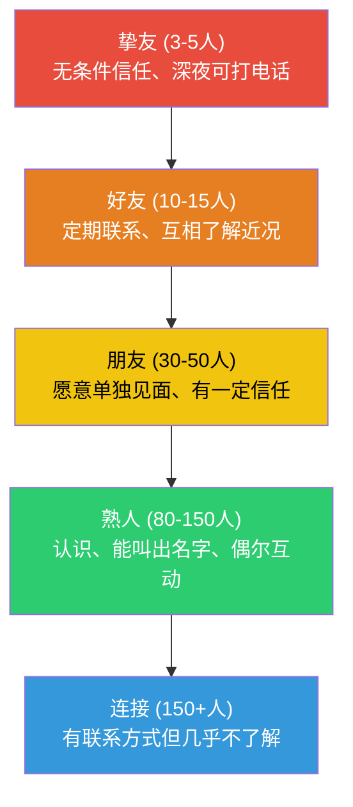
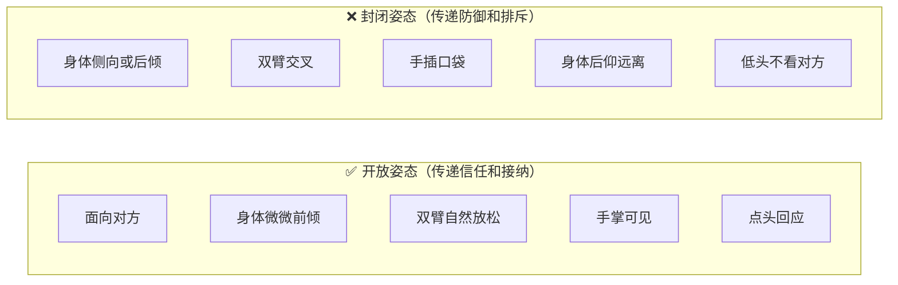
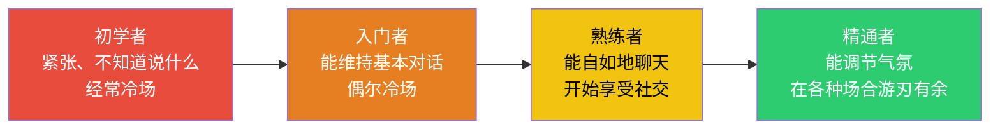
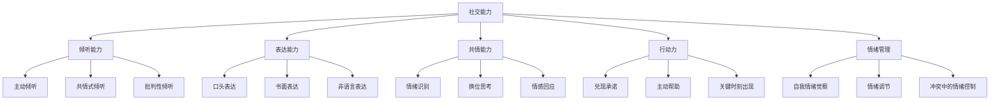
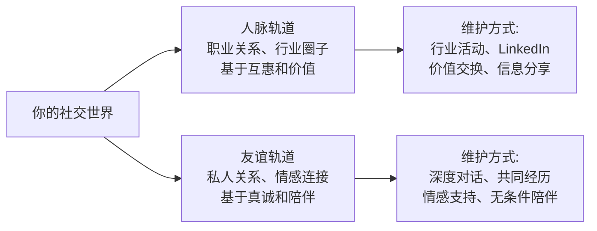
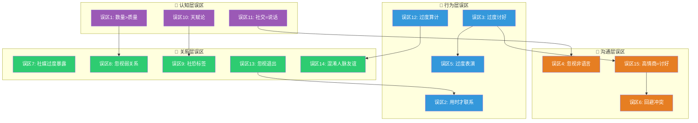

# 社交的常见误区

在社交实践中，人们往往会陷入一些思维和行为误区。这些误区看似合理，甚至被很多人奉为"社交真理"，但实际上会阻碍你建立真正有意义的人际关系。本节将系统梳理15个最常见的误区，帮助你识别并规避这些问题。

每个误区我们都按"表现→原理→纠正"三层展开，并附带真实场景案例和可立即使用的实操工具。读完本节后，建议做一个自我诊断——哪些误区你正在犯，然后制定针对性的改进计划。

## 自我诊断：你陷入了哪些误区？

在深入学习之前，先做一个快速自测。以下15个陈述，符合你的情况就标记"是"：

| 序号 | 陈述 | 是/否 |
|------|------|-------|
| 1 | 我的通讯录有500+联系人，但能深夜打电话求助的不到5个 | |
| 2 | 我通常只在需要帮忙时才联系朋友 | |
| 3 | 我很难拒绝别人的请求，即使自己很为难 | |
| 4 | 我很少注意自己的肢体语言和表情 | |
| 5 | 我在社交中会刻意维持一个"人设" | |
| 6 | 我倾向于回避冲突，用沉默代替沟通 | |
| 7 | 我经常在社交媒体上分享私人生活细节 | |
| 8 | 我把大部分社交精力放在维护亲密关系上 | |
| 9 | 我经常用"我社恐"来回避社交场合 | |
| 10 | 我认为社交能力是天生的，不太能改变 | |
| 11 | 我认为社交能力主要就是"会说话" | |
| 12 | 我帮助别人时会暗暗期待对等回报 | |
| 13 | 我明知某些关系不健康，但不好意思退出 | |
| 14 | 我把所有社交关系都当作"人脉"来经营 | |
| 15 | 我认为高情商就是让所有人都舒服 | |

标记"是"超过7个：你可能正在多个误区中，需要系统性调整。
标记"是"3-6个：你有一些盲区，针对性改进效果会很明显。
标记"是"0-2个：你的社交认知比较健康，可以跳到你最感兴趣的部分深入学习。

---

## 误区一：把社交等同于"认识很多人"

### 表现

有些人热衷于参加各种社交活动、加各种微信群、收集名片和微信好友。他们的通讯录里有几千个联系人，但真正能在关键时刻提供帮助的却寥寥无几。他们混淆了"连接"和"关系"——拥有某人的微信不等于拥有了一段关系。

**真实案例：** 张明是一名销售经理，每年参加几十场行业活动，微信好友超过3000人。当他创业需要融资时，翻遍通讯录却找不到一个愿意认真听他讲项目的人。他的3000个"好友"中，90%连他的真名都记不住。相反，他的同事李伟只有300个微信好友，但其中有20个是他在不同公司共事过5年以上的深度关系，创业第一天就收到了3个投资人的约谈。

### 为什么这是个误区

邓巴数（Dunbar's Number）是牛津大学人类学家罗宾·邓巴提出的理论，他通过对灵长类动物大脑新皮质体积与群体规模的关系研究，推算出人类能够维持的稳定社交关系上限约为150人。这个数字进一步细分为几个同心圆：

- **最内圈（约5人）**：你的亲密支持系统，遇到危机时第一时间想到的人
- **同情圈（约15人）**：你的好朋友，定期联系，关心彼此的生活
- **亲近圈（约50人）**：你愿意单独约出来吃饭的人
- **活跃圈（约150人）**：你认识且能维持稳定关系的上限
- **150人以外**：你认识但关系不稳定的人

超过150人的社交网络，关系的质量必然会下降。更重要的是，关系的价值不在于数量，而在于深度和质量。一段深度的信任关系，比100段浅层的"点赞之交"更有价值。

**社交关系的质量金字塔：**

### 如何纠正

**第一步：盘点你的社交圈**

拿出纸笔或打开电子表格，按邓巴同心圆列出你当前的关系：

| 圈层 | 目标人数 | 当前人数 | 具体是谁 |
|------|----------|----------|----------|
| 挚友 | 3-5 | ? | |
| 好友 | 10-15 | ? | |
| 朋友 | 30-50 | ? | |
| 熟人 | 80-150 | ? | |

**第二步：识别高潜力关系**

不是所有浅层关系都值得深入发展。判断一段关系是否值得投入，看三个维度：

1. **互补性**：你们的能力、资源、视角是否互补？
2. **价值观**：你们的核心价值观是否相近？
3. **投入意愿**：对方是否也表现出投入这段关系的意愿？

**第三步：制定深化计划**

对内圈关系（挚友+好友），每月至少一次深度互动——不是群发祝福，而是有针对性的一对一交流。可以是一顿饭、一通电话、或者认真回复对方的朋友圈。

**第四步：定期清理**

每季度审视一次你的社交圈。对于那些消耗你能量、只索取不付出、价值观严重冲突的关系，要有勇气降级或退出。

---

## 误区二：只在需要帮助时才联系别人

### 表现

有些人平时不联系朋友，只有在需要帮忙——找工作、借钱、求推荐——的时候才突然冒出来。这种行为模式很快会让人觉得你"有事才找人"，从而破坏信任和关系。

**真实案例：** 王丽大学毕业后和室友刘芳断了联系。三年后，王丽突然给刘芳发微信："芳芳在吗？我最近在做保险，你帮我看看这个产品呗？"刘芳看到消息后既尴尬又反感——三年没联系，一开口就是推销。她敷衍了几句就不再回复。而王丽的另一个同学赵敏，每个月都会在朋友圈给刘芳点赞评论，偶尔分享一些和刘芳工作相关的行业资讯。当赵敏需要换工作时，刘芳主动把自己的内推名额给了赵敏。

### 为什么这是个误区

社交的本质是价值交换，但这个交换有一个关键前提：它必须是**长期博弈**而非**一次性交易**。行为经济学中的"最后通牒博弈"实验证明，即使在匿名的一次性互动中，人们也会拒绝不公平的分配——宁可两败俱伤也不接受被剥削。在社交中，"只在需要时才联系"就是一种不公平的单次博弈策略。

从心理学角度看，这种行为触发了对方的"被利用感"。人类在进化过程中发展出了对"搭便车者"（free rider）的敏感检测机制——这是合作行为得以维持的基础。当你只在需要索取时出现，对方的大脑会自动将你归类为"搭便车者"，从而激活防御机制。

### 如何纠正

**建立"社交维护日历"**

社交关系需要定期维护，就像银行账户需要持续存款。具体做法：

| 关系层级 | 维护频率 | 维护方式 |
|----------|----------|----------|
| 挚友（5人） | 每周 | 深度对话、见面、共同活动 |
| 好友（15人） | 每两周 | 聊天、分享有趣内容、关心近况 |
| 朋友（50人） | 每月 | 点赞评论、转发有价值信息 |
| 熟人（150人） | 每季度 | 节日问候、行业资讯分享 |

**"先存后取"原则**

在向任何人提出请求之前，先问自己：过去6个月，我为这段关系"存"了什么？如果答案是"没有"，那就先存款，再取款。

低成本但高价值的"存款"方式：
- 看到和对方工作相关的文章/机会，转发给TA并附一句"看到这个想到你"
- 记住对方提过的重要事情（孩子的生日、考试、项目截止日），适时问候
- 在朋友圈认真评论（不是敷衍的"赞"），表达你真的在关注对方的生活
- 主动分享你知道的对对方有用的信息

**避免"消失-突然出现"模式**

如果你确实很久没联系某人了，不要直接提出请求。正确的做法是先恢复联系：

❌ 错误示范：
"在吗？我最近在找工作，你那边有合适的岗位吗？"

✅ 正确示范：
"好久没联系了，最近怎么样？上次听你说在做XX项目，进展顺利吗？
[等对方回复，聊几句近况后再自然地提]
对了，我最近在看新机会，如果你那边有听到什么风声，帮我留意一下呗。"

---

## 误区三：过度讨好他人

### 表现

有些人为了获得他人的认可和喜欢，总是迎合别人、不敢拒绝、压抑自己的需求。他们以为这样能赢得别人的尊重和喜爱，但结果往往是被人忽视甚至利用。

**真实案例：** 陈晨是公司里出了名的"好好先生"。同事让他帮忙加班，他从不拒绝；领导不合理的要求，他也默默承受；甚至连同事聚餐的地点，他都永远说"你们决定就好"。结果呢？年终评优时没人提名他，因为大家都觉得他"没什么存在感"。更讽刺的是，那些偶尔拒绝不合理要求的同事，反而获得了更多的尊重和话语权。

### 为什么这是个误区

过度讨好在心理学中被称为"讨好型人格"（People Pleaser），其核心机制是**外部评价依赖**——你的自我价值完全建立在他人的认可之上。这种模式的问题在于：

1. **信号理论角度**：过度讨好传递的信号是"我的时间和需求不重要"。在社交博弈中，这等于主动降低自己的议价地位。人们对你的尊重程度，往往取决于你表现出的自我尊重程度。

2. **沉没成本陷阱**：讨好者会不断加大投入，因为他们已经"付出这么多"了，如果现在开始拒绝，之前的付出岂不是白费了？这导致讨好行为不断升级。

3. **怨气积累**：哈佛商学院的研究发现，长期压抑自己的需求会导致"道德许可效应"——讨好者会在某个时刻突然爆发，做出远超正常范围的报复性行为，因为"我已经忍了这么久了"。

4. **吸引剥削者**：过度讨好会吸引那些习惯于索取的人，形成"讨好-索取"的不健康共生关系。

### 如何纠正

**识别讨好行为的触发器**

讨好行为通常在以下场景被触发：
- 对方表现出失望或不悦
- 你担心被拒绝或被排斥
- 对方的请求听起来"不太过分"但你其实不想做
- 你在乎对方对你的评价

**学会"优雅地拒绝"**

拒绝不需要道歉，也不需要过度解释。以下是几种实用的拒绝话术：

| 场景 | 话术模板 |
|------|----------|
| 不想参加的活动 | "谢谢邀请，这次去不了，下次有活动再叫我" |
| 不合理的加班请求 | "今天已经有安排了，明天上班第一时间处理" |
| 超出职责的帮忙 | "这个事情我帮不上忙，建议找XX，TA更专业" |
| 借钱请求 | "不好意思，我有个原则是不和朋友发生金钱往来" |
| 不想做的推销 | "谢谢你的推荐，目前没有这方面的需求" |

关键原则：**态度温和，立场坚定**。不需要生气，不需要解释理由，不需要道歉。一个简单的"不"或"这次不行"就够了。

**练习"三明治拒绝法"**

如果你觉得直接拒绝太生硬，可以用"肯定+拒绝+替代"的结构：

"你这个项目听起来很有意思（肯定），
不过我最近精力实在顾不上（拒绝），
要不我帮你问问小王？TA最近正好有空（替代）。"

**建立内在价值感**

讨好的根源是自我价值感不足。长期解决方案是建立不依赖外部评价的内在价值体系：
- 每天记录3件你做得好的事情（不依赖他人评价的）
- 练习自我肯定：在镜子前说出自己的优点
- 识别并挑战"如果我不讨好，别人就不会喜欢我"这个核心信念

---

## 误区四：忽视非语言沟通

### 表现

有些人只关注自己说了什么，却忽视了身体语言、面部表情、语调等非语言信号。研究表明，在面对面沟通中，非语言信息占了信息传递的60%以上。你的身体可能在传递与你的语言完全不同的信息。

**真实案例：** 李强面试时准备了完美的自我介绍，内容无可挑剔。但他全程低头看桌面、双臂交叉抱胸、语速飞快。面试官后来反馈："他说的内容不错，但我总觉得他不够自信，甚至有点紧张过头了。"而另一个候选人张薇，内容和李强差不多，但她保持了良好的眼神交流、开放的姿态、适度的微笑和沉稳的语速，最终拿到了offer。

### 为什么这是个误区

加州大学洛杉矶分校的阿尔伯特·梅拉比安（Albert Mehrabian）教授在1967年的研究中发现，在表达情感和态度时，信息的传递由三部分组成：

- **语言内容（7%）**：你说的具体词汇
- **语调（38%）**：你说话的方式、节奏、音量
- **面部表情和肢体语言（55%）**：你的表情、姿态、手势

需要注意的是，这个7-38-55法则主要适用于**情感和态度的传递**场景，不适用于信息传递（比如你告诉别人一个地址，语言内容自然是最重要的）。但在社交中，我们大量传递的恰恰是情感和态度——"我对你感兴趣"、"我尊重你"、"我信任你"——在这些场景中，非语言信号的重要性远超语言内容。

当语言和非语言信号不一致时，人们几乎总是相信非语言信号。这是因为在进化过程中，非语言信号更难伪装，因此被认为是更可靠的"真相指标"。

### 如何纠正

**眼神接触的黄金法则**

眼神接触是最强大的非语言信号之一，但需要把握度：

| 眼神状态 | 传递的信号 |
|----------|----------|
| 适度接触（60-70%的时间） | 自信、真诚、关注 |
| 完全回避 | 不自信、不诚实、不感兴趣 |
| 直勾勾盯着 | 有攻击性、让人不舒服 |
| 频繁看手机/看别处 | 不尊重、不感兴趣 |

具体练习方法：和人说话时，在对方的两只眼睛和鼻子之间形成一个"三角区"，目光自然地在这个区域内移动。这比直视瞳孔更自然，对方也不会觉得你在盯着TA。

**身体姿态的信号管理**

**语调管理的四个维度**

1. **音量**：确保对方能清晰听到你，但不要大声到让周围人侧目
2. **语速**：紧张时语速会加快，有意识地放慢20%
3. **音调**：说话时音调的起伏传递情感，平淡的语调传递无聊或不耐烦
4. **停顿**：在关键信息前后适当停顿，传递自信和深思熟虑

**镜像技巧（Mirroring）**

适度模仿对方的身体语言可以建立亲近感。这是人类大脑中"镜像神经元"的作用——当我们看到对方做出和我们相似的动作时，会产生"这个人和我一样"的感觉。

注意事项：
- 延迟2-3秒再模仿，不要同步模仿（那会显得刻意）
- 只模仿大动作（坐姿、手势方向），不要模仿小动作（摸鼻子、抖腿）
- 如果对方明显不开心，不要模仿负面表情

**自我观察练习**

每周选一次社交互动，事后回顾：
- 我的眼神接触够不够？
- 我的身体是开放还是封闭的？
- 我的语调是否传递了我想传递的情感？
- 对方的非语言信号告诉我什么？

进阶练习：用手机录一段你练习自我介绍的视频（30秒即可），回看时关掉声音，只观察自己的肢体语言。你会发现自己从未注意到的很多习惯动作。

---

## 误区五：把所有社交互动都当成"表演"

### 表现

有些人在社交中过度关注"技巧"和"策略"，把每次互动都当成一场表演。他们背诵话术、计算每句话的效果、时刻注意自己的"人设"。这种过度表演不仅让人感到疲惫，也让对方感到不真诚。

**真实案例：** 周杰在网上学了大量社交技巧，每次聚会前都会准备"话题清单"和"幽默段子"。聚会上，他总是"恰到好处"地插入话题、展示幽默感。一开始大家觉得他很有趣，但时间久了，朋友们开始觉得他"油"——永远在表演，永远看不到真实的样子。当周杰遇到困难时，没有人主动帮助他，因为大家觉得"他那么会社交，肯定不需要我"。

### 为什么这是个误区

社会学家欧文·戈夫曼（Erving Goffman）在《日常生活中的自我呈现》中提出了"拟剧理论"——人们在社交中就像演员在舞台上表演。这个理论描述了社交的现实，但把它当成社交的指导原则就有问题了。

信任的建立依赖于**一致性**和**可预测性**。当你过度表演时，你展示的不是"你是谁"，而是"你想让别人认为你是谁"。这种不一致会被对方的潜意识捕捉到——心理学中称为"认知不协调"（cognitive dissonance）的微弱版本。对方说不清楚哪里不对，但就是觉得"这个人不太真实"。

更重要的是，长期维持一个"人设"是认知资源的巨大消耗。心理学中的"自我损耗"（ego depletion）理论表明，意志力和自控力是有限资源。当你把大量精力花在"表演"上，你在真正需要展现能力的时刻反而会力不从心。

### 如何纠正

**区分"技巧"和"表演"**

| 维度 | 技巧 | 表演 |
|------|------|------|
| 目的 | 帮助你更好地表达真实的自己 | 创造一个不是你的形象 |
| 感受 | 自然、舒适 | 累、紧张、需要时刻注意 |
| 持续性 | 可以长期维持 | 长期维持会崩溃 |
| 对方感受 | 觉得你不错 | 觉得你"油"或"假" |
| 失败时 | 无所谓，本来就是真实的你 | 人设崩塌，关系受损 |

**"真实自我+社交礼仪"模式**

正确的社交方式是：在真实自我的基础上，加上适当的社交礼仪。就像穿衣服——你不需要伪装成别人，但需要根据场合选择合适的着装。

具体做法：
- 不准备"台词"，但可以准备"话题方向"（最近看了什么、最近在忙什么）
- 不练习"幽默段子"，但可以培养幽默感（多看喜剧、练习自嘲）
- 不维护"人设"，但可以展现"最好的自己"（干净整洁、积极态度）

**允许不完美**

社交中的小失误、小尴尬、小冷场，不仅不会损害关系，反而可能拉近距离——心理学中称为"出丑效应"（Pratfall Effect）。一个完美无缺的人让人敬畏但难以亲近，而一个偶尔犯小错的人更让人觉得真实和可爱。

**减少社交频率而非提高表演强度**

如果你在社交中感到疲惫，正确做法是减少社交频率（减少参加的活动数量），而不是提高表演强度（准备更多话术）。宁可少参加几场活动，每场都以真实的自己出现，也不要硬撑着参加所有活动但每场都在表演。

---

## 误区六：回避冲突和困难对话

### 表现

有些人在面对冲突或困难话题时选择回避——不说出自己的不满、不讨论敏感话题、用沉默代替沟通。他们以为回避可以维持关系的和谐，但事实上，未解决的问题会像滚雪球一样越来越大。

**真实案例：** 小赵和室友合租，室友经常不洗碗、不倒垃圾、深夜打游戏很吵。小赵心里很不满，但每次想开口都说不出口，怕"伤感情"。三个月后，小赵终于在一次室友又深夜打游戏时爆发了，说了很多积压的怨气，甚至人身攻击。室友完全不知道小赵之前有多不满，觉得小赵"突然发疯"。最终两人不欢而散，搬家后再也没联系。如果小赵在第一周就温和地提出这些问题，结局可能完全不同。

### 为什么这是个误区

回避冲突不是在维护关系，而是在积累怨气。华盛顿大学的约翰·戈特曼（John Gottman）教授经过40年的婚姻研究，发现了预测关系破裂的"末日四骑士"（Four Horsemen of the Apocalypse）：

1. **批评（Criticism）**：攻击对方的人格而非具体行为
2. **蔑视（Contempt）**：嘲讽、翻白眼、冷嘲热讽
3. **防御（Defensiveness）**：拒绝承认问题，反过来指责对方
4. **石墙（Stonewalling）**：冷战、沉默、拒绝沟通

其中"石墙"——也就是回避冲突——是最具破坏力的。因为当一方选择沉默时，另一方会感到被忽视、被拒绝、不被重视，这种感受比直接的争吵更伤人。

从博弈论角度看，回避冲突是一种"短期理性、长期非理性"的策略。短期内，回避确实避免了冲突的不适感；但长期来看，问题不会自动消失，只会以更大的代价爆发。

### 如何纠正

**建立"小问题及时沟通"的习惯**

不要等到问题积累到爆发才开口。关键原则是：**问题越小，沟通越容易；问题越大，沟通越困难。**

第一周发现问题 → 轻松提一句 → 快速解决
第三个月爆发 → 积怨已深 → 沟通困难 → 可能关系破裂

**使用"情境-行为-影响"（SBI）反馈模型**

这是哈佛商学院推荐的反馈框架，适用于几乎所有困难对话：

| 步骤 | 说明 | 示例 |
|------|------|------|
| **S**ituation（情境） | 描述具体的时间/场景 | "昨天晚上11点" |
| **B**ehavior（行为） | 描述具体的可观测行为 | "你在客厅打游戏声音很大" |
| **I**mpact（影响） | 描述对你造成的影响 | "我没法入睡，今天上班精神很差" |

完整示例：
> "昨晚11点你在客厅打游戏（情境），声音放得很大（行为），我翻来覆去到12点多才睡着，今天上班特别累（影响）。以后10点以后能不能戴耳机？"

注意：SBI模型避免了评判对方的人格（"你太自私了"），只描述行为和影响，大大降低了对方的防御反应。

**区分"回避冲突"和"选择不争论"**

不是所有分歧都值得争论。判断标准：

- **需要沟通的**：反复发生的问题、影响你核心利益的问题、对方可能不知道你不舒服的问题
- **可以放过的**：一次性的、影响很小的、对方已经知道问题但你接受的小毛病

**学会在冲突中倾听**

当冲突发生时，不要急于为自己辩护。先倾听对方的感受和诉求，确认你理解了对方的立场，然后再表达自己的观点。一句话总结：**先理解，再被理解。**

---

## 误区七：在社交媒体上过度暴露

### 表现

有些人在社交媒体上分享过多的个人信息——包括亲密关系、财务状况、家庭矛盾等。他们以为分享越多越能建立亲近感，但过度暴露可能带来隐私风险、他人误解和关系问题。

**真实案例：** 刘娜习惯在朋友圈分享生活的一切——和老公吵架要发、工资条要晒、孩子的成绩单要拍。有一次她发了一条"又和那个死鬼吵了一架，真是受够了"，结果被截图传到了家族群，引发了一场家庭风暴。还有一次她晒了年终奖的截图，很快就有多年不联系的亲戚来借钱。更严重的是，她的一个同事根据她朋友圈的日常行程，推断出了她的家庭住址。

### 为什么这是个误区

心理学中的"自我表露"（self-disclosure）理论认为，适度的自我表露可以增进关系。但社交媒体上的"分享"与面对面的"自我表露"有本质的区别：

| 维度 | 面对面自我表露 | 社交媒体分享 |
|------|--------------|------------|
| 对象 | 特定的人 | 所有关注者 |
| 语境 | 有完整的上下文 | 缺乏语境，易被误解 |
| 方向 | 双向的，有回应 | 单向的，等待点赞 |
| 反馈 | 即时的非语言反馈 | 延迟的、简化的反馈 |
| 控制 | 你能控制谁听到 | 你无法控制谁看到、截图、转发 |
| 深度 | 可以深入交流 | 只能表达表面 |

更关键的是**隐私安全**。社交媒体上的每一条信息都可能被截图、转发、搜索到。你的日常行程、家庭住址、财务状况、家庭关系等信息，一旦公开就无法收回。

### 如何纠正

**建立"社交媒体发布检查清单"**

发帖前，快速过一遍这个清单：

- [ ] 这条信息如果被截图传播，我能接受吗？
- [ ] 这条信息透露了我个人/家庭的隐私吗？
- [ ] 这条信息是否可能伤害到他人（伴侣、家人、朋友）？
- [ ] 我是否在情绪激动时发的？（如果是，先等24小时）
- [ ] 这条信息的专业形象影响是什么？（同事、领导、客户可能看到）

**信息分层管理**

不同深度的信息，分享到不同的渠道：

| 信息类型 | 适合的渠道 | 示例 |
|----------|----------|------|
| 生活感悟、读书心得 | 公开社交媒体 | 朋友圈、微博 |
| 个人近况、工作动态 | 朋友可见 | 微信朋友圈（分组） |
| 情感困扰、家庭矛盾 | 私密对话 | 一对一面聊或私聊 |
| 财务信息、家庭住址 | 不分享 | 只有自己知道 |

**保护隐私的具体操作**

1. 关闭社交媒体的"位置信息"功能
2. 不要晒包含门牌号、车牌、证件的照片
3. 不要在公开平台分享你的日常行程规律
4. 朋友圈设置"三天可见"或"半年可见"
5. 定期检查你的隐私设置，确保只有你信任的人能看到敏感内容

**情绪性内容的"24小时冷却法"**

在情绪激动时发的内容，几乎100%会后悔。建立一个规则：任何带有强烈情绪（愤怒、委屈、兴奋、炫耀）的内容，写好后先保存为草稿，等24小时后再决定是否发布。你可能会发现，90%的草稿在第二天你已经不想发了。

---

## 误区八：忽视社交中的"弱关系"

### 表现

有些人只关注亲密关系，而忽视了"弱关系"——那些不太亲密但有共同联系的人。他们把所有社交精力都放在维护少数几段亲密关系上，却错过了弱关系带来的巨大价值。

**真实案例：** 林小明是一名程序员，技术能力很强，但社交圈很小——基本上只有几个大学同学和公司同事。他想换工作时，投了50份简历，只收到3个面试邀请。他的同学孙浩技术能力一般，但因为经常参加技术meetup、在GitHub上活跃、在各种技术群里交流，虽然和这些人只是"弱关系"，但当他发了一条"在看新机会"的朋友圈后，收到了7个内推邀请，最终去了一个薪资涨50%的公司。

### 为什么这是个误区

1973年，社会学家马克·格兰诺维特（Mark Granovetter）发表了经典论文《弱关系的力量》（The Strength of Weak Ties）。他通过对求职者的调查发现：

- **只有16.7%的人通过强关系（亲友）找到工作**
- **超过83%的人通过弱关系（不太亲密的熟人）找到工作**

这个结论看似反直觉，但逻辑很清晰：你的亲密朋友和你的社交圈高度重叠，他们知道的信息你大概率也知道。而弱关系——那些和你在不同圈子、不同行业、不同背景的人——能够为你带来你社交圈之外的全新信息和机会。

弱关系的价值不仅限于求职。在信息获取、商业合作、跨界创新等方面，弱关系都是不可替代的信息桥梁。

### 如何纠正

**有意识地维护弱关系**

弱关系不需要深度维护，但需要保持"活跃"：

| 维护方式 | 频率 | 成本 |
|----------|------|------|
| 在朋友圈点赞评论 | 每周 | 1分钟 |
| 转发对方可能感兴趣的内容 | 每月 | 3分钟 |
| 简短问候/分享行业资讯 | 每季度 | 5分钟 |
| 线下见面（行业活动等） | 每半年 | 2小时 |

**成为"结构洞"上的桥梁**

社会学家罗纳德·伯特（Ronald Burt）提出了"结构洞"（Structural Holes）理论：如果你是连接两个不同社交圈的"桥梁"，你就占据了信息优势和控制优势。

具体做法：
- 参加不同领域的活动和社群（不只是你自己的行业）
- 主动介绍不同圈子的人互相认识
- 在多个平台上保持活跃（不只是微信，还有LinkedIn、行业论坛等）

**弱关系维护的低心力策略**

很多人觉得维护弱关系太耗精力，其实有几个省力的方法：
- 利用朋友圈：每天花5分钟浏览朋友圈，看到有价值的内容就点赞或评论
- 利用"触发事件"：对方生日、升职、换工作时发一条祝贺消息
- 利用"内容分享"：看到好文章，想到某个弱关系可能感兴趣，转发给TA并附一句简短的推荐理由

---

## 误区九：用"社恐"标签逃避社交

### 表现

有些人在面对社交挑战时，用"我社恐"来为自己开脱。虽然社交焦虑是真实存在的心理问题，但有些人把正常的社交紧张夸大为"社恐"，用这个标签来逃避所有不舒服的社交场景。

**真实案例：** 大学生小苏每次课堂展示都紧张，但她给自己贴了"社恐"的标签后，开始申请免做展示、回避所有需要当众发言的课程活动。四年后毕业时，她发现自己的简历上没有任何演讲、展示、团队合作的经验，求职面试时连自我介绍都说不清楚。而她的同学小杨也有同样的紧张感，但选择一次又一次地练习，从5个人的小组展示到500人的毕业典礼演讲，四年下来已经有了明显的进步。

### 为什么这是个误区

首先需要区分两个概念：

| 维度 | 正常的社交紧张 | 社交焦虑症（SAD） |
|------|--------------|-------------------|
| 发生频率 | 特定场合（面试、演讲） | 几乎所有社交场合 |
| 持续时间 | 事后很快消退 | 持续数月甚至数年 |
| 严重程度 | 不舒服但可以应对 | 严重影响日常生活 |
| 回避程度 | 可能会紧张但还是会去 | 大量回避社交场合 |
| 治疗需求 | 不需要专业治疗 | 建议寻求专业帮助 |

全球约有7-13%的人在一生中会经历社交焦虑症，这是一种需要专业治疗的心理障碍。但更多的人只是在特定场合感到紧张——这完全是正常的，甚至是有益的。

心理学中的"标签效应"（Labeling Effect）告诉我们，当我们给自己贴上某个标签后，我们会倾向于按照标签来行事。"我是社恐"这个标签会让你：
- 降低对社交能力提升的努力（"反正我就是这样"）
- 主动回避社交机会（"社恐不适合这种场合"）
- 在社交中更加紧张（"社恐就该紧张"）

这是一个自我实现的预言：你越相信自己是社恐，你就越回避社交，社交能力就越得不到锻炼，你就越紧张，从而越相信自己是社恐。

### 如何纠正

**重新定义紧张**

紧张不是恐惧的信号，而是身体在为你做准备。哈佛商学院教授艾莉森·伍德·布鲁克斯（Alison Wood Brooks）的研究表明，把紧张重新定义为兴奋（"我很兴奋"而不是"我很紧张"）可以显著提升社交表现。这是因为紧张和兴奋在生理上几乎完全相同（心跳加速、手心出汗、肾上腺素分泌），区别只在于你对这些信号的解读。

**渐进暴露练习**

不要一步到位地挑战最让你紧张的场景，而是从最容易的开始，逐步升级：

第1周：和便利店收银员多说一句话（"今天天气不错"）
第2周：在微信群里发表一次观点
第3周：和不太熟的同事一起吃午饭
第4周：在小型会议中主动发言一次
第5周：参加一个社交活动，和一个陌生人聊天
第6周：在较大场合主动自我介绍
...逐步升级...

**准备降低焦虑**

很多社交紧张来自于"不知道说什么"的恐惧。解决方案：
- 提前准备2-3个通用话题（最近看的电影、行业动态、周末计划）
- 准备几个万能问题（"你是怎么进入这个行业的？" "最近有什么推荐的书吗？"）
- 练习自我介绍，直到能自然地说出来

**社交技能是可以训练的**

把社交想象成打篮球——第一次上场你肯定紧张、笨拙、不知道站位。但经过几百小时的练习，你会变得自然、流畅、甚至享受其中。社交能力也是一样：

如果你的社交焦虑已经严重影响了日常生活（无法正常工作、上学、出门），请寻求专业心理咨询。认知行为疗法（CBT）对社交焦虑症有很好的疗效，不必为此感到羞耻。

---

## 误区十：把社交能力视为天赋而非技能

### 表现

有些人认为"有些人天生就擅长社交"，而自己天生就不行。他们把社交能力视为固定的特质，而不是可以学习和提升的技能。这种固定型思维让他们放弃了提升社交能力的努力。

**真实案例：** 公司里有两个新入职的员工：小陈和小王。小陈性格外向，入职第一天就和大家打成一片，被同事们称为"社交达人"。小王性格内向，入职一个月了还不太敢主动和同事说话。但小王有意识地观察和学习——他观察小陈怎么开场白、怎么找话题、怎么处理冷场，然后在自己的节奏中逐步练习。一年后，小王虽然还是不如小陈外向，但已经能在团队中自如地沟通、表达观点、协调冲突。更关键的是，小王因为善于倾听和深度思考，在跨部门协调中反而比小陈更受欢迎。

### 为什么这是个误区

斯坦福大学心理学家卡罗尔·德韦克（Carol Dweck）在《终身成长》中提出了"固定型思维"和"成长型思维"的区分：

| 维度 | 固定型思维 | 成长型思维 |
|------|----------|----------|
| 核心信念 | 能力是天生的、固定的 | 能力可以通过努力提升 |
| 对挑战的态度 | 回避（怕暴露不足） | 拥抱（视为成长机会） |
| 对失败的反应 | 自我否定（"我不行"） | 分析改进（"我哪里可以做得更好"） |
| 对努力的看法 | 努力是无能的表现 | 努力是提升的途径 |
| 最终结果 | 能力停滞 | 持续成长 |

社交能力确实有先天差异——外向的人在社交中可能更自在、更容易获得正反馈。但社交能力的核心构成——倾听、共情、沟通、建立信任、冲突管理——都是可以通过学习和练习来显著提升的技能。

研究表明，社交技能的提升幅度和练习时间呈正相关，而且练习带来的提升可以弥补先天的不足。一个内向但经过训练的人，在社交效果上完全可以超过一个外向但从未反思过自己社交方式的人。

### 如何纠正

**从固定型思维转向成长型思维**

当你发现自己在想"我就是不擅长社交"时，替换为"我还没练够"。这个简单的语言转换，背后是整个认知框架的改变。

**设定阶段性目标**

不要期望一夜之间变成"社交达人"。设定可衡量的阶段性目标：

| 阶段 | 目标 | 时间 |
|------|------|------|
| 第1个月 | 每天主动和1个不太熟的人说话 | 30天 |
| 第2个月 | 每周参加1次社交活动 | 4周 |
| 第3个月 | 在会议中主动发言至少2次 | 4周 |
| 第4个月 | 组织一次小型聚餐（3-5人） | 1次 |
| 第5-6个月 | 维护5段新的弱关系 | 60天 |

**找到适合你的社交方式**

社交不只有一种方式。内向的人有内向的社交优势：

- **深度对话优于广泛社交**：一对一的深度聊天比参加大型派对更有效
- **倾听是社交王牌**：在所有人急于表达的场合，一个好的倾听者反而最受欢迎
- **文字沟通是你的主场**：微信、邮件、写作——内向的人在文字表达上往往更有优势
- **提前准备消除焦虑**：内向的人善于思考和准备，这在面试、演讲等场景中是巨大优势

**记录你的进步**

每周记录一次社交相关的成就，无论多小：
- "今天主动和邻座同事聊了5分钟"
- "在群里发表了一个观点，有人回复了"
- "拒绝了一个不想参加的活动，感觉还不错"

这些小记录会在你怀疑自己的时候提醒你：你在进步。

---

## 误区十一：认为社交能力就是"说话"

### 表现

有些人认为社交能力等同于"会说话"——口才好、能讲笑话、能hold住场面。他们把所有精力都放在"说"上，却忽视了社交中同样重要甚至更重要的"听"和"做"。

**真实案例：** 公司年会上，销售总监老周口若悬河、金句不断，是全场的焦点。但他带的团队离职率却是全公司最高的——因为他只顾着说，从来不听下属的想法和诉求。而技术总监老赵不善言辞，开会时话不多，但每次开口都切中要害。更重要的是，他记得每个团队成员的职业规划，主动为他们争取培训机会和晋升空间。他的团队是全公司最稳定的，也是跨部门协作时最受欢迎的合作伙伴。

### 为什么这是个误区

社交能力是一个多维能力组合，而"说话"只是其中一个维度。完整的社交能力模型包括：

卡耐基在《人性的弱点》中写道："如果你想成为一个好的交谈者，先成为一个好的倾听者。"这句话的深层含义是：人们最渴望的不是"被说动"，而是"被理解"。一个善于倾听的人，比一个善于说话的人更容易获得信任和好感。

更重要的是，信任是通过行动——而非语言——建立的。你说一百次"我支持你"，不如在关键时刻实际出现一次。

### 如何纠正

**系统提升倾听能力**

主动倾听的ORES模型：

1. **O**bserve（观察）：注意对方的语调、表情、肢体语言
2. **R**eflect（反映）：用自己的话复述对方的意思，确认理解正确
3. **E**mpathize（共情）：表达你理解对方的感受
4. **S**ummarize（总结）：总结对话要点，确认共识

示例：
> 对方："我最近工作压力特别大，项目快到deadline了但进度还是落后。"
> 你："听起来你现在的压力主要来自时间紧迫（反映）。这种被deadline追着跑的感觉确实很难受（共情）。你目前最需要的是什么？人手还是时间？（引导）"

**用行动建立信任的三个层面**

| 行动层面 | 具体做法 | 信任效果 |
|----------|----------|----------|
| 承诺兑现 | 说到做到，做不到提前说明 | 基础信任 |
| 主动帮助 | 不等对方开口就提供帮助 | 好感信任 |
| 关键时刻 | 在对方最需要的时候出现 | 深度信任 |

**"少说多做"的社交策略**

在社交中，行动的信号强度远大于语言：
- 不说"下次一起吃饭"，而是直接定好时间和地点
- 不说"有需要找我"，而是在对方遇到困难时主动出现
- 不说"你做得很好"，而是把TA推荐给能给TA机会的人

---

## 误区十二：在社交中"算计"太多

### 表现

有些人过度计算社交中的"投入产出比"——"我帮了他，他能给我什么回报？""这次聚会有没有价值？""这个人值得我花时间交往吗？"

**真实案例：** 程序员大刘做了一个复杂的社交关系管理表格，给每个联系人打分（资源价值、情感价值、增长潜力），然后按照分数分配社交时间。他帮了同事一个忙后，会记录在表格里，等对方"回报"。如果对方没有"对等回报"，他就降低对方的评分，减少社交投入。结果是：同事们觉得和大刘相处很"累"，有一种被"衡量"的感觉。一年下来，大刘的表格越来越精细，但愿意主动帮他的同事却越来越少。

### 为什么这是个误区

社会交换理论（Social Exchange Theory）确实揭示了关系的"经济性"——人们会评估社交中的成本和收益。但这个理论描述的是关系的**一个侧面**，不是关系的**全部**。

过度算计的问题在于：

1. **信号泄露**：人类有惊人的"动机检测"能力。当你在"算计"时，你的微表情、语调、回应速度都会泄露你的真实动机。对方说不清为什么，但就是觉得和你相处不舒服。

2. **破坏信任基础**：信任的基础之一是"善意假设"——假设对方的行为是出于善意而非算计。当你明显在算计时，对方也会开始算计，形成恶性循环。

3. **忽视关系的非线性回报**：社交回报不是线性的。你帮了一个人10次，可能第11次TA帮了你一个改变人生的忙——这种回报是不可能通过"等价交换"来预测的。

4. **减少自发的快乐**：过度算计会把社交从一种愉悦的体验变成一种消耗性的"工作"。

### 如何纠正

**采用"弱互惠"策略**

不要追求"一对一"的即时回报，而是采用"群体互惠"的策略——你帮助所有人，也从所有人那里获得帮助。这种策略在进化生物学中被称为"间接互惠"（indirect reciprocity），是人类合作行为的重要基础。

具体做法：
- 帮助别人时不要期待TA个人的回报
- 相信"你帮助过的人中，总会有人在关键时刻帮助你"
- 把社交想象成一个"善意银行"——你存入的善意会以你意想不到的方式回来

**享受过程本身**

社交最大的价值不是"有用"，而是"有趣"。和志趣相投的人聊天、一起做喜欢的事情、分享彼此的生活——这些本身就是快乐的来源，不需要额外的"回报"来证明其价值。

**保留适度的理性判断**

"不算计"不等于"没底线"。对于那些明显只想利用你、只索取不付出、利用你善意的人，你完全有权利减少或终止社交。关键是：对大多数人保持善意和信任，对明显的"寄生者"果断止损。

---

## 误区十三：忽视社交中的"退出机制"

### 表现

有些人害怕结束关系或退出社交圈，即使这些关系已经变得不健康或消耗性。他们因为"不好意思"或"怕伤害对方"而一直维持着不健康的关系。

**真实案例：** 小何有一个从小玩到大的朋友小魏。长大后，小魏变得越来越消极——每次见面都在抱怨、贬低别人、散播负能量。小何每次和小魏见面后都感觉很累，心情变差。但因为"十几年的交情"，小何不好意思减少联系。每次小魏约见面，小何都硬着头皮去。两年下来，小何发现自己的情绪状态明显变差，甚至影响到了工作和亲密关系。

### 为什么这是个误区

不是所有关系都值得维护。关系可能变得不健康的原因包括：

- **控制型关系**：一方试图控制另一方的行为、社交、决策
- **消耗型关系**：一方持续消耗另一方的情绪能量，却很少给予支持
- **利用型关系**：一方只在需要帮助时出现，平时不闻不问
- **贬低型关系**：一方通过贬低另一方来获取优越感
- **竞争型关系**：关系中的互动变成了持续的竞争和比较

维持不健康关系的代价：
- **情绪代价**：持续的负面情绪影响心理健康
- **时间代价**：你把有限的时间花在了不值得的关系上
- **机会代价**：你因为维持旧关系而错过了建立新关系的机会
- **自我损耗**：长期压抑自己的感受会导致自我价值感下降

心理学中的"沉没成本谬误"（Sunk Cost Fallacy）让你觉得"已经投入了这么多年"不应该放弃。但关系的价值不在于过去投入了多少，而在于未来能带来什么。

### 如何纠正

**识别不健康关系的信号**

以下信号出现3个以上，这段关系可能需要重新评估：

- 和对方互动后感觉疲惫、沮丧、焦虑
- 你害怕收到对方的消息或电话
- 你在对方面前不敢表达真实想法
- 对方经常让你感到内疚或亏欠
- 你在对方面前不是"最好的自己"
- 这段关系中你付出远大于收获
- 对方不尊重你的边界
- 对方在你面前和别人面前是完全不同的人

**优雅退出的策略**

退出关系不一定要"撕破脸"。根据关系的性质，可以选择不同的退出策略：

| 策略 | 适用场景 | 具体做法 |
|------|----------|----------|
| 自然淡化 | 不太亲密的关系 | 逐渐减少联系频率，不主动约见面 |
| 设定边界 | 关系可以改善但需要调整 | 明确告诉对方你的底线和期望 |
| 直接沟通 | 重要但需要结束的关系 | 坦诚但温和地表达你的感受和决定 |
| 彻底断联 | 有毒或有害的关系 | 停止一切联系，必要时拉黑 |

**自然淡化的具体步骤**

1. 逐渐延长回复消息的时间（从即时回复变为几小时后）
2. 减少主动发起对话
3. 拒绝邀约时给出简短但真实的理由（"最近比较忙"）
4. 不要发布可能让对方觉得你在"晒"的内容
5. 让关系自然降温，而不是突然消失

**学会区分"投入"和"沉没成本"**

- **值得继续投入的关系**：对方也在努力、关系中有正向的互动、问题是可以沟通解决的
- **应该止损的关系**：只有你在努力、关系中缺乏正向互动、问题反复出现且对方不愿改变

---

## 误区十四：把"人脉"和"友谊"混为一谈

### 表现

有些人把所有的社交关系都当作"人脉"来经营——只关注对方能给自己带来什么价值，而忽视了关系中的情感连接。他们有很多"人脉"，但缺少真正的朋友。

**真实案例：** 赵总是一名成功的企业家，社交圈极广，认识各行各业的大佬。他的手机通讯录里有5000多个联系人，每次参加活动都能和所有人谈笑风生。但他妻子生病住院时，他发现自己不想让任何一个"人脉"知道——因为"人脉"是基于价值交换的关系，而他需要的是情感支持。最后陪他在医院度过那些漫长夜晚的，只有两个从小一起长大的朋友。那一刻他才意识到，他有5000个"人脉"，但只有2个"朋友"。

### 为什么这是个误区

"人脉"和"友谊"是两种不同类型的关系，有不同的基础、不同的经营方式、不同的价值：

| 维度 | 人脉 | 友谊 |
|------|------|------|
| 基础 | 互惠互利 | 情感连接 |
| 价值 | 信息、资源、机会 | 情感支持、陪伴、理解 |
| 经营方式 | 展示价值、维护互惠 | 真诚、分享、陪伴 |
| 互动频率 | 按需互动 | 定期互动 |
| 退出成本 | 较低（换一个人脉） | 较高（失去一段友谊） |
| 危机时刻 | 可能消失 | 反而加强 |

把所有关系都当作"人脉"来经营的危险在于：当你真正需要帮助时——不是工作上的帮助，而是情感上的支持、人生低谷时的陪伴——你会发现"人脉"并不能提供这些。

### 如何纠正

**关系的双轨制**

聪明的人会同时经营"人脉"和"友谊"两条轨道：

**识别"可以成为朋友的人脉"**

有些人脉关系可能发展为友谊，判断标准：
- 你们的交流不仅限于工作话题
- 对方在非工作场景中也愿意和你互动
- 你们有共同的兴趣或价值观
- 对方展现过脆弱的一面（不只是展示成功）

**在友谊中投入真诚的情感**

友谊的经营不需要"策略"，需要的是真诚：
- 记住朋友说过的重要事情（不是为了"维护关系"，而是因为你真的在乎）
- 在朋友困难时出现，不需要对方"有价值"
- 分享你自己的脆弱和不完美，而不只是展示光鲜的一面
- 接受朋友的不同意见，而不是试图"管理"关系

**最重要的提醒**

在你最困难的时候——失业、离婚、生病、失去亲人——真正帮你的往往是朋友，而不是人脉。人脉会在你有价值时围绕你，但会在你失去价值时离开你。朋友则相反——他们会在你最需要的时候出现。

---

## 误区十五：认为"高情商"就是"让所有人舒服"

### 表现

有些人把高情商理解为"让所有人都感到舒服"——永远不表达反对意见、永远不引起冲突、永远迎合他人。他们把"高情商"变成了"高级讨好"。

**真实案例：** 项目经理小林是公认的"高情商"——她从不和人发生冲突，总是微笑着说"好的""没问题""你说得对"。但项目进展并不顺利，因为小林从来不说"不"——客户提出不合理的需求她说好，团队成员犯了错误她不指出来，领导做出了错误决策她不提出异议。最终项目延期两个月，客户不满，团队士气低落。反而是另一个"说话不太好听"的项目经理老郑，虽然经常在会上"怼人"，但项目按时交付，客户满意，团队成员也觉得"跟着老郑能学到东西"。

### 为什么这是个误区

情商（Emotional Intelligence）的创始人丹尼尔·戈尔曼（Daniel Gogleman）定义情商为五个维度：

1. **自我觉察**（Self-Awareness）：了解自己的情绪
2. **自我调节**（Self-Regulation）：管理自己的情绪
3. **内在动机**（Motivation）：自我驱动
4. **共情**（Empathy）：理解他人的情绪
5. **社交技能**（Social Skills）：管理关系

注意：情商的核心是**准确性**——准确地识别情绪、准确地理解需求、准确地选择回应方式。它不是"让所有人舒服"，而是"在正确的时候表达正确的情绪"。

"让所有人舒服"的问题在于：
- 有时候"不舒服的真话"比"舒服的假话"更有价值
- 永远迎合会降低你在团队中的影响力和可信度
- 真正的高情商包括"在适当的时候表达不同意见"
- 回避必要的冲突本质上是一种不负责任

### 如何纠正

**重新理解情商的核心**

| 真正的高情商 | "伪高情商" |
|------------|----------|
| 在适当的时候说"不" | 永远说"好" |
| 表达不同意见但注意方式 | 永远同意他人 |
| 设定并维护边界 | 没有边界地接受一切 |
| 在冲突中找到建设性方案 | 回避一切冲突 |
| 在需要时给出诚实反馈 | 只说好听的话 |
| 管理自己的情绪 | 压抑自己的情绪 |

**"温和而坚定"的沟通方式**

高情商的沟通不是"不说真话"，而是"用正确的方式说真话"：

❌ 低情商："你这个方案根本不行。"
❌ 伪高情商："方案挺好的！"（但心里觉得不行）
✅ 高情商："方案的A部分很有创意。不过B部分可能存在XX风险，
           我们可以考虑用YY方案来替代，你觉得呢？"

**掌握"建设性反对"的技巧**

当你需要表达不同意见时，使用"同意-补充-建议"的框架：

1. **同意**：先认可对方观点中的合理部分
2. **补充**：提出你看到的不同角度或信息
3. **建议**：给出建设性的替代方案

示例：
> "我理解你希望尽快上线的考虑（同意），
> 不过从技术角度看，目前的代码覆盖率只有60%，上线后出bug的风险比较大（补充）。
> 我建议我们再花一周时间补测试用例，把覆盖率提到85%以上再上线，这样更稳妥（建议）。"

**在团队中的影响力模型**

高情商的人在团队中的影响力不是来自"让人舒服"，而是来自**可信度+亲和力**：

- **可信度**：你说的话有道理、有依据、有建设性
- **亲和力**：你说的方式让人觉得你是在帮助而非攻击

只有亲和力没有可信度 = "好好先生"（没人当回事）
只有可信度没有亲和力 = "毒舌专家"（没人愿意听）
两者兼备 = 真正的高情商（说的话有人听，而且听了有帮助）

---

## 15个误区的关系图谱

这15个误区不是孤立存在的，它们之间有密切的关联。理解这些关联可以帮助你更系统地改进社交能力：

---

## 误区纠正的优先级框架

不是所有误区都需要同时纠正。根据影响力和改进难度，建议按以下优先级处理：

| 优先级 | 误区 | 理由 |
|--------|------|------|
| 🥇 第一优先 | 误区10（天赋论）、误区9（社恐标签） | 这是认知层面的障碍，不先改变认知，行为层面的努力会大打折扣 |
| 🥈 第二优先 | 误区3（过度讨好）、误区15（高情商=讨好） | 这两个误区直接影响你的人际关系质量和自我价值感 |
| 🥉 第三优先 | 误区4（忽视非语言）、误区6（回避冲突） | 这是沟通技能层面的提升，投入少但见效快 |
| 第四优先 | 误区2（用时才联系）、误区8（忽视弱关系） | 这是关系维护层面的优化，需要长期习惯养成 |
| 按需处理 | 其他误区 | 根据你的自测结果，选择你最常犯的来优先处理 |

---

## 总结

以上15个误区涵盖了社交中最常见的思维和行为陷阱。它们的核心问题可以归结为五个维度：

1. **认知偏差**：把社交能力视为天赋（误区10）、把社交等同于说话（误区11）、追求社交数量（误区1）——这些认知层面的偏差是所有行为问题的根源
2. **真诚缺失**：过度表演（误区5）、过度算计（误区12）、把所有人当人脉（误区14）——社交的核心是真诚，失去真诚的社交只是表演
3. **沟通短板**：忽视非语言信号（误区4）、回避冲突（误区6）、误解高情商（误区15）——有效的沟通是社交的基础设施
4. **关系经营**：只在需要时联系（误区2）、忽视弱关系（误区8）、忽视退出机制（误区13）——关系需要持续经营，也需要果断止损
5. **自我管理**：过度讨好（误区3）、社媒过度暴露（误区7）、用标签逃避（误区9）——健康的社交建立在健康的自我之上

识别这些误区是改变的第一步。建议你：

1. 回到本节开头的自测表，确认你最需要改进的2-3个误区
2. 阅读对应误区的"如何纠正"部分，选择一个具体行动
3. 在接下来的一个月里，每周练习一个行动
4. 月底回顾效果，调整下一个月的练习重点

记住：社交能力的提升不是一蹴而就的，而是一个持续迭代的过程。每次识别到自己陷入了某个误区，都是一次成长的机会。

**最后的建议：** 选择1-2个你最容易陷入的误区，制定具体的改进计划，在接下来的一个月里重点练习。把本节的内容当作一个参考手册，在需要时回来查阅——特别是当你发现自己在社交中感到困惑或不舒服时，很可能就是陷入了某个误区。
