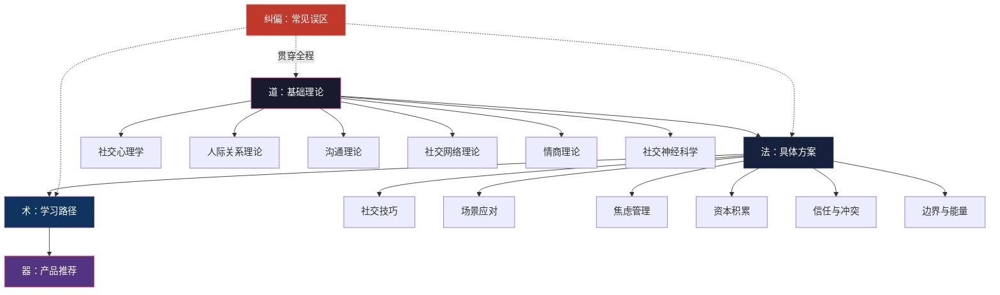
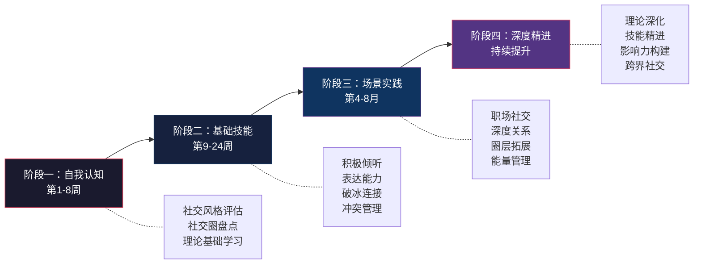
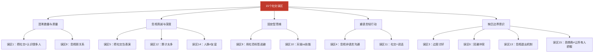

# 第九章小结：社交——从知识到行动的完整闭环

本章从基础理论到具体方案，从学习路径到常见误区，为你构建了一套完整的社交能力提升体系。本小结不是简单的要点罗列——它是全章知识的**系统性整合**，帮你把散落在各节中的理论、方法和工具编织成一张可执行的行动网。

读完本小结后，你应该能够：用一句话说出社交的底层逻辑，用一张图理清知识体系的结构，用一份清单指导接下来的行动。

***

## 一、全章知识体系回顾

本章遵循「道→法→术→器」的逻辑，将社交能力拆解为四个递进层次。下面这张图展示了它们之间的关系：

### 1.1 基础理论：六根支柱

基础理论是整章的地基，由六个相互支撑的理论模块构成：

| 理论模块 | 核心问题 | 关键概念 | 对实践的意义 |
|---------|---------|---------|------------|
| 社交心理学 | 我们为什么会这样社交？ | 首因效应、光环效应、社会认同、社会比较 | 理解社交中的"说不清道不明"，减少认知偏差 |
| 人际关系理论 | 关系是怎么发展的？ | 社会交换理论、依恋理论、社会渗透理论、戈特曼四骑士 | 识别关系所处阶段，预测关系走向 |
| 沟通理论 | 怎么说和怎么听？ | 非暴力沟通（NVC）、积极倾听、关键对话、冲突管理五策略 | 从"话不投机"到"有效沟通" |
| 社交网络理论 | 关系的结构是怎样的？ | 邓巴数（150人/四同心圆）、弱关系的力量、结构洞理论 | 优化社交网络的宽度与深度 |
| 情商理论 | 如何管理社交中的情绪？ | 戈尔曼四维模型（自我意识、自我管理、社会意识、关系管理） | 在高情绪场景中保持理性与共情 |
| 社交神经科学 | 大脑如何处理社交信息？ | 镜像神经元、催产素与信任、杏仁核劫持 | 从生理层面理解社交行为，学会"劫持管理" |

这六个模块不是孤立的——它们共同构成了一个**理解→预测→干预**的完整认知框架。例如：社交心理学告诉你"首因效应很强大"（理解），人际关系理论告诉你"信任需要逐步建立"（预测），沟通理论给你NVC四步法（干预）。三者结合，你才能在真实的社交场景中做出有效反应。

### 1.2 具体方案：九把钥匙

基础理论解决"为什么"，具体方案解决"怎么做"。本章提供了九个核心社交场景的完整实操方案：

| 方案编号 | 核心场景 | 核心技能 | 关键工具/方法 |
|---------|---------|---------|-------------|
| 一 | 社交技巧大全 | 破冰、寒暄、深度对话、告别 | 破冰五策略、记住名字四法、共鸣点四方向 |
| 二 | 社交场景应对 | 聚会、饭局、会议、线上社交 | 场景清单、角色定位、话题储备 |
| 三 | 社交焦虑应对 | 认知重构、暴露疗法、呼吸技术 | 4-7-8呼吸法、焦虑阶梯、认知重评 |
| 四 | 社交资本积累 | 弱关系维护、跨界连接、价值输出 | 社交圈地图、维护频率表、价值清单 |
| 五 | 社交礼仪 | 中西方差异、数字化礼仪 | 礼仪清单、边界感知、文化敏感度 |
| 六 | 建立信任 | 可靠性、脆弱性展示、一致性 | 可靠性公式、信任四维度模型 |
| 七 | 处理社交冲突 | NVC实操、关键对话练习 | 托马斯-基尔曼模型、"我"语言转换 |
| 八 | 边界管理 | 说"不"、识别毒性关系 | 边界清单、拒绝话术、关系审计 |
| 九 | 社交能量管理 | 内向者策略、社交节奏、充电方法 | 能量日记、社交-独处配比、恢复仪式 |

这九个方案覆盖了社交中最常见的痛点。它们的共同底层逻辑是：**先识别问题→再理解机制→最后执行具体步骤**。每一个方案都不是"一次性技巧"，而是一套可以反复练习、逐步精进的技能体系。

### 1.3 学习路径：四个阶段

学习路径将社交能力的提升拆解为四个递进阶段，总周期6-12个月：

每个阶段的设计原理基于三个核心理论：

- **维果茨基的"最近发展区"理论**：内容难度精确匹配你的当前水平，既不无聊也不焦虑
- **德雷福斯技能习得模型**：从"依赖规则"的新手到"无需思考"的专家，层层递进
- **库伯的经验学习圈**：每个阶段都内建"经验→反思→概念化→实验"的完整循环

学习路径的五条核心原则贯穿全程：

1. **循序渐进**——不跳过基础阶段，地基不牢上面会塌
2. **学以致用**——学到的概念必须在24小时内练习，否则留存率从75%暴跌至10%以下
3. **刻意练习**——带着明确目标练3小时，胜过无反思地社交10小时
4. **反馈驱动**——建立自我反思+朋友反馈+专业指导的多渠道反馈机制
5. **耐心坚持**——养成新习惯平均需要66天（不是21天），不要期望立竿见影

### 1.4 常见误区：十五个陷阱

本章梳理的15个常见误区，可以归结为五个核心问题：

误区的价值不仅在于"知道什么不能做"，更在于**通过反面案例加深对正面原则的理解**。例如：误区一（社交不等于认识很多人）的反面就是邓巴数和社交圈分层理论；误区六（回避冲突）的反面就是戈特曼的"冷战是关系杀手"的发现。每一个误区都对应着一个或多个基础理论中的核心概念。

***

## 二、七个必须内化的核心认知

以下七个认知点贯穿全章，是社交能力的"操作系统"。它们不是需要背诵的知识点，而是需要内化为本能反应的思维模式。

### 2.1 社交能力是技能，不是天赋

这是整章最基础的前提。卡罗尔·德韦克的"成长型思维"研究明确表明：相信能力可以通过努力提升的人，比相信能力是固定的人取得更大的成就。社交能力的核心子技能——倾听、共情、表达、冲突管理——全部可以通过学习和刻意练习来提升。

关键证据：
- 积极倾听可以通过四周的结构化训练从"听而不闻"提升到"共情倾听"
- 非暴力沟通（NVC）的四步骤可以在两周内掌握基本框架
- 社交焦虑可以通过认知行为疗法（CBT）的暴露技术逐步缓解

**内化检验**：当你在社交中遇到困难时，你的第一反应是"我不擅长这个"还是"我可以如何提升"？如果是前者，你需要先修正这个认知。

### 2.2 真诚是基石，技巧是载体

"真诚 × 技巧 = 健康的社交"——这是本章的核心公式。

缺少真诚的技巧是操纵。你可能短期内"人缘很好"，但别人迟早会看穿，关系也会随之崩塌。缺少技巧的真诚是笨拙——你可能出发点很好，但表达方式让人不适，效果适得其反。

最好的社交状态是：**用恰当的方式表达真实的自己**。这需要真诚作为基础，也需要技巧作为载体。技巧不是用来"装"的，而是用来更准确地传递你的真实想法和感受。

**内化检验**：你在社交中感到"累"吗？如果你觉得每次社交都像在"表演"，说明你过度依赖技巧而忽视了真诚。如果你觉得每次社交都"话不投机"，说明你有足够的真诚但缺乏表达技巧。

### 2.3 关系质量远比数量重要

邓巴数（150人）划定了人类社交关系的生物学上限。在这个上限内，关系分为四层：

| 层级 | 人数上限 | 关系特征 | 维护频率 | 对幸福感的影响 |
|------|---------|---------|---------|-------------|
| 核心圈 | 5人 | 凌晨3点可以打电话求助的人 | 每天或隔天 | **最大** |
| 亲密圈 | 15人 | 愿意分享秘密和情感的人 | 每周至少一次 | 很大 |
| 朋友圈 | 50人 | 愿意一起吃饭、参加活动的人 | 每月至少一次 | 中等 |
| 认识的人 | 150人 | 能认出名字和基本背景的人 | 每季度或更少 | 有限 |

核心圈的3-5个人——通常是伴侣、最亲近的家人和最好的朋友——对你幸福感的影响最大。哈佛大学历时85年的格兰特研究证实：**良好的人际关系是幸福和健康的最重要预测因素**，不是财富、名望或职业成就。

**内化检验**：你的核心圈有几个人？你上一次和他们深度交流是什么时候？如果超过一个月没有深度交流，你需要立即行动。

### 2.4 社交的本质是价值交换，但不是功利计算

社会交换理论揭示了关系的"经济学"本质——情感支持、信息、陪伴、实际帮助都是社交中的"货币"。但这不意味着社交应该是功利的。

正确的姿态是：**自然地为他人提供价值，同时在需要时接受他人的帮助**。先思考"我能为别人提供什么"，而不是"我能从别人那里得到什么"。社交银行账户需要持续存款，不能只取不存。

**内化检验**：你上一次无条件地帮助一个朋友是什么时候？如果你的帮助总是附带"他以后也要帮我"的期待，你需要调整心态。

### 2.5 自我表露是关系深化的核心机制

阿尔特曼和泰勒的"社会渗透理论"指出：关系的发展就是自我表露逐渐深入的过程。从表层（事实信息：职业、爱好）→ 中层（观点和价值观）→ 深层（情感和经历）→ 核心（脆弱面展示）。

自我表露的四个原则：
1. **对等原则**——表露深度与对方匹配，不要"过度倾倒"
2. **渐进原则**——从浅到深，逐步递进
3. **观察反馈**——对方不适时及时调整
4. **选择对象**——不是所有人都值得深层表露

**内化检验**：你有没有一个可以展示脆弱面的人？如果没有，你需要从信任度最高的关系开始，尝试进行一次"更深一层"的分享。

### 2.6 冲突是关系的正常组成部分

戈特曼40年婚姻研究的核心发现：**健康的关系不是没有冲突的关系，而是能够建设性地处理冲突的关系**。回避冲突（"冷战"）是关系破裂的四大预测因素之一。

冲突处理有五种风格（托马斯-基尔曼模型）：竞争、回避、妥协、迁就、合作。大多数人有一个默认风格，而这个默认风格不一定总是最合适的。关键是在不同场景中灵活切换。

当冲突中的情绪强度过高时，"杏仁核劫持"会让你失去理性——心跳加速、肌肉紧绷、思维变窄。应对策略：识别信号→暂停（"我需要5分钟冷静一下"）→深呼吸（4-7-8法）→认知重评→回来继续。

**内化检验**：你上一次和亲近的人发生冲突时，你的第一反应是回避、爆发还是建设性地沟通？如果是前两者，你需要练习冲突管理技能。

### 2.7 线上社交无法替代线下互动

社交媒体提供了便捷的连接方式，但面对面的社交互动具有不可替代的价值：

| 维度 | 线上社交 | 线下社交 |
|------|---------|---------|
| 非语言信息 | 极度受限（仅文字/表情符号） | 丰富（表情、语调、肢体语言） |
| 催产素释放 | 很少 | 显著（特别是拥抱、眼神接触） |
| 信任建立速度 | 慢 | 快 |
| 情感连接深度 | 有限 | 深层 |
| 适用场景 | 维护关系、弱关系维护 | 深化关系、建立信任 |

**正确的配比**：用线上社交来维护关系（保持联系、分享信息），用线下社交来深化关系（面对面交流、共同经历）。

**内化检验**：你上一次和好朋友面对面深度交流是什么时候？如果超过一个月，建议本周就约一次。

***

## 三、核心工具与框架速查表

本章涉及大量工具和框架。以下是按使用场景整理的速查表，方便你在实际社交中快速查阅：

### 3.1 理解类工具（帮你理解社交现象）

| 工具/框架 | 来源 | 核心内容 | 使用场景 |
|----------|------|---------|---------|
| 首因效应 | 社交心理学 | 第一印象在7秒内形成，且持续影响后续判断 | 初次见面时的自我呈现 |
| 光环效应 | 社交心理学 | 对某人的某个特征的积极评价会泛化到其他特征 | 理解为什么"第一印象好"后续会更顺利 |
| 邓巴数 | 社交网络理论 | 人类能维持的稳定关系约150人，分四层 | 社交圈规划和精力分配 |
| 弱关系的力量 | 格兰诺维特 | 弱关系比强关系更可能带来新信息和机会 | 拓展信息来源和职业机会 |
| 依恋理论 | 人际关系理论 | 安全型/焦虑型/回避型/混乱型四种依恋风格 | 理解自己和伴侣在亲密关系中的行为模式 |
| 社会交换理论 | 人际关系理论 | 关系是成本-收益的动态平衡 | 分析关系的健康度和可持续性 |
| 戈特曼四骑士 | 戈特曼研究 | 批评、蔑视、防御、冷战是关系的四大杀手 | 预警关系中的危险信号 |

### 3.2 表达类工具（帮你有效表达）

| 工具/框架 | 来源 | 核心内容 | 使用场景 |
|----------|------|---------|---------|
| NVC四步骤 | 马歇尔·卢森堡 | 观察→感受→需要→请求 | 敏感话题的表达、冲突中的沟通 |
| PREP法 | 结构化表达 | 观点→理由→例子→重申观点 | 工作汇报、观点陈述 |
| "我"语言 | 冲突管理 | "我感到…当…因为…我需要…" | 替代指责性的"你"语言 |
| 欣赏公式 | 戈特曼研究 | 具体行为+产生的影响+你的感受 | 表达感谢和欣赏 |

### 3.3 倾听类工具（帮你深度倾听）

| 工具/框架 | 来源 | 核心内容 | 使用场景 |
|----------|------|---------|---------|
| 倾听三层次 | 沟通理论 | 听而不闻→专注倾听→共情倾听 | 自我评估倾听水平 |
| 反映式倾听 | 心理咨询 | 用自己的话复述对方的观点和感受 | 确认理解、表达关注 |
| 情绪验证六层次 | 情商理论 | 在场→准确反映→读出未说的→历史理解→正常化→真诚对待 | 深度情感支持 |
| 4-7-8呼吸法 | 情绪管理 | 吸气4秒→屏气7秒→呼气8秒 | 冲突中的情绪调节 |

### 3.4 评估类工具（帮你了解自己）

| 工具/框架 | 来源 | 核心内容 | 使用场景 |
|----------|------|---------|---------|
| 社交健康度自评 | 本章设计 | 10个问题，50分制 | 快速定位社交能力薄弱点 |
| 乔哈里窗口 | 社交心理学 | 公开区/盲区/隐藏区/未知区 | 理解自我认知的局限 |
| 大五人格测试 | 人格心理学 | 开放性/尽责性/外向性/宜人性/神经质 | 科学评估社交风格 |
| 成人依恋量表ECR | 依恋理论 | 安全型/焦虑型/回避型/混乱型 | 理解亲密关系模式 |
| 社交圈地图 | 邓巴数理论 | 四同心圆分层 | 盘点社交网络现状 |

***

## 四、从知识到行动：分层行动清单

知道和做到之间隔着一道鸿沟。以下行动清单按时间维度分为三层，帮你把本章知识转化为持续的行为改变。

### 4.1 本周行动（立即启动）

这些行动可以在本周内完成，不需要特殊条件：

- [ ] **完成社交健康度自评**——用本章开头的10个问题给自己打分，定位最需要改善的维度
- [ ] **完成MBTI或大五人格测试**——了解自己的社交风格基线。推荐平台：16personalities.com（MBTI）、truity.com/test/type/big-five（大五人格）
- [ ] **完成成人依恋量表ECR**——理解你在亲密关系中的行为模式。搜索"ECR亲密关系体验量表"
- [ ] **写一份"社交自画像"**——用本章学习路径中的模板，花一个安静的下午回答15个问题
- [ ] **绘制你的社交圈地图**——画四个同心圆，填入你的人际关系，评估每层的满意度
- [ ] **选择1-2个你最容易陷入的社交误区**——制定具体的改进计划

### 4.2 本月行动（建立习惯）

这些行动需要持续练习，建议以一个月为周期：

- [ ] **主动联系一位久未联系的重要朋友**——进行一次深度交流，练习"更深一层"的自我表露
- [ ] **开始积极倾听训练**——每天选择一个对话场景，练习"全神贯注倾听"（放下手机、保持眼神接触、不打断、停顿2-3秒再回应）
- [ ] **每天练习一次NVC四步骤**——选择一个日常互动，用"观察→感受→需要→请求"来表达
- [ ] **每天真诚地对一个人表达一次具体的欣赏**——用公式"具体行为+影响+感受"
- [ ] **开始记录社交日记**——记录每天的主要社交互动、使用的技巧、对方的反应、自评和反思
- [ ] **练习一次建设性的冲突处理**——当冲突发生时，用"我"语言替代"你"语言，用暂停技术管理情绪

### 4.3 持续行动（长期精进）

这些行动需要长期坚持，建议融入日常生活：

- [ ] **每周主动进行一次社交互动**——可以是线下聚会、深度对话、或主动拓展弱关系
- [ ] **每周进行一次社交复盘**——回顾本周的社交互动，分析做得好和需要改进的地方
- [ ] **每月审视一次社交圈地图**——检查各层关系的活跃度和满意度，调整精力分配
- [ ] **每季度更新一次社交健康度自评**——跟踪自己的进步，调整学习方向
- [ ] **持续学习**——阅读推荐书籍、参加相关课程、使用社交测评工具
- [ ] **建立社交-独处的健康配比**——根据自己的社交风格，找到最适合自己的节奏

***

## 五、关键数据与研究发现速查

本章引用了大量权威研究。以下是最关键的几个数据点，值得牢记：

| 研究/数据 | 来源 | 核心发现 | 实践启示 |
|----------|------|---------|---------|
| 格兰特研究（85年追踪） | 哈佛大学 | 良好的人际关系是幸福和健康的最重要预测因素 | 投资关系，回报最高 |
| 社交孤立≈每天吸15支烟 | 霍尔特-伦斯塔德（2015，340万人荟萃分析） | 社交孤立使全因死亡风险增加29% | 社交不是可选项，是生存必需 |
| 58%求职来自二度人脉 | LinkedIn 2022 | 弱关系比强关系带来更多职业机会 | 维护弱关系的ROI很高 |
| 正面:负面互动≥5:1 | 戈特曼40年婚姻研究 | 低于5:1时关系处于危险区 | 多表达欣赏和感激 |
| 手机存在降低对话质量 | "iPhone效应"研究 | 仅仅是手机的"存在"就会降低面对面交流的质量 | 倾听时把手机收起来 |
| 首因效应7秒 | 社交心理学 | 前7秒形成初步印象，长期影响后续判断 | 重视初次见面的自我呈现 |
| 养成习惯平均66天 | 伦敦大学学院研究 | 不是广为流传的21天 | 给自己足够的时间和耐心 |
| 非语言信息占60%以上 | 梅拉比安研究 | 语调38%，面部表情55%，语言内容仅7%（表达情感和态度时） | 关注身体语言和语调 |

***

## 六、推荐深度阅读

如果你想进一步深化对社交的理解，以下书籍按优先级排列：

### 第一梯队：必读（与本章内容直接相关）

1. **《非暴力沟通》**——马歇尔·卢森堡。NVC的完整方法论，本章沟通理论的核心来源。
2. **《亲密关系》**——罗兰·米勒。社会交换理论、依恋理论的系统论述，适合想深入理解关系发展的人。
3. **《情商》**——丹尼尔·戈尔曼。情商四维模型和"杏仁核劫持"概念的原始出处。
4. **《人性的弱点》**——戴尔·卡耐基。虽然写于1936年，但关于倾听、赞赏、换位思考的核心原则至今仍然有效。

### 第二梯队：进阶（拓展社交认知边界）

5. **《社会心理学》**——戴维·迈尔斯。大学教材级别的系统论述，第11章"人际吸引"是精华。
6. **《依恋》**——阿米尔·莱文。依恋理论在成人亲密关系中的应用，焦虑型和回避型读者尤其推荐阅读。
7. **《关键对话》**——科里·帕特森等。高风险对话场景的完整应对框架。
8. **《影响力》**——罗伯特·西奥迪尼。说服心理学的经典，帮你理解社交中的顺从机制。

### 第三梯队：探索（了解更广的社交研究领域）

9. **《社会性动物》**——艾略特·阿伦森。社会心理学的通俗读物，涵盖从众、偏见、攻击性等主题。
10. **《思考，快与慢》**——丹尼尔·卡尼曼。理解认知偏差如何影响社交判断。
11. **《被讨厌的勇气》**——岸见一郎。阿德勒心理学视角下的人际关系哲学，对"过度讨好"的人特别有启发。

***

## 七、推荐思考问题

以下问题没有标准答案，但值得你定期反思。建议每月选1-2个问题进行深度思考，把答案写下来：

**关于自我认知：**
- 你的社交风格是什么？你的优势和盲区分别是什么？
- 你的依恋类型如何影响你在亲密关系中的行为模式？
- 你在社交中最大的挑战是什么？你采取了什么措施来应对？

**关于关系质量：**
- 你的社交圈中，谁是你最信任的人？你上一次与他/她深度交流是什么时候？
- 你的核心圈有几个人？这个数量是否让你满意？
- 你是否有一段需要修复的关系？是什么阻碍了你？

**关于精力分配：**
- 你的社交精力是如何分配的？这种分配是否合理？
- 你在社交中感到大部分时间是"做自己"还是"表演"？
- 你能够平衡社交时间和独处时间吗？你的社交-独处配比是否健康？

**关于成长方向：**
- 你最后一次在社交中走出舒适区是什么时候？那次经历教会了你什么？
- 你最容易陷入本章提到的哪个社交误区？你打算如何纠正？
- 一年后，你希望在社交方面达到什么状态？

***

## 八、结语：从一个小小的行动开始

社交是人类最古老也最基本的能力之一。在这个日益数字化和碎片化的时代，维护和发展真实的社交关系变得越来越重要，也越来越有挑战性。

回顾本章的全部内容，核心信息可以浓缩为三句话：

1. **社交能力是可以提升的技能**——不要用"我不擅长社交"来限制自己
2. **真诚是基石，技巧是载体**——用恰当的方式表达真实的自己
3. **关系质量远比数量**——用心经营几段高质量的关系，胜过认识一百个泛泛之交

社交的终极目标不是成为"社交达人"，而是建立真诚、深入、有意义的人际关系。这些关系将成为你幸福人生的重要基石——给你支持、陪伴、成长和意义。

现在，请你从以下三个行动中选择一个，今天就去做：

| 行动 | 难度 | 预计时间 | 效果 |
|------|------|---------|------|
| 给一个你在意的人发一条消息，告诉他/她你很珍惜这段关系 | ⭐ | 2分钟 | 立即提升关系温度 |
| 完成社交健康度自评，定位自己的薄弱维度 | ⭐⭐ | 10分钟 | 为后续学习明确方向 |
| 拿出纸笔，画出你的社交圈地图 | ⭐⭐⭐ | 30分钟 | 直观看到你的社交网络现状 |

**不要等到"准备好了"才开始——你永远不会完全准备好。从一个小小的行动开始，持续练习，逐步精进。社交能力的提升是一场马拉松，不是百米冲刺。**

***
