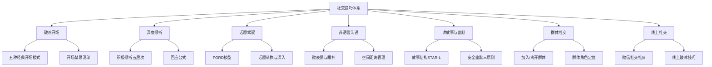
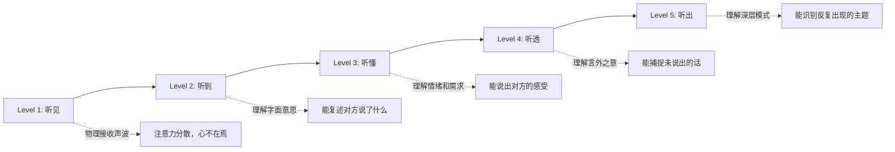
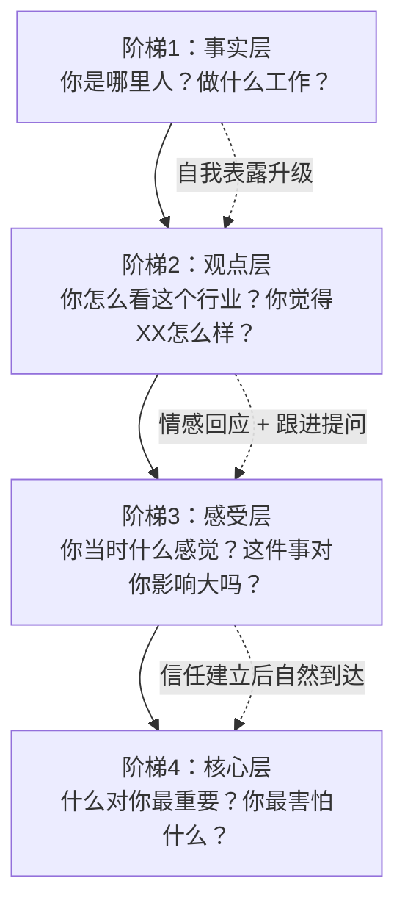
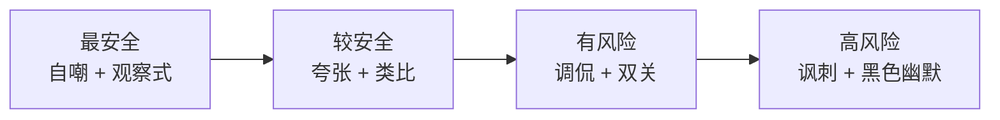
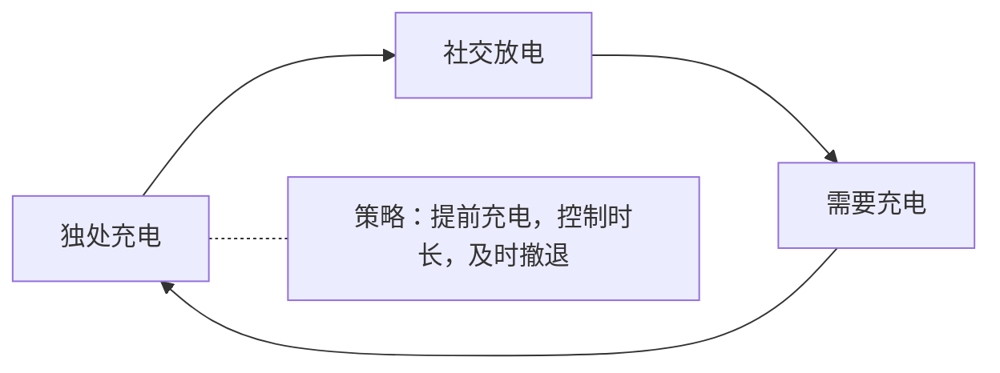

## 一、社交技巧大全

社交不是天赋，而是一组可拆解、可训练、可衡量的技能。本节将社交能力拆分为**七大核心模块**：破冰开场、倾听回应、话题驾驭、非语言沟通、讲故事与幽默、群体社交、线上社交。每个模块从底层原理出发，给出可直接使用的技巧、模板和练习方案。

### 1.1 破冰开场的艺术

开场白是社交的入口。心理学中的「首因效应」（Primacy Effect）表明，人在初次接触的前7秒内就会形成对对方的基本判断，这个判断一旦形成，后续信息往往被用来「印证」而非「修正」第一印象。因此，开场的质量直接影响后续整段关系的走向。

但「好」的开场不是华丽的话术，而是三个要素的组合：**低压力 + 高回应性 + 情境相关性**。

#### 1.1.1 五种经典开场模式

**模式一：环境评论法**

利用当前的环境或场景作为话题切入点，是最自然、风险最低的开场方式。

- "这个场地布置得真不错，你之前来过这里吗？"
- "今天这个讲座的内容真有启发性，你觉得呢？"
- "这家餐厅的氛围很好，你常来吗？"

**为什么有效：** 环境评论法的底层逻辑是「共享情境」——你和对方此刻身处同一个物理空间，对环境的评论不需要任何个人信息交换，没有入侵感。心理学家阿瑟·阿伦（Arthur Aron）的实验表明，共享情境是最安全的社交启动器，几乎适用于所有场合。

**适用场景：** 聚会、活动、餐厅、展览、等候区、电梯间

**进阶技巧：** 不仅评论环境本身，还可以延伸到与环境相关的人或事。例如在展览上不只是说"这幅画不错"，而是"这幅画让我想起了XX，你对这个艺术家了解吗？"——从评论升级为邀请。

**模式二：真诚赞美法**

对对方的某个具体特征给予真诚的赞美。

- "你的演讲太精彩了，尤其是那个关于数据可视化的观点让我很受启发。"
- "这件衣服很适合你，颜色搭配得特别好。"
- "你的PPT做得很专业，能告诉我用的什么工具吗？"

**赞美的「具体化」公式：** 观察到的行为/特征 + 带给你的感受/启发 + 好奇追问

| 赞美层级 | 示例 | 效果 |
|---|---|---|
| 笼统赞美 | "你演讲很好" | 一般——显得敷衍 |
| 具体赞美 | "你关于数据可视化的观点很精彩" | 较好——表明你认真听了 |
| 具体+感受 | "你关于数据可视化的观点让我重新思考了自己的工作方式" | 最佳——建立深层连接 |

**注意：** 赞美的核心原则是**真诚且可验证**。如果你说"你演讲很好"但对方明显知道自己讲砸了，信任瞬间归零。只赞美你真正注意到且欣赏的点。

**模式三：共同点法**

找到与对方的共同点——共同的朋友、共同的经历、共同的兴趣。

- "我看到你也是XX大学毕业的，你是哪一届的？"
- "你也喜欢爬山？最近去了哪些地方？"
- "我注意到你也在读那本书，你觉得怎么样？"

**为什么有效：** 社会心理学中的「相似-吸引」范式（Similarity-Attraction Paradigm）是人际吸引领域最稳健的发现之一——人们系统性地喜欢与自己相似的人。共同点不仅降低社交距离，还触发「内群体偏好」（Ingroup Bias），让对方在心理上将你归入"自己人"的范畴。

**寻找共同点的信号源：**
- 穿着/配饰：T恤上的乐队logo、运动队标志、书包上的徽章
- 行为特征：在读的书、使用的设备、参加的活动
- 社交线索：共同的朋友、相同的行业、相似的口音
- 物理环境：你们出现在同一个地方，本身就暗示了某种共同兴趣

**模式四：求助法**

请求对方的帮助或建议——这是一个低姿态的开场方式，大多数人乐于帮助他人。

- "不好意思，你知道附近哪家咖啡店比较好吗？"
- "我是第一次参加这个活动，有什么建议吗？"
- "你对这个行业很了解，能给我一些入门建议吗？"

**为什么有效：** 这利用了心理学中的「本杰明·富兰克林效应」——曾经帮助过你的人会更喜欢你（而非反过来）。当我们帮助别人时，大脑会进行认知协调："我帮了这个人，说明我觉得他值得帮。"这会正向调整我们对对方的态度。

**注意：** 请求要合理、具体，不要给对方造成负担。最好的求助是对方能轻松回答且展现其专业/经验的问题。

**模式五：直接自我介绍法**

在某些场合，直接、自信的自我介绍是最有效的方式。

- "你好，我是XX，在YY公司做ZZ工作。很高兴认识你。"
- "嗨，我叫XX，我朋友说我们应该认识一下。"

**适用场景：** 商务场合、有组织的社交活动、朋友引荐

**升级版自我介绍模板：** 名字 + 一个记忆锚点 + 一个开放性钩子

示例："你好，我叫张明，张是弓长张，明亮的明。我是做用户体验设计的，今天来主要是想听听AI对设计行业的影响。你是做哪个方向的？"

这个模板的三个要素各自有功能：记忆锚点（"弓长张"）帮助对方记住你的名字；背景信息建立身份；开放性钩子把对话接力棒递给对方。

#### 1.1.2 开场白的核心原则

无论使用哪种模式，好的开场白都遵循五条原则：

1. **真诚而非套路**：人们能识别出机械的话术。选择你最自然的表达方式
2. **情境相关**：与当下场景、氛围、时间相匹配
3. **回应空间**：给对方说话的机会，不要自顾自地说
4. **友好而非需求感**：表达善意，而非索取关注或帮助
5. **简短自然**：开场白是钥匙，不是房间——3-5句话足矣

#### 1.1.3 应避免的开场方式

| 开场方式 | 为什么不好 | 替代方案 |
|---|---|---|
| 过于正式或生硬 | 制造距离感 | 用日常口语，像跟朋友说话 |
| 只谈论自己 | 对方感到被忽视 | 每说一句自己就问对方一句 |
| 带有明显目的性 | 触发防御心理 | 先建立连接，再谈需求 |
| 涉及隐私话题 | 让人不适 | 从公开信息入手 |
| 使用过时话术 | 显得不真诚 | 用自己的语言表达 |
| 过度自我贬低 | 制造尴尬 | 展示适度的自信 |
| 负面评论开场 | "今天真热啊"→无法展开 | 用中性或正面的评论 |

### 1.2 深度倾听：社交中最被低估的技能

大多数人认为社交能力 = 会说话。事实上，研究一致表明：**最被喜欢的社交者不是最能说的人，而是最能让别人说的人。** 哈佛大学2015年发表在《PNAS》上的研究发现，当人们被邀请谈论自己时，大脑的奖励中枢（伏隔核和腹侧被盖区）会被激活——谈论自己的快感与获得金钱的快感激活的是同一脑区。

换句话说：让对方谈论自己，你在给予对方一种神经层面的愉悦。

#### 1.2.1 积极倾听的五个层次

| 层次 | 描述 | 典型回应 | 对方感受 |
|---|---|---|---|
| Level 1：听见 | 物理上接收了声音，但注意力在别处 | "嗯……啊？" | 被忽视 |
| Level 2：听到 | 理解了字面意思，能复述 | "你说你加班到11点" | 被听见 |
| Level 3：听懂 | 理解了背后的情绪和需求 | "听起来你真的很累，压力很大" | 被理解 |
| Level 4：听透 | 捕捉到对方没有明说的信息 | "你好像不只是累，还有点委屈——你觉得自己的付出没有被看到" | 被看见 |
| Level 5：听出 | 识别出深层模式和核心关切 | "我注意到你几次提到'不够好'，你是不是对自己要求特别高？" | 被真正认识 |

大多数人停留在Level 2。从Level 2升级到Level 3，是最关键的一步跃迁，也是建立深度连接的分水岭。

#### 1.2.2 回应的「REFLECT」公式

当对方说完一段话后，用以下公式回应：

**R**ecognize（识别情绪）→ **E**cho（回声关键词）→ **F**eel（表达理解）→ **L**evel（匹配深度）→ **E**ncourage（邀请继续）→ **C**onnect（关联自己）→ **T**ransition（自然过渡）

但不需要每次回应都走完全部七步——根据场景灵活组合。最常用的组合是：

**组合一：确认+感受**（最万能）
> 对方："最近项目太多，天天加班。"
> 回应："听起来你最近特别忙（回声），这种高强度的工作节奏确实很消耗人（感受）。是哪个项目比较棘手？（邀请继续）"

**组合二：感受+深层追问**（建立深度连接）
> 对方："我和女朋友吵架了。"
> 回应："吵架挺难受的（感受）。你现在更在意的是吵架的内容，还是吵架本身对关系的影响？（深层追问）"

**组合三：共鸣+自我关联**（建立平等感）
> 对方："我最近在学吉他。"
> 回应："真的吗？我之前也学过，最痛苦的就是按和弦手指疼的那两周（关联）。你现在学到什么程度了？（邀请继续）"

#### 1.2.3 倾听中的「禁区」行为

以下是常见的倾听坏习惯，每一条都在摧毁对话质量：

- **抢话**：对方还没说完就插嘴，本质上是在说"我的想法比你的重要"
- **急于给建议**：对方只是想被理解，你却急着当人生导师
- **转移话题到自己身上**："你加班？我比你还累呢！"——瞬间把对话变成了竞赛
- **敷衍回应**："嗯""哦""是吗"——这些回应在告诉对方"你的话不值得我认真对待"
- **评判性回应**："你不应该那样做"——对方的分享瞬间变成被告陈述
- **玩手机**：在对方说话时看手机，这是现代社交中最普遍的不尊重行为

**练习方案：** 在下一次对话中，刻意做两件事——（1）在对方说完后，停顿1秒再回应；（2）至少用一次"你的感受是……"来确认你理解了对方的情绪。坚持一周，你会发现对话质量显著提升。

### 1.3 话题驾驭：从寒暄到深度对话

#### 1.3.1 FORD模型——安全话题的万能框架

FORD模型是社交对话中最经典的话题框架，覆盖了四个几乎对所有人都适用的话题领域：

- **F（Family）家庭**：家乡在哪里、家里几口人、有没有兄弟姐妹
- **O（Occupation）职业**：做什么工作、怎么进入这个行业的、工作中最有意思的部分
- **R（Recreation）休闲**：有什么爱好、周末怎么度过、最近看了什么好电影
- **D（Dreams）梦想**：未来有什么计划、最想去哪里旅行、有什么想学的技能

**F到D的深度递进：** F和O属于「安全浅层话题」，适合初次见面；R属于「兴趣探索话题」，适合建立亲近感；D属于「深层连接话题」，适合深化关系。不要在初次见面就问对方的梦想，但也不要和认识一年的朋友还在聊天气。

#### 1.3.2 话题延续的七个技巧

1. **开放式提问**：用"什么""如何""为什么"开头的提问，让对方有更多表达空间。避免只能用"是"或"否"回答的封闭式问题。

   | 封闭式（避免） | 开放式（推荐） |
   |---|---|
   | "你喜欢旅行吗？" | "你去过最让你难忘的地方是哪里？" |
   | "工作忙吗？" | "你工作中最有意思的部分是什么？" |
   | "你喜欢这份工作吗？" | "你是怎么进入这个行业的？" |

2. **跟进提问（最核心的技巧）**：在对方的回答中找到感兴趣的部分，深入追问。"你说你喜欢摄影？是什么类型的摄影？最近拍了什么满意的作品？"——这表明你真的在听，而不是敷衍。

3. **关联分享**：在对方分享后，分享你自己的相关经历。"我之前也去过那个地方，最让我印象深刻的是……"——但注意，分享的目的是建立连接，不是抢话语权。分享后把话题还给对方。

4. **情感回应**：对对方的表达给予情感层面的回应。"听起来那次经历对你影响很大"——这比"哦，然后呢"强一百倍。情感回应是区分Level 2和Level 3倾听的关键。

5. **好奇心驱动**：保持真诚的好奇心，而不是假装感兴趣。好奇心不是问"为什么"（容易让人感觉被质疑），而是问"是什么让你……""你当时是怎么想的"。

6. **适度自我表露**：在对话中适度分享自己的想法和经历，而不是只做一个提问者。心理学研究表明，适度的自我表露会引发对方的互惠性自我表露，让对话走向深入。但表露的深度要匹配——对方说工作压力大，你不必分享童年的创伤。

7. **观察与评论**：对周围的环境、活动、人群进行观察和评论，这可以提供源源不断的话题。好的社交者都是观察者。

#### 1.3.3 从寒暄到深度对话的「阶梯模型」

大多数对话停留在表面寒暄，不是因为双方不想深入，而是没有人先迈出那一步。心理学家阿瑟·阿伦设计的「36个问题」实验表明，**逐步升级的自我表露**可以在45分钟内让两个陌生人产生亲密感。

**对话深度的四个阶梯：**

**升级信号：** 对方主动分享感受、使用"我觉得""我感觉"等情感词汇、语气变得更放松自然。收到这些信号后，你可以用更深的问题跟进。

**升级禁忌：** 对方还在事实层回答，你就问核心层的问题——这会让人感觉被审问。

#### 1.3.4 话题禁区与敏感话题的处理

**初次见面的话题禁区：**
- 政治立场
- 宗教信仰（除非在相关场合）
- 收入和财务状况
- 他人的八卦和隐私
- 过于私密的健康问题
- 过度的抱怨和负面话题

**敏感话题的处理策略：**

当对话不可避免地触及敏感领域（比如被问到收入、年龄、婚恋状态），可以用以下策略：

1. **模糊回应**："还行吧，够生活"——满足对方好奇心但不暴露具体信息
2. **幽默转移**："哈哈，你问这个是要给我介绍对象吗？"——用幽默化解压力
3. **反抛问题**："你问这个问题是有什么想法吗？"——了解对方的真实意图
4. **温和设界**："这个我不太方便说，不过我们可以聊聊……"——明确但不带攻击性

### 1.4 非语言沟通：读懂无声的语言

加州大学洛杉矶分校的阿尔伯特·梅拉比安（Albert Mehrabian）研究发现，在涉及情感和态度的沟通中，信息的传递只有7%来自语言内容，38%来自语调，55%来自肢体语言。虽然这个比例在不同场景中会有变化，但核心结论不变：**你的身体在说话，而且比你的嘴说得更多。**

#### 1.4.1 眼神接触的科学

| 眼神模式 | 传递的信号 | 建议 |
|---|---|---|
| 持续直视（>70%时间） | 支配、压迫或强烈兴趣 | 避免——让人不适 |
| 适度接触（50-70%时间） | 自信、真诚、感兴趣 | 推荐——最佳社交比例 |
| 频繁躲闪（<30%时间） | 紧张、不自信、不诚实印象 | 需要练习改善 |
| 三角区交替看 | 亲密、暧昧 | 仅适用于亲密关系 |

**实用技巧：** 如果你对眼神接触感到不自在，可以看对方两眼之间的鼻梁位置——对方几乎无法分辨你是否在直视他们的眼睛。

#### 1.4.2 身体姿态信号图

**开放姿态（表达友好和接纳）：**
- 身体微微前倾——表示感兴趣
- 手臂自然放松——不设防
- 面朝对方——给予注意力
- 微微点头——鼓励对方继续
- 真实微笑（杜兴微笑）——眼角有皱纹

**封闭姿态（表达防御和拒绝）：**
- 双臂交叉抱胸——自我保护
- 身体后仰或侧转——想离开
- 避免眼神接触——不想连接
- 频繁看手机/手表——不耐烦
- 脚尖指向出口——潜意识想走

#### 1.4.3 空间距离管理（人际距离学）

人类学家爱德华·霍尔（Edward T. Hall）提出的「人际距离学」（Proxemics）描述了四种社交距离：

| 距离范围 | 适用关系 | 场景示例 |
|---|---|---|
| 亲密距离（0-45cm） | 伴侣、家人、密友 | 拥抱、耳语 |
| 个人距离（45-120cm） | 朋友、熟悉同事 | 日常聊天、聚会交谈 |
| 社交距离（1.2-3.6m） | 商务关系、初次见面 | 会议、商务洽谈 |
| 公共距离（>3.6m） | 公开演讲、陌生人 | 演讲、大型活动 |

**关键规则：** 空间距离是双向的。如果对方后退，你在跟进——这是入侵，不是亲近。尊重对方的舒适距离，在对方准备好后自然缩短。

#### 1.4.4 镜像效应——快速建立亲近感的技巧

「镜像效应」（Mirroring）是指无意识地模仿对方的肢体语言、语速和语调。心理学研究发现，当两个人的姿态趋于同步时，他们之间的信任感和亲近感会显著提升。

**使用方法：**
- 对方交叉双腿，你在几秒后自然地做同样的动作
- 对方说话速度慢，你也适当放慢
- 对方用手势强调重点，你也适度使用手势

**重要警告：** 镜像必须自然、延迟、微妙。即时复制对方的每一个动作不是镜像，是模仿秀——效果适得其反。

### 1.5 讲故事与幽默运用

#### 1.5.1 为什么故事比道理更有效

神经科学的研究揭示了一个惊人的事实：当人们听到纯数据和事实时，只有大脑的语言处理区域被激活；但当人们听到一个故事时，大脑中与故事内容相关的所有区域都会被激活——听冒险故事时，运动皮层会活跃；听情感故事时，镜像神经元会放电。普林斯顿大学的尤里·哈森（Uri Hasson）将这种现象称为「脑际同步」（Neural Coupling）——讲故事的人和听故事的人的大脑活动会趋于同步。

这就是为什么"讲道理"远不如"讲故事"有效——故事让听者在神经层面经历了你的经历。

#### 1.5.2 社交故事的STAR-L结构

在社交场景中讲故事，不需要像写小说那样铺陈，用STAR-L结构在30秒到2分钟内讲好一个故事：

- **S（Situation）场景**：一两句话交代时间和地点。"上个月我去成都出差。"
- **T（Tension）张力**：发生了什么问题/意外/冲突。"结果到了才发现会议取消了，白跑一趟。"
- **A（Action）行动**：你做了什么。"既然来了，我就决定去逛逛宽窄巷子。"
- **R（Result）结果**：发生了什么有趣的收获。"在巷子里遇到一个做糖画的老人，聊了一个下午，学到了一辈子都用得上的道理。"
- **L（Lesson）领悟**：一个简短的感悟或笑点。"他说'糖画最怕的就是犹豫——勺子一停，糖就硬了'。我后来发现，人生也差不多。"

**为什么STAR-L有效：** 张力（T）是故事的钩子——它制造好奇心，让对方想知道接下来发生了什么。没有张力的故事就是流水账。

#### 1.5.3 安全幽默的三原则

幽默是社交中最强大的武器，但也最危险——好的幽默让人亲近，坏的幽默让人疏远。

**原则一：笑自己，不笑别人（自嘲式幽默）**

自嘲式幽默是最安全的幽默形式。它展示了你的自信（你能坦然面对自己的不完美）和谦逊（你不把自己太当回事）。

示例："我做饭的水平大概就是——外卖小哥都认识我了，上次还问我'你家厨房是不是装修用的？'"

**原则二：观察式幽默，而非评判式幽默**

观察式幽默是对生活荒诞面的发现和分享，不针对任何人。

示例："我发现一个规律——超市里标着'最后三天清仓'的店，能开三年。"

评判式幽默（要避免）："你看他那个发型，哈哈"——这是在消费别人。

**原则三：读场后再出手**

幽默的成败取决于时机和场合。在对方情绪低落时讲笑话，在严肃的商务场合开玩笑，在不熟悉的人群中开内部笑话——这些都是灾难。

**幽默使用的「安全度」层级：**

初入社交场合只使用A级；关系加深后逐步引入B级；C级和D级只在充分了解对方接受度后使用。

### 1.6 群体社交的策略

一对一社交和群体社交是两种不同的技能。在群体中，你不仅要与个体互动，还要管理自己在群体中的「角色定位」。

#### 1.6.1 如何加入一个已有的对话圈

这是社交中最让人心跳加速的场景之一——一群人正在聊天，你想加入。

**操作步骤：**

1. **观察阶段（30秒-1分钟）**：站在对话圈外缘，观察群体的氛围和话题。判断这是开放性对话（笑声多、声音大、身体语言开放）还是封闭性对话（低声、严肃、身体朝内）。

2. **靠近但不入侵**：自然地走近群体边缘，保持开放的身体姿态（面朝群体中心），用微笑和眼神接触表明善意。

3. **等待接入点**：不要急于说话。等待一个自然的停顿或话题转换点。如果有人看你并微笑，这就是邀请。

4. **首次发言**：用简短的回应参与——一个笑声、一句附和、一个相关的评论。不要一上来就试图改变话题方向或发表长篇大论。

**加入信号的判断：**

| 信号 | 含义 |
|---|---|
| 群体为你让出空间 | 欢迎加入 |
| 有人主动向你说话 | 积极欢迎 |
| 多人微笑看你 | 欢迎 |
| 只有最近的人看你一眼 | 中性，可尝试 |
| 没人注意到你或身体更向内聚 | 不欢迎，换个群体 |

#### 1.6.2 如何在群体中找到你的角色

群体中的角色通常分为以下几类：

| 角色 | 描述 | 适合人群 |
|---|---|---|
| 发起者 | 引入新话题、推动对话方向 | 外向者、有话语权的人 |
| 连接者 | 把不同的人串联起来："小王也喜欢这个！" | 社交网络广的人 |
| 深化者 | 通过好问题把讨论引向深入 | 思考型的人 |
| 调和者 | 化解尴尬、缓和冲突、活跃气氛 | 高情商的人 |
| 倾听者 | 认真倾听，适时给出有分量的回应 | 内向者、观察型的人 |

**关键认知：** 你不需要成为发起者才能在群体社交中有价值。一个善于倾听和提问的人，往往比一个滔滔不绝的人更受欢迎。找到适合你性格的角色，然后把它做到极致。

#### 1.6.3 群体社交中的常见问题

**问题一：被忽略怎么办？**

如果你在群体中多次发言都被忽略或被打断，可能的原因是：
- 你的发言没有足够的「社交信用」（在群体中还不够熟悉）
- 你的发言时机不对（在激烈讨论中插入软性话题）
- 你的音量和能量不够（被更有能量的人盖过）

对策：先通过倾听和高质量回应建立社交信用；找一对一的时机与群体成员单独交流；在群体讨论中用"我想补充一点"等信号词来声明发言权。

**问题二：如何优雅地离开一个对话？**

参考1.7节的结束对话技巧。在群体中更简单——你不需要专门告别每个人，可以：
- "我去拿杯喝的，你们继续"（自然借口）
- 转身与旁边的人开始新对话（社交转移）
- 在话题自然结束时说"这个话题真有意思，回头再聊"

### 1.7 结束对话的艺术

知道如何优雅地结束对话，和知道如何开始对话一样重要。很多人因为不知道怎么结束，而一直待在已经失去能量的对话中，直到双方都感到疲惫。

#### 1.7.1 五种优雅的结束方式

1. **总结+感谢法**："跟你聊天真的很愉快，尤其是你关于XX的见解让我很受启发。谢谢你！"——这是最高质量的结束方式，因为它给对方积极的反馈。

2. **未来连接法**："我们聊得很投缘，加个微信吧，下次有机会一起喝杯咖啡。"——适合你想保持联系的情况。

3. **活动转移法**："我得去跟那边的朋友打个招呼，回头再聊。"——社交场合中最自然的离场方式。

4. **需求导向法**："不好意思，我先去拿点喝的/去一下洗手间。"——最无压力的结束方式。

5. **时间提示法**："时间过得真快，我待会还有个安排，下次再好好聊。"——适合有时间限制的场景。

#### 1.7.2 结束对话的原则

- **不要突然消失**：除非情况特殊，否则默默走开会让对方感到被冒犯
- **给对方积极的结束感受**：最后几句话决定了对方对整段对话的记忆（「峰终定律」）
- **留下继续联系的方式**：如果对对方有好感，主动提出交换联系方式
- **不要拖延**：不知道怎么结束而一直拖着，会让双方的体验都变差

### 1.8 记住别人的名字

卡耐基说过："一个人的名字，是他耳中听到的最甜蜜、最重要的声音。"记住别人的名字是社交中最简单也最有效的技巧之一——它传递的信息是"你对我很重要，重要到我愿意为你花费注意力"。

#### 1.8.1 记忆名字的五个方法

1. **即时重复法**：听到名字后立即重复一次。"你好，王明。"之后在对话中再自然地使用几次。每次称呼对方的名字都在加深记忆。

2. **形象关联法**：将名字与某个视觉形象关联。"王明——明亮的眼睛""李森——森林里的一棵树"。大脑对图像的记忆远强于对文字的记忆。

3. **即时记录法**：在对方不注意时，快速在手机备忘录中记下名字和特征（"王明-高个子-戴眼镜-做金融"）。

4. **社交网络强化法**：见面后立即在微信上添加对方，备注名字和见面场景。微信的备注和标签功能就是你的外部记忆系统。

5. **24小时复习法**：在见面后的24小时内回忆一次对方的名字和特征。认知心理学中的「间隔重复」原理表明，在遗忘曲线的关键节点复习可以将短期记忆转化为长期记忆。

#### 1.8.2 忘记名字的补救策略

如果真的忘了对方的名字，不要假装记得——这更容易出丑。

- **坦诚承认**："不好意思，我记性不太好，能再告诉我你的名字吗？"——大多数人不会介意
- **通过共同朋友**：找机会让朋友再次介绍
- **查看微信/名片**：在对方不注意时翻看手机

### 1.9 提问的艺术：好问题是最强社交武器

社交中的提问不是审问，而是一种邀请——邀请对方进入你的好奇心，与你分享他们的世界。

#### 1.9.1 提问的三个维度

| 维度 | 目的 | 示例 |
|---|---|---|
| 事实性提问 | 获取信息 | "你在这家公司待了多久？" |
| 观点性提问 | 了解想法 | "你怎么看这个行业的发展？" |
| 感受性提问 | 触及内心 | "那个决定对你来说难吗？" |

大多数人只停留在事实性提问层面，导致对话始终在表面打转。**从事实到观点到感受的递进，就是对话深度的递进。**

#### 1.9.2 六个万能好问题

这些问题经过社交场景验证，几乎对所有人都适用，且容易引发有深度的回答：

1. "你最近在忙什么让你兴奋的事情？"（比"最近忙吗"好十倍）
2. "你当初是怎么进入这个行业的？"（每个人都有故事）
3. "你业余时间最喜欢做什么？"（找到隐藏的共同点）
4. "你最近读了什么好书/看了什么好电影？"（打开话题仓库）
5. "如果有一年不考虑钱，你最想做什么？"（深度连接时使用）
6. "你从工作中学到的最重要的东西是什么？"（引发深度反思）

#### 1.9.3 提问的禁忌

- **连续提问不分享**：问了五六个问题自己什么都没说——对方会感觉自己在接受审讯
- **引导性提问**："你不觉得XX很差吗？"——这不是提问，是绑架
- **过于私密的问题**：初次见面就问收入、感情状态、生育计划
- **带有预设的问题**："你为什么还没结婚？"——预设了"应该结婚"

### 1.10 线上社交的特殊技巧

在数字时代，大量社交发生在文字媒介上。线上社交有其独特的规则和陷阱。

#### 1.10.1 微信社交的潜规则

| 场景 | 建议做法 | 避免做法 |
|---|---|---|
| 加好友 | 附上来源说明："你好，我是昨天活动上跟你聊XX的张明" | 直接发空白申请 |
| 第一次消息 | 简短自我介绍 + 一个具体的话题 | "在吗？" |
| 语音消息 | 单条不超过60秒，对方未回复不要连续发 | 长段语音轰炸 |
| 回复速度 | 尽量在24小时内回复 | 已读不回（除非有意疏远） |
| 朋友圈互动 | 真诚评论 > 点赞 > 不互动 | 只点赞从不说话 |
| 群聊 | 遵守群主题，不刷屏 | 在群里发无关内容 |

#### 1.10.2 线上破冰与关系维护

**线上破冰模板：**

> "你好[名字]，我是[场合/渠道]认识的[你的名字]。上次我们聊了[话题]，我最近看到一个相关的[文章/视频/新闻]，想到你可能感兴趣，分享一下：[链接]。"

这个模板做了三件事：（1）提醒对方你是谁；（2）重建上次对话的语境；（3）提供价值而非索取关注。

**线上关系维护的「3-7-30」节奏：**
- **3天内**：初次见面后3天内发一条消息，强化记忆
- **7天内**：如果有共同话题，一周内有一次有意义的互动
- **30天内**：确保一个月内至少有一次联系（哪怕是朋友圈互动）

#### 1.10.3 线上社交的陷阱

- **表情包依赖**：过度使用表情包代替真实表达，让对话停留在浅层
- **文字误解**：缺乏语气和表情，纯文字容易被误读。重要对话尽量用语音或电话
- **社交媒体幻觉**：点赞和评论不等于真实的社交连接。线上的热闹可能掩盖线下的孤独
- **即时回复焦虑**：对方没有秒回不代表不在意你。每个人都有自己的节奏

### 1.11 内向者的社交优势策略

内向不是社交的障碍——它是一种社交风格，有其独特的优势。内向者通常更善于深度倾听、深度对话和建立长期关系，而这些恰恰是社交中最稀缺的能力。

#### 1.11.1 内向者社交的「充电-放电」模型

**具体策略：**

1. **提前充电**：参加社交活动前给自己30分钟独处时间
2. **控制剂量**：不需要参加整场活动——到达1-2小时后离开完全可以
3. **寻找深度**：与其跟10个人聊3分钟，不如跟2个人聊30分钟
4. **选择环境**：一对一的咖啡 > 大型派对；小范围晚餐 > 公司年会
5. **设置缓冲**：社交活动后给自己安排独处恢复时间

#### 1.11.2 内向者的社交优势

| 优势 | 具体表现 |
|---|---|
| 深度倾听 | 不急于表达，能真正听到对方在说什么 |
| 深度对话 | 偏好有意义的对话而非闲聊，容易建立深层连接 |
| 观察力强 | 能注意到别人忽略的细节和信号 |
| 可靠感 | 不轻易承诺，承诺了就做到 |
| 长期关系 | 倾向于维护少量但高质量的关系 |

### 1.12 综合练习方案

理论再好，不练习等于零。以下是按难度分级的练习方案：

**入门级（第1-2周）：**
- 每天对一个陌生人微笑并点头（收银员、保安、邻居）
- 每天对一个熟悉的人使用名字称呼
- 每天做一次开放式提问，记录对方的回应

**进阶级（第3-4周）：**
- 每周参加一次社交活动，使用至少一种开场模式
- 在对话中刻意使用FORD模型的至少两个话题
- 练习Level 3倾听（对至少3个人的情感回应）

**高手级（第5-8周）：**
- 在一个社交场合中主动加入一个对话圈
- 讲一个使用STAR-L结构的故事
- 练习在群体社交中扮演不同角色（发起者、连接者、深化者）

**大师级（持续精进）：**
- 能在5分钟内让陌生人感到被理解和被尊重
- 能在群体中自然地串联不同的人
- 能根据情境灵活切换社交风格

> **一个重要的提醒：** 社交能力的提升是一个渐进的过程，就像健身一样——你不会去一次健身房就变成肌肉男，也不会练习一次就变成社交高手。但只要你持续练习，从最简单的小步骤开始，逐步挑战更复杂的场景，你一定会看到变化。关键不是追求完美，而是追求进步。
