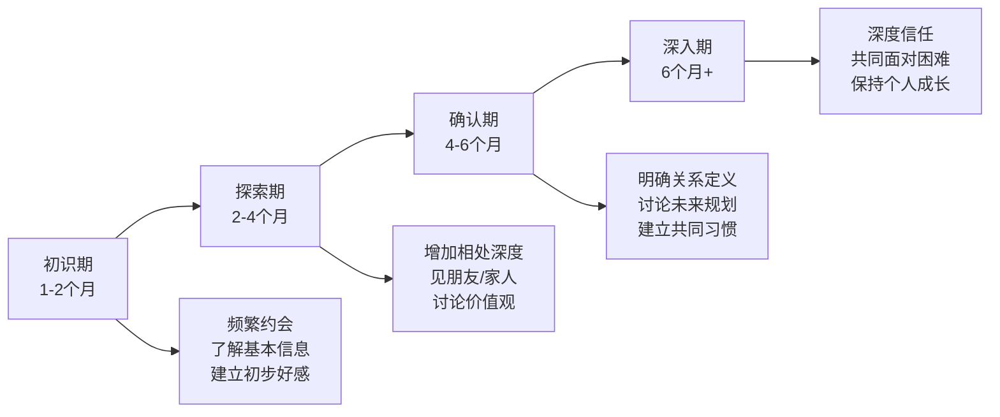

## 二、社交场景应对

社交场景是社交能力的"实战考场"。理论知识再丰富，最终都要在具体场景中落地检验。不同场景有不同的规则、节奏和隐性期望——职场社交讲究分寸感和专业度，聚会社交需要快速破冰和广泛连接，约会社交考验真诚表达和情绪感知，线上社交则要求在缺乏非语言线索的情况下精准传达意图。

本章按照四大核心场景逐一拆解，每个场景都包含：底层逻辑→具体策略→场景模板→常见误区→进阶技巧，确保你能直接上手使用。

### 2.1 职场社交

职场社交的本质不是"交朋友"，而是**建立高效的工作关系网络**。它的底层逻辑是**互惠原则**加上**专业信任**——你能为他人解决什么问题，决定了你在职场网络中的价值。

#### 2.1.1 向上管理

向上管理不是讨好领导，而是**建立与上级的高效协作关系**，让双方都能更好地完成工作目标。管理学大师彼得·德鲁克在《卓有成效的管理者》中指出：管理上级是下属的责任，因为上级的绩效直接影响下属的工作成果。

**理解你的上级：四个关键维度**

| 维度 | 具体内容 | 观察方法 |
|------|---------|---------|
| 工作风格 | 有的上级喜欢掌控细节，有的只看结果；有的偏好书面汇报，有的喜欢口头沟通 | 观察上级日常沟通方式、会议风格、对报告的反馈 |
| 压力来源 | 上级也有上级，理解他的KPI和压力点，才能找到共鸣 | 留意公司战略方向、季度目标、上级在会议中反复强调的内容 |
| 期望标准 | 上级对"好"的定义是什么？效率？质量？创新？ | 从上级对你和同事工作的正面/负面反馈中提炼 |
| 决策模式 | 数据驱动型还是直觉型？快速决策还是深思熟虑？ | 观察上级做重大决策时的行为模式 |

**有效向上管理的六步策略**

第一步：主动对齐期望。入职或接手新项目时，主动找上级聊一次："关于这个项目，您最关注的是什么？您希望我在汇报中重点体现哪些内容？"这一个问题能省去后续大量返工。

第二步：建立固定沟通节奏。根据上级偏好，建立周报/双周报/每日简报等固定沟通机制。内容结构建议：

【本周完成】
- 项目A：完成了XX，结果是XX
- 项目B：推进到XX阶段

【下周计划】
- 项目A：预计完成XX
- 项目C：启动XX

【需要支持】
- XX事项需要您协调/决策

第三步：管理预期，做到"承诺少、交付多"。当你评估任务需要5天时，向上级说"需要7天"——留出缓冲应对意外，然后在第5天交付，远好于承诺3天却在第5天交付。过度承诺是信任的最大杀手。

第四步：带着方案提问题。遇到问题时，永远带着至少两个解决方案去找上级："目前遇到XX问题，我有两个思路——方案A是XX，优势是XX，风险是XX；方案B是XX。我个人倾向于方案A，您怎么看？"这展示了你的思考能力，也给了上级决策的空间。

第五步：适应上级的沟通频率。有的上级喜欢"没有消息就是好消息"，有的则希望随时了解进展。你需要主动适应而非让上级适应你。可以在前几周试探性地增加沟通频率，观察上级的反应来调整。

第六步：关键时刻靠得住。日常表现决定了你的基准分，但关键时刻的表现决定了你的上限。在项目危机、重要汇报、团队冲突等关键节点，主动承担、稳定输出，是建立深层信任的最快方式。

**向上管理的常见误区**

- ❌ 只报喜不报忧：问题隐瞒得越久，爆发时伤害越大。正确做法是早期预警+解决方案
- ❌ 把上级当朋友：过度分享私人生活、抱怨其他同事，会模糊边界
- ❌ 等上级来问你：被动等待指令，会让你变成"工具人"而非"合作伙伴"
- ❌ 当众质疑上级：有不同意见私下沟通，给上级留面子

#### 2.1.2 同事关系

同事关系的核心原则是**专业友好，适度亲近**。不需要和每个同事成为朋友，但需要和每个合作过的同事建立"靠谱"的印象。

**建立良好同事关系的具体做法**

真诚关心而非刻意讨好。记住同事提到的小事（孩子的生日、正在备考、喜欢的球队），在合适时机自然提及，这比刻意送礼更能建立好感。例如："上次你说孩子要参加钢琴比赛，结果怎么样？"

提供价值而非只索取。主动分享有用的信息、帮同事解决力所能及的问题、在同事需要时提供支持。"给予者"在职场中长期来看比"索取者"获得更多的机会和帮助——这是亚当·格兰特在《给予》一书中用数据证明的结论。

尊重差异。每个同事都有不同的性格、工作风格和价值观。内向的同事可能不喜欢被拉去聚餐，但可能很乐意收到一封真诚的感谢邮件。学会用对方能接受的方式而非你习惯的方式表达善意。

**处理职场冲突的四层策略**

```mermaid
flowchart TD
    A[发现冲突] --> B{冲突类型}
    B -->|工作分歧| C[对事不对人]
    B -->|人际摩擦| D[私下一对一沟通]
    B -->|利益冲突| E[寻求双赢方案]
    B -->|严重违规| F[寻求HR/上级介入]
    
    C --> C1[聚焦问题本身]
    C --> C2[用数据和事实说话]
    C --> C3[提出建设性建议]
    
    D --> D1[选择合适的时机和地点]
    D --> D2[用"我"句式表达感受]
    D --> D3[倾听对方的视角]
    
    E --> E1[列出双方核心诉求]
    E --> E2[寻找重叠区域]
    E --> E3[创造性地扩展选项]
```

具体沟通模板——用"我"句式而非"你"句式：
- ❌ "你总是不按时提交数据，搞得我没法做报告"
- ✅ "我在做报告时发现数据还没到，导致我需要加班赶工。我们能不能商量一个双方都能接受的提交时间？"

#### 2.1.3 跨部门协作

跨部门协作是职场中最容易出问题的社交场景之一。根本原因在于：不同部门有不同的目标、KPI、工作节奏和"方言"（术语），这些差异会导致沟通成本急剧上升。

**跨部门协作的实操框架**

第一步：在项目启动前建立"共同语言"。花30分钟了解对方部门的核心目标、当前压力和专业术语。这30分钟的投入能在后续节省数小时的沟通成本。

第二步：明确RACI矩阵。每个任务项都要明确：谁负责执行(R)、谁最终负责(A)、需要咨询谁(C)、需要通知谁(I)。模糊的责任划分是跨部门项目失败的首要原因。

第三步：建立高频轻量级沟通机制。不需要每次开会讨论一小时，每天或每两天用5分钟同步进展即可。可以用一个共享文档或群消息完成。

第四步：主动展示可靠性。跨部门协作中，"靠谱"是最稀缺的品质。按时交付你承诺的部分，有问题提前告知，不推诿——这会让你成为各部门都愿意合作的人。

**跨部门社交的长期价值**

跨部门人脉是职场晋升的隐形加速器。当你需要资源、信息、或晋升支持时，来自其他部门的认可远比本部门的评价更有说服力。每个季度至少认识一个新部门的关键人物，保持"弱连接"的活跃度。

#### 2.1.4 行业人脉建设

行业人脉是职场社交的"护城河"——它不受公司变动影响，是你真正的职业资产。

**系统化人脉建设的五个步骤**

**第一步：明确目标。** 人脉建设不是漫无目的地社交，而是有方向地连接。问自己：未来3年，我在哪些方面最需要外部资源？行业知识、职业机会、合作伙伴、技术前沿、投资资源？目标不同，社交策略完全不同。

**第二步：选择平台和场景。** 不同平台有不同的社交效率：

| 平台类型 | 优势 | 适合场景 | 社交效率 |
|---------|------|---------|---------|
| 行业峰会/大会 | 高质量、面对面、有共同话题 | 深度连接、行业洞察 | ⭐⭐⭐⭐ |
| 专业协会/社团 | 持续性、有组织、有信任基础 | 长期人脉维护 | ⭐⭐⭐⭐ |
| 线上社区（知乎/即刻/Twitter/X） | 覆盖广、门槛低、异步交流 | 建立个人品牌、弱连接 | ⭐⭐⭐ |
| 校友网络 | 天然信任感、分布广泛 | 跨行业连接 | ⭐⭐⭐⭐ |
| 线下沙龙/工作坊 | 小规模、高质量、深度交流 | 精准社交 | ⭐⭐⭐⭐⭐ |

**第三步：先提供价值。** 在你向任何人"索取"之前，先想清楚你能提供什么。这可以是一篇有价值的文章分享、一个行业内幕消息、一次牵线搭桥、一个真诚的推荐。亚当·格兰特的研究表明，长期来看，"给予者"在职业成就上远超"索取者"和"互利者"。

**第四步：建立系统化的维护机制。** 人脉不维护就会萎缩。建立一个简单的联系人管理系统（可以是一个表格或Notion数据库），记录：姓名、职业、上次联系时间、共同话题、下次互动计划。每季度至少与5位重要联系人互动一次。

**第五步：通过内容建立个人品牌。** 写作、演讲、播客、开源项目——任何能展示你专业能力的形式都可以。个人品牌是"被动社交"的最佳工具：你不需要主动去找别人，别人会因为你的内容来找你。

#### 2.1.5 职场社交场景速查表

| 场景 | 关键策略 | 常见错误 | 高手做法 |
|------|---------|---------|---------|
| 新入职 | 主动自我介绍、午餐与同事交流、了解非正式规则 | 只和同部门的人说话、过于沉默或过于活跃 | 第一周记住20个同事的名字和职能，主动约午餐 |
| 团队会议 | 积极发言但不抢话、认可他人贡献 | 完全沉默或过度表现 | 每次会议至少贡献一个有价值的观点或问题 |
| 公司聚会 | 与不同部门的人交流、适度饮酒 | 只和熟人扎堆、喝醉失态 | 设定目标：认识3个新同事，准备几个轻松话题 |
| 客户接待 | 充分准备、关注需求、建立个人连接 | 只聊业务、忽视个人关系 | 提前研究客户背景，找到共同兴趣点 |
| 离职告别 | 感谢每个人、保持联系、不烧桥 | 不告而别、临走前吐槽 | 逐一告别重要同事，发一封真诚的感谢邮件 |

### 2.2 聚会社交

聚会社交的底层逻辑是**快速建立好感和记忆点**。在有限的时间内（通常2-4小时），你需要完成从"陌生人"到"值得后续联系的人"的转变。这和职场社交不同——没有持续的工作接触来建立信任，你需要在第一次见面时就创造足够的连接感。

#### 2.2.1 参加聚会前的准备

**信息准备**

在参加聚会前，尽可能了解以下信息：
- 聚会的性质：是朋友局、行业聚会、校友聚会还是相亲活动？性质决定了你的社交策略
- 参与者构成：有哪些人参加？有没有你特别想认识的人？提前在社交媒体上了解他们的背景
- 场地信息：室内还是室外？有没有可以安静交谈的角落？

**话题准备**

准备3-5个"万能话题"，这些话题适用于大多数聚会场景：
- 最近看的一本书/一部电影/一个纪录片（展示品味和思考深度）
- 最近去过的地方或计划去的地方（旅行话题天然容易展开）
- 当前行业的一个有趣趋势（展示专业度的同时引发讨论）
- 一个有趣的个人经历或爱好（制造记忆点）
- 对方的领域或兴趣（用真诚的好奇心提问）

准备话题的目的不是"背台词"，而是防止你在紧张时大脑一片空白。有了这几个锚点，你随时可以找到话题方向。

**心理准备**

设定合理的社交目标。不要给自己"今晚要成为全场焦点"的压力，一个更实际的目标是：深入交流1-2个人，泛泛交流3-5个人。质量远比数量重要。

如果你有社交焦虑，可以提前做以下准备：
- 到达时间：提前10分钟到，人少时更容易开始对话，比迟到被一群人注视要好
- 安全行为：提前想好一个"退路"，比如"如果感觉不舒服，我可以去阳台透气"，有退路反而让你更从容
- 预热社交：去聚会的路上和朋友打个电话或发几条消息，让自己的社交"肌肉"先热身

#### 2.2.2 聚会中的社交策略

**入场阶段（前15分钟）**

到达后不要急于开始社交。先做三件事：
1. 观察环境——找到人流量大的区域（通常是食物和饮料附近）
2. 找到主人或认识的人——请他们为你做介绍，这比自己硬搭话有效得多
3. 调整状态——拿一杯饮料（不一定要喝，手里有东西会让你更自然），深呼吸，告诉自己"我来是为了享受"

**破冰阶段**

加入正在进行的对话群体：找到一个看起来开放的群体（身体语言显示他们欢迎新成员——站位有空隙、目光偶尔扫向外部），走近时微笑，用一个自然的观察切入："你们在聊什么？听起来很有趣"，或者"刚才那个XX（食物/活动/演讲）真不错，你们试过吗？"

一对一破冰的万能公式：**观察+好奇提问**。例如：
- "你的胸针很有意思，有什么故事吗？"（观察+好奇）
- "你也是第一次来这种活动吗？"（共同身份）
- "刚才演讲里提到的XX，你怎么看？"（共同经历+邀请表达）

**深化阶段**

当你和某人开始对话后，使用"3-3-3法则"让对话深化：
- 3分钟内建立初步连接（找到共同点）
- 3个来回后从表面话题进入个人话题（"你为什么会关注这个领域？"）
- 30分钟后如果聊得好，交换联系方式并约定后续

对话中的关键技巧：
- **FORD法则**：Family（家庭）、Occupation（职业）、Recreation（娱乐）、Dreams（梦想）——这四个话题几乎适用于所有人
- **镜像效应**：适度模仿对方的语速、音量和身体语言，会无意识地增加亲近感
- **主动透露**：适度的自我暴露（分享一个小缺点或一个有趣的失败经历）会让对方更愿意敞开心扉

**广度与深度的平衡**

聚会社交的一个常见问题是"只和一个人聊到底"。设定一个原则：每45分钟换一个交流对象。这不是不礼貌，而是聚会社交的正常节奏。你可以用以下方式自然过渡：
- "我去拿点喝的，待会儿再聊"
- "我看到一个朋友，去打个招呼，回头聊"
- "我去认识一下那边的朋友，加个微信吧，回头继续聊"

#### 2.2.3 聚会后的跟进

聚会社交的80%价值产生在聚会之后。不跟进的聚会社交，基本等于浪费时间。

**跟进的黄金时间线**

| 时间节点 | 行动 | 具体示例 |
|---------|------|---------|
| 当天晚上 | 发一条感谢/回顾消息 | "今天聊得很开心，尤其是你提到的XX观点，很有启发" |
| 1-3天内 | 如果约定了后续，确定具体时间 | "上次说的那家咖啡厅，周六下午方便吗？" |
| 1-2周内 | 分享对方可能感兴趣的内容 | "看到这篇文章想到你，关于XX的，你可能会感兴趣" |
| 1个月内 | 完成一次实质性的互动 | 喝咖啡、一起参加活动、推荐一个资源 |

**跟进消息模板**

对深度交流过的人：
> "嗨[名字]，昨天在[聚会名称]聊得很开心。你提到的[具体话题]让我想到[具体内容]，改天有空可以继续聊这个。[附上相关资源或链接]"

对泛泛交流过的人：
> "嗨[名字]，我是昨天在[聚会名称]的[你的名字]，[简短提醒你们聊了什么]。很高兴认识你，有空可以一起[具体的活动]。"

### 2.3 约会社交

约会社交是最私密也最容易让人焦虑的社交场景。它的核心不是"技巧"，而是**真诚的自我表达+对对方的真诚好奇**。所有技巧都只是让这两个核心更好地展现出来。

#### 2.3.1 认识潜在对象

**线下渠道**

| 渠道 | 优势 | 适合人群 | 社交效率 |
|------|------|---------|---------|
| 兴趣社群（读书会/运动俱乐部/志愿者） | 有共同话题、自然接触、看到真实状态 | 有固定兴趣爱好的人 | ⭐⭐⭐⭐⭐ |
| 朋友介绍 | 有信任背书、了解基本情况 | 社交圈较广的人 | ⭐⭐⭐⭐ |
| 工作/学习场景 | 自然接触、有共同话题 | 同行业/同校的人 | ⭐⭐⭐ |
| 社交活动/派对 | 场景轻松、容易破冰 | 外向型人格 | ⭐⭐⭐ |

**线上渠道**

选择平台时要匹配自己的需求和风格：
- 认真找伴侣：选择用户画像偏认真的平台（如某目的明确的社交App）
- 拓展社交圈：选择兴趣导向的社区（豆瓣小组、即刻、小红书）
- 展示生活方式：通过朋友圈/社交媒体的内容展示你的真实生活

**认识新朋友的正确心态**

这是约会社交中最重要也最容易被忽视的部分。心态不对，再好的技巧都是空中楼阁。

心态一：去掉"目的感"。当你带着"我要找对象"的目的去社交时，你的每一个行为都会变形——过度讨好、过度表现、过度紧张。正确的心态是"我想认识有趣的人"，这让你更自然、更有魅力。

心态二：接受不确定性。不是每一次互动都会发展成恋爱关系，这完全正常。把每一次认识新朋友都当作一次练习和体验，而非一次"成败在此一举"的考试。

心态三：展示真实的自己。伪装可以维持一时，但维持不了一世。在初期就展示真实的兴趣、价值观和生活方式，才能吸引到真正匹配的人。

心态四：保持耐心。高质量的连接需要时间。不要因为几次不成功的尝试就灰心或降低标准。每一次"不合适"都在帮你更清楚自己想要什么。

#### 2.3.2 第一次约会

**约会前的准备**

场景选择是第一次约会成功的关键因素之一。好的约会场景需要满足三个条件：
1. **可以交谈**——太吵的酒吧、需要全神贯注的电影都不是好选择
2. **有活动可做**——纯聊天会有压力，有共同活动（散步、看展、做手工）可以缓解尴尬
3. **时间灵活**——好的话可以延长，不好可以自然结束

推荐的第一次约会场景：
- 咖啡厅+周边散步（经典组合，灵活度高）
- 看展览/美术馆（有话题、有活动、环境好）
- 逛市集/特色街区（轻松、有探索感）
- 一起做饭/烘焙课程（互动性强，展示生活能力）

**约会中的核心原则**

原则一：70/30法则。让对方说70%，你说30%。这不是让你沉默，而是用好的问题引导对方表达。例如：
- ❌ "你是做什么工作的？" → "做IT的" → 冷场
- ✅ "你平时工作里最让你有成就感的是什么？" → 开放式回答，可以深入展开

原则二：关注对方的情绪而非信息。第一次约会不是面试，不需要收集对方的简历信息。关注对方说话时的表情、语调、肢体语言——当对方提到某个话题时眼睛发光，那就是你可以深入的方向。

原则三：适度的自我暴露。分享一些个人故事、想法、甚至小缺点，会让对方觉得你真实可信。例如："我其实有点路痴，上次导航都能走反"——这种小缺点反而会让你更有亲和力。

原则四：真诚的赞美。赞美要具体、真诚、不油腻：
- ❌ "你好漂亮"（太泛泛）
- ✅ "你笑起来很有感染力"（具体+真诚）
- ✅ "你刚才讲的那个观点我从来没想过，很有意思"（赞美内在）

原则五：全程专注。手机静音放包里，眼神保持适度接触（60-70%的时间看着对方），身体微微前倾表示关注。这些非语言信号传递的信息量远大于你说的话。

**约会后的跟进**

- 如果你对对方有好感，在约会后几小时内发一条消息："今天很开心，你提到的那个[具体话题]我还一直在想。"具体比泛泛更有诚意
- 不要过度分析对方的回复速度和措辞——每个人的消息习惯不同
- 如果感觉不合适，诚实地表达，不玩消失："和你聊天很愉快，但我觉得我们可能不太适合发展恋爱关系。祝你找到对的人。"

#### 2.3.3 发展亲密关系

**关系发展的自然节奏**



每个阶段的核心任务不同：
- **初识期**：重点是了解对方的基本情况、兴趣爱好、生活方式，判断是否有继续发展的基础
- **探索期**：开始更深入的了解——对方的家庭背景、价值观、对未来的规划、处理冲突的方式
- **确认期**：明确定义关系，讨论双方的期望和需求，开始面对真实的差异和冲突
- **深入期**：建立深度信任，在困难中互相支持，同时保持各自的个人成长

**健康亲密关系的五个特征**

1. **安全依恋**：双方都感到被接纳和被重视，不需要通过讨好或控制来维持关系
2. **坦诚沟通**：能够讨论任何话题，包括困难的、不舒服的话题，而不担心被惩罚或忽视
3. **独立与亲密的平衡**：保持各自的社交圈、兴趣爱好和个人空间，同时享受在一起的时光
4. **建设性冲突处理**：冲突不可避免，健康的关系不是没有冲突，而是能从冲突中学习和成长
5. **共同成长**：双方都因为这段关系变得更好，而不是一方牺牲自己的成长来满足另一方

**需要警惕的红旗信号**

红旗信号不是"需要磨合的差异"，而是**关系可能有害的警告**。如果你在关系中遇到以下情况，需要认真评估：

- 控制行为：限制你的社交、查看你的手机、要求你汇报行踪、对你的穿着指手画脚
- 不尊重边界：反复忽视你说的"不"，用"我是为你好"来合理化越界行为
- 情绪勒索：用伤害自己、分手、或公开你的隐私来威胁你服从
- 频繁贬低：让你觉得自己不够好、配不上对方、离开对方就活不下去
- 忽冷忽热：只在需要你的时候才联系你，让你一直处于不确定和焦虑中
- 隔离策略：逐渐切断你和朋友、家人的联系，让你只依赖对方

如果你发现自己处于这样的关系中，寻求专业帮助（心理咨询师、信任的朋友或家人）比独自挣扎更有效。

### 2.4 线上社交

线上社交已经成为现代社交的主战场。它的核心挑战在于：**在缺乏非语言线索的情况下，精准传达你的意图、情绪和个性**。一个标点符号、一个表情包、一条消息的发送时机，都可能被对方过度解读或误解。

#### 2.4.1 线上社交的底层逻辑

**线上社交的四个核心特点**

| 特点 | 含义 | 应对策略 |
|------|------|---------|
| 异步性 | 不需要即时回复，有思考时间 | 善用思考时间，但不要过度斟酌导致回复太慢 |
| 可编辑性 | 可以精心组织语言 | 利用这个优势打磨重要消息，但日常交流不要太刻意 |
| 缺乏非语言信息 | 无法传递表情、语调、身体语言 | 善用表情包、语气词、标点符号来补充情绪信息 |
| 永久记录 | 文字消息可以被保存和截图 | 不在情绪激动时发消息，重要对话尽量线下进行 |

#### 2.4.2 微信社交的深度指南

微信是中国最主要的社交工具，掌握微信社交的礼仪和技巧几乎是必备技能。

**消息回复的时间管理**

不同关系层级的消息回复时间期望不同：

| 关系类型 | 理想回复时间 | 可接受延迟 | 超过这个时间需要解释 |
|---------|------------|-----------|-------------------|
| 恋人/伴侣 | 几分钟内 | 1-2小时 | 超过2小时 |
| 亲密朋友 | 几小时内 | 半天 | 超过1天 |
| 普通朋友 | 当天内 | 1-2天 | 超过3天 |
| 工作关系 | 2小时内 | 半天 | 超过1天 |
| 新认识的人 | 当天内 | 2-3天 | 超过1周（基本等于放弃） |

**语音 vs 文字的选择**

语音消息是一把双刃剑。它传递了你的语气和情绪，但也要求对方花更多时间接收。选择原则：

- ✅ 使用语音的场景：表达复杂情感、安慰对方、亲密关系中的日常聊天、对方也在用语音
- ❌ 避免使用语音的场景：工作沟通、对方在开会/公共场合、需要对方快速获取信息的内容、对方明确表示不喜欢语音

**朋友圈社交**

朋友圈是"被动社交"的核心工具——你不需要主动和每个人聊天，通过朋友圈的内容展示和互动，就能维持大量弱关系。

发布策略：
- 频率：每周2-4条，太少没有存在感，太多会让人屏蔽
- 内容比例：生活分享(40%) + 专业/兴趣内容(30%) + 观点/思考(20%) + 互动性内容(10%)
- 避免事项：负面情绪宣泄、炫耀性内容、过于私密的信息、频繁的自拍

互动策略：
- 对重要联系人的朋友圈保持适度互动（点赞+偶尔有质量的评论）
- 评论比点赞更有价值——一条有内容的评论可以重新激活一段关系
- 不要对每条朋友圈都点赞，显得没有诚意

**群聊社交**

群聊是线上社交中最容易"翻车"的场景。关键原则：
- 不在群里发广告、拉票、砍价链接——这是最快消耗好感的方式
- 不刷屏，控制消息条数
- 重要讨论@相关人员，不要让所有人被动参与
- 不传播未经验证的信息
- 在群聊中展示专业度和善意，但不要刻意表现

#### 2.4.3 职业社交平台

**LinkedIn/脉脉的使用策略**

个人资料优化：
- 头像：专业、清晰、面带微笑的正面照，不要用风景/卡通/集体照
- 标题：不只是职位名称，而是你的价值主张——"帮助B2B企业通过内容营销获客"比"市场经理"更有吸引力
- 经历描述：用数据和成果说话，不要只列职责
- 推荐信：主动为3-5位同事写推荐，然后礼貌地请他们为你写

连接策略：
- 发送连接请求时，永远附上个性化的说明（1-2句话说明你是谁、为什么想连接）
- 不要群发连接请求，质量比数量重要
- 连接后24小时内发一条跟进消息，可以是简单的问候或分享一个相关资源

内容策略：
- 每周发布1-2条有质量的内容（行业洞察、工作心得、专业观点）
- 评论行业大咖的内容，展示你的专业思考
- 分享有价值的文章并加上你的解读

#### 2.4.4 线上社交的陷阱与应对

**陷阱一：线上替代线下**

过度依赖线上社交会让你的社交能力退化。文字消息无法传递语气、表情和身体语言，而这些占沟通信息量的60-93%（梅拉宾法则）。线上聊天很投机的两个人，线下见面可能完全不同。

应对：线上聊天2-3周后，如果感觉不错，尽快约线下见面。线上是筛选工具，线下才是关系真正发展的场所。

**陷阱二：过度暴露**

社交媒体的"分享"功能容易让人过度暴露个人生活——每餐都拍、每事都晒、每感都发。这不仅会让别人觉得你缺乏边界感，也会让你的个人信息处于风险之中。

应对：发布前问自己三个问题——这条信息5年后我还愿意让人看到吗？如果被我的领导/客户看到，我会尴尬吗？我发这条的目的是什么？

**陷阱三：社交媒体焦虑**

不断刷朋友圈/Instagram看到别人精心策划的"精彩人生"，会让你产生"只有我过得不好"的错觉。这是典型的**幸存者偏差**加**选择性展示**——你看到的是别人最好的瞬间，和自己最普通的日常比较，自然会焦虑。

应对：限制社交媒体的使用时间（每天不超过30分钟），定期做"社交媒体断食"（1-2天不看），记住你看到的永远不是全部真相。

**陷阱四：线上争论**

在评论区、微信群里和人争论，是情绪和时间的双重黑洞。你几乎不可能通过线上争论改变对方的观点，但你一定会消耗自己的情绪和精力。

应对原则——**HALT法则**：如果你感到Hungry（饿）、Angry（生气）、Lonely（孤独）或Tired（疲惫），不要在网上发表任何观点或回应任何争议性内容。

**陷阱五：用互动量衡量关系质量**

点赞数、评论数、消息回复速度——这些量化指标会误导你对关系质量的判断。一个从不点赞但你遇到困难时第一个出现的朋友，远比一个每条都点赞但从不联系的"好友"有价值。

应对：关注关系的**深度**而非**广度**。定期清理社交媒体关注列表，把注意力集中在真正重要的人身上。

#### 2.4.5 线上社交的进阶技巧

**建立个人品牌**

线上社交的最高境界是"被动吸引"——通过持续输出有价值的内容，让别人主动来找你。

内容创作的框架：
1. 找到你的"交叉点"——你的专业能力 × 你的真实兴趣 × 市场需求
2. 选择1-2个主要平台深耕，而非所有平台都浅尝辄止
3. 保持内容的一致性——风格、主题、发布频率
4. 互动比发布更重要——回复每一条评论，参与相关讨论

**维护线上人脉的系统方法**

每月维护清单：
├── 核心人脉（5-10人）：每周互动，深度交流
├── 重要人脉（20-30人）：每月互动，分享有价值的信息
├── 弱连接（50-100人）：每季度互动，点赞/评论朋友圈
└── 新连接：持续认识新的人，保持社交圈的活力

用一个简单的表格或Notion数据库维护这个系统，记录每个人的上次互动时间和下次互动计划。这不是功利，而是对关系的尊重——你愿意花时间维护这些连接。

### 2.5 跨文化社交

在全球化和互联网时代，跨文化社交已经成为越来越常见的场景。不同文化背景下的社交规则差异巨大，不了解这些差异可能导致误解甚至冒犯。

#### 2.5.1 核心文化差异

| 维度 | 高语境文化（如中国、日本） | 低语境文化（如美国、德国） |
|------|-------------------------|-------------------------|
| 沟通方式 | 含蓄、间接、靠"意会" | 直接、明确、靠"言传" |
| 拒绝方式 | "我再考虑考虑"="不" | "不"就是"不" |
| 时间观念 | 弹性时间、关系优先 | 准时、效率优先 |
| 个人空间 | 较小的社交距离 | 较大的社交距离 |
| 称呼方式 | 称呼头衔/尊称 | 直呼其名 |
| 礼物文化 | 送礼有讲究（不送钟/伞） | 送礼更随意 |

#### 2.5.2 跨文化社交的实用建议

1. **提前研究**：和不同文化背景的人交往前，花10分钟了解基本的社交礼仪
2. **观察学习**：先观察当地人的社交方式，再模仿
3. **主动询问**：不确定时直接问"在你们的文化里，这样做合适吗？"——大多数人会欣赏你的尊重
4. **保持开放**：不同不等于不好，保持好奇心而非评判心
5. **允许犯错**：跨文化社交中犯错是正常的，真诚道歉比完美无错更有价值

### 2.6 本章总结

社交场景应对的核心逻辑可以总结为一个公式：

> **有效社交 = 场景理解 × 心态调适 × 策略执行 × 持续跟进**

| 场景 | 核心能力 | 一句话总结 |
|------|---------|-----------|
| 职场社交 | 分寸感、专业度、互惠思维 | 建立"靠谱"的口碑，成为别人愿意合作的人 |
| 聚会社交 | 快速破冰、广泛连接、后续跟进 | 聚会只是起点，真正的社交在聚会之后 |
| 约会社交 | 真诚表达、情绪感知、耐心节奏 | 去掉目的感，用真实的自己吸引匹配的人 |
| 线上社交 | 精准表达、内容输出、边界管理 | 线上是筛选工具，线下才是关系发展的主战场 |
| 跨文化社交 | 文化敏感度、观察学习、开放心态 | 不同不等于不好，尊重差异是最好的社交策略 |

最后，记住一个反直觉的事实：**最好的社交技巧是不需要技巧**。当你真正对他人感兴趣、真诚地表达自己、持续提供价值时，社交自然会发生。所有技巧只是让你的核心品质更好地被看见，而不是替代它。
