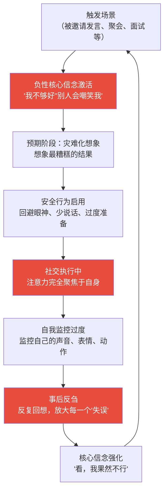
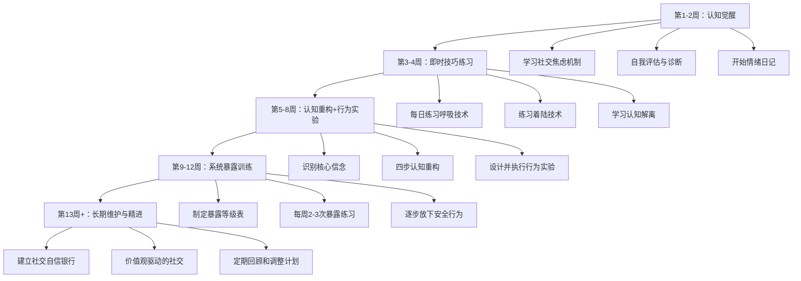

## 三、社交焦虑应对

社交焦虑是现代人最普遍的心理困扰之一。中国心理卫生协会2022年的调查显示，约**40%的中国成年人**在不同程度上经历过社交焦虑，其中约**8-12%**达到社交焦虑障碍（Social Anxiety Disorder, SAD）的临床诊断标准。但社交焦虑并非不可战胜——大量循证心理学研究证明，通过正确的认知调整、系统的行为训练和必要的专业干预，绝大多数人都能显著改善社交焦虑，甚至将焦虑转化为社交中的敏锐感知力。

本节将从**理解机制→自我评估→分层应对→长期建设**的完整路径出发，为你提供一套系统化的社交焦虑应对方案。

### 3.1 理解社交焦虑：从现象到本质

#### 3.1.1 社交焦虑 vs 害怕 vs 内向：三者的核心区别

很多人把社交焦虑和害羞、内向混为一谈，但这三者有本质区别。混淆它们会导致错误的应对策略——比如强迫一个内向者变得"外向"，或者把需要专业干预的焦虑障碍当作"性格问题"忽视。

| 维度 | 正常的社交紧张 | 社交焦虑 | 内向 |
|------|--------------|---------|------|
| **本质** | 对特定高压场景的自然反应 | 持续的、过度的恐惧和回避 | 一种人格特质和能量偏好 |
| **触发条件** | 重大场合（演讲、面试） | 普通社交互动也会触发 | 不恐惧社交，只是偏好独处 |
| **强度** | 轻度不适，可控 | 强烈恐惧，难以控制 | 没有恐惧，只是消耗能量 |
| **对生活的影响** | 不影响日常功能 | 显著影响工作、学习、人际关系 | 不影响社交能力，只是社交频率较低 |
| **事后反应** | 很快忘记 | 反复回想，自我批评 | 恢复能量，没有负面情绪 |
| **核心需求** | 准备和练习 | 认知重建+行为训练+可能的专业帮助 | 充足的独处时间和深度社交 |

**关键区分点**：内向者在社交中选择退出是因为**能量耗尽**，社交焦虑者回避社交是因为**恐惧被评判**。一个内向者可以是优秀的社交者——他们只是需要在社交后独处充电；一个社交焦虑者可能很渴望社交，但被恐惧阻止了。

#### 3.1.2 社交焦虑的心理机制

社交焦虑不是"想太多"那么简单。它有一套精密的心理运作机制，理解这套机制是打破焦虑循环的第一步。

**Clark和Wells的认知模型（1995）**

这是目前学术界最被广泛接受的社交焦虑认知模型。该模型指出，社交焦虑的核心不是社交场景本身，而是你**对社交场景的解读方式**。

这个模型揭示了三个关键的维持因素：

**维持因素一：自我聚焦注意（Self-focused Attention）**

社交焦虑者在社交中会把绝大部分注意力放在自己身上——"我的声音是不是在抖？""我刚才是不是说错话了？""他们是不是觉得我很奇怪？"这种过度的自我监控反而让你无法自然地参与对话，表现变得更僵硬，形成恶性循环。

牛津大学的研究发现，当社交焦虑者被引导将注意力转移到外部环境（比如观察对方眼睛的颜色、注意房间的装饰）时，焦虑水平会显著下降。

**维持因素二：安全行为（Safety Behaviors）**

安全行为是你在社交中用来"保护自己"的策略，但它们实际上在维持焦虑。常见的安全行为包括：

| 安全行为 | 表面作用 | 实际危害 |
|---------|---------|---------|
| 避免眼神接触 | "这样别人就看不到我的紧张" | 让对方觉得你不友善或不自信 |
| 少说话 | "说得少就错得少" | 让对话变得尴尬，别人觉得你无趣 |
| 在脑子里预演下一句要说的话 | "准备好就不会出错" | 无法真正倾听对方，对话变得不自然 |
| 紧握手机/杯子 | "有东西抓着会安心" | 传递紧张信号，阻碍自然的身体语言 |
| 提前离开 | "不舒服就走" | 没有机会体验"其实没那么糟" |
| 过度饮酒 | "喝了酒就不紧张了" | 掩盖问题，可能产生依赖，且酒后表现可能更差 |

安全行为的最大危害在于：当你使用安全行为度过了一个社交场景后，你会把"没出事"归功于安全行为（"幸亏我没多说话"），而不是认识到"其实本来就没什么可怕的"。这强化了你的恐惧信念。

**维持因素三：事后反刍（Post-event Rumination）**

社交焦虑者在社交活动结束后，会花大量时间反复回想自己的表现——而且是有选择性地关注负面细节。你可能会花几个小时纠结于"我说那句话时是不是结巴了"，而完全忽略"对方当时笑了"这个信息。

伊利诺伊大学的研究表明，事后反刍不仅会加剧焦虑，还会扭曲记忆——焦虑者倾向于"记住"比实际情况更糟糕的社交表现。

#### 3.1.3 社交焦虑的神经科学基础

了解大脑如何产生社交焦虑，能帮助你从根源上理解为什么焦虑感如此真实且强烈。

**杏仁核：你的"社交威胁探测器"**

杏仁核是大脑中负责检测威胁的结构。在社交焦虑者的脑中，杏仁核对社交信号（如他人的面部表情、评价性语言）特别敏感。fMRI研究显示，社交焦虑者在看到"不赞成"的面部表情时，杏仁核的激活程度比普通人高出**2-3倍**。

这意味着你的焦虑不是"矫情"——你的大脑确实在以更高的强度处理社交威胁信号。但好消息是，通过系统的训练，杏仁核的反应强度可以被调节。

**前额叶皮层：你的"理性刹车"**

前额叶皮层负责理性评估和情绪调节。在焦虑发作时，杏仁核的"警报"往往压过了前额叶的"理性分析"——这就是为什么你明明知道"没人会注意到我的手在抖"，但还是控制不住地紧张。

**催产素系统**

催产素被称为"社交激素"，它在信任建立和社交放松中发挥关键作用。研究发现，社交焦虑者的催产素系统功能可能较弱，这意味着他们更难在社交中感到安全和放松。好消息是，积极的社交互动本身就能促进催产素释放——这是一个正向循环，只是需要你勇敢地迈出第一步。

### 3.2 自我评估：你的社交焦虑处于什么水平？

在开始应对之前，先做一个客观的自我评估。以下自测基于Liebowitz社交焦虑量表（LSAS）的核心维度简化而成，帮你判断自己的社交焦虑程度。

**请对以下场景评估你的焦虑程度（0=无焦虑，1=轻度，2=中度，3=重度）和回避程度（0=从不回避，1=偶尔回避，2=经常回避，3=总是回避）：**

| 序号 | 场景 | 焦虑程度(0-3) | 回避程度(0-3) |
|------|------|-------------|-------------|
| 1 | 在小组中发言 | | |
| 2 | 与陌生人开始对话 | | |
| 3 | 参加聚会或社交活动 | | |
| 4 | 成为关注的焦点 | | |
| 5 | 与权威人物交谈（领导、老师） | | |
| 6 | 在公共场合打电话 | | |
| 7 | 表达不同意见 | | |
| 8 | 与不太熟的人共进午餐 | | |
| 9 | 在他人面前做某事（写字、吃饭） | | |
| 10 | 主动与人打招呼 | | |

**评分解读：**

| 总分范围 | 你的状态 | 建议 |
|---------|---------|------|
| 0-15分 | 正常范围 | 正常的社交紧张，参考3.3节的即时技巧即可 |
| 16-30分 | 轻度社交焦虑 | 建议系统学习3.3-3.5节的内容，通过自助训练改善 |
| 31-45分 | 中度社交焦虑 | 重点学习3.4节的认知重构和3.6节的系统脱敏，考虑专业帮助 |
| 46-60分 | 重度社交焦虑 | 强烈建议寻求专业心理咨询，同时参考3.7节的干预方案 |

**重要提醒**：这个自测仅供自我参考，不构成临床诊断。如果你的得分较高且严重影响日常生活，请寻求专业心理咨询师的评估。

### 3.3 即时应对：社交焦虑发作时的快速处理技巧

当你正在经历社交焦虑——比如马上要上台演讲、走进一个全是陌生人的房间、或者正在对话中感到极度紧张——以下技巧可以在**1-5分钟内**帮你降低焦虑水平。

#### 3.3.1 生理调节技术

焦虑首先是一个**身体反应**：心跳加速、呼吸变浅、肌肉紧张、手心出汗。通过调节身体状态，可以直接影响焦虑水平。

**技术一：4-7-8呼吸法（Andrew Weil博士开发）**

这是目前最有效的即时呼吸调节技术之一，能在90秒内激活副交感神经系统，降低心率和皮质醇水平。

步骤：
1. 用鼻子吸气，心里默数4秒
2. 屏住呼吸，心里默数7秒
3. 用嘴缓慢呼气，心里默数8秒
4. 重复3-4个循环

要点：
- 呼气时间是吸气的两倍，这是激活副交感神经的关键
- 第一次做可能觉得7秒屏气太长，可以从2-4-6开始
- 不需要深到极限的呼吸，自然深度即可

**技术二：渐进式肌肉放松（快速版）**

焦虑时你的肌肉会不自觉地紧绷——肩膀耸起、下巴咬紧、拳头握紧。通过"先紧张再放松"，你可以迅速释放这些肌肉张力。

快速版（每个部位2秒紧张+3秒放松）：
1. 双手：用力握拳5秒 → 突然松开，感受放松感
2. 肩膀：耸肩到耳朵 → 突然放下
3. 面部：紧闭双眼+咬紧牙关 → 放松
4. 腹部：收紧腹肌 → 放松
5. 全身：同时紧张所有部位 → 全部放松

整个过程约60秒，适合在社交前快速执行。

**技术三：着陆技术（Grounding）——5-4-3-2-1法**

当你感到焦虑开始"失控"时，这个技术能帮你快速回到当下：

环顾四周，找出：
- 5样你能看到的东西（蓝色的杯子、墙上的画……）
- 4样你能触摸到的东西（桌面的温度、衣服的质感……）
- 3样你能听到的声音（空调声、远处的谈话……）
- 2样你能闻到的气味（咖啡香、空气清新剂……）
- 1样你能尝到的味道（刚才喝的水的味道……）

这个技术的原理是：焦虑让你的大脑沉浸在对未来的灾难化想象中，而通过调动五感来关注当下的具体事物，能把注意力从焦虑的思维循环中拉出来。

#### 3.3.2 认知调节技术

**技术一：认知解离——把想法当想法**

焦虑时，你的大脑会产生各种灾难化想法："他们一定觉得我很奇怪""我马上就要出丑了""所有人都在看我"。这些想法感觉如此真实，以至于你把它们当成了事实。

认知解离的核心是：**你不是你的想法。想法只是一个心理事件，不等于现实。**

练习步骤：
1. 觉察："我注意到我正在想'他们会嘲笑我'"
2. 标签："这是一个焦虑的想法"
3. 距离："这个想法可能是真的，也可能不是，我不需要现在就判断"
4. 转移："现在我选择把注意力放在____上"

**技术二：视角转换——"聚光灯效应"的解药**

康奈尔大学的Thomas Gilovich教授的研究证实了"聚光灯效应"（Spotlight Effect）：我们系统性地高估了别人对我们的关注程度。在一个经典实验中，让学生穿着一件印有过气歌星头像的"丢脸"T恤走进教室，穿T恤的学生预测约50%的人会注意到，但实际上只有**23%**的人注意到了。

当你觉得"所有人都在看我"时，问自己三个问题：
1. 上次别人在社交中犯了个小错误，我记住了吗？（大概率记不住）
2. 我花多少时间去评判别人的社交表现？（大概率很少）
3. 如果别人真的注意到了我的紧张，他们会怎么想？（大多数人会理解甚至共鸣）

**技术三：概率校准——从"万一"到"实际"**

焦虑的大脑擅长制造"万一"——"万一我说错话了呢？""万一他们不喜欢我呢？"但"万一"不等于"很可能"。

概率校准练习：
写下你担心的最坏结果 → 评估实际发生的概率（0-100%）
→ 回忆过去10次类似场景，最坏结果实际发生了几次？
→ 如果真的发生了，后果有多严重？能恢复吗？

你会发现：大多数"万一"的概率不到5%，
即使发生了，后果也远没有你想象的那么严重。

### 3.4 认知重构：从根本上改变焦虑思维模式

即时技巧能帮你应对当下的焦虑，但要从根本上改善社交焦虑，需要改变底层的思维模式——这就是认知行为疗法（CBT）的核心。

#### 3.4.1 识别你的"社交焦虑核心信念"

社交焦虑的背后通常有一些深层的核心信念，它们在童年或青少年时期形成，已经成为你"自动运行"的思维操作系统：

| 核心信念 | 自动思维示例 | 触发情境 |
|---------|------------|---------|
| "我不够好/不够有趣" | "他们肯定觉得我很无聊" | 对话中对方沉默了几秒 |
| "我会被拒绝" | "如果我主动打招呼，他们不会理我" | 社交活动 |
| "别人会看到我的缺点" | "他们一定注意到我脸红了" | 成为关注焦点 |
| "我必须完美才能被接受" | "我刚才那个口误毁了整个演讲" | 任何表现性场景 |
| "犯错是不可接受的" | "我刚才说错了，他们一定觉得我很蠢" | 社交互动中的小失误 |

**识别你的核心信念的方法**：

1. **向下挖掘法**：当你感到焦虑时，问自己"这意味着什么？"不断追问。
   - "我怕说错话" → 说错话意味着什么？ → "别人会觉得我蠢" → 别人觉得你蠢意味着什么？ → "他们就不会喜欢我" → 不被喜欢意味着什么？ → "**我不值得被喜欢**" ← 这就是核心信念

2. **日记追踪法**：记录一周内的社交焦虑事件，标注当时的想法，寻找反复出现的主题。

#### 3.4.2 四步认知重构法

一旦识别出核心信念和自动思维，就可以用以下四步法来重构：

**第一步：捕捉（Catch）**

在焦虑出现的那一刻，识别出你的自动思维。这需要练习——刚开始你可能在事后才能意识到，但随着练习，你会越来越快地在当下觉察到。

情绪日记模板：
时间：____
情境：____
焦虑程度(0-10)：____
自动思维："____"
身体反应：____

**第二步：检验（Check）**

用苏格拉底式提问来检验这个想法是否合理：

质疑清单：
1. 支持这个想法的证据是什么？反对的证据呢？
2. 这个想法是否存在认知扭曲？（见下表）
3. 如果朋友遇到同样的情况，我会对ta说同样的话吗？
4. 从现在起一年后，我还会在意这件事吗？
5. 最好的结果是什么？最可能的结果是什么？（不只是最坏的）

常见的认知扭曲：

| 认知扭曲 | 描述 | 示例 |
|---------|------|------|
| 读心术 | 假设你知道别人在想什么 | "他们一定觉得我很奇怪" |
| 灾难化 | 把小问题放大成灾难 | "我结巴了一下，我的职业生涯完了" |
| 以偏概全 | 从一件事推断出普遍结论 | "这次没聊好，我就是个社交失败者" |
| 选择性注意 | 只关注负面信息，忽略正面信息 | 10个人笑了，1个人面无表情→"那个人不喜欢我" |
| 个人化 | 把无关的事归因于自己 | 对方心情不好→"一定是我刚才说错了什么" |
| 应该思维 | 用"应该"给自己施压 | "我应该随时都能侃侃而谈" |

**第三步：替换（Change）**

将扭曲的自动思维替换为更平衡、更现实的想法。注意：不是"正面思维"（那是另一种扭曲），而是**平衡思维**。

替换示例：
❌ 原始思维："他们一定觉得我无聊"
❌ 正面思维（扭曲）："我是最有趣的人！"
✅ 平衡思维："我不知道对方在想什么，可能觉得无聊，
也可能觉得还行。即使对方不感兴趣，这不代表我这个人
无趣，只是这个话题或这个时刻不匹配而已。"

**第四步：验证（Confirm）**

通过实际行动来验证新想法。这是最关键的一步——认知重构不是在脑子里"说服自己"，而是通过真实的行为实验来更新你的信念系统。

#### 3.4.3 行为实验：用事实说话

行为实验是CBT中最有力的工具之一。它的逻辑是：与其在脑子里反复争论"他们会怎么看我"，不如设计一个小实验去验证。

**行为实验的四步流程：**

1. 预测：写下你担心会发生的事
   例："如果我在会议上提出不同意见，大家会冷场，领导会不高兴"

2. 设计实验：选择一个安全但真实的场景去测试
   例："下周的部门会议上，对一个非核心议题提出不同看法"

3. 执行并观察：实际去做，注意观察发生了什么
   例："我说了不同意见后，有同事补充了另一个角度，
   领导说'这个角度不错，我们可以讨论一下'"

4. 更新信念：对比预测和实际结果
   例："我的预测和实际结果差距很大。提出不同意见并没有
   导致冷场，反而引发了有价值的讨论。下次我可以更自信
   地表达观点。"

**行为实验的难度递进设计：**

| 等级 | 实验示例 | 预期焦虑 | 目标 |
|------|---------|---------|------|
| 1级 | 向店员多问一个问题 | 轻度 | 体验"主动交流并不会被拒绝" |
| 2级 | 在熟悉的朋友聚会中主动发起一个话题 | 轻-中度 | 体验"我的观点是被接受的" |
| 3级 | 在工作会议中提出一个问题或建议 | 中度 | 体验"表达意见是安全的" |
| 4级 | 在不太熟的群体中加入讨论 | 中-重度 | 体验"我能融入新群体" |
| 5级 | 做一次公开演讲或分享 | 重度 | 体验"即使紧张也能完成，而且结果不错" |

### 3.5 行为训练：从回避到拥抱的系统脱敏

#### 3.5.1 暴露疗法的原理和操作

暴露疗法（Exposure Therapy）是治疗社交焦虑最有效的行为干预手段之一，已有超过50年的循证研究支持。其核心原理是**习惯化**（Habituation）：当你反复、有计划地面对你害怕的社交场景时，你的焦虑反应会逐渐降低。

但暴露疗法不是"硬着头皮上"那么简单。有效的暴露需要满足以下条件：

有效暴露的四个原则：
1. 有计划：从低焦虑场景逐步到高焦虑场景
2. 有结构：每次暴露前制定计划，暴露后记录和反思
3. 持续足够长：在场景中停留足够长的时间，让焦虑自然下降
4. 不使用安全行为：放下手机、直视对方、正常说话音量

**社交焦虑暴露等级表（示例）：**

根据你的具体恐惧情况定制以下等级表，从最容易到最困难排列：

等级1（焦虑20-30/100）：
□ 对陌生人微笑
□ 向店员问路
□ 给朋友发消息约见面

等级2（焦虑30-40/100）：
□ 在小组中回答一个简单问题
□ 和同事在茶水间闲聊2分钟
□ 在微信群里发表一个简短看法

等级3（焦虑40-50/100）：
□ 在会议中提出一个问题
□ 主动邀请不太熟的同事一起吃午饭
□ 在3-4人的小组讨论中分享观点

等级4（焦虑50-60/100）：
□ 在10人以上的会议上做简短发言
□ 参加一个全是陌生人的社交活动
□ 对权威人物表达不同意见

等级5（焦虑60-80/100）：
□ 做一次正式的公开演讲（20人以上）
□ 在社交活动中主动认识5个陌生人
□ 主持一次会议或讨论

#### 3.5.2 每日社交训练计划

将暴露练习融入日常生活，形成持续的训练节奏：

**第一周：观察阶段**
- 每天选择一个社交场景作为"观察者"参与
- 任务：注意观察社交互动中**实际发生了什么**，而不是你想象会发生什么
- 记录：人们的反应通常是什么？有多少人在评判别人？

**第二周：微互动阶段**
- 每天完成2-3个低压力的社交互动
- 示例：对服务人员说一句额外的话（"今天天气真好"）、在电梯里和邻居打招呼、给朋友的朋友圈写一条有内容的评论
- 记录：互动后的感受与预期的对比

**第三周：主动发起阶段**
- 每天主动发起一次有意义的社交互动
- 示例：午餐时和不太熟的同事坐在一起、在小组中主动发言、给很久没联系的朋友发消息
- 记录：焦虑在互动过程中是如何变化的？

**第四周：挑战阶段**
- 每周至少一次挑战中等难度的社交场景
- 示例：参加一个社交活动并主动认识新人、在会议上做一次发言、邀请朋友参加某个活动
- 记录：你对社交焦虑的认知发生了什么变化？

### 3.6 长期建设：构建社交自信的心理基础

即时技巧和认知重构能帮你应对和改善焦虑，但真正的"免疫"需要长期的心理建设。

#### 3.6.1 自我同情：焦虑者的"底层修复"

社交焦虑者最突出的特点之一是**对自己的严苛**——你可能对朋友的社交失误无比宽容（"没关系，大家都会紧张"），但对自己的同样的失误无比严苛（"我又搞砸了，我真是个废物"）。

Kristin Neff博士的自我同情（Self-compassion）研究表明，自我同情比自尊更能预测心理健康。自我同情不是自我放纵，而是在困难时刻**像对待好朋友一样对待自己**。

**自我同情的三个组成部分：**

| 组成部分 | 对自己的社交焦虑意味着什么 | 实践方式 |
|---------|----------------------|---------|
| 自我友善（而非自我批评） | "焦虑让我很痛苦，我对自己感到同情"而非"我太弱了" | 焦虑时对自己说："这是一个困难的时刻，我理解你的痛苦" |
| 共同人性（而非孤立感） | "很多人也会紧张，这是人类共有的体验"而非"只有我这样" | 记住：40%的成年人都在经历不同程度的社交焦虑 |
| 正念（而非过度认同） | "我注意到焦虑的感觉"而非"我就是一个焦虑的人" | 用观察者的视角描述焦虑，而非被焦虑淹没 |

**自我同情信练习：**

当你在社交中感到失败或尴尬时，给自己写一封信：

亲爱的[你的名字]：

我知道你今天在[社交场景]中感到很紧张和尴尬。
这种感觉真的很不好受，我理解你的痛苦。

但我想让你记住：
1. [描述一个客观的事实，而非灾难化的解读]
2. [回忆一个你做得还不错的社交经历]
3. [一个你对自己说过的最严厉的批评，然后像对朋友一样反驳它]

你不需要在社交中完美。你只需要做真实的自己。

关心你的，
[你的名字]

#### 3.6.2 价值观驱动：超越焦虑的"为什么"

很多社交焦虑者把注意力放在"消除焦虑"上，但更好的策略是**朝着你重视的方向前进**——焦虑只是路上的天气，不是目的地。

ACT（接纳承诺疗法）的核心理念是：即使焦虑存在，你仍然可以按照自己的价值观生活。

**找到你的社交价值观：**

问自己：
1. 在人际关系中，什么对我最重要？
   （真诚？深度连接？帮助他人？被理解？）

2. 如果社交焦虑完全消失，我会做什么不同的事？
   （交更多朋友？在工作中更主动？参加某个社团？）

3. 社交焦虑让我错过了什么我真正重视的东西？
   （与家人的关系？职业机会？友谊？）

4. 在生命的尽头回望，我希望自己在社交方面是什么样的？
   （有几位挚友？与家人关系融洽？在职业中被尊重？）

当你找到了自己的社交价值观，焦虑就不再是"必须消灭的敌人"，而是"与你同行但不会阻止你的伙伴"。

#### 3.6.3 社交自信的复利积累

自信不是一天建立的，它是无数次"我做到了"的积累。关键在于**从成功的小事开始**，建立正向循环。

**社交自信银行：**

每天晚上花2分钟记录：
今天我在社交中做到了什么？（无论多小）

示例：
✓ 主动和同事打了招呼
✓ 在群聊中回复了一个消息
✓ 对陌生人微笑了一下
✓ 在会议上说了两句话
✓ 给朋友打了个电话

每月回顾时，你会惊讶于自己积累的进步。

### 3.7 内向者的社交焦虑应对：不是缺陷，是不同的操作系统

内向和社交焦虑经常被混为一谈，但它们是两个独立的维度。一个内向者可以完全没有社交焦虑，一个外向者也可以有严重的社交焦虑。然而，当一个内向者**同时**有社交焦虑时，情况会更复杂——因为他们可能会把自己的社交回避归因于"我就是内向"，从而忽视了可以改善的焦虑部分。

#### 3.7.1 内向者 vs 社交焦虑者：自我辨别清单

请回答以下问题（是/否）：

关于内向的特征：
□ 社交后我需要独处来恢复能量
□ 我更喜欢一对一的深度交流而非大型聚会
□ 独处是我真正享受的，而非被迫的
□ 我不恐惧社交，只是觉得它消耗能量

关于社交焦虑的特征：
□ 我在社交前会担心"万一出错怎么办"
□ 我经常回避社交场合，即使我很想去
□ 我在社交中过度监控自己的表现
□ 社交后我会反复回想自己的"失误"

如果前4个"是"多 → 主要是内向特质，参考本节内向策略
如果后4个"是"多 → 存在社交焦虑，建议学习3.3-3.6的内容
如果两组都有"是" → 内向+社交焦虑，两套策略都需要

#### 3.7.2 内向者的社交优势清单

内向者在社交中拥有一些外向者不具备的独特优势，利用好这些优势可以让你用"自己的方式"社交，而非模仿外向者：

| 优势 | 原因 | 如何利用 |
|------|------|---------|
| 深度倾听 | 内向者更善于耐心地倾听他人 | 在社交中发挥"倾听者"角色，人们最喜欢善于倾听的人 |
| 深度思考 | 内向者倾向于先思考再发言 | 你的发言往往更有深度和洞察力，这是稀缺品质 |
| 一对一深度交流 | 内向者在小范围场景中表现最好 | 不追求在大型聚会中成为焦点，专注于深度连接 |
| 观察力 | 内向者花更多时间观察环境和人 | 你能注意到别人忽略的细节，这是社交中的情报优势 |
| 文字表达 | 内向者通常在异步沟通中表现更好 | 善用文字社交（邮件、消息），这也是真实的社交能力 |
| 真诚 | 内向者不擅长"表演"，反而更真实 | 真诚是建立深度信任的基础，长期来看比"八面玲珑"更有价值 |

#### 3.7.3 适合内向者的社交策略

**策略一：能量管理，而非时间管理**

社交日历设计：
├── 高能量社交（需要出席的重要活动）：每周最多1-2次
├── 中能量社交（工作中的正常互动）：每天，但控制时长
├── 低能量社交（文字交流、一对一）：随时，按舒适度
└── 充电时间：每次高能量社交后，安排至少等量的独处时间

**策略二：选择你的社交战场**

不是所有社交场景都值得你投入。选择你最能发挥优势的场景：

优先选择：
✅ 3-5人的小团体聚会（而非50人的派对）
✅ 有共同话题的活动（读书会、兴趣小组）
✅ 有明确目的的社交（学习小组、项目合作）
✅ 一对一的深度咖啡聊天
✅ 线上社群（文字交流是你的优势领域）

可以避免（不焦虑的情况下）：
✅ 无明确目的的大规模社交活动
✅ 需要长时间"表面社交"的场合

**策略三：用深度替代广度**

邓巴数告诉我们，人类能维持的稳定社交关系上限约150人。但对于内向者，真正投入维护的关系可能只需要**30-50人**。关键是这些关系的深度——3个能在深夜打电话倾诉的朋友，远比300个点赞之交更有价值。

**策略四：利用异步沟通的优势**

内向者在需要即时反应的社交中（如即兴发言、闲聊）可能感到压力，但在异步沟通中（如邮件、消息、文字）往往表现出色。善用这个优势：

- 重要的人际互动，优先选择文字而非语音
- 用精心写就的邮件建立职业关系
- 在社交平台通过内容（而非互动频率）建立影响力

### 3.8 特定场景的应对方案

#### 3.8.1 公开演讲焦虑

公开演讲是社交焦虑中最常见的恐惧之一。美国的一项调查显示，人们甚至把"公开演讲"排在"死亡"之前，成为最恐惧的事情。

**演讲前（准备阶段）：**

内容准备：
1. 对内容烂熟于心——不是背稿，而是对框架了然于胸
2. 准备一个强有力的开头——开头30秒顺利了，后面的焦虑会大幅降低
3. 准备1-2个互动环节——把单向输出变成双向交流，降低"被评判"的感觉

身体准备：
1. 演讲前20分钟做4-7-8呼吸（3个循环）
2. 演讲前10分钟做渐进式肌肉放松
3. 提前到场熟悉环境——站在讲台上感受一下空间

心理准备：
1. 重新定义"成功"：目标不是"完美无瑕"，而是"把核心信息传达出去"
2. 预期焦虑是正常的：即使是专业演讲者也会紧张，紧张说明你在乎
3. 观众不是敌人：大多数人希望你成功，他们来是为了获得有价值的内容

**演讲中（执行阶段）：**

如果感到焦虑升级：
1. 暂停2秒——观众会觉得你在"思考"，不会注意到你在调节
2. 看友好的面孔——找几个在微笑或点头的观众，轮流看他们
3. 喝一口水——这个动作给你一个自然的暂停，也是喝水的放松效果
4. 放慢语速——焦虑时我们不自觉地加快语速，有意识地慢下来

如果忘记了下一句：
1. 停顿——停顿比慌张地"嗯嗯啊啊"更专业
2. 回顾上一句——用自己的话复述一遍，思路往往会回来
3. 看一眼提纲——完全没问题，没有人要求你脱稿到完美
4. 直接说"让我整理一下思路"——承认自己需要思考，反而显得真实

**演讲后（复盘阶段）：**

避免的复盘方式：
❌ 逐字逐句回想自己的每一句话
❌ 只关注讲得不好的部分
❌ 用"完美的演讲"作为标准

健康的复盘方式：
✅ 记录3个做得好的地方
✅ 记录1-2个可以改进的地方（具体、可操作）
✅ 记录观众的正面反馈（实际的，不是你想象的）
✅ 给自己一个完成的肯定

#### 3.8.2 聚会焦虑

对于社交焦虑者来说，聚会可能是最具挑战性的场景之一——没有明确的角色、需要大量即兴互动、无法预测会发生什么。

**聚会前的"安全网"设置：**

1. 和一个信任的朋友一起去——有"安全基地"会让焦虑降低50%以上
2. 设定时间限制——"我待一个小时就走"，有退路反而更从容
3. 准备3个话题——不是背台词，而是防止大脑空白的"急救包"
4. 提前到达5分钟——人少时更容易开始对话，比迟到被一群人注视好

**聚会中的"最小可行社交"策略：**

如果你感到焦虑，不需要"成为全场焦点"。以下是最小可行目标：
1. 和至少1个人进行一次3分钟以上的对话
2. 记住1个新认识的人的名字
3. 主动发起1次话题

完成这3个目标，你今晚的社交就是成功的。
其他的互动都是"额外加分"。

#### 3.8.3 职场社交焦虑

职场社交焦虑有其特殊性——你无法回避，而且直接影响职业发展。

**会议焦虑应对：**

提前准备：
- 看会议议程，提前准备1-2个想说的话
- 如果需要发言，写下关键点（不用逐字稿）
- 选择一个你感到最安全的座位（通常是靠近门或靠边的位置）

会议中：
- 先听再发言——前15分钟做观察者，了解讨论氛围
- 用"补充"开头——"我想补充一点……"比"我不同意"更温和
- 只要说一句话就算成功——降低对自己的要求

会后：
- 如果有想法没说出来，会后发邮件补充
- 记录你做到了什么，而非没做到什么

### 3.9 何时寻求专业帮助：一个清晰的判断标准

自助方法对轻度到中度社交焦虑非常有效，但以下情况说明你可能需要专业帮助：

需要寻求专业帮助的信号（至少符合3项）：
□ 社交焦虑持续6个月以上，没有改善
□ 你因为焦虑拒绝了重要的工作机会、社交邀请或人生体验
□ 你有显著的回避行为（不接电话、不参加聚会、不上课）
□ 焦虑导致了身体症状（失眠、胃痛、头痛）
□ 你开始使用酒精或药物来应对社交焦虑
□ 你感到绝望，认为自己永远无法改善
□ 焦虑严重影响了工作表现或学业
□ 你有因为社交焦虑而产生的抑郁情绪

**专业干预的层次：**

| 干预层次 | 适用人群 | 内容 | 有效率 |
|---------|---------|------|-------|
| 自助（本节内容） | 轻度焦虑 | 认知调整+行为训练 | 40-60%改善 |
| 团体CBT | 轻-中度焦虑 | 结构化的小组训练，8-12周 | 60-80%改善 |
| 个体CBT | 中度焦虑 | 与心理咨询师一对一工作 | 70-85%改善 |
| 药物+CBT联合 | 中-重度焦虑 | SSRI类药物+心理治疗 | 80-90%改善 |
| 暴露反应预防（ERP） | 重度/难治性焦虑 | 高强度的系统化暴露训练 | 85%+改善 |

**寻找合适的心理咨询师：**

关键筛选标准：
1. 专长领域：选择有社交焦虑/焦虑障碍经验的咨询师
2. 治疗流派：CBT（认知行为疗法）对社交焦虑有最强的循证支持
3. 专业资质：持有国家心理咨询师资格证或临床心理师执照
4. 初次感受：第一次咨询后你是否感到被理解和有希望

国内可用的资源：
- 三甲医院精神科/心理科
- 正规心理咨询平台（简单心理、壹心理等）
- 高校心理咨询中心（如果你是学生）

### 3.10 常见误区与纠正

| 误区 | 为什么是错的 | 正确理解 |
|------|------------|---------|
| "社交焦虑是因为我性格内向" | 社交焦虑是焦虑障碍，内向是人格特质，两者独立存在 | 内向者可以没有社交焦虑，外向者也可以有社交焦虑。焦虑是可以改善的，内向不需要改变 |
| "只要我足够勇敢，就能克服焦虑" | "硬撑"不是有效策略，没有结构化的训练，硬撑可能加重创伤 | 需要系统化的渐进暴露+认知重构，而非"硬撑" |
| "别人根本不会紧张，只有我这样" | 40%的成年人都有不同程度的社交焦虑 | 这是人类最普遍的心理困扰之一，你远没有你想象的那么"特殊" |
| "我必须先消除焦虑才能社交" | 焦虑可能永远不会完全消失，但你可以带着焦虑行动 | 目标不是"零焦虑"，而是"焦虑不阻止我做重要的事" |
| "社交技巧练得越多就越不焦虑" | 技巧训练有帮助，但如果不改变底层认知，焦虑会持续 | 认知重构（改变想法）和行为训练（改变行为）需要同步进行 |
| "我只需要找到对的药就行了" | 药物可以降低焦虑强度，但不能改变思维模式 | 药物是辅助工具，认知行为疗法才是长期解决方案 |
| "社交焦虑会自己好的" | 不干预的社交焦虑通常不会自愈，反而可能恶化 | 主动干预+系统训练=最可靠的改善路径 |
| "我一旦开始社交就不焦虑了" | 有时社交中焦虑会持续甚至加剧 | 焦虑的高峰通常在开始前，但过程中也可能波动，这是正常的 |

### 3.11 社交焦虑改善路线图

**一个重要的提醒：**

社交焦虑的改善不是线性的——有些天你会觉得"已经好多了"，有些天你可能觉得"又回到了原点"。这是完全正常的。就像健身一样，你不会每天都比昨天更强壮，但只要坚持训练，几个月后的你一定会比现在强大得多。

关键不是追求"永远不焦虑"，而是建立一种新的关系模式：**焦虑来了，你欢迎它（因为它是你敏感、有同理心的一面），然后带着它去做你认为重要的事。**

***
