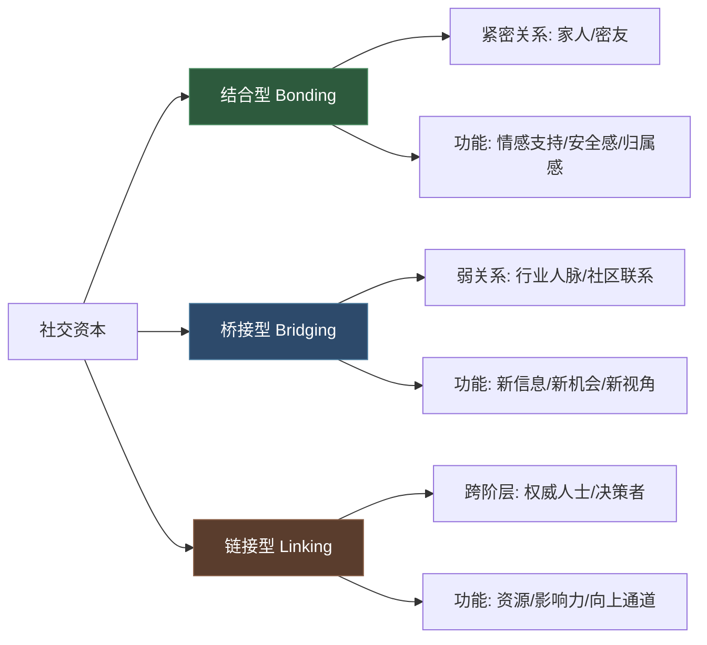
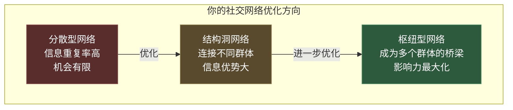
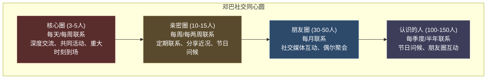

## 四、社交资本积累

社交资本是人际关系中最具复利效应的资产。经济资本花一块少一块，社交资本越用越多——前提是你懂得如何积累和经营。本节从理论到实操，系统讲解如何构建、管理和增值你的社交资本。

### 4.1 理解社交资本

#### 4.1.1 学术定义与理论基础

社交资本（Social Capital）这一概念由法国社会学家**皮埃尔·布尔迪厄**（Pierre Bourdieu）于1980年代正式提出，后经**罗伯特·帕特南**（Robert Putnam）和**詹姆斯·科尔曼**（James Coleman）等人发展，成为社会科学的核心概念之一。

布尔迪厄的定义：**"实际或潜在资源的集合，这些资源与由相互默认或承认的关系所组成的持久网络有关。"** 简单来说，你的社交网络本身就是一种资本，它能为你带来信息、机会、支持和影响力。

美国社会学家**马克·格兰诺维特**（Mark Granovetter）在1973年提出的**"弱关系的力量"**（The Strength of Weak Ties）理论，是理解社交资本最重要的框架之一。他发现：**对你求职、获取新信息最有帮助的，往往不是亲密的强关系，而是那些不太亲密的弱关系**——因为强关系圈子的信息高度重叠，弱关系才能连接到你原本接触不到的信息和资源。

#### 4.1.2 三种社交资本详解

| 类型 | 核心关系 | 提供价值 | 积累难度 | 转化效率 | 典型场景 |
|------|---------|---------|---------|---------|---------|
| **结合型**（Bonding） | 家人、密友、战友 | 情感支持、安全感、归属感、低息借款 | 低（天然存在） | 中（主要用于兜底） | 生病时有人照顾、失业时有人接济 |
| **桥接型**（Bridging） | 行业同行、社区邻居、校友 | 行业内幕消息、工作机会、合作可能 | 中（需主动拓展） | 高（弱关系优势） | 内推求职、行业会议认识合作伙伴 |
| **链接型**（Linking） | 上级领导、政府官员、投资人 | 资源调配、政策信息、融资渠道 | 高（需要实力匹配） | 极高（直达决策层） | 创业融资、政策红利、关键审批 |

**关键认知：** 大多数人只重视结合型社交资本（和朋友吃喝玩乐），忽略桥接型和链接型。但从实际收益看，桥接型和链接型才是改变命运的关键杠杆。一个行业前辈的一句引荐，可能顶得上你投100份简历。

#### 4.1.3 社交资本的经济学本质

社交资本本质上是一种**信任货币**。每一次靠谱的行为都是"存款"，每一次失信都是"取款"。这个"人情账户"有三个特点：

1. **复利效应**：信任积累到一定程度后，机会会主动找上门，不需要你再主动出击
2. **不可透支**：一旦信用破产，修复成本远高于从零建立。一次重大失信可能毁掉十年积累
3. **网络效应**：你的社交资本不仅取决于你认识谁，还取决于你认识的人之间是否互相连接。一个松散的人脉网络价值远低于一个紧密协作的网络

### 4.2 积累社交资本的四大策略

#### 4.2.1 信任积累——社交资本的基石

信任是所有社交关系的底层货币。没有信任，一切社交技巧都是空中楼阁。

**信任的五个维度（参考柯维《信任的速度》）：**

| 维度 | 含义 | 实操要点 |
|------|------|---------|
| **正直** | 言行一致，表里如一 | 不在A面前说B的坏话；公开场合和私下态度一致 |
| **意图** | 动机透明，不藏私心 | 帮忙时说清楚为什么帮，不让人猜你的目的 |
| **能力** | 专业过硬，能解决问题 | 持续提升专业技能，确保别人找你时你能搞定 |
| **成果** | 说到做到，交付结果 | 承诺之前评估可行性，承诺之后全力交付 |
| **方式** | 保持一致性，可预测 | 情绪稳定，不让人猜你今天心情好不好 |

**信任积累的实操清单：**

- **小事守信**：说好8点到就8点到，说好发资料就当天发。小事上的守信比大事上的承诺更有说服力
- **主动汇报进度**：别人委托你做事，即使没做完也要定期同步进展。沉默是信任的最大杀手
- **犯错时立刻承认**：不要找借口，不要甩锅。一句"这是我的问题，我来解决"比一百句解释更有效
- **拒绝做不到的事**：做不到就直说，不要勉强答应然后搞砸。合理的拒绝反而增加信任
- **保护他人隐私**：别人告诉你的话，烂在肚子里。一次泄密就能让你在所有圈子里失去信任

**信任破坏后的修复路径：**

1. 第一时间承认错误，不等对方发现
2. 明确表达歉意，不找客观理由
3. 提出具体的补救方案
4. 用后续持续的靠谱行为重建信任
5. 接受修复需要时间，不催促对方原谅

> ⚠️ **误区**：很多人以为信任是靠"表态"建立的——发誓、保证、拍胸脯。实际上信任只靠**重复的可靠行为**建立。每一次言行一致的小事，都在往信任账户里存钱。

#### 4.2.2 互惠积累——社交资本的流通机制

社交关系的底层逻辑是**互惠**（Reciprocity）。社会心理学家罗伯特·西奥迪尼在《影响力》中指出，互惠是人类最强大的心理驱动力之一——别人帮了你，你会本能地想要回报。

**互惠的三种模式：**

| 模式 | 描述 | 效果 | 风险 |
|------|------|------|------|
| **即时互惠** | 你帮我、我马上帮你 | 建立初步信任 | 容易变成交易关系 |
| **延迟互惠** | 你帮我、我在未来某天回报你 | 建立深度信任 | 需要长期记忆和跟踪 |
| **广义互惠** | 我帮你不求回报、帮更多人 | 建立声誉和影响力 | 短期看是"亏"的 |

**高效互惠的实操方法：**

1. **建立"人情账本"**：不需要真的记账，但心里要有数——谁帮过你、你帮过谁、谁的人情还没还。工具可以用Notion或Excel建一个简单的联系人卡片，标注关键事件
2. **先给予，不求回报**：最有效的社交策略是**主动给予**。看到同事需要的信息，转发给他；看到朋友在找某个资源，帮他留意。不要每次都等着"被需要"
3. **记住别人的小恩小惠**：别人请你喝杯咖啡、帮你带个快递，不要觉得"无所谓"。真诚地说谢谢，并找机会回报。忽视小恩小惠比不回报更伤关系
4. **帮助要具体，不要空头支票**：与其说"有什么需要帮忙的找我"（这种话没人会找你），不如说"我看你最近在做XX，我认识一个这方面的朋友，需要我帮你介绍吗？"

**互惠的高级技巧——"给予者优势"：**

沃顿商学院教授亚当·格兰特在《Give and Take》中研究发现：**最成功的人往往是"给予者"**——他们不计较回报地帮助他人，最终建立了最强大的人脉网络和声誉。但有一个前提：**给予者必须学会设置边界**，否则会变成"被榨干的给予者"。具体原则：

- 帮助有成长潜力的人，而不是永远在原地踏步的人
- 帮助懂得感恩的人，而不是理所当然的人
- 帮助自己擅长的领域，而不是牺牲自己的核心工作时间
- 帮助的方式要可持续，而不是一次性倾尽所有

#### 4.2.3 网络积累——社交资本的结构优化

社交资本不仅取决于你认识谁，还取决于你的**网络结构**。社会学家罗纳德·伯特（Ronald Burt）提出的**"结构洞"**（Structural Holes）理论指出：**连接两个原本不相连的群体的人，拥有最大的信息优势和控制优势**。

**网络积累的实操策略：**

1. **跨圈子社交**：不要只待在一个圈子里。程序员也要认识设计师、产品经理、投资人、媒体人。每个新圈子都是一个新的信息源和机会池
2. **成为连接者**：当你认识A和B，而A恰好能帮到B时，主动介绍他们认识。你做了一件好事，同时巩固了和两个人的关系
3. **定期盘点人脉网络**：每季度花30分钟画一张你当前的社交网络图，标注强关系和弱关系，找出"结构洞"——哪些群体之间你还没有连接
4. **维护"休眠关系"**：那些曾经亲密但渐渐疏远的关系（老同学、前同事），定期激活。一条"好久不见，最近怎么样？"的消息就能重新激活一条关系

**线上社交网络优化：**

- **微信朋友圈**：不是发得越多越好，而是发有质量的内容。让别人觉得关注你有价值
- **LinkedIn/脉脉**：保持职业形象的完整性，定期分享行业洞察
- **社群参与**：加入2-3个高质量的行业社群，定期贡献有价值的发言，而不是潜水或刷屏
- **内容输出**：写文章、做分享、录视频——内容是最好的社交名片，它能24小时帮你建立信任

#### 4.2.4 声誉积累——社交资本的放大器

声誉是社交资本的**乘数效应**。好的声誉让你在不认识你的人面前也有初始信任值，差的声誉让你在熟人面前也寸步难行。

**声誉建设的四个层次：**

| 层次 | 目标 | 方法 | 时间跨度 |
|------|------|------|---------|
| **能力层** | 证明你能做到 | 高质量完成每一个项目 | 1-2年 |
| **专业层** | 证明你是专家 | 输出专业内容（文章/演讲/开源项目） | 2-3年 |
| **影响力层** | 证明你能影响他人 | 培养后辈、推动行业标准、公开发声 | 3-5年 |
| **品牌层** | 提到某个领域就想到你 | 持续深耕、多渠道曝光、标志性成就 | 5年以上 |

**声誉积累的具体行动：**

- **建立"作品集"**：把你的项目成果、客户评价、行业奖项整理成一个可以展示的Portfolio
- **内容输出三板斧**：每周至少发1条专业相关的社交媒体内容；每月至少写1篇深度文章；每季度至少做1次公开分享或参与行业活动
- **口碑管理**：做完一个项目后，主动请客户写推荐语；别人夸你的时候，截图保存
- **"帮助别人成功"策略**：你帮助过的人成功了，你的声誉会跟着水涨船高。培养后辈、推荐机会给他人，是最好的长期声誉投资

> ⚠️ **误区**：很多人把"知名度"等同于"声誉"。知名度是别人知道你，声誉是别人信任你。一个在网上哗众取宠的人知名度很高，但声誉可能很差。真正的声誉来自**持续的高质量输出和靠谱行为**。

### 4.3 社交投资组合管理

#### 4.3.1 邓巴社交同心圆模型

英国人类学家**罗宾·邓巴**（Robin Dunbar）提出，人类大脑的认知极限决定了我们能维持的社交关系数量。根据亲疏远近，社交关系分为四个层次：

**各层次的经营策略：**

| 层次 | 人数 | 维护频率 | 核心动作 | 投入精力占比 |
|------|------|---------|---------|------------|
| **核心圈** | 3-5人 | 每天/每周 | 深度交流、共同活动、重大时刻到场、无条件支持 | 40% |
| **亲密圈** | 10-15人 | 每周/每两周 | 定期联系、分享近况、主动帮忙、节日祝福（不是群发） | 30% |
| **朋友圈** | 30-50人 | 每月 | 社交媒体互动、偶尔聚会、分享有价值信息 | 20% |
| **认识的人** | 100-150人 | 每季度/半年 | 节日问候、朋友圈互动、有合适机会时联系 | 10% |

**关键原则：精力分配要遵循"80/20法则"**——80%的社交精力放在核心圈和亲密圈，因为他们是你真正的安全网和成长引擎。剩余20%用于拓展弱关系，获取新信息和新机会。

#### 4.3.2 高效关系维护的实操技巧

**日常维护工具箱：**

1. **社交提醒系统**：在日历或CRM工具（如Notion联系人数据库）中，为重要关系设定定期联系提醒。核心圈每周提醒一次，亲密圈每两周提醒一次
2. **"共同经历"创造器**：不要只聊天，一起做事。约饭、一起运动、合作项目、一起旅行——共同经历比100次寒暄更能加深关系
3. **关键时刻到场**：对方生日、结婚、生子、升职、生病、丧亲——这些时刻你的一条消息、一通电话、一次到场，价值远超平时的100次互动
4. **有价值信息推送**：看到对方可能感兴趣的行业报告、招聘信息、活动预告，主动发给他，并附上一句"看到这个想到你，觉得对你有用"
5. **"欣赏表达"习惯**：定期告诉身边的人你欣赏他们什么。具体、真诚、及时——"你上次那个方案的思路太清晰了"比"你真厉害"有效100倍

**维护频率参考表：**

| 事件类型 | 核心圈 | 亲密圈 | 朋友圈 | 认识的人 |
|---------|--------|--------|--------|---------|
| 生日 | 当天电话+礼物 | 当天私信祝福 | 朋友圈评论 | 点赞 |
| 升职/创业 | 电话祝贺+约饭 | 私信祝贺+了解情况 | 点赞+评论 | 点赞 |
| 生病/困难 | 立即行动（探望/帮忙） | 电话关心+提供具体帮助 | 发消息关心 | — |
| 行业信息 | 第一时间分享 | 顺手分享 | 社交媒体转发 | — |
| 日常近况 | 随时聊 | 定期更新 | 朋友圈可见 | — |

#### 4.3.3 社交资本的"止损"与"止损线"

不是所有关系都值得维护。以下情况需要果断降低投入甚至止损：

- **持续消耗型关系**：对方只索取不回报，每次互动后你都感到疲惫
- **价值观严重冲突**：在核心价值观上（诚信、尊重、责任）存在根本分歧
- **有毒关系**：对方持续贬低你、操纵你、利用你
- **单方面维护**：你主动联系10次，对方0次回应

**止损的实操方式：**
1. 不需要"绝交宣言"，默默减少联系频率即可
2. 将精力重新分配给更值得的关系
3. 保持基本礼貌，不做撕破脸的事——社交圈很小，没必要树敌

### 4.4 社交资本的量化与追踪

#### 4.4.1 社交资本自评框架

每季度花15分钟做一次社交资本盘点：

| 评估维度 | 1分（差） | 3分（中） | 5分（优） |
|---------|---------|---------|---------|
| **信任度** | 别人不太放心把事交给你 | 部分人信任你 | 多数人认为你靠谱 |
| **互惠平衡** | 只取不存或只存不取 | 基本平衡 | 主动给予，自然回报 |
| **网络多样性** | 圈子单一，信息同质 | 有2-3个不同圈子 | 跨行业、跨阶层的多元网络 |
| **声誉影响力** | 没有专业声誉 | 在小圈子内有口碑 | 在行业内有知名度和信任度 |
| **关键节点关系** | 没有"能说上话"的关键人 | 认识但不深 | 有几位信任你的关键决策者 |

#### 4.4.2 社交资本增长追踪表

建议用Notion或Excel建一个简单的追踪表，每月更新：

| 日期 | 事件 | 类型 | 对象 | 影响 | 备注 |
|------|------|------|------|------|------|
| 2024-03 | 帮同事内推成功 | 互惠+声誉 | 张三 | 张三+1, 我的口碑+1 | 后续他帮我介绍了客户 |
| 2024-03 | 行业大会分享 | 声誉+网络 | 200+听众 | 新增30个弱关系 | 其中3人后续有合作 |
| 2024-04 | 忘了朋友生日 | 信任-1 | 李四 | 关系降温 | 需要补救 |

### 4.5 不同场景的社交资本积累策略

#### 4.5.1 职场社交资本

- **向上管理**：定期向上级汇报进展，让领导了解你的能力和态度。不要等年终总结才展示成果
- **横向联盟**：和跨部门的同事建立良好关系。项目协作时他们更愿意配合你
- **向下培养**：帮助新人成长。你培养的人未来可能是你的盟友、推荐人甚至贵人
- **行业社交**：参加行业会议、加入专业社群、参与开源项目。每次活动至少深度交流3个人

#### 4.5.2 创业者社交资本

- **投资人关系**：不融资的时候也要定期更新进展。投资人投的是人，持续建立信任
- **客户关系**：把客户变成推荐人。一个满意的客户带来的新客户，获客成本为零
- **同行关系**：竞争对手也可以是盟友。行业信息共享、联合发声、互相推荐不适合的客户
- **媒体关系**：和行业记者、博主保持良好关系。好的报道是免费的品牌广告

#### 4.5.3 线上社交资本

- **个人品牌一致性**：各平台的形象、头像、简介保持一致，让人一眼认出你
- **内容输出节奏**：固定频率输出高质量内容，比偶尔爆发然后长期沉默更有效
- **评论互动**：在别人的内容下留下有价值的评论，是最低成本的社交资本积累方式
- **社群贡献**：在社群中主动回答问题、分享资源、组织活动，建立"社群核心成员"的身份

### 4.6 常见误区与纠正

| 误区 | 纠正 |
|------|------|
| "认识的人越多越好" | 质量远比数量重要。100个泛泛之交不如10个信任你的深度关系 |
| "社交就是请客吃饭" | 请客只是手段，不是目的。真正的社交资本来自价值交换和信任积累 |
| "我性格内向不适合社交" | 内向者的深度社交能力反而更强。一对一深度交流比社交场上的表面寒暄更有效 |
| "社交就是功利的" | 健康的社交是双赢的。你帮别人的同时也在建立信任和声誉，这不是功利，是互惠 |
| "有了微信就维护了关系" | 微信只是一个通讯工具。真正的关系维护需要深度互动、关键时刻到场、持续的价值输出 |
| "等我成功了再去社交" | 社交资本需要时间积累。越早开始，复利效应越大。而且你在低谷时建立的关系往往最真诚 |
| "讨好所有人" | 你不可能也不需要让所有人喜欢你。聚焦在真正重要的人身上，其他人的看法不必太在意 |

### 4.7 进阶：社交资本的杠杆效应

当你积累了足够的社交资本，它会产生**杠杆效应**——用较小的努力撬动较大的资源：

1. **信息杠杆**：你的网络能帮你快速获取别人需要花数周才能找到的信息。一个电话就能了解行业真实情况
2. **机会杠杆**：好的机会从来不会公开招聘，而是在人脉网络中流转。你的网络越强，接触到的机会越多
3. **信誉杠杆**：你的好声誉能帮你在未见面的情况下获得初始信任。"某某推荐的"这句话本身就有分量
4. **资源杠杆**：需要融资、找团队、找渠道时，你的网络就是最大的资源库

**最终目标**：从"我需要找人帮忙"变成"机会和资源主动来找我"。这需要5-10年的持续积累，但从现在开始每一天都是在为未来的自己投资。
