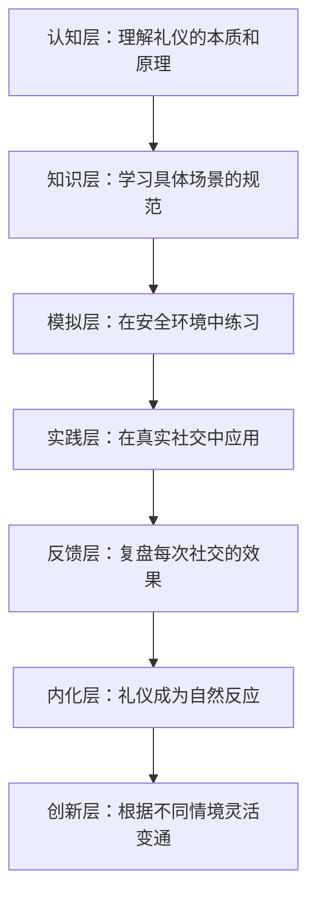

## 五、社交礼仪

社交礼仪不是一套刻板的规矩，而是**降低社交摩擦成本的共识协议**。当你遵守礼仪，对方不需要额外的认知负荷来处理你的行为，注意力可以完全放在交流内容上——这就是礼仪的本质价值。

### 5.1 礼仪的心理学基础

#### 5.1.1 为什么礼仪有效

人类大脑在社交场景中会进行快速的"可信度评估"，这个过程在 100 毫秒内完成。礼仪行为直接影响这个评估结果：

- **一致性信号**：符合预期的行为让对方感到安全，降低防御心理
- **尊重信号**：为对方付出注意力成本（如记住名字、准时到场），传递"你对我很重要"
- **能力信号**：得体的行为暗示你有丰富的社交经验和自我管理能力

心理学中的**首因效应**（Primacy Effect）表明，初次见面的前 30 秒形成的印象会影响后续所有互动的解读框架。一个得体的握手和自我介绍，能让后续的对话在正面框架下展开。

#### 5.1.2 礼仪的三层结构

| 层次 | 内容 | 重要程度 | 学习难度 |
|------|------|----------|----------|
| 表层礼仪 | 握手、称呼、座次等具体行为规范 | 基础 | 低，记忆即可 |
| 中层礼仪 | 共情、倾听、分寸感等社交直觉 | 核心 | 中，需要练习 |
| 深层礼仪 | 真诚、尊重、换位思考的价值观 | 根本 | 高，需要内化 |

大多数人只停留在表层礼仪——背了一堆规则但用起来僵硬。真正的高手是内化了深层价值观后，行为自然得体。

### 5.2 见面礼仪

#### 5.2.1 握手

握手是最常见的初次见面礼节，执行细节直接影响对方对你的第一判断。

**标准握手流程：**

1. **时机**：目光接触后微笑，等对方有伸手意图时配合；对长辈或上级，等对方先伸手
2. **姿势**：站直，伸出右手，手掌垂直于地面（避免掌心向上=示弱，掌心向下=压制）
3. **握法**：虎口对虎口，全掌接触，不要只握手指尖
4. **力度**：中等力度——想象握住一个苹果不掉但不捏碎的程度
5. **时间**：2-3 秒，上下摇动 1-2 次后自然松开
6. **眼神**：全程注视对方眼睛，配合微笑

**常见错误及纠正：**

| 错误行为 | 给人的印象 | 正确做法 |
|----------|------------|----------|
| 死鱼式握手（无力） | 缺乏自信、敷衍 | 全掌有力但不捏紧 |
| 老虎钳式握手（过猛） | 攻击性、控制欲 | 力度适中，不加压力 |
| 双手包握（双手握住对方） | 过度热情、越界 | 仅在非常熟悉时使用 |
| 湿手握手 | 紧张、不注意卫生 | 提前擦干手汗 |
| 握手时看别处 | 不尊重、心不在焉 | 全程目光接触 |

**场景变体：**

- **多人握手**：按职位高低或年龄长幼顺序依次握手，不要跳过任何人
- **国际场合**：部分文化（如日本、韩国）更习惯鞠躬，注意观察对方的身体语言
- **疫情后的变化**：可以先观察对方是否伸手，如果对方点头致意，不必强行握手

#### 5.2.2 名片交换

名片在商务社交中仍然重要——它不仅是联系方式，更是一个社交仪式。

**递名片的规范：**

- 用双手拇指和食指持名片两角，文字正面朝向对方
- 同时说一句简短的介绍："我是XXX公司的XXX，负责XXX"
- 如果有多人在场，按照职位高低顺序依次递送

**接名片的规范：**

- 双手接过，认真看 3-5 秒——这不是形式，是在向对方传递尊重信号
- 可以自然地复述名片上的信息以确认："哦，您是XX公司的X总"
- 在后续对话中可以放在桌上便于随时参考，**绝不要当面在名片上写字**（在日本文化中这是严重失礼）
- 结束后收入名片夹或上衣口袋，**不要塞进裤兜后坐上去**

#### 5.2.3 自我介绍

自我介绍是社交的第一步，但大多数人要么说太少（只说名字），要么说太多（把简历背一遍）。

**30 秒自我介绍框架：**

1. **姓名 + 一句话锚定**（5秒）："我叫张明，做 AI 产品方向的"
2. **当前状态/角色**（10秒）："目前在XX公司负责智能客服产品线"
3. **价值钩子**（10秒）："我们刚做了一个项目，把客服效率提升了 40%"
4. **社交连接点**（5秒）："听说您在NLP领域很有经验，很想请教"

**关键原则：**

- 锚定用对方能理解的标签，不要用行业黑话
- 价值钩子要具体（有数据、有成果），不要说"我做了很多事情"
- 结尾要给对方一个回应的接口，不要以自己为中心结束

### 5.3 称呼与称谓

称呼看似简单，但用错称呼的代价极高——它直接暴露你对社交关系的理解程度。

#### 5.3.1 中国社交中的称呼体系

| 场景 | 正确称呼 | 错误称呼 | 原因 |
|------|----------|----------|------|
| 职场初次见面 | X总、X工、X老师 | 直呼其名、小X | 不确定对方职级时用"姓+总"最安全 |
| 正式商务场合 | X董事长、X总经理 | X哥/X姐 | 正式场合必须用职务称谓 |
| 朋友聚会 | 哥/姐、昵称 | 全名 | 聚会氛围轻松，太正式反而尴尬 |
| 年长者 | X老师、X伯伯/阿姨 | 老X | "老"字在中国文化中有贬义风险 |
| 不确定时 | "您" + 请教 | 喂/那个谁 | 用敬语永远不犯错 |

**高级技巧：**

- **称呼升级**：初次见面用较正式的称呼，随着关系深入逐渐调整，如"张总"→"张哥"→"老张"
- **称呼同步**：听对方怎么称呼你，适当对等调整
- **称呼记忆**：记住对方名字是最基本的尊重，可以用关联记忆法（把这个名字和一个画面联系起来）

#### 5.3.2 国际社交中的称呼

| 国家/地区 | 习惯 | 注意事项 |
|-----------|------|----------|
| 英语国家 | 首次用 Mr./Ms. + 姓，对方说"Call me XX"后改口 | 不确定时用正式称呼 |
| 日本 | 姓 + さん（san），正式场合用 姓 + 职位 | 绝不要直呼其名（除非对方主动要求） |
| 韩国 | 姓 + 职位/님（nim） | 年龄差距大时需要更敬语 |
| 德国 | 姓 + Herr/Frau + 学位（如有） | 德国人非常重视头衔 |
| 法国 | Monsieur/Madame + 姓 | 用tu（你）需要对方同意 |

### 5.4 餐桌礼仪

餐桌是社交的核心场景。一顿饭的时间足以建立或破坏一段关系。

#### 5.4.1 中餐宴请礼仪

**座次安排（非常重要）：**

                    主陪（面对门）
                         
    副主陪                              主宾右侧
    
    三宾                                主宾
    
    四宾           [门口]               副主宾
    
    五宾                                三宾
    
    六宾          服务员通道             四宾
                         
                    主陪右侧 = 主宾

简化规则：**面门为主陪，主陪右手为主宾，左手为副主宾**。

**点菜礼仪：**

- 先问有无忌口、过敏，再开始点菜
- 荤素比例约 6:4，菜品数量 = 人数 + 2（冷菜 + 热菜 + 汤 + 主食）
- 不点太贵的菜让主人尴尬，也不点太便宜的让主人觉得招待不周
- 如果是请客方，把菜单递给最重要的客人先点，或问对方口味后自己搭配

**席间礼仪：**

- 等主人或长辈举杯/动筷后才开始
- 转盘夹菜时，顺时针转，不要从别人面前伸筷子
- 嘴里有食物时不说话，筷子不要插在饭里（像祭祀的香）
- 敬酒时杯沿低于长辈/上级的杯沿
- 不要强行劝酒——这是低段位社交的典型表现
- 关注同桌的人，特别是安静的人，主动把话题带到他们擅长的领域

**买单礼仪：**

- 提前和服务员打好招呼去结账，不要当着客人面争抢（虽然中国人喜欢抢买单，但提前安排更优雅）
- 如果是 AA 制，提前说清楚，不要到最后尴尬
- 被请客后，当天发一条感谢信息

#### 5.4.2 西餐礼仪

**基础规则：**

- 餐巾对折放在膝盖上，不要塞进衣领
- 刀叉从外向内使用，左手叉右手刀（欧），或切完换右手叉（美）
- 面包用手撕，不要用刀切
- 喝汤时勺子从内向外舀，不要发出声音
- 用完的餐刀和叉子交叉放在盘子上（表示还在吃），平行放表示已吃完

**酒水礼仪：**

- 红酒握杯脚（避免体温影响酒温），白酒/香槟可握杯身
- 品酒时先观色、再闻香、后品尝，不要一口闷
- 不想喝酒时可以说"今天开车"或"在吃药"，不要硬撑

### 5.5 数字时代的社交礼仪

现代人每天花 3-5 小时在数字通讯上，但很少有人系统思考过数字社交的礼仪。

#### 5.5.1 微信礼仪

**加好友：**

- 发送个性化验证消息，说明你是谁、在哪里认识的、加好友目的
- 绝不发空白验证消息——这等于敲门不说话
- 示例："XX你好，我是昨天行业峰会上做AI产品的张明，交流一下NLP方向的合作"

**聊天规则：**

| 场景 | 正确做法 | 错误做法 |
|------|----------|----------|
| 发消息 | 先问"现在方便吗"，尤其对不熟的人 | 直接甩一段长文或语音 |
| 语音消息 | 确认对方可以听语音再发，单条不超过60秒 | 连发10条60秒语音 |
| 工作消息 | 工作时间内发送，文字为主 | 深夜12点发工作消息 |
| 回复速度 | 尽量当天回复，忙的话告知稍后回复 | 已读不回（除非是不想继续对话） |
| 群聊 | 不发无关链接、不刷屏、不@所有人 | 在群里展开两人对话 |
| 朋友圈 | 适度分享，不刷屏 | 一天发10条微商广告 |
| 祝福 | 个性化问候，提到具体回忆 | 群发"新年快乐"模板 |

**进阶微信社交：**

- **备注标签**：加好友后立刻备注姓名、公司、认识场景、日期。这是你的人脉数据库
- **朋友圈互动**：偶尔给重要联系人的朋友圈点赞评论，保持存在感但不要过度
- **引荐他人**：帮两个人互相介绍时，先分别征求双方同意，然后拉一个小群，发双方的简介
- **拒绝的艺术**：不想参加的活动说"这次时间冲突了，下次一定"比不回复好

#### 5.5.2 电子邮件礼仪

**主题行：** 用一句话概括邮件目的，方便对方在 100 封邮件中快速找到你的。

- ✅ "关于XX项目第二期合作方案的确认（截止12月15日）"
- ❌ "你好""在吗""请查收"

**正文结构：**

称呼

第一段：一句话说明目的（写这封邮件的原因）
第二段：具体信息（背景、数据、问题）
第三段：明确的行动项（需要对方做什么，截止时间）

落款

**关键规则：**

- 一封邮件只说一件事
- 抄送（CC）放需要知悉的人，密送（BCC）用于保护隐私
- 回复全部前想清楚是否所有人都需要看到你的回复
- 附件在正文里要提及，不要让人猜
- 收到邮件 24 小时内回复，即使只是"收到，我看看"

#### 5.5.3 视频会议礼仪

视频会议已成为常态，但很多人的表现像没受过训练：

**会前准备：**

- 提前 3-5 分钟上线测试摄像头、麦克风、网络
- 背景整洁——虚化背景或整理真实的书架/墙面
- 光线从前方打来，不要背光（变成黑影）
- 穿着至少上半身得体（下半身也要穿，万一需要站起来）

**会中表现：**

- 不说话时静音（减少背景噪音）
- 发言时看摄像头而不是看自己的脸——这模拟了眼神接触
- 不要同时做其他事情（刷手机、打字），摄像头会暴露一切
- 使用"举手"功能或等别人说完再插话
- 如果网络不好，优先关闭自己的摄像头保留音频

**会后跟进：**

- 如果有行动项，会后 2 小时内发确认邮件
- 纪要要明确：谁做什么、什么时候完成

### 5.6 商务社交礼仪

#### 5.6.1 商务宴请

**邀请的层级对应：**

| 你的角色 | 邀请方式 | 场地选择 |
|----------|----------|----------|
| 下级请上级 | 正式邀请函或电话，提前一周 | 对方方便的地点附近 |
| 平级之间 | 微信/电话，提前 3-5 天 | 中等档次，交通方便 |
| 上级请下级 | 微信即可，提前 2-3 天 | 可以随意一些 |
| 客户关系 | 正式邀请，提前一周 | 高档且安静的场所 |

**敬酒的艺术：**

- 第一轮敬主人/最重要的客人
- 敬酒时站起来，简短说一句感谢或赞美的话
- 不要强灌——如果对方说不喝，尊重且不要反复劝
- 自己的酒量要清楚，醉酒是最糟糕的社交事故

#### 5.6.2 商务送礼

**送礼原则：**

- **轻重得当**：初次见面送太重的东西让对方有压力，太轻则不如不送
- **实用贴心**：了解对方需求后送出的礼物，比贵重但无用的礼物好 10 倍
- **避免禁忌**：不送钟（终）、不送伞（散）、不送梨（离）、不送白色花（丧事）
- **时机选择**：拜访时、节日时、对方帮了忙之后

**不同关系的送礼参考：**

| 关系 | 礼物类型 | 预算参考 | 注意事项 |
|------|----------|----------|----------|
| 初次商务拜访 | 当地特产、茶叶 | 200-500 元 | 包装要好，附一张手写卡片 |
| 维护关系 | 对方提过想要的东西 | 500-2000 元 | 体现你记住了他的需求 |
| 感谢帮忙 | 对方兴趣相关的物品 | 根据帮忙大小 | 不要送现金或购物卡（太直白） |
| 节日问候 | 应季礼品、水果、酒 | 300-1000 元 | 群发的礼品不如不发 |

### 5.7 不同文化的社交礼仪

全球化时代，跨文化社交能力是核心竞争力。

#### 5.7.1 文化维度框架

理解文化差异的理论工具——霍夫斯泰德文化维度：

| 维度 | 含义 | 高分文化代表 | 低分文化代表 |
|------|------|-------------|-------------|
| 权力距离 | 对权力不平等的接受度 | 中国、日本、印度 | 北欧、美国 |
| 个人主义 vs 集体主义 | 个人利益 vs 群体利益 | 美国、英国（个人） | 中国、日本（集体） |
| 不确定性规避 | 对模糊情境的容忍度 | 日本、德国（高规避） | 新加坡、丹麦（低规避） |
| 长期导向 | 重视长期关系和规划 | 中国、日本 | 美国、尼日利亚 |

#### 5.7.2 主要文化圈的社交要点

**日本：**

- 鞠躬是核心礼节——角度代表敬意程度（15°日常、30°正式、45°最高敬意）
- 交换名片极其正式，双手递接，认真阅读后放在桌上
- 送礼用双手，不当面拆开
- 不要在公共场合大声说话
- 拒绝说"ちょっと..."（有点...）就是委婉的"不"

**欧美：**

- 个人空间约一臂距离，不要靠太近
- 直呼其名是友好的表现（对方要求后）
- 准时非常重要（迟到 5 分钟以上需要道歉）
- 小费文化：美国 15-20%，欧洲 5-10%
- 目光接触 = 诚实可信

**中东：**

- 同性之间可以有肢体接触（握手、拥抱），异性之间要等对方主动
- 左手被认为是不洁的，用右手递东西
- 咖啡是好客的象征，拒绝可能被视为失礼
- 斋月期间不要在穆斯林面前公开饮食

**印度：**

- 合十礼（Namaste）是安全的问候方式
- 头部是神圣的，不要摸小孩的头
- 用右手吃饭和递东西
- 种姓制度虽然法律上废除，但社交中仍有影响

#### 5.7.3 跨文化社交的黄金法则

1. **先观察再行动**：不确定时，观察当地人的做法
2. **尊重但不模仿**：不熟悉的文化不要强行模仿，真诚的尊重比拙劣的模仿好
3. **犯错就道歉**：文化误解不可避免，真诚道歉比尴尬回避好
4. **提前做功课**：去一个新文化环境前花 30 分钟了解基本禁忌

### 5.8 特殊场景的社交礼仪

#### 5.8.1 婚丧嫁娶

**参加婚礼：**

- 礼金随大流，提前问一下其他人的标准
- 穿着正式但不要抢新娘风头（女性不要穿白色）
- 到场后先签到、交礼金，再入座
- 敬酒时说祝福的话，不要喝醉

**参加葬礼：**

- 穿深色素色衣服，不要穿红色或鲜艳颜色
- 表达慰问时简短真诚："节哀顺变，有什么需要帮忙的随时说"
- 不要说"我理解你的感受"——你可能不理解
- 跟着主家的流程走，不要做多余的事

#### 5.8.2 探病

- 提前了解探视时间和规定
- 带鲜花（避免白色菊花）或水果，不要带气味重的食物
- 控制时间在 15-30 分钟，不要让病人太累
- 聊轻松的话题，不要反复问病情细节
- 不要说"你看起来好多了"（如果并没有的话）

#### 5.8.3 求人办事

求人办事是中国人社交中最敏感的场景之一：

1. **铺垫**：不要上来就提要求，先通过几次互动建立连接
2. **时机**：在对方心情好、不忙的时候提出
3. **表达**：先说明事情的背景，再说明困难，最后请求帮助——给对方拒绝的空间
4. **回报**：主动提出能为对方做什么，不要只索取
5. **感谢**：无论结果如何都要表示感谢

### 5.9 社交礼仪中的常见误区

| 误区 | 为什么是错的 | 正确做法 |
|------|-------------|----------|
| "礼仪就是虚伪" | 礼仪是降低摩擦的工具，和真诚不矛盾 | 真诚是底层，礼仪是表达方式 |
| "熟人不需要礼仪" | 越熟越需要边界感 | 亲密关系中的礼仪是尊重的体现 |
| "越热情越好" | 过度热情让人有压力 | 保持适度，让对方舒服 |
| "我就是直来直去" | "直"和"粗鲁"是两回事 | 直率+尊重 ≠ 说话不过脑子 |
| "西方礼仪更先进" | 每种文化有自己的礼仪系统 | 入乡随俗，没有高下之分 |
| "记住所有规矩就行" | 表层礼仪只是起点 | 内化尊重和共情才是根本 |

### 5.10 礼仪能力的系统提升路径

**具体练习方法：**

1. **每周一练**：选一个具体场景（如握手、自我介绍），刻意练习一周
2. **社交复盘**：每次重要社交后花 5 分钟回顾——哪些做得好，哪些可以改进
3. **观察高手**：注意你身边社交能力强的人是怎么做的，拆解他们的行为
4. **阅读扩展**：推荐阅读《礼记》（传统礼仪的源头）、《人性的弱点》（现代社交心理学）、《The Etiquette Advantage in Business》（商务礼仪）
5. **角色扮演**：和朋友模拟高难度社交场景（如拒绝不合理要求、和难相处的人谈判）

**最终目标不是成为一个"会来事"的人，而是一个让人舒服的人。** 礼仪的最高境界是——你的存在让周围的人都感到被尊重和被重视，而他们甚至说不出你具体做了什么。这就是"道"的层面——超越了具体技巧，成为人格的一部分。
