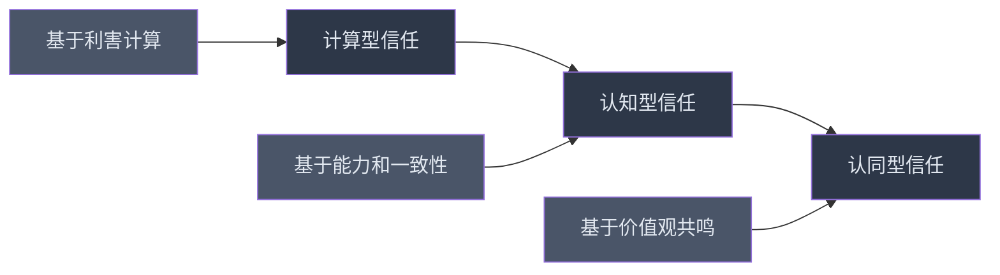

## 六、建立信任

信任是一切深层人际关系的地基。没有信任，沟通技巧只是表演，社交礼仪只是形式，社交资本也无法真正积累。信任决定了你与他人的关系能走多深、能持续多久。本章从信任的心理学机制出发，系统讲解如何建立、维护和修复信任。

### 6.1 信任的本质与心理机制

#### 6.1.1 什么是信任

心理学将信任定义为"在不确定性和风险条件下，对他人意图和行为的积极预期"。这意味着信任包含三个核心要素：

- **不确定性**：你无法完全控制他人的行为，信任发生在"无法验证"的情境中
- **脆弱性**：信任意味着你愿意暴露自己的弱点，承担被伤害的风险
- **积极预期**：你相信对方不会利用你的脆弱性来伤害你

信任不是一种感觉，而是一种基于证据的判断。它需要时间积累，可以被行为强化，也可以被背叛摧毁。

#### 6.1.2 信任方程式

哈佛商学院教授 David Maister 提出的信任方程式被广泛引用：

信任 = （可信度 + 可靠性 + 亲近感）/ 自我导向

| 维度 | 含义 | 权重 | 影响方式 |
|------|------|------|----------|
| **可信度（Credibility）** | 你说的话是否专业、准确、有根据 | 高 | 通过专业能力、知识深度、诚实表达建立 |
| **可靠性（Reliability）** | 你是否言行一致、说到做到 | 高 | 通过持续兑现承诺、行为可预测建立 |
| **亲近感（Intimacy）** | 你是否让人感到温暖、安全、可以亲近 | 中 | 通过共情、自我表露、情感连接建立 |
| **自我导向（Self-orientation）** | 你是否只关心自己的利益 | 分母 | 越低越好，过高的自我导向会大幅降低信任 |

这个方程式揭示了一个关键洞察：即使你在可信度、可靠性和亲近感上得分很高，如果自我导向过高——对方感觉你只关心自己——信任仍然会很低。分母的作用意味着，一个人明显的自私行为对信任的破坏力，远大于三件善事对信任的建设力。

#### 6.1.3 信任发展的阶段性模型

信任不是一蹴而就的，而是经历多个阶段逐步深化：

**计算型信任（Calculus-based Trust）**：关系初期，人们通过利害计算决定是否信任。"与这个人合作对我有什么好处？风险是什么？"此时的信任建立在惩罚威慑之上——对方如果欺骗你，会付出代价。职场关系大多从这个阶段开始。

**认知型信任（Knowledge-based Trust）**：随着互动增多，你积累了关于对方行为模式的知识，能够预测对方的行为。"我了解这个人，他说到做到。"此时信任基于对对方的了解程度，不再完全依赖利害计算。同事和长期合作伙伴通常处于这个阶段。

**认同型信任（Identification-based Trust）**：最高层次的信任，双方理解并认同彼此的价值观、需求和目标。"我们的想法高度一致，我完全放心把事情交给他。"此时双方甚至不需要明确沟通就能默契配合。亲密伴侣和核心团队成员之间才能达到这个阶段。

#### 6.1.4 信任的神经科学基础

神经经济学研究发现，当人们感受到信任时，大脑会释放**催产素（Oxytocin）**——一种与社会连接和亲密感相关的神经递质。Paul Zak 的实验表明：

- 当受试者收到他人的信任信号时，血液中的催产素水平显著升高
- 催产素水平越高，受试者表现出的信任行为越多
- 这个过程是双向的：被信任也会触发催产素释放，形成正向循环

这意味着信任不仅是心理层面的判断，还有生理基础。温暖的握手、真诚的眼神接触、适度的身体靠近，都能触发催产素释放，为信任建立创造生理条件。

### 6.2 建立信任的四大支柱

#### 6.2.1 支柱一：可信度（Credibility）

可信度是信任的理性基础。它回答的问题是："这个人说的话我能信吗？"

**建立可信度的具体方法：**

**（1）展示专业能力**
- 在你的领域保持持续学习，确保知识是最新的
- 分享见解时提供具体数据、案例或引用来源
- 坦诚自己知识的边界——说"我不确定，但我可以查一下"比胡编乱造更有说服力
- 在擅长的领域主动提供帮助，用行动证明能力

**（2）保持诚实透明**
- 即使真相对自己不利，也选择诚实——短期的不舒服换来长期的信任
- 区分"善意的沉默"和"故意的欺骗"——不是所有事情都需要说，但说出来的必须是真的
- 避免夸大其词——承诺100分只做到80分，不如承诺70分做到80分
- 主动披露可能影响对方判断的信息

**（3）使用一致的语言**
- 说话风格和态度在不同场合保持一致——不要在领导面前一套，在同事面前另一套
- 避免前后矛盾——如果你今天说A，明天说B，对方会质疑你到底信什么
- 用具体数字和事实代替模糊表达——"大概下周"不如"周三之前"

**可信度杀手：**
- 被发现撒过一次谎，之前所有诚实的记录都会被重新审视
- 在不了解的领域表现得过于自信
- 对不同的人说不同的话
- 承诺太多、做到太少

#### 6.2.2 支柱二：可靠性（Reliability）

可靠性是信任的行为基础。它回答的问题是："这个人说到能做到吗？"

**建立可靠性的具体方法：**

**（1）承诺管理**
- **谨慎承诺**：在做出承诺前评估自己的能力和资源，不要因为一时冲动或讨好心理而答应
- **明确承诺**：把模糊的"我帮你看看"变成具体的"周三下午前给你反馈"——明确的时间、内容和标准
- **超额交付**：承诺适度保守，交付尽量超越预期
- **无法兑现时及早沟通**：如果你意识到可能无法按时完成，立即通知对方并给出新的时间表，而不是等到最后一刻才说

**（2）行为一致性**
- 形成稳定的日常习惯——准时赴约、按时回复、定期汇报
- 在压力下保持行为一致——不是只有顺利时才可靠，困难时期的表现更能建立信任
- 对不同人保持一致的标准——不要对重要的人上心，对"不重要"的人敷衍

**（3）可预测性**
- 让对方能预测你的行为——他们知道你在什么情况下会做什么
- 情绪反应可预期——不要今天心情好就宽容，明天心情差就暴怒
- 价值观稳定——核心原则不随环境变化而摇摆

**可靠性的量化指标：**

| 指标 | 优秀 | 良好 | 需改进 |
|------|------|------|--------|
| 承诺兑现率 | >90% | 70-90% | <70% |
| 按时交付率 | >95% | 80-95% | <80% |
| 回复及时性 | 当天 | 24-48h | >48h |
| 主动汇报频率 | 事前+关键节点 | 仅被问时 | 从不 |

#### 6.2.3 支柱三：亲近感（Intimacy）

亲近感是信任的情感基础。它回答的问题是："这个人让我感到安全吗？"

**建立亲近感的具体方法：**

**（1）适度的自我表露**
自我表露是信任建立中最强大的工具之一。心理学家 Altman 和 Taylor 的**社会渗透理论**指出，关系的深化就是自我表露从浅层（爱好、工作）到中层（观点、态度）再到深层（恐惧、创伤）的过程。

自我表露的梯度：
- **第一层：事实层**——"我是做设计的""我喜欢跑步"——风险最低，适合初期
- **第二层：观点层**——"我觉得加班文化不健康""我认为这个方案有问题"——有一定风险，展示立场
- **第三层：感受层**——"这件事让我很焦虑""我害怕被拒绝"——风险较高，但能快速拉近距离
- **第四层：脆弱层**——"我曾经失败过""我有这个缺点"——风险最高，但建立的信任也最深

关键原则：**渐进式暴露，对等式交换**。不要一开始就暴露最深层的自己（会吓到对方），也不要只停留在最浅层（关系无法深化）。观察对方的暴露深度，匹配略高于对方的暴露层级。

**（2）积极倾听与共情**
- 听对方说话时放下手机，保持眼神接触
- 用复述和确认来表达你在认真听："你是说……对吗？"
- 不急于给建议，先理解对方的感受："听起来这件事让你很沮丧"
- 记住对方分享过的细节，在后续互动中提及——这表明你真的在意

**（3）创造安全的对话空间**
- 对方分享秘密时，明确表示感谢和保密："谢谢你信任我，我不会告诉别人"
- 不在别人面前嘲笑另一个人分享给你的事
- 对对方的脆弱表达接纳而非评判
- 在对方犯错时表现出理解，而不是第一时间指责

#### 6.2.4 支柱四：降低自我导向

自我导向是信任方程式的分母，也是最容易被忽视的维度。它回答的问题是："这个人真的关心我，还是只关心他自己？"

**降低自我导向的具体方法：**

**（1）真诚关注对方的需求**
- 主动询问对方的近况和困难，而不是只在需要帮忙时才联系
- 帮助对方时不附带条件，也不期待对等回报
- 在对话中，把话题从自己转向对方："你呢？你最近怎么样？"

**（2）利益共享**
- 在合作中主动考虑对方的利益，而不是只最大化自己的收益
- 在汇报成绩时感谢他人的贡献
- 分享资源、机会和信息，不囤积独占

**（3）识别高自我导向的信号并纠正**
常见信号包括：
- 对话总是绕回自己身上
- 帮忙后反复提起"我帮过你"
- 只在需要对方时才联系
- 评价事情只从自己的角度出发
- 对方的成就你感到威胁而非高兴

### 6.3 日常生活中建立信任的具体行为

#### 6.3.1 微信任积累法

信任不仅在大事上建立，更在日常小事中积累。我把这个叫做**微信任（Micro-trust）**——那些看似微不足道但持续发生的可信行为。

**高频微信任行为清单：**

| 场景 | 微信任行为 | 信任效果 |
|------|-----------|----------|
| 约定 | 准时到达（最好提前2-3分钟） | 可靠性 |
| 消息 | 在合理时间内回复，至少确认收到 | 可靠性+亲近感 |
| 承诺 | 说到做到，哪怕是"我明天发你那个链接" | 可靠性 |
| 记忆 | 记住对方提过的偏好、习惯、重要日期 | 亲近感 |
| 对话 | 对方说话时不打断，认真听完 | 亲近感+可信度 |
| 背后 | 在别人面前说对方的好话（真诚的） | 可信度+亲近感 |
| 困难 | 主动提供力所能及的帮助 | 亲近感+低自我导向 |
| 错误 | 自己犯错第一时间承认并道歉 | 可信度 |
| 分享 | 分享有用的信息给对方 | 低自我导向 |
| 界限 | 尊重对方说"不"的权利 | 亲近感 |

#### 6.3.2 信任建立的"存款-取款"模型

心理学家 John Gottman 将信任比作银行账户：每次正面互动是存款，每次负面互动是取款。当账户余额充足时，偶尔的取款不会致命；当余额透支时，一次取款就可能导致关系破产。

**高存款行为（每次+1到+5）：**
- 主动帮忙（+3）
- 真诚赞美（+2）
- 在困难时支持对方（+5）
- 记住重要细节（+2）
- 信守承诺（+3）
- 分享有价值的资源（+2）

**高取款行为（每次-1到-10）：**
- 背后说坏话（-5）
- 失约不通知（-3）
- 泄露秘密（-10）
- 当众让人难堪（-7）
- 长时间不联系（-1）
- 利用对方的信任（-10）

**关键比例**：研究表明，健康关系中正面互动与负面互动的比例至少为 **5:1**（Gottman的"魔法比例"）。这意味着你需要5次存款才能抵消1次取款。如果你发现自己和某人的信任账户经常"余额不足"，问题不在于某次取款太大，而在于存款不够频繁。

#### 6.3.3 不同关系类型的信任建立策略

信任的建立方式因关系类型不同而有显著差异：

**职场信任**
- 核心优先级：可靠性 > 可信度 > 亲近感 > 低自我导向
- 关键行为：按时交付、专业能力、团队协作、利益共享
- 注意事项：自我表露适度，保持专业边界，避免过度亲密
- 常见陷阱：为了讨好同事过度承诺，结果做不到反而失去信任

**友情信任**
- 核心优先级：亲近感 > 可靠性 > 低自我导向 > 可信度
- 关键行为：共情支持、忠诚守密、主动联系、共同经历
- 注意事项：保持双向互动，不要只索取不付出
- 常见陷阱：对所有朋友都保持距离，导致关系永远停留在表面

**亲密关系信任**
- 核心优先级：亲近感 > 低自我导向 > 可靠性 > 可信度
- 关键行为：深度自我表露、情感回应、一致的关爱行为、冲突后修复
- 注意事项：不要用"考验"来测试信任，这本身就是不信任的表现
- 常见陷阱：把"不表达"当作"不伤害"，实际上缺乏沟通就是慢性破坏信任

**陌生人/初次信任**
- 核心优先级：可信度 > 可靠性 > 亲近感 > 低自我导向
- 关键行为：专业形象、得体言行、寻找共同点、展示社会证明
- 注意事项：不要急于求深，信任需要时间
- 常见陷阱：过度热情反而让人警惕——初次见面时适度的距离感更让人放心

### 6.4 修复被破坏的信任

信任一旦被破坏，修复的难度远高于建立。但并非不可能——关键是方法正确。

#### 6.4.1 信任破坏的严重程度分级

| 级别 | 描述 | 举例 | 修复难度 |
|------|------|------|----------|
| L1 轻微 | 小疏忽，无意的 | 忘记回复消息、迟到几分钟 | 容易：道歉+改善 |
| L2 中等 | 承诺未兑现，有一定影响 | 未按时完成约定的事、说了不该说的话 | 中等：道歉+补救+持续改善 |
| L3 严重 | 背叛信任，造成实质伤害 | 泄露秘密、背后中伤、欺骗 | 困难：需要长期重建 |
| L4 致命 | 根本性的背叛 | 严重欺骗、重大利益背叛 | 极难：可能无法修复 |

#### 6.4.2 信任修复的六步框架

**第一步：承认错误并真诚道歉**

道歉不是"对不起让你这么觉得"（推卸责任），而是"对不起，我做了X，这是我的错"（承担责任）。

有效道歉的要素：
- **明确行为**：具体说明你做错了什么，而不是含糊地说"如果我伤害了你"
- **承认影响**：承认你的行为对对方造成了什么影响
- **承担责任**：不找借口，不转移责任，不加"但是"
- **表达悔意**：真诚地表达你对此感到后悔
- **请求而非要求**：请求对方的原谅，但不强求

错误示范："对不起，但你也有问题，而且我当时压力很大"
正确示范："我在背后说了你的事，这辜负了你的信任，也伤害了你。我很抱歉，这是我的错。"

**第二步：解释发生了什么**

解释的目的是让对方理解事件的全貌，而不是为自己辩护。要点：
- 诚实说明背景和原因，但不把原因当作借口
- 承认自己的选择是错误的——即使有外部因素，最终做出行为的是你自己
- 不要试图最小化事件的影响——对方受到的伤害由对方定义，不由你定义

**第三步：提出具体的补救措施**

空洞的承诺"我以后不会了"不够。你需要：
- 具体说明你将如何弥补已经造成的损害
- 具体说明你将如何防止类似事件再次发生
- 让对方参与补救方案的制定——"你觉得怎样做能让你觉得安心一些？"

**第四步：用持续的一致行为重建信任**

这一步是最关键也是最耗时的。信任修复不是靠一次道歉完成的，而是需要在后续的日子里持续用行动证明。时间跨度取决于破坏的严重程度：
- L1：几天到一周
- L2：几周到几个月
- L3：几个月到一年
- L4：可能需要数年，甚至可能无法完全恢复

**第五步：给对方时间和空间**

不要急于要求对方"翻篇"。每个人处理信任伤害的速度不同，你需要：
- 允许对方表达愤怒、失望和不信任——这些情绪是正常的
- 不要因为对方迟迟不原谅而感到不耐烦或委屈——修复信任是你的义务，不是对方的义务
- 在对方需要距离时尊重这个需求

**第六步：接受信任可能无法完全恢复**

这是最难的一步。有时候，即使你做了所有正确的事，信任也无法恢复到之前的水平。你需要接受这个现实，而不是反复纠缠或强迫对方接受你。在某些情况下，承认关系已经改变并做出相应调整（比如降低关系深度），比执着于恢复原状更明智。

#### 6.4.3 被背叛后的信任重建

如果你是被背叛的一方，你同样面临信任重建的课题——不仅是对那个人，也可能影响你对其他人的信任。

应对策略：
- **允许自己悲伤**：信任被背叛是一种真实的损失，给自己时间哀悼
- **区分个体与整体**：一个人的背叛不代表所有人都不可信
- **反思但不反刍**：分析发生了什么有助于学习，但反复回忆细节只会加深创伤
- **渐进式重新信任**：不要因为一次伤害就关闭所有的信任通道，但可以从较小的信任开始重建
- **寻求支持**：和信任的朋友或专业人士谈谈，不要独自消化

### 6.5 高级信任策略

#### 6.5.1 制度化信任

在团队或组织中，仅靠个人信任是不够的，需要建立制度化的信任机制：

- **透明的信息共享**：定期公开进展、决策依据、财务状况等
- **清晰的角色和责任**：每个人知道自己的职责边界，减少灰色地带
- **公平的激励机制**：确保贡献与回报匹配，减少"搭便车"的空间
- **冲突解决流程**：预先建立公平的争议解决机制，而不是事后临时处理
- **定期的反馈循环**：通过一对一沟通、团队回顾等方式持续校准信任

#### 6.5.2 跨文化信任差异

不同文化对信任的理解和建立方式有显著差异：

| 维度 | 关系导向文化（如中国、日本） | 任务导向文化（如美国、德国） |
|------|--------------------------|--------------------------|
| 信任基础 | 先建立关系，再谈合作 | 先验证能力，再建立关系 |
| 建立方式 | 饭局、私交、共同朋友 | 专业展示、过往业绩、推荐信 |
| 时间周期 | 较长，需要多次互动 | 较短，可以在首次合作中建立 |
| 维护方式 | 持续的社交互动和人情往来 | 持续的专业表现和可靠交付 |
| 破坏后果 | 关系破裂，很难修复 | 可以通过专业表现重新证明自己 |

在中国文化语境下，信任建立有一些独特的要素：
- **面子**：在公开场合给对方面子，是建立信任的重要方式
- **人情**：帮助对方而不急于回报，让对方"欠人情"是深层信任的基础
- **关系网**：通过共同朋友的引荐获得的初始信任，远高于陌生人的冷启动
- **长期主义**：中国文化中的信任更看重长期一致的表现，而非单次的高光时刻

#### 6.5.3 数字时代的信任建设

在远程工作和线上社交日益普遍的今天，信任建设面临新的挑战：

**线上信任的特殊挑战：**
- 缺少非语言线索（面部表情、肢体语言、语气），信息传递损耗大
- 异步沟通导致响应时间不可预测，容易产生误解
- 社交媒体的"人设"文化让真实与虚假的边界模糊
- 缺少共同物理空间的"偶遇"，关系建设需要更主动

**线上信任建设策略：**
- **视频优先**：重要沟通尽量用视频，增加面部信息和语气信息
- **响应明确**：收到消息后即使无法立即处理，也回复"收到，明天给你答复"
- **过度沟通**：线上沟通中，主动分享背景信息和意图，减少对方的猜测成本
- **定期非正式交流**：通过线上咖啡、虚拟午餐等方式创造非正式互动机会
- **文档化承诺**：将重要承诺写下来并发给对方确认——减少"我没说过"的争议
- **展示工作过程**：在远程工作中，主动分享工作进展，而不是等交付时才出现

### 6.6 信任建设中的常见误区

#### 误区一：信任可以速成

**表现**：刚认识就过度自我表露、快速建立"兄弟情"、用物质示好换取信任
**真相**：信任需要时间验证。快速建立的信任往往也是快速消退的。心理学研究表明，深度信任平均需要6-8次有意义的互动才能初步建立，3-6个月才能稳定。
**正确做法**：接受信任建设是一个渐进过程，用持续的微信任行为自然积累。

#### 误区二：只要真诚就够了

**表现**：觉得自己出发点是好的，所以不管怎么做对方都应该信任自己
**真相**：真诚是必要条件，但不是充分条件。你可能真诚地迟到了、真诚地忘记了承诺、真诚地说了伤人的话——这些行为依然会破坏信任。信任 = 意图 × 行为，好的意图如果没有好的行为来支撑，信任仍然建立不起来。
**正确做法**：真诚是底色，但还需要可靠的行为来支撑。

#### 误区三：不犯错就不会破坏信任

**表现**：回避所有可能出错的情况，不敢承诺、不敢表态、不敢行动
**真相**：过度谨慎反而会降低信任——对方会认为你不够真诚、没有立场、不可预测。信任需要你承担风险，而不是回避风险。偶尔犯错后的修复过程，反而能加深信任（因为对方看到你处理错误的能力）。
**正确做法**：接受犯错的可能，在犯错后正确修复。

#### 误区四：信任一旦建立就不需要维护

**表现**：关系稳定后就减少互动、不再像初期那样上心
**真相**：信任是动态的，需要持续维护。长期不维护的信任会自然衰减。Gottman的研究表明，即使在婚姻中，信任也需要持续的"存款"来维持。
**正确做法**：将信任维护变成日常习惯，而不是危机时才想起的事。

#### 误区五：所有人都用同样的方式建立信任

**表现**：对所有人使用同样的信任策略
**真相**：不同人的"信任语言"不同。有人更看重能力证明，有人更看重情感连接，有人更看重利益一致性。用错了信任语言，你的努力可能事倍功半。
**正确做法**：观察对方更看重什么，调整你的信任建设策略。

### 6.7 信任自检清单

定期用以下清单评估你和重要他人的信任状态：

**可信度自检：**
- [ ] 我最近有没有在不完全确定的事情上给出过于肯定的表态？
- [ ] 我是否对不同的人保持了一致的说法？
- [ ] 我是否主动分享了可能影响对方判断的信息？

**可靠性自检：**
- [ ] 我最近的承诺兑现率是多少？
- [ ] 有没有我答应了但还没做的事？
- [ ] 我是否在无法完成时及早通知了对方？

**亲近感自检：**
- [ ] 我是否主动分享了自己的感受和脆弱面？
- [ ] 我是否认真倾听了对方的心声？
- [ ] 对方分享的秘密我是否严格保密？

**自我导向自检：**
- [ ] 在最近的互动中，我是否花了足够的时间关注对方的需求？
- [ ] 我帮助别人时，是否带有隐含的期待？
- [ ] 当别人取得成就时，我的第一反应是高兴还是嫉妒？

### 6.8 本节核心要点

1. **信任 =（可信度 + 可靠性 + 亲近感）/ 自我导向**——四个维度缺一不可，自我导向是最大的杠杆
2. **信任分三阶段**：计算型→认知型→认同型，不要试图跳级
3. **微信任积累法**：日常小事中的持续兑现，比偶尔的大事更能建立稳固信任
4. **存款-取款模型**：正面互动与负面互动的比例至少5:1
5. **信任修复六步**：承认→解释→补救→持续行动→给时间→接受可能无法恢复
6. **不同关系用不同策略**：职场重可靠性，友情重亲近感，亲密关系重情感回应
7. **信任需要维护**：建立后的信任如果持续不投入，会自然衰减
