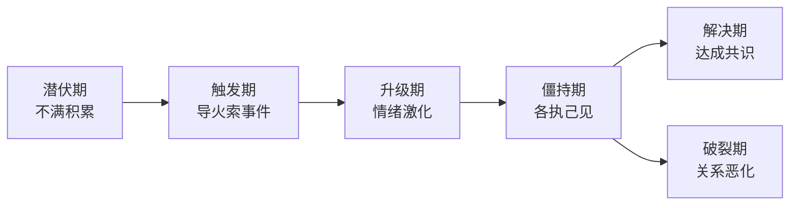
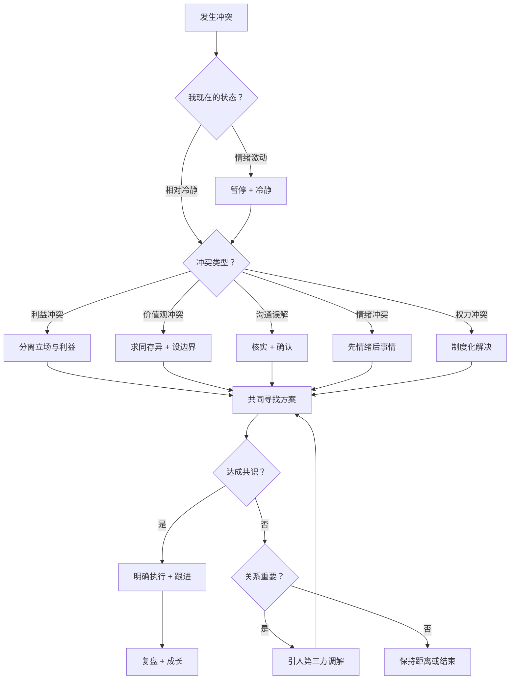

## 七、处理社交冲突

冲突是人际关系中不可避免的部分。心理学家约翰·戈特曼（John Gottman）的研究表明，即使在最幸福的婚姻中，也有约 69% 的冲突是永远无法解决的——关键不在于消除冲突，而在于如何处理它。处理得当的冲突不仅不会破坏关系，反而能加深理解、增强信任。本章提供一套完整的冲突处理框架，从理论模型到实操话术，帮助你在任何社交场景中从容应对。

### 7.1 理解冲突的本质

#### 7.1.1 冲突的来源

社交冲突的根源可以归纳为五个层面：

| 层面 | 说明 | 典型场景 |
|------|------|----------|
| **资源争夺** | 时间、金钱、注意力等有限资源的分配 | 同事争抢项目预算、朋友间谁来买单 |
| **需求差异** | 双方的核心需求存在矛盾 | 一方需要独处空间，另一方需要陪伴 |
| **认知偏差** | 对同一事件的理解和归因不同 | "他故意不回我消息" vs "我在开会没看到" |
| **价值冲突** | 世界观、道德观、生活方式的根本差异 | 消费观、育儿观、职业选择的分歧 |
| **权力动态** | 控制权、决策权、话语权的争夺 | 谁来决定周末去哪、团队中谁说了算 |

理解冲突的来源是解决它的第一步。很多冲突表面上是"你为什么不洗碗"，实际上是"我觉得你不重视我"。找到真正的冲突焦点，才能找到真正的解决方案。

#### 7.1.2 冲突的五个阶段

冲突不是突然爆发的，它有一个渐进的升级过程。理解这个过程可以帮助你在早期阶段介入，避免冲突恶化：

**第一阶段：潜伏期** — 小的不满和摩擦在积累，但还没有被明确表达。比如室友总是不倒垃圾，你忍了三周没说。

**第二阶段：触发期** — 某个具体事件成为导火索，矛盾浮出水面。比如第四周你看到垃圾溢出来了，终于爆发。

**第三阶段：升级期** — 双方情绪激化，开始翻旧账、人身攻击。"你上次也没倒！""你还不是从来不洗碗！"

**第四阶段：僵持期** — 双方各执己见，拒绝让步。可能进入冷战或持续争吵。

**第五阶段：解决期** — 双方找到共识并执行。或者进入破裂期——关系恶化甚至终结。

**关键洞察**：最佳介入时机是潜伏期和触发期。一旦进入升级期，解决问题的难度会指数级上升。

#### 7.1.3 冲突处理的五种风格

心理学家肯尼斯·托马斯（Kenneth Thomas）和拉尔夫·基尔曼（Ralph Kilmann）提出了经典的冲突处理模型，基于两个维度——**坚持度**（关注自身利益）和**合作度**（关注他人利益）——划分出五种风格：

| 风格 | 坚持度 | 合作度 | 适用场景 | 局限性 |
|------|--------|--------|----------|--------|
| **竞争** | 高 | 低 | 紧急决策、维护核心权益 | 损害关系，对方感到被压制 |
| **回避** | 低 | 低 | 话题无关紧要、需要冷静期 | 问题未解决，可能积累怨恨 |
| **妥协** | 中 | 中 | 时间紧迫、需要临时方案 | 双方都不完全满意 |
| **迁就** | 低 | 高 | 对你来说不重要、维护关系优先 | 长期使用会导致需求被忽视 |
| **协作** | 高 | 高 | 重要关系、复杂问题 | 耗时，需要双方配合 |

**没有"最好"的风格**——每种风格在特定场景下都有价值。真正的问题是：你是否只依赖一种风格，而无法灵活切换？

**自测**：回顾过去三次社交冲突，你分别使用了哪种风格？如果你发现自己总是在"迁就"或"竞争"，说明你需要拓展冲突处理的工具箱。

### 7.2 冲突处理的七步法

这是一个经过实践验证的结构化流程，适用于大多数社交冲突场景：

#### 第一步：按下暂停键

**为什么**：神经科学研究表明，当人处于情绪激动状态时，杏仁核（大脑的情绪中心）会"劫持"前额叶皮层（理性思考区域），导致决策能力下降约 40%。此时做出的反应往往是冲动的、非理性的。

**怎么做**：

- **识别身体信号**：心跳加速、呼吸变浅、肌肉紧张、声音变大——这些都是情绪即将失控的预警
- **使用暂停话术**：
  - "我现在情绪有点激动，我怕说出后悔的话。我们冷静半小时再聊好吗？"
  - "这件事对我很重要，我想好好想一想再跟你谈。"
  - "我需要一点时间整理思路，我们明天下午再聊可以吗？"
- **暂停期间做什么**：深呼吸（4-7-8 呼吸法：吸气 4 秒，屏息 7 秒，呼气 8 秒）、散步、写下自己的想法

**注意**：暂停不是逃避。要明确告诉对方"我会回来谈"，给出具体的时间承诺。

#### 第二步：深度自我反思

暂停期间，用以下问题清单进行自我审视：

**关于事实**：
1. 发生了什么？（尽可能客观描述，去除主观评价）
2. 有哪些信息是我不确定的？
3. 如果用摄像机记录这个场景，画面会是什么样的？

**关于自身**：
4. 我的核心需求是什么？（安全、尊重、自主、归属、公平……）
5. 我的哪些行为可能加剧了冲突？
6. 我对对方有哪些假设？这些假设可靠吗？
7. 我在这个冲突中的责任是什么？

**关于对方**：
8. 对方的核心需求可能是什么？
9. 对方最近是否承受着其他压力？
10. 对方的成长背景如何影响了ta的行为模式？

**关于关系**：
11. 这个冲突的本质是什么类型？（利益/认知/价值/情绪/权力）
12. 我想通过这次对话达成什么？（解决问题/表达感受/修复关系/设定边界）
13. 这段关系对我有多重要？我愿意投入多少去修复它？

**实用工具**：用"需求-恐惧"双栏法。在纸的左边写下"我需要什么"，右边写下"我害怕什么"。很多时候，我们的攻击性行为背后是未被满足的需求和未被安抚的恐惧。

#### 第三步：选择合适的时机和场景

时机和场景对冲突解决的成功率影响巨大。研究显示，在错误的时间和地点发起对话，失败率高达 70%。

**好的时机**：
- 双方都比较放松、精力充沛的时候
- 不在饭前（低血糖影响情绪控制）
- 不在深夜（疲劳降低耐心和判断力）
- 不在对方刚下班/刚经历压力事件之后
- 至少在事件发生后 24 小时内（太久会失去解决动力）

**好的场景**：
- 私密的空间（不被他人旁听）
- 中立的场所（不在"你的地盘"或"我的地盘"）
- 没有时间压力（不是"我还有 10 分钟就要走"）
- 面对面优于电话，电话优于文字消息

**绝对避免**：
- 在公共场合或社交媒体上发起冲突对话
- 通过微信文字处理重要的冲突（缺少语气、表情、肢体语言）
- 在酒后或极度疲惫时处理冲突
- 在第三方在场时处理（除非是专业调解人）

#### 第四步：用 NVC 框架开启对话

参照前文的非暴力沟通理论，冲突对话的开场至关重要。一个好的开场能将对方从"防御模式"切换到"对话模式"。

**开场模板**：

"我想跟你聊一下 [具体事件]，因为这件事让我感到 [感受]，
我想和你一起找到一个我们都舒服的方式。你现在方便聊吗？"

**对比效果**：

| 破坏性开场 | 建设性开场 |
|-----------|-----------|
| "我们需要谈谈你昨天的事" | "关于昨天的事，我想跟你聊聊我的感受" |
| "你又这样了" | "我注意到最近有几次 [具体描述]，想和你确认一下" |
| "你到底怎么回事" | "我可能不理解你的出发点，能跟我讲讲吗" |
| "我不想吵，但是……" | "我很在意我们的关系，所以想直接跟你沟通" |

**开场的三个要素**：
1. **具体化**：指出具体的事件和行为，而非笼统的评价
2. **情感化**：表达你的真实感受，而非攻击对方的意图
3. **邀请式**：给对方选择权，而非强迫对话

#### 第五步：深度倾听与理解

这一步是最容易被跳过，但却是最关键的一步。大多数人在这个阶段犯的错误是：表面上在听，实际上在准备自己的反驳。

**真正的倾听需要做到**：

1. **全神贯注**：放下手机，保持眼神接触，用身体语言表示你在听（点头、前倾）
2. **不打断**：让对方说完，即使你不同意
3. **确认理解**：用你自己的话复述对方的意思——"你的意思是……对吗？"
4. **探询情感**：不仅听内容，还要听情感——"听起来你当时很委屈？"
5. **搁置评判**：即使对方说的不完全对，先理解ta的感受，再纠正事实

**倾听中的关键话术**：

- "能再多说一些吗？我想完全理解你的感受。"
- "如果我是你，我可能也会这样想。"
- "我听到了你说的 [复述]，还有其他的吗？"
- "谢谢你告诉我这些，我知道说这些不容易。"
- "我之前没有从这个角度想过，你的想法让我有了新的理解。"

**深层倾听的"冰山模型"**：对方说出来的话只是冰山一角（10%），水面下还有未表达的情绪（30%）、未满足的需求（30%）和深层恐惧（30%）。倾听的目标是潜入水面以下。

#### 第六步：共同寻找解决方案

当双方都充分表达和理解了对方的立场后，进入解决方案阶段。

**协作解题的步骤**：

1. **明确共同目标**："我们都想要什么？"——找到双方的交集
2. **头脑风暴**：列出所有可能的方案，不急于评判
3. **评估方案**：用"双赢检验"——这个方案是否同时满足双方的核心需求？
4. **选择方案**：选择一个双方都能接受（不一定是完美满意）的方案
5. **细化执行**：明确谁、在什么时候、做什么

**创造性扩大"蛋糕"的技巧**：

- **拆分议题**：把一个大冲突拆成多个小议题，逐个解决
- **交换偏好**：你更在意 A，我更在意 B，各取所需
- **增加资源**：如果冲突是因为资源不够，看看能否增加资源
- **引入新方案**：跳出非此即彼的思维，寻找第三种选择
- **时间分段**：这次按你的方式，下次按我的方式

**示例**：两位朋友对周末活动有分歧——一个想爬山，一个想看电影。拆分后发现：想爬山的人核心需求是"运动和亲近自然"，想看电影的人核心需求是"放松和社交"。新方案：周六上午一起爬山（满足运动需求），下午一起看电影（满足放松需求）。

#### 第七步：达成共识并跟进

共识不是口头承诺，而是可执行的行动方案。

**共识模板**：

我们达成了以下共识：
1. [具体行为] → 负责人：[谁] → 时间：[何时]
2. [具体行为] → 负责人：[谁] → 时间：[何时]

如果遇到困难，我们的处理方式是：[预案]

下次回顾时间：[具体日期]

**跟进的关键**：
- 设定一个明确的回顾日期（不晚于两周后）
- 回顾时关注进步，而非完美
- 如果共识没有被执行，先了解原因（是执行困难还是意愿问题），而非直接指责
- 根据执行情况调整方案

### 7.3 不同类型冲突的深度处理策略

#### 7.3.1 利益冲突

**特征**：双方争夺同一资源——金钱、时间、注意力、机会等。

**处理策略**：

1. **分离立场与利益**：立场是"我要 X"，利益是"我为什么需要 X"。很多时候，相同的立场背后有不同的利益，不同的立场背后可以有相同的利益。
   - 立场：A 要加班赚钱 vs B 要多陪家人
   - 利益：A 需要经济安全感 vs B 需要情感连接
   - 新方案：A 提高工作效率而非加班时间，B 增加陪伴质量而非时长

2. **扩大蛋糕**：寻找能增加整体价值的方案，而非零和博弈
3. **引入客观标准**：用市场价、行业惯例、第三方评估来决定分配
4. **分阶段处理**：短期妥协 + 长期规划

#### 7.3.2 价值观冲突

**特征**：双方在根本性的世界观、信仰、生活方式上存在分歧。

**处理策略**：

1. **区分"不同意"和"不尊重"**：你可以不同意对方的价值观，但尊重对方持有这个价值观的权利
2. **寻找深层共同点**：表面价值观不同，深层需求可能是相同的。保守派和自由派都关心社会公平，只是方法论不同
3. **建立边界**：明确"哪些话题我们不讨论"，这不是逃避，而是保护关系的智慧
4. **好奇而非改造**：用"你的这个想法是从哪里来的？"代替"你怎么能这样想？"

**重要提醒**：不是所有价值观冲突都需要解决。如果双方的核心价值观严重对立且无法调和，保持距离可能是更健康的选择。

#### 7.3.3 沟通误解冲突

**特征**：冲突源于信息不对称、表达不清晰或理解偏差。

**处理策略**：

1. **核实而非假设**："我理解你说的是 [复述]，对吗？"——确认你理解的是否正确
2. **追问意图**："你说这句话的时候，你希望传达什么？"
3. **反馈感受**："你那样说让我感觉 [感受]，这是你的本意吗？"
4. **改善渠道**：重要的事情面谈或电话，不要用微信文字
5. **建立确认机制**：重要约定用文字记录，双方确认

**常见误解场景及应对**：

| 场景 | 误解 | 应对 |
|------|------|------|
| 对方说"随便" | 以为真的随便 | "你说随便，是真的都行，还是有偏好但不想为难我？" |
| 对方已读不回 | 以为在生气 | "我注意到消息没回，想知道你是不是在忙？" |
| 对方语气变了 | 以为针对你 | "我感觉你刚才语气变了，是发生什么了吗？" |
| 群聊中的话 | 以为在暗示什么 | 私下直接问，不在群聊中揣测 |

#### 7.3.4 情绪冲突

**特征**：冲突的核心不是事情本身，而是积压的情绪——委屈、失望、不被理解。

**处理策略**：

1. **先情绪，后事情**：不要在对方情绪激动时讨论解决方案，先让情绪被看见和接纳
2. **验证感受**："你感到 [情绪] 是完全可以理解的"——验证≠认同，但能降低防御
3. **不急于"解决问题"**：很多时候，对方需要的不是方案，而是被理解
4. **避免"但是"**：不要说"我理解你的感受，但是……"——"但是"会否定前面所有的共情
5. **身体接触**：如果是亲密关系，一个拥抱可能比千言万语更有效

**情绪急救话术**：
- "我看到你很难受，我在这里。"
- "你的感受很重要，我不会忽视它。"
- "你不需要为了我而压下这些情绪。"
- "我可能做得不够好，但我真的很在乎你。"

#### 7.3.5 权力冲突

**特征**：冲突围绕控制权、决策权、话语权展开。

**处理策略**：

1. **明确角色和责任**：用 RACI 矩阵（谁负责、谁审批、谁咨询、谁知会）厘清权限
2. **制度化决策**：建立决策机制，而非每次都靠"谁强势谁说了算"
3. **关注公平感**：权力冲突的核心往往是公平感——"凭什么都是你决定？"
4. **给予对方控制权**：在不重要的事情上主动让渡决策权，积累合作资本
5. **寻求上级/第三方协调**：在组织中，可以寻求制度化的调解

### 7.4 特定场景的冲突处理

#### 7.4.1 职场冲突

职场冲突有其特殊性——你不能选择离开（至少不能轻易离开），而且关系影响工作绩效。

**上下级冲突**：
- 下级视角：选择合适的时间私下沟通，用"请教"的姿态而非"挑战"的姿态。"我想请教一下这个决策的考量，因为我有一些疑虑想和您讨论。"
- 上级视角：给下属表达的空间，不要把不同意见视为"不服管"。定期进行一对一沟通，主动收集反馈。

**同事间冲突**：
- 聚焦工作目标而非个人恩怨："我们都想把这个项目做好，让我们看看怎么做最有效。"
- 引入客观标准：用数据、流程、规则来解决分歧
- 必要时寻求上级或 HR 介入，但先尝试自行解决

**跨部门冲突**：
- 理解对方部门的压力和 KPI
- 寻找共同的上级目标
- 用书面沟通记录共识，避免"你说过/我没说"

#### 7.4.2 家庭冲突

家庭冲突的特点是情感深度大、历史包袱重、难以回避。

**伴侣冲突**：
- 遵循戈特曼的"5:1法则"——稳定的关系中，积极互动与消极互动的比例至少是 5:1
- 避免"末日四骑士"：批评（人格攻击而非行为批评）、蔑视（翻白眼、嘲讽）、防御（拒绝承担责任）、冷暴力（情感撤离）
- 定期进行"关系维护对话"，不要等冲突爆发才沟通

**亲子冲突**：
- 青春期孩子的冲突本质上是自主权的争取——给予有限的选择权而非命令
- 用"我"句式而非"你"句式："我担心你的安全" vs "你太不懂事了"
- 设立明确的规则和后果，但解释规则背后的原因

**代际冲突**：
- 理解父母的成长背景塑造了他们的观念
- 在核心价值观上求同存异，在生活方式上设立边界
- 不要试图"改变"父母，而是寻找双方都能接受的相处方式

#### 7.4.3 朋友间冲突

**金钱相关**：
- 借钱前明确金额、期限、还款方式，最好有书面记录
- 如果对方未按时还款，先了解原因，再提出解决方案
- 借出的钱视为"可能回不来的钱"，如果这个金额会伤害关系，就不要借

**社交圈冲突**：
- 不要在社交圈中选边站，保持与各方的独立关系
- 不传话、不八卦——任何你想说给 A 听的话，先确认你敢当着 B 的面说
- 如果必须选边（比如涉及原则问题），做好失去另一方的准备

#### 7.4.4 线上/社交媒体冲突

线上冲突有其独特性：文字缺少语气、容易被截屏传播、情绪容易升级。

**处理原则**：
1. **重要冲突不在线上解决**——打字不如打电话，打电话不如见面
2. **不回复的情绪化消息**——给自己至少 30 分钟冷静期
3. **不要在公开场合撕**——朋友圈、微博、群聊都不是冲突解决的场所
4. **截图不是证据**——截取的对话往往缺少上下文，不要用它来"证明"对方的问题
5. **明确边界**——"关于这个问题，我们可以私下聊，但我不想在群里讨论"

### 7.5 冲突中的高级技巧

#### 7.5.1 去升级化话术

当对话开始升温，以下话术可以帮助降低张力：

| 场景 | 去升级话术 |
|------|-----------|
| 对方开始人身攻击 | "我们可以聚焦在具体的事情上吗？" |
| 对方翻旧账 | "这件事确实重要，我们先解决眼前的问题，回头再聊那个好吗？" |
| 对方沉默不语 | "我能感觉到你有很多想法，我真的很想听你说。" |
| 对方情绪崩溃 | "先不急，我们慢慢来。你需要什么？" |
| 你自己快失控 | "我需要暂停一下，我说话可能会带情绪。给我 10 分钟。" |
| 对方说"你不理解我" | "你说得对，我可能还没完全理解。能再跟我讲讲吗？" |

#### 7.5.2 难以启齿话题的开口方法

有些冲突涉及敏感话题（性、金钱、疾病、家庭隐私），直接开口会让人尴尬。

**三步开口法**：
1. **预告**："我有一件事想跟你聊，但不太确定怎么说……"
2. **承认尴尬**："这件事说出来可能有点尴尬，但我觉得我们之间应该可以直接说。"
3. **直接但温和**："[具体内容]……你怎么看？"

**示例**：
- "我有一件事不太知道怎么开口（预告），说出来可能有点不好意思（承认尴尬），但我觉得你是我信任的人……最近我注意到你在朋友圈发了一些让我担心的内容，你还好吗？（直接但温和）"

#### 7.5.3 识别不健康冲突的信号

并非所有冲突都可以通过对话解决。当你在冲突中持续出现以下信号，需要重新评估这段关系：

**你需要警惕的模式**：
- 对方总是把所有问题归因于你，从不承认自己的责任
- 冲突中存在威胁、恐吓、经济控制或暴力行为
- 你发现自己经常"走在蛋壳上"，害怕触怒对方
- 每次冲突后你都在道歉，即使你不确定自己错在哪里
- 对方利用你的弱点来赢得争论
- 冲突解决后没有实质改善，同样的问题反复出现
- 你在冲突中感到恐惧而非不安

**应对**：如果你识别出这些模式，单靠沟通技巧无法解决问题。建议寻求专业心理咨询师的帮助，或者认真评估是否应该继续这段关系。

### 7.6 冲突后的修复与成长

冲突解决不等于关系修复。解决是处理当下的问题，修复是重建被损害的信任和连接。

#### 7.6.1 修复的五个阶段

1. **承认伤害**：不要说"你太敏感了"或"我们不是已经谈好了吗"——承认你的言行确实伤害了对方
2. **真诚道歉**：好的道歉包含三个要素——承认具体错误 + 表达理解对方感受 + 承诺改变行为
3. **给予时间**：信任的修复不是一次对话就能完成的，给对方时间和空间
4. **用行动证明**：持续的一致行为是重建信任的唯一途径
5. **重建连接**：在冲突修复后，主动创造积极的互动体验，抵消冲突带来的负面影响

**好道歉 vs 坏道歉**：

| 坏道歉 | 好道歉 |
|--------|--------|
| "对不起，但是你也有问题" | "对不起，我当时不应该那样说" |
| "如果我伤害了你，我很抱歉" | "我知道我的话让你很难受，我很抱歉" |
| "我只是太生气了" | "我生气了，但那不是对你发火的借口" |
| "我已经道歉了你还想怎样" | "我知道道歉不能消除你的感受，我会用行动来弥补" |
| "我以后不会了"（空头承诺） | "以后遇到类似情况，我会 [具体行为]" |

#### 7.6.2 从冲突中提取成长

每一次冲突都是一次学习机会。冲突结束后（至少 24 小时后），可以进行复盘：

**复盘问题清单**：
1. 这次冲突的根本原因是什么？（不仅看表面）
2. 我在冲突中的表现如何？哪些做得好，哪些需要改进？
3. 我使用了哪种冲突风格？是否有更合适的方式？
4. 对方的哪些反应让我意外？我能从中学到什么？
5. 如果重来一次，我会怎么做不同？
6. 这次冲突暴露了关系中的哪些结构性问题？需要怎样预防？

**建立"冲突模式日志"**：记录每次冲突的模式——什么话题会触发冲突？什么时候容易爆发？什么方式有效？积累 3-5 次记录后，你会清晰地看到自己的冲突模式，这是改变的起点。

### 7.7 冲突预防：把冲突消灭在萌芽中

最好的冲突处理是预防。以下习惯可以大幅减少不必要的冲突：

#### 7.7.1 建立定期沟通机制

- **伴侣**：每周 30 分钟的"关系维护对话"——这周有什么开心的事？有什么不舒服的事？下周想要什么？
- **团队**：定期的一对一沟通和团队回顾会
- **朋友**：不要等到有问题才联系，定期的主动互动是最好的预防

#### 7.7.2 培养表达需求的习惯

不要等到需求被忽视到变成怨恨才开口。练习在日常中表达需求：
- "我希望我们能多一些一起的时间"（而非等对方三个月没约你后爆发）
- "这个项目我需要更多的支持"（而非等搞砸了互相指责）
- "你那样说让我不太舒服，下次能换个方式吗？"（而非等积攒了十次后再一起算账）

#### 7.7.3 学会"善意假设"

冲突中最大的敌人不是分歧，而是恶意归因——我们倾向于把对方的不利行为归因于"故意的"或"针对我的"，把自己的不利行为归因于"外部原因"。

**练习**：当你感到被冒犯时，先假设至少三种善意的解释：
- "他迟到可能是因为交通堵塞，而不是不尊重我"
- "她没回我消息可能是在开会，而不是故意冷落我"
- "他说话冲可能是今天压力大，而不是针对我"

然后用提问代替假设："你今天看起来有些疲惫，是发生什么了吗？"

#### 7.7.4 保持情感账户的正余额

戈特曼提出"情感银行账户"的比喻：每次积极互动是存款，每次消极互动是取款。当账户余额为正时，偶尔的冲突不会伤筋动骨；当账户为零或为负时，任何小事都可能成为压垮关系的最后一根稻草。

**日常存款方式**：
- 表达欣赏和感谢（每天至少一次真诚的肯定）
- 关注对方的日常细节（"你今天看起来心情不错"）
- 在小事上体现关心（带杯咖啡、记住重要日期）
- 积极回应对方的好消息（比对坏消息的回应更重要）
- 身体接触（拥抱、拍肩、牵手）

### 7.8 常见误区与纠正

| 误区 | 问题 | 纠正 |
|------|------|------|
| "我们应该把所有问题都说出来" | 并非所有不满都需要摊牌，有些小事可以放下 | 区分"必须处理的问题"和"可以放下的一时情绪" |
| "忍一时风平浪静" | 长期压抑会导致情绪爆炸或关系疏远 | 学会在问题小时及时沟通，而非等到忍无可忍 |
| "吵架说明关系不好" | 研究表明，回避冲突的关系并不比积极处理冲突的关系更健康 | 关键不在于是否吵架，而在于如何吵架 |
| "我道了歉就没事了" | 道歉只是第一步，行动改变才是真正的修复 | 用持续的行为证明改变，不要指望一句"对不起"解决一切 |
| "我需要赢" | 把冲突当成胜负之争会破坏关系 | 冲突的目标是理解，不是胜利 |
| "对方应该懂我" | 没有人能读心术，期望对方猜测你的需求是不公平的 | 清晰、直接、温和地表达你的需求 |
| "等对方先低头" | 僵持只会让关系恶化 | 谁更在意这段关系，谁就先迈出一步——这不是软弱，而是勇气 |
| "用冷暴力表达不满" | 冷暴力是关系中最具破坏力的行为之一 | 如果需要空间，明确说出来："我需要一些时间，明天再聊" |

### 7.9 本节工具箱

**决策流程图**：遇到冲突时，按以下流程判断如何处理：

**快速参考卡**：

冲突处理口诀：暂停 → 反思 → 选时机 → 开对话 → 深倾听 → 共解决 → 定跟进

黄金法则：
  ✓ 对事不对人
  ✓ 用"我"不用"你"
  ✓ 先理解再被理解
  ✓ 追求双赢而非胜负
  ✓ 关系比对错重要

红线清单（绝不做的事）：
  ✗ 人身攻击和人格贬低
  ✗ 翻旧账扩大战场
  ✗ 冷暴力和情感操控
  ✗ 在公共场合或社交媒体上争吵
  ✗ 用第三方来"站队"施压

***
