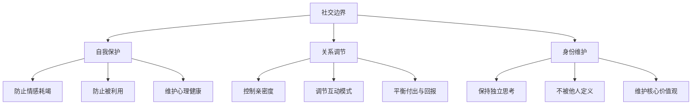
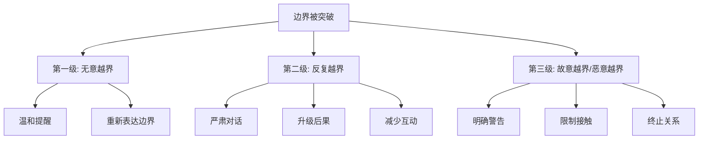

## 八、社交中的边界管理

边界是人际关系中最关键却最容易被忽视的能力。没有边界的关系不是亲密，是吞噬；没有边界的善良不是美德，是自我消耗。本章从理论根基到实操话术，系统构建你的边界管理能力。

### 8.1 什么是社交边界

#### 8.1.1 边界的定义与本质

社交边界（Social Boundaries）是你在人际关系中为自己划定的心理和行为界限——它定义了什么是你可以接受的，什么是你不可以接受的；你愿意为关系付出多少，你希望对方如何对待你。

边界不是墙。墙是"我拒绝一切"，边界是"我知道什么该进、什么该出"。好的边界像一扇有锁的门——你选择什么时候打开，为谁打开，打开多大。

从心理学角度看，边界的核心功能有三个：

- **自我保护**：防止被他人的情感、行为或需求过度侵蚀
- **关系调节**：维持关系中双方的舒适距离和互动模式
- **身份维护**：在关系中保持清晰的自我认知，不被他人定义

#### 8.1.2 边界的心理学理论基础

**自我决定理论（Self-Determination Theory）**

德西（Deci）和瑞安（Ryan）提出的自我决定理论指出，人有三个基本心理需求：自主性（Autonomy）、胜任感（Competence）和归属感（Relatedness）。边界管理直接服务于自主性——当你无法对他人说"不"时，你实际上是在放弃自己的自主权。长期的自主性缺失会导致内在动机下降、焦虑增加和关系倦怠。

**客体关系理论（Object Relations Theory）**

温尼科特（Winnicott）提出"足够好的母亲"概念——健康的养育者既不过度侵入孩子的空间，也不完全忽视孩子的需求。这个早期经验塑造了一个人日后的边界模式。如果养育者过度侵入（不尊重孩子的边界），孩子长大后可能发展出模糊的边界感——要么过度退让，要么过度防御。

**家庭系统理论（Family Systems Theory）**

鲍文（Bowen）的家庭系统理论中有一个核心概念叫"自我分化"（Differentiation of Self）——在情感关系中保持独立思考和自我身份的能力。自我分化程度低的人容易在关系中"融合"，失去自己的立场和需求，被他人的情绪所裹挟。边界管理本质上就是自我分化的外在表现。

### 8.2 边界的六种类型

边界不是单一维度的，它横跨多个生活领域。理解不同类型的边界有助于你全面审视自己在哪些方面需要加强。

#### 8.2.1 时间边界

时间边界定义了你愿意为某段关系或某个人投入多少时间。

**核心原则**：你的时间是有限资源，分配时间就是分配生命。

| 场景 | 无边界表现 | 有边界表现 |
|------|-----------|-----------|
| 同事找你帮忙 | 放下自己的工作立即帮忙，自己的事加班做 | "我现在手头有个紧急任务，下午3点后可以帮你看看" |
| 朋友频繁约你 | 每次都答应，即使自己很累 | "这周我想休息一下，下周六我们再约？" |
| 家人随时打电话 | 任何时候都接，通话时间无限 | "我晚上9点后要休息，我们白天聊好吗？" |
| 领导临时加班 | 随叫随到，从不拒绝 | "今天有安排了，明天一早我优先处理这个" |

**时间边界的量化参考**：心理学家邓巴（Dunbar）的研究表明，人的社交网络有层级结构——亲密关系约5人，好朋友约15人，朋友约50人。你的时间分配应该与关系层级匹配：核心关系获得更多时间，外层关系获得更少时间。

#### 8.2.2 情感边界

情感边界定义了你在情感上愿意为他人承担多少。

**核心原则**：你可以关心别人，但不必为别人的情绪负责。

情感边界模糊的典型表现：

- 朋友向你倾诉负面情绪后，你自己也陷入低落，久久不能恢复
- 你感到"必须"让别人开心，别人不开心你就焦虑
- 你经常充当"情绪垃圾桶"，但没人关心你的感受
- 你在冲突中总是第一个让步，因为无法忍受对方的不高兴
- 你吸收了家人的焦虑、愤怒，却无法分辨哪些情绪是自己的

**情感边界的核心区分**：

- **共情**（Empathy）："我理解你的感受"——我理解你，但你的感受是你的
- **吸收**（Absorption）："你的痛苦就是我的痛苦"——我把你的情绪变成了自己的

共情是健康的，吸收是危险的。长期的情感吸收会导致"共情疲劳"（Compassion Fatigue），表现为情绪枯竭、对他人痛苦的麻木、以及自我价值感下降。

#### 8.2.3 物理边界

物理边界涉及你对身体接触、个人空间和物质资源的偏好。

**身体接触边界**：每个人对身体接触的舒适度不同。有些人习惯拥抱，有些人对非必要的身体接触感到不适。两种偏好都是正常的，关键是相互尊重。

**个人空间边界**：人类学家霍尔（Edward Hall）提出的"近体学"（Proxemics）将人际空间分为四个区域——亲密距离（0-45cm）、个人距离（45-120cm）、社交距离（120-360cm）、公共距离（360cm以上）。不同文化和关系对这些距离的定义不同，但每个人都有自己的舒适区。

**物质边界**：借钱、借东西、共用物品——物质边界的模糊是友情破裂的常见导火索。明确的物质边界不是小气，是保护关系的方式。

#### 8.2.4 信息边界

信息边界定义了你愿意向不同的人分享多少个人信息。

这与前面章节讨论的"自我表露理论"直接相关。信息边界的核心原则是——信息的深度应该与关系的深度匹配。

**信息边界的层级模型**：

| 信息层级 | 内容示例 | 适用关系 |
|---------|---------|---------|
| 公开层 | 姓名、职业、爱好 | 所有人 |
| 社交层 | 生活近况、工作感受、对公共话题的看法 | 同事、普通朋友 |
| 私人层 | 家庭情况、经济状况、健康问题 | 好朋友、信任的同事 |
| 核心层 | 恐惧、创伤经历、内心冲突、秘密 | 最亲密的人、心理咨询师 |

**常见的信息边界越界行为**：

- 初次见面就追问收入、感情状况、家庭隐私
- 把你分享的私事告诉第三方
- 在社交媒体上未经同意发布你的照片或信息
- 强迫你分享你不想分享的事情

#### 8.2.5 能力边界

能力边界定义了你在能力和技能方面的责任范围。

**核心原则**：承认自己的局限性不是软弱，是智慧。

能力边界模糊的表现：

- 承接自己不擅长的工作，结果两头不讨好
- 朋友问你专业问题，你勉强回答却给出错误信息
- 你觉得自己"应该"能处理所有问题，无法接受帮助
- 你替别人做他们自己应该学会做的事情

健康的能力边界意味着诚实地承认："这不是我擅长的领域，我建议你找专业人士。"

#### 8.2.6 价值观边界

价值观边界定义了你在核心信念和价值观方面的底线。

**这是所有边界中最深层、最不容易妥协的边界。**

价值观边界涉及：

- 你认为什么是重要的、什么是对的
- 你愿意为了关系在多大程度上妥协自己的信念
- 什么样的行为是你无论如何都不能接受的

价值观边界的常见冲突场景：

- 朋友要求你帮忙做一些你认为不道德的事
- 伴侣试图改变你的宗教信仰或政治立场
- 工作环境要求你做出与个人价值观相悖的行为
- 家人用"为你好"来否定你的生活方式选择

### 8.3 识别需要设定边界的信号

很多人在边界已经被严重侵犯之后才意识到问题。学会识别早期信号是边界管理的第一步。

#### 8.3.1 身体信号

身体往往比意识更早察觉边界被侵犯：

- 和某人互动后感到莫名的疲惫和空虚
- 想到即将与某人见面就感到胃部紧缩或头痛
- 在某人身边时身体不自觉地紧绷、后退或交叉手臂
- 长期与某人的互动导致失眠、食欲变化或免疫力下降

#### 8.3.2 情绪信号

持续出现以下情绪是边界被侵犯的强烈信号：

| 情绪信号 | 典型内心独白 | 可能的边界问题 |
|---------|------------|--------------|
| 愤怒 | "他又来了，每次都这样！" | 需求被反复忽视 |
| 怨恨 | "我付出了这么多，他们根本不在乎" | 付出-回报严重失衡 |
| 焦虑 | "不知道他又要提什么要求" | 对方的行为不可预测 |
| 内疚 | "我是不是太自私了？" | 边界被道德绑架 |
| 羞耻 | "我怎么连拒绝都不会" | 对自己缺乏边界能力的自责 |
| 麻木 | "无所谓了，随便吧" | 长期边界被侵犯后的心理防御 |

#### 8.3.3 行为信号

你的行为模式也能反映边界问题：

- **讨好模式**：无法拒绝任何请求，即使代价很大
- **回避模式**：越来越不想与某人接触，但不说明原因
- **爆发模式**：长期忍耐后突然情绪爆发，事后又后悔
- **被动攻击**：表面答应，内心抗拒，用拖延或敷衍来表达不满
- **过度补偿**：不断给予，试图通过付出来换取对方的认可

#### 8.3.4 关系信号

从关系层面看，以下模式提示需要边界调整：

- 你在这段关系中感到被控制或窒息
- 你不敢表达不同意见，害怕关系破裂
- 对方经常越界（如随意翻看你的手机、未经同意做决定）
- 你在关系中失去了自我——不知道自己想要什么
- 你发现自己在关系中扮演的角色不是真实的自己

### 8.4 如何科学地设定边界

设定边界不是一蹴而就的技能，而是一个从认知到行动的系统过程。

#### 8.4.1 设定边界前的自我觉察

在设定边界之前，你需要先搞清楚三个问题：

**问题一：我的核心需求是什么？**

边界的存在是为了保护需求。如果你不清楚自己的需求，边界就没有方向。花时间思考：

- 在这段关系中，我最需要的是什么？（尊重？空间？公平？安全感？）
- 我不能失去的是什么？（独立性？价值观？职业发展？）
- 如果我继续现在的方式，一年后我会变成什么样？

**问题二：我的底线在哪里？**

底线是你绝对不能接受的事情。底线和偏好不同——偏好是你喜欢的，底线是你不能没有的。

练习：写出你的"不可谈判清单"（Non-negotiable List）：

1. 我不能接受别人在公共场合羞辱我
2. 我不能接受伴侣翻看我的私人通讯
3. 我不能接受为了别人的便利而牺牲自己的睡眠
4. 我不能接受朋友在背后议论我的隐私
5. 我不能接受以"为你好"为名义的控制行为

**问题三：我的恐惧是什么？**

大多数人不设边界不是因为不知道该设，而是因为害怕后果。识别你的恐惧：

- "如果我拒绝，他们会生气"——你害怕冲突
- "如果我设边界，他们会离开"——你害怕被抛弃
- "如果我坚持自己，别人会觉得我自私"——你害怕被评判
- "如果我为自己说话，关系会变糟"——你害怕失去控制

认识到这些恐惧后，你需要问自己一个关键问题：**"如果不设边界，我正在付出的代价是什么？"** 大多数时候，不设边界的代价远大于设边界的代价。

#### 8.4.2 设定边界的四步法

**第一步：觉察——识别你需要什么边界**

通过前面的信号识别，确定你需要在哪段关系的哪个方面设定边界。

**第二步：表达——清晰、直接、不带攻击性地传达你的边界**

这是最关键的一步，也是大多数人最困难的一步。以下是几种有效的表达框架：

**框架一：非暴力沟通（NVC）公式**

马歇尔·卢森堡（Marshall Rosenberg）的非暴力沟通公式是表达边界最有效的方法之一：

> "当你____（具体行为）的时候，我感到____（你的情绪），因为我需要____（你的需求）。你是否愿意____（具体请求）？"

**实际应用示例**：

| 场景 | 无边界回应 | NVC边界表达 |
|------|----------|------------|
| 朋友总是迟到 | 不说什么，内心不满 | "当你迟到30分钟以上的时候，我感到不被重视，因为我需要我们的时间得到尊重。你是否愿意提前告诉我如果你会晚到？" |
| 同事把工作推给你 | 勉强接受，加班完成 | "当你在截止日期前把任务转给我时，我感到压力很大，因为我需要合理安排自己的工作。你是否愿意提前一周告诉我，这样我可以更好地规划？" |
| 家人翻看你的手机 | 生气但不说 | "当你翻看我的手机时，我感到自己的隐私被侵犯，因为我需要一些个人空间。你是否愿意尊重我的私人通讯？" |
| 朋友借钱不还 | 不好意思提 | "那笔钱借了三个月了，我最近也有一些开支需要用钱，你是否方便这周还给我？" |

**框架二：三明治法则**

把边界夹在两层积极表达中间：

> 肯定关系 → 表达边界 → 表达期待

示例："我很珍惜我们的友谊（肯定），但我不能在工作时间处理非紧急的个人事务（边界），我们可以下班后再聊这些（期待）。"

**框架三：简短直接法**

有时候你不需要复杂的公式，直接、简短、温和的表达就够了：

- "谢谢你的邀请，但这次我没法参加。"
- "这个话题我不太方便聊。"
- "我很想帮忙，但这次真的超出我的能力范围了。"
- "我理解你的需求，但这不是我能接受的方式。"

**关键技巧**：

- **不需要过度解释**。解释太多反而给对方找理由反驳的机会。"我不能参加"比"我不能参加，因为我要陪我妈去医院然后还要赶一个报告"更好。
- **不需要为设定边界道歉**。"对不起，但……"会削弱你的边界力度。把"对不起"换成"谢谢你的理解"。
- **用"我"开头，而不是"你"开头**。"我需要安静的时间"比"你太吵了"更容易被接受。

**第三步：行动——通过行为强化你的言语**

语言只是边界的50%，另外50%是行为。如果你说"我不能在晚上10点后接工作电话"，但每次都接，那你的行为在告诉对方——你的边界是可以突破的。

**行为强化的具体策略**：

- 说"不"之后不要立刻解释或补偿。沉默本身就是力量
- 如果对方试图突破你的边界，重复你的立场，不需要换新的理由（"破唱片法"）
- 用行动兑现你的边界：不回非紧急的深夜消息、不参加你拒绝的活动
- 保持一致性：对同一个人在同一件事上保持相同的边界

**第四步：维护——长期坚持并灵活调整**

边界不是一劳永逸的。随着关系的发展和情境的变化，边界也需要调整。

- **定期检查**：每个月花10分钟审视你的边界——哪些有效？哪些被突破了？哪些需要调整？
- **渐进式强化**：如果对方不尊重你的边界，逐步升级你的应对措施
- **接受不完美**：边界被突破一次不代表失败，重要的是你如何回应

#### 8.4.3 针对不同类型关系的边界设定策略

不同关系类型需要不同的边界策略。以下按关系类型分别说明。

**亲密关系中的边界**

亲密关系是边界最容易模糊的地方，因为"亲密"常常被错误地等同于"没有界限"。

亲密关系中需要设定的关键边界：

- **隐私边界**：每个人都有权拥有自己的私人空间、通讯和想法。查看伴侣手机、要求对方汇报行踪不是爱，是控制
- **社交边界**：你可以不参加伴侣的每一次社交活动，伴侣也可以
- **情绪边界**：伴侣的情绪不是你的责任，你可以支持但不必承担
- **决策边界**：重大决策（职业选择、财务规划）需要协商，但日常小事不需要对方批准
- **原生家庭边界**：在伴侣和原生家庭之间建立健康的边界，既不牺牲伴侣也不切断家庭

**家庭关系中的边界**

家庭关系的边界设定往往最困难，因为有深厚的情感绑定和长期的行为惯性。

- 与父母的边界："妈，我知道你是为我好，但这个决定我需要自己做。"
- 与兄弟姐妹的边界："我愿意帮忙，但我不能每次都无条件支持。"
- 与长辈亲戚的边界："谢谢关心，但我的感情生活我自己会处理。"

**职场关系中的边界**

职场边界的特殊性在于——你不能选择你的同事和领导，而且关系中存在权力差异。

- **工作量边界**："我现在手上有三个项目在并行，再接新任务可能影响质量。我们可以一起看看优先级？"
- **上下班边界**：非紧急事务不在下班后处理
- **角色边界**：不做超出职责范围的事，除非有明确的授权和补偿
- **情感边界**：同事可以成为朋友，但职场关系的基础是专业

**友情中的边界**

- **索取型朋友**：总是找你帮忙但从不回报——"这次我帮不了你，你可以试试找专业的人"
- **八卦型朋友**：喜欢传播他人隐私——"这件事我不太适合讨论"
- **控制型朋友**：要求你按照他们的方式生活——"我理解你的建议，但我想按自己的方式试试"
- **情感绑架型朋友**：用友谊威胁你——"如果你不帮我就是不够朋友"——"真正的友谊不是建立在条件上的"

### 8.5 边界管理中的常见误区

#### 误区一："设定边界就是自私"

**事实**：边界是健康关系的基础，不是关系的阻碍。没有边界的关系最终会走向怨恨和破裂。飞机上的安全指示说得好——先给自己戴好氧气面罩，再帮助他人。

**纠正方法**：重新定义"自私"。自私是只考虑自己、损害他人利益。设定边界是同时考虑自己和他人——你保护自己的需求，同时也让对方知道如何与你健康地相处。

#### 误区二："如果他们爱我，就应该知道我的边界"

**事实**：没有人是读心术专家。即使是最亲密的人也需要你明确表达你的需求和底线。

**纠正方法**：把表达边界视为对关系的投资，而不是对关系的威胁。清晰的沟通减少误解，误解才是关系的杀手。

#### 误区三："设定边界会引起冲突"

**事实**：设定边界确实可能让一些人不舒服，但这不是你的问题。一个因为你设边界就翻脸的人，恰恰证明了你为什么需要边界。

**纠正方法**：短期的不适换来长期的健康。不设边界不会让冲突消失，只是把冲突从外部转向内部——你和自己的冲突。

#### 误区四："边界是固定的，一旦设定就不能改变"

**事实**：边界是动态的。随着关系的发展、信任的建立、情境的变化，边界可以也应该调整。

**纠正方法**：把边界看作是"当前状态下保护我的最好方式"，而不是"永远不变的规则"。你可以选择在信任加深后开放更多空间，也可以在被背叛后收紧边界。

#### 误区五："我设了边界，对方就必须遵守"

**事实**：你只能控制自己的行为，不能控制别人的。你设定边界是为了告诉对方你的底线，但如果对方不尊重，你需要用行动来维护，而不是反复解释。

**纠正方法**：边界的力量来自你的行动，不是你的语言。如果对方反复突破你的边界，你需要考虑的不是"如何让对方尊重"，而是"我是否要继续这段关系"。

### 8.6 当边界被突破时：应对策略

设定边界只是第一步，真正的考验在于——当有人突破你的边界时，你该怎么办。

#### 8.6.1 边界突破的三个层级

**第一级：无意越界——温和提醒**

对方可能只是不了解你的边界，或者忘记了。

话术示例：
- "嘿，还记得我说过我不太方便在工作时间聊私事吗？我们下班后再聊吧。"
- "我知道你可能没注意到，但我更希望你敲门后再进来。"
- "谢谢你的好意，但这件事我还是想自己决定。"

**第二级：反复越界——严肃对话**

当同一边界被反复突破，你需要一次认真的对话。

话术示例：
- "我注意到我们之前讨论过的____问题又出现了。我需要认真跟你谈谈——这对我来说很重要。"
- "我已经多次表达过我在____方面的需要，但这个边界一直被忽视。我想了解你的想法，同时我也需要你知道，这个底线我不会改变。"

**第三级：恶意越界——果断行动**

当对方故意突破你的边界，甚至以此为乐或为控制手段，语言已经不够了。

行动策略：
- 明确告知后果："如果你继续这样，我将不得不____"
- 兑现后果：减少接触、暂停关系、寻求第三方介入
- 在极端情况下（如骚扰、威胁、虐待），果断终止关系并寻求法律或专业帮助

#### 8.6.2 "破唱片法"——应对对方的施压

当对方试图说服你放弃边界时（"就这一次嘛""你怎么这么小气""别人都可以"），使用"破唱片法"——像破唱片一样重复你的立场，不换理由，不加解释。

对话示例：

> 对方："就借这一次，下个月一定还。"
> 你："不好意思，我不方便借钱。"
> 对方："我们这么多年的交情，你连这点忙都不帮？"
> 你："我理解你的情况，但我不方便借钱。"
> 对方："你怎么这么冷漠？"
> 你："这不是冷漠，这是我的原则。我不方便借钱。"

关键点：每一次重复都用平静的语气，不升级情绪，不增加新理由。对方的施压需要你的配合才能生效——你拒绝配合，施压就失效了。

#### 8.6.3 内疚感的处理

设定边界后感到内疚是完全正常的——尤其是如果你从小被教育"要听话""要懂事""不要让别人不开心"。

**处理内疚的思维重构**：

- "我设定边界不是为了伤害对方，而是为了保护关系的健康"
- "如果我不设边界，我最终会怨恨对方——这才是关系的终结"
- "感到内疚不代表我做错了，只是说明我在做一件不习惯的事"
- "长远来看，清晰的边界对双方都好——对方也知道如何与我相处"

**实际操作**：设定边界后，给自己24小时再评估。大多数内疚会在24小时内显著减轻。如果你的内疚持续超过一周，或者内疚感严重到影响日常生活，考虑和心理咨询师讨论——这可能指向更深层的自我价值问题。

### 8.7 进阶：高级边界管理

#### 8.7.1 弹性边界与刚性边界

成熟的边界管理不是所有边界都一成不变。你需要区分哪些是"刚性边界"（绝对不能突破），哪些是"弹性边界"（可以根据情境和信任度调整）。

| 边界类型 | 特征 | 示例 |
|---------|------|------|
| 刚性边界 | 无论情境如何，绝不妥协 | "我不能接受任何形式的身体暴力""我不会参与违法活动" |
| 弹性边界 | 根据关系、信任度和情境调整 | "通常我不在周末处理工作，但紧急项目可以例外""一般我不借钱，但非常亲密的人小额应急可以考虑" |

**区分原则**：涉及人身安全、核心价值观和法律底线的是刚性边界；涉及个人偏好、时间和资源分配的可以是弹性边界。

#### 8.7.2 边界与文化敏感性

在中国文化语境下，边界管理面临一些独特的挑战：

- **"面子"文化**：直接拒绝可能让对方"丢面子"，需要更委婉的表达方式
- **"关系"文化**：在"人情社会"中，拒绝帮忙可能被视为不给面子、不懂人情
- **"孝道"文化**：在与长辈的关系中，设定边界可能被视为"不孝"
- **"集体主义"文化**：个人需求常常被集体需求所淹没

**在中国文化语境下的边界策略**：

- **委婉但坚定**："领导，这个项目我非常想参与，但目前手上的工作已经排满了，我担心两边都做不好。要不我们看看哪个优先级更高？"
- **给对方面子**："谢谢您的信任，这次确实不巧，下次一定支持。"
- **用"我们"代替"我"**："我们可能需要换个方式处理这个问题"比"我不想这样"更容易被接受
- **借助客观理由**："公司规定不允许""医生建议我需要休息"——用第三方权威来支持你的边界

#### 8.7.3 数字时代的边界管理

社交媒体和即时通讯工具让边界管理变得更加复杂。

**数字边界清单**：

- **消息回复时间**：你没有义务立即回复每一条消息。设定自己的回复节奏，比如工作时间内处理工作消息，私人消息在方便时回复
- **社交媒体隐私**：你有权决定在社交媒体上分享什么、不分享什么。不需要为设置了"仅三天可见"而解释
- **群聊边界**：你有权退出不感兴趣的群聊，或者设置免打扰
- **视频/语音通话**：不是每个电话都需要接，不是每个视频都要开摄像头
- **工作消息**：下班后的工作消息可以在上班后再回复（除非明确紧急）

**数字时代边界的话术**：

- "我通常不会在晚上回复工作消息，第二天一早我会处理。"
- "我不太习惯在社交媒体上分享私人生活，希望你理解。"
- "这个群的消息太多了，我设置免打扰了，有事可以私聊我。"

#### 8.7.4 边界管理的自我评估工具

定期评估你的边界管理状况，使用以下检查清单：

**边界健康度自评表**：

| 评估项目 | 1分(从不) | 2分(偶尔) | 3分(有时) | 4分(经常) | 5分(总是) |
|---------|----------|----------|----------|----------|----------|
| 我能对不合理的请求说"不" | | | | | |
| 我在关系中能表达自己的真实想法 | | | | | |
| 我不会为设定边界感到过度内疚 | | | | | |
| 我的时间分配与我的优先级一致 | | | | | |
| 我不会吸收他人的情绪 | | | | | |
| 我能识别并回应边界被侵犯的信号 | | | | | |
| 我的边界是通过行动而非仅语言来维护的 | | | | | |
| 我能在不同关系中灵活调整边界 | | | | | |

**评分解读**：

- **8-16分**：边界意识薄弱，需要大量练习。从最小的、最安全的边界开始
- **17-28分**：边界意识存在但执行不稳定。专注于行为一致性
- **29-36分**：边界管理良好，继续精进弹性和灵活性
- **37-40分**：边界管理优秀，注意不要过度僵化

### 8.8 从边界到关系深化

一个常见的误解是：设了边界，关系就会变远。事实恰恰相反——**清晰的边界是关系深化的前提**。

为什么？因为只有当双方都知道彼此的底线在哪里，才能在安全的空间里真正地开放和信任。没有边界的关系就像没有围栏的悬崖边——你不敢靠近，因为不知道什么时候会掉下去。

边界管理的终极目标不是隔绝，而是在保护自己的前提下，建立更真实、更平等、更持久的关系。当你能够清晰地表达自己的需求，同时尊重对方的需求——这才是真正的社交能力。

正如心理学家内德拉·格洛弗·塔瓦布（Nedra Glennon Tawwab）在《设定边界，找到平静》中所说：

> "边界不是为了把人推开，而是为了让你决定，谁有资格进入你的生活。"

---

**本节要点回顾**：

1. 边界是健康关系的基石，不是关系的敌人
2. 边界有六大类型：时间、情感、物理、信息、能力、价值观
3. 身体信号、情绪信号、行为信号和关系信号都在提示你需要设定边界
4. 设定边界的四步法：觉察→表达→行动→维护
5. 非暴力沟通公式是表达边界最有效的工具之一
6. "破唱片法"是应对边界施压的核心策略
7. 区分刚性边界和弹性边界，灵活应对不同情境
8. 定期自评边界健康度，持续优化

***
