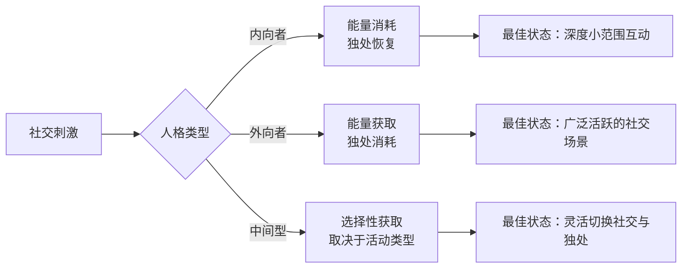
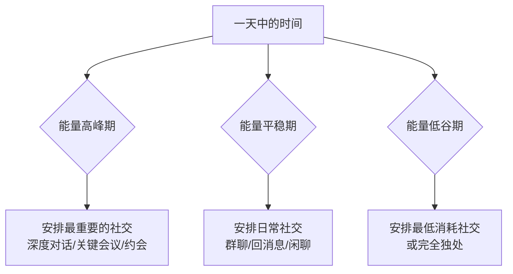
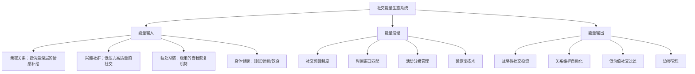

## 九、社交能量管理

社交不是无限续杯的——每一次交谈、每一场聚会、每一段关系的维护都在消耗某种看不见的资源。很多人社交失败的原因并非技巧不足，而是能量管理失当：在该休息的时候强迫自己社交，在能量最充沛的时候却用来刷手机，结果在关键时刻精疲力竭、表现失常。社交能量管理的本质，是将有限的心理资源精准分配到最有价值的社交活动中，从而实现"少而精"胜过"多而杂"的效果。

### 9.1 社交能量的本质与模型

#### 9.1.1 什么是社交能量

社交能量并非一个比喻，而是有神经科学基础的心理资源。当你与人互动时，大脑的多个区域同时工作：前额叶皮层负责解读对方意图、抑制不恰当的冲动反应；镜像神经元系统负责共情和情绪共鸣；杏仁核持续监测社交威胁信号；语言中枢组织表达。这些认知加工共同消耗葡萄糖和神经递质（尤其是血清素和多巴胺），形成可感知的疲劳感。

心理学家 Roy Baumeister 的"自我损耗"（Ego Depletion）理论指出，自控力和社交表现共享同一池心理资源。连续社交后你感到的"累"，不是体力上的，而是认知资源被消耗殆尽的表现——你的大脑在说"我需要休息来补充神经递质"。

#### 9.1.2 内向-外向-中间型的社交能量模型

瑞士心理学家 Carl Jung 提出的内向/外向维度，在社交能量管理中具有核心意义。现代神经科学研究（如 DeYoung 等人的研究）进一步揭示：内向者的基线唤醒水平更高，因此外部刺激更容易让他们越过最优唤醒阈值；外向者基线唤醒较低，需要更多外部刺激来达到最佳状态。

**内向者的社交能量特征：**

- 社交是能量的"支出项"，独处是"收入项"。一场两小时的大型聚会可能让内向者需要整个周末来恢复
- 最佳社交时长有限，通常在 1-2 小时后效率急剧下降
- 对社交刺激的敏感度高，嘈杂环境、陌生人密集的场景会加速能量消耗
- 深度一对一交流消耗的能量远少于浅层多人群聊
- 补充方式：安静独处、阅读、自然散步、冥想

**外向者的社交能量特征：**

- 社交是能量的"收入项"，长时间独处会感到无聊和低落
- 对刺激的需求高，安静独处时容易感到"电量不足"
- 在社交场景中思维更活跃、创造力更强
- 长期缺乏社交会引发焦虑和自我怀疑
- 补充方式：与朋友聚会、参加活动、团队协作

**中间型（Ambivert）的社交能量特征：**

- 约占人口的 50-68%（Adam Grant 的研究），在内向和外向之间灵活切换
- 某些社交活动充电（如与密友的小聚），另一些活动耗电（如应酬型饭局）
- 需要更精细的自我觉察来判断哪些活动是充电、哪些是消耗
- 优势在于灵活性——既能在独处中深度思考，也能在社交中获取灵感

#### 9.1.3 社交能量的四个维度

社交能量不是单一维度的，而是由四个相互关联的子系统组成：

| 维度 | 消耗场景 | 恢复方式 | 典型信号 |
|------|---------|---------|---------|
| **认知能量** | 理解复杂对话、处理社交线索、维持注意力 | 独处思考、睡眠 | 注意力涣散、理解力下降 |
| **情感能量** | 共情他人、管理自身情绪、处理冲突 | 正念冥想、情感支持 | 情绪麻木、易怒、想哭 |
| **社交执行能量** | 主动发起对话、维护关系、参加活动 | 减少社交决策、简化社交流程 | 拖延回消息、拒绝邀约 |
| **身份能量** | 在不同社交角色间切换（同事/朋友/家人） | 回到真实自我、与无需伪装的人相处 | 感觉"演不下去了"、身份疲劳 |

这四个维度相互影响——认知能量耗尽时，你会更难管理情绪；情感能量低时，你会更不想执行社交行为。理解这个结构，才能制定有针对性的管理策略。

### 9.2 社交能量的自我诊断

#### 9.2.1 建立你的社交能量日志

管理能量的第一步是精确测量。建议连续两周记录社交能量日志，追踪以下信息：

**每日社交能量记录模板：**

日期：________
今日社交活动：
  1. [活动名称] | 时长 | 参与人数 | 开始能量(1-10) | 结束能量(1-10)
  2. [活动名称] | 时长 | 参与人数 | 开始能量(1-10) | 结束能量(1-10)
今日充电活动：________
能量低谷时间：________
能量高峰时间：________
社交后恢复所需时间：________
今日社交满意度(1-10)：________

**两周后分析要点：**

- 哪些活动始终让你能量上升？——这是你的"充电活动"
- 哪些活动始终让你能量下降？——这是你的"耗电活动"
- 你一天中的社交高峰和低谷分别在几点？——据此安排社交时间
- 恢复时间与哪些因素相关（人数、时长、场景）？——找出加速恢复的杠杆

#### 9.2.2 社交能量过低的预警信号

当你出现以下信号时，说明社交能量已经严重不足，需要立即干预：

**早期信号（尚可调控）：**
- 回复消息的速度明显变慢，从"秒回"变成"拖几小时"
- 开始觉得社交"没意思"，但还不至于抗拒
- 聊天时注意力不集中，频繁走神
- 对他人的分享失去好奇心

**中期信号（需要干预）：**
- 开始主动回避电话和社交邀约
- 在社交场合中感到明显的不耐烦
- 对亲密之人也开始产生"不想说话"的感觉
- 睡眠质量下降，但身体并不疲惫

**晚期信号（需要全面休息）：**
- 出现社交恐惧——想到要见人就焦虑
- 情绪持续低落，对任何社交互动都感到负担
- 出现身体症状：头痛、胃部不适、肌肉紧张
- 人格面具开始"崩塌"——无法维持平时的社交形象

#### 9.2.3 内向者/外向者的专属能量审计清单

**内向者能量审计：**

- 本周有多少时间是完全独处的？（理想：每天至少 1-2 小时）
- 是否有足够的"缓冲时间"在社交活动前后？（理想：活动前后各 30 分钟）
- 有多少社交是"深度对话"vs"浅层寒暄"？（理想：深度对话占比 > 60%）
- 是否被过多的群聊消息持续消耗注意力？

**外向者能量审计：**

- 本周有多少面对面的社交互动？（理想：每周至少 3-4 次有意义的互动）
- 是否有"社交荒"的情况——连续几天没有与人深度交流？
- 是否因为独处时间过长而感到焦虑或无聊？
- 是否在用低质量社交（刷社交媒体）替代真实互动？

### 9.3 社交能量管理的核心策略

#### 9.3.1 策略一：社交预算制

就像财务预算一样，社交能量也需要做预算。每周开始前，将你的社交能量视为一笔有限的资金，按照优先级分配。

**三步社交预算法：**

1. **列出本周必须的社交活动**（不可取消）：工作会议、家庭聚餐、朋友生日等
2. **估算每个活动的能量消耗**：用 1-10 分评估，累计得到总消耗
3. **预留恢复时间**：将总消耗对应的恢复时间安排进日程

**社交预算表示例（内向者版）：**

| 活动 | 能量消耗 | 恢复时间 | 时间安排 |
|------|---------|---------|---------|
| 周一团队例会(1h) | 4 | 30min | 周一上午，会后独处30min |
| 周三客户晚餐(2h) | 8 | 2h | 周三晚，周四上午留空 |
| 周六朋友生日派对(3h) | 9 | 半天 | 周六晚，周日上午不安排社交 |
| 每日微信回复 | 2 | — | 集中在精力好的时段处理 |

**关键原则：** 社交预算的上限通常是实际可用能量的 70-80%，剩余 20-30% 作为应急储备。如果一周社交预算已经超标，果断砍掉"可选"活动。

#### 9.3.2 策略二：时间窗口匹配

每个人的社交能力在一天中不是恒定的。将最重要的社交安排在能量高峰期，将低强度社交放在低谷期。

**时间窗口匹配指南：**

大多数人的时间-能量分布：

- **上午 9:00-11:00**：认知能量高峰——适合需要深度思考的社交（谈判、头脑风暴）
- **下午 14:00-16:00**：能量低谷——避免安排重要社交，用于独处或低强度互动
- **傍晚 17:00-19:00**：第二波能量回升——适合社交活动和聚会
- **晚上 21:00 以后**：能量递减——适合轻松的社交（与亲近的人聊天）

#### 9.3.3 策略三：社交活动分级管理

不是所有社交活动都值得同样的能量投入。将社交活动分为四个等级，匹配不同的能量投入：

**A 级——战略性社交（投入 100% 能量）：**
- 关键的人际关系建设（重要客户、核心人脉）
- 深度亲密关系维护（伴侣、挚友、家人）
- 决定性场合（面试、首次见面、重要谈判）
- 管理方式：安排在最佳状态，做充分准备，事后安排恢复

**B 级——维护性社交（投入 70% 能量）：**
- 日常工作中的人际关系维护
- 朋友圈的常规互动
- 社团/社群的定期活动
- 管理方式：设定时间上限，使用固定流程减少决策消耗

**C 级——机会性社交（投入 40% 能量）：**
- 不确定是否有价值的新人社交
- 偶尔参加的行业活动
- 朋友的朋友的聚会
- 管理方式：设定"止损点"——15-30 分钟后评估，不值得就撤

**D 级——消耗性社交（尽量避免或最小化）：**
- 无意义的应酬和饭局
- 被动参与的群聊
- 社交媒体上的无效互动
- 管理方式：学习拒绝、设置消息免打扰、限制社交媒体时间

#### 9.3.4 策略四：微恢复技术

在社交活动之间，使用快速恢复技术为能量"充电"。这些技术可以在 2-15 分钟内产生明显效果：

**5-4-3-2-1 感官复位法（5 分钟）：**
找一个安静角落，依次识别：
- 5 样你能看到的东西
- 4 样你能摸到的东西
- 3 样你能听到的声音
- 2 样你能闻到的气味
- 1 样你能尝到的味道

这个练习将注意力从社交压力转移到感官体验，快速降低皮质醇水平。

**呼吸重置法（3 分钟）：**
- 吸气 4 秒 → 屏息 4 秒 → 呼气 6 秒 → 屏息 2 秒
- 重复 6-8 个循环
- 延长的呼气时间激活副交感神经，快速降低社交应激

**物理空间切换法（2 分钟）：**
- 离开当前社交场景，去洗手间或户外
- 用冷水洗手或洗脸
- 做 10 个深蹲或拉伸
- 物理环境的改变会触发大脑的"场景切换"机制，重置社交疲劳

**内向者专属——"社交中场休息"：**
在长时间社交活动（如全天会议、婚礼）中，每 90 分钟安排 15 分钟的独处时间。可以借口接电话、去洗手间、到户外透气。这不是逃避，而是战略性充电——你休息 15 分钟，就能以更好的状态投入接下来的互动。

### 9.4 针对不同人格类型的深度策略

#### 9.4.1 内向者的社交能量管理

**核心原则：** 不是减少社交，而是优化社交方式，让每一次社交都在"可控范围"内进行。

**策略一：社交预热与冷却**

在重要社交活动前后安排"缓冲区"：
- **预热期（活动前 30-60 分钟）**：独处、听音乐、散步、做简单笔记准备话题。避免在社交前处理消耗性任务（如回复工作邮件）
- **冷却期（活动后 30-60 分钟）**：独处、写日记、冥想、整理思绪。避免在社交后立刻投入另一项消耗性任务

**策略二：异步社交替代**

将部分同步社交转化为异步社交，大幅降低能量消耗：

| 同步社交（高消耗） | 异步社交替代（低消耗） |
|---|---|
| 电话长聊 | 语音消息+文字补充 |
| 面对面闲聊 | 有深度的书信/长邮件 |
| 实时群聊讨论 | 在有空时集中回复 |
| 多人视频会议 | 会后看录屏+文字反馈 |

**策略三：建立"社交充电站"**

找出 3-5 个能让你在社交后快速恢复的固定活动，形成习惯：
- 一个人散步 20 分钟
- 读一本与社交无关的书 30 分钟
- 做一顿饭（烹饪的过程本身就是冥想）
- 与宠物互动 15 分钟
- 听纯音乐 20 分钟

**策略四：社交"节能模式"**

在能量低但仍需社交时，启动"节能模式"：
- 减少主动话题发起，用提问代替讲述（"你最近在忙什么？"比分享自己的近况更省力）
- 选择坐在角落或边缘位置，减少被多人同时互动的概率
- 使用"点头+简短回应"维持互动，不必每次都有深度反馈
- 提前设定离开时间，到点就走，不必感到抱歉

#### 9.4.2 外向者的社交能量管理

**核心原则：** 不是社交越多越好，而是确保社交质量，避免用低质量社交填补空虚。

**策略一：社交质量筛选**

外向者的常见陷阱是"来者不拒"——任何社交邀请都接受，结果被低价值社交占满了时间。建立筛选标准：

- 这次社交能让我学到新东西吗？
- 这次社交能加深现有人际关系吗？
- 这次社交结束后我会感到充实还是空虚？
- 这个人/群体值得我投入时间吗？

如果四个问题中有三个答案是否定的，建议婉拒。

**策略二：独处能力建设**

外向者需要刻意练习独处，这不是惩罚而是投资：
- 从每天 15 分钟独处开始，逐步延长到 1-2 小时
- 独处时安排有结构的活动（写日记、阅读、学习新技能），避免漫无目的
- 将独处时间视为"自我投资"而非"浪费时间"
- 区分"独处"和"孤独"——独处是主动选择，孤独是被动承受

**策略三：社交后的深度反思**

外向者容易"社交过度"却不自知——因为社交本身感觉很好，但结束后可能空虚。建立社交后的反思习惯：

今天的社交活动：
- 我最享受的部分是？________
- 我最不舒服的部分是？________
- 如果重来，我会做出什么不同的选择？________
- 这次社交让我更了解自己了吗？________

#### 9.4.3 中间型的社交能量管理

**核心原则：** 利用灵活性优势，根据不同场景动态调整社交模式。

**策略一：能量模式识别**

中间型的核心挑战是"不知道自己现在是内向模式还是外向模式"。建立简单的自检习惯：
- 每天早上醒来后问自己：今天我更想独处还是更想见人？
- 在社交活动前问自己：我现在期待还是抗拒这次社交？
- 注意身体信号：想缩起来 = 内向模式占主导，想走出去 = 外向模式占主导

**策略二：社交场景匹配**

根据当前模式选择社交方式：
- 内向模式主导时 → 选择一对一深度对话、文字交流、小范围聚会
- 外向模式主导时 → 选择多人聚会、即兴社交、面对面交流
- 模式模糊时 → 先参加低承诺的社交（"我去看看"），随时可以离开

**策略三：社交节奏的弹性管理**

中间型不必像内向者那样严格执行社交预算，也不必像外向者那样追求社交密度。关键是保持弹性：
- 允许自己在社交中途切换模式（聚会到一半想独处，可以暂时离开）
- 不必每次都选择同一类型的社交——享受多样性
- 当感到不确定时，偏向保守（选择低消耗社交）

### 9.5 特殊场景的社交能量管理

#### 9.5.1 职场社交能量管理

职场社交是最大的能量消耗源之一，因为往往无法选择参与或不参与。

**会议能量管理：**
- 会前 10 分钟：快速浏览议程，明确自己的角色（发言者/倾听者/决策者）
- 会中策略：如果不需要全程参与，申请只参加相关部分；坐在靠近门口的位置方便离开
- 会后恢复：安排 15 分钟独处时间整理思绪和情绪
- 长期策略：推动会议文化改革——缩短会议时间、明确议程、减少不必要的参会人员

**办公室社交能量管理：**
- 设定"社交时间"和"专注时间"——在专注时间戴耳机或挂"请勿打扰"的标识
- 将茶水间闲聊控制在 5 分钟以内
- 午餐社交不必每天都参加——每周 2-3 次即可
- 与直属团队建立"深度关系"，与其他同事保持"友好但有边界"的关系

#### 9.5.2 社交媒体的能量管理

社交媒体是现代最大的社交能量黑洞——它以低质量的方式持续消耗你的注意力和情感能量。

**社交媒体能量审计：**
- 打开手机屏幕使用时间统计，看看你在社交媒体上每天花多少时间
- 评估每次刷完社交媒体后的感受：充实还是空虚？
- 识别哪些平台/群组是真正的"充电"，哪些是"耗电"

**社交媒体能量管理方案：**
- **时间限制**：设定每日使用上限（建议总计不超过 30 分钟）
- **主动使用**：带着目的打开社交媒体（如查看特定群组的消息），而不是无聊时无目的地刷
- **通知管理**：关闭所有非必要的通知推送，从"被动接收"转变为"主动查看"
- **定期清理**：每季度清理一次关注列表和群组，移除不再有价值的信息源
- **替代活动**：用真实社交替代虚拟社交——想和朋友聊天时，直接打电话而不是在朋友圈点赞

#### 9.5.3 节假日社交能量管理

节假日（尤其是春节、国庆等长假）是社交能量的高压期——密集的亲戚聚会、同学聚会、应酬饭局。

**节假日社交预判与规划：**
- 提前 1 周列出所有可能的社交活动，按 A/B/C/D 分级
- A 级活动保留，D 级活动提前婉拒
- B/C 级活动根据能量状态灵活选择
- 每天安排至少 2 小时的独处/恢复时间
- 准备好"万能退出话术"（如"我还有个事要处理"、"今天不太舒服，先走了"）

**应对亲戚社交的能量策略：**
- 预先准备高频问题的标准回答（"找对象了吗？""工资多少？"），避免临时措辞消耗额外能量
- 将亲戚社交视为"有限时长任务"——设定明确的结束时间
- 找到一个"盟友"（配偶、兄弟姐妹、同龄亲戚）一起参加，分担社交压力
- 使用"转移话题"策略：将敏感话题引向对方感兴趣的方向

#### 9.5.4 社交恢复期管理

在经历社交高密度期（如项目冲刺、婚礼筹备、新环境适应）后，需要有计划的社交恢复期。

**恢复期规划原则：**
- 恢复期时长 ≈ 社交高密度期时长的 1/3 到 1/2
- 恢复期内减少 80% 的非必要社交
- 保持最低限度的必要社交（如回复紧急消息、参加必要会议）
- 恢复活动的优先级：睡眠 > 独处 > 轻度社交 > 正常社交

### 9.6 社交能量的长期建设

#### 9.6.1 提升社交能量上限

社交能量不是固定的——就像体力可以通过锻炼提升一样，社交能量的上限也可以逐步提高。

**渐进式社交训练法：**
1. **基线测量**：记录你目前能舒适维持的社交时长（如 2 小时）
2. **小幅增加**：每周增加 15-20 分钟的社交时间
3. **恢复练习**：在扩展社交后，练习使用微恢复技术快速恢复
4. **持续记录**：追踪每次扩展后的恢复时间和感受
5. **逐步推进**：当当前时长变得轻松时，再次小幅增加

**关键要点：** 提升社交能量上限不意味着变得外向，而是让你在需要社交时有更多的"余量"，不会轻易被社交耗尽。

#### 9.6.2 构建"社交能量生态系统"

长期来看，你需要构建一个自给自足的社交能量生态系统——既有稳定的能量来源，也有高效的能量使用方式。

#### 9.6.3 社交能量与人生阶段

不同人生阶段的社交能量需求和管理方式差异很大：

**大学阶段（18-22 岁）：**
- 社交机会最丰富，但自我认知不足——关键是通过大量社交了解自己的能量模式
- 建议：尝试不同类型的社交，记录自己的能量反应，建立初步的自我认知

**初入职场（22-28 岁）：**
- 社交需求剧增（职场社交、客户关系、行业社交），但能量管理经验不足
- 建议：严格执行社交预算，学会拒绝，建立职场社交的"最低必要标准"

**事业稳定期（28-40 岁）：**
- 社交圈基本成型，重点从"拓展"转向"深耕"
- 建议：精简社交圈，将有限能量集中在 5-10 个核心关系上

**中年阶段（40-55 岁）：**
- 社交能量自然下降，但社交智慧达到顶峰
- 建议：接受能量变化，用更高效的方式维护关系，减少无效社交

### 9.7 社交能量管理的常见误区

**误区一："内向就是社恐，需要克服"**

纠正：内向是能量管理方式，不是缺陷。内向者不需要"变得外向"，而是需要找到适合自己能量模式的社交方式。强行模仿外向者的社交模式，只会导致能量枯竭和社交倦怠。

**误区二："社交越多，人脉越广"**

纠正：人脉的质量远比数量重要。研究显示（Robin Dunbar 的社交层级理论），人的核心社交圈上限约 5 人，亲密圈约 15 人，友好圈约 50 人，相识圈约 150 人。试图维护超出这个范围的社交关系，会导致每个关系都变得浅薄。将精力集中在核心和亲密圈层，才是社交能量的最优配置。

**误区三："拒绝社交会伤害关系"**

纠正：合理拒绝反而能提升关系质量。总是说"yes"的人，最终会因为能量耗尽而以消极、敷衍的方式参与社交，这比直接拒绝更伤关系。真正的关系能够承受合理的拒绝。

**误区四："社交能量管理就是少社交"**

纠正：社交能量管理不是减少社交总量，而是优化社交结构。一个管理得当的人，可能社交总量并不少，但每一单位社交能量都用在了高价值的活动上。目标是"聪明地社交"，而非"少社交"。

**误区五："恢复就是什么都不做"**

纠正：被动恢复（躺着发呆）的效果远不如主动恢复（散步、冥想、运动）。研究表明，主动的、有结构的休息活动，恢复社交能量的效率是被动休息的 2-3 倍。

### 9.8 实用工具与模板

#### 9.8.1 社交能量周计划模板

第___周 社交能量计划

本周能量预估(1-10)：______

必须社交（A级）：
1. ____________ | 预计消耗：__ | 安排时间：__ | 恢复计划：__
2. ____________ | 预计消耗：__ | 安排时间：__ | 恢复计划：__

计划社交（B级）：
1. ____________ | 预计消耗：__ | 安排时间：__
2. ____________ | 预计消耗：__ | 安排时间：__

可选社交（C级）：根据本周能量状态灵活选择
1. ____________
2. ____________

本周恢复活动安排：
- 周一：__
- 周三：__
- 周五：__
- 周末：__

社交预算剩余：__ / 10

#### 9.8.2 社交能量快速评估卡

在决定是否参加某次社交活动时，快速回答以下五个问题（每个 Yes 计 1 分）：

1. 我现在有足够的能量参加这次活动吗？（≥5/10）
2. 这次活动结束后我会感到充实而非空虚吗？
3. 参加这次活动的机会成本（放弃独处/其他活动）我能接受吗？
4. 如果不去，我会后悔吗？
5. 我能在合理的时间内离开吗？

评分：4-5 分 → 积极参加；3 分 → 谨慎参加，设好退出机制；0-2 分 → 建议婉拒

### 9.9 本节小结

社交能量管理是一项被严重低估的核心能力。它不是教你逃避社交，而是教你用最少的能量消耗获得最大的社交回报。记住以下核心要点：

- **认识自己**：了解你是内向、外向还是中间型，理解自己的社交能量模式
- **量化管理**：用日志和预算制追踪和规划你的社交能量
- **分级投入**：不是所有社交都值得同样的能量，学会差异化投入
- **及时恢复**：掌握微恢复技术，在社交间隙快速充电
- **长期建设**：通过渐进式训练提升社交能量上限，构建可持续的社交能量生态系统
- **避免误区**：社交能量管理不是少社交，而是聪明地社交

社交能量是有限的资源，但使用得当，它能为你创造无限的可能。
