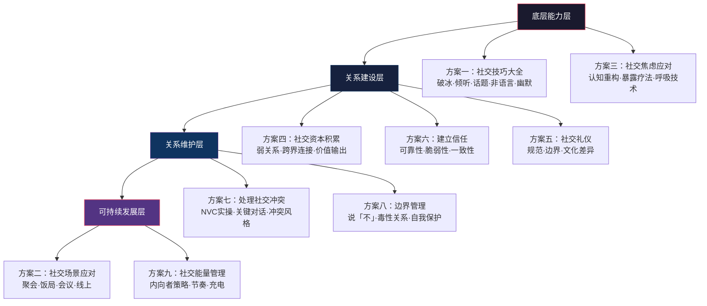
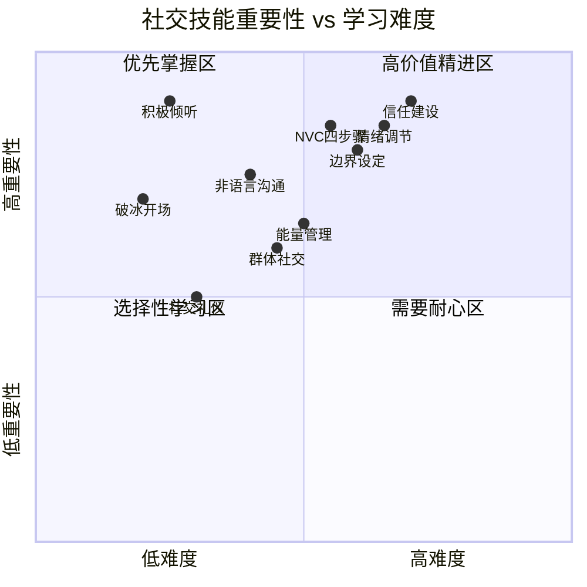
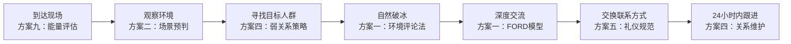
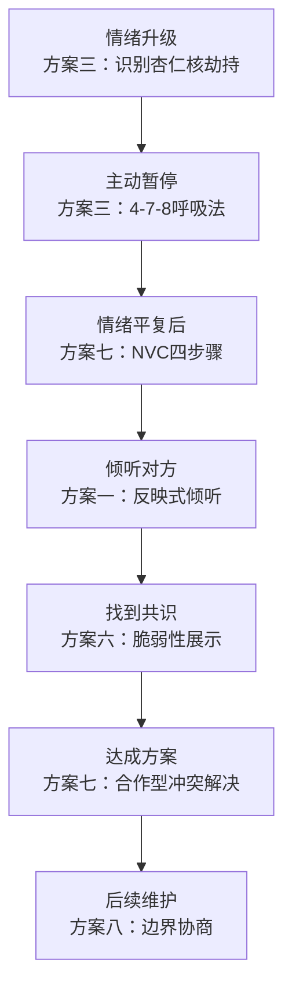

## 本节小结：九大方案的系统整合与行动框架

前面九个方案分别解决了社交中不同维度的实操问题——从破冰开场到能量管理，从建立信任到处理冲突。但真实社交场景不会按照教科书分类出牌：一场饭局可能同时需要破冰技巧、非语言沟通、社交礼仪和话题驾驭能力；一次职场冲突可能同时涉及边界管理、信任修复和情绪调节。

本节小结的核心目标不是重复九个方案的要点，而是帮你建立三个能力：

1. **整合力**——将分散的技能编织成流畅的社交行为链
2. **判断力**——在具体场景中快速识别问题本质，选择正确的方案组合
3. **内化力**——从"刻意使用技巧"到"自然而然地做好"

***

## 一、九个方案的内在逻辑关系

九个方案并非平行排列，它们之间存在清晰的依赖和递进关系。理解这个关系，才能在实际社交中正确地组合使用。

### 1.1 底层能力层：一切社交的地基

**方案一（社交技巧大全）** 和 **方案三（社交焦虑应对）** 构成了社交的底层操作系统。没有基础技巧，后续的关系建设和维护无从谈起；不解决焦虑，再好的技巧也用不出来。

这两个方案的协同关系是：

| 你的状态 | 先练 | 再练 | 原因 |
|---------|------|------|------|
| 不紧张但不会社交 | 方案一 | 方案二→四→六 | 你缺的是方法，补技巧就行 |
| 会社交但容易紧张 | 方案三 | 方案一→二→四 | 你有能力但被焦虑封印了 |
| 既紧张又不会 | 方案三（前半） | 方案一（基础模块） | 先降低阻力，再输入技能 |
| 不紧张也会社交 | 方案一（高级模块） | 方案四→六→八 | 你需要的是精进和系统化 |

### 1.2 关系建设层：从认识到了解

掌握基础技巧后，下一步是将"会社交"转化为"有关系"。三个方案分别解决不同维度：

- **方案四（社交资本积累）** 回答"和谁建立关系"——社交圈的系统性规划，弱关系的识别与维护，跨界连接的策略
- **方案六（建立信任）** 回答"关系如何深化"——从计算型信任到认同型信任的递进路径，信任方程式的四个维度
- **方案五（社交礼仪）** 回答"关系中的规范是什么"——礼仪不是束缚，而是降低社交摩擦的润滑剂

三者的执行顺序通常是：先积累（方案四）→ 建立过程中遵循礼仪（方案五）→ 逐步深化信任（方案六）。但在实际操作中，三者是同步进行的——你在维护弱关系的同时就需要遵守基本礼仪，初次互动中就可以通过可靠性展示来建立初始信任。

### 1.3 关系维护层：长期关系的挑战

关系建立容易维护难。两个方案应对的是关系生命周期中最常见的两类挑战：

- **方案七（处理社交冲突）** 解决"关系中的破坏性事件"——冲突不可避免，关键是如何处理
- **方案八（边界管理）** 解决"关系中的持续性消耗"——不是所有关系都值得维护，学会识别和止损

这两个方案有一个重要的共同前提：**冲突管理和边界管理都需要以信任为基础**。没有信任的冲突只会演变为对抗，没有信任的边界设定只会被视为敌意。因此，方案七和方案八的效力，很大程度上取决于你在方案六（建立信任）中打下的基础。

### 1.4 可持续发展层：长期社交的节奏

- **方案二（社交场景应对）** 解决"在不同场合怎么做"——场景化的综合应用
- **方案九（社交能量管理）** 解决"如何长期持续"——避免社交倦怠，找到可持续的节奏

这两个方案本质上是"元技能"——不是教你某个具体技巧，而是教你如何在真实生活中综合运用所有技巧，并保证这种运用可以持续。

***

## 二、核心技能矩阵：从方案到能力的映射

九个方案最终要转化为可衡量的能力。以下矩阵将每个方案的核心技能提取出来，并标注其在社交能力体系中的权重：

以下是每个方案中**必须掌握**的核心技能清单：

### 2.1 每个方案的第一优先级技能

| 方案 | 第一优先级技能 | 为什么排第一 | 掌握标志 |
|------|-------------|------------|---------|
| 一、社交技巧 | 积极倾听 | 所有后续技巧的前提，不会倾听的人无法真正连接 | 在对话中80%的时间能做到"专注倾听+反映式回应"，不急于给建议 |
| 二、场景应对 | 场景预判力 | 不同场景需要不同的行为策略，预判能力决定你是否"得体" | 进入任何社交场合前，能在30秒内识别场景类型并调取对应行为模式 |
| 三、焦虑应对 | 4-7-8呼吸法 | 最快速可用的焦虑调节工具，不依赖任何外部条件 | 在感到紧张的60秒内能将心率降低10-15次/分钟 |
| 四、资本积累 | 社交圈盘点 | 不知道自己有什么，就不知道需要什么 | 能画出自己当前社交网络的四同心圆地图，每层人数准确 |
| 五、社交礼仪 | 边界感知力 | 礼仪的本质是尊重他人边界，感知力是前提 | 能在互动中实时感知对方的舒适度变化，并相应调整行为 |
| 六、建立信任 | 可靠性建设 | 信任方程式中权重最高的因子，也是最可控的 | 过去一个月的承诺兑现率≥90% |
| 七、处理冲突 | "我"语言转换 | 从指责到表达，一个句式改变冲突走向 | 能在冲突发生时自动将"你总是…"转换为"我感到…当…因为…" |
| 八、边界管理 | 清晰地说"不" | 边界管理的核心动作，大多数人最缺的能力 | 能在不感到内疚、不攻击对方的前提下拒绝不合理请求 |
| 九、能量管理 | 社交-独处配比 | 可持续社交的基础，忽视这个必然导致倦怠 | 能清楚说出自己的社交节奏模式，并在日程中主动安排恢复时间 |

### 2.2 技能之间的乘法效应

单独掌握某个技能的效果有限，但技能组合会产生"乘法效应"：

| 技能组合 | 产生的效果 | 应用场景 |
|---------|----------|---------|
| 积极倾听 + NVC四步骤 | 既能深度理解对方，又能清晰表达自己 | 敏感话题对话、冲突调解 |
| 破冰开场 + 社交圈盘点 | 不仅能打开对话，还能有策略地拓展网络 | 行业活动、跨圈层社交 |
| 信任建设 + 边界设定 | 在建立亲密感的同时保持健康的距离感 | 亲密关系、长期合作关系 |
| 情绪调节 + "我"语言 | 在高情绪场景中既能管理自己，又能建设性地沟通 | 职场冲突、家庭矛盾 |
| 非语言沟通 + 场景预判 | 通过身体语言快速适配环境，展示社交智慧 | 高层饭局、重要会议、初次见家长 |

***

## 三、社交行为链：真实场景中的方案组合

真实社交不是按方案分类进行的。下面用四个典型场景，展示如何将多个方案串联为流畅的行为链。

### 3.1 场景一：行业峰会的社交晚宴

**行为链拆解：**

1. **到达现场**（方案九）——评估自己当前的能量状态。如果是内向者，提前规划"社交30分钟→休息10分钟"的节奏，找到洗手间或阳台等恢复点
2. **观察环境**（方案二）——判断这是"社交为主"还是"社交为辅"的场合。晚宴通常是社交为主，可以大胆主动
3. **寻找目标**（方案四）——不要随机社交。提前研究嘉宾名单（如果有的话），在现场寻找与你职业方向有交集的弱关系连接对象
4. **自然破冰**（方案一）——用环境评论法或共同体验法开场，避免"你是做什么的"这类功利性太强的开场白
5. **深度交流**（方案一）——用FORD模型（家庭/职业/休闲/梦想）探索共同话题，积极倾听，找到共鸣点
6. **交换联系方式**（方案五）——在自然的时机提出加微信，不要在对话刚开始就急着交换，也不要聊完了才想起来
7. **24小时跟进**（方案四）——发一条个性化的消息（提及你们聊过的具体话题），将"认识"升级为"连接"

### 3.2 场景二：与伴侣的一次争吵

**行为链拆解：**

1. **识别信号**（方案三）——当心跳加速、肌肉紧绷、思维变窄时，这是"杏仁核劫持"的信号。此刻说出的话大概率会伤人
2. **主动暂停**（方案三）——说"我现在情绪很激动，需要几分钟冷静一下，我一会儿回来继续聊"。注意：暂停不是逃避，是承诺回来。用4-7-8呼吸法快速调节
3. **用NVC表达**（方案七）——"我观察到…（客观事实），我感到…（情绪），因为我需要…（需求），你愿意…吗（具体请求）"
4. **倾听对方**（方案一）——用反映式倾听复述对方的观点和感受，确认你真正理解了。这一步本身就能显著降低对方的情绪强度
5. **展示脆弱**（方案六）——说出你真正的担心和恐惧，而不是继续攻击或防御。"我其实很害怕你觉得我不够好"比"你就是看不起我"有力量得多
6. **达成方案**（方案七）——用合作型冲突解决，寻找双方都能接受的方案。不是谁赢谁输，而是"我们如何一起解决这个问题"
7. **边界协商**（方案八）——如果争吵涉及边界问题（如个人空间、社交频率），借此机会明确双方的边界需求

### 3.3 场景三：入职新公司的第一周

| 时间节点 | 使用方案 | 具体行动 |
|---------|---------|---------|
| 第1天 | 方案一（破冰）+ 方案五（礼仪） | 主动自我介绍，记住同事名字，观察团队的沟通风格和非正式规则 |
| 第2-3天 | 方案四（资本盘点）+ 方案一（倾听） | 画出新团队的社交地图（谁和谁关系好，谁是信息枢纽），多听少说，了解团队文化和潜规则 |
| 第4-5天 | 方案六（信任初始建设）+ 方案八（边界设定） | 完成第一个小承诺（可靠性），明确表达你的工作习惯和底线（边界） |
| 第1-4周 | 方案二（场景适应）+ 方案九（能量管理） | 适应不同场景的行为规范（会议室 vs 茶水间 vs 饭局），管理好入职初期的社交消耗 |

### 3.4 场景四：维护一段正在疏远的友谊

| 阶段 | 使用方案 | 具体行动 |
|------|---------|---------|
| 诊断阶段 | 方案四（社交圈盘点） | 确认这段关系在你的社交圈中属于哪一层，疏远的原因是什么（物理距离？生活阶段差异？缺乏维护？） |
| 重新连接 | 方案一（破冰+话题） | 用共同记忆作为切入点（"我今天路过XX地方，突然想起我们以前…"），降低重新联系的尴尬感 |
| 深化互动 | 方案六（信任建设） | 用脆弱性展示重新建立情感连接（"我最近遇到了一些事情，想和你聊聊"），而不是停留在表面寒暄 |
| 建立节奏 | 方案四（维护频率）+ 方案九（能量管理） | 设定一个双方都能接受的联系频率，不要过度热情导致压力，也不要三天打鱼两天晒网 |

***

## 四、常见组合陷阱：方案之间的冲突与调和

在同时使用多个方案时，可能会遇到方案之间的"冲突"。以下是四个最常见的组合陷阱及其调和方法：

### 4.1 陷阱一：真诚 vs 技巧的张力

**表现**：方案一教你使用话术和结构化表达，但过度使用会让人感觉"油腻"、"不真诚"。

**调和原则**：技巧是骨架，真诚是血肉。使用技巧时始终问自己——"这句话是否真实地表达了我此刻的想法和感受？"如果答案是否，不要说。技巧的价值在于帮你更清晰地表达真实的自己，而不是替你编造一个不存在的自己。

**具体操作**：
- 破冰时用环境评论法（技巧），但评论的内容必须是你真正注意到的（真诚）
- 倾听时用反映式回应（技巧），但复述时加入你真正的理解和感受（真诚）
- 赞美时用具体化公式（技巧），但赞美的内容必须是你真正欣赏的点（真诚）

### 4.2 陷阱二：社交资本积累 vs 边界管理的冲突

**表现**：方案四建议你积极拓展社交网络、维护弱关系，方案八却告诉你需要设定边界、减少无效社交。到底该多社交还是少社交？

**调和原则**：两者并不矛盾。方案四的核心是"有策略地积累"，方案八的核心是"有底线地社交"。正确的做法是：在边界清晰的前提下进行社交资本的积累。

**具体操作**：
- 先用方案八的"社交能量审计"确定你能承受的社交总量
- 在总量范围内，用方案四的"社交圈地图"进行战略性分配
- 定期复盘：哪些社交是有效的资本积累？哪些是无谓的能量消耗？

### 4.3 陷阱三：建立信任 vs 处理冲突的矛盾

**表现**：方案六教你通过一致性、可靠性来建设信任，方案七却教你如何处理冲突。冲突会不会破坏信任？

**调和原则**：戈特曼的研究明确表明——健康的关系不是没有冲突的关系，而是能够建设性地处理冲突的关系。回避冲突（冷战）反而是信任的最大杀手之一。建设性地处理冲突实际上能**增强**信任，因为它向对方证明了"即使在困难的时刻，你也会诚实、尊重地对待这段关系"。

**具体操作**：
- 冲突中保持尊重和诚实（一致性→信任）
- 冲突后主动修复（可靠性→信任）
- 在冲突中展示脆弱性（"我其实很害怕失去你"→亲近感→信任）

### 4.4 陷阱四：能量管理 vs 社交场景应对的冲突

**表现**：方案九告诉你需要在社交后安排恢复时间，方案二却告诉你各种社交场景都需要积极参与。当你的社交日程已经很满时，该怎么办？

**调和原则**：能量管理不是"少社交"，而是"聪明地社交"。真正的解决方案不是减少社交，而是提高社交效率——用更少的能量获得更大的社交收益。

**具体操作**：
- 选择自己精力最好的时段进行最重要的社交
- 提前准备（场景预判+话题储备），减少即兴发挥带来的能量消耗
- 在社交过程中穿插"微休息"（去洗手间、走到窗边透气、找一个安静角落）
- 学会"社交降档"——不是所有社交都需要100%投入，有些场合60%的参与度就够了

***

## 五、进阶整合框架：社交能力成熟度模型

当你对九个方案都有了基本掌握后，可以用以下成熟度模型来评估自己的综合社交能力水平：

| 等级 | 名称 | 特征 | 典型表现 | 下一步 |
|------|------|------|---------|-------|
| L1 | 无意识无能力 | 不知道自己不会什么 | 社交中经常碰壁但不知道原因，或用"我不擅长社交"自我安慰 | 系统学习九个方案，从方案三（焦虑应对）或方案一（基础技巧）开始 |
| L2 | 有意识无能力 | 知道自己不会什么，但还做不到 | 学了NVC但在冲突中还是会本能地指责对方，知道该倾听但总是忍不住打断 | 选择最影响你的1-2个方案，进入刻意练习阶段，每天记录练习情况 |
| L3 | 有意识有能力 | 能做到但需要刻意提醒自己 | 在社交中会主动提醒自己"现在该用积极倾听了"，"注意非语言信号"，但反应还有延迟 | 增加练习场景的复杂度，在压力环境下练习，在真实高风险场景中使用 |
| L4 | 无意识有能力 | 自然而然地做好 | 倾听、共情、表达、边界管理已经内化为本能反应，不需要刻意想起就能执行 | 开始教授他人（教是最好的学），挑战更高难度的场景（如公开演讲、跨文化社交） |
| L5 | 精通 | 能灵活创造和适配 | 不再依赖固定框架，能根据具体情境创造最合适的社交策略，还能帮助他人提升社交能力 | 持续精进，探索社交的更高维度（如领导力、影响力、跨文化沟通） |

**如何判断自己处于哪个等级？**

最有效的自评方法是"社交后复盘"：

1. **L1标志**——复盘时想不出具体哪个环节可以改进，只觉得"整体不太好"
2. **L2标志**——复盘时能清楚地指出"这里我应该用XX技巧"，但当时没做到
3. **L3标志**——复盘时发现自己在大部分场景中都做到了，但有1-2个时刻"没忍住"
4. **L4标志**——复盘时发现自己自然而然地做了正确的事，只有极少数场景需要反思
5. **L5标志**——复盘的重点不再是"我做得对不对"，而是"对方的体验好不好"

***

## 六、社交能力提升的分阶段行动清单

以下行动清单按照九个方案的内在逻辑关系重新组织，按时间维度分为三个阶段。每个阶段的行动都是在前一阶段基础上的自然延伸。

### 6.1 第一阶段：打地基（第1-4周）

这一阶段的目标是建立社交的基本能力和信心。

| 周次 | 行动项 | 对应方案 | 每日投入 | 验证标准 |
|------|-------|---------|---------|---------|
| 第1周 | 学习积极倾听，每天选择一个对话场景刻意练习"全神贯注倾听" | 方案一 | 15分钟 | 能在对话中做到放下手机、保持眼神接触、不打断、停顿2-3秒再回应 |
| 第1周 | 学习4-7-8呼吸法，每天练习3次（早晚+任何焦虑时刻） | 方案三 | 5分钟 | 能在60秒内将焦虑感从8分降到5分以下（10分制） |
| 第2周 | 学习NVC四步骤，每天选择一个日常互动用"观察→感受→需要→请求"表达 | 方案七 | 10分钟 | 能在非冲突场景中流畅使用NVC四步骤 |
| 第2周 | 绘制社交圈地图，盘点你的四层社交关系 | 方案四 | 30分钟（一次性） | 能清楚画出核心圈（≤5人）、亲密圈（≤15人）、朋友圈（≤50人）的具体人选 |
| 第3周 | 学习破冰五策略，在真实社交中练习 | 方案一 | 每次社交时 | 能在30秒内用环境评论法或共同体验法自然开场 |
| 第3周 | 学习社交礼仪基本规范，在日常互动中刻意注意 | 方案五 | 随时 | 能在不同场景中做出得体的礼仪行为 |
| 第4周 | 进行一次社交后复盘，评估自己在L1-L5中的位置 | 所有方案 | 30分钟 | 写出一份包含3个以上具体观察的社交复盘记录 |

### 6.2 第二阶段：建框架（第5-12周）

这一阶段的目标是将基础技能组合为实用的行为框架。

| 周次 | 行动项 | 对应方案 | 每日投入 | 验证标准 |
|------|-------|---------|---------|---------|
| 第5-6周 | 学习信任方程式的四个维度，每天评估自己在一个关系中的信任得分 | 方案六 | 10分钟 | 能对3段以上的重要关系进行信任四维度分析 |
| 第5-6周 | 学习说"不"的三种话术，在需要时使用 | 方案八 | 随时 | 成功完成3次以上不含攻击性、不引发内疚的拒绝 |
| 第7-8周 | 学习场景预判力，为即将到来的社交场合做"场景清单"准备 | 方案二 | 每次社交前15分钟 | 能在进入场合前识别场景类型，并准备3个以上应对策略 |
| 第7-8周 | 建立社交-独处配比的意识，记录一周的社交能量日志 | 方案九 | 10分钟 | 能清楚说出自己的社交能量模式（内向/外向/中间型）和恢复方式 |
| 第9-10周 | 综合练习：在一次完整的社交活动中串联使用3个以上方案 | 全部 | 每次社交 | 一次社交中自然地使用了破冰→倾听→话题→跟进的完整链路 |
| 第11-12周 | 进行第二轮社交复盘，评估自己在L1-L5中的位置变化 | 所有方案 | 30分钟 | 写出包含对比分析的复盘记录，明确看到进步和仍需改进之处 |

### 6.3 第三阶段：内化精进（第13周起，持续）

这一阶段的目标是从"刻意使用"走向"自然而然"。

- **每周**：选择一个场景，将你最不熟练的方案作为本周练习重点
- **每两周**：进行一次社交复盘，记录"做到了"和"没做到"的具体时刻
- **每月**：审视社交圈地图，检查各层关系的活跃度和满意度
- **每季度**：重新做一次社交健康度自评，与上一次对比
- **持续**：阅读推荐书籍，深化理论理解；观察社交高手的行为模式，提取可学习的元素

***

## 七、三种常见社交人格的定制方案

不同社交风格的人，对九个方案的需求程度和使用方式不同。以下是三种典型社交人格的定制化学习路径。

### 7.1 安全型社交者

**特征**：社交中总体自在，能自然地表达需求和感受，对亲密关系感到舒适。

**优势**：方案六（信任建设）和方案七（冲突处理）通常不需要太多额外训练。

**重点提升**：
- 方案四（社交资本积累）——你的舒适圈可能限制了你的社交网络宽度
- 方案九（能量管理）——注意不要因为社交能力好就过度社交，导致倦怠
- 方案一（高级技巧）——群体社交中的领导力、讲故事能力等进阶技能

### 7.2 焦虑型社交者

**特征**：在社交中容易紧张，担心被评价，倾向于过度准备和事后反刍。

**重点提升**（按优先级）：
1. 方案三（社交焦虑应对）——这是你的第一优先级。认知重构+暴露疗法+呼吸技术三管齐下
2. 方案一（基础技巧）——焦虑往往是因为"不知道该怎么做"，掌握具体技巧能显著降低不确定性带来的焦虑
3. 方案八（边界管理）——焦虑型社交者容易过度讨好，学会说"不"能减少社交中的被剥削感
4. 方案六（信任建设）——学会信任他人不会因为你的一个小失误就否定你

**避坑提醒**：不要一上来就强迫自己参加大型社交活动。按照方案三的"焦虑阶梯"，从最小的挑战开始，逐步升级。

### 7.3 回避型社交者

**特征**：不太依赖社交，倾向于独处，对亲密关系感到不适，可能用"我就是喜欢一个人"来回避社交困难。

**重点提升**（按优先级）：
1. 方案一（深度倾听+自我表露）——回避型的核心挑战不是"不会社交"而是"不愿意深入"
2. 方案六（信任建设）——学习信任不是失去控制，而是一种力量
3. 方案四（社交资本积累）——即使你享受独处，也至少需要维护少数几段高质量关系
4. 方案九（能量管理）——找到适合你的社交频率和方式，不强迫自己变成外向者

**避坑提醒**：回避型的人容易跳过方案三（焦虑应对），因为"我不焦虑，我只是不想社交"。但有时候"不想"的背后是"曾经受过伤的不信任"，这需要方案六中的信任修复来解决。

***

## 八、关键认知：从本节小结中带走的五句话

如果这一整节的内容只能浓缩为五句话，那就是：

1. **技能组合大于单一技能**——社交的真正力量不在于你会多少个技巧，而在于你能在真实场景中自然地组合使用它们
2. **底层能力决定上层表现**——倾听能力和情绪调节能力是社交的"操作系统"，操作系统不升级，应用层再怎么优化都有限
3. **社交能力的提升是螺旋式的**——不是"学完就学会了"，而是"学→练→复盘→调整→再练"的不断循环。从L1到L4，大多数人需要6-12个月的持续练习
4. **没有适合所有人的社交模板**——内向者和外向者、安全型和焦虑型、学生和职场人，需要的方案组合和练习节奏都不同。找到适合自己的路径比照搬别人的路径重要得多
5. **社交的终极目标不是技巧而是连接**——所有技巧的终点，是让你能够更真实、更自在地与他人建立有意义的关系。如果某个技巧让你感到更"假"而不是更"好"，果断放弃它

***

> **下一步行动建议：** 回到本章的"章节概览"，对照你最初做的"社交健康度自评"得分，选择你的薄弱维度对应的方案，从第一阶段的行动清单开始执行。不要试图一次性掌握所有方案——选择1-2个最紧迫的，花4周时间打好基础，然后再扩展。记住：养成新习惯平均需要66天，给自己足够的时间和耐心。
