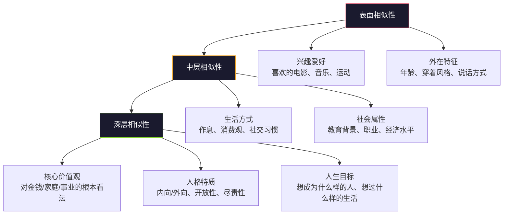
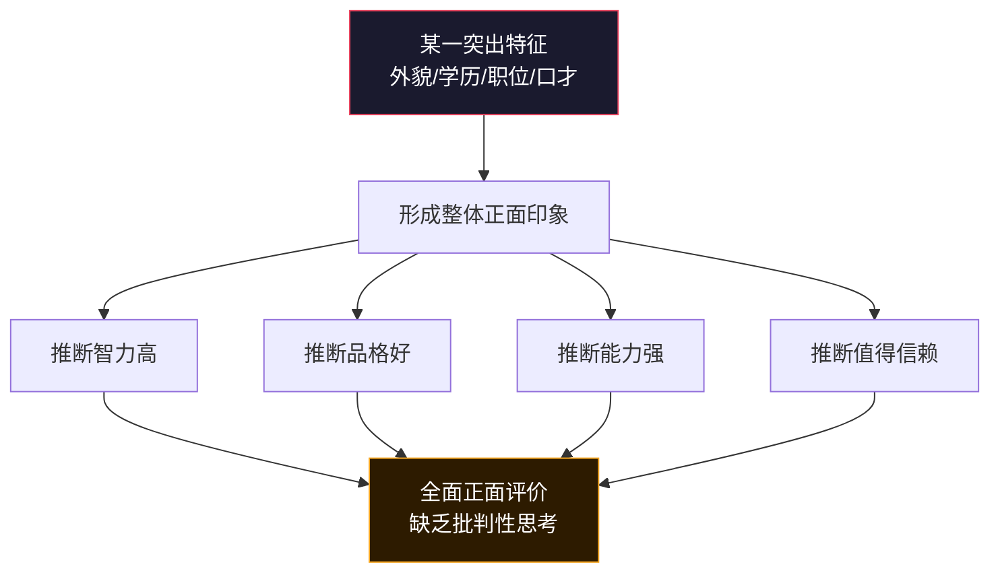
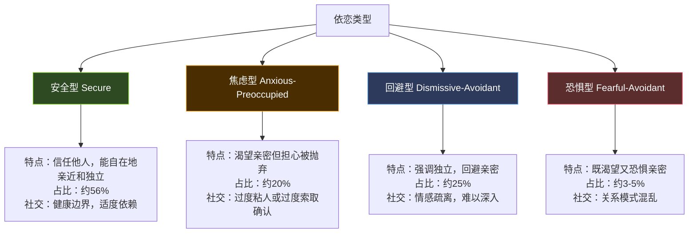
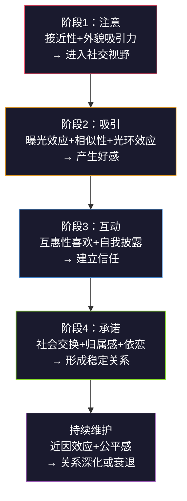

## 一、社交心理学

社交不是玄学，而是一门有严谨理论支撑的科学。理解社交背后的心理学机制，能让你从"凭感觉社交"进化到"有策略地建立关系"。本章系统梳理社交心理学的核心理论，从人际吸引的起点，到关系发展的动态过程，再到常见的认知陷阱，帮你建立完整的社交认知框架。

### 1.1 人际吸引的心理学

人际吸引是所有社交关系的起点——你首先得让对方"愿意靠近你"，后续的一切才有可能。心理学研究揭示了影响人际吸引的五大核心因素，它们共同构成了一个从"注意到你"到"喜欢你"的完整链条。


#### 1.1.1 接近性效应（Proximity Effect）

我们更容易与物理距离接近的人建立关系。这不仅是因为接近性增加了接触的机会，还因为反复接触会产生"曝光效应"（Mere Exposure Effect）——仅仅因为频繁看到某个人，我们就会对其产生更积极的感觉。

**经典研究**：费斯廷格（Festinger）等人在1950年对MIT西门楼（Westgate）学生宿舍的研究发现，住得越近的学生越容易成为朋友。住在同一层但距离稍远的邻居，成为朋友的概率显著低于隔壁邻居。更惊人的是，住在楼梯口附近的人拥有更多朋友——因为所有人都必须经过那里。

**曝光效应的边界条件**：

曝光效应并非无条件生效。扎荣茨（Zajonc）在1968年的系统研究表明：

- **初始态度中性或正面时**，重复曝光会增加好感
- **初始态度已经负面时**，重复曝光反而会强化厌恶（所以不讨好的人频繁出现只会更烦人）
- **曝光频率有上限**——过多重复会导致厌倦（倒U型曲线）
- **最佳曝光次数**：研究发现大约10-20次曝光效果最好，之后开始衰减

**实操指南**：

| 策略 | 具体做法 | 原理 |
|------|----------|------|
| 固定出现 | 选择固定的咖啡馆、健身房、图书馆，成为"常客" | 利用接近性+曝光效应 |
| 嵌入社交圈 | 加入定期聚会的社团、兴趣小组、读书会 | 接近性+共同活动 |
| 物理布局 | 办公室中坐在人流量大的位置 | 接近性+被动曝光 |
| 线上曝光 | 在朋友圈/社群中保持稳定的活跃频率（每天1-2条有质量的内容） | 数字环境中的曝光效应 |
| 避免过度 | 不要一天发10条朋友圈，不要每天主动找同一个人聊天 | 避免厌倦效应 |

#### 1.1.2 相似性吸引（Similarity Attraction）

"物以类聚"不仅是一句俗语，更是被大量实证研究验证的心理规律。伯恩（Byrne）的相似性-吸引范式实验发现，参与者对与自己态度相似的陌生人的好感度显著高于态度不同的陌生人，即使相似性是被操控的假信息。这说明相似性对吸引的影响几乎是自动化的、非理性的。

**相似性的层次结构**：



**关键发现**：

- **短期关系**中，表面相似性（兴趣、爱好）影响更大
- **长期关系**中，深层相似性（价值观、人格）是决定性因素
- **态度相似性**的影响比人口统计学特征（年龄、性别）更强
- 相似性的作用存在"阈值效应"——在某些核心价值观上的差异可能导致关系无法建立，无论其他方面多么相似

**"互补性吸引"的真相**：

很多人相信"互补性吸引"——性格相反的人会互相吸引。但研究证据表明：

- 互补性仅在**特定领域**起作用，如支配-顺从维度（一个强势的人可能和一个温和的人相处融洽）
- 在**绝大多数维度**上，相似性的预测力远强于互补性
- 所谓的"互补性吸引"往往是**表面互补、深层相似**——一个外向的人和一个内向的人在一起，可能是因为他们都重视"生活的丰富性"

**实操指南**：

- **发掘共同点**：在初次交流时，主动寻找共同话题、共同经历、共同认识的人。每一次发现相似之处，都是在给关系"加分"
- **展示相似性**：适度表达你与对方的共同点（"我也是这样想的"），但不要虚假迎合
- **管理差异**：在核心价值观上的差异是关系的"硬伤"，不要试图改变对方；在非核心领域的差异可以成为互补的资源
- **制造共同经历**：一起做一件事（运动、学习、旅行）本身就是创造"相似性"的过程

#### 1.1.3 互惠性喜欢（Reciprocity of Liking）

当我们知道某个人喜欢我们时，我们更有可能也喜欢他们。这种"互惠性喜欢"是社交中一个强大但常被低估的力量。

**经典研究**：柯利（Curtis）和米勒（Miller）在1986年的研究中设计了一个精巧的实验。参与者被告知对方（实际上是实验助手）对自己有好感或没有好感。结果发现：

- 被告知对方喜欢自己的参与者，表现得**更温暖、更开放、更真诚**
- 这些行为反过来**真的让对方更喜欢他们**
- 被告知对方不喜欢自己的参与者，则表现得**更冷淡、更防备**
- 这验证了一个正向（或负向）循环的存在

**互惠性喜欢的心理机制**：

1. **安全感**：知道对方喜欢自己，降低了被拒绝的风险，让我们更敢于展现真实的自我
2. **自我实现预言**：因为我们预期对方会喜欢我们，我们的行为变得更讨喜，结果对方真的喜欢我们
3. **感恩心理**：被人欣赏是一种正面体验，我们会对给予我们这种体验的人产生好感
4. **自尊确认**：对方的喜欢确认了我们的价值，我们倾向于回报这种确认

**实操指南**：

- **主动表达欣赏**：真诚地赞美对方的优点——不是虚伪的奉承，而是你真实观察到的正面特质
- **给予正面反馈**：当对方做了你欣赏的事情，及时表达你的认可
- **展示兴趣**：记住对方说过的细节，在后续交流中提起——这传递出"我在意你"的信号
- **避免过早否定**：即使对某人第一印象一般，也不要表现出排斥——互惠性喜欢需要"启动时间"
- **真诚是前提**：虚假的喜欢比不喜欢更糟糕——人对不真诚的信号非常敏感

#### 1.1.4 外貌吸引力的真相

不可否认，外貌吸引力在人际吸引中扮演着重要角色。但"美"的运作机制比大多数人想象的要复杂得多。

**关键研究**：

沃尔斯特（Walster）等人1966年的"计算机舞会"实验（Computer Dance Experiment）发现，在初次见面时，外貌吸引力是预测是否愿意再次约会的最强因素。但后续研究揭示了更深层的机制：

**"美"是主观的吗？——既有普遍性也有个体差异**：

| 维度 | 说明 | 研究证据 |
|------|------|----------|
| 面部对称性 | 跨文化一致认为对称的面孔更有吸引力 | Langlois et al., 1994 |
| 平均化面孔 | 接近群体平均值的面孔被评为更有吸引力 | Galton, 1878; Langlois & Roggman, 1990 |
| 第二性征 | 男性化/女性化特征在不同情境下有不同吸引力 | Penton-Voak et al., 1999 |
| 体态 | 腰臀比（女性0.7、男性0.9）跨文化被认为有吸引力 | Singh, 1993 |
| 个体偏好 | 基于个人经历、文化背景、当前关系状态的差异 | 大量研究 |

**外貌吸引力的动态效应**：

外貌不是静态的标签，而是在关系发展中不断被重新评估的：

- **光环效应**：长得好看的人被认为更聪明、更善良、更有能力（即使事实并非如此）
- **"情人眼里出西施"效应**：随着关系深入、感情加深，我们会觉得对方越来越好看
- **内在品质的外化**：当我们了解到一个人善良、幽默、自信后，我们会觉得他的外貌也变得更有吸引力（Dion et al., 1972）
- **"熟悉即美"效应**：长时间相处后，我们对对方面孔的审美评价会上升

**实操指南**：

- **管理第一印象**：在初次见面的场合（面试、约会、商务社交），着装和仪容的投资回报率是最高的
- **不要过度焦虑外貌**：聚光灯效应告诉我们，别人远没有我们想象的那么在意我们的外表
- **用内在提升外在**：培养自信、幽默、善良等内在品质，它们会实质性地提升你的外貌吸引力评分
- **保持整洁得体**：研究发现，整洁和得体比先天外貌更重要——干净的衣物、合适的发型、良好的体态

#### 1.1.5 光环效应与第一印象管理

光环效应（Halo Effect）是指当我们对一个人在某个方面有积极的印象时，这种积极印象会"扩散"到对其其他方面的评价。心理学家桑代克（Thorndike）在1920年首次提出这一概念。

**光环效应的运作机制**：



**光环效应的常见触发因素**：

- **外貌光环**：好看→聪明、善良、能干（最强的光环效应来源）
- **学历光环**：名校毕业→一定很厉害
- **职位光环**：高管/大厂员工→一定很有能力
- **口才光环**：说话好听→一定很靠谱
- **财富光环**：有钱→一定很聪明、很努力

**逆向应用——第一印象管理策略**：

1. **找到你的"王牌特质"**：每个人都有一个或几个突出优势（知识渊博、幽默风趣、外貌出众、成就突出）。在社交初期刻意展现这个优势，让光环效应启动
2. **前5分钟策略**：研究表明，第一印象在最初的2-5分钟内形成。将你最好的状态集中在社交开始的几分钟
3. **"峰值体验"策略**：丹尼尔·卡尼曼的"峰终定律"表明，人们对一段经历的记忆主要由"最高峰"和"结尾"决定。在社交中创造一个让你印象深刻的高峰时刻

### 1.2 关系发展的心理学模型

了解了人际吸引的基础之后，下一个问题是：关系如何从"认识"发展到"熟悉"再到"亲密"？心理学家提出了几个经典的关系发展模型。

#### 1.2.1 社会渗透理论（Social Penetration Theory）

阿尔特曼（Altman）和泰勒（Taylor）在1973年提出，人际关系的发展就像剥洋葱——从表层的浅层信息逐渐深入到核心的深层信息。


**自我的两个维度**：

- **广度（Breadth）**：你们讨论的话题范围有多广
- **深度（Depth）**：你们在每个话题上聊到多深

关系的发展就是广度和深度同时扩展的过程。

**自我披露的互惠性原则**：

关系发展最关键的行为机制是**自我披露的对等互惠**——我告诉你一些关于我的信息，你也告诉我相应程度的信息。这个过程像打乒乓球：

- **适度匹配**：对方分享什么层次的信息，你也分享同层次的信息
- **过快深入**：初次见面就分享深层秘密会让对方感到不适（"社交负担"）
- **过慢推进**：总停留在浅层话题，关系无法深入
- **自我披露的螺旋**：一方稍微深入一点→另一方也稍微深入一点→关系向前推进

**实操技巧**：

| 阶段 | 适度的自我披露 | 过度的自我披露 |
|------|--------------|--------------|
| 初次见面 | "我是做软件开发的，平时喜欢跑步" | "我刚被前女友甩了，现在很痛苦" |
| 熟悉阶段 | "最近在纠结要不要换工作，压力挺大的" | "我觉得自己一无是处，经常想放弃" |
| 朋友阶段 | "我小时候家庭条件不好，这对我影响挺大的" | （在这个阶段，分享个人故事是正常的） |

**判断时机的信号**：

- 对方主动分享个人话题 → 你可以匹配性地分享
- 对方总是回避深入话题 → 暂时保持在当前深度
- 对方问你个人问题 → 对方在试探是否可以深入
- 对方开始使用更亲昵的称呼 → 关系正在升温

#### 1.2.2 社会交换理论（Social Exchange Theory）

蒂博特（Thibaut）和凯利（Kelley）在1959年提出，人际关系本质上是一种社会交换——我们与他人互动时，会无意识地计算"成本"和"收益"。

**关系的经济学模型**：

关系满意度 = 感知收益 - 感知成本
关系稳定性 = 当前关系满意度 - 替代关系的预期满意度（比较水平CLalt）

**关系中的"收益"和"成本"**：

| 收益（Rewards） | 成本（Costs） |
|-----------------|--------------|
| 情感支持（被理解、被关心） | 时间投入 |
| 社交资源（人脉、信息） | 情感消耗（争吵、焦虑） |
| 物质帮助（实际支持） | 自由受限（需要妥协） |
| 身份认同（被认可、有面子） | 机会成本（放弃了其他关系） |
| 快乐体验（一起玩、聊天） | 金钱支出 |
| 安全感（有人兜底） | 心理负担（需要维护） |

**比较水平（Comparison Level, CL）**：我们对关系收益的"期望值"，受过往关系经历影响。如果一个人过去的关系质量很高，他的CL就高，对新关系的要求也更高。

**替代比较水平（Comparison Level for Alternatives, CLalt）**：我们对"如果离开这段关系，我能找到更好的吗"的评估。当CLalt > 当前满意度时，人们倾向于离开关系。

**社会交换理论的实操启示**：

1. **提高自己的"价值"**：成为对别人有用的人——无论是情感价值、信息价值还是资源价值
2. **降低关系中的"成本"**：做一个让人相处舒服的人——靠谱、不制造麻烦、情绪稳定
3. **创造"超额价值"**：偶尔给对方超出预期的惊喜，打破成本-收益的平衡，产生"感恩效应"
4. **不要过度算计**：社会交换是无意识的过程，过度计较得失会让人觉得你"太功利"
5. **关注"公平感"**：研究表明，关系中的公平感（双方付出大致对等）比绝对收益更重要

#### 1.2.3 依恋理论（Attachment Theory）

鲍尔比（Bowlby）在1960年代提出依恋理论，安斯沃思（Ainsworth）通过"陌生情境"实验将其细化。成人的依恋类型深刻影响着我们的社交模式。

**四种依恋类型**：



**依恋类型如何影响社交行为**：

| 维度 | 安全型 | 焦虑型 | 回避型 | 恐惧型 |
|------|--------|--------|--------|--------|
| 对亲密的态度 | 舒适 | 渴望但焦虑 | 回避 | 矛盾 |
| 冲突处理 | 直接沟通 | 情绪化、指责 | 退缩、冷战 | 混乱 |
| 信任建立 | 较快 | 需要反复确认 | 慢且有限 | 极慢 |
| 社交网络 | 广泛而稳定 | 核心圈小但依赖深 | 广但浅 | 不稳定 |
| 被拒绝时 | 失落但能恢复 | 极度痛苦、反刍 | 假装不在意 | 崩溃或攻击 |

**依恋类型不是终身标签**：

依恋类型虽然在童年形成，但可以通过以下方式改变：

- **安全型伴侣/朋友的"修正性体验"**：与安全型的人建立关系，体验稳定的回应模式
- **心理咨询**：特别是以关系为核心的心理治疗
- **自我觉察**：识别自己的依恋模式，在冲动行为前按下"暂停键"
- **刻意练习**：焦虑型练习独处、练习不立即寻求确认；回避型练习表达需求、练习适度依赖

**实操指南**：

- **识别自己的依恋类型**：反思你在关系中的典型模式，可以使用ECR（亲密关系体验量表）自测
- **识别他人的依恋类型**：观察对方在亲密关系中的反应模式，调整你的互动策略
- **与焦虑型相处**：给予稳定的回应、主动报平安、避免突然消失
- **与回避型相处**：给予空间、不要强迫亲密、通过行动而非言语建立信任
- **培养安全型特质**：学习直接表达需求、管理焦虑情绪、建立健康的边界

### 1.3 社会认同与群体心理

人是社会性动物，我们的自我概念很大程度上来源于我们所属的群体。理解群体心理，是理解社交行为的关键。

#### 1.3.1 社会认同理论（Social Identity Theory）

亨利·泰弗尔（Henri Tajfel）在1970年代提出的社会认同理论指出，我们的自我概念由两部分组成：个人认同（我是谁）和社会认同（我属于哪个群体）。我们倾向于将人分为"内群体"（我们）和"外群体"（他们），并对内群体成员表现出更多的偏好和信任。

**泰弗尔的"最简群体范式"实验**：

这个经典实验的操作极其简单——按参与者对两幅画的偏好随机分组（实际上偏好是随机指定的）。结果发现，即使分组完全是随机的、毫无意义的，人们也会：

- 给内群体成员分配更多的资源
- 对内群体成员的评价更正面
- 偏向于最大化内群体与外群体之间的差距（即使这意味着自己得到的更少）

这说明群体认同是人类的一种**基本心理倾向**，不需要任何理性基础。

**内群体偏好的社交应用**：

| 快速建立"内群体"的方法 | 具体做法 |
|----------------------|----------|
| 地域认同 | "我也是XX地方的"、"我们那的人都…" |
| 学校认同 | "你也是XX学校毕业的？"、"校友啊" |
| 行业认同 | "我们做XX的都理解这种痛苦" |
| 共同经历 | "你也经历过XX？"、"那天你也在场？" |
| 共同敌人 | "我们都受不了XX（某个共同的不满）" |
| 兴趣认同 | "你也喜欢XX？太巧了" |
| 价值观认同 | "我觉得你说到点子上了，我也是这么想的" |

#### 1.3.2 归属感需求（Need to Belong）

鲍迈斯特（Baumeister）和利里（Leary）在1995年的经典论文中指出，人类有一种根本的、广泛的归属需求——需要与他人建立和维持至少一定数量的持久、积极的人际关系。这种需求不是后天学习的，而是进化而来的——在人类历史的大部分时间里，被群体排斥等于死亡。

**归属感的核心特征**：

1. **非有即无**：归属感不是一个可以完全满足的欲望（如饥饿），而是一种持续存在的需求
2. **最低阈值**：人们需要至少一个（最好3-5个）稳定的、积极的社交关系
3. **双向互动**：归属感需要互动——单纯观看别人的社交活动（如刷社交媒体）不能满足归属需求
4. **稳定性要求**：归属感需要关系的稳定性——频繁更换社交圈不如维持少数几段深厚关系

**归属感缺失的代价**：

社交孤立对健康的危害相当于每天吸15支烟（Holt-Lunstad et al., 2010）。具体影响包括：

- **心理健康**：焦虑、抑郁、自尊降低的风险显著增加
- **认知功能**：长期社交孤立者的认知衰退速度更快
- **免疫系统**：孤独感与慢性炎症、免疫功能下降相关
- **寿命影响**：社交孤立是与吸烟、肥胖同等重要的早亡风险因素

**实操——如何满足归属需求**：

1. **质量优先于数量**：3-5段深度关系比50个微信好友更能满足归属需求
2. **定期维护**：每周至少与亲近的人有1-2次有质量的互动（不是刷朋友圈）
3. **参与群体活动**：加入一个你认同的社区/组织，获得群体归属感
4. **帮助他人**：利他行为是建立归属感最有效的方式之一
5. **减少被动社交**：刷社交媒体≠社交，主动发起对话才能满足归属需求

#### 1.3.3 社会比较与自我评估

费斯廷格在1954年提出社会比较理论：人们有评估自己能力和观点的基本需求，当缺乏客观标准时，会通过与他人比较来评估自己。这种比较无处不在，深刻影响着我们的社交行为和心理状态。

**两种社会比较的方向**：

```mermaid
graph LR
    A[社会比较] --> B[上行比较<br>与比自己强的人比]
    A --> C[下行比较<br>与不如自己的人比]
    B --> B1[正面效果：激发动力<br>"他能做到，我也能"]
    B --> B2[负面效果：自卑焦虑<br>"我永远比不上他"]
    C --> C1[正面效果：感恩满足<br>"我其实还不错"]
    C --> C2[负面效果：自满懈怠<br>"至少我比他强"]
    style A fill:#1a1a2e,stroke:#e94560,color:#fff
    style B1 fill:#2d4a22,stroke:#7ed321,color:#fff
    style B2 fill:#5c2d2d,stroke:#e94560,color:#fff
    style C1 fill:#2d4a22,stroke:#7ed321,color:#fff
    style C2 fill:#5c2d2d,stroke:#e94560,color:#fff
```

**社交媒体时代的社会比较陷阱**：

社交媒体将上行比较的频率和强度放大到了前所未有的程度。我们看到的永远是别人精心策划的"高光时刻"——升职加薪、旅行度假、幸福合影。这导致：

- **不对称比较**：我们用自己生活的全部（包括平淡和低谷）去对比别人生活的精华
- **比较范围膨胀**：过去我们只和身边的人比，现在我们和全世界的精英比
- **比较频率激增**：过去一天遇到几个同龄人，现在一分钟可以刷到几十个
- **可量化指标**：点赞数、粉丝数、收入数字让比较变得更直接、更残酷

**应对策略**：

1. **与过去的自己比**：最有价值的比较对象是你自己——你比一年前的自己进步了吗？
2. **限制社交媒体使用时间**：每天30分钟以内的有意识浏览，比无限制刷屏健康得多
3. **主动选择比较对象**：选择与你水平相近但略高的人作为上行比较对象，避免"跨越式比较"
4. **区分"欣赏"和"比较"**：看到别人的成就，可以选择欣赏（"真厉害"）而不是比较（"我不如他"）
5. **培养内在评价标准**：建立自己的价值判断体系，而不是完全依赖外部参照

### 1.4 社交认知偏差

我们的社交判断并不是理性的，而是受到大量认知偏差的影响。了解这些偏差不是为了消除它们（这几乎不可能），而是在关键时刻能够识别并修正。

#### 1.4.1 首因效应与近因效应

**首因效应（Primacy Effect）**：最先接收到的信息对整体印象的形成具有最大的影响力。

首因效应的心理机制：

- **注意力递减**：人们对后续信息的关注度逐渐降低
- **解释框架**：最初的信息形成了一个"认知图式"，后续信息会被纳入这个框架中理解
- **一致性需求**：人们倾向于保持印象的一致性，会主动寻找支持初始印象的证据（确认偏差的协同作用）

**近因效应（Recency Effect）**：最近接收到的信息对记忆和判断有更大的影响力。

近因效应在以下条件下更强：

- 两次信息之间有较长的时间间隔
- 信息量过大，早期信息被"挤出"工作记忆
- 人们在做出判断时更多依赖短期记忆（如即时评价场景）

**两种效应的博弈**：

| 条件 | 首因效应更强 | 近因效应更强 |
|------|-------------|-------------|
| 时间维度 | 信息连续呈现时 | 信息之间有间隔时 |
| 关系阶段 | 初次见面（"先入为主"） | 熟人之间（"最近表现"） |
| 记忆因素 | 短期记忆充裕时 | 记忆负担大时 |
| 判断类型 | 整体印象评价 | 对近期行为的评价 |

**实操应用**：

- **首因效应**：在任何重要社交场合（面试、约会、新同事见面），精心准备开头5分钟——着装、问候、第一个话题
- **近因效应**：在一段关系中，最近的一次互动往往决定了对方当下的态度。想要修复关系，最近的一次积极互动比100次过往的美好回忆更有效
- **首因+近因的组合策略**：在演讲、会议、社交聚会中，开头和结尾是影响力最大的两个节点——用最强的内容开场，用最有感染力的内容收尾

#### 1.4.2 基本归因错误（Fundamental Attribution Error）

我们在解释他人行为时，倾向于过度强调性格因素，而低估情境因素。这是最普遍、最顽固的社交认知偏差之一。

**经典案例**：

- 某人迟到了 → 你的直觉反应："他不守时、不尊重人"（性格归因）
- 你迟到了 → 你的自我解释："路上堵车了"（情境归因）

**基本归因错误的深层机制**：

1. **知觉显著性**：我们看到的是"人做了什么"，而不是"什么环境让人这样做"——行为者是视觉焦点，环境是背景
2. **认知经济性**：归因于性格比分析情境更省力——"他就是那样的人"比理解具体发生了什么更简单
3. **文化因素**：西方个人主义文化中基本归因错误更强；东亚集体主义文化中，人们更倾向于考虑情境因素

**社交中的危害**：

- 一次不回消息 → "他不在乎我"
- 一次没有帮忙 → "他就是自私"
- 一次表现不佳 → "他能力不行"
- 这些快速的性格归因会导致误解、冲突和关系破裂

**应对策略**：

1. **"情境第一"原则**：在做出性格归因之前，先问自己"有没有可能是情境原因？"
2. **给予"善意推定"**：默认假设对方是善意的，除非有明确证据证明不是
3. **收集更多信息**：一次行为不足以判断一个人的性格，需要多次、多种情境下的观察
4. **反向思考**：如果是我做了同样的行为，我会怎么解释？

#### 1.4.3 确认偏差（Confirmation Bias）

一旦我们对某人形成了某种印象，我们就会选择性地关注那些支持我们已有印象的信息，而忽略与之矛盾的信息。这使得第一印象变得异常顽固。

**确认偏差在社交中的运作**：

```mermaid
graph TD
    A[形成初始印象<br>"这个人不靠谱"] --> B[选择性关注]
    B --> C[注意到了3次迟到<br>（确认证据）]
    B --> D[忽略了10次准时<br>（反面证据）]
    C --> E[强化印象<br>"果然不靠谱"]
    E --> A
    style A fill:#5c2d2d,stroke:#e94560,color:#fff
    style E fill:#5c2d2d,stroke:#e94560,color:#fff
```

**打破确认偏差的方法**：

- **主动寻找反面证据**：对一个人形成了负面印象后，刻意寻找他做得好的地方
- **"魔鬼代言人"练习**：强迫自己为自己不喜欢的人辩护——"他虽然有XX缺点，但他确实有XX优点"
- **引入外部视角**：问别人"你觉得XX这个人怎么样？"——别人不受你的确认偏差影响
- **记录行为日志**：用客观的行为记录代替主观的印象记忆

#### 1.4.4 投射偏差与虚假共识

**投射偏差（Projection Bias）**：我们倾向于假设他人与我们有相似的想法、感受和偏好。

- 你可能认为对方和你一样喜欢某个话题，但实际上对方毫无兴趣
- 你可能觉得自己的提议很有吸引力，但对方可能有完全不同的优先级
- 你可能认为自己的善意显而易见，但对方可能完全没有感知到

**虚假共识效应（False Consensus Effect）**：我们倾向于高估自己的观点、信念和行为在人群中的普遍程度。

- "大家都这么想吧？"——事实是，很多人可能想得完全不一样
- "这样做很正常啊"——对你正常，对别人可能非常不正常

**应对策略**：

1. **直接问，不要猜**：与其假设对方的想法，不如直接问"你怎么看？"
2. **换位思考练习**：在重要社交场景前，花2分钟想象对方的处境和想法
3. **接受差异**：别人和你想的不一样是正常的，不代表谁对谁错
4. **校准你的判断**：记录你对他人反应的预测，对比实际反应，逐步提高判断准确度

#### 1.4.5 自利偏差与聚光灯效应

**自利偏差（Self-serving Bias）**：成功时归因于自己的能力，失败时归因于外部因素。

在社交中的表现：

- 关系顺利 → "因为我善于经营关系"
- 关系出了问题 → "都怪对方不配合"
- 被人喜欢 → "因为我的个人魅力"
- 被人拒绝 → "对方眼光不好"

自利偏差的双面性：它保护了自尊（短期内有心理保护作用），但长期来看会阻碍自我反思和成长。当你无法从关系失败中看到自己的责任时，同样的错误会反复出现。

**聚光灯效应（Spotlight Effect）**：我们倾向于高估别人对我们的关注程度。

吉洛维奇（Gilovich）等人2000年的经典实验中，让学生穿着一件印有过气歌手头像的"丢脸"T恤走进教室。穿T恤的学生估计约50%的同学注意到了这件衣服，但实际只有约23%的人注意到。

**聚光灯效应的社交意义**：

- 你昨天说错了一句话，你反复回想、尴尬不已——但对方很可能当时就没在意，现在早就忘了
- 你今天穿了一件不太好看的衣服，你以为所有人都在看你——但大多数人根本没注意到
- 你在会议上发言紧张到声音发抖——但听众关注的是你的内容，不是你的紧张

**利用聚光灯效应减轻社交焦虑**：

1. **记住"没人在看你"**：在社交场合感到紧张时，提醒自己——别人在想自己的事
2. **犯错不必过度道歉**：你犯的小错，别人可能根本没注意到；过度道歉反而让错误变得显眼
3. **大胆表达**：你觉得尴尬的想法，别人可能觉得很有见地
4. **减少"复盘"**：事后反复回想自己的社交表现，只会放大你以为的问题

### 1.5 社交心理学的整合框架

将前面所有理论整合，社交心理学可以被理解为一个从"进入视野"到"建立关系"再到"维护关系"的完整系统。

#### 1.5.1 关系建立的四阶段模型



#### 1.5.2 常见社交误区的根源分析

| 误区 | 表现 | 心理学根源 | 纠正方法 |
|------|------|-----------|----------|
| "社交就是要认识很多人" | 疯狂加微信、参加活动 | 混淆了社交广度和深度 | 聚焦3-5段深度关系的维护 |
| "我天生不会社交" | 固定型思维，逃避社交 | 忽略了社交技能的可学习性 | 社交是技能，不是天赋——刻意练习即可提升 |
| "讨好别人就能建立关系" | 过度迎合、丧失自我 | 混淆了讨好和互惠 | 真诚的欣赏≠无底线的讨好 |
| "第一印象决定一切" | 过度焦虑初次见面 | 过度高估首因效应的不可逆性 | 近因效应可以修正首因效应 |
| "社交应该自然发生" | 被动等待、不主动经营 | 忽略了接近性和曝光效应 | 社交需要主动创造接触机会 |
| "我不需要社交" | 孤立自己、否认归属需求 | 对社交焦虑的防御性反应 | 归属感是基本心理需求，长期缺失会伤害健康 |

#### 1.5.3 每日社交心理学练习

将理论转化为日常实践的五个微习惯：

1. **"首因效应"晨练**：每天出门前花2分钟整理仪容——这不是虚荣，而是首因效应的实战应用
2. **"曝光效应"打卡**：每天在你的目标社交圈中出现一次（发一条有价值的消息、参加一次讨论、点赞一条动态）
3. **"互惠性喜欢"练习**：每天真诚地赞美一个人——不是"你今天真好看"的敷衍，而是具体的、有观察力的赞美
4. **"归因校准"反思**：每天回顾一次社交互动，问自己"我是否犯了基本归因错误？"
5. **"自我披露"升级**：每周在一段关系中尝试一次略深于往常的自我披露，观察对方的反应

### 1.6 进阶：社交心理学的前沿研究

#### 1.6.1 社交神经科学

现代脑成像研究揭示了社交行为的神经基础：

- **镜像神经元**：当我们观察他人的行为和情绪时，我们大脑中的镜像神经元会"模拟"对方的体验——这是共情的神经基础
- **催产素**：被称为"社交荷尔蒙"，在信任、亲密、群体归属中起关键作用。拥抱、真诚的眼神接触都能促进催产素分泌
- **社会疼痛**：被社交排斥时激活的脑区（前扣带皮层）与身体疼痛相同——"心痛"不只是比喻，而是真实的神经反应

#### 1.6.2 进化心理学视角

从进化的角度看，我们的社交心理是为适应祖先的生存环境而进化出来的：

- **部落本能**：我们的大脑仍以150人左右的"部落"为社交基准（邓巴数），这就是为什么我们无法维持超过150段有效社交关系
- **声誉敏感**：对声誉的高度关注是进化遗产——在小群体中，坏名声等于被驱逐，等于死亡
- **互惠本能**：对"白嫖"的强烈厌恶是进化出来的——在资源匮乏的环境中，不回报的合作者会威胁整个群体的生存

#### 1.6.3 数字社交的心理学

现代社交越来越多地发生在数字空间，这带来了独特的心理挑战：

- **超常刺激**：社交媒体设计利用了我们大脑的奖赏回路，导致"社交成瘾"
- **去个体化**：匿名性和缺乏面对面线索导致网络行为的极端化
- **弱连接的价值**：格兰诺维特（Granovetter）的"弱连接的力量"理论表明，不常联系的"弱连接"在信息传递和机会获取中比强连接更有价值——社交媒体扩大了弱连接的范围
- **数字肢体语言**：在线交流中，回复速度、emoji使用、标点符号成为新的"非语言线索"
