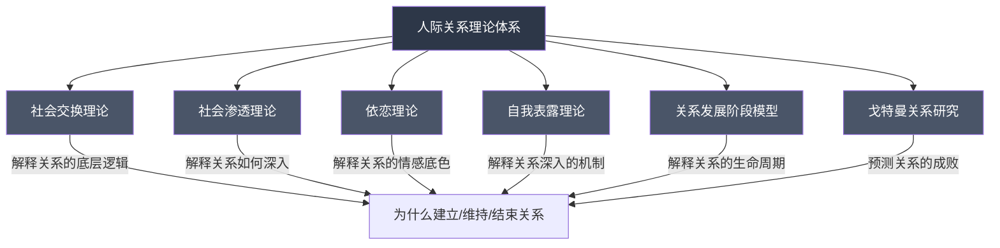
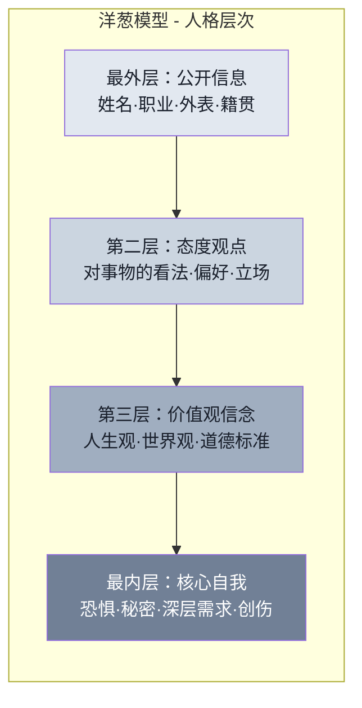
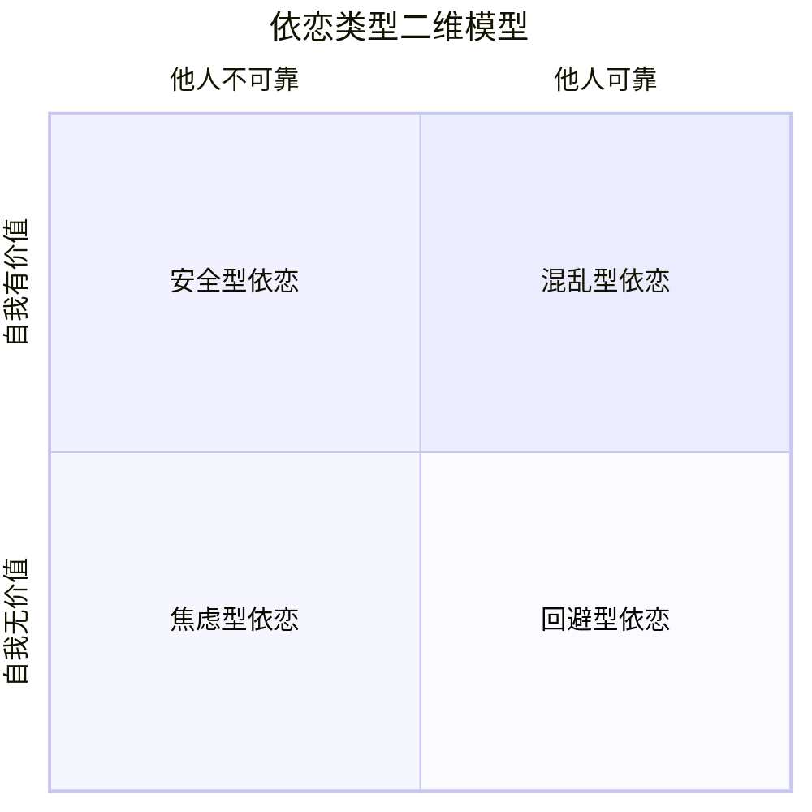
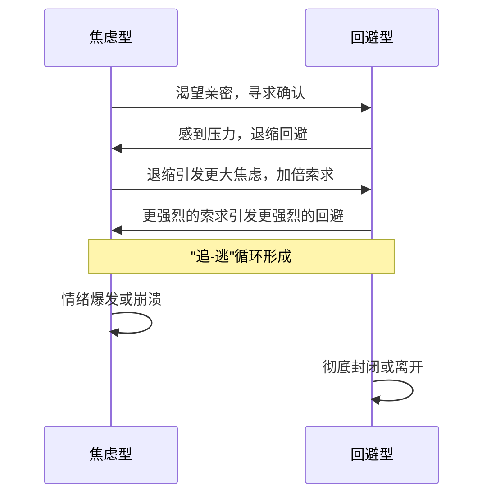
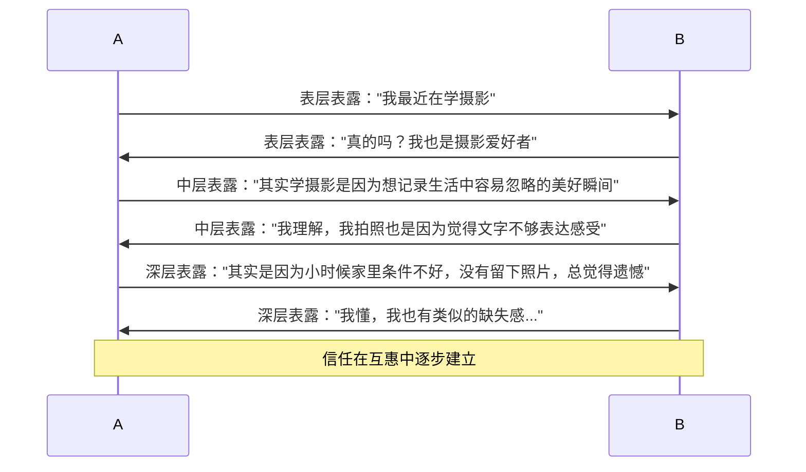
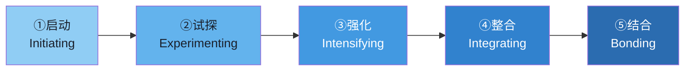
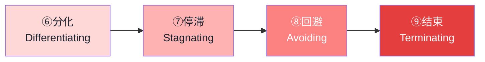

## 二、人际关系理论

人际关系看似复杂多变，但社会心理学在过去七十年的研究中，已经建立起一套相当完善的理论框架来解释人与人之间的联结机制。本节梳理六大核心理论——从关系的"经济逻辑"到"情感底色"，从"渐进深入"到"危机预测"——帮你建立理解人际关系的完整认知地图。

> **阅读指南**：每个理论按照"原理→机制→实操→误区"的结构展开。初读可先通览全篇建立框架感，遇到具体关系问题时再回来查阅对应理论的实操部分。

---

### 2.1 社会交换理论

社会交换理论（Social Exchange Theory）是理解人际关系最有影响力的理论框架之一，被称为人际关系研究的"经济学视角"。该理论由乔治·霍曼斯（George Homans，1958）奠基，彼得·布劳（Peter Blau，1964）和理查德·爱默森（Richard Emerson，1976）进一步发展，其核心洞见是：**人际关系本质上是一种资源交换过程，人们在关系中追求收益最大化和成本最小化**。

这听起来很"冷酷"，但它解释了大量日常现象——为什么有些关系让你疲惫不堪，为什么有些人总是单方面付出，为什么"门当户对"在统计上确实有效。

#### 2.1.1 核心概念

**收益（Rewards）**

关系中获得的所有积极体验。研究者将收益分为两大类：

| 收益类型 | 具体表现 | 典型场景 |
|---------|---------|---------|
| 内在收益 | 情感支持、陪伴快乐、归属感、被理解的感觉 | 朋友倾听你的烦恼，伴侣给你拥抱 |
| 外在收益 | 信息资源、人脉引荐、物质帮助、社会地位提升 | 同行分享行业信息，朋友介绍工作机会 |

心理学家凯利和蒂博（Kelley & Thibaut，1978）进一步区分了"给予的奖励"（对方实际为你做的事）和"感知的奖励"（你主观体验到的积极感受）。同样的行为，不同人感知到的奖励可能截然不同——有人觉得伴侣每天做饭是爱的表达，有人觉得这是理所当然。**你感知到的收益，比客观收益更能影响你对关系的满意度**。

**成本（Costs）**

关系中的消极体验和资源投入：

| 成本类型 | 具体表现 | 典型场景 |
|---------|---------|---------|
| 直接成本 | 时间投入、金钱支出、体力消耗 | 每天通勤一小时去见朋友、借钱给亲戚 |
| 机会成本 | 因维护此关系而放弃的其他可能性 | 因为照顾伴侣的情绪而放弃出差晋升机会 |
| 心理成本 | 情感消耗、压力、焦虑、妥协自我的不适 | 忍受对方的坏脾气、压抑自己的真实想法 |

**比较水平（Comparison Level，CL）**

这是社会交换理论中最精妙的概念之一。CL代表你期望从关系中获得的最低满足程度——它是你的"关系满意度基准线"。这个基准线由三个因素塑造：

1. **过往经验**：你在过去关系中的平均满足程度。如果从小家庭温暖，你的CL就高；如果一直被忽视，你的CL可能很低。
2. **参照群体**：你观察到身边人的关系状态。如果朋友圈里都是恩爱夫妻，你对自己的关系标准也会提高。
3. **社会文化期望**：媒体、文化塑造的"理想关系"图景。

**关键公式：满意度 = 感知收益 - 比较水平（CL）**

当关系的实际收益超过CL时，你感到满意；当收益低于CL时，即使外人看来你"已经很不错了"，你仍会不满。这就是为什么有些人"身在福中不知福"——不是他们不幸福，而是他们的CL被过往经验或文化参照抬得太高了。

**替代比较水平（Comparison Level for Alternatives，CL_alt）**

CL_alt代表你认为从其他可选关系中能获得的最佳满足程度。它决定的不是满意度，而是**依赖度**——你是否"离不开"当前关系。

**关键公式：依赖度 = 当前关系收益 - 最佳替代方案收益**

当当前关系的收益显著高于CL_alt时，你高度依赖这段关系，不太可能离开；当CL_alt高于当前关系收益时，你有离开的倾向。CL_alt不仅包括"换一个人"，还包括"保持单身""投入事业""发展其他社交圈"等所有替代选择。

#### 2.1.2 四种关系状态组合

理解了CL和CL_alt，就能推导出四种典型的关系状态：

| 状态 | 满意度 | 依赖度 | 体验 | 行为倾向 |
|------|--------|--------|------|---------|
| 满意且依赖 | 收益 > CL | 收益 > CL_alt | 幸福、安心 | 积极维护关系 |
| 满意但不依赖 | 收益 > CL | 收益 < CL_alt | 满足但"随时可以走" | 保持开放选择 |
| 不满意但依赖 | 收益 < CL | 收益 > CL_alt | 痛苦但离不开 | 消极维持、抱怨 |
| 不满意且不依赖 | 收益 < CL | 收益 < CL_alt | 压抑、绝望 | 倾向于结束关系 |

第三种状态最常见也最痛苦——很多人困在不满意但依赖的关系中，比如一段"食之无味弃之可惜"的感情，或者一个"工资不错但毫无成长"的职场关系。破解之道不是降低CL（说服自己"已经很好了"），而是**提升自己的CL_alt——扩大社交圈、提升个人价值、创造更多选择**。

#### 2.1.3 公平理论：交换理论的重要延伸

社会交换理论只关注"我是否划算"，但沃尔斯特（Walster, Walster & Berscheid，1978）的公平理论（Equity Theory）指出，人们还关心**关系中的公平性**——不仅在乎"我得到了多少"，还在乎"我和对方的付出-收益比是否对等"。

公平理论的核心发现：

- **公平状态**：双方的投入-收益比大致相等时，关系满意度最高
- **过度受益**：得到太多而付出太少时，会感到内疚和不安，甚至主动增加付出以恢复平衡
- **过度付出**：付出太多而得到太少时，会感到愤怒、怨恨和被剥削

有趣的是，研究表明**过度受益者**虽然也感到不安，但其不满程度远低于**过度付出者**。换句话说，占便宜的人虽然内疚，但被占便宜的人更痛苦。这也解释了为什么关系中"被亏欠"的一方往往会先爆发。

**长期关系中的公平动态**：

短期的关系不公平是正常的——有时你需要伴侣更多支持，有时对方更需要你。健康的关系有一个"公平账户"，双方轮流存款和取款，长期来看大致平衡。但如果一方长期单方面付出而得不到回报，账户终将透支。

#### 2.1.4 社会交换理论的实操应用

**增加你的"价值贡献"**

不要误解为"变得更有用"。关系中的价值贡献包括：

- **情感价值**：倾听、理解、鼓励、在对方低谷时给予陪伴
- **信息价值**：分享有用的见解、经验、资源
- **社交价值**：引荐人脉、组织聚会、维护共同社交圈
- **成长价值**：激发对方思考、支持对方的目标、一起学习新事物
- **体验价值**：一起创造有趣的回忆、带来新鲜感

**降低不必要的关系成本**

有些成本是不可避免的（比如异地恋的时间成本），但很多成本是自我制造的：

- 过度抱怨和消极情绪传染（让对方成为你的情绪垃圾桶）
- 控制和猜疑（查手机、限制社交、不停追问行踪）
- 不必要的冲突升级（小题大做、翻旧账、冷暴力）
- 不合理的期望投射（要求对方读心、满足你未说出口的需求）

**提高你的替代选择（CL_alt）**

这听起来像"给自己留后路"，但本质是**保持独立性**：

- 维持多元的社交网络，不要把所有社交需求都压在一段关系上
- 保持个人兴趣和成长，确保你的价值不完全依赖于某段关系
- 建立经济和情感上的自给自足能力

**警惕"过度理性化"**

社会交换理论是一个分析工具，不是行为指南。如果你开始精确计算每一次互动的"收益"和"成本"，你已经走偏了。过度计算会带来三个问题：

1. **消耗认知资源**：每次互动都在评估得失，累且低效
2. **破坏真诚感**：对方能感受到你的"精明"，从而降低信任
3. **忽略非理性因素**：最好的关系往往包含不求回报的付出和非理性的信任

**正确用法**：用社会交换理论来**诊断关系问题**（"为什么这段关系让我这么累？"），而不是用来**管理日常互动**（"今天我为TA做了三件事，TA只做了一件"）。

#### 2.1.5 常见误区

| 误区 | 纠正 |
|------|------|
| "关系就是互相利用" | 交换理论描述的是关系的底层逻辑，不是说关系只能是功利的。最深层的收益——爱、归属、意义——恰恰是最不功利的 |
| "我应该精确计算每笔付出" | 健康的关系是模糊的整体感知，不是精确的账本。当你开始计算时，说明关系已经出了问题 |
| "门当户对是势利" | 研究表明，匹配假说（matching hypothesis）在统计上成立——人们倾向于选择与自己"社交价值"相当的伴侣。这不是势利，是人性 |
| "降低标准就能幸福" | 降低CL可能暂时提高满意度，但长期会压抑真实需求。真正的出路是提升自己的整体关系能力 |

---

### 2.2 社会渗透理论

社会渗透理论（Social Penetration Theory）由欧文·奥尔特曼（Irwin Altman）和达尔马斯·泰勒（Dalmas Taylor）在1973年出版的《社会渗透：人际关系的发展》一书中提出。该理论回答了一个核心问题：**人际关系是如何从陌生人发展为亲密朋友或伴侣的？**

答案是四个字：**循序渗透**。

#### 2.2.1 洋葱模型

奥尔特曼和泰勒将人格比作一个多层洋葱，由外到内分为四个层次：

| 层次 | 信息类型 | 示例 | 向谁开放 |
|------|---------|------|---------|
| 最外层 | 公开信息 | "我是程序员，在杭州工作" | 几乎所有人 |
| 第二层 | 态度和观点 | "我觉得996是不合理的" | 同事、普通朋友 |
| 第三层 | 价值观和信念 | "我认为人生的意义是创造和连接" | 亲近的朋友、伴侣 |
| 最内层 | 核心自我 | "我害怕被抛弃，因为童年经历" | 极少数至亲密友、治疗师 |

#### 2.2.2 渗透的两个维度

关系的发展沿着两个维度展开：

**宽度（Breadth）**——话题范围的广度。浅层关系的话题通常很窄（同事之间只聊工作，邻居之间只聊天气），深层关系的话题范围很广（从工作到家庭、梦想、童年、恐惧无所不谈）。宽度扩展意味着你们的"共享世界"在扩大。

**深度（Depth）**——信息的私密程度。同样聊"家庭"这个话题，在宽度上可能很早就涉及了，但深度从"我有个妹妹"到"我和妹妹的关系很复杂，因为父母偏心"，是完全不同的渗透程度。

#### 2.2.3 渗透的速度与节奏

社会渗透理论强调，健康的关系发展遵循**渐进性**和**互惠性**两大原则：

**渐进性**——从浅到深，一层一层来。每深入一层，需要在当前层建立足够的信任和舒适感。跳层渗透（比如初次见面就分享童年创伤）会触发对方的防御机制，反而阻碍关系发展。

**互惠性**——双方的渗透速度大致匹配。研究发现，人们在社交中有强烈的互惠倾向：你分享多少，对方也倾向于分享多少。这种"滴定"式的互惠表露是关系深化的核心机制。

**渗透速度的三种异常模式**：

| 异常模式 | 表现 | 后果 |
|---------|------|------|
| 渗透过快 | 初次见面就分享深层隐私 | 对方感到不适、压力、边界被侵犯 |
| 渗透过慢 | 长期只停留在表面话题 | 关系停滞在"点头之交"，无法深化 |
| 渗透不对称 | 一方深一方浅（独角戏式表露） | 表露方感到被拒绝，接收方感到被压迫 |

#### 2.2.4 去渗透（De-penetration）

社会渗透理论不仅描述关系如何建立，还描述关系如何退化。当关系出现问题时，渗透会反向进行——话题范围变窄，信息深度变浅：

去渗透往往比渗透快得多——建立信任可能需要数月甚至数年，摧毁信任可能只需一次背叛。奥尔特曼的研究发现，去渗透过程通常伴随着负面情绪的增加和互动频率的下降。

#### 2.2.5 社会渗透理论的实操应用

**主动扩展宽度**：如果你想深化一段关系，不要急于挖掘对方的深层秘密，先扩展话题的广度。从工作聊到兴趣，从兴趣聊到生活方式，从生活方式聊到价值观——宽度为深度铺路。

**用"试探性表露"推进深度**：分享一个中等深度的信息，观察对方的反应。如果对方回应以同等深度的表露，说明可以继续推进；如果对方回避或转移话题，说明当前深度已经足够，需要更多时间积累信任。

**注意文化差异**：不同文化的社会渗透速度差异很大。美国文化中人们可能在第一次见面就分享不少个人信息（被研究者称为"飞机上的陌生人效应"），而在东亚文化中，即使是很深的友谊也可能不涉及某些核心话题。不要用单一标准衡量渗透的"正常速度"。

**识别去渗透信号**：如果对方开始减少分享、话题变得越来越表面、回应变得越来越简短，这是去渗透的信号。不要急于追问"你怎么了"，而是回顾近期的互动，检查是否有信任被打破的事件。

---

### 2.3 依恋理论

依恋理论（Attachment Theory）最初由英国精神分析学家约翰·鲍尔比（John Bowlby）在1950-1960年代提出，用于解释婴儿与照顾者之间的情感纽带。1980年代，辛迪·哈赞（Cindy Hazan）和菲利普·谢弗（Phillip Shaver）将依恋理论扩展到成人亲密关系领域，发现**童年形成的依恋模式深刻影响着我们成年后的恋爱、友谊和所有人际关系**。

这是人际关系理论中**最具实践价值**的理论——理解自己的依恋类型，往往是改善所有关系的起点。

#### 2.3.1 依恋类型的形成机制

鲍尔比提出，婴儿在与主要照顾者的互动中形成了"内部工作模型"（Internal Working Model），包含两个核心信念：

1. **自我模型**："我是否值得被爱？"——我能否从他人那里获得支持和关爱？
2. **他人模型**："他人是否可靠？"——当我需要帮助时，照顾者会回应我吗？

这两个维度的组合产生了不同的依恋类型：

| 依恋类型 | 自我模型 | 他人模型 | 核心信念 | 人口占比 |
|---------|---------|---------|---------|---------|
| 安全型 | 我有价值 | 他人可靠 | "我值得被爱，当我需要时有人会在" | 约55-65% |
| 焦虑型 | 我无价值 | 他人不可预测 | "我不够好，所以别人可能会离开我" | 约20% |
| 回避型 | 我有价值（自给自足） | 他人不可靠 | "我只能靠自己，靠近别人会受伤" | 约20% |
| 混乱型 | 我无价值 | 他人既渴望又危险 | "我想要爱但爱是危险的" | 约5% |

#### 2.3.2 四种依恋类型详解

**安全型依恋（Secure Attachment）**

安全型依恋者的核心特征是**对亲密关系感到舒适，对被抛弃的恐惧较低**。他们在关系中既能享受亲密，也能保持独立。

行为特征：
- 能够坦诚表达需求和感受，不担心"说多了会被嫌弃"
- 冲突时不回避也不攻击，能就事论事地沟通
- 伴侣需要空间时不会过度焦虑，能理解"不是不爱我"
- 信任伴侣的善意，不会过度解读对方的行为
- 能够在关系中保持个人边界，也能尊重对方的边界

来源：早期照顾者给予了**稳定、敏感、一致**的回应——婴儿哭泣时被及时安抚，探索世界时被鼓励，需要安慰时总能找到照顾者。

**焦虑型依恋（Anxious Attachment）**

焦虑型依恋者的核心特征是**强烈渴望亲密但持续担心被抛弃**。他们对关系中的"威胁信号"高度敏感。

行为特征：
- 需要频繁的确认和保证——"你还爱我吗"是高频问题
- 对伴侣的回复速度、语气变化、社交动态高度敏感
- 容易过度解读——伴侣晚回两小时消息，可能推演出一整套"TA不爱我了"的叙事
- 在关系中表现出"粘人"或"控制"倾向——频繁联系、限制对方社交、过度付出以换取对方的回应
- 情绪波动大——得到回应时极度开心，没有回应时极度焦虑
- 可能通过"制造冲突"来获得对方的关注和确认

来源：早期照顾者的回应**不稳定、不可预测**——有时热情回应，有时漠不关心。婴儿无法预测何时能得到关注，因此发展出"加倍索求"的策略来增加获得回应的概率。

**回避型依恋（Avoidant Attachment）**

回避型依恋者的核心特征是**强调独立和自主，对深度亲密感到不适**。他们的应对策略是"不依赖就不会失望"。

行为特征：
- 在关系变亲密时感到不适，会下意识地"降温"——突然减少联系、挑剔对方、找理由保持距离
- 难以表达情感需求，将"需要别人"等同于"软弱"
- 在冲突中倾向于撤退而非面对——"我需要冷静一下"（然后消失三天）
- 可能理想化前任或幻想中的完美伴侣，以避免面对真实关系的不完美
- 重视个人空间和自主性，对伴侣的"侵入"反应强烈

来源：早期照顾者可能**冷漠、拒绝或过度控制**。婴儿学会了"表达需求没有用，甚至会被惩罚"，因此发展出自我抑制的策略。

回避型依恋可以进一步分为两个亚型：
- **疏离回避型（Dismissive-Avoidant）**：高度自我依赖，贬低亲密关系的价值（"我不需要任何人"）
- **恐惧回避型（Fearful-Avoidant）**：渴望亲密但恐惧受伤，行为模式更混乱矛盾

**混乱型依恋（Disorganized Attachment）**

混乱型依恋是最复杂的类型，核心特征是**同时渴望和恐惧亲密**。依恋系统本身"失灵"——靠近照顾者既是安全的来源，又是恐惧的来源。

行为特征：
- 行为模式极度矛盾——今天说"我爱你"，明天说"我们不合适"
- 情绪调节困难，容易在极端之间摇摆
- 对关系的投入模式不稳定——可能极度投入后突然抽离
- 难以建立稳定的信任基础

来源：早期创伤、虐待、或照顾者本身是恐惧的来源（如患有严重精神疾病的父母）。当"安全港湾"同时也是"危险来源"时，依恋系统陷入无法解决的矛盾。

#### 2.3.3 依恋类型在关系中的互动模式

不同依恋类型的人建立关系后，会产生特定的互动动态。最常见也最具挑战性的组合是**焦虑-回避配对**：

这种"追-逃"循环（pursue-withdraw pattern）是伴侣治疗中最常见的问题模式。焦虑方越追，回避方越逃；回避方越逃，焦虑方越追。打破这个循环需要双方都理解自己的依恋模式，并有意识地调整行为。

#### 2.3.4 "习得性安全"——依恋类型可以改变

依恋类型不是终身固定的标签。研究表明，大约30%的人在成年后会改变依恋类型。改变的路径主要有三条：

1. **心理治疗**：与治疗师建立安全的关系体验，在关系中修复内部工作模型。创伤聚焦的认知行为治疗（TF-CBT）和眼动脱敏与再加工（EMDR）对处理早期创伤尤为有效。
2. **安全型伴侣**：与安全型依恋的人建立长期关系，通过日常互动逐步"感染"更安全的关系模式。安全型伴侣的稳定回应可以重塑焦虑型和回避型的核心信念。
3. **自我觉察与有意识的练习**：了解自己的依恋模式后，有意识地识别和修正不健康的自动反应。这需要大量的自我反思和行为实验。

#### 2.3.5 依恋理论的实操应用

**识别自己的依恋类型**

以下问题可以作为初步筛查（正式评估请使用ECR-R量表）：

- 当伴侣没有及时回复消息时，你的第一反应是什么？（焦虑→担心，回避→无所谓，安全→理解对方可能在忙）
- 当伴侣需要更多空间时，你的感受是什么？（焦虑→被拒绝，回避→松了口气，安全→理解并支持）
- 你在关系中最害怕的是什么？（焦虑→被抛弃，回避→失去自由，安全→失去信任）

**针对不同依恋类型的自我调整策略**

| 依恋类型 | 核心挑战 | 调整策略 |
|---------|---------|---------|
| 焦虑型 | 过度需要确认 | 学会自我安抚；在联系对方前先问"我是真的需要帮助，还是在寻求确认？"；发展独立的社交和兴趣 |
| 回避型 | 回避深度亲密 | 练习表达感受（从写日记开始）；当想退缩时，告诉自己"不舒服不等于危险"；尝试在小事情上依赖伴侣 |
| 混乱型 | 行为模式矛盾 | 寻求专业心理治疗；建立稳定的日常作息和关系边界；学习情绪调节技术 |

**在关系中应用依恋知识**

- 理解伴侣的依恋类型后，你能更准确地解读TA的行为——TA不是"不在乎你"（回避型的自我保护），也不是"控制你"（焦虑型的安全需求），而是在用TA唯一知道的方式应对关系焦虑。
- 不要把伴侣的依恋行为当作人身攻击。焦虑方的"夺命连环call"不是不信任你，是TA的依恋系统被激活了。回避方的突然冷淡不是不爱你，是TA的亲密阈值被突破了。
- 建立"安全信号"——提前约定一些小仪式来满足双方的依恋需求，比如每天睡前说一句"今天和你在一起很开心"（满足焦虑方的确认需求），以及"我需要独处一小时，不是因为你"（尊重回避方的空间需求）。

#### 2.3.6 常见误区

| 误区 | 纠正 |
|------|------|
| "我是XX型所以我就这样了" | 依恋类型是起点不是终点。"习得性安全"是经过大量研究验证的——你可以改变 |
| "焦虑型和回避型不应该在一起" | 这对组合确实更有挑战，但并非不可能。关键是双方都有意愿理解和调整 |
| "依恋理论是伪科学" | 依恋理论是发展心理学中研究最充分的理论之一，有数千项实证研究支持。但任何理论都有边界——不要用依恋类型解释所有行为 |
| "只有恋爱关系才有依恋" | 依恋模式影响所有亲密关系——友谊、亲子、甚至职场关系。与导师、上司的关系中也能看到依恋动态 |

---

### 2.4 自我表露理论

自我表露（Self-Disclosure）是向他人分享个人信息、想法和感受的过程。它不是简单地"说话"，而是一种**有选择地向他人展示内心世界的行为**。自我表露是关系从浅层走向深层的关键机制——没有自我表露，就没有亲密关系。

社会心理学家桑德拉·佩特罗尼奥（Sandra Petronio）在2002年提出了**传播隐私管理理论（Communication Privacy Management Theory）**，进一步解释了自我表露中的隐私边界管理机制。

#### 2.4.1 自我表露的四个层次

| 层次 | 内容类型 | 示例 | 关系阶段 |
|------|---------|------|---------|
| 表层表露 | 事实性信息 | "我是做设计的，喜欢爬山" | 初识阶段 |
| 中层表露 | 观点和态度 | "我觉得国内的设计行业太卷了" | 朋友阶段 |
| 深层表露 | 情感和脆弱面 | "我最近很焦虑，担心35岁以后被行业淘汰" | 亲密朋友/伴侣 |
| 核心表露 | 秘密和创伤 | "我曾经因为这件事患过抑郁症" | 至亲密友/治疗关系 |

每个层次的表露都有其功能：表层表露建立基本认知，中层表露建立共鸣和认同，深层表露建立信任和亲密，核心表露建立灵魂层面的连接。

#### 2.4.2 自我表露的互惠性

自我表露最有力的特征之一是其互惠性。阿尔特曼和泰勒的研究表明，当一个人向你表露时，你也倾向于向对方表露同等深度的信息。这种机制被称为**"表露互惠"（disclosure reciprocity）**。

互惠表露的运作机制：

**互惠的"滴定"原则**：每次表露比对方深一点点就好，不要一次跳太远。如果对方没有跟上你的深度，退回到之前的层次，给关系更多时间。

#### 2.4.3 自我表露的时机与策略

**什么时候适合深度表露？**

研究者德加拉赫（Derlega）和格雷尔（Greer）总结了适合深度自我表露的四个条件：

1. **信任已建立**：通过一系列小规模的互惠表露，双方已经积累了足够的信任
2. **关系有持续性**：双方预期关系会继续发展（对即将分别的陌生人深度表露通常不明智）
3. **对方有能力回应**：对方有情感容量和回应能力（不要对正处于自己危机中的人深度表露）
4. **情境合适**：相对私密的环境，双方都有足够的时间和注意力

**自我表露的策略**：

| 策略 | 说明 | 适用场景 |
|------|------|---------|
| 渐进式表露 | 从浅到深，逐层推进 | 建立新关系时的标准策略 |
| 响应式表露 | 在对方表露后进行匹配深度的回应 | 对方主动分享时的自然回应 |
| 试探性表露 | 先分享中等深度的信息，观察反应 | 不确定对方是否值得信任时 |
| 选择性表露 | 对不同关系的人表露不同层次的信息 | 维护多元社交圈时的正常策略 |

#### 2.4.4 自我表露的风险与收益

深度自我表露是一把双刃剑：

| 维度 | 收益 | 风险 |
|------|------|------|
| 关系层面 | 建立深层信任和亲密感 | 被拒绝或被评判 |
| 个人层面 | 获得情感支持，减轻心理负担 | 暴露弱点可能被利用 |
| 社交层面 | 吸引真诚的人，建立高质量关系 | 信息可能被传播或泄露 |

**降低风险的方法**：
- 分步表露：不要一次性暴露所有隐私，先用中等深度的信息测试对方的反应和可信度
- 观察对方的"保密行为"：TA是否轻易分享别人的秘密？如果TA对别人的隐私不守口如瓶，你也不要指望TA能守住你的
- 区分"表露"和"倾倒"：健康的表露是"我选择和你分享"，不健康的倾倒是"我不管你想不想听都要说"

#### 2.4.5 "飞机上的陌生人效应"

心理学家发现一个有趣的现象：人们有时会对完全陌生的人进行深度自我表露（比如在长途旅行中对邻座的陌生人倾诉心事）。这种现象被称为"飞机上的陌生人效应"（stranger on a plane effect）。

这种现象的原因包括：
- **匿名感**：陌生人不认识你的社交圈，表露的风险较低
- **无后续压力**：不需要维护这段关系，可以自由表达
- **心理距离**：适当的陌生感反而创造了安全的表露空间

这也解释了为什么有些人在网上比在现实中更容易表达真实的自己。

#### 2.4.6 自我表露的实操应用

**成为好的"表露接收者"**：当别人向你表露时，你的回应方式决定了对方是否愿意继续深入。有效的回应模式是：

1. **先确认感受**："听起来那段时间对你来说真的很艰难。"
2. **表达感谢**："谢谢你愿意和我分享这些，我知道这不容易。"
3. **适度回应**：如果可以，分享一段匹配深度的个人经历（互惠表露），但不要抢夺话题
4. **不要急于解决问题**：很多时候，对方需要的是被听见，而不是被指导

**自我表露的黄金法则**：表露的速度跟着关系的节奏走，不超前也不滞后。如果对方只聊工作，你也先聊工作；如果对方开始分享家庭，你可以适度分享你的家庭话题。

---

### 2.5 关系发展阶段模型

马克·克纳普（Mark Knapp）在1984年提出了人际关系发展的阶段模型，将关系从建立到结束的完整生命周期分为10个阶段。这是目前被引用最广泛的关系发展框架之一。

#### 2.5.1 聚合阶段（Coming Together）

**①启动阶段（Initiating）**

这是关系的"零时刻"——初次接触，第一印象形成。研究表明，人们在初次见面的7秒内就会形成对对方的基本判断。在这个阶段，互动通常是高度程式化的——"你好，我是XX，你是做什么的？"

启动阶段的关键：
- 非言语信号（微笑、眼神接触、开放的身体姿态）比言语内容更重要
- 第一印象一旦形成，改变需要大量矛盾信息（首因效应）
- 在中国文化中，初次见面通常需要一个"介绍人"或共同的社交场景来降低社交风险

**②试探阶段（Experimenting）**

试探阶段的核心任务是**寻找共同点**。互动话题通常非常表面——天气、最近的新闻、共同的兴趣爱好。这个阶段看起来"无聊"，但它的功能至关重要：通过大量小规模的表层交换，建立基本的信任和舒适感。

试探阶段的典型话题：
- "你周末一般做什么？"
- "最近有看什么好剧吗？"
- "你也喜欢这家店啊？"

这些看似琐碎的对话是关系的"地基"——没有这些地基，后续的深层关系无法建立。

**③强化阶段（Intensifying）**

关系在这个阶段开始显著深化。标志性的变化包括：
- 自我表露的深度和频率明显增加
- 开始使用更亲密的称呼和语言
- 花更多时间在一起
- 开始交换个人信息（电话、社交媒体账号）
- 可能出现试探性的亲密行为（如单独约会、送小礼物）

**④整合阶段（Integrating）**

整合阶段的标志性变化是**身份融合**——从"你和我"变成"我们"。具体表现包括：
- 开始使用"我们"来描述关系
- 发展出共同的习惯、笑话和"暗语"
- 社交圈开始融合（见对方的朋友、家人）
- 对方的需求和感受开始显著影响你的决策

**⑤结合阶段（Bonding）**

结合阶段是关系的公开承诺——对外宣告"我们是XX关系"。在恋爱中可能是确立关系、订婚或结婚；在友谊中可能是成为"闺蜜""兄弟"；在职场中可能是建立稳定的合作伙伴关系。

结合阶段的特点：
- 通常有某种公开的仪式或宣告
- 关系获得了社会认可和法律/道德约束
- 双方对关系有了明确的期望和承诺

#### 2.5.2 离散阶段（Coming Apart）

关系不一定永远向前发展。克纳普同样描述了关系退化的五个阶段：

**⑥分化阶段（Differentiating）**

分化是整合的逆过程——从"我们"重新变回"你和我"。标志包括：
- 开始强调个人需求和差异："我想……""你总是……"
- 发现之前忽略的不兼容性
- 共同活动减少，各自活动增加

**⑦停滞阶段（Stagnating）**

关系发展完全停滞，互动模式固化。双方可能感到"没什么好说的了"，沟通变成公式化的客套。这个阶段最危险的特征是**问题被回避而非解决**——双方都知道有问题，但都不愿意面对。

**⑧回避阶段（Avoiding）**

物理或心理上的距离开始明显增大。回避的方式包括：
- 减少见面和联系频率
- 回复变得简短、敷衍
- 在互动中创造"我有事""最近很忙"的借口
- 物理距离的拉开（搬到远一点的地方）

**⑨结束阶段（Terminating）**

关系正式结束。结束的形式多样——可能是坦诚的"我们分手吧"，也可能是渐行渐远的自然淡化，还可能是单方面的断联（ghosting）。

#### 2.5.3 阶段模型的关键洞见

1. **关系不是线性的**：现实中的关系可能在任何阶段来回波动——刚到强化阶段又退回试探阶段，这是正常的。
2. **阶段可以被跳过或压缩**：快速发展的关系可能跳过某些阶段，但跳过的阶段往往成为后续关系问题的隐患。
3. **离散过程可以被逆转**：在分化和停滞阶段采取积极行动（深度沟通、寻求咨询、重建共同活动），关系是可以修复的。
4. **不同关系类型的速度不同**：恋爱关系通常比友谊关系发展更快；在线关系可能在某些阶段加速（更容易自我表露），在其他阶段减速（缺乏物理接触）。

#### 2.5.4 实操应用：诊断你当前关系所处的阶段

| 信号 | 可能的阶段 | 建议行动 |
|------|-----------|---------|
| 还在聊表面话题，互相试探 | 试探阶段 | 不要急于深化，享受发现共同点的过程 |
| 开始分享内心想法，见面频率增加 | 强化阶段 | 保持互惠表露的节奏，不要过度投入 |
| 开始说"我们"，见了朋友/家人 | 整合阶段 | 确认双方对关系的期望一致 |
| 开始讨论未来计划，做出承诺 | 结合阶段 | 确保承诺是深思熟虑的，而非冲动的 |
| 发现越来越多的分歧和差异 | 分化阶段 | 重新建立共同活动，练习协商和妥协 |
| 没什么话可说，互动模式固化 | 停滞阶段 | 主动引入新鲜话题和共同体验，打破僵局 |
| 减少联系，回避对方 | 回避阶段 | 如果还想挽回，需要直面问题而非继续回避 |

---

### 2.6 戈特曼的关系研究

约翰·戈特曼（John Gottman）是华盛顿大学心理学教授，被称为"关系研究领域的爱因斯坦"。他在长达40年的研究中，对超过3000对夫妻进行了纵向追踪研究，通过观察他们在"爱情实验室"（Love Lab）中的互动，发现了**预测关系成败的关键行为指标**。

戈特曼的方法论之所以权威，在于他的预测准确率——仅通过观察夫妻5分钟的争吵对话，他就能以超过90%的准确率预测这对夫妻是否会在未来几年内离婚。

#### 2.6.1 "末日四骑士"——关系破裂的四大预测因素

戈特曼将四种最具破坏性的互动模式称为"末日四骑士"（Four Horsemen of the Apocalypse），按照破坏力从高到低排列：

**①蔑视（Contempt）——破坏力最强**

蔑视是所有负面互动中最具杀伤力的。它不仅是"不喜欢"，而是**站在道德高地上鄙视对方**——觉得对方愚蠢、低级、不值得尊重。

蔑视的表现形式：
- 言语上的嘲讽和挖苦："就你？你也配？"
- 非言语上的轻蔑：翻白眼、冷笑、嘴角下撇
- 道德优越感："我比你好，你太差了"
- 模仿和嘲笑对方的言行

戈特曼发现，蔑视是预测离婚的**最强单一指标**。蔑视之所以最致命，因为它传达的信息是"我不尊重你，你在我眼里什么都不是"——这直接摧毁了关系的基本尊严。

**解药**：建立尊重的文化。在日常互动中，有意识地表达对伴侣的欣赏和感激。戈特曼建议每天至少找到一件你欣赏伴侣的事并表达出来。

**②批评（Criticism）**

批评不是对具体行为的不满，而是**对人格的攻击**。区分"抱怨"和"批评"：

| 类型 | 示例 | 性质 |
|------|------|------|
| 健康的抱怨 | "你这周连续三天加班到很晚，我觉得被忽略了，我希望我们能有更多相处时间" | 对具体行为的感受和需求 |
| 破坏性批评 | "你总是只顾工作，你从来不在乎我的感受，你就是个自私的人" | 对人格的攻击和全面否定 |

批评的关键词是"你总是""你从来""你就是"——这些词把具体行为上升为对整个人的否定。

**解药**：使用"我"语句而非"你"语句。"我感到……（感受），因为……（具体事件），我希望……（具体需求）"。比如："我这周感到有些孤单，因为这周我们很少在一起吃晚饭，我希望我们至少每周保证三天一起吃饭。"

**③防御（Defensiveness）**

防御是面对对方的抱怨或批评时的本能反应——不倾听，不回应，而是为自己辩护、反击、推卸责任。

防御的表现形式：
- 否认："我没有那样做！"
- 反击："你才……！"
- 推卸责任："都是因为你先……"
- 装受害者："你就知道怪我，我多辛苦你知道吗？"

防御的本质是**拒绝接收对方的信息**。当一方在表达需求时，另一方选择防御，等于告诉对方"你的感受不重要，我的立场才重要"。

**解药**：即使你觉得对方的批评不公平，先**承担一部分责任**。"你说得对，我确实这周加班太多了，没有考虑到你的感受。"这不意味着你全错了，而是表达了"我在听你说话，你的感受对我很重要"。

**④冷战（Stonewalling）**

冷战是完全关闭沟通——沉默、转身离开、拒绝回应、面无表情。冷战通常发生在前三骑士反复出现之后——当一方被批评、蔑视、防御反复冲击后，情绪系统过载，选择"关机"。

冷战的生理机制：戈特曼的研究发现，冷战者的心率通常超过100次/分钟（正常静息心率60-80），进入"战斗或逃跑"的生理状态。此时大脑的情绪处理中心（杏仁核）被激活，理性思考能力（前额叶皮层）被抑制。冷战不是"冷酷无情"，而是**情绪系统过载后的自我保护**。

**解药**：当感到自己即将冷战时，主动要求暂停："我现在情绪太激动了，需要20分钟冷静一下，然后我们再继续谈。"关键是要**承诺回来继续谈**，而不是消失。戈特曼建议暂停时间至少20分钟——这是让生理恢复到正常水平所需的最低时间。

#### 2.6.2 "5:1法则"——关系的黄金比例

通过对数千对夫妻的纵向数据，戈特曼发现了一个惊人的规律：**在稳定的、幸福的关系中，积极互动与消极互动的比例至少为5:1**。

这意味着：
- 每一次争吵、批评、冷战，需要至少五次赞美、感谢、关心、幽默、亲密来平衡
- 如果比例降到1:1以下（消极互动等于或多于积极互动），关系极大概率在三年内破裂
- 最佳比例不是0:1（完全没有消极互动），而是5:1到20:1之间

**为什么不是"没有消极互动"？**

戈特曼的研究发现，完全不争吵的夫妻并不比适度争吵的夫妻更幸福。关键不在于"不吵架"，而在于**争吵的方式是否健康，以及积极互动是否足够多**。完全没有消极互动的关系，可能意味着双方在回避问题（冷战的另一种形式）。

**日常"存款"清单**：

| 积极互动（存款） | 具体行为 |
|-----------------|---------|
| 表达关注 | 放下手机，全神贯注地倾听 |
| 表达欣赏 | "谢谢你今天做的晚饭，很好吃" |
| 表达兴趣 | "你今天的工作怎么样？给我讲讲" |
| 表达关爱 | 一个拥抱、一杯茶、一个微笑 |
| 表达幽默 | 一起笑、分享有趣的段子 |
| 表达支持 | "我支持你的决定" |
| 身体接触 | 拍肩、牵手、亲吻 |
| 共同活动 | 一起散步、一起做饭、一起看电影 |

#### 2.6.3 "情感投标"——关系中最小的互动单位

戈特曼提出了"情感投标"（Emotional Bid）的概念，定义为**任何一方试图获得对方注意力、情感支持或连接的尝试**。

情感投标可以非常微小：
- "你看，窗外的夕阳好美。"（试图分享体验）
- "我今天开会被老板骂了。"（试图获得安慰）
- "你觉不觉得这个节目很好笑？"（试图获得共鸣）
- 一个眼神、一声叹息、一个微笑（非言语投标）

对情感投标的回应只有三种：

| 回应类型 | 示例 | 对关系的影响 |
|---------|------|-------------|
| 转向（Turning Toward） | "真的好美！让我看看。" | 存款——关系加强 |
| 转离（Turning Away） | （继续看手机，没反应） | 无操作——关系不变或微弱削弱 |
| 转对（Turning Against） | "别打扰我，我在忙。" | 取款——关系削弱 |

戈特曼的研究发现，**幸福的夫妻对彼此的情感投标回应率超过86%，而最终离婚的夫妻回应率只有33%**。

这个发现意义深远：关系不是毁于一次大争吵，而是毁于**无数次微小的忽视**。每一次没有回应的"你看，夕阳好美"，都是一笔小额取款。日积月累，账户就透支了。

#### 2.6.4 "关系银行账户"——日常维护的思维模型

将5:1法则和情感投标结合，戈特曼提出了一个实用的思维模型：**关系银行账户**。

| 操作 | 存款行为 | 取款行为 |
|------|---------|---------|
| 日常 | 问候、微笑、感谢、倾听、帮忙 | 忽视、敷衍回应、只顾自己 |
| 冲突 | 承认错误、表达理解、妥协 | 批评、蔑视、防御、冷战 |
| 特殊 | 记住重要日子、制造惊喜、在关键时刻支持 | 忘记重要承诺、在对方需要时缺席 |

账户余额充足时，偶尔的取款（一次争吵、一个糟糕的时期）不会致命。但如果账户已经透支，即使是小额取款也可能导致"关系破产"。

**关键原则**：日常的小额存款比偶尔的大额存款更重要。每天一句"谢谢你"比一年一次的豪华旅行对关系的维护效果更好。

#### 2.6.5 戈特曼研究的实操应用

**冲突管理的"软启动"**

戈特曼发现，争吵的结局有96%的概率由争吵开始的前三分钟决定。如果前三分钟就充满了批评和蔑视，争吵几乎不可能有好的结果。

"软启动"公式：
> "我感到______（感受），关于______（具体情境），我需要______（具体需求）。"

例如，不要说"你从来不打扫卫生，家里这么乱你也不管！"，而是说"我看到家里比较乱的时候会感到焦虑，我希望我们能一起分担家务。"

**每日"存款"习惯**

1. **分离仪式**：出门前，花2分钟了解对方今天的计划，表达"今天加油"
2. **重聚仪式**：见面时，花至少20分钟全神贯注地了解对方的一天
3. **欣赏表达**：每天至少找一件你欣赏伴侣的事并说出来
4. **情感投标回应**：当对方向你"投标"（说话、分享、寻求关注）时，尽可能"转向"回应
5. **睡前连接**：睡前的几分钟，聊一些积极的话题，带着温暖的感觉入睡

**修复尝试——争吵中的"灭火器"**

戈特曼发现，区分"大师级"和"灾难级"夫妻的不是不吵架，而是是否能在争吵中使用"修复尝试"（Repair Attempts）：

- "我们能不能先暂停一下？"
- "我知道我的表达方式有问题，但我想说的是……"
- "你说得对，我确实在这个方面做得不够好。"
- "我理解你的感受，虽然我的看法不同。"
- 使用幽默来缓解紧张气氛（注意：不是嘲讽式幽默）

当修复尝试被对方接受时，争吵往往会转向积极的方向；当修复尝试被忽视或拒绝时，争吵大概率升级为破坏性冲突。

#### 2.6.6 常见误区

| 误区 | 纠正 |
|------|------|
| "好夫妻不吵架" | 戈特曼的研究明确表明，不吵架不等于关系好。关键是如何吵、吵完怎么修复 |
| "5:1法则太刻意了" | 不需要精确计算比例，但需要意识到消极互动的权重远大于积极互动——一句伤人的话需要五句暖心的话来弥补 |
| "这些理论只适用于婚姻" | 戈特曼的发现在所有亲密关系中都适用——友谊、亲子、合作伙伴关系中的互动模式高度相似 |
| "只要我不做'四骑士'行为就好了" | 重要的是建设积极互动，而不仅仅是避免消极互动。"不伤害"是底线，"主动关爱"才是目标 |

---

### 2.7 理论综合：构建你的关系认知框架

以上六大理论并非孤立存在，它们共同构成了理解人际关系的**多层次分析框架**：

| 理论 | 回答的核心问题 | 分析层次 |
|------|--------------|---------|
| 社会交换理论 | 为什么建立/维持/结束关系？ | 经济逻辑层 |
| 社会渗透理论 | 关系如何从浅到深？ | 发展过程层 |
| 依恋理论 | 关系中的情感底色是什么？ | 心理动力层 |
| 自我表露理论 | 关系深入的具体机制是什么？ | 行为机制层 |
| 关系发展阶段 | 关系的完整生命周期是什么？ | 宏观阶段层 |
| 戈特曼研究 | 如何预测和维护关系质量？ | 实证操作层 |

**综合应用场景**：

当你遇到关系困惑时，可以按以下顺序思考：

1. **先看交换**：这段关系的收益和成本是否平衡？我是否在过度付出或过度索取？（社会交换理论）
2. **再看依恋**：我对这段关系的焦虑或回避，是否源于我的依恋模式而非现实情况？（依恋理论）
3. **看渗透节奏**：我们的自我表露是否对等？是否在合适的速度深入？（社会渗透理论 + 自我表露理论）
4. **看阶段**：我们处于关系发展的哪个阶段？当前的问题是否是这个阶段的正常挑战？（关系发展阶段模型）
5. **看互动质量**：我们的积极-消极互动比例是否健康？"末日四骑士"是否已经出现？（戈特曼研究）

这六个理论就像六副不同焦距的镜头——交换理论是广角镜，让你看到关系的全貌；依恋理论是特写镜，让你看到关系中的情感纹理；戈特曼的研究是高速摄影机，让你捕捉到那些容易被忽略的微小互动。综合使用它们，你对人际关系的理解将从"凭感觉"升级为"有框架"。
