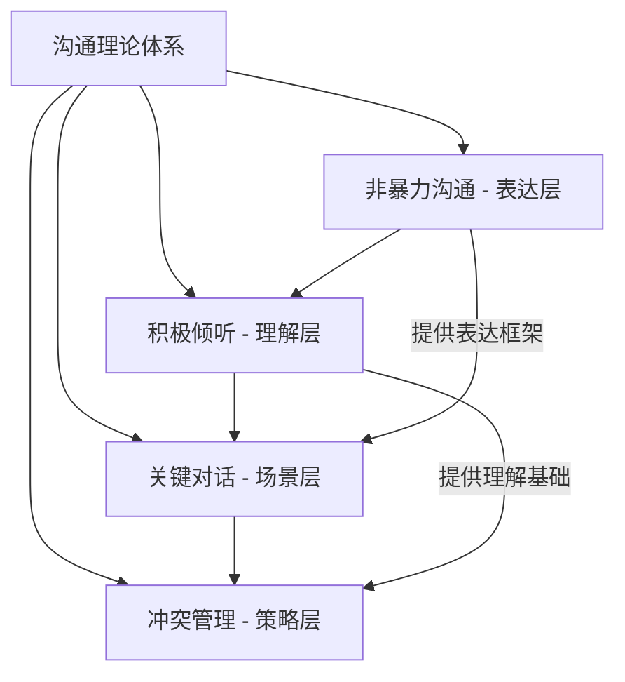
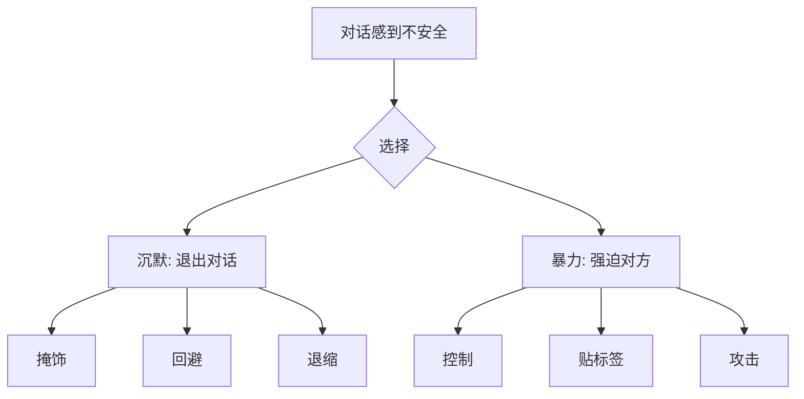
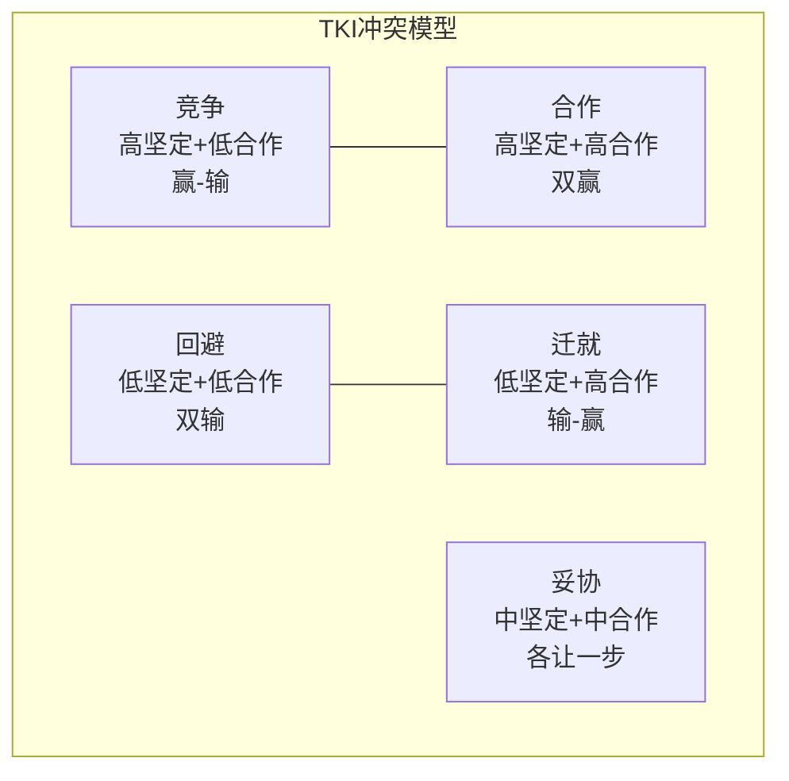

## 三、沟通理论

沟通不是"把话说清楚"那么简单。它是一整套涉及心理学、神经科学、语言学和社会学的系统能力。本章介绍四个经过大量研究验证的沟通框架：非暴力沟通解决"怎么说才不伤人"的问题，关键对话解决"高风险场景下怎么说"的问题，积极倾听解决"怎么听才能真正理解对方"的问题，冲突管理解决"意见对立时怎么处理"的问题。这四个框架不是独立的工具，而是相互嵌套的——非暴力沟通是表达的基本语法，积极倾听是理解的底层能力，关键对话是高压力场景的进阶应用，冲突管理则是当分歧升级时的系统策略。

### 3.1 非暴力沟通

#### 3.1.1 理论起源与核心假设

马歇尔·卢森堡（Marshall Rosenberg）在 1960 年代发展出非暴力沟通（Nonviolent Communication，简称 NVC）。这套方法的起点是一个观察：人类的所有行为——包括那些看起来具有攻击性的行为——都是在试图满足某种内在需求。当需求得不到满足，又缺乏健康的表达方式时，人们就会使用"暴力语言"：批评、指责、命令、威胁。

NVC 的核心假设是：**当人们的需求被看见和理解时，他们天然地愿意合作。** 冲突不是因为人们的需求本身矛盾，而是因为他们满足需求的策略互相冲突。这个区分至关重要——如果你只看到策略层面的对立，冲突无解；如果你深入到需求层面，几乎总能找到双方都能接受的方案。

#### 3.1.2 四要素的深度拆解

NVC 的四个步骤——观察、感受、需要、请求——看似简单，但每一步都有容易踩入的陷阱。

**第一要素：观察（Observation）**

观察是指客观描述你看到、听到、触到的事实，不掺杂评判、解读或推断。这是四步中最难的一步，因为人类大脑天生就在做模式匹配和归因，把事实和解读混在一起是自动化的。

| 类型 | 暴力表达 | 非暴力表达 |
|------|---------|-----------|
| 评判化 | "你太不负责任了" | "这周有三份报告超过了截止日期" |
| 推断化 | "你根本不在乎这个项目" | "昨天的会议你没有出席" |
| 比较化 | "你看看人家小张" | "这个月我的方案被驳回了两次" |
| 标签化 | "你就是个拖延症" | "这份文件原定周五交，现在周三还没开始" |

**关键区分：观察 vs 评论**

"你总是迟到"是评论。"过去两周我们约了五次，你有三次迟到了15分钟以上"是观察。区别在于：观察是可以被录像回放验证的，评论则是你对事实的主观加工。

**练习方法**：在日常对话中，试着在开口前问自己："如果这段话被录下来，对方能同意这些是事实吗？"如果答案是"不确定"，说明你在评论而不是观察。

**第二要素：感受（Feeling）**

感受是你对观察到的事实产生的情绪体验。NVC 要求你表达的是真正的感受，而不是伪装成感受的想法或判断。

| 伪装成感受的想法 | 真正的感受 |
|----------------|-----------|
| "我觉得被忽视了" | "我感到孤独和失落" |
| "我觉得你不尊重我" | "我感到受伤和沮丧" |
| "我觉得这不公平" | "我感到愤怒和委屈" |
| "我觉得自己很没用" | "我感到焦虑和不安" |

**区分方法**：如果你的句子以"我觉得你……"开头，那后面跟的很可能是对对方的判断，而不是你的感受。真正的感受通常只有一个词：开心、难过、害怕、焦虑、兴奋、沮丧、失望、安心。

**为什么要强调感受？** 因为当你表达感受而不是想法时，对方更容易产生共情。"你不尊重我"会让对方进入防御模式——因为他不同意你的判断。但"我感到受伤"是你的内在体验，对方无法反驳，反而更容易理解你的处境。

**第三要素：需要（Need）**

需要是感受的根源。每一种感受背后都指向一个被满足或未被满足的需要。卢森堡将人类的基本需要归纳为几个大类：

- **生存需要**：食物、水、住所、安全、健康
- **连接需要**：归属感、爱、亲密、理解、支持、信任
- **自主需要**：选择自由、独立、空间、尊重
- **意义需要**：目标感、成长、贡献、创造力
- **玩耍需要**：乐趣、放松、探索、幽默
- **诚实需要**：真实性、一致性、透明

**需要的独立性原则**：NVC 强调，需要是普遍的、独立于特定策略的。所有人都需要尊重，但不同的人用不同的方式来满足"被尊重"的需要——有人需要你准时赴约，有人需要你认真听他们说话，有人需要你记得他们说过的话。识别需要而不执着于特定的满足方式，是 NVC 的精髓所在。

**第四要素：请求（Request）**

请求是你希望对方采取的具体行动。好的请求具有以下特征：

1. **具体**：不是"对我好一点"，而是"周末能陪我吃顿饭吗"
2. **可执行**：对方知道该做什么、怎么做
3. **正向**：说你想要什么，而不是你不想要什么
4. **可拒绝**：请求不是命令——如果对方拒绝，你会探索其他方案，而不是施加压力

**请求 vs 命令的区别**：如果对方拒绝后你会生气、惩罚或施加压力，那你的"请求"实际上是一个命令。真正的请求给对方选择的空间。

#### 3.1.3 完整实战模板

**场景一：伴侣总是看手机**

暴力沟通："你就知道刷手机，手机比我重要是吧？"

NVC 拆解：
- 观察：这周我们一起吃饭时，你大部分时间都在看手机（具体到事实）
- 感受：我感到有些失落和孤独（真实情绪）
- 需要：我很珍惜我们在一起的时光，希望能有高质量的陪伴（核心需要）
- 请求：这周我们能不能约定，吃饭时把手机放一边？（具体、可执行）

**场景二：同事总把工作推给你**

暴力沟通："你每次都把自己的活推给我，太不负责了。"

NVC 拆解：
- 观察：这个月你有三次在截止日前把报告初稿发给我，让我帮忙修改（事实）
- 感受：我感到压力很大，也有些不被尊重（真实感受）
- 需要：我希望我们的合作是平等的，我也需要时间完成自己的工作（核心需要）
- 请求：如果后续还需要我协助，能不能提前一周告诉我，这样我好安排时间？（具体、有缓冲）

**场景三：孩子不写作业**

暴力沟通："你怎么又不写作业？你到底想不想学了？"

NVC 拆解：
- 观察：今天放学后你玩了两个小时游戏，作业还没开始写（事实）
- 感觉：我有些担心，也有些着急（真实感受）
- 需要：我希望你能跟上学习进度，也想看到你开心（核心需要）
- 请求：你现在愿意先写30分钟作业，然后再玩游戏吗？（具体、给选择空间）

#### 3.1.4 常见"暴力语言"模式与转化

| 暴力语言类型 | 示例 | 背后的需要 | 转化表达 |
|-------------|------|-----------|---------|
| 评判性语言 | "你总是这么自私" | 被关心、被重视 | "上次我生病时没有收到你的问候，我感到失落，因为我在乎你是否关心我" |
| 比较性语言 | "你看看人家老公" | 被支持、被认可 | "我希望在家务分工上能得到更多支持" |
| 否定性语言 | "你不应该这样想" | 被理解、被接纳 | "我听到你说的了，能再告诉我更多吗" |
| 命令性语言 | "你必须马上做" | 效率、安全感 | "这件事对我很重要，我希望今天能处理完，你方便吗" |
| 威胁性语言 | "你再这样我就走了" | 安全、承诺 | "我需要知道这段关系对我们都很重要，我们能谈谈吗" |
| 讽刺性语言 | "哇，你终于想起来做家务了" | 被看见、被感谢 | "我注意到你今天主动洗了碗，这让我很开心" |

#### 3.1.5 NVC 的适用边界与局限

NVC 不是万能的。以下是需要注意的边界：

1. **不适用于即时危险场景**：如果有人正在对你施暴，你需要的不是 NVC，而是离开现场和报警。
2. **需要双方的安全意愿**：如果对方处于严重的情绪失控状态（醉酒、极度愤怒），先等情绪过去再使用 NVC。
3. **不要用于操纵**：NVC 的本质是真诚地表达和理解，如果你用 NVC 的格式来包装操控意图，效果会比直接的暴力沟通更差——因为对方会感到被"套路"。
4. **文化差异**：在一些高语境文化中（如东亚），直接表达感受和需要可能让人不适应。需要根据关系和场景调整直接程度。
5. **需要持续练习**：NVC 不是一个"学了就会"的技巧，而是一种需要长期练习的沟通习惯。初期使用时可能会觉得别扭和不自然，这很正常。

### 3.2 关键对话

#### 3.2.1 什么是关键对话

《关键对话》（Crucial Conversations）由科里·帕特森（Kerry Patterson）、约瑟夫·格雷尼（Joseph Grenny）、罗恩·麦克米兰（Ron McMillan）和阿尔·斯威茨勒（Al Switzler）共同提出。这本书的核心观点是：**你人生中最重要的结果，取决于你在关键对话中的表现。**

关键对话有三个同时成立的条件：

1. **高风险**：对话的结果对你的生活、工作或关系有重要影响
2. **高情绪**：对话中涉及强烈的情绪，你或对方感到愤怒、恐惧、受伤
3. **意见分歧**：对话双方的观点存在明显分歧

日常闲聊不是关键对话，一般的商务会议也不是。但以下场景是：
- 和伴侣讨论"我们要不要结婚/要孩子"
- 和老板谈加薪或晋升
- 向同事指出他工作中的严重问题
- 告诉父母你的人生重大决定
- 处理朋友的背叛

#### 3.2.2 关键对话失败的两个方向

当关键对话变得不安全时，人们会走向两个极端：

**方向一：沉默（Silence）**——人们退出对话，不再表达真实想法。沉默的三种形式：
- **掩饰**：轻描淡写或回避核心问题（"没事没事，都行"）
- **回避**：完全绕开敏感话题（转移话题、顾左右而言他）
- **退缩**：从对话中完全退出（摔门而去、冷暴力）

**方向二：暴力（Violence）**——人们试图强迫对方接受自己的观点。暴力的三种形式：
- **控制**：强迫对方接受自己的想法（打断、威胁、提高音量）
- **贴标签**：给对方或对方的观点贴负面标签（"你这种想法太幼稚了"）
- **攻击**：直接的人身攻击（讽刺、嘲笑、人身侮辱）

#### 3.2.3 七大原则的深度应用

**原则一：从心开始（Start with Heart）**

在进入关键对话之前，先问自己一个问题：**"我希望通过这次对话为自己、为对方、为我们的关系达成什么？"**

大多数人进入关键对话时，脑子里想的是"我要赢"或"我要让他知道他是错的"。这注定了对话会失败。真正的目标应该是解决问题、增进理解、维护关系。

**自检清单**：
- 我的最终目标是什么？（不是"让他认错"，而是"解决这个冲突"）
- 如果这个目标实现了，我会对关系感到满意吗？
- 我是否在不知不觉中转向了"惩罚对方"或"证明自己正确"的目标？

**原则二：注意观察（Learn to Look）**

关键对话中最重要的技能之一是"元对话"能力——在对话进行的同时，观察对话本身的状态。当出现以下信号时，说明对话已经脱离正轨：

- **安全信号**：双方都能自由表达不同意见，语调平稳，身体语言开放
- **危险信号**：有人开始沉默或暴力，语调变尖锐，身体僵硬或回避眼神，有人开始"是的，但是……"

**原则三：营造安全（Make It Safe）**

安全是关键对话的前提。当人们感到不被尊重或不被理解时，他们的大脑会进入"战斗或逃跑"模式，理性思考能力直线下降。营造安全感有两个关键条件：

- **共同目标**（Mutual Purpose）：让对方知道你们有共同的目标，而不是对立的立场。"我希望我们都能在这个项目中成功"比"你的方案有问题"安全得多。
- **相互尊重**（Mutual Respect）：让对方感到你尊重他这个人，即使你不同意他的观点。一旦尊重感破裂，对话几乎不可能修复。

**安全感破裂时的修复策略**：

| 破裂类型 | 修复方式 | 示例 |
|---------|---------|------|
| 对方感到被攻击 | 道歉 + 重新声明意图 | "我刚才的表达方式不对，我真正想讨论的是……" |
| 对方感到被误解 | 对比法（Contrasting） | "我不是说你不专业，我是想讨论这次的方案细节" |
| 对方感到目标对立 | 建立共同目标 | "我们都希望项目按时上线，对吧？那我们来看看怎么解决这个问题" |
| 对方沉默退出 | 用好奇心邀请 | "我注意到你好像有不同看法，我很想听听你的想法" |

**原则四：控制想法（Master My Stories）**

你的情绪不是由事件直接引发的，而是由你对事件的解读（故事）引发的。这个过程是：事实 → 你编了一个故事 → 你产生了情绪 → 你做出了反应。

例如：同事开会时对你的方案提出反对意见（事实）→ 你觉得他在针对你（故事）→ 你感到愤怒（情绪）→ 你提高了音量反驳（反应）。

但如果你编的故事不同——"他可能是真的看到了我没想到的风险"（故事）→ 你感到好奇（情绪）→ 你请他详细说明（反应）。

**夺回控制权的步骤**：
1. 注意到自己的情绪（"我现在很愤怒"）
2. 追溯情绪的来源（"我在想什么故事？"）
3. 检验故事（"有证据支持这个故事吗？有没有其他可能的解释？"）
4. 选择更有用的故事（"即使他的意图是好的，我的感受也是合理的，我可以用 NVC 来表达"）

**原则五：陈述观点（STATE）**

STATE 是一个表达不同意见的结构化方法：

- **S — Share your facts**（分享事实）：从事实开始，而不是从故事或结论开始
- **T — Tell your story**（说出你的故事）：分享你基于事实得出的推断，同时承认这只是你的解读
- **A — Ask for others' paths**（询问对方的路径）：真诚地邀请对方分享他们的看法
- **T — Talk tentatively**（试探性地表达）：用"我观察到……"、"我在想是不是……"而不是"事实就是……"
- **E — Encourage testing**（鼓励反驳）：主动邀请不同意见，"如果有我遗漏的，请告诉我"

**原则六：了解对方（Explore Others' Paths）**

当对方陷入沉默或暴力时，你需要用 AMPP 四步法来帮助他们重新回到对话中：

- **A — Ask**（询问）：真诚地邀请对方分享。"你怎么看这件事？"
- **M — Mirror**（映射）：描述你观察到的对方的状态。"你好像对这件事有些顾虑？"
- **P — Paraphrase**（转述）：用自己的话复述你听到的内容，确认理解。"所以你的担心是……对吗？"
- **P — Prime**（引出）：如果你尝试了以上三步对方仍然沉默，你可以先说出你的猜测，降低对方开口的难度。"是不是因为上次的项目经历，你对这个方案有顾虑？"

**原则七：开始行动（Move to Action）**

关键对话如果不转化为行动，就是一次无效的对话。行动方案需要明确：

- **谁**：负责执行的人是谁
- **做什么**：具体的行动内容
- **什么时候**：截止时间或检查点
- **怎么检查**：如何确认任务完成
- **如果做不到怎么办**：兜底方案

**书面记录**：对于重要的关键对话，建议把达成的行动方案写下来，双方确认。这不是不信任，而是避免后续因为记忆偏差产生新的冲突。

#### 3.2.4 关键对话的实战场景

**场景：向老板提加薪**

| 阶段 | 具体做法 |
|------|---------|
| 从心开始 | 目标不是"证明我值更多钱"，而是"了解我的价值评估标准，探讨提升薪资的路径" |
| 营造安全 | "我很重视在公司的发展，想和您聊聊我的成长和贡献" |
| 陈述事实 | "过去一年我负责了X、Y、Z三个项目，客户满意度从82%提升到91%" |
| 说出故事 | "基于这些成绩，我觉得我的贡献和当前薪资之间有一些差距" |
| 邀请对方 | "我很想听听您对我的表现和薪资空间的看法" |
| 行动方案 | "如果目前无法调整，需要达到什么标准才能重新评估？" |

### 3.3 积极倾听

#### 3.3.1 为什么大多数人不会倾听

史蒂芬·柯维在《高效能人士的七个习惯》中指出：**"大多数人听别人说话，不是为了理解，而是为了回应。"** 这句话精准地描述了倾听的核心障碍。

当别人在说话时，大多数人的大脑在做以下几件事之一：
- **准备反驳**：只听对方的漏洞，准备自己的论点
- **准备建议**：听到问题就开始想解决方案，没等对方说完就想打断
- **自我投射**：把对方的经历套到自己身上，"我也遇到过……"
- **走神**：思绪飘到自己的事情上，只是保持"在听"的姿势

真正的倾听要求你**暂时放下自己的框架**，进入对方的世界。

#### 3.3.2 倾听的五个层次

| 层次 | 状态 | 表现 | 对方感受 |
|------|------|------|---------|
| 1. 忽视式倾听 | 完全没在听 | 看手机、眼神空洞、答非所问 | 被忽视、不重要 |
| 2. 假装式倾听 | 表面在听 | "嗯嗯"、"是的"、但问后续问题答不上来 | 被敷衍、不被重视 |
| 3. 选择性倾听 | 只听自己感兴趣的 | 挑自己想听的部分回应，忽略其余 | 只有部分被看见 |
| 4. 专注式倾听 | 认真听每一个字 | 准确复述、记住细节 | 被认真对待 |
| 5. 共情式倾听 | 听内容+感受+需要 | 理解言外之意、回应情感 | 被真正理解 |

真正的积极倾听需要达到第4和第5个层次。第4层解决"信息准确接收"的问题，第5层解决"情感被理解"的问题。

#### 3.3.3 积极倾听的核心技能

**技能一：全神贯注（Presence）**

全神贯注是最基础也最难的技能。它要求你在身体和心理上都"在场"：

- **身体层面**：放下手机，关闭电脑屏幕，面向对方，保持适度的眼神接触，用身体语言（点头、前倾）表示关注
- **心理层面**：暂时搁置自己的议题、评判和建议，把全部注意力放在对方正在说的内容上

**一个实用技巧**：在对方说话时，试着在心里默默复述他说的每一句话。这个简单的动作会强制你的注意力集中在对方身上，防止走神。

**技能二：不打断（Don't Interrupt）**

打断是倾听的大敌。即使是出于好意的打断（"我理解，我也遇到过"），也会让对方觉得你在把对话重心拉向自己。

**例外情况**：如果对方明显陷入了冗长的、偏离主题的叙述，你可以用引导性的问题温和地把他拉回来。"你说的这些我都很想听，不过我想先确认一下，关于XX这件事，你最后是怎么决定的？"

**技能三：反映和复述（Reflect and Paraphrase）**

用自己的话复述对方的观点，有两个目的：
1. 确认你理解正确
2. 让对方知道你在认真听

**格式**："所以你的意思是……对吗？" 或 "听起来你觉得……是这样吗？"

**注意事项**：复述不是鹦鹉学舌。把对方的原话用自己的语言重新组织，才能证明你真正理解了内容，而不只是记住了字面。

**技能四：共情回应（Empathic Response）**

共情回应是倾听中最高级的技能。它要求你不只听内容，还要识别对方的情绪和需要，并给予回应。

| 对方说的 | 内容层面回应 | 共情层面回应 |
|---------|------------|------------|
| "这个项目搞得我快崩溃了" | "项目遇到什么困难了？" | "听起来你现在压力很大，这个项目对你来说真的很消耗" |
| "我妈又催我结婚了" | "你妈怎么催的？" | "被反复提这件事让你挺烦的，你希望她能理解你的节奏" |
| "我辞职了" | "为什么辞职？" | "做出这个决定对你来说不容易，你还好吗？" |

共情回应的关键是：**回应情绪，而不是解决问题。** 大多数人听到朋友倾诉时的第一反应是给建议，但这往往不是对方需要的。对方需要的是"被理解"。

**技能五：开放式提问（Open-ended Questions）**

开放式问题鼓励对方深入分享，封闭式问题则限制对方的表达空间。

| 封闭式问题 | 开放式问题 |
|-----------|-----------|
| "你生气了吗？" | "你现在感受怎么样？" |
| "项目成功了吗？" | "项目进展如何？能说说细节吗？" |
| "你同意吗？" | "你怎么看这个方案？" |
| "是不是他做的？" | "你觉得这件事是怎么发生的？" |

**"什么"和"如何"比"为什么"更安全**。"为什么"容易让人感觉被质疑——"你为什么要这样做？"听起来像质问，而"你当时是怎么考虑的？"听起来像好奇。

#### 3.3.4 倾听中的常见误区

**误区一：倾听 = 同意**

很多人不敢认真倾听，是因为害怕"听了就等于同意了"。但倾听和同意是两回事。你可以完全理解对方的立场，同时持有不同的观点。事实上，只有当你真正理解了对方的观点，你的反对才有力量。

**误区二：倾听 = 不说话**

积极倾听不是沉默。适时的回应（"嗯"、"我明白了"、"然后呢？"）和提问是倾听的重要组成部分。完全的沉默会让对方不确定你是否在听。

**误区三：倾听 = 给建议**

当朋友向你倾诉时，他们的首要需求往往是"被理解"，而不是"得到解决方案"。如果你总是急着给建议，对方会觉得你没有真正听到他们的感受。在给建议之前，先确认："你是想聊聊这件事，还是想听听我的想法？"

**误区四：共情 = 感同身受**

共情不是"我也经历过一模一样的事"。每个人的体验都是独特的。共情是"我能想象这件事对你意味着什么"，而不是"我完全理解你的感受"。后者反而会让对方觉得你在轻描淡写他们的痛苦。

#### 3.3.5 倾听能力的训练方法

**练习一：3分钟倾听**

找一个伙伴，设定3分钟的计时。在这3分钟里，A说话，B只倾听，不打断、不提问、不给建议。B唯一能做的是用身体语言表示关注。3分钟结束后，B复述A说的内容和感受到的情绪，A给反馈。

**练习二：对话日志**

每天记录一次对话，回答以下问题：
- 对方真正在说的是什么？（内容层面）
- 对方的感受是什么？（情感层面）
- 对方的需要是什么？（需求层面）
- 我有没有打断对方？
- 我的回应是在理解对方，还是在把对话拉向自己？

**练习三：忍住建议**

当有人向你倾诉时，给自己设定一个规则：在对方说完之前，不给任何建议。只用复述、共情回应和开放式提问。你会发现，很多时候对方自己就能找到答案——他们需要的只是一个愿意听的人。

### 3.4 冲突管理

#### 3.4.1 冲突的本质

冲突是两个人的需求、利益或价值观产生碰撞的状态。冲突本身不是坏事——回避冲突才是真正的问题。心理学家约翰·戈特曼（John Gottman）对婚姻关系的长期研究发现，69% 的夫妻冲突是"永久性冲突"——源于双方性格和价值观的差异，永远无法彻底解决。能够幸福生活的夫妻不是没有冲突，而是学会了和冲突共处。

冲突的三个层次：

1. **事实层面的冲突**：对信息、数据、事实有不同认知。这类冲突相对容易解决——收集更多信息、核实数据即可。
2. **利益层面的冲突**：双方的需求和利益不同。需要通过谈判和创造性的问题解决来处理。
3. **价值观层面的冲突**：双方的核心信念和原则不同。这类冲突最难处理，通常需要通过"同意保留不同意见"来管理。

#### 3.4.2 托马斯-基尔曼冲突模型（TKI）

肯尼斯·托马斯（Kenneth Thomas）和拉尔夫·基尔曼（Ralph Kilmann）提出的冲突处理模型是应用最广泛的冲突管理框架。该模型基于两个维度：

- **坚定性（Assertiveness）**：满足自己利益的程度
- **合作性（Cooperativeness）**：满足对方利益的程度

这两个维度交叉产生五种冲突处理风格：

| 风格 | 坚定性 | 合作性 | 适用场景 | 风险 |
|------|--------|--------|---------|------|
| **竞争** | 高 | 低 | 需要快速决策的紧急情况；涉及原则性问题；对方试图利用你的善意 | 损害关系；对方可能报复 |
| **回避** | 低 | 低 | 问题不重要；双方情绪过于激动需要冷静；你需要更多时间思考 | 问题积累恶化；对方觉得你不在乎 |
| **妥协** | 中 | 中 | 双方势均力敌；需要临时解决方案；合作和竞争都不现实 | 双方都不完全满意；可能忽视更好的方案 |
| **迁就** | 低 | 高 | 你发现自己错了；问题对对方更重要；维护关系比赢得争论更重要 | 自己的需求被忽视；长期可能积累怨恨 |
| **合作** | 高 | 高 | 双方的关切都很重要；需要长期合作；有时间深入讨论 | 耗时较长；需要双方都有合作意愿 |

**没有"最好"的风格**。每种风格在特定场景下都是最优选择。关键是在不同情境中灵活切换。

**如何选择冲突处理风格？**

问自己三个问题：
1. 这个问题对我有多重要？（坚定性维度）
2. 维护这段关系对我有多重要？（合作性维度）
3. 我有多少时间和精力来处理这件事？（资源维度）

如果问题很重要、关系很重要、时间充裕 → 合作
如果问题很重要、关系不太重要或不维护 → 竞争
如果问题不重要、关系很重要 → 迁就
如果双方势均力敌且需要快速解决 → 妥协
如果情绪太激烈或问题太复杂 → 先回避，冷静后再处理

#### 3.4.3 冲突中的神经科学——"杏仁核劫持"

丹尼尔·戈尔曼（Daniel Goleman）在《情商》中提出了"杏仁核劫持"（Amygdala Hijack）的概念。杏仁核是大脑的威胁检测中心，当它感知到危险时，会在毫秒级别接管大脑的控制权，绕过前额叶皮质（负责理性思考的区域），直接触发"战斗或逃跑"反应。

在冲突中，这意味着：当你的杏仁核被激活时，你的理性思考能力会大幅下降。你会说出后悔的话、做出冲动的决定。

**杏仁核劫持的身体信号**：
- 心跳明显加速
- 肌肉紧绷（特别是肩膀和下巴）
- 呼吸变浅变快
- 声音不自觉地提高
- 脸部发热或发红
- 思维变得狭窄，只看到对方的"错误"

**应对策略：TIPP法**

当识别到杏仁核劫持信号时，使用以下方法快速降低生理唤醒：

| 方法 | 英文 | 具体做法 | 原理 |
|------|------|---------|------|
| 温度 | Temperature | 用冷水洗脸或握冰块 | 激活潜水反射，降低心率 |
| 运动 | Intense exercise | 做20个深蹲或快走5分钟 | 消耗应激激素 |
| 节奏呼吸 | Pacing breathing | 吸气4秒-屏气4秒-呼气6秒，循环5次 | 激活副交感神经 |
| 渐进式放松 | Progressive relaxation | 从脚趾到头顶逐步紧绷再放松各组肌肉 | 降低整体肌肉张力 |

**暂停协议**：在重要对话开始前，和对方约定一个"暂停"机制。当任何一方说"我需要暂停"时，双方各自离开30分钟到几小时，冷静后再继续。这不是逃避冲突，而是保护对话质量。

#### 3.4.4 建设性冲突处理的六步法

1. **定义问题**：用观察（事实）而不是评判来描述冲突。"我们对项目优先级有不同的看法"而不是"你总是不配合"。
2. **表达需求**：用 NVC 的框架表达你的感受和需要。
3. **倾听对方**：用积极倾听的技能理解对方的需求。
4. **寻找共同点**：找到双方都认同的目标或价值观。"我们都希望项目按时上线，这是共识对吧？"
5. **创造选项**：一起头脑风暴可能的解决方案，不急于评判。
6. **达成协议**：选择双方都能接受的方案，明确行动步骤。

#### 3.4.5 特殊场景：与不同类型的人处理冲突

| 对方类型 | 特征 | 策略 |
|---------|------|------|
| 回避型 | 一遇到冲突就退缩、转移话题 | 创造安全环境，用开放式问题引导；不要步步紧逼 |
| 攻击型 | 提高音量、指责、威胁 | 保持冷静，不要以攻对攻；用"我"语言表达感受；设定边界 |
| 被动攻击型 | 表面同意但行为对抗 | 直接但温和地指出你观察到的不一致；邀请对方说出真实想法 |
| 分析型 | 用数据和逻辑说话，忽视情感 | 先用事实建立共同基础，再引入情感维度 |
| 情绪型 | 强烈情绪主导对话 | 先回应情绪（"我看到你很难过"），等情绪平复后再讨论问题 |

#### 3.4.6 冲突后的修复

冲突结束后，关系的修复和冲突本身同样重要。戈特曼的研究发现，冲突后修复尝试的成功率是预测关系质量的最强指标。

**修复四步法**：
1. **承认伤害**：不否认冲突中造成的伤害。"我知道刚才我的话伤到你了。"
2. **承担责任**：为自己在冲突中的不当行为负责。"我不应该提高音量。"
3. **表达理解**：从对方的角度看问题。"我能理解你为什么会那样反应。"
4. **共同改进**：讨论下次遇到类似情况时的更好处理方式。"下次我们情绪上来了，先暂停好不好？"

### 3.5 四大框架的综合应用

#### 3.5.1 框架选择指南

| 场景特征 | 首选框架 | 辅助框架 |
|---------|---------|---------|
| 日常沟通中的摩擦 | 非暴力沟通 | 积极倾听 |
| 对方在倾诉或分享感受 | 积极倾听 | 非暴力沟通 |
| 高风险的职业/关系对话 | 关键对话 | 非暴力沟通 + 积极倾听 |
| 双方立场对立、需求冲突 | 冲突管理 | 关键对话 + 非暴力沟通 |
| 长期关系中的反复摩擦 | 冲突管理 + 非暴力沟通 | 积极倾听 |

#### 3.5.2 综合实战：完整的冲突处理流程

**场景**：你和合作伙伴对产品方向有严重分歧。

| 阶段 | 使用的框架 | 具体操作 |
|------|-----------|---------|
| 准备阶段 | 关键对话 | 从心开始：明确目标是"找到双方都认可的方向"而不是"证明我的方案更好" |
| 开场 | 非暴力沟通 | 观察："我们对产品方向有不同的看法，已经讨论了两周没有达成一致" |
| 表达 | 非暴力沟通 | 感受+需要："我感到焦虑，因为延期会影响上市时间。我需要我们在本月底前做出决定" |
| 倾听 | 积极倾听 | 全神贯注听对方的方案和理由，用复述确认理解："所以你的核心担心是……" |
| 深入 | 关键对话 | 用STATE方法表达不同意见，用AMPP方法探索对方的顾虑 |
| 化解 | 冲突管理 | 寻找共同目标："我们都希望产品成功"；使用合作风格，共同创造第三方案 |
| 收尾 | 关键对话 | 明确行动方案：谁做什么、什么时间、怎么检查 |
| 后续 | 冲突管理 | 关系修复：确认双方对这次沟通的感受，约定下次遇到分歧时的处理方式 |

#### 3.5.3 日常练习计划

沟通能力的提升需要刻意练习。以下是一个为期8周的训练计划：

| 周次 | 重点 | 每日练习 |
|------|------|---------|
| 第1-2周 | 观察 vs 评判 | 每天记录3个你把评判当观察的例子，重新用纯事实表达 |
| 第3-4周 | 感受表达 | 每天至少1次用"我感到……因为我需要……"的格式表达情绪 |
| 第5-6周 | 积极倾听 | 每天1次对话中全程不打断、不给建议，只用复述和共情回应 |
| 第7-8周 | 综合应用 | 每天1次完整的NVC四步表达 + 积极倾听的组合使用 |

**衡量标准**：
- 8周后，你的"观察vs评判"准确率应该达到80%以上
- 你能在日常对话中自然地使用感受词汇
- 你能在5分钟的对话中做到不打断对方
- 你能识别自己的"杏仁核劫持"信号并主动暂停

### 3.6 常见误区与纠正

| 误区 | 问题 | 纠正 |
|------|------|------|
| 把NVC当话术 | 机械套用四步格式，内心充满操控意图 | NVC的本质是真诚，格式只是辅助工具。如果内心没有真正的同理心，格式化的表达会让人感觉更假 |
| 关键对话只在"大事"用 | 日常小事不练习，大事来了用不出来 | 关键对话的技能需要在低风险场景中反复练习，才能在高压力下自然使用 |
| 倾听 = 不表达 | 一直听，从不表达自己的需求 | 倾听是双向的。在充分理解对方之后，你也需要用NVC表达自己的感受和需要 |
| 冲突必须合作解决 | 所有冲突都试图找到双赢方案 | 有些冲突用妥协或回避更合适。强迫合作会浪费双方的时间和精力 |
| 一次就能学会 | 学完理论就能熟练运用 | 沟通是技能，不是知识。知道和做到之间隔着大量的刻意练习 |

### 3.7 延伸阅读

- 《非暴力沟通》——马歇尔·卢森堡（理论源头，案例丰富）
- 《关键对话》——科里·帕特森等（职场和关系中的高风险对话）
- 《高效能人士的七个习惯》——史蒂芬·柯维（第五个习惯"知彼解己"是倾听的经典论述）
- 《情商》——丹尼尔·戈尔曼（情绪管理的神经科学基础）
- 《爱的五种语言》——盖瑞·查普曼（理解不同人表达和接收爱的方式）
- 《高难度对话》——道格拉斯·斯通等（哈佛谈判项目组的冲突沟通方法）
- 《Crucial Accountability》——科里·帕特森等（《关键对话》的续作，专注问责对话）
