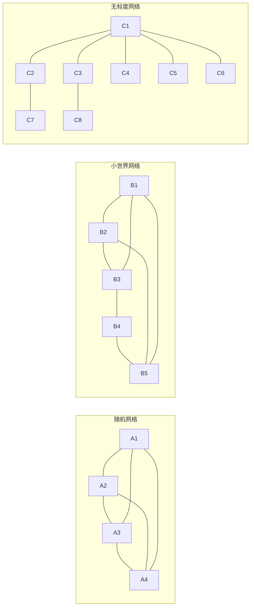
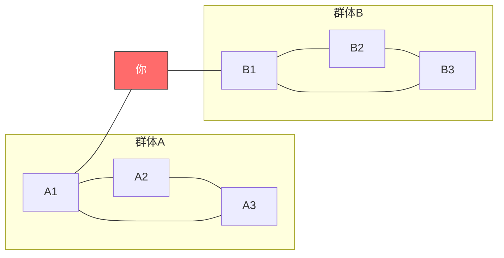
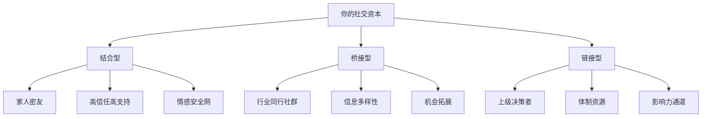

## 四、社交网络理论

社交不仅仅是"跟谁聊得来"的问题，它本质上是一张网络。理解网络的结构和规律，你才能从"凭感觉交朋友"升级为"有策略地经营人脉"。本章从网络科学的核心理论出发，系统讲解社交网络的运行机制、关键指标和实操方法。

### 4.1 社交网络的结构基础

在深入具体理论之前，先理解社交网络的基本构成要素。

#### 4.1.1 网络的基本元素

社交网络由三个基本元素构成：

| 元素 | 术语 | 含义 | 生活例子 |
|------|------|------|----------|
| 节点（Node） | Actor/Vertex | 网络中的个体 | 每个人是一个节点 |
| 连边（Edge） | Tie/Link | 节点之间的关系 | 两个人是朋友关系 |
| 网络（Network） | Graph | 节点和连边的集合 | 你的整个社交圈 |

连边的强度不同，可以进一步细分：

- **强关系（Strong Tie）**：高频互动、情感深厚、互惠性强。典型：家人、密友、伴侣。
- **弱关系（Weak Tie）**：低频互动、情感较浅、接触面广。典型：同事、邻居、偶尔见面的熟人。
- **休眠关系（Dormant Tie）**：曾经熟悉但长期未联系的人。这类关系往往被忽视，但研究表明它们的价值甚至高于普通弱关系（见4.2节）。

#### 4.1.2 网络拓扑类型

不同结构的社交网络，信息流动的方式完全不同：

**随机网络（Random Network）**
节点之间随机连接，没有明显的中心和集群。现实中纯粹的随机社交网络几乎不存在，但它作为基准模型有参考价值。数学家保罗·埃尔德什（Paul Erdős）和阿尔弗雷德·雷尼（Alfréd Rényi）在1959年提出的ER模型是这一类型的经典描述。

**小世界网络（Small-World Network）**
社会学家斯坦利·米尔格拉姆（Stanley Milgram）在1967年通过"六度分隔"实验发现：地球上任意两个人之间的平均距离约为6步。小世界网络的特征是：局部聚集度高（你的朋友之间大概率也互相认识），但任意两个节点之间通过少量"长程连接"就能快速到达。

邓肯·瓦茨（Duncan Watts）和史蒂文·斯特罗加茨（Steven Strogatz）在1998年提出了WS模型，用一个参数控制网络从完全规则到完全随机的过渡。当参数取中间值时，网络同时具备高聚集系数和短平均路径长度——这就是小世界效应。

**无标度网络（Scale-Free Network）**
艾伯特-拉斯洛·巴拉巴西（Albert-László Barabási）和雷卡·阿尔伯特（Réka Albert）在1999年提出的BA模型揭示了一个重要规律：真实世界的社交网络中，节点的连接数服从幂律分布——少数"超级连接者"拥有大量连接，大多数人只有少量连接。

这意味着什么？你的微信好友里，可能有几个人认识几百上千人，而大多数人只认识几十人。那些"超级连接者"就是网络中的枢纽节点（Hub），他们对信息传播和网络稳定性有不成比例的影响力。

#### 4.1.3 关键网络指标

理解以下指标，你就能"读懂"一张社交网络：

**度中心性（Degree Centrality）**：一个节点直接连接的节点数量。在社交网络中，度中心性高的人就是"人脉广"的人。计算公式为度数除以最大可能度数（N-1），归一化到0-1之间。

**中介中心性（Betweenness Centrality）**：一个节点出现在其他节点之间最短路径上的频率。中介中心性高的人是"桥梁型"人物，控制着信息从一个群体流向另一个群体。格兰诺维特的弱关系理论和伯特的结构洞理论，本质上都是在描述高中介中心性的价值。

**聚集系数（Clustering Coefficient）**：一个节点的邻居之间互相连接的程度。你的朋友圈聚集系数高，说明你的朋友们之间也互相认识；聚集系数低，说明你的朋友们来自不同圈子，互不认识。

**特征向量中心性（Eigenvector Centrality）**：不仅看你连了多少人，还看你连接的人有多"重要"。连接5个行业领袖比连接50个普通人得分更高。谷歌的PageRank算法就是特征向量中心性的一个变体。

| 指标 | 衡量什么 | 高分意味着 | 典型角色 |
|------|----------|-----------|----------|
| 度中心性 | 直接连接数量 | 人脉广泛 | 社交达人 |
| 中介中心性 | 桥梁位置 | 控制信息流动 | 跨圈连接者 |
| 聚集系数 | 邻居互联程度 | 圈子紧密 | 圈子核心成员 |
| 特征向量中心性 | 连接质量 | 连接有影响力的人 | 行业意见领袖 |

### 4.2 弱关系的力量

#### 4.2.1 格兰诺维特的经典理论

社会学家马克·格兰诺维特（Mark Granovetter）在1973年发表了划时代论文《弱关系的力量》（The Strength of Weak Ties），提出了一个违反直觉的结论：**在信息传播和机会获取方面，弱关系往往比强关系更有价值**。

这个结论为什么反直觉？因为大多数人本能地把更多时间和精力投入到亲密关系中，认为"关系越深，价值越大"。但格兰诺维特发现，信息的传播效率取决于网络的"桥梁"，而桥梁几乎总是由弱关系充当的。

**理论机制：**

核心机制在于信息的冗余性。你的亲密朋友和你共享大部分社交圈——你们认识相同的人，参加相同的活动，关注相同的领域。他们知道的信息，你大概率也知道。这就是所谓的"同质性"（Homophily）：物以类聚，人以群分。

而弱关系连接着不同的社交圈。一个偶尔见面的前同事、一个在行业会议上认识的同行、一个在兴趣社群里互动的网友——他们所处的信息环境和你高度不同，能为你带来真正"新"的信息。

**关键数据：**

格兰诺维特对波士顿地区更换工作的专业人士进行了调查，发现：
- 56%的人是通过"偶尔联系"的人（弱关系）找到新工作的
- 只有17%是通过"经常联系"的人（强关系）找到的
- 剩余27%是通过正式渠道（招聘广告等）找到的

后续的大量研究在不同国家、不同行业、不同历史时期反复验证了这一结论。即便在互联网时代，LinkedIn的数据分析也显示，"二度人脉"（朋友的朋友）带来的工作机会远多于直接好友。

#### 4.2.2 休眠关系的隐藏价值

2012年，丹尼尔·莱文（Daniel Levin）、豪尔赫·沃尔特（Jorge Walter）和基思·穆尼汉（Keith Murnighan）在《哈佛商业评论》上发表了一项被低估的研究：**休眠关系（Dormant Ties）的价值往往高于活跃的弱关系**。

休眠关系指曾经熟悉但超过两年没有实质性互动的关系。这类关系有独特优势：

1. **信任基础**：你们曾经有过真实互动，比纯粹的陌生人有更高的初始信任度
2. **信息独立**：长期未联系意味着你们的社交圈已经分叉，信息重叠度降低
3. **激活成本低**：重新联系一个老熟人比从零建立新关系容易得多

研究发现，当高管们在需要新思路时，激活休眠关系获得的帮助质量甚至高于当前活跃的弱关系。

**实操建议：**

- 每季度翻一次通讯录或微信好友列表，识别3-5个值得重新激活的休眠关系
- 重新联系时不要直接求帮忙，先分享一个对方可能感兴趣的信息或文章
- 用"我最近在做X，想到你之前也做这方面的工作"作为自然的破冰方式
- 保持真诚——群发问候短信比不联系更糟糕

#### 4.2.3 弱关系理论的局限性

弱关系理论并非万能，需要理解其边界条件：

**强关系不可替代的场景：**
- **情感支持**：遭遇困难时，你需要的是愿意听你倾诉的亲密朋友，不是泛泛之交
- **重大决策**：换城市、换行业这类人生重大决策，你更需要深入了解你的人的建议
- **危机时刻**：紧急情况下能第一时间响应的永远是强关系
- **深度合作**：需要高度信任和磨合的长期合作，强关系是基础

**弱关系理论的文化适用性：**
在中国文化语境下，弱关系理论需要一个重要的修正。中国社会是典型的"关系社会"，强关系（特别是基于血缘、地缘、学缘的关系）在获取关键资源（就业、融资、政策信息）方面的作用远大于西方社会。边燕强等学者的研究表明，在中国，"关系"（Guanchi）的质量比数量更重要，强关系网络中的"面子"和"人情"机制在信息和资源传递中发挥着核心作用。

因此，在中国语境下的合理策略是：**以强关系为核心构建信任基础，以弱关系为延伸拓展信息边界**，而非简单地"多认识人"。

### 4.3 结构洞理论

#### 4.3.1 伯特的理论框架

罗纳德·伯特（Ronald Burt）在1992年出版的《结构洞》（Structural Holes）一书中，进一步发展了格兰诺维特的理论。如果说弱关系理论关注的是"关系强度"，结构洞理论关注的是"网络位置"。

**什么是结构洞？**

结构洞是指社交网络中两个互不相连的群体之间的"空隙"。如果你同时认识A群体和B群体的人，而A和B之间没有直接联系，你就占据了一个结构洞位置——你是这两个群体之间唯一的"桥梁"。

在这个图中，"你"连接着两个内部紧密但彼此不相连的群体。A群体的人要获取B群体的信息，必须通过你；反过来也是如此。这就是结构洞的价值。

#### 4.3.2 结构洞的三重优势

伯特指出，占据结构洞位置的人拥有三种核心优势：

**信息优势（Information Benefits）**
- **信息时效**：你比圈内人更早获得来自另一个圈子的信息
- **信息多样性**：你接触到的信息来源比单一圈子的人丰富得多
- **参照优势**：你能把A圈子的成功经验应用到B圈子，反之亦然

**控制优势（Control Benefits）**
- **议价能力**：作为唯一的桥梁，你在两个圈子之间有更大的话语权
- **推荐权**：你可以选择推荐谁、不推荐谁，影响资源分配
- **协调权**：跨圈合作的发起和协调权通常在你手中

**竞争优势（Competitive Advantages）**
- **视野差异**：你能看到单一圈子内部的人看不到的机会
- **资源整合**：你可以把不同圈子的资源组合起来，创造新的价值
- **创新潜力**：跨领域的知识碰撞往往产生创新

#### 4.3.3 结构洞的实操识别

如何判断自己是否占据了结构洞位置？以下三个信号值得留意：

1. **信息差信号**：你经常听到一方说"这个我怎么不知道"关于另一方圈子的信息
2. **桥接请求**：不同圈子的人经常找你"帮忙介绍一下"对方圈子的人
3. **视角差异**：你发现在A圈子是常识的事情，B圈子完全不了解

**自测练习：**

拿出纸笔，画出你最常互动的5个社交圈子（如：工作同事、大学同学、兴趣社群、行业同行、邻里关系）。检查：
- 哪些圈子之间有直接联系？
- 哪些圈子之间完全隔离？
- 你是否是某些隔离圈子之间的唯一连接点？

如果发现你的所有圈子都互相认识——恭喜，你的聚集系数很高，但你的结构洞位置几乎为零。这意味着你很难获得跨圈子的独特信息和机会。

#### 4.3.4 从"社交同质化"到"结构洞思维"

大多数人犯的社交错误是"社交同质化"——所有的朋友都来自同一个背景、同一个行业、同一个阶层。这会让你的社交网络变成一个"回音室"，你听到的永远是同样的声音。

**打破社交同质化的具体策略：**

| 策略 | 具体做法 | 预期收益 |
|------|----------|----------|
| 跨行业社交 | 每月参加1个非本行业的活动或社群 | 获取跨行业视角和机会 |
| 跨圈层社交 | 主动接触比你高1-2个层级的人 | 获取更高维度的信息和资源 |
| 跨地域社交 | 加入全国性或国际性的社群 | 拓展信息的地理边界 |
| 跨代际社交 | 与不同年龄段的人建立关系 | 获得不同人生阶段的经验 |
| 跨角色社交 | 同时与甲方和乙方保持关系 | 理解供需双方的真实需求 |

#### 4.3.5 结构洞的陷阱

占据结构洞位置也有风险，需要警惕：

**信息过载**：如果你同时连接太多不相关的圈子，每个圈子的信息都会流向你，可能导致注意力分散。

**信任稀释**：如果你被发现同时为竞争双方"传话"，可能失去双方的信任。结构洞位置需要高度的社交技巧来维护——你需要在不同群体面前保持一致性和真诚。

**效率递减**：当你连接的群体之间的信息壁垒被互联网打破（比如行业社群的普及），你的桥梁价值会下降。这是一个持续的提醒：结构洞位置需要不断寻找新的"缝隙"来维持价值。

### 4.4 社交资本理论

#### 4.4.1 社交资本的理论谱系

社交资本（Social Capital）是一个由多位学者从不同角度发展的概念体系：

**皮埃尔·布迪厄（Pierre Bourdieu，1986）**：最早系统定义社交资本。他将社交资本视为一种可以转化为经济资本和文化资本的资源。布迪厄特别强调社交资本的"排他性"——特定群体通过社交网络排斥外来者，保护内部成员的利益。例如，精英俱乐部、校友会、行业协会的会员身份本身就是一种社交资本。

**詹姆斯·科尔曼（James Coleman，1988）**：从社会资本的功能角度出发，强调社交资本促进合作和信任。他研究了教育领域，发现学生的社交网络（家长之间的联系、师生关系）对其学业成就有显著影响，即使控制了经济因素之后依然成立。

**罗伯特·帕特南（Robert Putnam，2000）**：在《独自打保龄》（Bowling Alone）中将社交资本的概念扩展到整个社会层面。他发现美国社区的社交资本（以参与社团活动、邻里互动等指标衡量）在持续下降，这对民主制度和社会福利产生了负面影响。

#### 4.4.2 社交资本的三种类型

帕特南和其他学者区分了三种类型的社交资本，每一种在个人生活中有不同的功能：

**结合型社交资本（Bonding Social Capital）**

来源于紧密、封闭的关系网络——家人、密友、长期同事。特征是高信任度、强互惠性、高情感支持。

功能：提供情感安全网、危机时的即时支持、深度的认同感和归属感。

风险：过度依赖结合型社交资本可能导致"信息茧房"——你只听到相似的观点，缺乏挑战和刺激。

**桥接型社交资本（Bridging Social Capital）**

来源于松散、开放的关系网络——行业同行、社群成员、弱关系。特征是信息多样性、视野开阔、机会丰富。

功能：带来新信息和新机会、扩展视野、促进跨群体理解和合作。

风险：关系浅、信任度低，在需要深度支持时帮不上忙。

**链接型社交资本（Linking Social Capital）**

来源于跨越社会阶层或权力层级的关系——与上级、决策者、权威人士的关系。这个概念由世界银行的迈克尔·伍尔考克（Michael Woolcock）在2001年提出。

功能：获取体制内资源、政策信息、晋升机会、决策影响力。

风险：权力不对等可能导致关系不稳定，需要更强的社交技巧来维护。

#### 4.4.3 社交资本的积累机制

社交资本不会凭空产生，它通过以下四种机制积累：

**信任积累**：社交资本的基石。信任的建立需要时间，但破坏只需要一次。信任积累的关键行为包括：言行一致、兑现承诺、不传播他人隐私、在对方不在场时维护其利益。社会心理学研究表明，信任的建立遵循"脆弱性互惠"原则——适度展示自己的弱点（而非无懈可击的形象）反而能加速信任的建立。

**互惠积累**：社交资本本质上是一种"人情账簿"。你帮助别人，就是在存入"人情"；你找别人帮忙，就是在支取"人情"。关键原则：先存后取，存大于取。那些只在需要帮忙时才联系人的人，很快就会耗尽自己的社交资本。

**网络积累**：通过参与社群、组织活动、引荐他人来扩展社交网络的广度和深度。每一次成功的引荐（介绍两个互不认识的人认识）都在增加你的社交资本——因为双方都会感激你的连接。

**声誉积累**：个人品牌和专业声誉是一种"社交资本的放大器"。当你的名字在某个领域成为"品质保证"时，你不需要主动社交，机会会主动找上门。声誉的积累需要持续的专业输出（文章、演讲、项目成果）和一致的个人形象。

#### 4.4.4 社交资本的"投资回报率"

不同类型的社交资本在不同场景下回报率不同：

| 场景 | 最有效的资本类型 | 原因 |
|------|------------------|------|
| 求职 | 桥接型 + 链接型 | 弱关系带来更多工作信息，关键人物的推荐有决定性作用 |
| 创业融资 | 链接型 + 桥接型 | 需要接触投资人圈子，同时需要行业内的信任背书 |
| 危机应对 | 结合型 | 紧急时刻只有强关系会第一时间响应 |
| 职业发展 | 三种都需要 | 结合型提供支持，桥接型提供信息，链接型提供机会 |
| 子女教育 | 链接型 + 结合型 | 需要获取体制内信息，同时需要家庭内部的支持网络 |

### 4.5 邓巴数与社交网络层级

#### 4.5.1 邓巴数的科学基础

人类学家罗宾·邓巴（Robin Dunbar）在1992年提出了"社交大脑假说"（Social Brain Hypothesis）。他发现灵长类动物的大脑新皮层（neocortex）大小与其社交群体规模之间存在稳定的正相关关系。将这个关系外推到人类，得出人类能够维持的稳定社交关系上限约为150人——这就是著名的"邓巴数"（Dunbar's Number）。

这个数字不是随意估算的，它在人类历史中反复出现：
- 新石器时代的人类村落平均规模约150人
- 罗马军队的基本战术单位（century）约120-150人
- 中世纪英国庄园的平均人口约150人
- 现代企业的有效管理跨度约为150人（超过这个数字就需要引入正式的管理层级）

#### 4.5.2 社交圈层的同心圆模型

邓巴进一步发现，150人并不是一个均匀的群体。关系的亲密程度呈同心圆分布，每一层的人数大约是前一层的3倍：

| 层级 | 人数 | 关系特征 | 维护方式 | 更新频率 |
|------|------|----------|----------|----------|
| 核心层 | ~5人 | 最亲密的关系——伴侣、至亲、挚友 | 每天或每周深度互动 | 多年稳定 |
| 亲密层 | ~15人 | 好朋友，你信任并在乎的人 | 每周至每月联系 | 每年可能换1-2人 |
| 友好层 | ~50人 | 朋友，你愿意为他们花时间的人 | 每月至每季度联系 | 每年可能换3-5人 |
| 认识层 | ~150人 | 认识的人，能叫出名字并了解基本情况 | 每季度至每半年联系 | 每年可能换10-15人 |
| 辨识层 | ~500人 | 你能认出脸但叫不出名字 | 偶尔在活动中碰面 | 大量更替 |

（注：后续研究还发现~1500人是"你能认出面孔的总人数"的上限，但这些关系太弱，通常不在社交管理的范围内。）

#### 4.5.3 层级管理的实操原则

理解了邓巴数的圈层结构，你需要一套有意识的管理策略：

**核心层（5人）—— 绝对维护**
- 这5个人是你人生中最重要的关系，不需要"策略"，只需要真心
- 确保每周至少有一次高质量的互动（不是刷朋友圈，是真正的对话）
- 他们的优先级永远高于工作和社交
- 一个警示信号：如果你说不出5个绝对信任的人，说明你的核心层需要修复

**亲密层（15人）—— 主动经营**
- 每月至少一次有实质内容的联系
- 记住对他们重要的事情（生日、孩子名字、职业变化）
- 他们遇到困难时主动提供帮助，不等对方开口
- 每季度评估一次：谁应该升级到核心层？谁可能降级到友好层？

**友好层（50人）—— 定期维护**
- 每季度至少一次联系，可以是转发他们可能感兴趣的文章、节日问候
- 参加他们的关键活动（婚礼、开业、重要聚会）
- 利用社交媒体保持存在感，但不要过度依赖点赞这种最低成本的互动

**认识层（150人）—— 最低成本维护**
- 每半年一次互动足以维持关系的"活跃"状态
- 社群中的偶尔互动、行业活动中的自然碰面
- 关键原则：不需要维护所有150人，识别其中最有价值的30-50人重点维护

#### 4.5.4 关系的动态升降级

关系在圈层之间是动态变化的。这种变化遵循一些可观察的规律：

**升级信号**（说明关系可能进入更内层）：
- 你们开始分享个人生活中的脆弱面（而非只聊表面话题）
- 对方在你需要时主动出现，不需要你开口
- 你们开始有共同的长期目标或项目
- 你发现自己做决定时会想"他会怎么看"

**降级信号**（说明关系可能滑向更外层）：
- 联系频率自然下降，双方都没有动力主动维持
- 对话越来越表面化，缺乏深度
- 你们的生活轨迹差距越来越大，缺乏共同话题
- 你找对方帮忙时感到犹豫或不好意思

**降级不等于失败**：社交圈的容量有限，自然的降级是正常的资源再分配。不必为每一段关系的疏远感到内疚，关键是确保核心层和亲密层的稳定。

#### 4.5.5 邓巴数的局限性

邓巴数是一个有用的框架，但不应该被当作铁律：

**数字并非精确的**：150是一个平均值，个体差异可能在100-250之间。外向的人可能维持更多关系，内向的人可能更少。数字本身的精确性不如理解其背后的原理重要。

**数字在互联网时代有争议****：社交媒体让维持大量"弱联系"变得极其廉价。你在微信上有1000个好友，但你真正维持深度互动的可能还是15-20人。邓巴本人也强调，社交媒体改变的是"知道"的人数，而不是"维持关系"的人数。

**文化差异**：集体主义文化（如中国、日本）中，强关系网络可能比个人主义文化中更紧密、更大。关系维护的方式也不同——中国的"关系"网络更依赖于面对面的宴请和礼物往来，这比单纯的线上互动更能维持关系深度。

### 4.6 六度分隔与信息级联

#### 4.6.1 六度分隔的实验验证

1967年，哈佛大学心理学家斯坦利·米尔格拉姆进行了著名的"小世界实验"：他随机选择内布拉斯加州的居民，让他们通过认识的人把一封信转寄给波士顿的一个目标人物。结果发现，成功送达的信件平均经过了6个人的手。

这个实验揭示了一个令人惊讶的事实：尽管全球有80亿人，任何两个陌生人之间的社交距离平均只有6步。

**现代数据验证：**

- 2016年Facebook的研究分析了15.9亿用户的数据，发现任意两个用户之间的平均距离为3.57步（比米尔格拉姆的6步缩短了很多，说明社交网络在数字化时代更加"紧凑"）
- 微信和微博的类似分析也显示，中国互联网用户之间的平均距离约为4-5步

#### 4.6.2 信息级联现象

理解信息如何在社交网络中传播，对你的社交策略有直接影响。

**信息级联（Information Cascade）**是指当一个人观察到足够多的人采取某种行动后，放弃自己的判断而跟随群体的现象。在社交网络中，信息级联的传播路径受到网络拓扑的强烈影响：

- **枢纽传播**：信息通过少数高连接度的枢纽节点快速传播到整个网络。这就是为什么"找对人"比"找很多人"更重要。
- **集群传播**：信息在紧密的集群内部快速扩散，但在集群之间的传播依赖于弱关系充当的桥梁。
- **阈值效应**：当一个人观察到其社交圈中超过某个比例的人采取某种行动时，他才会跟进。不同的人阈值不同——创新者阈值最低，跟随者阈值最高。

#### 4.6.3 社交网络中的影响力节点

不是所有节点在网络中的影响力都相等。识别和连接影响力节点是社交策略的高级技巧：

**意见领袖（Opinion Leader）**：在特定领域拥有高可信度和高影响力的人。他们不一定认识很多人，但他们的观点会被大量采纳。与意见领袖建立关系的关键是提供真实的专业价值，而非单纯的奉承。

**连接器（Connector）**：认识大量来自不同圈子的人，充当信息中转站的人。马尔科姆·格拉德威尔在《引爆点》（The Tipping Point）中将这类人描述为社交网络的关键节点。连接器的特征是好奇心强、乐于助人、社交圈极广。

**推销员（Salesman）**：具有超强说服力的人，能够让别人接受新观点或采取行动。与推销员建立关系的价值在于，当你需要推广一个想法时，他们的背书能大大加速传播。

### 4.7 社交网络理论的综合应用

#### 4.7.1 个人社交网络审计

定期审计你的社交网络，就像定期体检一样重要。以下是每半年可以做一次的审计流程：

**步骤一：绘制网络地图**

在纸上画出你当前社交网络的草图：
1. 中心是"你"
2. 最内圈是核心层（~5人），用实线连接
3. 第二圈是亲密层（~15人），用较粗的线连接
4. 第三圈是友好层（~50人），用细线连接
5. 标记不同圈子的来源（工作、学校、社群、家庭等）

**步骤二：检查网络健康度**

回答以下问题：
- 你的核心层是否稳定？最近有没有降级风险？
- 你的弱关系是否足够多样化？有没有"社交同质化"的风险？
- 你是否占据了有价值的结构洞位置？
- 你的三种社交资本（结合、桥接、链接）是否均衡？
- 有没有应该升级或降级的关系？

**步骤三：制定行动计划**

根据审计结果，制定未来3-6个月的社交行动计划：
- 需要加强的核心关系（具体的维护方式和频率）
- 需要拓展的新圈子（具体的目标社群和参与方式）
- 需要激活的休眠关系（具体的联系方式和时机）
- 需要降低维护成本的关系（可以减少互动频率）

#### 4.7.2 常见误区与纠正

| 误区 | 实际情况 | 纠正方法 |
|------|----------|----------|
| "认识的人越多越好" | 邓巴数告诉我们关系有上限，盲目扩张会导致所有关系都变浅 | 控制总量，提升质量，集中精力维护高价值关系 |
| "强关系一定比弱关系有用" | 弱关系在信息和机会获取方面往往更有价值 | 刻意维护跨圈子的弱关系，不要只和最亲密的人互动 |
| "社交网络可以完全线上化" | 深度关系需要面对面互动，线上只能维持浅层联系 | 每月至少安排2-3次线下深度互动 |
| "关系维护就是请客吃饭" | 真正的社交资本来源于持续的价值交换和信任积累 | 提供实质性的帮助和价值，而非仅靠物质维护 |
| "社交靠天赋，内向的人不擅长" | 社交网络的经营更多是策略问题，而非性格问题 | 内向者的优势在于深度关系，可以少而精地经营核心网络 |
| "结构洞就是'两头通吃'" | 被发现同时为竞争双方传递信息会丧失信任 | 保持透明和一致，不要利用信息不对称来操控他人 |
| "邓巴数是硬性上限" | 150是均值，个体差异很大，且关系维护方式影响实际容量 | 不纠结于精确数字，关注关系质量而非数量 |

#### 4.7.3 从理论到行动的转化框架

将本章的四个核心理论转化为日常可执行的行动：

**弱关系行动清单：**
- 每月参加1个非本行业的活动或社群
- 每季度激活2-3个休眠关系
- 主动在社群中分享有价值的信息（而非只是潜水）

**结构洞行动清单：**
- 识别你当前社交网络中的结构洞位置
- 每季度尝试连接两个之前不相连的群体
- 培养跨领域的知识储备，增强桥梁价值

**社交资本行动清单：**
- 每周至少做1件不求回报的"人情存款"
- 建立一个简单的"人情账簿"（记录帮助过谁、谁帮助过你）
- 定期回顾自己的信任积累情况

**邓巴数行动清单：**
- 每季度做一次社交网络审计
- 确保核心层（5人）的稳定
- 对亲密层（15人）进行评估和调整
- 识别并重点维护认识层中最有价值的30人
