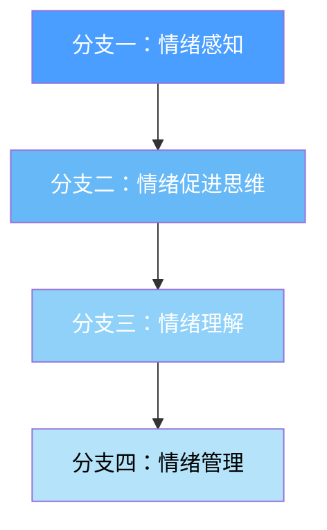
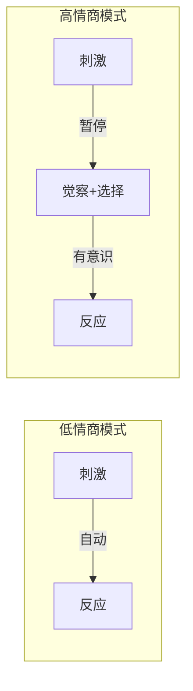
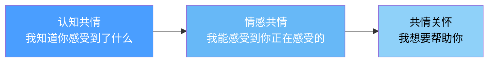
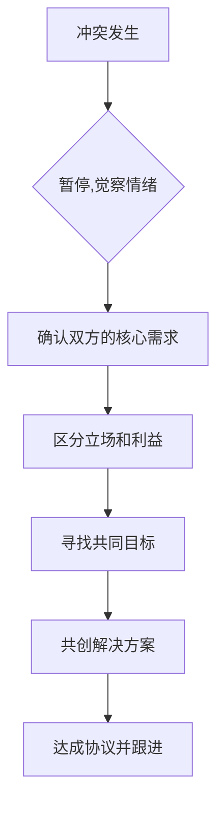
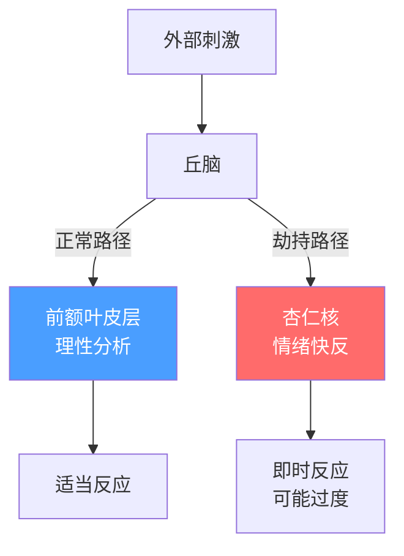
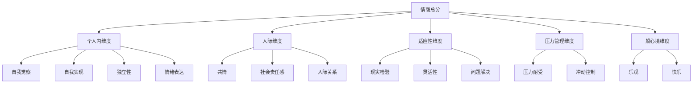

## 五、情商理论

情商（Emotional Intelligence，简称 EI 或 EQ）是理解人际关系、驾驭社交场域的核心理论框架。如果说智商决定了你能理解多复杂的问题，那么情商决定了你能处理多复杂的关系。本节从理论源流、核心模型、神经科学基础、测量工具、实操应用和发展路径六个维度，全面构建情商的知识体系。

### 5.1 情商理论的源流与演进

#### 5.1.1 概念的诞生

"情商"这个概念并非凭空出现，它经历了从学术边缘到大众流行的漫长演化：

| 时间 | 里程碑 | 关键人物 | 贡献 |
|------|--------|----------|------|
| 1920年 | 提出"社会智力"概念 | 爱德华·桑代克 | 首次将"理解他人、与人相处"的能力纳入智力范畴 |
| 1940年 | 提出"实践智力" | 大卫·韦克斯勒 | 认为非智力因素影响人的适应性行为 |
| 1983年 | 多元智能理论 | 霍华德·加德纳 | 提出"人际智能"和"内省智能"，为情商提供理论土壤 |
| 1990年 | 首次定义"情绪智力" | 彼得·萨洛维 & 约翰·梅耶 | 发表奠基性学术论文，正式定义 EI |
| 1995年 | 《情商》出版 | 丹尼尔·戈尔曼 | 将学术概念推向大众，引爆全球热潮 |
| 1997年 | 情商量表 EQ-i | 鲁文·巴昂 | 开发出首个标准化情商测量工具 |
| 2000-至今 | 不断修订与深化 | 多位学者 | 混合模型与能力模型之争持续至今 |

理解这条时间线很重要——它说明情商不是一个拍脑袋发明的概念，而是经过近百年学术积累后形成的理论体系。

#### 5.1.2 两大理论阵营

情商研究存在两个主要流派，它们的定义和测量方式截然不同：

**能力模型（Ability Model）**

萨洛维和梅耶提出的原始模型，将情商定义为一种认知能力——准确地感知、评价和表达情绪的能力。这个模型认为情商是"你实际能做到什么"，而非"你觉得自己能做到什么"。

核心特点：
- 情商是可以客观测量的能力
- 存在"正确答案"（比如某张脸确实表达的是悲伤而非愤怒）
- 使用 MSCEIT 等能力测验来评估
- 学术严谨性高，但大众传播度低

**混合模型（Mixed Model）**

戈尔曼和巴昂提出的模型，将情商定义为一系列人格特质、动机和社交能力的组合。这个模型认为情商是"你的整体情绪-社交素质"。

核心特点：
- 情商包含人格特质（如同理心、乐观）
- 通常使用自评量表测量
- 实用性强，大众易于理解
- 学术上存在"情商是否只是换了名字的人格特质"的争议

**两种模型的系统对比：**

| 对比维度 | 能力模型（Salovey & Mayer） | 混合模型（Goleman / Bar-On） |
|----------|---------------------------|----------------------------|
| 情商本质 | 认知能力 | 能力+人格+动机的综合体 |
| 测量方式 | 最大化测试（有正确答案） | 自评问卷（主观报告） |
| 代表工具 | MSCEIT 2.0 | EQ-i 2.0 / ESCI |
| 理论精度 | 高，边界清晰 | 低，"把好东西都叫情商" |
| 实用导向 | 偏学术研究 | 偏组织发展和个人成长 |
| 可训练性 | 能力部分可提升15-20% | 行为习惯可改变，但特质层较稳定 |
| 文化适用性 | 部分情绪识别有跨文化一致性 | 情商表现形式受文化影响大 |

两种模型之争并非无意义的学术游戏。它直接关系到：情商能不能被训练提升？如果情商是能力，那就像学数学一样可以训练；如果情商是人格特质，改变的难度就大得多。目前的共识是：情商兼有能力和特质的成分，能力部分可以通过训练提升约 15-20%。

### 5.2 核心模型详解

#### 5.2.1 萨洛维-梅耶四分支模型（能力模型）

这是情商最严谨的学术定义，包含四个按层级排列的分支：

**分支一：情绪感知（Perceiving Emotions）**

这是最基础的能力——准确识别自己和他人的情绪。

具体内容：
- 识别面部表情中的情绪（研究显示人类有超过 10,000 种可辨别的面部表情组合）
- 通过语调、语速、停顿识别他人情绪状态
- 识别自己身体中情绪的生理信号（心跳加速、肌肉紧张、呼吸变化）
- 在音乐、艺术、环境氛围中感知情绪基调

为什么这是基础？因为如果你连"对方正在生气"都识别不到，后续的共情、沟通、冲突管理全部无从谈起。社交中的大量问题，根源都在于情绪感知的迟钝。

感知力不足的典型表现：
- 别人已经明显不悦了，你还继续刚才的话题
- 不知道自己为什么突然烦躁（其实是身体在发出情绪信号）
- 误读他人的善意为恶意，或恶意为善意
- 在群体中感受不到紧张或尴尬的氛围

**分支二：情绪促进思维（Using Emotions to Facilitate Thought）**

这个分支讨论的是情绪如何帮助（而非阻碍）认知过程。

核心机制：
- **情绪作为信息信号**：恐惧告诉你有危险，好奇告诉你有学习机会
- **情绪调节注意力**：焦虑让你聚焦威胁，快乐让你拓宽注意力范围
- **情绪影响决策质量**：适度的情绪唤醒提升判断力，过度唤醒则损害判断力
- **情绪与创造力**：积极情绪扩大思维范围，促进创造性问题解决（Fredrickson 的"拓展-建构理论"）

拓展-建构理论（Broaden-and-Build Theory）的核心发现：积极情绪（如快乐、兴趣、满足、爱）能拓宽个体的瞬间思维-行动范畴，帮助建立持久的个人资源（身体资源、智力资源、社会资源、心理资源）。这意味着积极情绪不只是"感觉好"，它在认知层面有实际的功能性价值——让你看到更多可能性、建立更多连接、创造更多解决方案。

实操应用——利用情绪提升思考质量：
- 做重大决策前，先检查自己的情绪状态。如果你正处于愤怒或极度兴奋中，推迟决策
- 需要创造性方案时，先让自己进入积极情绪（看有趣的视频、回忆愉快的经历）
- 需要细致分析时，适度的焦虑反而有帮助（但不要过度）
- 学习新知识时，带着好奇和兴趣的情绪状态学习效率远高于厌烦状态

**分支三：情绪理解（Understanding Emotions）**

这个分支涉及理解情绪的复杂性——情绪的起因、变化规律和组合方式。

需要掌握的情绪知识：
- **情绪词汇的精确性**：英语中描述情绪的词超过 3,000 个，中文同样丰富。能精确命名情绪是理解情绪的前提。心理学中将这种能力称为"情绪颗粒度"（Emotional Granularity）——颗粒度越高，对情绪的分辨率越强。"我不开心"是低颗粒度，"我感到被忽视后的失落，夹杂着对自己是否不够好的怀疑"是高颗粒度。高情绪颗粒度的人在情绪调节、决策质量和人际关系上都表现更好
- **情绪的因果链**：A 事件 → B 认知解读 → C 情绪反应。同一事件，不同解读产生不同情绪。这就是 Albert Ellis 的 ABC 理论在情绪领域的应用
- **情绪的混合性**：复杂情绪由基础情绪混合而成。例如"又爱又恨"是爱与愤怒的混合，"悲喜交加"是快乐与悲伤的共存。日语中的"物の哀れ"（物哀）、德语中的"Schadenfreude"（幸灾乐祸）、中文中的"惆怅"都是难以用单一基础情绪描述的混合情感
- **情绪的转化规律**：愤怒可以转化为悲伤，恐惧可以转化为兴奋，焦虑可以转化为决心
- **情绪的时序模式**：某些情绪有典型的起承转合。例如，丧失后的悲伤通常经历库伯勒-罗丝的五阶段模型：否认→愤怒→讨价还价→抑郁→接受

Plutchik 情绪轮（Robert Plutchik, 1980）将人类情绪系统化地分为 8 对基础情绪：

| 基础情绪 | 与之对立的情绪 | 强度递进（弱→强） | 混合情绪示例 |
|----------|---------------|-------------------|-------------|
| 快乐（Joy） | 悲伤（Sadness） | 宁静→快乐→狂喜 | 快乐+信任=爱 |
| 信任（Trust） | 厌恶（Disgust） | 接纳→信任→敬佩 | 恐惧+惊讶=敬畏 |
| 恐惧（Fear） | 愤怒（Anger） | 忧虑→恐惧→恐慌 | 惊讶+悲伤=失望 |
| 惊讶（Surprise） | 预期（Anticipation） | 意外→惊讶→震惊 | 愤怒+厌恶=轻蔑 |
| 悲伤（Sadness） | 快乐（Joy） | 忧愁→悲伤→悲痛 | 恐惧+悲伤=绝望 |
| 厌恶（Disgust） | 信任（Trust） | 无聊→厌恶→憎恨 | 快乐+期待=乐观 |
| 愤怒（Anger） | 恐惧（Fear） | 烦躁→愤怒→狂怒 | 愤怒+期待=攻击性 |
| 预期（Anticipation） | 惊讶（Surprise） | 关注→预期→警觉 | 信任+快乐=爱慕 |

掌握 Plutchik 情绪轮的价值在于：当你感到"不舒服"时，可以通过这个框架精确地定位到底是哪种情绪——是焦虑（弱恐惧）还是恐慌（强恐惧）？是烦躁（弱愤怒）还是狂怒（强愤怒）？精确的定位是精确管理的前提。

情绪理解力不足的典型表现：
- 只能用"开心"和"不开心"两种状态描述自己的情绪
- 不理解为什么一件事让自己如此愤怒（背后真正的情绪可能是受伤或恐惧）
- 不明白他人情绪转变的原因
- 无法预测情绪的走向（比如不知道持续施压会导致对方从愤怒转为冷漠）

**分支四：情绪管理（Managing Emotions）**

这是最高级的能力——有意识地调节自己和他人的情绪状态。

自己情绪管理的核心策略：
- **认知重评（Cognitive Reappraisal）**：改变对事件的解读来改变情绪反应。被拒绝时，从"我不够好"重新解读为"这不匹配，省下了时间"。神经影像研究显示，认知重评能降低杏仁核的激活水平，同时增强前额叶皮层的活动——这不只是心理技巧，而是真正在改变大脑的处理方式
- **注意部署（Attentional Deployment）**：将注意力从引发负面情绪的刺激上转移开
- **反应调节（Response Modulation）**：在情绪已经产生后，调节行为表达方式。这包括表面行为的调节（在不想笑的场合保持微笑）和生理反应的调节（通过深呼吸降低心率）
- **情境选择与修改**：主动选择和改变引发情绪的环境。比如，你知道某个人总是让你焦虑，你可以减少与他共处的时间（情境选择），或者在不得不相处时提前做好心理准备（情境修改）

他人情绪管理的核心策略：
- **情绪传染管理**：你的冷静能感染他人冷静，你的焦虑也能传染焦虑。神经科学研究表明，情绪传染在很大程度上是自动发生的——通过镜像神经系统，周围人的情绪状态会"感染"你。这意味着管理自己的情绪状态不只是为了自己，也是在管理整个社交场域的情绪氛围
- **同理心回应**：让对方感受到被理解，情绪强度就会自然下降。有效的同理心回应格式："你感到____（情绪），是因为____（事件/原因），你希望____（需求）"
- **框架重构**：帮助他人用新的视角看待引发情绪的事件
- **情绪容器功能**：在他人情绪崩溃时提供稳定的存在感。温尼科特的"抱持性环境"（Holding Environment）概念描述的就是这种功能——你不需要解决对方的问题，只需要让他感到"有人在，我不会掉下去"

#### 5.2.2 戈尔曼五维度模型（混合模型）

戈尔曼的模型是大众最熟悉的版本，包含五个维度。这里将原来简略的介绍扩展为完整的分析框架：

**维度一：自我觉察（Self-Awareness）**

自我觉察是情商的基石。它的核心不是"知道自己的名字和年龄"，而是实时知道自己正在经历什么情绪、为什么经历这种情绪、这种情绪如何影响自己的判断和行为。

自我觉察的三个层次：

| 层次 | 描述 | 自检问题 |
|------|------|----------|
| 情绪觉察 | 能识别当前的情绪状态 | "我现在感受到的是什么？是愤怒、失望还是受伤？" |
| 准确自我评估 | 了解自己的优势、局限和价值 | "在这件事上，我的真实能力处于什么水平？" |
| 自信心 | 对自我价值的稳定感知 | "即使这次失败了，我对自己的基本评价是否动摇？" |

高自我觉察者的行为特征：
- 能够用精确的词汇描述自己的情绪状态，而不是笼统地说"不开心"或"烦"
- 知道自己在什么情境下容易情绪失控，并提前做准备
- 对自己的能力和局限有现实的评估，既不妄自菲薄也不盲目自信
- 能够区分"我现在的情绪状态"和"我这个人"——情绪是暂时的，不是身份标签
- 在做重要决策时会检查自己的情绪状态，避免情绪污染判断

低自我觉察的代价：
- 同一种情绪陷阱反复掉进去（比如每次都因为被忽视而愤怒，但从未意识到这是核心痛点）
- 在情绪驱使下做出后悔的行为
- 被他人操控而不自知（别人只要按你的"情绪按钮"就能控制你）
- 在职场中被评价为"不成熟"或"不稳定"

提升自我觉察的实操方法：

*方法一：情绪日记（推荐至少坚持 30 天）*

每天花 5 分钟记录以下内容：

日期：____
触发事件：____
我的情绪（用至少3个精确词汇）：____
情绪强度（1-10分）：____
身体反应：____
我的第一反应/冲动：____
我实际上做了什么：____
事后反思：____

坚持写情绪日记的人，在 4-6 周后通常会报告以下变化：情绪觉察速度提升（从"事后才知道自己生气了"变成"生气的当时就知道了"）；情绪词汇量增加；情绪对自己行为的控制力下降。

*方法二：正念觉察练习*

每天 10-15 分钟的正念冥想，专注于觉察自己的内在状态。具体做法：
1. 找一个安静的地方坐下，闭上眼睛
2. 将注意力放在呼吸上，感受空气进出身体
3. 当情绪或想法出现时，不要评判，只是注意到它："哦，焦虑出现了"
4. 观察这个情绪在身体中的位置和感觉（胸口发紧？胃部搅动？）
5. 不试图改变它，只是观察它，然后注意力回到呼吸上

正念练习为什么有效？哈佛大学 Sara Lazar 的研究发现，持续 8 周的正念冥想训练可以使前额叶皮层（负责理性决策和情绪调节的区域）的灰质密度增加，同时减少杏仁核（负责恐惧和压力反应的区域）的灰质密度。这意味着正念不只是"放松"，它在物理层面改变了大脑结构，增强了你的情绪调节硬件。

*方法三：身体扫描*

情绪总是先在身体中出现，然后才被大脑意识到。通过练习身体扫描，你可以在情绪还未完全"浮出水面"时就捕捉到它。

从头顶到脚趾，逐一注意每个部位的感觉。特别关注：下巴是否紧咬？肩膀是否耸起？胃部是否紧缩？手心是否出汗？这些都是情绪的早期信号。

*方法四：情绪标注（Affect Labeling）*

UCLA 的 Matthew Lieberman 的 fMRI 研究发现了一个反直觉的现象：当你用语言精确地标注自己的情绪（比如在心里说"我现在感到焦虑"），杏仁核的激活水平会显著下降。换句话说，"说出情绪的名字"本身就是一种情绪调节机制——它将情绪体验从自动化的、无意识的过程转变为有意识的、可控的过程。

实操做法：在情绪涌上来时，不要急着压制或行动，先在心里用一句话精确描述："我注意到我现在感到____，强度大约____，触发它的可能是____。"这个简单的行为能在 2-3 秒内降低情绪强度 20-30%。

**维度二：自我管理（Self-Regulation）**

自我管理不是"压制情绪"，而是"选择对情绪做出什么反应"。这是一个关键区别——压制情绪的人最终会爆发，而管理情绪的人能够灵活应对。

自我管理的五个子能力：

*能力一：情绪自制（Emotional Self-Control）*

在情绪风暴中保持行为不失控的能力。

关键机制——"情绪-反应间隙"：在刺激（S）和反应（R）之间创造一个间隙。普通人是 S→R（刺激直接触发反应），高情商者是 S→O→R（刺激 → 思考选择 → 有意识的反应）。

创造间隙的具体技术：
- **6 秒法则**：情绪的生化反应在体内持续约 6 秒。在情绪涌上来时，默数 6 秒再做反应。这 6 秒足以让前额叶皮层重新获得对杏仁核的控制
- **物理中断**：起身走动、喝口水、深呼吸三次。物理状态的改变能打断情绪的自动循环。背后的原理是：情绪和身体状态是双向影响的——改变身体状态（如从坐着变为走动）能改变情绪状态
- **自我对话**：在内心说"我注意到我现在很愤怒，我选择不在此刻做决定"
- **延迟反应**：非紧急情况下，告诉对方"我需要想一想，明天回复你"
- **4-7-8 呼吸法**：吸气 4 秒，屏息 7 秒，缓慢呼气 8 秒。这个比例激活副交感神经系统，物理性地降低心率和皮质醇水平

*能力二：值得信赖（Trustworthiness）*

保持诚实和行为一致性的能力。这不是道德说教，而是有实证基础的社交策略——信任的建立需要长期一致的行为积累，但摧毁只需要一次欺骗。

信任的"银行账户"模型：每次言行一致都是"存款"，每次言行不一都是"取款"。研究显示，信任建立的存款-取款比大约为 5:1——你需要 5 次一致行为才能弥补 1 次不一致行为造成的损害。这就是为什么一个"小谎言"的代价远比人们直觉认为的要大。

*能力三：尽责自律（Conscientiousness）*

能够自我管理、有责任感、对工作保持高标准。研究表明，尽责自律是预测工作绩效最稳定的人格因素之一（Barrick & Mount, 1991 元分析覆盖了 5 个大五人格维度、117 个研究、23,994 名被试，尽责性是唯一在所有职业中都显著预测绩效的维度）。

*能力四：适应力（Adaptability）*

面对变化、不确定性和压力时保持灵活的能力。

适应力不足的信号：当计划改变时感到强烈的烦躁或焦虑；对新事物的第一反应是抵触而非好奇；在模糊不清的情境中无法做出决定。

提升适应力的方法：
- 主动在日常生活中制造小变化（走不同的路线上班、尝试新餐厅）
- 将"意外"重新定义为"学习机会"而非"灾难"
- 练习在信息不完整的情况下做小决定，逐步提高对不确定性的耐受
- 采用"实验心态"——把每次变化当作一次实验，收集数据，而不是当作必须成功的赌注

*能力五：追求成就（Achievement Drive）*

不断追求卓越和改进的内在动力。有成就驱动力的人不会满足于"差不多就行"，他们设定有挑战性的目标，追踪进展，并在过程中不断调整方法。

成就驱动力的平衡：驱动不足导致平庸，驱动过度导致倦怠。关键的平衡点是"心流"（Csikszentmihalyi）——当任务挑战性略高于你的当前能力水平时，你既不会无聊也不会焦虑，而是进入一种高度专注、高效且享受的状态。

**维度三：社会意识（Social Awareness）**

社会意识的本质是"读取他人和环境的能力"。它的核心是共情，但不仅仅是共情。

共情的科学分层：

- **认知共情（Cognitive Empathy）**：理解他人的心理状态和观点。这是"头脑"层面的共情，相当于在脑中建立他人心理的模型。心理咨询师、谈判专家需要大量运用认知共情
- **情感共情（Emotional Empathy）**：在情感层面"镜像"他人的感受。看到朋友哭泣时自己也感到悲伤。这涉及镜像神经元系统的活动
- **共情关怀（Empathic Concern）**：不仅理解和感受，还产生了帮助对方的动机。这是共情的最高层次

三者的关系：认知共情告诉你"对方很痛苦"，情感共情让你"感受到对方的痛苦"，共情关怀促使你"去帮助对方减轻痛苦"。缺少认知共情，你可能根本不知道对方在痛苦；缺少情感共情，你可能知道但无动于衷；缺少共情关怀，你可能感受得到但不行动。

共情失衡的风险：
- 共情不足：被视为冷漠、自私，人际关系疏离
- 共情过度：情绪被他人"淹没"，出现"共情疲劳"（常见于医护人员、社工、心理咨询师）
- 健康的共情：能够理解他人感受，保持适当的情感边界，知道"你的痛苦我理解，但我不需要替你承受"

**共情与同情的区别**——这个区分非常重要但经常被混淆：
- 共情（Empathy）：我进入你的世界，从你的视角理解你的感受。"我能理解你现在的感受，这确实很痛苦"
- 同情（Sympathy）：我站在自己的世界里，对你的处境表示遗憾。"你真可怜，希望你能好起来"
- 共情建立连接，同情制造距离。Brené Brown 在她的 TED 演讲中用一个动画形象地说明了这个区别：共情是"爬到洞口旁边，告诉对方我知道下面是什么感觉"；同情是"站在洞口边往下喊'嘿，你看起来不太好'"

共情的"去中心化"（Decentering）能力：暂时搁置自己的观点、价值观和情绪状态，真正从对方的框架理解世界。这不意味着你认同对方的观点，而是你能够"穿对方的鞋子走一段路"。去中心化能力不足的人，在试图"安慰"别人时总是变成"说教"或"比较"（"你这不算什么，我当年更惨……"）。

提升共情能力的训练方法：

*训练一：深度倾听*

大多数人听别人说话时，脑子里在做的事情是：准备自己的回答、评判对方说的话、回忆自己的相关经历。这些都不是真正的倾听。

深度倾听的操作标准：
- 对方说话时，放下手机，保持眼神接触
- 不要在脑子里准备反驳或建议
- 关注对方话语背后的情绪，而不只是内容
- 用自己的话复述对方的意思："你是说，你感到在团队中被忽视了？"
- 提出开放式问题，邀请对方继续表达
- 注意沉默——有时候对方停顿不是说完了，而是在犹豫要不要说更深的东西。给沉默留空间

Carl Rogers 的"无条件积极关注"（Unconditional Positive Regard）是深度倾听的底层态度：不管对方说什么，先假设他有合理的理由这样感受。这不是要你认同所有行为，而是在倾听阶段暂时搁置评判。

*训练二：微表情与非语言信号识别*

社交中超过 60% 的信息通过非语言通道传递（Albert Mehrabian, 1971——虽然这个具体比例常被过度简化，但非语言通道的重要性是确证的）。需要训练识别的信号包括：

| 信号类型 | 具体表现 | 可能含义 |
|----------|----------|----------|
| 面部 | 眉毛快速上扬 | 惊喜或认出对方 |
| 面部 | 嘴角单侧上抬 | 可能是轻蔑或讽刺 |
| 面部 | 真笑 vs 假笑 | 真笑涉及眼轮匝肌收缩（鱼尾纹），假笑只有颧大肌活动 |
| 眼神 | 回避目光接触 | 不安、害羞或隐藏 |
| 眼神 | 瞳孔放大 | 兴趣、兴奋或恐惧 |
| 眼神 | 眨眼频率升高 | 紧张或认知负荷大 |
| 手臂 | 交叉双臂 | 防御、不舒服或只是冷 |
| 手部 | 手指敲击/抖腿 | 不耐烦或焦虑 |
| 身体 | 身体朝向出口 | 想离开、不感兴趣 |
| 身体 | 身体前倾 | 兴趣、投入 |
| 语调 | 语速突然加快 | 紧张或想掩饰什么 |
| 语调 | 声调升高 | 可能在说谎或情绪激动 |
| 语调 | 音量降低 | 不自信或想引人靠近 |

注意：这些信号不是"读心术"，不能单一信号下结论。需要结合情境、多个信号、基线行为来综合判断。每个人的基线行为不同——有些人天生就回避眼神接触，这不意味着他们总在隐藏什么。关键是在观察到偏离基线的变化时才做出判断。

*训练三：情境练习*

在日常生活中有意识地练习"读取"他人：
- 在咖啡馆观察周围的人，猜测他们的情绪状态和关系
- 看电影或访谈时关掉声音，仅通过画面判断人物情绪
- 与人交流后，回顾对方的非语言信号，验证自己的解读是否准确
- 观看辩论或脱口秀，注意说话者如何通过非语言信号增强或削弱自己的话

*训练四：角色互换冥想*

在一段互动结束后，闭上眼睛，想象自己变成对方。从对方的视角重新"回放"刚才的对话：他在那个时刻会怎么想？他会有什么感受？他为什么会那样回应？这个练习能有效地训练去中心化能力。

**维度四：关系管理（Relationship Management）**

关系管理是情商的"输出端"——将前面三个维度的能力综合运用到实际的人际互动中。

关系管理的六大核心技能：

*技能一：影响力*

影响力不等于操控。影响力是在理解他人需求的基础上，找到共同利益点，引导对方自愿做出改变。

影响力公式：影响力 = 信任 × 清晰度 × 相关性

- 信任：对方相信你是为双方利益而非只为自己
- 清晰度：你能清楚表达观点和理由
- 相关性：你所说的内容与对方的需求和关注点相关

影响力策略的六原则（Robert Cialdini）：
1. **互惠**：先给予，再请求。在请求帮助前，先为对方提供价值
2. **承诺与一致**：让对方先做出小承诺，逐步升级（登门槛效应）
3. **社会认同**：展示"其他人也在这么做"（但要真实，不要伪造）
4. **喜好**：人们更容易被自己喜欢的人影响。共同点、真诚赞美、合作经历都能提升喜好度
5. **权威**：专业知识和可信背书增强说服力
6. **稀缺**：人们更珍惜稀有的东西。但在人际关系中，虚假的稀缺感（故意制造紧迫感）会损害信任

*技能二：冲突管理*

高情商者处理冲突的方式：

关键原则：
- 对事不对人。"这个方案有问题"而非"你怎么想出这种方案"
- 先处理情绪，再处理问题。在双方情绪激动时，任何逻辑分析都是白费
- 寻找"双赢"而非"零和"。大多数冲突中，双方的核心利益并不矛盾，矛盾的是表面立场
- 掌握"果断而友善"的沟通方式——清晰表达自己的需求和边界，同时尊重对方的需求和边界

Thomas-Kilmann 冲突模式工具（TKI）识别五种冲突处理风格：

| 风格 | 特征 | 适用场景 | 风险 |
|------|------|----------|------|
| 竞争（高自信+低合作） | 坚持自己立场，不顾对方 | 紧急决策、原则性问题 | 损害关系 |
| 合作（高自信+高合作） | 寻找双赢方案 | 重要关系、复杂问题 | 耗时长 |
| 妥协（中自信+中合作） | 各让一步 | 时间紧迫、旗鼓相当 | 双方都不完全满意 |
| 回避（低自信+低合作） | 退出或搁置冲突 | 问题不重要、需要冷静 | 问题积累 |
| 迁就（低自信+高合作） | 优先满足对方 | 对方更对、维护关系比赢更重要 | 自己的需求被忽视 |

高情商者不是固定使用某一种风格，而是根据情境灵活切换。在原则性问题上果断竞争，在重要关系上积极合作，在琐碎小事上适度迁就。

*技能三：团队合作*

高情商团队合作者的行为模式：

- **情绪劳动的主动承担**：在团队低迷时鼓舞士气，在紧张时缓和气氛，在有人被忽视时主动邀请他们发言。这种"情绪劳动"往往不被看见，但它是团队凝聚力的关键黏合剂
- **差异的整合而非消除**：不同性格和工作风格的人在一起必然有摩擦。高情商的团队合作者不是要求所有人都变成一样，而是找到让不同风格互补的方式。比如，让细致的人负责质检，让大胆的人负责开拓
- **建设性反馈文化**：在团队中建立"反馈是礼物"的文化。给出反馈时使用 SBI 模型：Situation（情境）→ Behavior（行为）→ Impact（影响）。"在昨天的客户会上（情境），你打断了同事的发言三次（行为），这让他看起来不太自信，客户也可能注意到了（影响）"
- **信任的日常积累**：在小事上守信用（按时完成自己的部分）、主动补位（同事忙不过来时帮忙）、坦诚沟通（有问题当面说而非背后抱怨）

*技能四：领导力*

情商对领导力的贡献并非戈尔曼所说的"85-90%"那么夸张（那个数据的样本和方法论受到质疑），但大量研究确实表明情商是区分优秀领导者和普通领导者的重要因素。

高情商领导力的核心行为：

- **情绪设定**：领导者的情绪状态对团队有放大效应。一个焦虑的领导者会让整个团队焦虑，一个平静自信的领导者能让团队保持稳定。这不是说领导者不能有负面情绪，而是需要意识到自己的情绪对团队的影响
- **个性化管理**：了解每个团队成员的核心动机和情绪触发点。有人需要认可，有人需要自主权，有人需要安全感。用同一套方式管理所有人是低情商的表现
- **心理安全感的建设**：Google 的"亚里士多德项目"（Project Aristotle）研究发现，高效团队最重要的特征是心理安全感——团队成员能够安全地表达不同意见、承认错误、提出问题，而不用担心被惩罚。建设心理安全感是领导者的高情商核心任务
- **反馈的给予与接收**：给予反馈时平衡直接与关怀，接收反馈时保持开放而非防御

*技能五：变革催化*

组织变革中的情商应用。变革为什么失败？John Kotter 的研究显示，70% 的组织变革失败，首要原因不是技术或策略问题，而是人的因素——恐惧、抵触、不理解、缺乏参与感。

高情商的变革催化策略：
- **先理解抵触的情绪根源**：人们对变革的抵触通常不是因为"懒"或"固执"，而是因为变革触发了不安全感（"我还能胜任吗？"）、丧失感（"我失去的比得到的多"）和对未知的恐惧
- **创造"变革紧迫感"而非"变革恐惧"**：让人们理解"不变的风险"大于"变的风险"，但不要制造恐慌
- **找到并赋能"早期采用者"**：不需要说服所有人同时改变。先找到愿意尝试的人，让他们成为变革的代言人
- **庆祝小胜利**：变革是漫长的。在过程中不断展示进展和成功案例，维持动力

*技能六：建立联系和维护人脉网络*

高情商的人脉建设不是"社交牛逼症"式的广撒网，而是有策略地建立和维护有意义的关系。

人脉网络的三个圈层：
1. **核心圈（5-10人）**：至亲好友和深度信任的同事。投入大量时间维护，频率高、深度深
2. **中间圈（30-50人）**：经常互动的同事、合作伙伴、朋友。定期维护，每1-2个月至少一次有意义的互动
3. **外围圈（150-300人）**：弱连接——前同事、行业认识的人、社交场合认识的人。弱连接在信息获取和机会发现上比强连接更有价值（Granovetter 的"弱连接的力量"理论）

维护人脉的高情商行为：
- **给予而非索取**：在人脉关系中最有效的方式是先提供价值——分享有用的信息、介绍合适的人、在对方需要时提供帮助
- **记住细节**：记住对方分享过的重要事情（家人的名字、正在做的项目、面临的挑战），在后续互动中自然提及
- **定期"无目的"联络**：不要只在需要帮忙时才联系人。定期的、无目的的问候和分享比请求帮助时的寒暄更有价值
- **真诚而非套路**：人脉维护的终极原则是真诚。你能记住 50 个人的生日，但如果你记得的原因是"社交策略"而非"你真的在意"，对方能感觉到

**维度五：自我激励（Motivation）**

戈尔曼模型中第五个维度——内在驱动力。这个维度在原文中没有展开，但它与前四个维度同等重要。

自我激励的四个要素：
1. **成就驱动**：设定有挑战性的目标，并从达成目标中获得满足感
2. **承诺**：对个人和组织目标的认同和投入
3. **主动性**：在问题出现之前就采取行动，而非被动等待
4. **乐观**：即使面对失败也保持"可以从中学习和改善"的信念

乐观不是盲目的"正能量"，而是 Martin Seligman 定义的"习得性乐观"——面对挫折时，将失败归因为暂时的（"这次不行"而非"永远不行"）、特定的（"这件事不行"而非"我什么都不行"）、外部的（"条件不够"而非"我不够好"）。与之对应，"习得性悲观"将失败归因为永久的、普遍的、内在的——这种归因模式是抑郁和放弃的温床。

### 5.3 情商的神经科学基础

理解情商的生物学机制，能帮助你更有信心地相信"情商可以改变"。

#### 5.3.1 杏仁核劫持（Amygdala Hijack）

这是戈尔曼提出的最著名的神经科学概念。

正常情况下的信息处理路径：外部刺激 → 丘脑 → 前额叶皮层（理性分析）→ 适当反应

高压力下的信息处理路径：外部刺激 → 丘脑 → 杏仁核（情绪快速反应）→ 即时反应（跳过理性分析）

"杏仁核劫持"发生时的特征：
- 反应速度极快（几毫秒内）
- 反应强度往往不成比例（小事引发大反应）
- 事后自己也觉得"反应过度了"
- 身体出现明显的战斗-逃跑反应（心跳加速、出汗、肌肉紧张）

常见的劫持触发器：
- 被当众批评或羞辱
- 感到被不公平对待
- 核心信念或价值观被挑战
- 感到被忽视或被排斥
- 深层恐惧被激活（如怕被抛弃、怕失败、怕无能）

应对杏仁核劫持的实操训练：
1. **识别个人劫持模式**：通过情绪日记找到反复出现的"高触发"情境。每个人都有自己的"按钮"——知道自己的按钮在哪里，是避免被按下的前提
2. **建立预案**：提前计划在触发情境中要做什么（比如"被批评时先深呼吸三次"）。预案的价值在于：在杏仁核劫持发生时，前额叶皮层已经离线，你无法临时思考应对策略——但如果策略已经是习惯，它可以自动执行
3. **渐进暴露练习**：在安全环境中逐步练习面对触发情境。像脱敏疗法一样，从小剂量的触发开始，逐渐增加强度
4. **日常正念训练**：长期的正念练习能增厚前额叶皮层，增强理性控制能力
5. **生理调节**：当劫持发生时，4-7-8 呼吸法、冷水洗脸（触发潜水反射，激活副交感神经）、紧握拳头再放开（肌肉放松法）都能物理性地降低情绪强度

#### 5.3.2 镜像神经元与共情

1990 年代在意大利帕尔马大学发现的镜像神经元，为我们理解共情提供了生物学基础。

工作原理：当你看到别人做某个动作（比如拿起杯子），你大脑中"负责自己做这个动作"的神经元也会放电。同样，当你看到别人的表情和情绪时，你大脑中"负责产生这种情绪"的区域也会部分激活。

这意味着：共情不只是"理性地推测他人感受"，而是在神经层面"自动模拟"他人的状态。

镜像神经元系统的个体差异可以解释：为什么有些人天然就善于共情，而有些人需要有意识地训练。

但需要注意：镜像神经元不是"共情的全部"。共情是多脑区协同的结果，涉及前脑岛（感受自身和他人身体状态）、前扣带回（处理情绪冲突）、颞顶联合区（理解他人意图和信念）等多个区域。过度简化为"镜像神经元=共情"是流行心理学中的常见错误。

#### 5.3.3 前额叶皮层——情商的"硬件基础"

前额叶皮层（Prefrontal Cortex, PFC）是人类大脑最后成熟的区域——要到 25 岁左右才完全发育。这解释了为什么青少年的情绪管理能力普遍较弱——不是他们不想控制，而是硬件还没建好。

前额叶皮层在情商中的核心功能：
- **抑制杏仁核的冲动反应**：这是"情绪自制"的神经基础
- **工作记忆**：在情绪激活时仍然能保持对目标的追踪（"我现在很生气，但我记得我的目标是解决问题而非发泄"）
- **认知灵活性**：在不同情境间灵活切换应对策略
- **心理化（Mentalizing）**：理解他人的心理状态（心智理论，Theory of Mind）

前额叶皮层的可训练性：通过持续的认知训练和正念练习，前额叶皮层的功能可以增强。这是"情商可以通过训练提升"的神经科学依据。

#### 5.3.4 迷走神经与情绪弹性

迷走神经（Vagus Nerve）是连接大脑和身体内脏的最长脑神经。Stephen Porges 的多迷走神经理论（Polyvagal Theory）揭示了它在情绪调节中的关键作用：

- **迷走神经张力高**（通过心率变异性 HRV 测量）的人，情绪恢复能力强——在压力事件后能更快回到平静状态
- **迷走神经张力低**的人，更容易陷入焦虑和情绪失调
- **提升迷走神经张力的方法**：深而慢的腹式呼吸（呼气时间长于吸气）、冷水刺激、规律的有氧运动、正念冥想、社交连接（积极的面对面互动本身就能激活迷走神经）

这意味着情商不只是"心理"层面的事——你的身体状态直接影响你的情绪调节能力。保持规律运动、良好睡眠和呼吸训练，是在为情商提供更好的"硬件环境"。

#### 5.3.5 神经可塑性——情商能改变的科学依据

神经可塑性（Neuroplasticity）是大脑根据经验改变自身结构和功能的能力。这是"情商可以通过训练提升"的终极科学依据。

关键发现：
- 伦敦出租车司机的海马体（负责空间记忆）比普通人更大——这是多年导航训练的结果（Maguire 等, 2000）
- 正念冥想者的前额叶皮层更厚、杏仁核更小（Lazar 等, 2005）
- 社交技能训练可以改变社交脑网络的功能连接模式
- 即使是成年人，大脑仍然保持着显著的可塑性——只是改变的速度比儿童慢

这对情商训练的启示：你不是在和固定的"天赋"对抗，你是在利用大脑的可塑性来重塑自己的情绪处理模式。每一次有意识的情绪练习，都是在强化新的神经通路。重复足够多次后，新的模式会变成默认模式。

### 5.4 情商的测量与评估

#### 5.4.1 主要测量工具

| 工具名称 | 开发者 | 类型 | 测量方式 | 适用场景 | 信效度 |
|----------|--------|------|----------|----------|--------|
| MSCEIT 2.0 | Mayer, Salovey, Caruso | 能力型 | 有正确答案的情绪任务 | 学术研究、精确评估 | 内部一致性 α=.91 |
| EQ-i 2.0 | Reuven Bar-On | 混合型 | 自评问卷 | 组织发展、个人发展 | 测试-重测信度 r=.89 |
| ESCI | Daniel Goleman | 混合型 | 360度评估 | 领导力发展 | 360度多视角减少偏差 |
| TEIQue | K.V. Petrides | 特质型 | 自评问卷 | 学术研究 | 覆盖面广 |
| WLEIS | Wong & Law | 能力型 | 自评问卷 | 快速筛查 | 简短高效 |

#### 5.4.2 巴-昂模型（Bar-On Model）

鲁文·巴-昂的模型是混合模型中最具系统性的版本，包含 5 个复合维度和 15 个子维度：

巴-昂模型的独特贡献在于它将"一般心境"（乐观和快乐）作为情商的独立维度——这暗示了一个重要观点：你的情绪基调（你倾向于乐观还是悲观）本身就是情商的一部分，而不只是情商的"结果"。

#### 5.4.3 自我评估框架

如果暂时不想做正式的标准化测试，可以用以下框架快速自评：

对每个维度，按 1-10 分评估自己的水平：

**自我觉察（满分 10 分）**
- 我能在情绪出现时立刻识别它（1-10）：____
- 我知道自己在什么情况下容易情绪失控（1-10）：____
- 我对自己的优势和局限有准确的评估（1-10）：____

**自我管理（满分 10 分）**
- 我能在压力下保持冷静（1-10）：____
- 我能控制冲动，不在情绪驱使下做决定（1-10）：____
- 我能从挫折中快速恢复（1-10）：____

**社会意识（满分 10 分）**
- 我能准确感知他人的情绪状态（1-10）：____
- 我能理解不同人看问题的不同角度（1-10）：____
- 我能读懂一个群体的情绪氛围（1-10）：____

**关系管理（满分 10 分）**
- 我能建设性地处理冲突（1-10）：____
- 我能有效地影响和激励他人（1-10）：____
- 我有健康、持久的人际关系（1-10）：____

**自我激励（满分 10 分）**
- 即使面对失败，我仍能保持行动力（1-10）：____
- 我为自己设定有挑战性的目标（1-10）：____
- 我的驱动力来自内在而非外部评价（1-10）：____

总分解读：
- 45-38 分：情商基础扎实，继续保持并精进薄弱维度
- 37-30 分：有基本的情商素养，某些维度需要重点提升
- 29-23 分：多个维度有提升空间，建议系统性训练
- 22 分以下：强烈建议投入时间进行情商系统训练

### 5.5 情商在社交场景中的应用

#### 5.5.1 初次见面与第一印象

高情商者在初次见面中的行为模式：

**见面前三秒——情绪扫描**
- 快速观察对方的情绪状态（放松？紧张？防备？好奇？）
- 根据对方状态调整自己的能量级别（对方紧张时稍微放慢节奏，对方兴奋时匹配能量）

**建立连接的五个高情商动作**
1. 真诚微笑（杜乡微笑——眼角有鱼尾纹的笑，而非仅嘴角上扬的社交微笑）
2. 名字记忆（听到名字后立即在对话中使用一次）
3. 适度镜像（自然地模仿对方的姿态、语速、用词习惯）
4. 好奇提问（"你是怎么开始做这个的？"比"你是做什么的？"更能打开话题）
5. 共同点标记（发现共同兴趣或经历时，明确说出来："太巧了，我也……"）

**低情商的常见初次见面行为**
- 自己说个不停，不给对方空间
- 过早谈论有争议的话题
- 不断看手机或环顾四周
- 过度自我贬低或过度自我吹嘘
- 不注意对方已经给出的"想换话题"或"想结束"信号

#### 5.5.2 关系维护与深化

关系维护中的高情商行为：

**日常维护**
- 记住对方分享过的重要细节（生日、家人、爱好、正在面临的挑战），在后续互动中自然提及
- 在对方需要时提供适当的支持——"适当"是关键，过度关心是负担
- 表达具体的欣赏而非泛泛的赞美（"你今天在会上提出的那个方案很巧妙"优于"你真厉害"）
- 保持稳定、可预测的联系频率，而非忽冷忽热
- 主动分享自己的脆弱面——适度的自我暴露能加速信任建立。心理学中的"自我暴露对等原则"（Reciprocal Self-Disclosure）表明：当你分享一个适度私密的信息，对方通常也会分享一个对等程度的信息，关系因此加深

**冲突中的高情商表现**
- 冲突前：觉察到自己的情绪升级信号，主动暂停
- 冲突中：使用"我"语句表达感受（"我感到被忽视了"而非"你总是忽视我"）
- 冲突后：主动修复关系，不冷战，不翻旧账
- 给关系"留白"——不是所有问题都需要立刻解决。有时候"先放一放"比"非要现在说清楚"更明智

#### 5.5.3 亲密关系中的情商

亲密关系是情商应用最复杂也最重要的场景——因为亲密关系中情绪暴露程度最高、触发点最多、伤害最容易发生也最深刻。

**依恋理论与情商的交叉**（John Bowlby & Mary Ainsworth）：

| 依恋类型 | 情商表现 | 在关系中的模式 | 成长方向 |
|----------|----------|---------------|----------|
| 安全型 | 情商自然发展好 | 能坦诚表达需求，能容忍冲突，信任对方 | 保持并精进 |
| 焦虑型 | 情绪感知过度敏感 | 害怕被抛弃，需要频繁确认，容易情绪化 | 学会自我安抚，降低对确认的依赖 |
| 回避型 | 情绪表达不足 | 害怕亲密，习惯性独立，在关系紧张时退缩 | 练习表达脆弱，学会依赖他人 |
| 混乱型 | 情绪管理最困难 | 既渴望亲密又害怕受伤，行为模式矛盾 | 专业心理支持 + 系统情商训练 |

**亲密关系中的高情商行为**：
- **表达需求而非抱怨**："我希望我们每周能有一次深入的对话"优于"你从来不和我说心里话"
- **在情绪风暴中选择暂停**："我现在情绪很激动，我需要 30 分钟冷静一下，然后我们再谈"。注意：要给出明确的回来时间，否则暂停会被对方解读为"冷暴力"
- **修复尝试的敏感性**：John Gottman 的研究发现，成功的关系不是没有冲突，而是双方对"修复尝试"（Repair Attempts）保持敏感——一个玩笑、一个拥抱、一句"对不起我说重了"、一个让步的姿态。在冲突中能否识别和接受修复尝试，是预测关系质量最强的单一指标
- **情绪安全的维护**：在关系中，每个人都有"情绪安全区"——某些话题、表达方式或行为模式会让他们感到不安全。高情商的伴侣会了解并尊重对方的安全区

#### 5.5.4 亲子教育中的情商

父母的情商水平直接影响孩子的情商发展。研究表明，父母对孩子情绪的回应方式（情绪辅导，Emotion Coaching，John Gottman）是预测孩子情商发展的最重要因素之一。

**四种父母情绪回应模式**：

| 回应模式 | 描述 | 对孩子的影响 |
|----------|------|-------------|
| 情绪辅导型 | 接纳情绪，帮助命名，引导解决 | 情商最高，情绪调节能力好 |
| 情绪忽视型 | 忽视或淡化孩子的情绪 | 孩子学会压抑情绪 |
| 情绪否定型 | 否定或惩罚情绪表达 | 孩子对情绪感到羞耻 |
| 欠缺型 | 自身情绪管理能力不足 | 孩子缺乏情绪榜样 |

**情绪辅导的五个步骤**（Gottman）：
1. **觉察孩子的情绪**：注意孩子情绪变化的信号（行为变化、身体语言、语言表达）
2. **把情绪时刻视为连接和教育的机会**：孩子发脾气不是"麻烦"，而是学习情绪管理的"教学时刻"
3. **带着共情去倾听**：蹲下来，平视孩子，用平静的声音确认他的感受："你很生气，因为玩具被抢走了"
4. **帮助孩子命名情绪**："这种感觉叫做'失望'。你本来很期待去公园，但是下雨了，所以你感到失望"
5. **一起探索解决方案**："你有什么办法能让自己的心情好起来？"——引导孩子自己想出应对策略，而非直接给答案

#### 5.5.5 职场中的情商应用

戈尔曼的研究数据：在高层领导力中，情商贡献了领导力差异的 85-90%。但这个数据需要放在合适的语境中理解——这是针对"已经是高层领导"的群体，他们已经通过了智商和技术能力的筛选。

更实际的职场情商应用：

**向上管理**
- 读懂上级的情绪状态和压力来源
- 在合适的时机提出请求和建议（上级刚被批评时不是好时机）
- 管理上级对你的预期——承诺少一点，交付多一点
- 了解上级的沟通偏好和决策风格，用他能接受的方式沟通

**横向协作**
- 识别同事的工作风格偏好（有人喜欢详细沟通，有人喜欢简洁直接）
- 在合作中主动承担情绪劳动（比如在团队低迷时鼓舞士气）
- 处理竞争关系时保持专业和友善
- 在跨部门协作中，理解每个部门的核心压力和KPI，找到利益共同点

**向下管理**
- 了解每个团队成员的核心动机和情绪触发点
- 在批评前先给予肯定（"三明治反馈法"——但要注意不要让它变成套路）
- 在团队犯错时保持冷静，分析问题而非追究责任
- 给下属"情绪空间"——允许他们在安全范围内表达不满和困惑

**面试和谈判中的情商**
- 面试中观察面试官的非语言信号，调整自己的表达节奏
- 谈判中识别对方的"真正关注点"（往往不在说出来的诉求中）
- 在压力面试中保持冷静，把"刁难"理解为"压力测试"而非人身攻击
- 在薪资谈判中管理自己的锚定效应——先了解市场行情，避免被对方的初始报价锚定

#### 5.5.6 数字时代的情商挑战

在文字消息、社交媒体和远程工作主导的交流环境中，情商面临独特的挑战：

**线上沟通中的情商缺失**
- 文字消息丢失了 90% 以上的非语言信息（语调、面部表情、身体语言），导致误解率大幅上升
- 异步沟通（邮件、消息）中的"读了不回"会被自动解读为负面意图（"他是不是生气了？"），而实际上对方可能只是在忙
- 社交媒体的"表演性"让人习惯展示理想化的自我，削弱了真实的情绪连接
- 线上冲突升级更快——因为没有面对面的情绪信号来"刹车"

**数字沟通中的高情商实践**：
- **重要对话选择通道**：复杂或敏感的话题用视频/电话而非文字消息。文字适合信息传递，不适合情感交流
- **文字中的情绪显式化**：在文字中主动标注情绪状态（"我这会儿有点沮丧，但不是对你的"），因为文字无法自动传递情绪
- **不要在线上冲突中即时反应**：看到让你愤怒的消息时，等至少 30 分钟再回复。把草稿写下来但不发送，过一阵再看是否还这么想
- **表情符号的合理使用**：在适当场景中使用表情符号来补充文字缺失的情绪信息（但注意场合——正式工作邮件中少用）
- **给"沉默"留空间**：不要因为对方"已读不回"就焦虑地追发消息。给对方处理信息和情绪的时间

#### 5.5.7 跨文化情商

情绪的表达规则在不同文化中有显著差异——同样的情商行为在一种文化中被视为得体，在另一种文化中可能被视为冒犯。

| 维度 | 高语境文化（如中国、日本） | 低语境文化（如美国、德国） |
|------|--------------------------|--------------------------|
| 情绪表达 | 倾向含蓄、间接 | 倾向直接、外显 |
| 冲突处理 | 避免正面冲突，重视"面子" | 直接讨论问题，"对事不对人" |
| 建立关系 | 先建立信任和关系，再谈事情 | 先完成事情，关系自然建立 |
| 反馈方式 | 先肯定再委婉指出问题 | 直接指出问题，有时当众 |
| 权力距离 | 尊重等级，不对上级直接表达不满 | 鼓励向任何人表达不同意见 |

跨文化情商的核心能力：
- **文化觉察**：了解自己的文化假设和偏见
- **暂停判断**：在遇到"奇怪"的行为时，先假设这是文化差异而非个人缺陷
- **观察学习**：在当地文化中，先观察再行动，学习当地人的情绪表达规则
- **灵活调整**：根据文化环境调整自己的沟通方式和情绪表达程度

### 5.6 情商发展路径与训练体系

#### 5.6.1 四步发展法（深化版）

**第一步：觉察——从"不知不觉"到"后知后觉"**

大多数人对自己的情绪处于"不知不觉"状态——情绪已经影响了行为，自己却浑然不知。

目标：从"不知不觉"进步到"后知后觉"（事后能反思自己刚才的情绪状态），这是第一阶段可实现的目标。

具体训练：
- 每天三次"情绪检查"（早上起床后、午餐后、睡前）：闭上眼睛，问自己"我现在感受到什么？"
- 建立"情绪-身体"映射表：记录每种情绪对应的身体反应
- 扩展情绪词汇：学习和使用更精确的情绪词汇（参考 Plutchik 情绪轮，将情绪细分为 8 类 32 种）
- 设置"情绪闹钟"：每天在随机时间响铃，响铃时立即记录当前的情绪状态。这能训练你在日常生活中主动觉察情绪，而非只在"特意检查"时才觉察

**第二步：接纳——从"评判情绪"到"允许情绪"**

很多人在觉察到自己的情绪后，会立即加上评判："我不应该生气""感到嫉妒太小气了""这么焦虑说明我太脆弱"。

接纳不等于认同行为，而是承认情绪的存在。"我此刻感到嫉妒"是事实描述，"我不应该嫉妒"是价值评判。事实描述不消耗心理能量，价值评判则创造内耗。

训练方法：
- 当负面情绪出现时，对自己说："我注意到____（情绪名）出现了。这是正常的人类情感。"
- 将情绪想象成天气——你不会因为下雨而责怪自己，你只是知道"现在在下雨"
- 练习区分"感受"和"行为"——感到愤怒是允许的，打人是不允许的
- 记住 ACT（接纳承诺疗法）的核心原则：接纳情绪 ≠ 被情绪控制。你可以带着恐惧去做该做的事，带着焦虑去完成该完成的任务

**第三步：理解——从"知道是什么"到"知道为什么"**

理解情绪的深层机制——触发因素、背后的信念和需求、与过去经历的关联。

关键工具——"向下箭头"技术：
1. 写下引发强烈情绪的事件
2. 问自己："这个事件让我有什么想法？"
3. 对这个想法问："如果这是真的，这意味着什么？"
4. 继续追问，直到触及核心信念

示例：
- 事件：同事没回复我的消息 → 情绪：焦虑
- 想法："他是不是对我有意见？" → "如果有意见意味着什么？"
- 深层信念："那说明我不被重视" → "不被重视意味着什么？"
- 核心信念："说明我不够好/不值得被在乎"

找到核心信念后，你才能真正理解"为什么一件小事会让我如此焦虑"——不是因为同事没回消息，而是因为这个事件触发了你"我不够好"的深层恐惧。

理解的核心工具还包括：
- **情绪时间线**：回顾过去 10-20 年中对你影响最大的情绪事件，标注每个事件带来的情绪反应和你学到的"情绪规则"（比如"在小学被嘲笑后，我学会了不在人前表现脆弱"）。很多当前的情绪模式，根源在很久以前
- **家庭情绪地图**：观察你原生家庭中每个人的情绪表达模式——谁压抑、谁爆发、谁用情绪操控。你很可能在无意识中继承了某些模式

**第四步：管理——从"被动反应"到"主动选择"**

在前三步的基础上，有意识地选择自己的情绪反应。

这一阶段的核心能力：
- 在触发情境中创造"情绪-反应间隙"
- 根据情境选择合适的表达方式（不是所有情绪都需要表达）
- 在长期训练后，某些管理策略会变成自动化的习惯
- 学会"战略性情绪表达"——在合适的时机、以合适的方式、对合适的人表达合适的情绪

进阶——从"管理自己的情绪"到"管理关系中的情绪"：
- 从个人情商发展到"关系情商"——意识到情绪不是一个人的事，它在关系中产生、在关系中传递、在关系中被调节
- 学会"情绪领导力"——在团队或群体中，主动承担情绪管理的责任

#### 5.6.2 常见训练障碍与突破策略

| 障碍 | 表现 | 根源 | 突破策略 |
|------|------|------|----------|
| 情绪否认 | "我没生气""我没事" | 早年经历中情绪表达被否定 | 从小的安全情绪开始练习承认（如"我有点累"） |
| 情绪评判 | "我不应该难过""哭是软弱的" | 内化了"某些情绪是不好的"信念 | 认识到所有情绪都有功能性价值 |
| 情绪压抑 | "忍一忍就好了""男儿有泪不轻弹" | 文化和性别角色期待 | 理解压抑的长期代价（身心健康损害） |
| 忽视身体信号 | 长期忽视情绪在身体中的表现 | 过度依赖理性思维 | 每天练习身体扫描，建立身心连接 |
| 急于求成 | 学了两周觉得没效果就放弃 | 对改变速度有不切实际的期待 | 情商提升是渐进过程，通常 3-6 个月才有显著变化 |
| 只学不做 | 读了很多情商书但从不练习 | 知识代替行动的舒适区 | 每天至少做一项具体的练习 |
| 共情疲劳 | 帮助他人太多导致情绪耗竭 | 缺乏情感边界 | 学会"氧气面罩原则"——先照顾好自己 |
| 过度分析 | 陷入"我到底在感受什么"的无限循环 | 用理性思维替代情绪体验 | 觉察→接纳就够了，不必每种情绪都深入分析 |

#### 5.6.3 长期训练计划

**第一阶段：基础建设（第 1-4 周）**
- 每天写情绪日记（5 分钟）
- 每天三次情绪检查 + 情绪闹钟
- 每天 10 分钟正念冥想（推荐 App：Headspace、Calm、潮汐）
- 学习 50 个精确的情绪词汇
- 每天练习一次身体扫描

**第二阶段：能力发展（第 5-12 周）**
- 继续情绪日记，增加"向下箭头"分析
- 开始练习深度倾听（每次重要对话后回顾）
- 练习"6 秒法则"应对情绪触发
- 每周与一位朋友进行一次深层对话
- 开始观察和记录自己在不同场景中的非语言信号
- 学习并使用 SBI 反馈模型

**第三阶段：整合应用（第 13-24 周）**
- 在冲突中练习认知重评
- 在职场中练习向上管理和横向协作
- 寻求信任的人给你情商方面的反馈
- 回顾情绪日记，识别模式和进步
- 练习在亲密关系中使用"我"语句表达需求
- 开始阅读一本人际关系领域的经典著作

**第四阶段：精进深化（第 25 周起）**
- 阅读萨洛维-梅耶的学术论文，深入理解能力模型
- 学习高级谈判和影响力技巧
- 在高压情境中有意识地练习所有技能
- 成为他人的"情商教练"——教是最好的学
- 探索跨文化情商和数字情商的应用
- 建立自己的情绪管理"个人系统"——形成自己独特的、稳定的情绪管理模式

### 5.7 情商的边界与常见误区

#### 5.7.1 情商不是什么

**误区一：高情商 = 让所有人都喜欢我**

高情商不是取悦所有人。高情商者能坚定地设立边界、说"不"、在必要时表达反对意见——只是他们能以建设性的方式做这些事。如果你发现自己的"高情商"行为模式是"永远不拒绝别人"，那不是高情商，那是讨好型人格。

**误区二：高情商 = 永远不生气**

情绪本身没有好坏之分。愤怒有时是合理的、必要的。高情商者的愤怒是"有意识的愤怒"——选择在合适的时机、以合适的方式表达，而非"没有愤怒"。面对不公正，愤怒是推动改变的燃料。

**误区三：高情商 = 会说漂亮话**

情商的核心是情绪能力和关系能力，不是语言技巧。一个话不多但在你困难时默默提供支持的人，情商可能远高于一个甜言蜜语但从不行动的人。

**误区四：高情商可以替代智商**

情商和智商是不同的能力维度，它们互补而非替代。在技术性强的领域，智商（和专业知识）仍然至关重要；在涉及人际互动的领域，情商的贡献更大。真正需要提升的是"在已有智商基础上，补齐情商短板"。

**误区五：情商是天生的，改不了**

研究显示情商的能力部分可以通过训练提升 15-20%。虽然这个幅度不如"从 0 到 1"那么戏剧性，但在实际社交场景中，15% 的提升可能意味着从"经常搞砸关系"到"基本能维护好关系"的质变。而且 15-20% 是平均水平——如果你投入更多的时间和精力，提升幅度可以更大。

**误区六：情商是"操控术"**

有些人将情商理解为"更高级的操控手段"——通过识别他人情绪来操纵他们为自己服务。这不是情商，这是情绪剥削。真正的高情商以善意为底色——理解他人是为了更好地连接和帮助，而非利用和控制。如果"情商提升"的结果是你开始觉得"我能控制任何人"，那你的方向错了。

#### 5.7.2 情商研究的局限性

作为严谨的读者，也应该了解情商理论本身的争议：
- "情商"这个概念的边界仍然模糊，不同研究者的定义差异很大
- 混合模型被批评为"把所有好的东西都叫情商"，缺乏理论精确性
- 自评式情商测验存在社会赞许性偏差——人们倾向于高估自己的情商
- 情商训练的长期效果仍需更多纵向研究来验证
- 某些"高情商"行为在不同文化中可能有不同含义
- 情商的"黑暗面"——高情商者也可能用这些能力来操控和欺骗（如"马基雅维利型人格"）
- 目前对情商的测量工具信效度仍有争议，特别是能力模型的 MSCEIT 如何确定"正确答案"一直受到质疑

这些局限不意味着情商理论没用，而是提醒我们：在应用情商理论时保持批判性思维，不要将其教条化。

***

**本节核心要点回顾：**

情商不是一个单一概念，而是一个包含多个维度和层次的能力体系。从萨洛维-梅耶的能力模型到戈尔曼的五维度模型，从巴-昂的十五子维度体系到杏仁核劫持的神经机制，情商理论为我们提供了理解和改善人际关系的科学框架。

关键的行动要点：
1. **今天开始写情绪日记**——觉察是一切改变的起点
2. **每天做三次情绪检查**——培养实时觉察的习惯
3. **练习深度倾听**——在下次对话中，放下手机，复述对方的意思
4. **在冲突中使用认知重评**——先问"我对这件事的解读是否准确"，再决定如何反应
5. **理解情绪的神经科学基础**——你不是在对抗"性格"，你是在利用神经可塑性重塑大脑
6. **从个人情商发展到关系情商**——情绪不只属于你一个人，它在关系中流动

情商的提升是渐进的过程，需要至少 3-6 个月的持续练习才能看到显著变化。但每一步的进展都会在你的社交质量中得到即时反馈——这是最值得投入的人生技能之一。
