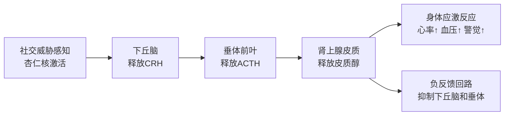

## 六、社交神经科学

社交不是纯粹的"技巧"问题——它深深植根于你的大脑结构和神经化学之中。理解社交行为的神经基础，能让你从根本上认识"为什么我会这样反应"，从而从源头上调整自己的社交模式。本章将从神经元、激素、脑区、理论模型四个维度，系统拆解社交行为的生物学底层逻辑。

### 6.1 镜像神经元：共情的硬件基础

#### 6.1.1 什么是镜像神经元

1992年，意大利帕尔马大学的贾科莫·里佐拉蒂（Giacomo Rizzolatti）团队在研究恒河猴运动皮层时意外发现：当猴子自己抓取食物时，大脑F5区的某些神经元放电；而当猴子看到实验员做同样的抓取动作时，这些神经元也会放电——仿佛猴子的"内在"在模拟他人的行为。这类神经元被命名为"镜像神经元"（Mirror Neurons）。

在人类大脑中，镜像神经元系统分布在以下区域：

| 脑区 | 功能角色 | 涉及的社交能力 |
|------|----------|----------------|
| 前运动皮层（PMC） | 动作模仿与理解 | 学习他人行为、模仿 |
| 下顶叶（IPL） | 意图推断 | 理解他人行为的目的 |
| 额下回（IFG，布洛卡区） | 语言与动作映射 | 共情性语言理解 |
| 上颞沟（STS） | 生物运动感知 | 识别面部表情、肢体语言 |
| 前脑岛（Insula） | 内感受整合 | "感同身受"的能力 |

#### 6.1.2 镜像神经元如何驱动社交

镜像神经元的核心机制是"内部模拟"——当你观察他人的动作、表情、情绪时，你的大脑会自动、无意识地在内部"复现"这些状态。这产生了三个重要的社交效应：

**情绪传染。** 当你看到同事皱眉叹气时，你的前脑岛和前扣带皮层被激活，让你体验到类似的压力和沮丧感。这就是为什么在一间充满焦虑的会议室里，你也会不自觉地紧张起来——不是你在"想"紧张，而是你的镜像系统直接"复制"了他人的状态。

**动作理解。** 镜像神经元让你无需推理就能理解他人的意图。当你看到朋友伸手去拿杯子时，你的运动前皮层自动模拟这个动作，你的大脑瞬间就知道"他要喝水"，而不是经过"伸手→接近杯子→握住→抬起→嘴部→喝水"这样的逻辑推导链条。

**语言共情。** 布洛卡区中的镜像神经元参与了语言的运动性理解——当你听到"他在踢球"时，你的运动皮层会部分激活踢球相关的神经回路，让你通过内部模拟来"体验"语言内容，而非仅仅解码符号。

#### 6.1.3 科学争议与实际边界

需要指出的是，镜像神经元在人类中的研究仍存在争议。fMRI等神经影像技术显示的是脑区激活模式，而非单个神经元的放电。部分学者（如格雷戈里·希科克）认为，将"脑区激活"等同于"镜像神经元活动"是过度简化。

更准确的说法是：人类拥有一个"镜像神经元系统"（Mirror Neuron System），它为共情和社交理解提供了神经基础，但并非唯一的机制。社交认知还需要心智理论网络（Theory of Mind network）、默认模式网络（Default Mode Network）等其他脑区系统的协同工作。

#### 6.1.4 如何利用镜像神经元原理改善社交

理解了镜像神经元的工作机制后，你可以在社交中有意识地利用它：

1. **主动微笑。** 你的微笑会激活对方的镜像系统，引发对方的微笑反射，形成正向情绪循环。这不是鸡汤——这是神经回路的直接激活。
2. **镜像匹配。** 适度模仿对方的姿态、语速和用词（神经语言学中的"同步"技术），会激活对方的镜像系统，让对方产生"这个人跟我很像"的亲近感。但注意要自然，刻意模仿会适得其反。
3. **暴露疗法的原理。** 社交焦虑者可以通过观察他人自然的社交互动视频（而非回避社交），逐步"训练"镜像系统对社交信号的正常反应模式，降低过度敏感。

### 6.2 催产素：社交联结的化学信使

#### 6.2.1 催产素的基本机制

催产素（Oxytocin）是由下丘脑合成、垂体后叶释放的九肽激素，同时在大脑中作为神经递质发挥作用。它被称为"爱的荷尔蒙"或"拥抱化学物质"，但这种标签过于简化——催产素在社交中的角色远比"让人感觉好"复杂得多。

催产素的释放触发条件：

| 触发场景 | 释放强度 | 典型情境 |
|----------|----------|----------|
| 皮肤接触 | ★★★★★ | 拥抱、按摩、母婴肌肤接触 |
| 面对面深层对话 | ★★★★ | 眼神交流、真诚倾诉 |
| 信任行为 | ★★★★ | 向他人敞开心扉、接受脆弱 |
| 性行为与高潮 | ★★★★★ | 伴侣间的亲密行为 |
| 共同活动 | ★★★ | 协作完成任务、团队运动 |
| 抚摸动物 | ★★★ | 与宠物互动 |
| 进食（尤其是巧克力） | ★★ | 社交聚餐、分享食物 |

#### 6.2.2 催产素的双面性

催产素并非单纯的"好激素"。苏黎世大学的卡洛斯·德瓦尔和克莱蒙斯·基尔希鲍姆的研究揭示了催产素的"黑暗面"：

- **圈内/圈外效应。** 催产素增强你对"自己人"的信任和共情，但同时可能增强你对"外人"的警惕甚至敌意。在群体冲突中，催产素水平高的人更倾向于保护自己的群体，而非公平对待所有人。
- **攻击性增强。** 当"自己人"受到威胁时，催产素水平升高反而会增强攻击性反应——母亲保护幼崽的激烈行为正是催产素驱动的。
- **过度信任。** 催产素会降低对他人可疑行为的警觉性。在实验中，鼻喷催产素的被试更愿意在经济博弈中信任陌生人，即使对方之前有过背叛行为。

正确理解：催产素是"社交联结"的调节器，而非"快乐"的开关。它在特定情境下可能导向保护、排斥或过度信任，取决于社交环境和个体差异。

#### 6.2.3 如何科学提升催产素水平

**直接方法（效果显著，持续1-4小时）：**
- 每天至少8次有意义的肢体接触（拍肩、握手、拥抱、击掌）
- 与亲密的人进行每天15分钟以上的眼神交流对话
- 每周2-3次30分钟以上的中等强度运动（跑步、游泳、瑜伽）

**间接方法（长期基线提升）：**
- 冥想练习：尤其是"慈悲冥想"（Loving-Kindness Meditation），多项研究显示8周慈悲冥想练习可显著提高基线催产素水平
- 安全型依恋关系的建立：稳定、可靠的亲密关系是催产素系统的"训练场"
- 减少社交媒体的"伪社交"：研究发现被动浏览社交媒体不提升催产素，反而可能增加皮质醇

#### 6.2.4 催产素与线上社交的差异

面对面的社交互动比线上互动能触发更多的催产素释放，核心原因在于：

- 面对面交流包含完整的多感官输入：眼神接触（催产素的强触发器）、肢体语言、声调变化、皮肤接触
- 线上交流缺乏这些物理信号，催产素释放量大约只有面对面交流的20-30%
- 视频通话介于两者之间，大约是面对面的50-60%，因为保留了面部表情和声音信号

这意味着：完全依赖线上社交的人，长期催产素基线可能偏低，更容易感到孤独和社交隔离。如果无法增加线下社交频率，可以有意识地增加视频通话（而非纯文字聊天），并确保每周有一定量的面对面互动时间。

### 6.3 皮质醇与社交压力

#### 6.3.1 HPA轴：社交压力的神经内分泌通路

皮质醇（Cortisol）是人体主要的糖皮质激素，由肾上腺皮质分泌，受下丘脑-垂体-肾上腺轴（HPA轴）调控。当你感知到社交威胁（如被拒绝、被评判、公开出丑）时，HPA轴激活的路径如下：

这个系统的设计初衷是应对短暂的物理威胁（如遇到猛兽），但现代社交场景中的威胁（社交焦虑、职场压力、关系冲突）往往是持续性的，导致HPA轴长期激活，皮质醇基线水平升高。

#### 6.3.2 高皮质醇对社交能力的具体影响

长期高皮质醇水平对社交能力的损害是多维度的：

| 影响维度 | 具体表现 | 神经机制 |
|----------|----------|----------|
| 情绪识别 | 难以准确读取他人的面部表情 | 杏仁核对社交信号过度敏感，误判增加 |
| 记忆 | 忘记对方说过的重要信息，显得"不走心" | 海马体受高皮质醇抑制，记忆编码受损 |
| 前额叶功能 | 冲动发言、难以维持社交礼节 | 前额叶皮层功能被皮质醇抑制 |
| 免疫 | 频繁感冒，无法参加社交活动 | 免疫系统被慢性高皮质醇抑制 |
| 睡眠 | 失眠或睡眠浅，白天社交状态差 | 皮质醇昼夜节律紊乱 |
| 面部微表情 | 不自觉地显露紧张、防御表情 | 面部肌肉持续微紧张 |

#### 6.3.3 降低社交压力皮质醇的实操方案

**即时方案（5-15分钟内起效）：**

1. **4-7-8呼吸法。** 吸气4秒→屏息7秒→呼气8秒，重复4轮。这个比例激活副交感神经系统，直接降低HPA轴活性。
2. **冷水刺激。** 用冷水冲手腕30秒或用冰块敷在手腕内侧。迷走神经刺激可快速降低皮质醇。社交场合中去洗手间用冷水洗手即可执行。
3. **接地技术。** 5-4-3-2-1法：说出5样你看到的、4样你触摸到的、3样你听到的、2样你闻到的、1样你尝到的。这将注意力从社交焦虑的内部循环拉回当下感官。

**中长期方案（1-8周见效）：**

1. **正念冥想（每天10-20分钟）。** 2013年《健康心理学》杂志的元分析表明，正念冥想干预可降低皮质醇基线水平约15-25%。关键不是"清空思维"，而是训练"觉察-不反应"的能力。
2. **规律有氧运动（每周150分钟）。** 运动初期皮质醇会短暂升高，但长期规律运动可降低基线皮质醇、增强HPA轴的负反馈效率。社交前30分钟的轻度运动（如散步）可降低随后社交场景中的皮质醇反应。
3. **社交支持网络。** 与亲密的人倾诉压力本身就能降低皮质醇——这不是"心理安慰"，而是催产素释放直接抑制了HPA轴活性。
4. **睡眠优化。** 睡眠不足6小时的人，次日皮质醇水平平均升高37-45%。维持固定的睡眠时间、睡前1小时远离屏幕、卧室温度控制在18-22°C，是稳定皮质醇节律的基础。

### 6.4 多迷走神经理论：社交安全感的神经基础

#### 6.4.1 波格斯的多迷走神经理论

斯蒂芬·波格斯（Stephen Porges）提出的多迷走神经理论（Polyvagal Theory）是理解社交安全感的最重要神经科学框架之一。该理论认为，人类自主神经系统不是简单的"交感-副交感"二元对立，而是由三个层级系统组成，按进化顺序排列：

| 层级 | 神经通路 | 状态 | 社交表现 |
|------|----------|------|----------|
| 第一层（最新） | 腹侧迷走神经复合体 | 社交参与 | 安全、放松、开放、能共情 |
| 第二层 | 交感神经系统 | 战斗/逃跑 | 紧张、防御、易怒、回避 |
| 第三层（最古老） | 背侧迷走神经 | 冻结/关机 | 麻木、解离、"死机"、无反应 |

这三个系统按优先级自动切换：当大脑判断环境安全时，腹侧迷走神经主导，你处于"社交参与"模式——声音有语调变化、面部表情丰富、能倾听和共情。当感知到威胁时，交感神经系统接管，进入战斗/逃跑状态。当威胁极端且无法逃跑时，背侧迷走神经接管，进入冻结状态。

#### 6.4.2 神经觉察（Neuroception）

波格斯引入了一个关键概念——神经觉察（Neuroception）：大脑在意识层面之下持续评估环境是否安全，这个评估过程完全无意识且速度快于理性思考。

神经觉察评估的信号来源：
- **声音线索。** 低沉、平稳、有节奏变化的声音（"心律变化性声音"）触发安全感。单调或刺耳的声音触发警觉。
- **面部表情。** 真实的微笑（眼轮匝肌参与的杜兴微笑）触发安全感。僵硬的面部或不匹配的表情（嘴在笑、眼不笑）触发警觉。
- **身体语言。** 开放姿态、舒缓的动作触发安全感。快速、突然的动作或静止不动触发警觉。
- **环境因素。** 熟悉的环境、适宜的温度、柔和的光线都有助于触发安全感。

#### 6.4.3 如何运用多迷走神经理论优化社交

**创建安全信号：**
- 说话时有意识地放慢语速，加入音调变化（单调的语调会让对方的神经觉察系统感到不安）
- 面部保持柔软、有表情的状态（不是刻意微笑，而是放松且有回应）
- 在社交场合设置物理舒适感：适宜的温度、柔和的光线、不太吵的背景噪音

**自我调节：**
- 当你感到社交中的"关机"感（麻木、解离）时，尝试温和的身体活动（站起来走动、拉伸），激活交感神经系统以脱离冻结状态
- 当你感到过度紧张（战斗/逃跑反应）时，使用缓慢的呼气、哼唱、或轻声自言自语来激活腹侧迷走神经
- 哼唱和吟唱可以物理性地刺激迷走神经（因为迷走神经穿过咽喉），这是一种直接的神经调节技术

### 6.5 社交大脑假说与邓巴数

#### 6.5.1 理论基础

英国人类学家罗宾·邓巴（Robin Dunbar）在1992年提出了"社交大脑假说"（Social Brain Hypothesis）。他发现，在灵长类动物中，新皮层比率（新皮层体积占整个大脑的比例）与该物种的社会群体规模呈正相关关系。

将这个相关关系外推到人类大脑皮层容量，得出的预测数字是约148人——这就是著名的"邓巴数"（Dunbar's Number）。后续对狩猎采集部落、罗马军队编制、现代企业组织结构、圣诞贺卡发送网络的实证研究，都反复验证了这个数字的稳健性。

#### 6.5.2 关系同心圆模型

邓巴发现，150不是一个简单的上限，而是一个由多个层级组成的社交圈层结构：

| 层级 | 人数 | 关系特征 | 维护成本 | 更新频率 |
|------|------|----------|----------|----------|
| 支持圈（Support） | ~5 | 绝对信任，危急时刻可求助，每周几乎都有联系 | 非常高 | 极少变动 |
| 同情圈（Sympathy） | ~15 | 好友，可以坦诚交流，每月至少见1-2次 | 高 | 偶尔变动 |
| 亲近圈（Affinity） | ~50 | 朋友，共同参加活动，每季度有互动 | 中等 | 定期变动 |
| 认知圈（Active） | ~150 | 认识的人，偶尔联系，了解对方的基本情况 | 较低 | 较频繁变动 |
| 扩展圈（Extended） | ~500 | 见过面但不熟，可能叫不出名字 | 极低 | 频繁变动 |
| 熟悉圈（Recognition） | ~1500 | 能认出面孔但没有社交关系 | 无 | 大量变动 |

#### 6.5.3 关系衰退与时间投资

邓巴的后续研究揭示了维护关系的关键规律：

- **一年规则。** 如果你一年内未与某人进行有意义的互动（面对面、电话或深度视频聊天——被动的社交媒体点赞不算），这个人会从你当前的圈层下降一个层级。
- **亲密圈维护。** 维持最内圈5人关系大约需要你40%的可用社交时间。维持到150人的外圈，需要消耗几乎全部的社交时间预算。
- **社交时间预算。** 每个人的社交时间大致是固定的（约每天4-5小时的有效社交时间），这意味着扩大社交圈必然稀释核心关系的维护力度。

#### 6.5.4 社交媒体时代的邓巴数

社交媒体并没有真正"突破"邓巴数。邓巴本人在2016年的研究中发现，尽管人们的Facebook"好友"数量可达数百甚至数千人，但真正被归入"有意义关系"的数量仍然停留在150人左右，各层圈的人数比例与线下社交完全一致。

社交媒体的真实作用：
- **降低维护成本。** 被动信息流（朋友圈、动态）让你能在不投入直接互动时间的情况下，维持关系不衰退——但只是"延缓衰退"，不能"深化关系"。
- **扩展认知圈。** 你可以认出更多面孔、知道更多人的近况，但这些新增的关系质量停留在150人以外的浅层。
- **注意力竞争。** 社交媒体的"弱关系"可能挤占你维护"强关系"的时间和注意力。

#### 6.5.5 邓巴数的实际应用

**社交策略优化：**

1. **圈层意识。** 定期审视你的社交圈层分布：你是否花了太多时间维护150人外圈的关系，而忽略了最内圈5人的深度维护？
2. **关系审计。** 每季度列出你15人同情圈的名单，检查是否有半年未联系的人，主动安排一次深度互动。
3. **社交投资策略。** 在社交时间有限的情况下，优先投资内圈：每周至少3次与核心5人的深度互动（面对面或视频通话），远比维护50个点赞关系更有价值。
4. **新人加入的代价。** 当一个新人进入你的核心圈时，通常意味着一个原有的人会被挤到外圈——这不是无情，而是时间资源的有限性决定的。有意识地管理这个过程，而非让其随机发生。

### 6.6 社交认知的其他关键脑区

#### 6.6.1 杏仁核：社交威胁检测器

杏仁核（Amygdala）是大脑中对社交威胁信号最敏感的区域。它在以下社交场景中高度活跃：

- 检测面部表情中的威胁信号（愤怒、恐惧、厌恶）
- 评估陌生人是否可信（在看到陌生面孔的33毫秒内，杏仁核就已做出初步判断）
- 学习社交惩罚信号（被拒绝、被排斥的痛苦感受部分来自杏仁核的激活）
- 评估社交等级和权力关系

杏仁核损伤的患者可以正常识别物体、处理逻辑推理，但在"信任判断"上完全丧失能力——他们无法区分可信和不可信的面孔。这说明社交威胁检测是一个独立的、专门化的神经功能。

#### 6.6.2 前额叶皮层：社交决策的指挥中心

前额叶皮层（PFC），尤其是内侧前额叶皮层（mPFC）和眶额皮层（OFC），在社交中扮演着"高级指挥官"的角色：

- **心智理论（Theory of Mind）。** mPFC让你能够推测他人在想什么、有什么意图、处于什么情绪状态。这是"换位思考"能力的神经基础。
- **社交决策。** OFC参与评估社交行为的预期后果——"如果我这样说，对方会怎么反应？"
- **情绪调控。** 腹内侧前额叶（vmPFC）对杏仁核有抑制作用，让你在社交冲突中不至于被情绪"劫持"。

前额叶皮层是大脑中最晚成熟的区域，通常到25岁左右才完全发育。这解释了为什么青少年的社交判断经常冲动、不计后果——不是因为他们"不想"控制，而是他们的"硬件"还在建设中。

#### 6.6.3 默认模式网络：社交模拟器

默认模式网络（Default Mode Network, DMN）在你不专注于外部任务时自动激活，它的社交功能包括：

- 回忆过去的社交场景并进行复盘
- 模拟未来的社交情境（"如果明天面试时对方问这个问题，我应该怎么回答？"）
- 构建自我叙事（"我是一个什么样的人"），这直接影响你在社交中的自我呈现
- 推测他人的心理状态（与mPFC协同工作）

DMN过度活跃与社交焦虑密切相关——焦虑者的大脑在休息时会不停地"回放"过去的社交失败场景或"预演"未来可能的社交灾难，消耗大量心理能量。

### 6.7 神经可塑性：社交能力可以重塑

#### 6.7.1 社交大脑是可以训练的

一个令人振奋的事实是：与社交相关的神经回路并非一成不变。神经可塑性（Neuroplasticity）意味着，通过有意识的训练和实践，你可以改变自己社交相关的神经连接模式。

已有的实证证据：
- 伦敦出租车司机的海马体（负责空间记忆和导航）比普通人更大，且驾龄越长差异越明显
- 长期冥想者的前额叶皮层和前脑岛（与共情和情绪调节相关）皮层厚度增加
- 社交焦虑患者经过认知行为治疗（CBT）后，杏仁核对社交威胁信号的过度反应明显减弱
- 孤独症谱系个体经过社交技能训练后，相关脑区的功能连接模式可发生改变

#### 6.7.2 社交神经可塑性的训练原则

利用神经可塑性改善社交能力，需要遵循以下原则：

1. **重复。** 神经回路的强化依赖重复激活。偶尔一次社交尝试不会改变大脑模式——每周至少3次有意识的社交练习，持续8周以上，才能产生可检测的神经变化。
2. **渐进超负荷。** 从略高于当前舒适区的社交难度开始，逐步增加挑战。跳入远超当前能力的社交场景（如社交焦虑者突然参加大型派对）可能适得其反，强化而非削弱恐惧回路。
3. **多感官参与。** 同时运用视觉（观察对方表情）、听觉（倾听语调）、动觉（手势和姿态）的社交训练，比单一维度的练习更能激活完整的社交神经网络。
4. **即时反馈。** 社交后进行简短复盘（对方的反应如何？我感觉如何？哪些做得好？哪些可以改进？），利用前额叶的高级功能来优化下次的社交行为模式。

### 6.8 关键神经化学物质速查表

以下是社交行为中最关键的四种神经化学物质及其作用：

| 化学物质 | 核心社交功能 | 释放触发 | 过低时的表现 | 过高时的表现 | 提升方法 |
|----------|-------------|----------|-------------|-------------|----------|
| 催产素 | 信任、联结、共情 | 接触、眼神、亲密互动 | 社交冷漠、难以信任 | 过度信任、对"外人"敌意 | 拥抱、运动、慈悲冥想 |
| 多巴胺 | 社交奖励、动机 | 新关系、正面反馈、社交成功 | 社交退缩、缺乏动力 | 社交成瘾、寻求过度关注 | 运动、新社交体验、目标达成 |
| 血清素 | 情绪稳定、社交自信 | 阳光、运动、正面社交体验 | 社交焦虑、攻击性增加 | — | 运动、日光、规律作息 |
| 皮质醇 | 压力反应、警觉 | 社交威胁、压力、冲突 | 过度放松、缺乏警觉 | 焦虑、失眠、免疫下降 | 冥想、睡眠、社交支持 |

### 6.9 常见误区

**误区1："我是内向者，所以我的社交神经系统天生就不同。"**

事实：内向与外向的差异主要体现在多巴胺系统的敏感度差异（内向者对外部刺激的多巴胺反应更敏感，容易"过载"），而非社交能力的差异。内向者拥有完整的社交神经回路，只是需要更多的独处时间来恢复神经系统的平衡。理解这一点，你就不必强迫自己变成外向者，而是找到适合内向者的社交节奏。

**误区2："催产素可以通过鼻喷剂来提升社交能力。"**

事实：虽然催产素鼻喷剂在实验中确实显示了一些社交增强效应，但效果高度依赖情境、剂量和个体差异，且可能带来圈外效应（增加偏见）。目前没有任何临床指南推荐使用催产素鼻喷剂来改善社交能力。自然方式（接触、运动、冥想）更安全、更持久。

**误区3："社交焦虑是因为我"太在意别人看法"，只要不在乎就好了。"**

事实：社交焦虑的核心神经机制是杏仁核对社交威胁信号的过度反应，加上前额叶调控能力的不足。这不是一个"想通了"就能解决的问题——杏仁核的激活速度快于意识思维。有效的干预需要双管齐下：认知层面（改变思维模式）+ 神经层面（通过暴露训练、冥想等方法重塑杏仁核的反应模式）。

**误区4："线上社交完全可以替代线下社交。"**

事实：线上社交（尤其是纯文字形式）缺失了大部分触发催产素释放和镜像神经元激活的物理信号（眼神、触觉、完整表情、声调）。长期只依赖线上社交会导致社交神经回路的"用进废退"，使线下社交能力逐渐退化。线上社交应作为补充，而非替代。

### 6.10 本章小结

社交神经科学揭示了一个核心事实：你的社交行为不是纯粹的"性格"或"技巧"问题，而是由神经回路、化学物质和脑区协同运作的复杂系统。好消息是，这个系统具有可塑性——通过理解其运作原理，你可以有针对性地优化自己的社交神经基础。

关键行动要点：
- 利用镜像神经元原理，通过主动微笑和适度同步来增强社交连接
- 通过触觉、运动、冥想来维持健康的催产素水平
- 使用呼吸法和正念来管理社交场景中的皮质醇反应
- 根据多迷走神经理论，创造让自己和他人都感到"安全"的社交环境
- 按照邓巴数的圈层模型，有意识地分配社交时间和精力
- 利用神经可塑性，通过重复练习逐步重塑社交大脑的反应模式
