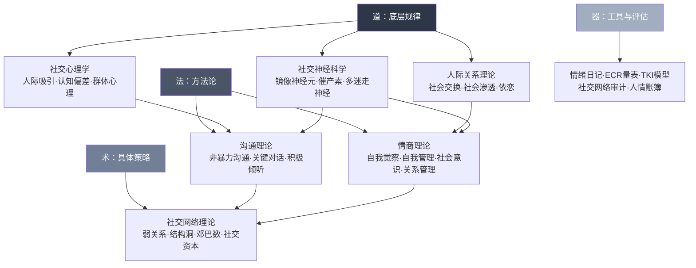

## 本节小结

基础理论部分的六章内容构建了一个完整的社交认知框架——从人际吸引的心理机制，到关系发展的动态规律，从沟通的系统方法，到社交网络的结构逻辑，从情商的能力模型，到社交行为的神经基础。这些理论不是孤立的知识点，而是一个层层嵌套、相互支撑的体系。本节将六章内容整合为统一的认知地图，帮你建立"道法术器"贯通的社交思维。

### 理论体系的全景图

六章内容可以按"道法术器"四个层次来理解：

### 六章核心理论速览

| 章节 | 核心理论 | 一句话总结 | 最关键的实操启示 |
|------|---------|-----------|----------------|
| 社交心理学 | 人际吸引五因素 | 接近性、相似性、互惠性、外貌、光环效应共同决定你是否被喜欢 | 制造曝光+寻找共同点+主动表达欣赏 |
| 人际关系理论 | 社会交换+社会渗透+依恋 | 关系本质是价值交换，发展靠渐进渗透，底色由依恋类型决定 | 先存人情再支取，自我表露跟着关系节奏走 |
| 沟通理论 | NVC+关键对话+积极倾听 | 表达用"观察-感受-需要-请求"，倾听听内容更听情感 | 先处理情绪再处理问题，回应感受而非给建议 |
| 社交网络理论 | 弱关系+结构洞+邓巴数 | 弱关系带来新信息，结构洞位置创造竞争优势，社交圈有容量上限 | 维护跨圈子弱关系，按圈层分配社交时间 |
| 情商理论 | 萨洛维-梅耶四分支+戈尔曼五维度 | 情商是可训练的能力，核心是情绪觉察和情绪管理 | 写情绪日记、练习情绪标注、培养认知重评习惯 |
| 社交神经科学 | 镜像神经元+催产素+多迷走神经 | 社交行为有神经基础，大脑具有可塑性 | 主动微笑激活镜像系统，拥抱提升催产素，呼吸法降低皮质醇 |

### 跨理论的五条核心主线

六章内容虽然角度不同，但反复出现几条贯穿始终的主线。理解这些主线，就能把零散的理论串联成一个有机整体。

#### 主线一：关系的本质是交换，但交换的不只是利益

社会交换理论告诉我们关系有"经济学逻辑"——人们在关系中追求收益最大化和成本最小化。但如果止步于此，社交就变成了冷冰冰的交易。六章内容反复强调一个修正：**最深层的收益恰恰是最不功利的**——归属感、被理解的感觉、情感安全、人生意义。

社会渗透理论揭示了获取这些深层收益的路径：循序渐进的自我表露。依恋理论解释了为什么有些人能自然地走这条路（安全型），而有些人走不通（焦虑型和回避型）。神经科学则从生物层面证实：催产素——这种驱动信任和联结的神经化学物质——需要通过真实的互动（拥抱、眼神、深度对话）来触发，而不是精明的利益计算。

实操启示：用社会交换理论诊断关系（"这段关系为什么让我累？"），但用社会渗透理论和依恋理论的智慧来建设关系（"怎样逐步建立信任？"）。不要把交换理论当作行为指南，而是当作分析工具。

#### 主线二：第一印象强大但可以被覆盖

社交心理学用首因效应和光环效应解释了第一印象的巨大影响力——最初2-5分钟的印象会形成认知框架，后续信息被选择性地纳入这个框架。确认偏差让这个框架变得异常顽固。

但其他理论提供了"覆盖"第一印象的路径：

- 社会渗透理论表明，关系的发展是一个持续渗透的过程，每一次深度表露都可能重新校准对方对你的认知
- 近因效应告诉我们，最近一次互动的印象权重很高——要修复关系，最近的一次积极互动比100次过往的美好回忆更有效
- 情商理论的自我管理维度提供了"情绪-反应间隙"技术，让你在关键时刻不掉链子
- 神经科学揭示，前额叶皮层可以抑制杏仁核的自动化反应——这意味着你可以训练自己在重要场合保持最佳状态

实操启示：在需要留下好印象的场合（面试、初次约会、重要会议），全力管理前5分钟；在已有关系中，关注"最近一次互动"的质量比纠结于过去的误会更有用。

#### 主线三：情绪是社交的底层操作系统

六章内容从不同角度反复证明同一个事实：**情绪不是社交的"噪音"，而是社交的核心驱动引擎**。

- 社交心理学中，互惠性喜欢的运作机制本质上是情绪传染——你的情绪状态直接影响对方对你的态度
- 依恋理论中，四种依恋类型的核心差异在于情绪调节能力——安全型能有效管理焦虑，焦虑型和回避型则被情绪驱动
- 沟通理论中，非暴力沟通的第二要素是"感受"，关键对话的第三原则是"控制想法"——两者都在要求你处理情绪
- 情商理论直接将情绪能力作为社交能力的核心——从感知情绪到管理情绪，层层递进
- 社交神经科学用杏仁核劫持、皮质醇反应、多迷走神经理论等机制，解释了情绪如何在毫秒级别接管你的社交行为

实操启示：提升社交能力的第一步不是学习"话术"或"技巧"，而是提升情绪觉察和管理能力。具体方法：

1. 每天写5分钟情绪日记，训练情绪颗粒度（从"不开心"升级到"被忽视后的失落夹杂着自我怀疑"）
2. 练习情绪标注——在情绪涌上来时用语言精确描述它，杏仁核激活水平会自动下降20-30%
3. 掌握"6秒法则"——情绪的生化反应在体内持续约6秒，默数6秒再做反应
4. 学会4-7-8呼吸法——吸气4秒、屏息7秒、呼气8秒，物理性地激活副交感神经系统

#### 主线四：社交网络有结构，位置比能力更重要

社交心理学讲的是"你和某个人之间的关系"，社交网络理论讲的是"你在这张大网中的位置"。两者的视角完全不同，但后者往往更决定性。

弱关系理论证明了信息传播效率取决于网络的"桥梁"，而桥梁几乎总是由弱关系充当。结构洞理论进一步指出，占据两个不相连群体之间的桥梁位置，你能获得信息优势、控制优势和竞争优势。邓巴数则为社交网络管理提供了科学依据——你的社交时间是有限资源，必须按圈层分配。

但这些理论不能脱离前几章的支撑：

- 弱关系需要社会资本理论中的"信任积累"机制才能真正发挥作用——没有信任基础的弱关系只是通讯录里的名字
- 结构洞位置需要情商理论中的"关系管理"能力来维护——如果缺乏真诚和一致性，桥梁位置会变成"两头不讨好"
- 邓巴数的圈层管理需要依恋理论的视角——核心层5人关系的质量直接影响你整个社交网络的健康度

实操启示：每半年做一次社交网络审计。具体步骤：

1. 画出你当前社交网络的草图（核心层5人→亲密层15人→友好层50人→认识层150人）
2. 标记不同圈子的来源（工作、学校、社群、家庭）
3. 检查是否有"社交同质化"——所有朋友都来自同一个背景
4. 识别结构洞机会——哪些圈子之间完全隔离，你可以成为桥梁
5. 制定未来3-6个月的社交行动计划

#### 主线五：社交能力可以通过训练重塑

六章内容共同传递的一个核心信念是：社交不是天赋，而是可训练的能力。

- 社交心理学提供了具体的认知策略（管理第一印象、利用曝光效应、规避认知偏差）
- 人际关系理论提供了关系发展的渐进路径（社会渗透的节奏、依恋类型的修正）
- 沟通理论提供了结构化的表达和倾听框架（NVC四步法、STATE技巧、积极倾听五技能）
- 情商理论提供了系统的能力提升方案（情绪日记、正念冥想、认知重评）
- 社交神经科学从生物学层面证明了"用进废退"——神经可塑性意味着你的社交大脑可以通过重复练习被重塑

神经科学的证据最为振奋人心：伦敦出租车司机的海马体比普通人大，长期冥想者的前额叶皮层更厚，社交焦虑患者经过CBT治疗后杏仁核过度反应明显减弱。这意味着，你今天的社交练习不只是在"学技巧"，而是在物理层面改变你的大脑结构。

训练的关键原则（来自神经可塑性研究）：

| 原则 | 说明 | 具体做法 |
|------|------|----------|
| 重复 | 神经回路的强化依赖重复激活 | 每周至少3次有意识的社交练习，持续8周以上 |
| 渐进超负荷 | 从略高于当前舒适区的难度开始 | 内向者先从1对1深度对话练起，不要直接跳到大型派对 |
| 多感官参与 | 同时运用视觉、听觉、动觉 | 社交时有意识地观察表情、倾听语调、注意姿态 |
| 即时反馈 | 社交后进行简短复盘 | 每次重要社交后花2分钟回顾：做得好的是什么？下次怎么改进？ |

### 道法术器贯通：从理论到行动的完整路径

将六章内容转化为日常可执行的行动体系：

**道——建立正确认知（第1-2周）**

理解以下核心认知，作为所有社交行为的思想基础：

- 人际吸引有其心理学规律，理解这些规律不是"操控"，而是"觉察"
- 第一印象很重要，但它不是终身判决——关系是动态发展的过程
- 社会交换是关系的底层逻辑，但不要把它变成行为指南
- 自我表露的节奏决定了关系能走多深——跟着关系的节拍走
- 情商是可以培养的能力，不是固定的人格标签
- 你的社交大脑可以通过练习被重塑——任何时候开始都不晚

**法——掌握核心方法（第3-6周）**

在理解理论的基础上，掌握四个核心方法论：

1. **表达方法**：掌握非暴力沟通四步法（观察→感受→需要→请求），在日常对话中有意识地练习
2. **倾听方法**：练习积极倾听的五个技能——全神贯注、不打断、反映复述、共情回应、开放式提问
3. **情绪管理方法**：建立情绪日记习惯，练习情绪标注和认知重评
4. **网络管理方法**：学会社交网络审计，按邓巴数圈层分配社交时间

**术——运用具体策略（持续实践）**

| 场景 | 优先使用的理论 | 具体策略 |
|------|--------------|----------|
| 初次见面 | 人际吸引五因素+光环效应 | 管理前5分钟，寻找共同点，主动表达欣赏 |
| 深化关系 | 社会渗透理论+自我表露理论 | 渐进式表露，匹配对方深度，扩展话题宽度 |
| 处理冲突 | NVC+关键对话+TKI模型 | 先暂停冷静，用NVC表达，选择合适的冲突风格 |
| 拓展人脉 | 弱关系+结构洞+社交资本 | 参加跨行业活动，激活休眠关系，先存人情再支取 |
| 应对焦虑 | 依恋理论+神经科学 | 4-7-8呼吸法，身体扫描，情绪标注 |
| 维护核心关系 | 邓巴数+社会交换理论 | 每周深度互动，记住重要细节，创造超额价值 |

**器——使用工具和评估（定期回顾）**

| 工具 | 用途 | 使用频率 |
|------|------|----------|
| 情绪日记 | 提升情绪觉察和颗粒度 | 每天5分钟 |
| ECR量表 | 评估自己的依恋类型 | 每半年一次 |
| TKI冲突模型 | 识别自己的冲突处理风格 | 遇到冲突时参考 |
| 社交网络审计 | 检查社交网络的健康度 | 每半年一次 |
| 人情账簿 | 追踪社交资本的收支 | 持续记录 |
| 对话复盘日志 | 提升沟通和倾听能力 | 每周2-3次 |

### 常见的整合性误区

在将这些理论整合应用时，有几个跨章节的常见误区需要警惕：

| 误区 | 问题所在 | 纠正方式 |
|------|---------|----------|
| "学了理论就能变社交达人" | 理论是地图，不是目的地。神经可塑性研究显示，改变需要至少8周的持续练习 | 理论学习只占20%，80%的精力放在刻意练习上 |
| "用一套理论解释所有社交现象" | 每个理论都有其适用边界和局限性 | 面对具体问题时，选择最相关的理论作为分析框架，而不是生搬硬套 |
| "社交就是有目的的交换" | 过度功利化会让你失去真诚，而真诚是所有关系的基石 | 用交换理论诊断问题，用渗透理论和依恋理论建设关系 |
| "情商高就是会说话" | 情商的核心是自我觉察和情绪管理，不是话术 | 先练内功（情绪日记、正念），再练外功（沟通技巧） |
| "内向者社交能力天生差" | 内向只是多巴胺系统敏感度的差异，不影响社交神经回路的完整性 | 找到适合内向者的社交节奏——少而精、深度优先 |
| "线上社交可以替代线下" | 线上互动能触发的催产素只有线下的20-30% | 线上社交作为补充，每周保证一定量的面对面互动 |
| "社交网络越大越好" | 邓巴数告诉我们关系有容量上限，盲目扩张导致所有关系变浅 | 控制总量、提升质量，集中精力维护高价值关系 |
| "理论之间互相矛盾" | 表面矛盾的理论实际上在描述同一现象的不同层面 | 社会交换理论描述底层逻辑，依恋理论描述情感底色，渗透理论描述发展路径——三者互补而非对立 |

### 通往下一节的桥梁

理解了"为什么"（理论）之后，下一节将聚焦"怎么做"（具体方案）。基础理论为你提供的是一张社交世界的认知地图——你知道了人际吸引的规律、关系发展的路径、沟通的底层逻辑、网络的结构原理、情商的能力框架和社交的神经基础。

具体方案将把这些理论转化为可直接执行的操作指南——从日常社交技巧到社交焦虑应对，从社交资本积累到社交礼仪规范，从信任建立到冲突处理，从边界管理到社交能量管理。每一个具体方案都可以追溯到本节的某个理论基础，而每个理论基础也都能在具体方案中找到落地的路径。

理解这些理论不是为了把社交变成一门"科学实验"，而是为了在自然的社交互动中，多一份觉察、多一份理解、多一份智慧。当你意识到对方的回避可能源于回避型依恋而非不在乎你，当你注意到自己正在因为确认偏差而固化对某人的负面印象，当你发现自己正在因为皮质醇飙升而说出冲动的话——这些觉察本身就是改变的起点。

社交能力的提升是一个螺旋上升的过程：理论学习→有意识的练习→复盘反思→再次练习。不要期望一蹴而就，但也不要低估持续练习带来的神经可塑性改变。你的社交大脑正在等待你的训练。
