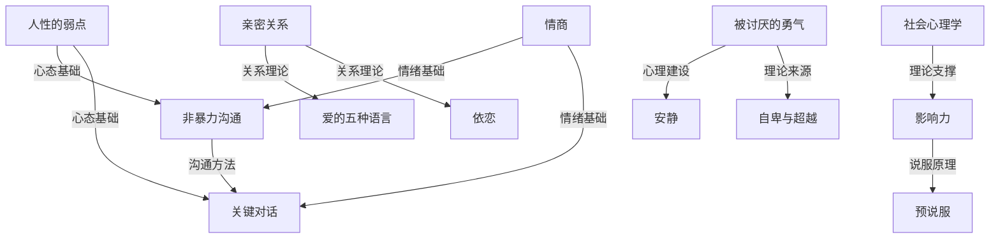

## 一、书籍推荐

书籍是社交能力提升最系统、最深入的学习载体。与碎片化的短视频或公众号文章不同，一本好书能帮你建立完整的认知框架，让你在面对复杂社交情境时有据可依。本节按"道法术器"四个层次推荐书籍——从底层心理学原理（道），到关系建设方法论（法），再到具体沟通技巧（术），最后到场景化工具书（器）。每本书都附有核心概念提炼、适合的阅读阶段、以及与其他书籍的互补关系，帮你构建系统化的社交知识体系。

---

### 1.1 社交基础理论类（道：理解人性底层逻辑）

这一类书帮你回答"人为什么会这样社交"的根本问题。理论看似抽象，但它是所有技巧的地基——不理解原理，技巧就是空中楼阁。

---

**《影响力》——罗伯特·西奥迪尼（Robert Cialdini）**

社会心理学领域引用率最高的著作之一，西奥迪尼花了三年时间"卧底"各种说服性行业（销售、广告、慈善募捐），提炼出六大影响力原则：**互惠**（别人给你好处你会想回报）、**承诺与一致**（人倾向于言行一致）、**社会认同**（看别人怎么做来决定自己怎么做）、**喜好**（更容易被喜欢的人说服）、**权威**（服从权威的本能）、**稀缺**（越难得越想要）。2021年修订版新增了第七原则——**联盟**（我们与"自己人"更容易产生认同）。

- **核心收获**：理解人类决策的自动化模式，学会在社交中合理运用这些原则，同时识别他人对你的操控
- **关键概念**：触发特征与固定行为模式、知觉对比原理、拒绝-后退策略
- **适合人群**：所有想提升社交影响力的人，尤其是销售、管理、创业相关从业者
- **阅读难度**：★★★☆☆（案例丰富，读起来不枯燥）
- **实用性**：★★★★★
- **阅读建议**：重点精读互惠、社会认同、稀缺三章，每读完一章立刻在当天的社交中寻找对应现象，这样记忆最深

---

**《人性的弱点》——戴尔·卡耐基（Dale Carnegie）**

写于1936年，至今全球销量超3000万册。卡耐基的核心洞察极其朴素：**人类最深层的渴望是"被重视"**。书中的原则——真诚地关心他人、记住别人的名字、做一个好的倾听者、谈论对方感兴趣的话题、让对方觉得自己很重要——听起来像常识，但99%的人做不到，因为做到这些需要克服自我中心的本能。

- **核心收获**：建立"以他人为中心"的社交底层心态，掌握处理人际关系的基本原则
- **关键概念**：三不原则（不批评、不指责、不抱怨）、激发他人内心的渴望、成为好的倾听者
- **适合人群**：社交入门者，或社交经验丰富但感觉"卡在某个层次"的人
- **阅读难度**：★★☆☆☆（语言通俗，案例多为故事）
- **实用性**：★★★★★
- **阅读建议**：不要一口气读完，每天实践一个原则就够了。建议配合《人性的优点》一起读，前者处理人际关系，后者处理社交焦虑

---

**《非暴力沟通》——马歇尔·卢森堡（Marshall Rosenberg）**

提出了一套结构化的沟通方法论，核心是四步法：**观察**（客观描述事实，不加评判）→ **感受**（表达你的真实情绪）→ **需要**（说出感受背后的深层需求）→ **请求**（提出具体可执行的请求）。这本书的价值在于，它不仅是一种沟通技巧，更是一种**认知重构**——帮助你看到冲突背后双方未被满足的需求。

- **核心收获**：掌握"观察-感受-需要-请求"四步法，在冲突中既表达自己又不伤害对方
- **关键概念**：暴力沟通的四种形式（道德评判、比较、回避责任、强人所难）、同理心倾听、自我同理
- **适合人群**：经常在沟通中感到"说了但对方不理解"或"一开口就吵架"的人
- **阅读难度**：★★★☆☆（概念清晰但需要反复练习才能内化）
- **实用性**：★★★★★
- **阅读建议**：读完后立刻做书中的练习题，然后找一个信任的人用四步法进行一次真实对话。这本书需要"练"而非"读"

---

**《亲密关系》——罗兰·米勒（Rowland Miller）**

大学心理学教材级别的系统著作，涵盖人际吸引（什么让我们喜欢一个人）、爱情理论（斯滕伯格的三角理论、李约翰的爱情色轮）、沟通模式、冲突处理、关系维护等全链条。虽然定位是教材，但语言比多数通俗读物更有趣，引用了大量经典实验。

- **核心收获**：用科学框架理解亲密关系的运作机制，破除关于爱情和人际关系的常见迷思
- **关键概念**：依恋类型（安全型、焦虑型、回避型）、自我表露的互惠性、关系满意度的双因素模型、戈特曼的"四骑士"
- **适合人群**：想从根本上理解亲密关系运作规律的人，不满足于"技巧"层面
- **阅读难度**：★★★★☆（内容系统但信息密度高）
- **实用性**：★★★★☆（偏理论，但理论指导实践）
- **阅读建议**：如果时间有限，优先读第7章（爱情）、第8章（性与亲密关系）、第11章（冲突），这三章对日常生活的指导意义最大

---

**《社会心理学》——戴维·迈尔斯（David Myers）**

全球使用最广泛的社会心理学教材，目前已出到第13版。覆盖态度与说服、从众与服从、群体决策、偏见与歧视、亲社会行为、攻击性、人际吸引等全部核心主题。迈尔斯的写作风格在学术严谨和可读性之间达到了罕见的平衡。

- **核心收获**：建立对人类社会行为的系统认知框架，理解许多社交现象背后的深层机制
- **关键概念**：基本归因错误、自证预言、旁观者效应、认知失调、群体极化
- **适合人群**：想系统学习社交背后的心理学原理，愿意花时间啃一本"大书"的人
- **阅读难度**：★★★★☆（教材体量大，建议选读核心章节）
- **实用性**：★★★★☆（偏学术，但知识终身受用）
- **阅读建议**：不必通读全书，优先读第1-3章（社会认知）、第7章（说服）、第9章（群体影响）、第11章（偏见），这些对日常社交最有直接指导意义

---

**《思考，快与慢》——丹尼尔·卡尼曼（Daniel Kahneman）**

诺贝尔经济学奖得主的经典之作，提出人类思维的双系统理论：**系统1**（快速、直觉、自动化）和**系统2**（慢速、理性、费力）。这本书虽然不直接讲社交，但理解了这两个系统，你就能理解为什么人在社交中经常做出"非理性"的判断和决策——从众、刻板印象、情绪化反应都是系统1的产物。

- **核心收获**：理解人类认知偏差的根源，在社交中做出更理性的判断
- **关键概念**：可得性启发、锚定效应、损失厌恶、框架效应、峰终定律
- **适合人群**：对认知科学感兴趣、想深入理解决策偏差的人
- **阅读难度**：★★★★★（信息密度极高，需要慢读）
- **实用性**：★★★★☆（应用需要主动转化）
- **阅读建议**：建议配合《助推》（理查德·塞勒）一起读，前者讲理论，后者讲应用

---

### 1.2 社交技能类（法与术：方法论与具体技巧）

这一类书聚焦"怎么做"——从宏观的沟通方法论到具体场景下的对话技巧，是理论到实践的桥梁。

---

**《关键对话》——科里·帕特森等（Kerry Patterson et al.）**

当对话的三个条件——高风险、不同观点、激烈情绪——同时出现时，大多数人的表现会急剧下降（要么沉默要么暴力）。这本书提供了在这些关键时刻保持对话安全和有效的系统方法。核心框架是：**从心开始**（明确你真正想要什么）→ **注意观察**（判断对话是否安全）→ **保证安全**（用共同目的和相互尊重营造安全感）→ **控制想法**（避免受害者想法和大反派想法）→ **陈述观点**（用STATE方法：分享事实→说出想法→试探表述→鼓励尝试）。

- **核心收获**：掌握在高压、高情绪对话中保持有效沟通的能力
- **关键概念**：共享观点库、综合陈述法（STATE）、安全氛围的三个条件、四种倾听手段
- **适合人群**：经常需要处理冲突、谈判、绩效面谈、家庭对话等困难场景的人
- **阅读难度**：★★★☆☆
- **实用性**：★★★★★
- **阅读建议**：每章末尾的练习题要认真做，这本书的价值在"练"不在"读"

---

**《情商》——丹尼尔·戈尔曼（Daniel Goleman）**

情绪智力领域的奠基之作，定义了情商的五个维度：**自我意识**（认识自己的情绪）→ **自我管理**（调控自己的情绪）→ **自我激励**（保持内在驱动力）→ **同理心**（感知他人的情绪）→ **社交技能**（管理他人情绪和关系）。戈尔曼的核心论点是：在预测一个人的职业成就和人际关系质量时，情商的权重可能超过智商。

- **核心收获**：建立情商的完整认知框架，找到自己的短板并有针对性地提升
- **关键概念**：情绪劫持（amygdala hijack）、心流状态、社交脑、情商与智商的关系
- **适合人群**：想系统提升情绪管理能力和社交敏感度的人
- **阅读难度**：★★★☆☆
- **实用性**：★★★★☆
- **阅读建议**：重点精读自我意识和同理心两章，这两章对社交提升的杠杆最大

---

**《沟通的艺术》——罗纳德·阿德勒 & 拉塞尔·普罗科特**

美国大学沟通学课程使用率最高的教材，分为"看入人里"（自我认知在沟通中的作用）、"看出人外"（语言和非语言信息）、"看人之间"（关系沟通）三部分。内容覆盖面极广，从自我表露到倾听、从冲突风格到关系发展阶段，几乎涵盖了人际沟通的全部核心主题。

- **核心收获**：建立完整的沟通知识体系，理解沟通中的自我、他人和关系三个维度
- **关键概念**：乔哈里视窗、知觉检核、沟通气氛、确认信息与否定信息、关系辩证法
- **适合人群**：想系统学习沟通理论和技能的人，不满足于"几条技巧"
- **阅读难度**：★★★★☆（教材体量，但案例丰富）
- **实用性**：★★★★☆
- **阅读建议**：如果只读一章，选第8章"倾听"——倾听是所有沟通技能中回报率最高的

---

**《好好说话》——马东等（奇葩说团队）**

中文语境下最实用的说话技巧书之一，将沟通分为五个维度：**沟通**（平等交换信息）、**说服**（让对方接受你的观点）、**谈判**（利益博弈）、**演讲**（一对多表达）、**辩论**（防守反击）。每个维度都提供了可直接使用的具体话术模板和应对策略，非常适合中国社交场景。

- **核心收获**：掌握中文语境下不同沟通场景的核心话术和策略
- **关键概念**：权力在沟通中的流动、每句话都是"选择"而非"本能"、说服的四个步骤
- **适合人群**：想在中文社交场景中快速提升说话水平的人
- **阅读难度**：★★☆☆☆
- **实用性**：★★★★★
- **阅读建议**：每种说话场景（沟通/说服/谈判/演讲/辩论）都有独立的方法论，建议根据自己的短板选读

---

**《高难度对话》——道格拉斯·斯通等（Douglas Stone et al.）**

与《关键对话》互补。这本书的核心框架是"三层对话模型"：每一场困难对话实际上包含三层——**发生了什么对话**（事实和责任归属）、**情绪对话**（双方的感受）、**自我认知对话**（对话对双方自我形象的影响）。大多数人在第一层就卡住了，因为只关注"谁对谁错"，而忽略了情绪和自我认知层面。

- **核心收获**：理解困难对话的三层结构，学会在每一层都做出建设性回应
- **关键概念**：三层对话模型、"和"立场（而非"但是"）、归因错误、学习型立场 vs 判断型立场
- **适合人群**：需要处理复杂人际冲突（职场、家庭、亲密关系）的人
- **阅读难度**：★★★☆☆
- **实用性**：★★★★★
- **阅读建议**：与《关键对话》搭配阅读效果最佳，前者侧重"如何在对话中保持安全"，后者侧重"如何理解对话的深层结构"

---

**《沉默的螺旋》——伊丽莎白·诺尔-诺依曼（Elisabeth Noelle-Neumann）**

揭示了公共舆论形成的心理机制：当人们发现自己的观点属于少数派时，会因害怕被孤立而倾向沉默；而多数派则越来越敢于表达。这种"沉默的螺旋"效应导致少数派声音越来越弱，多数派声音越来越强，最终形成一种看似"一致"但实际可能失真的公共舆论。在社交场景中，理解这个机制能帮你辨别真正的共识和假性共识。

- **核心收获**：理解从众和舆论压力的心理机制，学会在群体中保持独立判断
- **关键概念**：准统计官能（人天生能感知舆论风向）、孤立恐惧、意见气候
- **适合人群**：对群体心理和社会舆论机制感兴趣的人
- **阅读难度**：★★★★☆（偏学术，需要耐心）
- **实用性**：★★★☆☆（理论性强，应用需要主动转化）

---

### 1.3 约会与亲密关系类（术与器：关系经营的具体方法）

亲密关系是社交能力的"高阶应用"——它要求你在情绪最脆弱、利益最相关的场景中保持有效沟通和健康互动。

---

**《爱的五种语言》——加里·查普曼（Gary Chapman）**

全球销量超2000万册，提出了一个极其简洁但深刻的关系框架：每个人表达和感受爱的方式不同，大致分为五种——**肯定的言辞**（口头赞美和鼓励）、**精心的时刻**（专注的陪伴）、**接受礼物**（用实物表达心意）、**服务的行动**（为对方做事情）、**身体的接触**（拥抱、牵手等）。亲密关系中很多冲突源于"我觉得你不爱我"，实际上对方只是在用你不擅长识别的方式表达爱。

- **核心收获**：识别自己和伴侣的主要爱语，学会用对方能接收的方式表达爱
- **关键概念**：五种爱语的识别方法、爱语的"方言"、情感爱箱理论
- **适合人群**：所有处于或即将进入亲密关系的人
- **阅读难度**：★★☆☆☆
- **实用性**：★★★★★
- **阅读建议**：书末有免费的在线爱语测试，建议自己做完后邀请伴侣一起做，然后交换结果讨论

---

**《依恋》——阿米尔·莱文 & 蕾切尔·赫勒（Amir Levine & Rachel Heller）**

将依恋理论从学术研究带到日常应用。核心观点：成人的亲密关系模式深受早期依恋经验影响，分为三种类型——**安全型**（舒适亲密，也给对方空间）、**焦虑型**（渴望亲密但总担心被抛弃）、**回避型**（重视独立，回避亲密）。理解自己的依恋类型能帮你解释许多关系中的"为什么"——为什么你总是在关系中感到不安，或者为什么对方总是"推开"你。

- **核心收获**：识别自己和伴侣的依恋类型，理解关系模式的深层原因，学会向安全型靠拢
- **关键概念**：依恋系统的激活与去激活、焦虑-回避配对的恶性循环、"安全基地"的建设
- **适合人群**：在亲密关系中反复出现类似问题的人，或想理解伴侣行为模式的人
- **阅读难度**：★★★☆☆
- **实用性**：★★★★☆
- **阅读建议**：先做书中的依恋类型测试，然后精读自己类型的那一章和伴侣类型的那一章

---

**《关系的重建》（The Seven Principles for Making Marriage Work）——约翰·戈特曼（John Gottman）**

戈特曼被称为"婚姻研究界的爱因斯坦"，他在实验室里观察了3000多对夫妻的互动，能以94%的准确率预测一对夫妻是否会离婚。核心发现：幸福婚姻的关键不是"不吵架"，而是**积极互动与消极互动的比例至少5:1**。他总结出婚姻中的"末日四骑士"——**批评**（攻击对方人格）、**蔑视**（鄙视和嘲讽）、**防御**（推卸责任）、**冷战**（拒绝沟通），其中蔑视是最强的离婚预测因子。

- **核心收获**：了解幸福婚姻的科学规律，识别并消除关系中的"末日四骑士"
- **关键概念**：5:1比例、情感银行账户、末日四骑士、爱情地图（Love Map）、转向vs转离
- **适合人群**：已婚或处于长期关系中的人，想用科学方法改善关系质量
- **阅读难度**：★★★☆☆
- **实用性**：★★★★★
- **阅读建议**：书中的七个原则都有配套练习，建议与伴侣一起做。如果只做一个练习，选"爱情地图"——它能帮你重新发现你对伴侣的了解有多浅

---

**《男人来自火星，女人来自金星》——约翰·格雷（John Gray）**

用"来自不同星球"的比喻来解释男女在沟通风格和情感需求上的差异。核心观点：男性倾向于"进洞"（独自解决问题），女性倾向于"倾诉"（通过谈论来处理情绪）；当男性给出建议时，女性觉得"你在否定我的感受"，当女性表达情绪时，男性觉得"你在指责我"。需要指出的是，这本书的性别二元框架过于简化，现实中个体差异远大于性别差异。

- **核心收获**：理解两性在沟通和情感处理上的常见差异，减少因误读对方意图而产生的冲突
- **关键概念**：橡皮筋理论（男性的亲密周期）、波浪理论（女性的情绪周期）、洞穴时间、情感需求清单
- **适合人群**：在异性关系中经常感到"对方不理解我"的人
- **阅读难度**：★★☆☆☆
- **实用性**：★★★★☆
- **阅读建议**：批判性地读——把书中观点当作"一种可能的解释"而非"绝对真理"，结合自己和伴侣的实际情况灵活应用

---

**《关系的修复》——约翰·戈特曼 & 农·西尔弗（Gottman & Silver）**

戈特曼团队的又一力作，聚焦于一个所有关系都无法回避的问题：**如何修复已经产生的裂痕**。书中详细分析了出轨的三个阶段（滑坡、可渗透的边界、突破底线）、信任重建的三个阶段（Atonement、Attunement、Attachment），以及日常冲突中"修复尝试"的关键作用。戈特曼的研究表明，幸福婚姻并非没有冲突，而是拥有强大的修复能力。

- **核心收获**：理解关系修复的科学路径，掌握修复尝试的具体方法
- **关键概念**：修复尝试（Repair Attempt）、信任重建三阶段、出轨的可预测性、情感背叛 vs 性背叛
- **适合人群**：关系中经历过信任危机或反复冲突的人
- **阅读难度**：★★★☆☆
- **实用性**：★★★★★

---

### 1.4 职场社交类（器：场景化应用）

职场社交的核心区别在于：它有明确的利益关系和权力结构。以下书籍帮你理解这些结构，并在其中高效运作。

---

**《别独自用餐》——基思·法拉奇（Keith Ferrazzi）**

作者从宾夕法尼亚钢铁工人家庭的孩子，成长为全球顶级人脉管理专家和多家公司CEO。他的核心方法论是：**人脉不是"认识多少人"，而是"帮助多少人"**。书中的实操技巧非常具体：每月设定人脉目标、把"弱关系"转化为"强关系"、建立个人品牌、组织小型聚会等。

- **核心收获**：建立以"给予"为核心的人脉经营思维，掌握人脉建设的系统方法
- **关键概念**：关系行动计划、弱关系的价值、人脉圈的同心圆模型、慷慨而不求回报
- **适合人群**：想系统建设职场人脉的职场人士，尤其是初入职场3-5年的人
- **阅读难度**：★★☆☆☆
- **实用性**：★★★★★
- **阅读建议**：读完后立刻列出你的"人脉清单"——把20个最重要的职业关系按亲密程度排序，然后制定每月的维护计划

---

**《向上管理》——约翰·加巴罗 & 琳达·希尔**

向上管理不是"拍马屁"，而是**主动管理你与上级的工作关系，使其对双方都更有效**。核心观点：上级也有他的压力、目标和约束，理解这些并主动配合，你的工作会顺利得多。具体方法包括：了解上级的优先事项和沟通偏好、主动汇报进展而非等被追问、用上级能理解的语言表达你的想法、在提出问题的同时给出解决方案。

- **核心收获**：建立与上级的有效工作关系，提升在组织中的影响力
- **关键概念**：向上沟通的频率与内容匹配、建立可靠性账户、理解上级的KPI和压力来源
- **适合人群**：职场中与上级关系不顺畅或想进一步提升影响力的人
- **阅读难度**：★★★☆☆
- **实用性**：★★★★☆

---

**《联盟》——里德·霍夫曼（Reid Hoffman）**

LinkedIn创始人提出的新型雇佣关系框架。传统雇佣关系假设双方会长期绑定，但现实中双方都知道这不现实。霍夫曼提出"联盟"概念：把雇佣关系看作一个**有限期的任务联盟**，双方在这段时间内各取所需——公司获得员工的才能和贡献，员工获得学习机会、人脉和职业资本。离开时不是"背叛"，而是"光荣退役"。

- **核心收获**：理解现代职场的雇佣本质，学会在有限的合作期内最大化双方价值
- **关键概念**：任期制（Tour of Duty）、校友网络、任期对话、职业资本的投资
- **适合人群**：管理者（学会如何吸引和留住人才）和职场人（学会如何最大化每段工作经历的价值）
- **阅读难度**：★★★☆☆
- **实用性**：★★★★☆

---

**《重新定义团队》——拉斯洛·博克（Laszlo Bock）**

谷歌前人力运营副总裁的内部视角。核心发现：**最好的团队不是由最聪明的人组成，而是由心理安全感最高的团队组成**（来自谷歌自己的Project Aristotle研究）。书中分享了谷歌在招聘（用结构化面试替代"感觉"）、绩效管理（取消传统绩效评级）、薪酬（透明公平）、文化（数据驱动而非拍脑袋）等方面的创新实践。

- **核心收获**：理解高效团队建设的科学方法，尤其是心理安全感的核心作用
- **关键概念**：心理安全感、结构化面试、氧气计划（好经理的八个行为）、20%时间
- **适合人群**：团队管理者、HR从业者、想理解组织行为学的人
- **阅读难度**：★★★☆☆
- **实用性**：★★★★☆

---

**《影响力2》（Pre-Suasion）——罗伯特·西奥迪尼**

《影响力》的续作，聚焦于一个更精细的问题：**影响和说服的最佳时机不是在你说服的时候，而是在说服之前**。西奥迪尼提出"预说服"（Pre-Suasion）概念：在正式沟通之前，通过环境设置、注意力引导和联想触发来"铺设"对方的心理状态，使其更容易接受你的观点。在职场社交中，这对应着"在提出要求之前建立好氛围"的技巧。

- **核心收获**：理解"时机"在说服中的作用，学会在正式沟通前进行心理预设
- **关键概念**：注意力焦点效应、联想地图、引导性框架、背景效应
- **适合人群**：已经读过《影响力》并想进一步深化的人
- **阅读难度**：★★★☆☆
- **实用性**：★★★★☆

---

### 1.5 社交焦虑与自我提升类（修心：内在建设）

社交能力的提升不仅在于外部技巧，更在于内在心理建设。如果底层的自我认知和情绪调节有问题，再好的技巧也用不出来。

---

**《安静：内向性格的竞争力》——苏珊·凯恩（Susan Cain）**

TED历史上观看量最高的演讲之一的原著。核心观点：外向文化（Extrovert Ideal）主导了现代社会，但内向者拥有独特的优势——**深度思考、专注力、倾听能力、独立工作能力**。这本书不是要"改造"内向者，而是帮他们理解自己的优势，找到适合自己的社交节奏——比如更偏好一对一深度交流而非大型社交派对。

- **核心收获**：消除"内向=社交缺陷"的错误认知，建立基于自身性格特点的社交策略
- **关键概念**：外向理想型（Extrovert Ideal）、自由特质理论（Free Trait Theory）、内向者的优势领域
- **适合人群**：内向者、社交焦虑者、觉得自己"不擅长社交"的人
- **阅读难度**：★★★☆☆
- **实用性**：★★★★☆
- **阅读建议**：特别推荐第4章（"当你不得不表现得像外向者时"）——它提供了实用的"自由特质"策略

---

**《社交天性》——马修·利伯曼（Matthew Lieberman）**

UCLA社会认知神经科学实验室主任的作品，用脑成像研究揭示了人类社交行为的神经基础。核心发现：人类大脑有一个专门用于社交认知的网络——**默认模式网络**（Default Mode Network），当我们不专注于任何任务时，大脑不是在"休息"，而是在"思考他人和自己"。换句话说，**社交是大脑的默认状态**，不是可选的附加功能。

- **核心收获**：从神经科学角度理解社交对人类的根本重要性，消除"社交是浪费时间"的错误认知
- **关键概念**：心智化系统（理解他人想法的脑区）、社会痛苦与身体痛苦共享神经通路、归属需求
- **适合人群**：对社交行为的科学基础感兴趣的人，尤其是理工科思维的人
- **阅读难度**：★★★★☆（涉及较多神经科学内容）
- **实用性**：★★★☆☆（偏理论，但能改变认知底层）

---

**《被讨厌的勇气》——岸见一郎 & 古贺史健**

用对话体呈现阿德勒心理学的核心思想。阿德勒与弗洛伊德、荣格并称心理学三巨头，但他的理论最容易被忽视。本书最核心的三个观点：**目的论**（你的行为不是因为过去的经历，而是为了达成当下的目的）、**课题分离**（区分"我的课题"和"别人的课题"，不为别人的评价而活）、**共同体感觉**（把所有人都当作伙伴而非竞争对手）。对于过度在意他人评价的人来说，这本书可能从根本上改变你的社交心态。

- **核心收获**：建立"不为他人评价而活"的心理底气，学会课题分离
- **关键概念**：目的论 vs 原因论、课题分离、认可欲求的陷阱、共同体感觉、自我接纳（不是自我肯定）
- **适合人群**：过度在意他人评价、社交中总想"讨好"别人、不敢表达真实想法的人
- **阅读难度**：★★★☆☆（对话体，读起来轻松）
- **实用性**：★★★★★
- **阅读建议**：读课题分离那一章时，试着把你的三个最困扰的人际关系用课题分离框架重新审视一遍

---

**《自卑与超越》——阿尔弗雷德·阿德勒（Alfred Adler）**

阿德勒的原著，系统阐述了自卑感与补偿机制的理论。每个人都有自卑感，关键在于你怎么应对：**健康的补偿**（把自卑转化为前进动力）vs **过度补偿**（用自大、控制欲、逃避来掩盖自卑）。在社交中，很多"不好相处"的行为——攻击性、过度竞争、回避社交——其根源都是未被正确处理的自卑感。

- **核心收获**：理解自卑感的本质和补偿机制，将自卑转化为成长动力
- **关键概念**：自卑情结、优越情结、生活风格、社会兴趣、创造性自我
- **适合人群**：在社交中有不自信感、或想理解自己某些行为模式深层原因的人
- **阅读难度**：★★★☆☆（阿德勒的文字比弗洛伊德好懂得多）
- **实用性**：★★★★☆

---

### 1.6 阅读策略与路径规划

有了书单，接下来的问题是：**怎么读？** 盲目从头翻到尾是最低效的方式。

#### 不同阶段的阅读路线图

| 阶段 | 目标 | 推荐书目 | 预计投入 |
|------|------|----------|----------|
| **入门期**（0-3个月） | 建立基础认知和心态 | 《人性的弱点》→《被讨厌的勇气》→《爱的五种语言》 | 每本1-2周，共1-2个月 |
| **进阶期**（3-6个月） | 掌握核心方法论 | 《非暴力沟通》→《关键对话》→《影响力》 | 每本2-3周，共2-3个月 |
| **深化期**（6-12个月） | 理解底层机制 | 《亲密关系》→《社会心理学》→《情商》 | 每本3-4周，共3-4个月 |
| **精研期**（12个月+） | 形成自己的社交哲学 | 《思考，快与慢》→《安静》→《依恋》→《沟通的艺术》 | 按需选读 |

#### 高效阅读的四步法

1. **先读目录和引言**：用15分钟把握全书框架，带着问题进入正文
2. **标记核心概念**：每章只标记3-5个最重要的概念或模型，不要贪多
3. **写"行动清单"**：每读完一章，写下1-2个你明天就能用的具体行动
4. **教是最好的学**：用你自己的话把核心观点讲给别人听，讲不清楚说明你没真正理解

#### 书籍之间的互补关系

---

### 1.7 常见误区与纠正

**误区一："读完就等于学会了"**
纠正：社交是一门实践学科，读100本书不如认真实践1本书中的一个技巧。每读完一本书，必须有至少一个月的刻意练习。

**误区二："只读一本就够了"**
纠正：不同书籍覆盖社交的不同层面——心态、理论、技巧、场景。单读一本容易"拿着锤子看什么都是钉子"。至少覆盖心态+理论+技巧三个层面。

**误区三："经典太老了，读新的就好"**
纠正：社交心理学的核心原理几十年来几乎没有大的变化。《人性的弱点》1936年出版，卡耐基说的每一条原则在今天的微信社交中依然成立。新书的价值在于新案例和新场景，但底层原理不变。

**误区四："挑最简单的先读"**
纠正：最该先读的不是最简单的，而是**与你当前痛点最相关的**。如果你的问题是社交焦虑，先读《被讨厌的勇气》；如果是沟通冲突，先读《非暴力沟通》；如果是不知道怎么交朋友，先读《人性的弱点》。

**误区五："书评多的书一定好"**
纠正：书的营销热度和实际价值不成正比。有些畅销书的核心观点用一篇3000字的公众号文章就能讲清楚，而有些"冷门"书（如《社会心理学》教材）的信息密度是畅销书的十倍。推荐用**豆瓣评分 + 专业推荐人背书**的组合来筛选。

---

### 1.8 延伸阅读与跨领域推荐

社交能力不是孤立存在的，以下三个相关领域的阅读能显著增强你的社交底蕴：

**心理学通用**：《思考，快与慢》（认知偏差）、《心流》（积极心理学）、《自控力》（情绪管理）——这些书帮你理解自己的心理运作方式，而自我认知是社交能力的基石。

**叙事与表达**：《故事思维》（安妮特·西蒙斯）、《金字塔原理》（芭芭拉·明托）——社交中的表达能力很大程度上取决于你能否讲好一个故事或组织好一段论述。

**哲学与人生态度**：《论语》（人际伦理的源头）、《沉思录》（马可·奥勒留）——这些"大书"看似与社交无关，但它们提供的是关于"人应该如何相处"的终极答案，是所有技巧的底层支撑。

---

