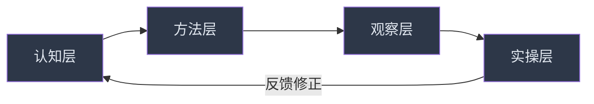

## 二、课程与学习资源

社交能力的提升是一个系统工程。仅靠零散的技巧碎片无法建立稳固的社交能力体系——你需要有结构的学习路径、高质量的输入源，以及将知识转化为行为的刻意练习。本章按"课程→书籍→播客→视频→社区→练习工具"六大维度，为你构建完整的社交学习资源库，并给出按水平分级的推荐路径。

### 2.1 学习路径总览

在选择具体资源之前，先理解社交能力的学习框架。一个完整的社交学习体系应包含四个层次：

| 层次 | 内容 | 典型资源类型 | 占比建议 |
|------|------|-------------|---------|
| **认知层** | 理解社交心理学原理、人际动力学 | 课程、书籍 | 30% |
| **方法层** | 掌握具体沟通策略和框架 | 课程、工作坊 | 25% |
| **观察层** | 分析优秀社交者的实际表现 | 视频、播客、案例 | 20% |
| **实操层** | 在真实场景中反复练习 | 角色扮演、社群、工具 | 25% |

最常见的误区是只停留在认知层（大量阅读和听课）而忽视实操层。社交是一项技能，就像游泳——你不可能通过读教材学会换气。合理的学习配比应该是"3分学、7分练"。

### 2.2 在线课程

#### 2.2.1 入门级课程（零基础友好）

**《社交心理学》——耶鲁大学（Coursera）**

这是社交学习的最佳起点。课程由耶鲁大学心理学系教授主讲，系统覆盖人际吸引的基本规律、态度改变的机制、群体行为的动力学，以及偏见与歧视的心理根源。

- **平台**：Coursera（https://www.coursera.org）
- **费用**：免费旁听，付费获取证书（约49美元）
- **时长**：约6周，每周3-5小时
- **语言**：英文授课，提供中文字幕
- **适合人群**：对社交心理学零基础的学习者
- **核心收获**：理解"人为什么会互相吸引""第一印象如何形成""群体压力如何影响个体"等底层原理
- **推荐指数**：★★★★★

**为什么推荐这门课**：社交中的很多困惑——"为什么我明明很真诚但对方不买账""为什么有些人天然就有吸引力"——本质上都是心理学问题。这门课给你一个科学框架，让你从"凭感觉社交"升级到"懂原理社交"。

**《幸福的科学》——耶鲁大学（Coursera）**

劳里·桑托斯（Laurie Santos）教授的爆款课程，曾是耶鲁历史上选课人数最多的课程。课程探讨幸福的科学基础，其中大量内容涉及社交关系对幸福感的决定性影响。

- **平台**：Coursera
- **费用**：免费旁听
- **时长**：约10周，每周2-3小时
- **语言**：英文授课，提供中文字幕
- **适合人群**：所有希望理解"社交与幸福关系"的学习者
- **核心收获**：理解为什么社交连接是幸福最重要的预测因子，以及如何通过改善社交质量提升整体生活满意度
- **推荐指数**：★★★★★

**《积极心理学》——哈佛大学公开课**

塔尔·本-沙哈尔（Tal Ben-Shahar）教授的传奇课程，曾在哈佛创下选课人数纪录。课程核心主题之一就是"如何建立有意义的人际连接"，将社交能力与积极心理学框架深度融合。

- **平台**：网易公开课、B站（搜索"哈佛积极心理学"）
- **费用**：免费
- **时长**：23集完整课程
- **语言**：英文授课，部分版本有中文字幕
- **适合人群**：希望从"心理资本"角度理解社交的学习者
- **核心收获**：理解"自尊不是社交的前提，社交是自尊的来源"这一反直觉结论
- **推荐指数**：★★★★★

#### 2.2.2 进阶级课程（有基础后深入）

**《谈判的艺术》——哈佛谈判项目（多平台）**

谈判是职场社交的高级形态。哈佛谈判项目的创始人罗杰·费舍尔（Roger Fisher）提出的"原则性谈判"框架，是全球谈判教学的基石。课程教你如何在维护关系的同时争取利益，这正是社交能力的高级体现。

- **平台**：Coursera、edX、得到App
- **费用**：Coursera可免费旁听，得到App课程约99元
- **时长**：4-8周不等
- **语言**：各平台语言不同，得到为中文原创内容
- **适合人群**：有一定社交基础，需要在职场中处理复杂人际博弈的学习者
- **核心收获**：掌握"把人和问题分开""关注利益而非立场""创造双赢选项"三大谈判原则
- **推荐指数**：★★★★☆

**《影响力》相关课程——罗伯特·西奥迪尼体系**

基于西奥迪尼（Robert Cialdini）的经典著作《影响力》开发的课程体系，系统讲解互惠、承诺一致、社会认同、喜好、权威、稀缺六大影响力原则。这不是"操控术"——理解这些原则是为了让你识别社交中的影响力模式，既能有效说服他人，也能避免被他人操控。

- **平台**：LinkedIn Learning、Udemy（搜索"Influence Cialdini"）
- **费用**：LinkedIn Learning 约29.99美元/月，Udemy 单课程约12.99美元（常有折扣）
- **时长**：2-4小时
- **语言**：英文为主
- **适合人群**：需要提升职场说服力和影响力的学习者
- **核心收获**：理解人类决策中的心理捷径，学会在社交中有策略地运用影响力原则
- **推荐指数**：★★★★☆

**《高难度对话》——Crucial Conversations 课程体系**

基于帕特森（Kerry Patterson）等人合著的《关键对话》一书开发的培训课程。聚焦于"当赌注很高、观点不同、情绪激烈时如何有效沟通"——这是社交能力的终极考验。

- **平台**：Crucial Learning 官网（https://cruciallearning.com）
- **费用**：企业培训版较贵（数千美元），个人版约500-800美元
- **时长**：2天集中培训 或 7周在线课程
- **语言**：英文为主，部分培训师提供中文授课
- **替代方案**：如果预算有限，阅读原书《关键对话》+ B站上的拆书视频也能获得80%的核心内容
- **适合人群**：经常面对冲突性对话的管理者、HR、销售
- **核心收获**：学会在情绪升级前建立安全感，让双方都愿意开口说真话
- **推荐指数**：★★★★☆

#### 2.2.3 中文特色课程

**得到App——《关系攻略》（熊太行）**

专栏作者熊太行以"人际关系拆解"为核心，用大量真实案例分析中国社会语境下的社交策略。涵盖职场上下级关系、亲戚关系、邻里关系等中国特有的社交场景。

- **平台**：得到App
- **费用**：约199元/年
- **适合人群**：希望在中文语境下理解社交策略的学习者
- **核心收获**：理解中国社会的"面子""人情""关系"三套隐性规则
- **推荐指数**：★★★★☆

**混沌学园/樊登读书——沟通类课程**

混沌学园和樊登读书都有大量与社交、沟通相关的课程和书籍解读。樊登读书的优势在于将经典书籍（如《非暴力沟通》《关键对话》《沟通的艺术》）浓缩为45分钟的音频讲解，适合碎片时间学习。

- **平台**：樊登读书App
- **费用**：约365元/年
- **适合人群**：时间碎片化，需要快速获取书籍精华的学习者
- **推荐指数**：★★★☆☆（适合入门了解，深度学习仍需阅读原书）

### 2.3 书籍推荐

书籍是社交学习中性价比最高的资源。以下是按主题分类的精选书单，每本书都标注了难度和适用场景。

#### 2.3.1 社交心理学基础

| 书名 | 作者 | 难度 | 核心价值 | 一句话推荐 |
|------|------|------|---------|-----------|
| 《社会心理学》 | 戴维·迈尔斯 | ★★★☆☆ | 社交心理学最权威教材，系统全面 | 社交学习的"字典"，常翻常新 |
| 《影响力》 | 罗伯特·西奥迪尼 | ★★☆☆☆ | 六大影响力原则，通俗易懂 | 读完你会明白"为什么你会不由自主地点头" |
| 《乌合之众》 | 古斯塔夫·勒庞 | ★★☆☆☆ | 群体心理学经典，理解从众行为 | 理解"为什么人在群体中会变蠢" |
| 《亲密关系》 | 罗兰·米勒 | ★★★☆☆ | 亲密关系的科学解析 | 伴侣关系的"使用说明书" |

#### 2.3.2 沟通技巧

| 书名 | 作者 | 难度 | 核心价值 | 一句话推荐 |
|------|------|------|---------|-----------|
| 《非暴力沟通》 | 马歇尔·卢森堡 | ★★☆☆☆ | 四步沟通法：观察-感受-需要-请求 | 解决"明明好意却伤人"的沟通困境 |
| 《关键对话》 | 科里·帕特森 等 | ★★★☆☆ | 高压力场景下的沟通框架 | 面对冲突不再"脑子一片空白" |
| 《沟通的艺术》 | 罗纳德·阿德勒 | ★★★☆☆ | 沟通学最全面的教材 | 沟通领域的"百科全书" |
| 《蔡康永的说话之道》 | 蔡康永 | ★☆☆☆☆ | 中文语境下的说话技巧 | 轻松易读，适合社交入门 |
| 《学会提问》 | 尼尔·布朗 | ★★☆☆☆ | 批判性思维与提问技巧 | 学会问出"好问题"比会说话更重要 |

#### 2.3.3 人际关系与情商

| 书名 | 作者 | 难度 | 核心价值 | 一句话推荐 |
|------|------|------|---------|-----------|
| 《人性的弱点》 | 戴尔·卡耐基 | ★★☆☆☆ | 人际关系的永恒经典 | 90年过去了依然是"社交第一书" |
| 《情商》 | 丹尼尔·戈尔曼 | ★★★☆☆ | 情商的科学基础和实践方法 | 理解"为什么智商高的人也会社交失败" |
| 《被讨厌的勇气》 | 岸见一郎 | ★★☆☆☆ | 阿德勒心理学的社交哲学 | 解决"太在意别人看法"的心理困境 |
| 《深度关系》 | 大卫·布拉德福德 | ★★★☆☆ | 斯坦福商学院的人际关系课 | 学会建立真正有深度的人际连接 |
| 《别独自用餐》 | 基思·法拉奇 | ★★☆☆☆ | 人脉经营的实战指南 | 社交不是天赋，是可以系统经营的 |

#### 2.3.4 职场社交与领导力

| 书名 | 作者 | 难度 | 核心价值 | 一句话推荐 |
|------|------|------|---------|-----------|
| 《高效能人士的七个习惯》 | 史蒂芬·柯维 | ★★☆☆☆ | "双赢思维""知彼解己"等社交原则 | 不只是效率书，更是人际哲学 |
| 《向上管理》 | 杰拉尔德·尼尔伯格 | ★★☆☆☆ | 与上级建立有效关系 | 职场生存的必修课 |
| 《联盟》 | 里德·霍夫曼 | ★★☆☆☆ | 职场关系的新型框架 | LinkedIn创始人的职场社交哲学 |
| 《奈飞文化手册》 | 帕蒂·麦考德 | ★★☆☆☆ | 透明沟通的企业文化范本 | 理解"极致坦诚"的社交价值 |

#### 2.3.5 阅读建议

不要试图一次读完所有书。按以下路径选择：

1. **第一阶段（打基础）**：先读《影响力》+《非暴力沟通》+《人性的弱点》——这三本覆盖了社交心理学基础、沟通技巧和人际关系三大核心领域
2. **第二阶段（建体系）**：读《社会心理学》+《关键对话》+《情商》——从理论到实践建立完整框架
3. **第三阶段（补短板）**：根据自己的薄弱环节选择专题书籍——如果不会经营人脉读《别独自用餐》，如果太在意别人看法读《被讨厌的勇气》
4. **第四阶段（持续精进）**：阅读原版英文书籍、学术论文，参加线下读书会

### 2.4 播客推荐

播客的独特价值在于它提供了一种"陪伴式学习"体验——你可以在通勤、运动、做家务时持续获取高质量的社交知识输入。以下是精选推荐：

#### 2.4.1 中文播客

**《蔡康永的201堂情商课》**
- **平台**：喜马拉雅
- **费用**：部分免费，完整版约199元
- **更新频率**：已完结，共201集
- **核心内容**：蔡康永以温和、细腻的方式讲解情商的各个维度，每集围绕一个具体场景展开（如"如何拒绝别人而不伤感情""如何在饭局上不尴尬"）
- **适合人群**：社交入门者，尤其是内向型人格
- **推荐指数**：★★★★★

**《故事FM》**
- **平台**：喜马拉雅、Apple Podcasts、小宇宙
- **费用**：免费
- **更新频率**：每周更新
- **核心内容**：每期一个真实人物故事，让你听到不同人生背景下的人如何处理社交困境、亲密关系、职场冲突
- **适合人群**：通过真实故事理解社交复杂性的学习者
- **推荐指数**：★★★★☆

**《心理学通识》（武志红）**
- **平台**：得到App
- **费用**：约199元
- **核心内容**：从心理学角度解析人际关系中的深层模式，尤其是原生家庭对社交模式的影响
- **适合人群**：希望理解自己社交行为深层原因的学习者
- **推荐指数**：★★★★☆

#### 2.4.2 英文播客

**《The Art of Charm》**
- **平台**：Apple Podcasts、Spotify
- **费用**：免费
- **核心内容**：专注于社交技能、人际关系和自信建立，邀请心理学家、社交专家和成功人士分享经验。节目风格实用、直接，不回避社交中的尴尬话题
- **适合人群**：英语水平中等以上，希望了解西方社交文化的男性学习者
- **推荐指数**：★★★★☆

**《Hidden Brain》（NPR）**
- **平台**：Apple Podcasts、Spotify、NPR官网
- **费用**：免费
- **核心内容**：Shankar Vedantam 主持，用叙事方式讲述社会心理学研究，帮你理解"为什么人们会做出看似不合理的社交行为"
- **适合人群**：对社交行为背后科学原理感兴趣的学习者
- **推荐指数**：★★★★★

**《Where Shall We Begin?》（Esther Perel）**
- **平台**：Apple Podcasts、Spotify
- **费用**：免费
- **核心内容**：全球顶级伴侣治疗师 Esther Perel 的真实治疗录音（获得来访者同意），让你在旁听中理解亲密关系的运作机制
- **适合人群**：希望理解亲密关系动力学的学习者
- **推荐指数**：★★★★★

**《Dare to Lead》（Brené Brown）**
- **平台**：Apple Podcasts、Spotify
- **费用**：免费
- **核心内容**：TED播放量破亿的布琳·布朗的播客，深入探讨脆弱性、信任、勇气在人际关系中的作用
- **适合人群**：领导者和希望在职场建立信任关系的学习者
- **推荐指数**：★★★★☆

### 2.5 视频资源

#### 2.5.1 TED演讲精选

TED演讲是社交学习的"开胃菜"——每个演讲只有10-20分钟，但往往能带来关键认知突破。以下是经过时间验证的经典：

| 演讲标题 | 演讲者 | 核心观点 | 播放量 | 链接关键词 |
|----------|--------|---------|--------|-----------|
| 《脆弱的力量》 | Brené Brown | 脆弱不是弱点，而是连接的起点 | 6000万+ | TED vulnerability |
| 《如何成为一个好的交谈者》 | Celeste Headlee | 10条实用交谈技巧，核心是"真正倾听" | 2500万+ | TED 10 ways conversation |
| 《肢体语言塑造你自己》 | Amy Cuddy | 肢体语言不仅影响别人对你的看法，还改变你的生理状态 | 7000万+ | TED body language |
| 《内向者的力量》 | Susan Cain | 内向不是社交缺陷，而是独特的社交优势 | 4000万+ | TED power of introverts |
| 《如何让压力成为你的朋友》 | Kelly McGonigal | 改变对压力的看法，压力就能变成社交助力 | 2500万+ | TED stress friend |
| 《你的肢体语言可能表明了什么》 | Amy Cuddy | 超人姿势能提升自信激素 | 7000万+ | TED your body language |
| 《为什么我们做得不好工作中的对话》 | Kym Terribile | 职场中困难对话的回避模式及破解 | 500万+ | TED workplace conversation |

#### 2.5.2 B站优质UP主

对于中文学习者，B站上有大量免费且高质量的社交相关内容：

**心理学方向：**
- **李永乐老师**：虽然主打科普，但有大量关于社会心理学、群体行为的讲解，深入浅出
- **武志红**：知名心理学家的官方频道，解析人际关系中的心理模式
- **KnowYourself**：用心理学视角解读社交行为，文章和视频质量都很高

**沟通技巧方向：**
- **半佛仙人**：虽然主打商业分析，但对人际博弈和社交策略的分析极其犀利
- **姜Dora在此**：沟通表达类内容，风格轻松实用

**TED搬运/翻译方向：**
- **TED精选演讲**（官方频道）：带中文字幕的TED演讲合集
- **网易公开课**：大量国外大学公开课的中文翻译版

#### 2.5.3 YouTube频道推荐

| 频道名称 | 内容方向 | 更新频率 | 适合人群 |
|----------|---------|---------|---------|
| Charisma on Command | 分析名人的社交技巧，教你提升个人魅力 | 每周 | 想提升社交魅力的年轻人 |
| Improvement Pill | 用动画讲解社交心理学和自我提升 | 每周 | 视觉学习者 |
| School of Life | 哲学视角下的人际关系和情感教育 | 每周 | 喜欢深度思考的学习者 |
| Vanessa Van Edwards | 科学驱动的社交技巧和肢体语言教学 | 每两周 | 需要科学方法论的学习者 |

### 2.6 学习社群与实践平台

理论学习之外，你需要真实的社交场景来练习。以下是提供结构化练习机会的社群和平台：

#### 2.6.1 线下社群

**Toastmasters（头马演讲俱乐部）**
- **是什么**：全球最大的演讲和领导力培养组织，在中国100+城市有俱乐部
- **为什么推荐**：它提供了一个"安全的练习场"——每周一次的例会中，你可以练习即兴演讲、准备演讲、评估他人演讲，逐步突破社交恐惧
- **费用**：半年会费约600-900元（因俱乐部而异）
- **适合人群**：希望提升公众表达和自信的社交学习者
- **找俱乐部**：访问 https://www.toastmasters.org 搜索附近俱乐部
- **推荐指数**：★★★★★

**即兴戏剧工作坊（Improv Workshop）**
- **是什么**：即兴戏剧（Improv）训练的核心是"接受与拓展"——接受对方给你的任何设定，然后在此基础上拓展。这正是社交中最核心的能力
- **为什么推荐**：它强制你在无准备的情况下做出反应，训练的是"社交直觉"而非"社交脚本"
- **费用**：单次工作坊约100-300元
- **城市**：北京、上海、广州、深圳、成都等一线城市均有开设
- **推荐指数**：★★★★☆

**读书会/学习小组**
- **怎么找**：豆瓣同城活动、微信读书的"共读"功能、本地独立书店的读书会
- **为什么推荐**：读书会的核心价值不是读书——是练习在安全环境中表达观点、倾听不同意见、处理分歧
- **费用**：大多数免费或仅需一杯咖啡的钱
- **推荐指数**：★★★★☆

#### 2.6.2 线上练习平台

**7 Cups（七杯茶）**
- **平台**：https://www.7cups.com
- **核心功能**：免费在线倾听服务平台——你可以作为"倾听者"为他人提供情感支持，同时训练自己的倾听能力
- **为什么推荐**：倾听是社交中最被低估的技能。作为倾听者，你会亲身体验"好的倾听和差的倾听带给你的感受差异"
- **费用**：免费
- **推荐指数**：★★★★☆

**Omegle / 随机聊天平台**
- **注意**：这类平台已不如早期健康，但其核心理念——与随机陌生人进行无压力对话——仍有训练价值
- **替代方案**：Discord 上的兴趣社群是更好的"轻社交练习场"——你可以在文字频道先参与讨论，再逐步进入语音频道
- **推荐指数**：★★★☆☆（需注意网络安全）

### 2.7 学习工具与辅助资源

#### 2.7.1 记录与复盘工具

| 工具 | 用途 | 使用建议 |
|------|------|---------|
| **Notion / 语雀** | 记录社交复盘日记 | 每次重要社交后记录：发生了什么、我做了什么、效果如何、下次怎么改 |
| **Flomo（浮墨笔记）** | 碎片化社交观察记录 | 看到好的社交案例随手记录，积累自己的"社交案例库" |
| **录音转文字工具** | 分析自己的对话模式 | 用飞书妙记或讯飞听见将自己的对话录音转文字，分析自己说了多少废话、打断了对方几次 |
| **Anki** | 记忆社交技巧和话术 | 将学到的社交原则做成记忆卡片，利用间隔重复巩固 |

#### 2.7.2 社交恐惧辅助工具

对于社交焦虑较严重的学习者，以下工具可以作为循序渐进的脱敏训练：

**Wysa / Woebot（AI心理聊天机器人）**
- 提供认知行为疗法（CBT）引导，帮助你识别和挑战社交焦虑中的非理性思维
- 适合作为正式心理咨询的补充，不适合替代专业治疗

**VR社交练习应用**
- **平台**：Meta Quest 系列
- **应用**：VirtualSpeech、Ovation 等
- **核心功能**：在虚拟环境中练习演讲、面试、社交场景，降低真实场景的焦虑感
- **适合人群**：重度社交焦虑、需要渐进式脱敏的学习者

### 2.8 不同水平的学习方案

#### 2.8.1 社交新手（完全没有方向）

**4周启动方案：**

| 周次 | 学习内容 | 实践任务 |
|------|---------|---------|
| 第1周 | 读《非暴力沟通》前3章 + 看《脆弱的力量》TED | 每天主动跟1个不太熟的人打招呼 |
| 第2周 | 读完《非暴力沟通》+ 看《内向者的力量》TED | 每天跟1个人进行5分钟以上的对话 |
| 第3周 | 听《蔡康永的201堂情商课》前10集 | 主动约1个同事/同学吃饭 |
| 第4周 | 复盘前三周，记录自己的进步和困难 | 加入1个线下社群（Toastmasters或读书会） |

#### 2.8.2 有一定基础但不够自信

**8周进阶方案：**

| 周次 | 学习内容 | 实践任务 |
|------|---------|---------|
| 第1-2周 | 读《影响力》+ 读《关键对话》 | 在1次有分歧的对话中运用"关键对话"框架 |
| 第3-4周 | 听 Hidden Brain 播客10集 + 看 Charisma on Command 5个视频 | 在社交场合练习"3秒停顿法"（别人说完后停3秒再回应） |
| 第5-6周 | 读《情商》+ 开始Toastmasters | 完成1次正式演讲（哪怕只有5分钟） |
| 第7-8周 | 读《深度关系》+ 复盘 | 主动发起1次深度对话（聊真实感受而非表面话题） |

#### 2.8.3 社交达人想更上一层楼

**持续精进方案：**
- 阅读学术期刊论文（如 *Journal of Personality and Social Psychology*）
- 学习系统思维——社交高手的核心能力是理解"系统中的人"而非"单独的人"
- 研究影响力和说服术的高级策略（《预说服》罗伯特·西奥迪尼）
- 尝试教练/导师角色——教别人社交是最好的学习方式
- 学习跨文化社交——理解不同文化背景下的社交规则差异

### 2.9 常见误区与纠正

| 误区 | 真相 | 纠正方法 |
|------|------|---------|
| "我需要看完所有书才能开始社交" | 社交是技能，必须在实践中学习 | 学一个技巧就用一个，不要等"学完" |
| "内向的人不适合社交" | 内向者的优势是深度连接，不是广度 | 发挥倾听优势，少而精的社交质量更高 |
| "社交技巧就是话术和套路" | 技巧只是表面，真诚才是底层 | 先培养对他人的真实好奇心，技巧才有用 |
| "学了很多课程但没有效果" | 输入过多、输出不足 | 把学习时间的50%以上用于实操练习 |
| "社交恐惧必须先克服才能学社交" | 适度紧张是正常的，不需要等到"完全不怕" | 带着焦虑去行动，行动本身会降低焦虑 |
| "看TED演讲就够了" | TED是"认知启发"而非"能力训练" | TED是起点，不是终点 |

### 2.10 资源获取指南

#### 2.10.1 费用分级方案

| 预算 | 推荐组合 |
|------|---------|
| **0元** | B站公开课 + 免费播客 + 图书馆借书 + Toastmasters免费体验 + TED演讲 |
| **500元以内** | 樊登读书年卡（365元）+ 1-2本纸质书 + Toastmasters半年会费 |
| **2000元以内** | 上述 + Coursera课程证书 + 2次即兴戏剧工作坊 + 专业社交类课程 |
| **5000元以上** | 上述 + 一对一社交教练 + 线下高阶工作坊 + VR练习设备 |

#### 2.10.2 免费资源汇总

- **Coursera/edX**：几乎所有课程都可以免费旁听（不获取证书）
- **TED官网**：所有演讲免费观看，大多数有中文字幕
- **网易公开课**：大量国外名校课程的免费中文翻译版
- **B站**：中国最大的免费学习视频平台
- **喜马拉雅/小宇宙**：大量免费播客
- **微信读书**：部分社交类书籍可免费阅读
- **图书馆**：实体书和电子书都可以借阅

社交能力的提升没有捷径，但有好路。选择适合你当前阶段的资源，学一点用一点，持续迭代——这才是最高效的学习路径。
