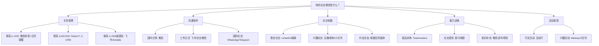

## 三、工具与应用

工具是社交能力的放大器。好的工具不会替代你的人际交往能力，但能帮你更系统地管理关系、更高效地分配社交精力、更精准地找到合适的社交对象。本章将社交工具分为六大类：关系管理、沟通平台、社交拓展、学习训练、活动社区、AI辅助，从底层方法论到具体操作逐一展开。

### 3.1 关系管理工具：建立你的个人CRM

社交中最常见的困境是"认识了很多人，但关系逐渐淡化"。根本原因不是你不够用心，而是缺乏系统化的关系管理机制。个人CRM（Customer Relationship Management）的核心思路是：把重要的人际关系当作需要经营的"资产"，用结构化的方式记录、跟踪和维护。

#### 3.1.1 关系分层管理法

在选择工具之前，先建立正确的管理框架。将联系人按重要程度分为四层：

| 层级 | 定义 | 维护频率 | 数量参考 |
|------|------|----------|----------|
| 核心圈 | 家人、挚友、人生导师 | 每周至少1次 | 5-10人 |
| 重要圈 | 好友、密切同事、合作伙伴 | 每月至少1次 | 20-50人 |
| 活跃圈 | 普通朋友、行业同行 | 每季度至少1次 | 50-150人 |
| 弱连接 | 偶尔联系的人、泛泛之交 | 重大节日/事件时联系 | 不限 |

不同层级的联系人使用不同的管理策略和工具组合。核心圈不需要工具提醒——你自然会想到他们；工具的价值主要体现在重要圈和活跃圈的维护上。

#### 3.1.2 微信通讯录管理

微信是中国社交的基础设施，80%的关系维护都在微信上完成。以下是具体的管理方法：

**标签体系搭建**

微信的"标签"功能是最基础的分组工具，但大多数人只用了一两个标签。建议按以下维度建立多维标签：

- **来源标签**：同事、同学、家人、客户、网友、活动认识
- **行业标签**：互联网、金融、教育、医疗、自媒体
- **关系标签**：核心、重要、活跃、弱连接（对应四层模型）
- **场景标签**：可约饭、可合作、可请教、可介绍人脉

一个联系人可以同时有多个标签。当你需要找某个行业的合作方、或者想约几个朋友吃饭时，按标签筛选远比翻通讯录高效。

**具体操作步骤**：

1. 打开微信 → 通讯录 → 标签
2. 点击"新建标签"，按上述维度创建基础标签组
3. 逐批将已有联系人归入对应标签（建议每天花10分钟处理20人）
4. 新加好友时，第一时间打好标签再通过
5. 每月末花15分钟检查标签是否需要更新

**备注名规范**

大多数人对联系人的备注只写名字，但三个月后你就忘了这个人是谁、在哪认识的。建议备注名格式为：

姓名-来源-特征

例如："张三-2024产品大会-做AI教育的"、"李四-豆瓣读书会-推荐过XX书"。这样即使半年不联系，看到备注就能快速回忆起关键信息。

**朋友圈互动策略**

朋友圈是维护弱连接成本最低的方式。每天花5-10分钟浏览朋友圈，对重要联系人的动态进行有质量的评论（不只是点赞）。一条有共鸣的评论比十个赞更能拉近关系。

#### 3.1.3 Notion个人关系管理系统

当你的社交网络超过200人、且需要更精细化管理时，微信的标签功能就不够用了。Notion提供了强大的自定义数据库能力，可以搭建一个完整的个人CRM。

**数据库字段设计**：

| 字段名 | 类型 | 说明 |
|--------|------|------|
| 姓名 | Title | 联系人姓名 |
| 关系层级 | Select | 核心/重要/活跃/弱连接 |
| 来源 | Multi-select | 认识的渠道和场景 |
| 行业 | Select | 所属行业 |
| 职位 | Text | 当前职位和公司 |
| 最近联系 | Date | 上一次互动的日期 |
| 联系方式 | Text | 微信/电话/邮箱 |
| 共同话题 | Text | 兴趣爱好、共同经历 |
| 个人备注 | Text | 对方的特点、需要注意的事项 |
| 待办事项 | Text | 下次联系时想聊的事 |

**自动化提醒**：利用Notion的"最近联系"字段配合提醒功能，当某个重要联系人超过预设天数未联系时自动提醒。可以创建一个"需要维护的关系"视图，筛选条件为"最近联系"超过30天且"关系层级"为"重要"或"核心"。

**实操建议**：不要一开始就录入所有联系人——这会让你还没开始就放弃。先从最重要的30人开始，每周增加10人，一个月内就能建立基础数据库。日常维护只需在每次重要互动后花30秒更新记录。

#### 3.1.4 飞书多维表格与Airtable

如果你需要多人协作管理关系（比如创业团队共同维护客户关系），飞书多维表格和Airtable比Notion更适合：

**飞书多维表格优势**：
- 与飞书消息、日历深度集成
- 支持自动化流程（如新联系人自动分配跟进人）
- 免费版功能已经足够个人使用
- 数据在国内服务器，访问速度快

**Airtable优势**：
- 视图类型最丰富（表格、看板、日历、甘特图、画廊）
- 第三方集成生态最完善（Zapier、Make等）
- 自动化功能强大（Automations）
- 缺点：服务器在海外，国内访问可能不稳定

**选择建议**：个人用Notion，团队用飞书，需要丰富自动化用Airtable。

#### 3.1.5 日历社交提醒系统

日历是最容易被忽视的社交管理工具。它的核心价值在于：把"应该联系某人"这个模糊的念头变成具体的、会弹出提醒的事件。

**具体设置方法**：

1. **生日提醒**：为所有重要联系人设置生日提醒，提前1天提醒（不是当天——当天你可能来不及准备）。微信通讯录可以同步生日信息。
2. **定期维护提醒**：为核心圈设置每周提醒，重要圈设置每月提醒。提醒内容不是"联系XX"，而是具体的行动，比如"问问张三项目进展"。
3. **重要事件提醒**：记录朋友的考试、面试、搬家等重要事件，在事件前后主动关心。
4. **社交复盘**：每周日晚上设置30分钟的社交复盘时间，回顾本周的社交互动，规划下周的社交安排。

### 3.2 沟通平台工具：选对渠道，事半功倍

不同的沟通场景适合不同的工具。选错工具会导致信息被淹没、回复不及时、或者给对方造成压力。

#### 3.2.1 即时通讯工具对比

| 工具 | 最佳场景 | 响应预期 | 注意事项 |
|------|----------|----------|----------|
| 微信 | 日常社交、工作沟通（国内） | 24小时内 | 避免频繁发语音，重要信息用文字 |
| 企业微信/飞书/钉钉 | 工作正式沟通 | 工作时间内 | 区分工作群和私聊的边界 |
| Telegram | 技术圈、海外社交 | 无严格预期 | 群组功能强大，适合兴趣社群 |
| Discord | 游戏、技术社区 | 无严格预期 | 频道结构清晰，适合长期社群运营 |
| WhatsApp | 海外社交 | 24小时内 | 国际通用性最强 |
| QQ | 年轻人群、文件传输 | 不定 | 群文件和群相册是独特优势 |

**跨平台沟通礼仪**：

- 不要同一时间在多个平台给同一个人发同样的消息
- 尊重对方偏好的沟通渠道——如果对方习惯用飞书回复，就不要总是用微信催
- 工作消息尽量在工作时间内发送，除非紧急
- 语音消息控制在30秒以内，重要信息用文字

#### 3.2.2 视频会议与线上社交

远程社交和线上会议已成为常态。以下是提升线上社交体验的工具选择：

**一对一深度交流**：
- 腾讯会议/Zoom：稳定可靠，适合正式的线上交流
- 微信视频：适合与熟人的日常视频聊天
- FaceTime：苹果用户之间的最佳选择

**多人线上社交**：
- 腾讯会议/Zoom：小型线上聚会（8人以内效果最好）
- Discord语音频道：适合社群日常语音闲聊
- 小鹅通/知识星球直播：适合有主题的线上分享会

**提升线上社交质量的技巧**：
- 开摄像头比不开摄像头的连接感强3倍以上
- 背景整洁、光线充足，这代表你对这次交流的重视
- 一对一视频通话控制在30-60分钟，超过1小时效率急剧下降
- 线上聚会人数控制在6人以内，超过后大多数人会变成"旁听者"

### 3.3 社交拓展工具：找到你的圈子

#### 3.3.1 专业社交平台

**LinkedIn（领英）**

LinkedIn是全球最大的职业社交平台，在中国也有相当的用户基础。它不只是"找工作"的工具，更是建立职业人脉的核心阵地。

**高效使用LinkedIn的方法**：
- **个人资料优化**：标题不只是写职位，而是写你能提供的价值。例如不要写"产品经理"，而是"帮B2B企业提升用户留存的产品经理"
- **内容策略**：每周发1-2条行业洞察，不需要长篇大论，200-500字的观点分享即可。关键是要有自己的见解，而不是转发新闻
- **连接策略**：每次添加连接时，务必写个性化邀请语。说明你是谁、在哪认识的、为什么想连接。模板："你好XX，我是YY，我们在ZZ活动上聊过关于AAA的话题，希望保持联系。"
- **定期互动**：每天花5分钟浏览动态，对有价值的内容进行评论。评论比点赞更有价值——它能让你出现在对方的视野中

**脉脉**

脉脉是中国版的"职场社交平台"，特点是匿名职场社区和实名职业社交并存。
- 适合了解行业动态、公司信息、薪资水平
- "实名"功能可以帮助你找到特定公司的特定职位的人
- 注意：匿名区信息需要辨别真伪，不要轻信

#### 3.3.2 兴趣社交平台

找到志同道合的人比"拓展人脉"更重要。以下是按兴趣类型推荐的平台：

**读书类**：
- 豆瓣读书：最成熟的中文读书社区，书评和评分体系完善
- 微信读书：可以看到好友在读什么书，适合发现共同兴趣
- 共读社群：微信搜索"共读"，有大量免费的读书打卡群

**运动健身类**：
- Keep：有社区功能，可以看到同城的运动活动
- 悦跑圈/咕咚：跑步社群，线下约跑非常普遍
- 各类球类运动微信群：通过运动场馆或体育用品店的公告栏找到

**户外旅行类**：
- 马蜂窝/穷游：旅行攻略社区，可以找到同目的地的旅伴
- 两步路/六只脚：户外徒步社群，线下徒步活动非常活跃
- 小红书：搜索"城市名+徒步/骑行/露营"，本地活动很多

**文艺创作类**：
- 豆瓣小组：按兴趣分组，文艺、手工、摄影、音乐各类都有
- 即刻：年轻人的兴趣社区，信息密度高、互动活跃
- 小红书：适合视觉类创作（摄影、绘画、手工）的分享和交流

**技术类**：
- GitHub：全球最大的代码托管平台，开源项目协作
- V2EX：中文技术社区，讨论质量较高
- 掘金/思否：中文开发者社区

#### 3.3.3 社交发现与约会应用

社交发现类应用适合想拓展社交圈、认识新朋友或寻找恋爱对象的人。使用前先明确自己的目的，不同目的选择不同平台。

**国内市场**：

| 应用 | 定位 | 用户画像 | 优势 | 劣势 |
|------|------|----------|------|------|
| 探探 | 交友约会 | 年轻人为主，18-30岁 | 操作简单，匹配效率高 | 外貌导向明显 |
| 陌陌 | 社交+娱乐 | 用户群体广泛 | 功能丰富，场景多样 | 娱乐化严重 |
| Soul | 灵魂社交 | 追求深度连接的年轻人 | 弱化外表，强调内在 | 用户活跃度不稳定 |
| 积目 | 兴趣社交 | 潮流年轻人 | 兴趣标签匹配精准 | 用户基数较小 |
| 青藤之恋 | 严肃婚恋 | 高学历人群 | 学历认证，用户质量高 | 需付费解锁功能 |

**国际市场**：

| 应用 | 定位 | 用户画像 | 优势 | 劣势 |
|------|------|----------|------|------|
| Bumble | 女性主导约会 | 受过良好教育的年轻人 | 女性先发起对话，减少骚扰 | 国内用户少 |
| Tinder | 交友约会 | 全球用户最广泛 | 用户基数最大 | 娱乐化倾向 |
| Hinge | 严肃关系 | 寻找长期关系的人 | 设计理念"designed to be deleted" | 国内用户极少 |

**使用约会应用的安全守则**：
1. 不要在个人资料中暴露具体住址、工作单位等敏感信息
2. 第一次见面必须选择公共场所，并告知朋友你的行踪
3. 不要轻易发送私密照片——一旦发出就无法控制传播
4. 对方催促线下见面或涉及金钱话题时，立即警惕
5. 信任你的直觉——如果感觉不对，随时可以终止对话

**提升匹配率的资料优化**：
- 照片选择：第一张用清晰的正面照（不是自拍），后面放展示兴趣爱好的生活照。避免过度修图——见面后落差感会适得其反
- 自我介绍：具体比笼统好。"周末喜欢去朝阳公园跑步，最近在学做川菜"比"喜欢运动和美食"有趣得多
- 保持真诚：不需要伪装成另一个人，吸引和你真实匹配的人才是最优策略

### 3.4 学习与训练工具：系统提升社交能力

社交能力是可以训练的。以下工具和平台能帮助你从"知道"到"做到"。

#### 3.4.1 演讲与表达训练

**Toastmasters（头马俱乐部）**

Toastmasters是全球最大的演讲和领导力培训组织，在全球145个国家有超过16,000个俱乐部。它采用"做中学"的方式，通过定期的演讲练习和即时反馈来提升表达能力。

**具体运作方式**：
- 每次会议2小时，包含备稿演讲、即兴演讲、评估三个环节
- 新会员从"破冰演讲"开始，逐步挑战更高级的项目
- 每位演讲者都会收到评估员的书面和口头反馈
- 会员轮流担任主持人、计时员、评估员等角色，全面锻炼领导力

**在国内参与的步骤**：
1. 访问 toastmasters.org，搜索你所在城市的俱乐部
2. 以"访客"身份免费参加2-3次会议，感受不同俱乐部的风格
3. 选择一个氛围适合你的俱乐部加入
4. 半年会费约500-800元（含全球总部费用+俱乐部场地费）
5. 建议每周参加一次会议，坚持3个月你会看到明显变化

**推荐指数**：★★★★★——这是性价比最高的社交能力训练方式，没有之一。

**即兴戏剧（Improv）工作坊**

即兴戏剧的核心训练是"是的，而且……"（Yes, and...）——接受对方的设定并在其基础上发展。这个能力直接对应社交中的倾听和接话能力。

**训练效果**：
- 提升临场反应速度：在无准备的情况下快速做出得体回应
- 增强倾听能力：必须认真听对方说什么才能"接戏"
- 降低社交焦虑：在安全的犯错环境中脱敏
- 培养幽默感：即兴喜剧的很多技巧可以直接用于社交

**参与方式**：北京、上海、广州、深圳、成都等城市都有Improv工作室，可以在大众点评或小红书搜索"即兴戏剧+城市名"。单次体验课通常100-200元。

**推荐指数**：★★★★☆

#### 3.4.2 社交知识学习

**音频课程**

利用碎片时间系统学习社交知识：

- **《好好说话》**（得到App）：马东团队出品，覆盖职场沟通、日常社交、亲密关系中的说话技巧。适合想系统提升表达能力的人。
- **《蔡康永的情商课》**（得到App）：蔡康永从自身经验出发讲解情商，案例生动，适合内向型人格学习社交技巧。
- **《关系攻略》**（得到App）：熊太行从社会学和心理学角度分析人际关系，适合想深入理解社交底层逻辑的人。
- **喜马拉雅/蜻蜓FM**：搜索"沟通""社交""情商"等关键词，有大量免费和付费课程。

**阅读平台**

- **微信读书**：大量社交相关书籍免费阅读，支持笔记和划线，可以看到其他读者的精彩评论。社交类入门推荐：《非暴力沟通》《人性的弱点》《沟通的艺术》
- **豆瓣读书**：通过书评和评分筛选高质量书籍，避免浪费时间在烂书上
- **得到电子书**：部分书籍有AI总结功能，适合快速判断一本书是否值得精读

#### 3.4.3 辩论与逻辑训练

辩论能力是社交中的"暗武器"——它训练的不是"吵架"，而是快速理解对方观点、找到逻辑漏洞、清晰表达自己立场的能力。

**参与方式**：
- 线下：各城市都有辩论俱乐部，豆瓣或Meetup搜索"辩论+城市名"
- 线上：B站有大量辩论赛视频（推荐《奇葩说》前几季，娱乐性和学习性兼备）
- App：知乎、即刻上的观点讨论也是练习逻辑表达的好场景

### 3.5 活动与社区工具：从线上走到线下

线上社交只能建立初步连接，真正的关系深化需要线下互动。以下工具帮你找到高质量的线下活动。

#### 3.5.1 活动发现平台

| 平台 | 活动类型 | 城市覆盖 | 费用 | 推荐指数 |
|------|----------|----------|------|----------|
| 活动行 | 行业峰会、创业活动、兴趣沙龙 | 一二线城市为主 | 免费-数百元 | ★★★★☆ |
| 互动吧 | 公益活动、培训课程、户外运动 | 覆盖较广 | 免费-数千元 | ★★★☆☆ |
| Meetup | 国际化的兴趣社群活动 | 一线城市 | 免费-100元 | ★★★★☆ |
| 大麦/摩天轮 | 演出、展览、体育赛事 | 全国 | 因活动而异 | ★★★☆☆ |
| 小红书 | 本地生活、同城活动 | 全国 | 多为免费 | ★★★★☆ |

**选择活动的原则**：
- 优先选择有互动环节的活动（工作坊、小组讨论），而非纯听讲的活动
- 人数控制在15-50人——太少没有社交价值，太多变成"听众"
- 选择你真正感兴趣的领域，而非"为了社交而社交"
- 提前了解活动流程和参与者背景，准备1-2个话题

#### 3.5.2 社群运营工具

如果你不仅是参加活动，还想自己创建和运营社群：

**微信生态**：
- 微信群：最基础的社群载体，适合200人以下的小社群
- 企业微信群：支持群机器人、自动回复、群公告等功能
- 公众号+小程序：适合需要内容沉淀和功能集成的社群

**专业社群工具**：
- 知识星球：付费社群首选，支持内容沉淀、问答、作业打卡
- 飞书/Lark群：适合技术社群，文档协作和机器人生态丰富
- Discord：适合国际化的技术或兴趣社群，频道结构清晰

**社群运营的核心节奏**：
1. 日常：每天至少一次群内互动（话题讨论、分享资讯）
2. 周常：每周一次主题活动（分享会、圆桌讨论）
3. 月常：每月一次大型活动（线下聚会、嘉宾分享）
4. 季度：复盘社群运营数据，淘汰不活跃的群，优化运营策略

### 3.6 AI辅助社交工具：智能提升效率

AI工具正在改变社交的方式，从内容创作到关系管理，都有AI可以发挥作用的场景。

#### 3.6.1 AI辅助沟通

- **ChatGPT/文心一言/Kimi**：帮你撰写重要邮件、准备演讲稿、练习面试对话。例如："帮我写一封感谢邮件，感谢张总在昨天的会议上给我的建议，要真诚但不谄媚。"
- **讯飞听见/飞书妙记**：会议录音自动转文字和总结，帮你回顾重要对话内容
- **DeepL/Google翻译**：跨语言社交时的翻译辅助，DeepL的翻译质量目前最高

#### 3.6.2 AI辅助社交准备

在重要社交场合前，AI可以帮你做以下准备：

1. **了解对方**：把对方的LinkedIn或公开信息发给AI，让它帮你提炼共同话题和关注点
2. **准备话术**：针对特定场景（如行业会议、相亲、面试），让AI帮你生成开场白和话题清单
3. **复盘分析**：社交结束后，把对话要点告诉AI，让它帮你分析哪些做得好、哪些可以改进

#### 3.6.3 AI辅助内容创作

在社交平台上持续输出有价值的内容是吸引同频人的最有效方式。AI可以帮你：

- 把你的零散想法整理成结构清晰的文章
- 为你的社交动态提供不同的表达方式
- 帮你修改润色文案，提升表达质量

**重要提醒**：AI是辅助工具，不是替代品。社交的核心是真诚和人味——用AI提升效率可以，但不要让AI替代你的真实表达。别人能感受到你是在"自己说话"还是"让AI说话"。

### 3.7 工具选择决策框架

面对这么多工具，如何选择适合自己的？以下是决策框架：

**工具使用的核心原则**：

1. **少即是多**：不要同时使用太多工具，3-4个足够。工具太多反而增加管理成本
2. **坚持为王**：一个你坚持使用的简单系统，胜过一个你三天就放弃的复杂系统
3. **定期清理**：每季度审视一次自己的工具清单，淘汰不再使用的工具
4. **安全第一**：任何工具都要注意隐私保护，不在不安全的平台上分享敏感信息
5. **工具为人服务**：如果某个工具让你觉得"管理社交关系变成了一种负担"，要么是工具不对，要么是你的方法需要调整

### 3.8 常见误区

**误区一：工具越多越好**

很多人同时用Notion、Airtable、飞书、Excel管理联系人，结果哪个都没坚持。选定一个系统，用透它，比同时用五个系统好一百倍。

**误区二：过度依赖线上社交工具**

社交软件只能帮你"找到人"，真正的关系建立需要线下互动或至少是语音/视频的深度交流。不要以为在微信上聊了一百条消息就是"好朋友"了。

**误区三：把社交当成任务清单**

过度工具化会让社交变得机械和功利。工具是用来降低"忘记维护"风险的，不是用来把每次互动都变成KPI的。如果提醒响了但你不想联系，那就跳过——不要为了完成任务而联系。

**误区四：忽视隐私安全**

在CRM工具中记录别人的个人信息（如电话、地址、私人经历）时，要意识到这些数据的安全风险。选择有良好安全记录的平台，定期备份，不要在公开场合展示你的联系人数据库。

**误区五：追求完美再开始**

很多人花大量时间研究"最好的CRM模板"，结果迟迟没有开始行动。记住：一个今天就开始用的70分系统，永远比一个你下周才开始用的99分系统有效。

***

