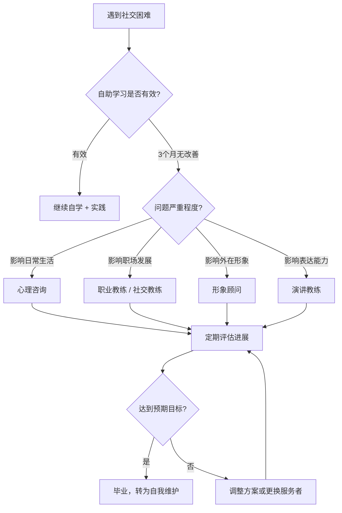
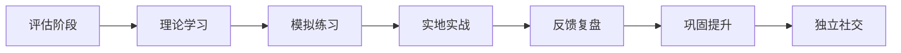

## 五、专业服务推荐

自助学习是社交能力提升的基础，但某些情况下，你需要专业人士的介入才能突破瓶颈。本节梳理社交领域中最有价值的六类专业服务，帮助你判断"什么时候该找专业人士"、"找什么样的人"、"怎么找到靠谱的人"。

### 5.1 什么时候需要专业服务

在决定花钱请专业人士之前，先做一个自我评估。以下信号说明自助手段可能已经不够：

| 信号 | 表现 | 建议服务类型 |
|------|------|-------------|
| 持续回避社交 | 超过6个月回避聚会、电话、面谈 | 心理咨询 |
| 身体症状 | 社交场合心悸、出汗、发抖、恶心 | 心理咨询（精神科） |
| 职场瓶颈 | 技术能力够但总在人际环节卡住 | 职业教练 |
| 沟通模式固化 | 反复在同类场景失败却找不到原因 | 社交技能教练 |
| 形象困惑 | 不知道如何在不同场合呈现得体形象 | 形象顾问 |
| 演讲恐惧 | 回避一切需要公开表达的场合 | 演讲教练 |
| 关系反复受挫 | 每段关系都因相似原因结束 | 心理咨询 / 关系教练 |

**核心判断标准**：如果某个社交问题已经严重影响了你的工作表现、日常生活或心理健康，且尝试过2-3种自助方法都没有明显改善，那就是寻求专业帮助的时机。

### 5.2 心理咨询：治社交焦虑的根

#### 5.2.1 什么情况需要心理咨询

心理咨询不是"有病才去"。以下情况都值得寻求专业支持：

- **社交焦虑障碍**：在社交场合持续感到强烈恐惧，明知不合理但无法控制，回避行为已影响正常生活
- **回避型人格倾向**：长期自我评价极低，对拒绝极度敏感，社交圈持续萎缩
- **创伤后应激**：曾遭遇社交创伤（霸凌、公开羞辱、背叛），导致持续回避特定社交场景
- **抑郁伴随社交退缩**：情绪低落导致社交意愿消失，形成恶性循环
- **关系模式困扰**：反复陷入不健康的关系模式，无法自行识别和改变

#### 5.2.2 主流疗法对比

| 疗法 | 适用场景 | 核心原理 | 疗程 | 疗效证据 |
|------|---------|---------|------|---------|
| **认知行为疗法（CBT）** | 社交焦虑、恐惧症 | 识别并改写导致焦虑的自动化思维和认知扭曲 | 12-20次 | ★★★★★ 最充分 |
| **接纳承诺疗法（ACT）** | 社交焦虑、回避行为 | 接纳焦虑感受而非对抗，承诺按价值观行动 | 8-16次 | ★★★★☆ |
| **暴露疗法** | 特定社交恐惧 | 系统脱敏，逐步暴露于恐惧情境直到焦虑消退 | 8-12次 | ★★★★★ |
| **精神动力学疗法** | 深层关系模式问题 | 探索早期经历如何塑造当前社交模式 | 长程（6月+） | ★★★☆☆ |
| **人际关系疗法（IPT）** | 人际关系困扰 | 聚焦当前人际关系中的角色转换、冲突、哀伤 | 12-16次 | ★★★★☆ |
| **团体治疗** | 社交技能练习 | 在安全的团体环境中练习社交，获得实时反馈 | 12-24次 | ★★★★☆ |
| **EMDR** | 社交创伤 | 通过眼动脱敏处理创伤记忆 | 6-12次 | ★★★★☆（创伤） |

**针对社交焦虑，CBT是首选疗法**。其核心流程包括：

1. **心理教育**：理解焦虑的本质——焦虑不是敌人，是大脑的误报警
2. **认知重建**：识别"别人一定在评判我"、"我会出丑"等自动化思维，用证据检验并替换
3. **行为实验**：设计真实场景去验证灾难化预测是否成真
4. **暴露阶梯**：从低焦虑场景（和熟人聊天）逐步过渡到高焦虑场景（公开演讲）
5. **复发预防**：制定应对未来波动的个人方案

#### 5.2.3 如何选择心理咨询师

**资质核查清单**：

- 国家二级/三级心理咨询师证书（2017年后已停考，持证者仍有效）
- 中国心理学会注册系统认证（注册心理师、注册督导师）
- 卫生健康委员会认证的心理治疗师（医疗系统内）
- 相关专业硕士及以上学历（心理学、精神医学、社会工作）
- 持续接受督导的证明（这是专业性的关键指标）

**首次咨询时应关注的信号**：

- ✅ 好的信号：主动了解你的目标、设定治疗计划、解释使用的方法、尊重你的边界
- ❌ 警惕信号：急于给建议而不倾听、承诺"保证治好"、模糊收费、突破身体边界、在咨询室外建立私人关系

**首次咨询该问的问题**：

1. "您对社交焦虑问题的处理经验如何？"
2. "您通常使用什么疗法？为什么选择这种方法？"
3. "一个完整的治疗周期大概多久？我们如何评估进展？"
4. "如果我觉得我们不合适，您建议怎么处理？"

#### 5.2.4 线上 vs 线下选择

| 维度 | 线上咨询 | 线下咨询 |
|------|---------|---------|
| 便捷性 | ★★★★★ 随时随地 | ★★★☆☆ 需通勤 |
| 隐私性 | ★★★★☆ 在家更放松 | ★★★★★ 专业空间 |
| 深度连接 | ★★★☆☆ 屏幕阻隔 | ★★★★☆ 面对面更真实 |
| 费用 | 200-600元/次 | 300-800元/次 |
| 适合人群 | 社交焦虑严重到无法出门 | 需要深度工作或团体治疗 |
| 主流平台 | 简单心理、壹心理、KnowYourself、好心情 | 当地心理咨询中心、医院心理科 |

**建议**：如果你的社交焦虑严重到连出门见咨询师都很困难，从线上开始完全没问题。当焦虑缓解到一定程度后，转为线下可以获得更深入的工作效果。

#### 5.2.5 费用与疗程规划

- **初次评估**（1-2次）：300-800元/次，50分钟/次
- **常规咨询**：300-600元/次（新手咨询师）/ 600-1500元/次（资深咨询师）
- **CBT标准疗程**：12-20次，总费用约4000-30000元
- **医保覆盖**：部分三甲医院心理科可走医保，但排队时间长
- **EAP（员工援助计划）**：部分企业提供免费心理咨询额度，通常3-6次/年，咨询HR了解

**省钱策略**：

1. 优先使用公司EAP，虽然次数有限但可以帮你判断是否需要进一步治疗
2. 三甲医院心理科性价比最高（部分可医保），但每次时间可能较短
3. 心理学高校的实习咨询中心收费低（50-150元/次），有督导保障质量
4. 简单心理等平台新用户有首次优惠

### 5.3 职业教练（Career Coach）：突破职场社交瓶颈

#### 5.3.1 职业教练 vs 心理咨询的区别

很多人分不清这两者。核心区别在于：

| 维度 | 心理咨询师 | 职业教练 |
|------|-----------|---------|
| 聚焦 | 过去创伤、心理障碍 | 未来目标、行动计划 |
| 目标 | 恢复正常功能 | 从良好到卓越 |
| 方法 | 治疗性干预 | 目标导向的策略制定 |
| 适合 | 社交焦虑、创伤 | 职场晋升、人脉拓展 |
| 资质 | 心理学相关执照 | ICF认证（国际教练联合会） |

#### 5.3.2 职业教练能帮你解决的具体问题

- **向上管理**：如何与上级建立有效的沟通模式，如何在汇报中展现价值
- **跨部门协作**：如何在没有职权影响力的情况下推动协作
- **职场演讲**：会议发言、项目汇报、年度述职的结构化表达
- **谈判能力**：薪资谈判、资源争取、冲突解决中的沟通策略
- **人脉经营**：如何在行业活动中有效社交，如何维护职场人脉网络
- **面试准备**：行为面试中的STAR表达法、高管面试的气场塑造
- **职业转型**：换行业时如何快速建立新的社交网络

#### 5.3.3 如何选择靠谱的职业教练

**资质认证**（按权威性排序）：

1. **ICF认证教练**（PCC/MCC级别）——国际教练联合会认证，最具权威性
2. **CPCP认证**——国际教练联盟认证的专业教练
3. **国内教练机构认证**——埃里克森、ICF中国等机构的认证项目
4. **行业经验**——在你所在行业有10年以上经验的资深人士

**筛选流程**：

1. 查看教练的LinkedIn或个人网站，确认从业背景
2. 大多数教练提供15-30分钟免费探索对话（Chemistry Call），利用这个机会判断是否匹配
3. 询问过往客户的成功案例（不涉及隐私的前提下）
4. 确认教练是否有自己的督导或持续学习机制

**费用区间**：

- 新手教练：300-800元/小时
- ICF认证PCC教练：800-2000元/小时
- 资深MCC教练或知名教练：2000-5000元/小时
- 通常6-12次为一个完整项目，打包价有折扣

### 5.4 社交技能教练：手把手教你社交

#### 5.4.1 什么是社交技能教练

社交技能教练是介于心理咨询和职业教练之间的专业角色。他们不治疗心理障碍，也不聚焦于职业发展，而是专门帮助你提升社交互动中的具体技能：

- 如何开启和维持对话
- 如何读懂非语言信号
- 如何在群体中找到自己的位置
- 如何从熟人发展为朋友
- 如何处理社交中的尴尬时刻

#### 5.4.2 社交教练的工作方式

一个典型的社交技能教练项目包含以下阶段：

**第一阶段：评估（1-2次）**
- 观察你在自然社交场景中的表现
- 录像回放分析（经同意）
- 识别你的核心困难点：是开场难、维持难、还是深度连接难

**第二阶段：理论输入（2-3次）**
- 教授具体社交模型（如FORD对话法、3层自我披露模型）
- 讲解非语言沟通的关键要素

**第三阶段：模拟练习（3-5次）**
- 角色扮演：模拟各种社交场景
- 即时反馈：教练在旁边给予实时指导
- 逐步增加难度

**第四阶段：实地实战（4-8次）**
- 教练陪同参加真实社交活动（如行业聚会、朋友聚餐）
- 活动后复盘，分析哪些做得好、哪些需要调整

**第五阶段：独立+巩固（2-4次）**
- 独立参加社交活动
- 定期与教练复盘进展
- 制定长期社交维护计划

**总时长**：约3-6个月，12-24次课程

#### 5.4.3 国内社交教练资源

国内社交教练行业尚不成熟，以下渠道可以找到相关服务：

1. **简单心理"社交"专题**：筛选有社交焦虑专长的咨询师，部分提供技能训练
2. **Toastmasters演讲俱乐部**：虽然不是一对一教练，但提供系统化的沟通训练环境（详见本章课程推荐部分）
3. **社交技能培训工作室**：一线城市有小规模工作室提供社交技能训练，如"社交力实验室"等
4. **私人教练**：通过知乎、在行等平台搜索"社交"、"沟通"领域的一对一咨询师

#### 5.4.4 费用参考

- 线上一对一：400-1000元/小时
- 线下一对一：600-1500元/小时
- 小班训练（4-8人）：200-500元/次
- 含实地陪同的项目：打包价通常8000-25000元/3-6个月

### 5.5 演讲教练：征服公开表达恐惧

#### 5.5.1 为什么需要专业演讲教练

公开演讲恐惧（Glossophobia）是人类最普遍的恐惧之一，调查显示约75%的人对此有不同程度的焦虑。自学可以帮你入门，但专业教练能提供的价值在于：

- **即时反馈**：你的手势、语调、眼神接触中的问题，自己很难察觉
- **录像分析**：逐帧回放你的表现，发现盲点
- **个性化方案**：根据你的具体恐惧源定制训练计划
- **安全练习环境**：犯错不会造成真实后果，降低练习门槛

#### 5.5.2 演讲教练的选择标准

| 筛选维度 | 具体标准 |
|---------|---------|
| 从业经验 | 至少5年演讲培训经验，服务过300+学员 |
| 专业背景 | 曾有公众演讲经历（TEDx讲者、Toastmasters冠军等） |
| 教学方法 | 有结构化的课程体系，而非即兴发挥 |
| 学员评价 | 可查证的成功案例和学员反馈 |
| 费用透明 | 明确告知课程内容、次数、费用，无隐形消费 |

#### 5.5.3 演讲训练的典型流程

1. **恐惧源诊断**：是内容焦虑（怕说得不好）、表现焦虑（怕被评判）、还是场景焦虑（怕特定场合）
2. **基础技能训练**：呼吸控制、声音投射、肢体语言、眼神接触
3. **结构化表达**：学会使用PREP（观点-理由-案例-重申观点）等框架组织内容
4. **渐进暴露练习**：从对着镜子讲→录视频→面对1个人→面对小组→面对大群
5. **高压模拟**：模拟Q&A环节的刁难提问、设备故障等突发状况
6. **实战检验**：在真实场合发表演讲，教练现场观察或录像回放

#### 5.5.4 费用与替代方案

- 一对一演讲教练：800-3000元/小时
- 小班演讲工作坊：3000-8000元/期（通常4-8次）
- Toastmasters国际演讲会：会费约1000元/年（性价比最高，但需要长期坚持）
- 企业内训讲师认证课程（AACTP等）：5000-15000元/期

### 5.6 形象顾问：让外表为社交加分

#### 5.6.1 形象顾问的价值

心理学中的"首因效应"（Primacy Effect）告诉我们，第一印象在7秒内形成，且后续极难改变。形象顾问帮你解决的问题包括：

- **色彩诊断**：确定你最适合的色彩季型（春夏秋冬），让穿着更和谐
- **风格定位**：根据你的职业、性格、生活方式确定个人风格方向
- **衣橱管理**：精简衣橱，建立高效的核心衣橱（Capsule Wardrobe）
- **场合着装**：职场、商务、休闲、正式场合的着装规范
- **肢体语言训练**：站姿、坐姿、手势、表情管理

#### 5.6.2 形象顾问服务类型

| 服务类型 | 内容 | 时长 | 费用 |
|---------|------|------|------|
| 色彩诊断 | 测试你的最佳色彩范围 | 2-3小时 | 800-3000元 |
| 风格定位 | 确定个人风格方向+着装建议 | 3-4小时 | 1500-5000元 |
| 衣橱整理 | 上门整理衣橱，制定购物清单 | 半天-1天 | 2000-8000元 |
| 陪同购物 | 帮你在预算内选购合适单品 | 半天 | 1500-5000元 |
| 全套形象设计 | 色彩+风格+衣橱+购物+肢体语言 | 多次 | 5000-20000元 |

#### 5.6.3 如何找到靠谱的形象顾问

1. **小红书/抖音**：搜索"形象顾问"、"色彩诊断"，查看顾问的作品和学员前后对比
2. **AICI认证**：国际形象顾问协会认证是行业最高标准，可在aici.org查询
3. **试听/试做**：很多顾问提供单项体验服务（如单次色彩诊断），先试再决定是否做全套
4. **关注案例**：好的形象顾问会有大量真实的before/after案例，而非只展示精修图

#### 5.6.4 低成本替代方案

如果预算有限，以下替代方案同样有效：

- **线上色彩测试**：Colorwise.me等工具可免费做基础色彩分析
- **胶囊衣橱课程**：B站/小红书上有大量免费教学内容
- **AI穿搭助手**：如"小镜AI穿搭"等App可拍照分析穿搭
- **穿搭书籍**：《我的风格小黑皮书》《改变你的服装，改变你的生活》

### 5.7 关系教练与婚恋咨询

#### 5.7.1 什么时候需要关系教练

当亲密关系或家庭关系中的社交模式反复出现问题时，关系教练可以帮你：

- 反复在恋爱中遇到相似的问题（总是被同一类人吸引或总是重复某种冲突模式）
- 不知道如何从约会阶段过渡到稳定关系
- 长期单身但不知道原因
- 想改善与父母、兄弟姐妹的关系模式
- 婚姻中沟通模式僵化，总是绕不开同一类争吵

#### 5.7.2 关系教练的服务模式

- **个体关系教练**：帮助你理解自己的关系模式、提升亲密关系中的沟通能力
- **夫妻/伴侣治疗**：双方共同参与，改善互动模式
- **家庭治疗**：处理更广泛的家庭系统问题

**主流方法**：

- **情绪聚焦疗法（EFT）**：被大量研究证实对伴侣关系有效，核心是识别和改变"追-逃"等负面互动循环
- **戈特曼方法**：基于40年婚姻研究，通过"四骑士"（批评、蔑视、防御、冷暴力）模型诊断关系健康度
- **依恋理论取向**：帮助理解你是焦虑型、回避型还是安全型依恋，以及如何在关系中走向安全

#### 5.7.3 费用参考

- 关系教练（个体）：500-1500元/小时
- 伴侣治疗：600-2000元/次（通常90分钟）
- 家庭治疗：800-2500元/次
- 婚恋平台增值服务：差异极大，从几百到几万不等

**提醒**：婚恋市场乱象较多，选择婚恋咨询服务时要特别警惕"保证脱单"、"包成功"等承诺。正规的关系咨询师不会做此类承诺。

### 5.8 如何评估专业服务的效果

无论选择了哪种专业服务，都需要一个清晰的评估框架来判断是否值得继续投入：

#### 5.8.1 设定可衡量的目标

在开始服务之前，和专业人士一起设定SMART目标：

| 目标维度 | 差的目标 | 好的目标 |
|---------|---------|---------|
| 社交焦虑 | "减少焦虑" | "3个月内LSAS量表分数降低30%" |
| 职场社交 | "更好地沟通" | "能在10人以上会议中主动发言2次/月" |
| 朋友数量 | "交更多朋友" | "6个月内发展3个可以约饭的朋友" |
| 演讲能力 | "不紧张" | "完成1次10分钟的部门内部分享" |

#### 5.8.2 定期检查进展

- **每4次咨询/课程做一次回顾**：对比基线状态，评估变化
- **使用量化工具**：焦虑量表、社交频率记录、自我评价评分（1-10分）
- **征询信任的人的反馈**：朋友、家人、同事是否观察到了你的变化
- **诚实面对"没效果"**：如果8-12次后没有明显改善，应该和专业人士坦诚讨论调整方案，或考虑更换

#### 5.8.3 何时结束专业服务

- 核心目标已经达成
- 你已经掌握了自我调节的方法，遇到问题能自行应对
- 专业人员认为可以结束
- 可以从密集治疗转为"按需咨询"模式

### 5.9 避坑指南：专业服务的常见陷阱

#### 陷阱一：过度依赖

专业服务的目标是让你最终不需要它。如果你的咨询师/教练让你觉得"离开我就不行"，这是一个红旗。好的专业人士会逐步教你独立应对的能力。

#### 陷阱二：忽略匹配度

研究一致表明，**咨访关系（治疗联盟）是预测治疗效果的最强因素**，甚至比疗法类型更重要。如果3-4次后你仍然觉得"不对劲"，更换是完全合理的，不需要内疚。

#### 陷阱三：期望速成

社交能力的提升不是一蹴而就的。心理咨询的CBT标准疗程是12-20次，社交技能的习得通常需要3-6个月的持续练习。那些承诺"3天蜕变"、"一次搞定"的要么在夸大宣传，要么在卖焦虑。

#### 陷阱四：只谈感受不行动

专业服务中最常见的低效模式是：每周去聊一聊，感觉好多了，但回到生活中什么都没改变。有效的专业服务必须包含"作业"——每次咨询/课程之间的实践任务。

#### 陷阱五：资质造假

心理咨询行业乱象不少。核实资质时注意：
- "XX心理学协会会员"不等于持证执业
- "XX大学心理学课程结业"不等于心理学学位
- 声称"XX疗法创始人弟子"需要验证
- 最可靠的认证：中国心理学会注册系统、ICF认证、卫健委心理治疗师

### 5.10 本节资源速查表

| 服务类型 | 推荐平台/渠道 | 费用区间 | 适合人群 |
|---------|-------------|---------|---------|
| 心理咨询（线上） | 简单心理、壹心理、KnowYourself | 200-600元/次 | 社交焦虑、回避行为 |
| 心理咨询（线下） | 三甲医院心理科、当地心理咨询中心 | 300-800元/次（医保可部分覆盖） | 中重度社交焦虑 |
| 职业教练 | ICF官网查认证教练、在行App | 800-2000元/小时 | 职场社交瓶颈 |
| 社交技能教练 | 一对一工作室、在行App | 400-1500元/小时 | 社交技能缺乏 |
| 演讲教练 | Toastmasters、AACTP、私人教练 | 300-3000元/小时 | 公开表达恐惧 |
| 形象顾问 | 小红书搜索、AICI认证顾问 | 800-20000元/项目 | 形象提升需求 |
| 关系教练/伴侣治疗 | 简单心理关系专题、EFT认证治疗师 | 500-2500元/次 | 亲密关系困扰 |

---

