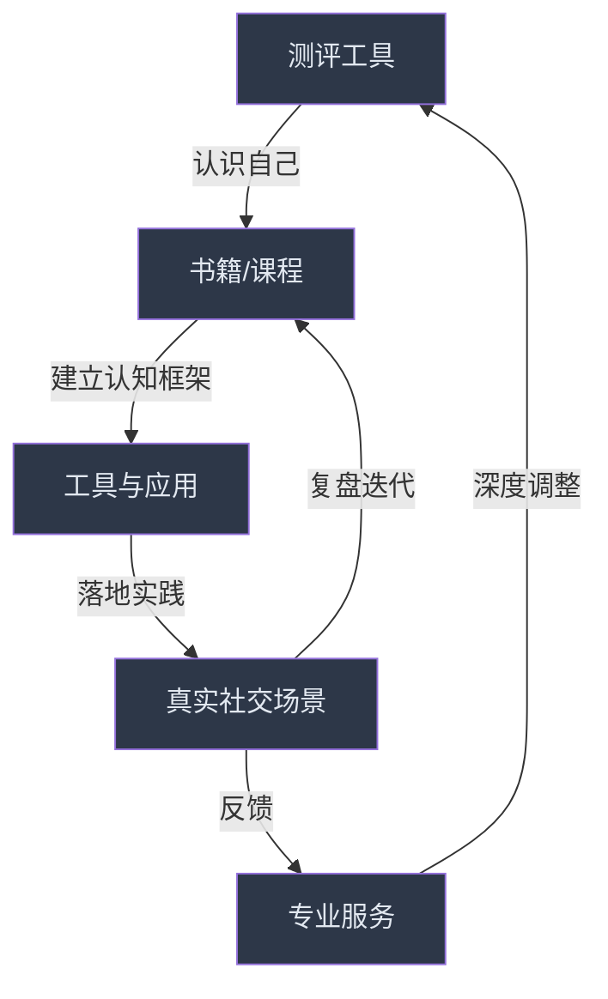

## 本节小结

本节从**书籍、课程与学习资源、工具与应用、测评工具、专业服务**五个维度，构建了一套完整的社交能力提升资源体系。这不是一份"收藏夹"——它是一张**作战地图**。下面将这些资源串联起来，帮你从全局视角理解每类资源的定位、相互关系，以及如何根据自身情况做出最优选择。

### 五类资源的定位与关系

社交能力的提升遵循"**认知→测评→学习→实践→迭代**"的闭环。五类资源在闭环中各有分工：

| 资源类型 | 核心作用 | 投入占比建议 | 典型产出 |
|---------|---------|------------|---------|
| 测评工具 | 明确起点，识别优势与短板 | 5%（一次性+定期复测） | 自我认知地图 |
| 书籍 | 建立系统认知框架 | 30% | 知识体系、思维模型 |
| 课程与学习资源 | 结构化输入+案例学习 | 25% | 方法论、行业视野 |
| 工具与应用 | 关系管理、社交拓展、效率提升 | 20% | 可持续的社交系统 |
| 专业服务 | 个性化深度指导 | 20%（按需） | 突破瓶颈、解决深层问题 |

### 各类资源的核心要点回顾

#### 书籍：四层阅读体系

书籍推荐按"道法术器"四层组织——从底层心理学原理（道），到关系建设方法论（法），再到具体沟通技巧（术），最后到场景化工具书（器）。关键要点：

- **入门必读三本**：《人性的弱点》（心态）、《非暴力沟通》（方法）、《影响力》（原理）——覆盖心态+技巧+理论三大核心维度
- **亲密关系必读**：《爱的五种语言》+《依恋》+《关系的重建》——从识别爱语、理解依恋模式到科学修复关系
- **职场社交必读**：《别独自用餐》+《联盟》+《向上管理》——人脉建设、雇佣关系、上下级沟通
- **社交焦虑必读**：《被讨厌的勇气》+《安静》——课题分离+内向者优势认知
- **阅读原则**：深度学习比广泛涉猎更有效。选1-2本与当前痛点最相关的书，配合一个月的刻意练习，远胜于泛读十本

#### 课程与学习资源：3分学、7分练

课程推荐覆盖在线课程、播客、视频、学习社群四大类型。关键要点：

- **最佳免费起点**：耶鲁《社交心理学》（Coursera）+ 哈佛《积极心理学》（B站）——零成本建立科学框架
- **中文实用课程**：得到《关系攻略》（中国社交语境）+ 樊登读书（书籍精华速览）
- **播客推荐**：《Hidden Brain》（科学原理）+《Where Shall We Begin?》（亲密关系）+ 《蔡康永的201堂情商课》（中文入门）
- **最重要的实践平台**：Toastmasters（头马演讲俱乐部）——性价比最高的社交能力训练方式，没有之一
- **学习原则**：社交是技能不是知识，必须在实践中学习。学习时间的50%以上应用于实操练习

#### 工具与应用：建立可持续的社交系统

工具推荐覆盖关系管理、沟通平台、社交拓展、学习训练、活动社区、AI辅助六大类。关键要点：

- **关系管理核心**：按四层模型（核心圈/重要圈/活跃圈/弱连接）分层管理，微信标签+日历提醒是最低成本的起步方案
- **工具选择原则**：少即是多。联系人<200用微信标签，200-500用Notion CRM，>500或团队用飞书/Airtable
- **社交拓展**：LinkedIn/脉脉（职场）、豆瓣/即刻/小红书（兴趣）、按需选择约会应用
- **AI辅助边界**：AI可以帮你准备话术、复盘分析、优化文案，但不能替代真诚的表达——别人能感受到"自己说话"和"让AI说话"的区别
- **警惕误区**：不要把社交变成KPI管理，工具是降低"忘记维护"风险的，不是把每次互动都数据化的

#### 测评工具：从"我觉得"到"我知道"

测评推荐覆盖人格类型、依恋类型、情商、社交焦虑、沟通风格五大维度。关键要点：

- **最推荐的单一测试**：大五人格（OCEAN）——科学性最高，经过跨文化验证
- **亲密关系必测**：ECR依恋量表——理解你在关系中的自动化反应模式
- **职场社交利器**：DISC行为风格测试——快速判断同事类型并调整沟通方式
- **社交焦虑筛查**：LSAS量表——30分以下正常，60分以上建议寻求专业帮助
- **使用原则**：测评是镜子不是水晶球。测完之后必须写行动清单，而不是把结果存手机就忘。每3-6个月复测一次，观察自己的变化

#### 专业服务：当自助不够时

专业服务推荐覆盖心理咨询、职业教练、形象顾问三类。关键要点：

- **心理咨询**：认知行为疗法（CBT）对社交焦虑有显著效果，推荐平台：简单心理、壹心理
- **职业教练**：适合需要个性化职场社交策略的人，涵盖面试、演讲、谈判等场景训练
- **选择标准**：当社交问题严重影响日常生活（不敢上班、回避所有社交场合）时，自助资源已经不够，需要专业介入

### 个性化选择路径

不同需求有不同的最优资源组合。以下是按核心需求整理的"最小可行方案"——每个方案都控制在2-3个资源，避免贪多嚼不烂：

| 核心需求 | 测评起点 | 书籍（1-2本） | 实践平台 | 预计见效周期 |
|---------|---------|-------------|---------|------------|
| **提升理论素养** | 大五人格 | 《影响力》→《社会心理学》 | 读书会 | 2-3个月 |
| **快速提升社交技能** | DISC | 《人性的弱点》→《非暴力沟通》 | Toastmasters | 1-2个月 |
| **改善亲密关系** | ECR依恋量表 | 《爱的五种语言》→《依恋》 | 伴侣共读+练习 | 1-3个月 |
| **建设职场人脉** | DISC+大五人格 | 《别独自用餐》→《联盟》 | LinkedIn+行业活动 | 2-4个月 |
| **应对社交焦虑** | LSAS+依恋量表 | 《被讨厌的勇气》→《安静》 | Toastmasters免费体验 | 1-3个月（轻度）/ 3-6个月（需配合咨询） |
| **系统学习社交心理学** | 大五人格 | 《亲密关系》→《沟通的艺术》 | Coursera课程 | 3-6个月 |

### 实施建议：从今天开始

**第一步（今天）**：选一个测评工具完成自我评估。如果不知道选哪个，做大五人格——它是所有后续学习的参照基准。

**第二步（本周）**：根据测评结果和当前最大痛点，从上面的表格中选择一条路径，购买/借阅第一本书。

**第三步（本月）**：完成第一本书的阅读，同时加入一个实践平台（Toastmasters免费体验、读书会、或兴趣社群）。

**第四步（持续）**：建立社交复盘习惯——每周花30分钟回顾本周的社交互动，记录做得好的和需要改进的。用Notion或Flomo做碎片化记录即可，不需要复杂的系统。

### 核心提醒

读书和学习只是第一步，真正的提升来自于将所学应用到实际的社交互动中。本节推荐的所有资源——无论是32KB的书籍详解、25KB的课程推荐、23KB的工具指南，还是17KB的测评工具——都指向同一个结论：**社交能力是练出来的，不是学出来的**。

选择1-2个资源开始，深度使用，持续迭代。一个你坚持使用的简单系统，胜过一个你三天就放弃的复杂系统。

