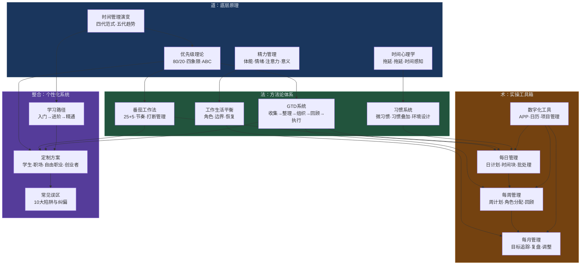
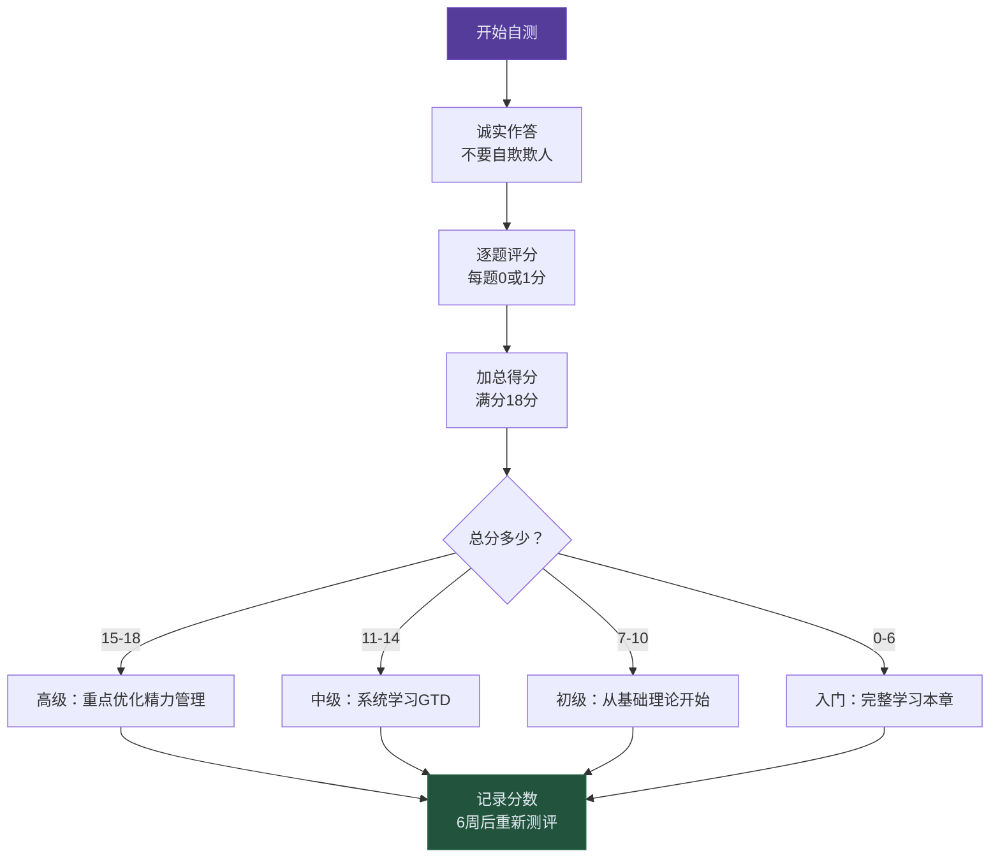
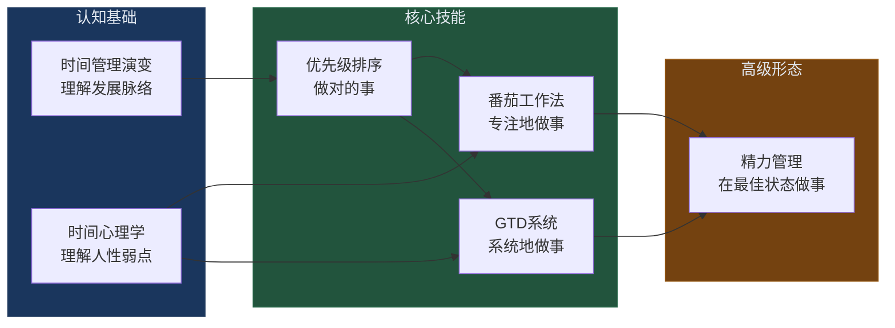
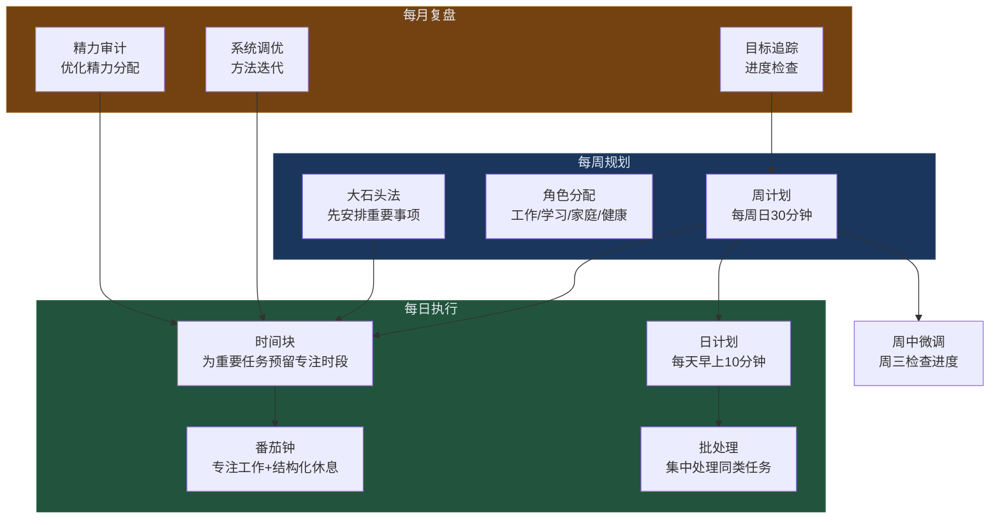
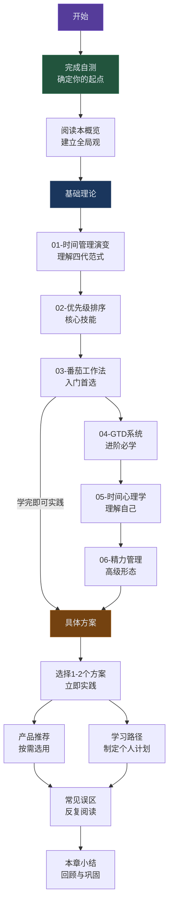
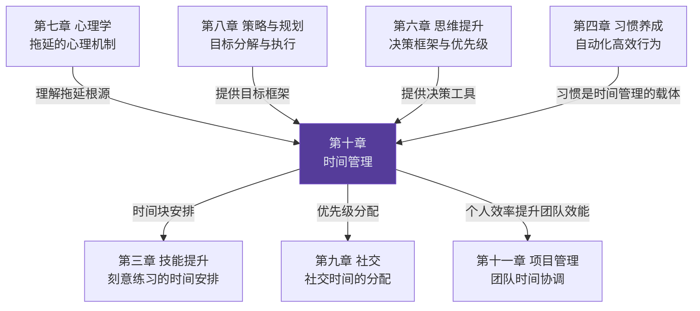

# 第十章 时间管理

> "时间是最高贵而有限的资源，不能管理时间，便什么都不能管理。" ——彼得·德鲁克

## 开篇情境：两个同龄人的五年

张明和李然是大学同班同学，2019年毕业后进入同一家互联网公司做初级开发。五年后的2024年，张明仍然是高级开发工程师，每天加班到晚上9点，周末偶尔还要处理线上故障；李然已经是技术总监，管理15人团队，每天6点下班，周末陪家人、读技术书籍、偶尔在技术大会上做分享。

两人智商相近，起点相同，甚至张明的技术基础还更好一些。差距在哪里？

答案藏在他们每天的24小时里。张明的典型一天：早上到公司先刷30分钟技术新闻，然后被Slack消息打断三次才开始写代码，下午开会2小时后精力低谷期挣扎着review代码，晚上加班补白天没做完的需求。李然的典型一天：早上8-10点精力高峰期做核心架构设计（不开IM、不看邮件），10-11点集中处理消息和邮件，下午开会和协作，5点做日回顾和明天计划，6点离开。

五年下来，李然比张明多出了**超过2000小时的深度工作时间**——相当于整整一年的有效工作量。这不是天赋差距，不是资源差距，而是**时间管理能力的差距**。

本章要教给你的，正是李然所掌握的那套系统。

## 为什么时间管理是个人提升的杠杆支点

在前面的章节中，我们探讨了思维提升、阅读方法、习惯养成、策略规划和社交能力。这些能力的落地执行，最终都依赖一个底层能力——**时间管理**。一个无法管理自己时间的人，即使拥有再好的思维框架和再多的人生策略，也只是一个"知道很多道理，却依然过不好这一生"的空想家。

时间管理之所以是"杠杆支点"，因为它具有**乘数效应**——它不会单独产生价值，但它会放大你在所有其他领域投入的回报。你花在阅读上的1小时，通过时间管理可以产出2小时的效果；你制定的年度目标，通过时间管理才能真正落地执行；你养成的每个习惯，都需要时间管理系统提供结构化的环境才能持续。

### 时间管理的本质：管理注意力与精力，而非时间本身

时间以每秒1秒的恒定速度流逝，任何人都无法改变它的速率。因此，"时间管理"这个说法本身就是一个隐喻——我们真正管理的不是时间，而是**我们的注意力、精力和行为选择**。

这个区分至关重要。如果你把时间管理理解为"把日程排满"，你会陷入"忙碌但低效"的陷阱；如果你把时间管理理解为"在正确的时间，把注意力和精力投入到最有价值的事情上"，你就抓住了本质。

赫伯特·西蒙（Herbert Simon，诺贝尔经济学奖得主）在1971年就洞察到这一点：在一个信息丰富的世界里，信息的丰富意味着注意力的匮乏。50年后的今天，这个问题被智能手机和社交媒体放大了10倍。

用一个公式来表达：

时间管理效能 = 注意力质量 × 精力水平 × 优先级准确度 × 执行时长

四个变量缺一不可，且是**乘法关系**而非加法关系——任何一个变量趋近于零，整体效能就趋近于零：

- **注意力质量**：你在深度工作还是浅层忙碌？研究表明，深度工作状态下的人产出质量是浅层状态的5-10倍（卡尔·纽波特《深度工作》）。
- **精力水平**：你在精力高峰期还是低谷期？同一个人在高峰期和低谷期的认知能力差异可达40-50%。
- **优先级准确度**：你做的事情本身重要吗？花8小时在错误的事情上，不如花2小时在正确的事情上。
- **执行时长**：你投入了多少有效时间？花4小时在精力低谷期挣扎，不如花2小时在精力高峰期高效产出。

理解这个公式，你就理解了本章所有方法论的底层逻辑——它们本质上都是在优化这四个变量中的一个或多个。

### 时间管理的投资回报率

为什么说时间管理是"杠杆支点"？因为它具有极高的投资回报率（ROI）：

| 投入 | 产出 | ROI |
|------|------|-----|
| 每天10分钟做日计划 | 全天效率提升20-30% | 约20:1 |
| 每周30分钟做周回顾 | 减少50%的"紧急救火" | 约10:1 |
| 学习GTD系统（8-10小时） | 终身受益的外部大脑系统 | 长期持续 |
| 建立番茄钟习惯（2周） | 深度工作时间增加2-3倍 | 约15:1 |
| 每月2小时精力审计 | 消除80%的低效时段 | 约8:1 |

这些数字并非夸张。加州大学欧文分校的研究表明，一个被打断后恢复到原来的专注状态平均需要**23分钟**（Gonzalez & Mark, 2004）。如果你一天被打断10次，你可能损失了近4小时的深度工作时间。而一套有效的时间管理系统，可以从源头上减少80%的无效打断。

更具体地说，"10分钟日计划"的20:1 ROI是怎么算出来的？假设你每天工作8小时（480分钟），没有计划的一天你可能只有40%的时间在做真正重要的事（192分钟有效时间）。花10分钟做计划后，通过明确优先级和安排时间块，有效时间比例提升到60%（282分钟）。净增加90分钟有效时间，ROI = 90:10 = 9:1。如果考虑到优先级准确度的提升（做的事情本身更有价值），实际ROI还会更高。

### 时间贫困：一个被低估的现代流行病

哈佛商学院教授阿什利·威兰斯（Ashley Whillans）的研究揭示了一个令人警醒的现象：**时间贫困**（Time Poverty）已经成为现代社会的流行病。她的研究发现：

- **超过80%**的全职工作者报告自己"总是觉得时间不够用"
- 时间贫困与**焦虑、抑郁、生活满意度下降**显著相关
- 讽刺的是，收入越高的人群时间贫困感越强——因为他们用时间换取了更多金钱，却牺牲了自由
- 时间贫困**不是客观时间的缺乏，而是主观时间感知的失调**——通过正确的时间管理方法，可以在不增加总时间的前提下显著缓解

另一项由美国劳工统计局（BLS）进行的时间使用调查（ATUS）显示，美国成年人平均每天花在以下活动上的时间为：

| 活动 | 平均每天时长 | 备注 |
|------|------------|------|
| 睡眠 | 8.8小时 | 含午休 |
| 工作与相关活动 | 3.6小时 | 全年人均，含通勤 |
| 休闲与运动 | 5.3小时 | 含看电视、社交、运动 |
| 家务与照顾家人 | 2.0小时 | 含做饭、清洁、照顾孩子 |
| 饮食 | 1.1小时 | |
| 其他（个人护理、购物等） | 3.2小时 | |

看到这个数据你可能会想："我每天工作至少8小时，怎么可能只有3.6小时？"因为这是**全年人均**——包含周末、节假日和非全职工作者。但对于全职工作者来说，这意味着你每天真正可以自由支配的时间大约只有**4-6小时**。这4-6小时，决定了你与他人的差距。

### 数字时代的时间黑洞

在威兰斯研究的基础上，我们需要正视一个2010年前不存在的变量——**数字干扰**。斯坦福大学2023年的一项研究显示：

- 智能手机用户平均每天查看手机**96次**，平均每10分钟一次
- 社交媒体用户平均每天花费**2.5小时**在短视频和信息流上
- 每次被手机通知打断后，重新进入专注状态需要**15-25分钟**
- 71%的人承认在工作会议中查看过手机

这意味着在数字时代，**注意力本身已经成为最稀缺的资源**。时间管理的本质从"安排时间"进化为"保护注意力"。这也是为什么本章会专门讨论数字干扰管理、手机使用边界等当代议题——它们不是"锦上添花"，而是这个时代时间管理的**必修课**。

## 本章知识地图

时间管理的知识体系由三层结构组成：**道（底层原理）→ 法（方法论）→ 术（具体工具）**。下图展示了本章内容的全景图以及各部分之间的逻辑关系：

### 各层之间的逻辑关系

| 层次 | 核心问题 | 本章对应内容 | 与其他章节的关联 |
|------|---------|------------|----------------|
| 道（原理层） | 为什么需要时间管理？时间管理的底层逻辑是什么？ | 理论演变、优先级排序、时间心理学、精力管理 | 第七章（心理学）的认知偏差、第八章（策略与规划）的目标设定 |
| 法（方法论层） | 用什么系统来管理时间和任务？ | 番茄工作法、GTD、习惯系统、工作生活平衡 | 第四章（习惯养成）、第六章（思维提升）的决策框架 |
| 术（工具层） | 具体怎么操作？每天/每周/每月做什么？ | 每日/每周/每月管理方案、数字化工具 | 第三章（技能提升）的刻意练习、第九章（社交）的时间分配 |
| 整合层 | 如何根据自己的情况定制系统？ | 学习路径、不同人群方案、常见误区 | 贯穿全书的"个性化调整"原则 |

## 自测：你当前的时间管理水平

在开始学习之前，花5分钟完成以下自测。这不是考试，而是一个**基准线**——学完本章后你可以重新评估，看看进步了多少。

### 自测操作流程

### 时间意识自测（每题1分，共6分）

| # | 问题 | 选项A（0分） | 选项B（1分） |
|---|------|------------|------------|
| 1 | 你知道昨天自己在"刷手机"上花了多少时间吗？ | 大概知道/不知道 | 能说出精确数字或接近的数字 |
| 2 | 你能否在不看日历的情况下说出本周最重要的3件事？ | 说不出来/只能说出1-2件 | 能清晰说出3件并知道截止日期 |
| 3 | 你是否有一套固定的每日/每周计划系统？ | 没有/偶尔用 | 有并且持续使用 |
| 4 | 当有人突然找你帮忙时，你是否会先评估优先级再决定？ | 通常直接答应/拒绝 | 会评估后决定 |
| 5 | 你能否说出自己一天中精力最旺盛的时间段？ | 不确定 | 能明确说出并且在此时段安排重要工作 |
| 6 | 你是否有定期回顾（每周/每月）自己时间使用情况的习惯？ | 没有 | 有并且持续执行 |

### 执行力自测（每题1分，共6分）

| # | 问题 | 选项A（0分） | 选项B（1分） |
|---|------|------------|------------|
| 7 | 面对一项重要但不紧急的任务（如学习新技能），你通常会？ | 拖延到截止日期前 | 主动安排时间块执行 |
| 8 | 你的待办清单上有多少项超过两周未完成的任务？ | 超过10项 | 不超过3项 |
| 9 | 你能否在没有外部压力的情况下，连续专注工作25分钟以上？ | 经常做不到 | 可以，并且有方法维持 |
| 10 | 你是否经常加班或把工作带回家？ | 经常 | 很少 |
| 11 | 你是否有一套处理邮件和消息的固定流程？ | 随到随看 | 有固定时间批处理 |
| 12 | 你是否能够对不重要的事情说"不"？ | 经常不好意思拒绝 | 可以根据优先级拒绝 |

### 平衡感自测（每题1分，共6分）

| # | 问题 | 选项A（0分） | 选项B（1分） |
|---|------|------------|------------|
| 13 | 你是否觉得自己在工作和个人生活之间失去了平衡？ | 是的，经常感觉 | 不会，有明确的边界 |
| 14 | 你每周是否有固定的运动/锻炼时间？ | 没有/不固定 | 有并且持续执行 |
| 15 | 你是否有足够的时间陪伴家人/朋友？ | 总是觉得不够 | 有专门安排的时间 |
| 16 | 你上一次完全放松、不看手机地度过一个下午是什么时候？ | 不记得了 | 最近两周内 |
| 17 | 你是否经常因为"太忙"而放弃自己的兴趣爱好？ | 是的 | 不会，有专门的时间 |
| 18 | 你是否觉得自己每天都在"救火"而不是"防火"？ | 是的 | 不会，有预防性的时间安排 |

### 评分解读与行动计划

| 总分（18分） | 时间管理水平 | 核心短板 | 本章学习建议 | 建议起点 |
|-------------|------------|---------|------------|---------|
| 15-18 | 高级 | 可能存在优化空间但整体良好 | 重点学习精力管理和个性化系统优化 | 直接跳到"精力管理"和"月度复盘" |
| 11-14 | 中级 | 系统性不足或执行不一致 | 系统学习GTD和精力管理部分 | 从"优先级排序"开始，建立完整系统 |
| 7-10 | 初级 | 有意识但缺乏方法和习惯 | 从基础理论开始，配合番茄工作法实践 | 从"时间管理演变"开始，配合"番茄工作法"立即实践 |
| 0-6 | 入门 | 缺乏时间管理意识 | 完整学习本章，从最简单的工具开始 | 先完成"时间日志"（1周），再开始系统学习 |

**重要提示**：无论你现在的分数是多少，都不需要焦虑。时间管理是一项**可以通过练习显著提升的技能**，而不是天赋。本章的一个核心理念是"持续迭代优于完美计划"——你不需要一步到位，只需要每周比上周好一点。

## 本章核心内容概览

### 基础理论：时间管理的认知地基

理论不是空谈——它是你做出正确决策的基础。不了解"为什么要这样做"，你在遇到困难时就没有坚持的理由。很多人时间管理失败，不是因为方法不好，而是因为不理解方法背后的原理，遇到阻力时就放弃了。

#### 理论全景

| 理论领域 | 核心问题 | 关键概念 | 实用价值 |
|---------|---------|---------|---------|
| 时间管理演变 | 时间管理思想是如何发展的？当前处于哪个阶段？ | 四代时间管理范式（备忘录→日程表→优先级→原则中心）、第五代智能趋势 | 避免停留在低级阶段，理解更高层次的管理哲学 |
| 优先级排序 | 如何区分"重要"和"紧急"？如何找到那关键的20%？ | 80/20法则、艾森豪威尔矩阵、ABC法、吃掉那只青蛙、MOVI模型 | 所有时间管理的基础——如果优先级错了，效率越高错得越远 |
| 番茄工作法 | 为什么25分钟有效？如何战胜拖延、提升专注？ | 蔡格尼克效应、耶克斯-多德森定律、打断管理、番茄数预估 | 最易上手的专注力工具，适合所有人的入门方法 |
| GTD系统 | 如何清空大脑、建立可信赖的外部系统？ | 五步流程（收集→整理→组织→回顾→执行）、两分钟规则、下一步行动 | 中级到高级的时间管理系统，适合任务复杂的人群 |
| 时间心理学 | 为什么我知道该做却做不到？拖延的根源是什么？ | 拖延的心理机制、时间折扣、规划谬误、蔡格尼克效应、帕金森定律 | 理解"知行差距"的根源，从心理层面解决执行力问题 |
| 精力管理 | 如何在有限的精力下最大化产出？ | 精力四维度（体能·情绪·注意力·意义）、超日节律、精力曲线 | 时间管理的高级形态——管理精力比管理时间更有效 |

#### 核心理论之间的逻辑关系

#### 各理论专题内容预览

**时间管理演变**（第一节）将带你走过时间管理思想的四个代际：
- **第一代：备忘录时代**——用便签和清单记录待办，核心是"不遗忘"。优点是简单易行，缺点是没有优先级概念，容易沦为"清单奴隶"。
- **第二代：日程表时代**——用日历和日程表规划时间，核心是"有计划"。效率工具（如Outlook日历）的普及推动了这一代。缺点是过于强调"填满时间"，容易导致过度安排。
- **第三代：优先级时代**——引入价值判断，核心是"做重要的事"。史蒂芬·柯维的《高效能人士的七个习惯》是这一代的代表。缺点是仍然以任务为中心，容易忽视人的精力和状态。
- **第四代：原则中心时代**——以原则和角色为中心，核心是"活出平衡"。强调人生角色（工作者、家庭成员、个人成长者）的平衡，不只追求效率。
- **第五代趋势（正在形成）**——AI辅助、注意力保护、精力优先。核心是"人机协作"——让AI处理低价值任务（筛选邮件、安排日程、整理信息），人专注于高价值的创造性工作。

**优先级排序**（第二节）是整个时间管理大厦的地基。你将学到：
- **80/20法则的正确理解和误用**：不是"只做20%的事"，而是"识别产出最高的20%活动并优先保障它们的时间"。很多人误用80/20法则，把"不重要的80%"直接砍掉——但实际上很多低价值任务是高价值任务的前置条件，不能简单删除。
- **艾森豪威尔矩阵的实操陷阱**：四象限看起来简单，但实际使用中最大的坑是"把所有事都标记为'重要且紧急'"。本节会教你用三个过滤器来校准判断。
- **ABC法与"吃掉那只青蛙"的组合使用**：每天早上第一件事完成最难最重要的任务（青蛙），然后用ABC法安排其余任务的优先级。

**番茄工作法**（第三节）是最适合入门的专注力训练工具。你将理解：
- 为什么恰好是25分钟？背后的认知科学原理（蔡格尼克效应告诉我们，未完成的任务会在大脑中持续占据工作记忆；25分钟恰好是大多数人能维持单焦点注意力的最小有效单位）。
- 打断管理的三级策略：内部打断（自己的杂念）用"计划外紧急"清单处理；外部打断（他人的请求）用"告知-协商-回电-确认"四步法；环境打断（噪音、通知）用物理隔离处理。
- 从4个番茄钟/天到10个番茄钟/天的进阶路径。

**GTD系统**（第四节）是中级时间管理者的"升级包"：
- **收集阶段**：把大脑中所有"悬而未决"的事情全部倾倒到一个可信的外部系统（收件箱）。平均每个人大脑中同时悬挂着**150-200个未完成任务**（蔡格尼克效应），每一个都在消耗认知资源。
- **整理阶段**：对收件箱中的每一条进行"两分钟判断"——能在2分钟内做完的立即做，不能的进入下一步。
- **组织阶段**：把任务分类到"下一步行动"、"项目"、"等待"、"日程"、"参考资料"、"将来/也许"六个篮子里。
- **回顾阶段**：每周回顾所有清单，确保系统可信。
- **执行阶段**：根据情境、时间、精力、优先级四个因素选择当前该做什么。

**时间心理学**（第五节）解答"为什么我知道该做却做不到"这个根本问题：
- **拖延的本质**不是懒惰，而是情绪调节失败——我们通过回避来逃避任务引发的负面情绪（焦虑、无聊、恐惧）。
- **时间折扣**（temporal discounting）：人类大脑天然倾向于高估眼前奖励、低估未来奖励。这就是为什么刷短视频比写报告更有"吸引力"——前者的奖励是即时的，后者是延迟的。
- **规划谬误**：我们系统性地低估任务所需时间（平均低估30-50%）。对策是使用"参考类别预测法"——不从"这个任务理论上需要多久"出发，而从"类似任务过去实际花了多久"出发。
- **帕金森定律**：工作会自动膨胀，占满所有可用时间。对策是人为设置更紧的截止日期，用时间压力激发效率。

**精力管理**（第六节）是时间管理的最高级形态：
- 精力四维度模型（吉姆·洛尔《精力管理》）：体能精力（睡眠、运动、饮食）、情绪精力（积极情绪的储备）、注意力精力（专注能力）、意义精力（使命感和热情）。
- **超日节律**（ultradian rhythm）：人体以90-120分钟为一个精力周期，每个周期后需要20-30分钟的恢复。在精力周期的高峰期安排高强度认知任务，低谷期安排休息或低强度任务。
- **精力曲线绘制**：连续2周每小时记录精力水平（1-10分），找到你的个人精力模式。

### 具体方案：拿来即用的实战工具箱

理论学完后，你需要的是**可执行的方案**。本节提供从"日"到"月"的完整时间管理系统：

#### 方案全景

| 方案 | 时间尺度 | 核心方法 | 适用场景 |
|------|---------|---------|---------|
| 每日时间管理 | 1天 | 日计划制定、时间块安排、批处理法、精力匹配 | 所有人，每天的基础操作 |
| 每周计划方法 | 1周 | 周角色分配、周目标设定、大石头优先法 | 需要平衡多角色的人（工作+家庭+学习） |
| 每月复盘方法 | 1月 | 月度回顾、目标追踪、系统调优 | 持续改进者，需要定期审视方向 |
| 项目时间管理 | 多周/月 | 项目拆解、里程碑设定、甘特图、缓冲时间 | 有长期项目的人（学生、职场人、创业者） |
| 时间审计 | 诊断工具 | 记录1-2周的时间使用、分析模式、找出黑洞 | 所有人在开始时间管理前的必做步骤 |
| 不同人群方案 | 定制化 | 学生/职场人/自由职业/创业者/全职妈妈的差异化方案 | 找到最适合自己角色的方法 |
| 数字化工具 | 辅助层 | 日历、待办、项目管理、时间追踪的工具选型 | 用工具放大方法论的效果 |
| 工作与生活平衡 | 系统层 | 边界设定、角色切换、恢复策略 | 感到失衡、疲惫的人 |

#### 方法论之间的组合关系

#### 各方案专题内容预览

**时间审计**（第七节）是所有时间管理的起点——在你开始优化之前，你需要知道自己现在的钱花在哪里。本节将教你：
- 如何用时间日志记录法进行1-2周的精确时间追踪（精确到15分钟）
- 如何分析时间日志，识别"时间黑洞"（无意识消耗超过30分钟的活动）和"时间错配"（在精力低谷期安排了高强度任务）
- 一个真实案例：某互联网产品经理的时间审计结果——发现自己每天花2.5小时在"碎片化信息消费"上（刷技术新闻、看微信群、浏览朋友圈），其中80%是无意识行为

**每日时间管理**（第八节）是你每天起床后的"操作手册"：
- **日计划三步法**：①回顾日历和待办清单（5分钟）→②确定今天最重要的3件事（3分钟）→③把它们安排到精力最佳的时间段（2分钟）
- **时间块安排**：把一天分成若干个时间块，每个块有明确的主题和任务。不是把每分钟都填满，而是为"最重要的事"预留受保护的专注时段
- **批处理法**：把同类任务集中处理——邮件每天看3次（如9:00、13:00、17:00），消息每天集中回复2次，行政事务集中在一个下午处理

**每周计划方法**（第九节）提供周级别的战略视角：
- **周日晚上的30分钟仪式**：回顾上周完成情况 → 确定下周3个核心目标 → 按角色分配时间（工作者、学习者、家庭成员、个人健康）→ 把"大石头"安排到日程中
- **大石头优先法**（史蒂芬·柯维）：想象一个玻璃罐，如果你先放沙子（琐事）再放大石头（重要事项），大石头放不下；但如果你先放大石头再倒沙子，沙子会自动填满缝隙。时间也是如此——先把重要事项安排进日程，琐事会自动找到时间
- **周三微调**：周中检查一次进度，及时调整下半周的安排

**每月复盘方法**（第十节）是持续改进的核心机制：
- **月度回顾四问**：①这个月最骄傲的3个成就？②最浪费时间的3个行为？③下个月最重要的3个目标？④时间管理系统需要哪些调整？
- **目标追踪仪表盘**：用简单的表格追踪年度目标的月度进展
- **系统调优**：根据一个月的实践反馈，调整你使用的方法和工具——哪些方法有效？哪些需要修改？哪些应该放弃？

**项目时间管理**（第十一节）适用于跨越多周的长期任务：
- **项目拆解法**：把大项目拆成可管理的子任务（WBS工作分解结构），每个子任务不超过8小时
- **里程碑设定**：为项目设定3-5个关键里程碑，每个里程碑有明确的交付物和截止日期
- **缓冲时间原则**：为每个任务增加25-50%的缓冲时间（基于规划谬误的修正），为整个项目增加15-20%的整体缓冲

**不同人群方案**（第十二节）提供针对性建议：
- **学生**：围绕课程表和考试周期构建系统，重点是"学习时间块"和"考试冲刺计划"
- **职场人**：围绕工作节奏构建系统，重点是"会议管理"和"上下班过渡仪式"
- **自由职业者**：围绕自律挑战构建系统，重点是"固定工作时间"和"环境切换"
- **创业者**：围绕不确定性构建系统，重点是"角色切换"和"精力保护"
- **全职妈妈/爸爸**：围绕碎片时间构建系统，重点是"微任务"和"自我时间的保护"

**数字化工具**（第十三节）帮你选对工具：
- **日历类**：Google Calendar、Outlook、Apple Calendar——用于管理固定时间承诺
- **待办类**：Todoist、Microsoft To Do、Things 3——用于管理任务和项目
- **番茄钟类**：Forest、Pomodoro Timer、Toggl Track——用于专注力训练和时间追踪
- **笔记/知识管理类**：Notion、Obsidian、Logseq——用于GTD系统的"外部大脑"
- **核心原则**：工具数量不超过3个，选好后至少用30天再考虑更换

### 工作与生活平衡：不被讨论的"时间管理终极目标"

很多时间管理书籍止步于"如何更高效地工作"。但高效的目的是什么？是为了有更多时间过好生活。如果你的时间管理系统只优化了工作效率，却让你失去了健康、家庭和个人生活，那这个系统就是失败的。

本节探讨：
- **角色意识**：你不仅仅是"工作者"。你同时是家庭成员、朋友、社区参与者、个人成长者、健康管理者。时间管理的终极目标不是"做更多工作"，而是"让每个角色都得到应有的时间投入"。
- **边界设定**：工作和生活之间的边界不是天然存在的，你需要主动建立。具体策略包括：固定下班时间并严格执行、工作设备和生活设备分离、建立"下班仪式"（如换衣服、散步15分钟）来帮助大脑切换模式。
- **恢复策略**：高质量的休息不是"什么都不做"，而是**主动恢复**——运动、社交、创造性爱好、亲近自然。这些活动能真正补充精力，而不是刷手机那种"伪休息"（实际上在消耗注意力）。
- **"够好"哲学**：追求每个角色都100分是不现实的，会导致每个角色都做不好。接受"在不同的人生阶段，不同角色的优先级会变化"——刚入职场时工作70%生活30%是合理的，有孩子后可能需要调整为50%:50%。

### 产品推荐：精选书籍、APP与工具

工具是方法论的载体。好的工具能降低执行门槛，坏的工具则增加认知负担。本节不是"工具大全"，而是经过筛选的**精选推荐**：

| 类别 | 推荐数量 | 筛选标准 |
|------|---------|---------|
| 经典书籍 | 10本 | 每本附核心观点、适用人群、阅读优先级 |
| 手机APP | 12款 | 涵盖待办、番茄钟、习惯追踪、日程管理四大类 |
| 桌面与在线工具 | 8款 | 区分个人使用和团队使用 |
| 方法论对比 | 1张总表 | 横向对比所有推荐工具的功能、价格、平台 |

### 学习路径：从零基础到精通的系统规划

时间管理能力的提升不是一蹴而就的。它需要**认知改变→方法学习→习惯养成→系统优化**四个阶段。下图展示了完整的学习路径：

```mermaid
graph LR
    subgraph 入门["第1-4周：建立意识"]
        A1["完成自测<br/>确定起点"]
        A2["记录时间日志<br/>1周时间审计"]
        A3["学习番茄工作法<br/>立即实践"]
        A4["制定第一个日计划"]
    end

    subgraph 进阶["第5-12周：建立系统"]
        B1["学习四象限法则<br/>建立优先级思维"]
        B2["学习GTD系统<br/>搭建外部大脑"]
        B3["建立每周计划习惯<br/>周日规划+周三复盘"]
        B4["学习精力管理<br/>优化个人精力曲线"]
    end

    subgraph 精通["第13周+：持续优化"]
        C1["整合多种方法<br/>形成个人系统"]
        C2["定期回顾优化<br/>月度复盘"]
        C3["教授他人<br/>费曼学习法巩固"]
        C4["探索AI辅助工具<br/>提升自动化水平"]
    end

    A1 --> A2 --> A3 --> A4
    A4 --> B1 --> B2 --> B3 --> B4
    B4 --> C1 --> C2 --> C3 --> C4

    style 入门 fill:#22543d,stroke:#276749,color:#e2e8f0
    style 进阶 fill:#1a365d,stroke:#2a4365,color:#e2e8f0
    style 精通 fill:#553c9a,stroke:#6b46c1,color:#e2e8f0
```

### 常见误区：避开时间管理的陷阱

学习正确的方法很重要，但**识别和避免错误**同样重要。本章揭示的十大误区，几乎每个人都会在某个阶段踩中。下面逐一展开分析：

| # | 误区 | 表面逻辑 | 实际危害 | 纠偏方向 |
|---|------|---------|---------|---------|
| 1 | 把"忙碌"等同于"高效" | "我从早忙到晚，说明我很努力" | 忙于低价值事务，高价值事务被挤压 | 关注产出而非投入 |
| 2 | 追求完美的日程安排 | "我要把每一分钟都安排好" | 一旦计划被打乱就焦虑，反而降低效率 | 留出弹性时间（至少30%） |
| 3 | 忽视休息和恢复的价值 | "休息是浪费时间" | 持续疲劳导致效率断崖式下降 | 把休息当作生产力的一部分 |
| 4 | 过度依赖工具而忽视原则 | "换了新APP就能管好时间" | 频繁更换工具，花更多时间在工具上而非做事上 | 先掌握原则，再选工具 |
| 5 | 用"紧急性"代替"重要性" | "先做最紧急的事" | 永远在救火，没有时间做预防 | 优先投入"重要但不紧急"的事 |
| 6 | 认为时间管理是"一劳永逸"的 | "学完这套方法就行了" | 环境变化后系统失效，被迫回到原点 | 持续迭代优化 |
| 7 | 忽略精力波动 | "我要像机器一样持续高效" | 在低精力期强行工作，质量极差 | 根据精力曲线安排任务 |
| 8 | 多任务处理 | "同时做几件事效率更高" | 频繁切换消耗认知资源，每件事都做不好 | 单任务专注+批量处理 |
| 9 | 不会说"不" | "拒绝别人会显得不友好" | 日程被别人的优先级占满 | 建立说"不"的策略和话术 |
| 10 | 一个人死磕 | "时间管理是个人的事" | 忽视团队协作和委托的机会 | 学会委托和协作 |

**误区深度解析——以误区#1和#5为例：**

**误区#1"忙碌=高效"**是最普遍的时间管理陷阱。它的危害在于：忙碌会给你一种"我在做事"的虚假满足感，但实际上你可能只是在用战术上的勤奋掩盖战略上的懒惰。一个典型场景：你花了一整天回复了50封邮件、参加了3个会议、处理了10个小需求——你觉得今天很充实。但你最重要的项目——那份影响季度OKR的方案——还是没有进展。纠偏方法：每天晚上问自己"今天最重要的一件事做了吗？"如果连续3天答案是"没有"，说明你陷入了"忙碌陷阱"。

**误区#5"用紧急性代替重要性"**是艾森豪威尔矩阵的核心洞察。大多数人天然倾向于先做紧急的事，因为紧急的事有明确的截止日期和外部压力。但如果你总是被紧急的事牵着走，你就永远没有时间做"重要但不紧急"的事——而这些事（学习新技能、维护关系、健康管理、战略思考）才是决定你长期发展轨迹的关键。纠偏方法：每天至少为"第二象限"（重要但不紧急）保留1小时的时间块，并把它当作不可取消的"与自己的约会"。

## 本章的学习目标

完成本章学习后，你将能够：

1. **理解时间管理的完整知识体系**：从四代演变到第五代智能趋势，建立全局视野
2. **掌握优先级排序的核心技能**：熟练运用艾森豪威尔矩阵、80/20法则和ABC法，确保把精力投入在正确的事情上
3. **建立至少一套可运行的时间管理系统**：无论是番茄工作法、GTD还是自定义系统，你将拥有一个可持续运作的个人管理系统
4. **理解并管理自己的精力曲线**：知道自己的高效时段和低效时段，据此安排不同类型的任务
5. **战胜拖延症**：理解拖延的心理机制，掌握至少3种对抗拖延的具体策略
6. **建立日/周/月三级计划与回顾体系**：形成"计划→执行→回顾→优化"的持续改进循环
7. **学会对不重要的事情说"不"**：建立清晰的优先级边界，保护自己的时间和精力
8. **避免10个常见的时间管理陷阱**：识别误区并知道如何纠偏
9. **根据自己的角色和场景定制系统**：学生、职场人、自由职业者、创业者、全职妈妈都能找到适合自己的方案
10. **建立从入门到精通的学习路径**：有清晰的阶段目标和里程碑

## 如何使用本章

### 推荐阅读顺序

### 四种阅读策略

| 策略 | 说明 | 适用人群 | 预计时间 |
|------|------|---------|---------|
| 系统通读 | 按章节顺序完整学习，建立完整的知识体系 | 时间管理初学者、希望系统提升的人 | 8-12小时 |
| 问题驱动 | 从自己最痛的问题出发，直接跳到对应章节 | 有具体时间管理痛点的人 | 2-4小时/主题 |
| 快速入门 | 只读番茄工作法+每日管理方案，立即实践 | 急需提升效率、时间紧张的人 | 2-3小时 |
| 高级精进 | 重点学习GTD+精力管理+月度复盘 | 已有基础、希望进阶的人 | 4-6小时 |

**选择建议**：如果你不确定选哪个策略，从"快速入门"开始。先体验到效果（哪怕只是番茄工作法带来的掌控感），再决定是否深入系统学习。这是行为科学中的"小赢"（small wins）策略——先获得正反馈，再投入更多时间。

### 阅读与实践的配合建议

理论学习只是起点，时间管理能力的真正提升来自于**持续的实践和反馈**。建议配合以下练习：

1. **时间日志**（第1周）：连续7天记录自己的时间使用情况，精确到30分钟。不要试图改变行为，只是观察和记录。这是你的时间管理"体检报告"。具体方法：每小时花1分钟记录过去一小时做了什么。可以用手机备忘录、纸质笔记本或时间追踪APP（如Toggl Track）。关键是要**如实记录**——刷了30分钟手机就写30分钟，不要美化。

2. **番茄钟实践**（第2-3周）：每天至少完成4个番茄钟。记录预估番茄数和实际番茄数的差异，训练自己的时间感知能力。第一个番茄钟可能很难——你的大脑会不断想找借口中断。这是正常的。坚持下去，到第3天你就会明显感觉到不同。

3. **周计划实验**（第4-5周）：每周日晚上花30分钟制定下周计划。使用"大石头优先法"——先把重要事项安排到日程中，再用碎石和沙子填充。第一次做周计划时，你可能会发现自己高估了一周能做的事。这也是正常的——调整预期是周计划的一部分。

4. **月度复盘**（第6周起）：每月最后一个周末，花1-2小时回顾本月的时间使用情况。问自己三个问题：哪些做得好？哪些可以改进？下个月要调整什么？月度复盘是时间管理从"方法"进化为"系统"的关键节点——没有复盘的方法只是技巧，有复盘的方法才是系统。

5. **精力审计**（第8周起）：连续2周，每小时记录一次自己的精力水平（1-10分）。找出你的精力高峰和低谷，据此重新安排任务。你可能会发现一些违反直觉的模式——比如很多人的精力高峰不在上午，而在下午2-4点；或者很多人在午餐后有30-60分钟的精力低谷，但传统时间管理建议午餐后立即开始工作。

## 本章与其他章节的关系

**章节联动详解**：
- **第四章（习惯养成）**：时间管理的很多方法最终需要变成习惯才能持续运作。比如"每天早上10分钟做日计划"如果不能变成自动化习惯，你很快就会放弃。反过来，第四章的"习惯叠加"技术可以用来建立时间管理习惯——"在我倒完早晨的咖啡之后（已有习惯），我会花10分钟做今天的日计划（新习惯）"。
- **第六章（思维提升）**：优先级排序本质上是一个决策问题。第六章的决策框架（如决策矩阵、第一性原理）可以直接应用于时间分配决策。
- **第七章（心理学）**：拖延是时间管理的最大敌人。第七章关于认知偏差、情绪调节的内容是理解拖延机制的理论基础。
- **第八章（策略与规划）**：年度目标、季度计划是时间管理的"上游输入"——没有清晰的目标，日计划和周计划就缺乏方向。
- **第九章（社交）**：社交活动是时间分配中的一大块。如何在维护关系和保护个人时间之间找到平衡，需要结合两章的内容来思考。

## 核心原则速览

在深入各小节之前，请牢记以下五条核心原则。它们贯穿本章所有内容，是时间管理的"北极星"：

| # | 原则 | 含义 | 一句话检验标准 |
|---|------|------|-------------|
| 1 | **效能优先于效率** | 做对的事比把事做对更重要 | "如果我只能完成一件事，我选哪个？" |
| 2 | **精力优先于时间** | 管理精力比管理时间更有效 | "我现在是精力高峰期还是低谷期？" |
| 3 | **系统优先于意志力** | 好的系统让正确的行为自动化 | "这个习惯需要多少意志力来维持？" |
| 4 | **预防优先于救火** | 投资"重要但不紧急"的事 | "我今天的日程里，第二象限占多少？" |
| 5 | **持续迭代优于完美计划** | 行动-反馈-调整，循环前进 | "我的时间管理系统上次优化是什么时候？" |

**这五条原则之间的关系**：效能（原则1）是目标，精力（原则2）是杠杆，系统（原则3）是载体，预防（原则4）是策略，迭代（原则5）是方法。五者形成一个闭环——你通过迭代建立系统，系统帮助你把精力投入在高效能的事上，高效能的产出让你有更多时间做预防性工作，预防性工作减少了紧急救火，减少了救火就保护了精力……循环上升。

---

> "时间管理的本质，不是做更多的事，而是做对的事。" ——彼得·德鲁克

时间管理是一项**可以通过学习和练习显著提升的技能**。它不是天赋，不是性格，而是一套可以掌握的方法论。无论你现在的时间管理水平如何，本章都将为你提供一个从入门到精通的完整路径。

让我们开始这段旅程。
