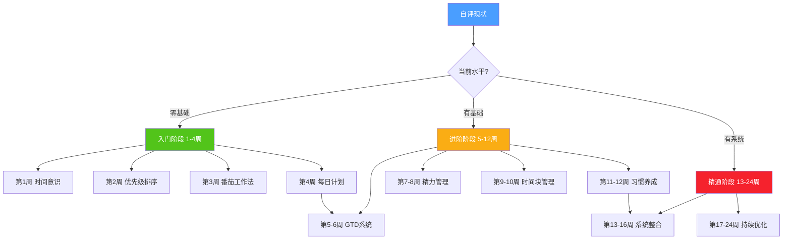
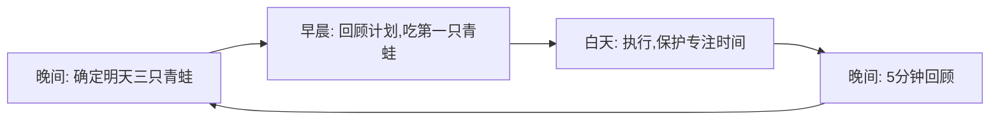
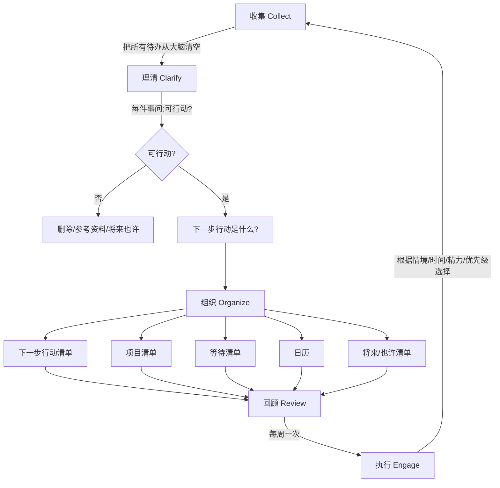
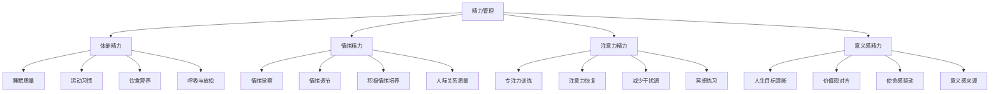
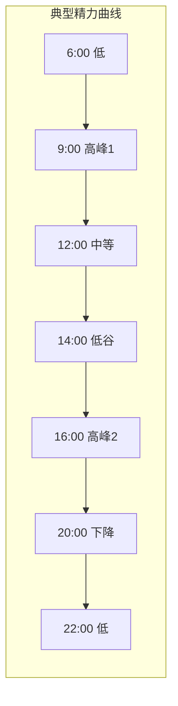
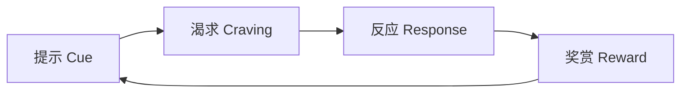
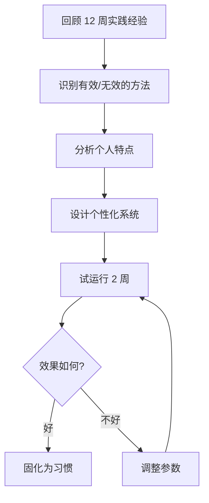

# 第十章 时间管理——04-学习路径

## 一、为什么需要学习路径

时间管理不是读一本书、装一个 APP 就能学会的技能。它是一个包含**认知重塑、方法习得、习惯养成、系统构建**四个层次的完整能力建设过程。没有路径的学习者最常见的结局是：读了很多书，笔记记了半本，三天后回到原样。

学习路径解决三个核心问题：

1. **学什么**——知识海洋里哪些是核心节点，哪些是锦上添花
2. **怎么学**——认知科学支持的高效习得策略
3. **学到什么程度**——每个阶段的清晰验收标准

### 1.1 学习路径的设计原理

本路径基于以下认知科学和成人学习理论设计：

| 理论 | 核心观点 | 在本路径中的应用 |
|---|---|---|
| 布鲁姆认知分类学 | 记忆→理解→应用→分析→评价→创造，层层递进 | 每个阶段对应不同认知层级 |
| 刻意练习理论 | 舒适区边缘练习 + 即时反馈 + 重复迭代 | 每周都有明确的练习任务和反馈机制 |
| 间隔重复效应 | 分散学习优于集中学习 | 16-24周的渐进式安排，而非一周速成 |
| 习惯回路理论 | 提示→惯常行为→奖赏 | 每个新方法都配套习惯养成策略 |
| 最近发展区理论 | 学习内容略高于当前能力水平 | 三阶段递进，每阶段恰好在能力边界上 |
| 成人学习理论 | 成人需要知道"为什么学"，偏好问题导向 | 每个方法都先讲适用场景再讲操作步骤 |

### 1.2 学习路径全景图



**路径设计原则：**

- **渐进式**：从简单到复杂，从理论到实践，从单点到系统
- **行动导向**：每个阶段都有可执行、可衡量的实践任务
- **个性化**：提供不同人群的定制路径，适应不同角色需求
- **可回退**：允许失败和调整，不因一天中断而全盘崩溃
- **可持续**：控制每周学习量在 3-5 小时，避免信息过载

**总时长：** 16-24 周（4-6 个月），视个人基础和投入时间而定

---

## 二、自评工具：找到你的起点

在开始学习之前，先用下面的自评表定位自己的当前水平。诚实评估，不要高估也不要低估。

### 2.1 时间管理能力自评量表

对以下 20 个陈述，按 1-5 分打分（1=完全不符合，5=完全符合）：

**维度一：时间意识（5 题）**

| 编号 | 陈述 | 评分 |
|---|---|---|
| Q1 | 我清楚自己每天在各类活动上花费多少时间 | __ |
| Q2 | 我能准确估算一项任务需要多长时间 | __ |
| Q3 | 我知道自己一天中精力最好的时段 | __ |
| Q4 | 我能识别哪些活动是"时间黑洞" | __ |
| Q5 | 我知道自己的时间主要被谁/什么占据 | __ |

**维度二：优先级判断（5 题）**

| 编号 | 陈述 | 评分 |
|---|---|---|
| Q6 | 我能快速判断一件事是重要还是紧急 | __ |
| Q7 | 我每天能说出"今天最重要的三件事" | __ |
| Q8 | 我能够对不重要的事情说"不" | __ |
| Q9 | 我不会被紧急但不重要的事牵着走 | __ |
| Q10 | 我每周会花时间在"重要但不紧急"的事上 | __ |

**维度三：执行能力（5 题）**

| 编号 | 陈述 | 评分 |
|---|---|---|
| Q11 | 我能持续专注 25 分钟以上不被打断 | __ |
| Q12 | 我有一个可靠的待办事项管理系统 | __ |
| Q13 | 我能在截止日期前完成大部分任务 | __ |
| Q14 | 我善于批量处理同类任务（如集中回复邮件） | __ |
| Q15 | 我有固定的日计划和回顾习惯 | __ |

**维度四：系统与习惯（5 题）**

| 编号 | 陈述 | 评分 |
|---|---|---|
| Q16 | 我有一套完整的个人任务管理系统（如 GTD） | __ |
| Q17 | 我的时间管理习惯已经持续 3 个月以上 | __ |
| Q18 | 我会定期回顾并优化自己的时间管理系统 | __ |
| Q19 | 我能根据精力状态灵活调整工作安排 | __ |
| Q20 | 时间管理对我来说是自然而然的事 | __ |

**评分与起点建议：**

| 总分区间 | 水平 | 建议起点 |
|---|---|---|
| 20-40 分 | 零基础 | 从第 1 周开始，完整走完 24 周 |
| 41-60 分 | 初级 | 从第 3 周开始，前两周内容作为复习 |
| 61-80 分 | 中级 | 从第 5 周开始，跳过入门阶段 |
| 81-100 分 | 高级 | 从第 13 周开始，直接进入系统整合 |

> **注意**：即使总分较高，如果某个维度得分低于该维度满分的 50%，建议从该维度对应的学习内容开始补课。

---

## 三、入门阶段（第 1-4 周）：建立时间管理的底层操作系统

> **阶段目标**：从"不知道时间去哪了"到"每天有计划、有重点、有回顾"
>
> **每周投入**：3-4 小时（学习 1h + 实践 2-3h）
>
> **阶段验收标准**：连续 7 天完成时间记录 + 每日三件事 + 至少 4 个番茄钟

### 3.1 第 1 周：建立时间意识——看见时间的真相

**核心理念**：你无法管理你看不见的东西。时间管理的第一步不是学技巧，而是**看见自己的时间到底去了哪里**。

**为什么时间意识是第一课**

大多数人对自己时间使用的感知是严重失真的。一项发表在《Personality and Social Psychology Bulletin》上的研究显示，人们平均高估自己的工作时间约 10 小时/周。你以为自己"一直在工作"，实际上可能有 30% 的时间在切换任务、刷手机、闲聊。

时间日志的作用不是让你变得"斤斤计较"，而是像给财务做审计一样，先搞清楚钱花在哪里，才能谈省钱和投资。

**学习内容：**

1. **时间管理演进史**（建立全局认知）
   - 第一代：便条与备忘录——"别忘了"
   - 第二代：日历与日程表——"有计划"
   - 第三代：优先级与价值观——"做对的事"
   - 第四代：关系与角色——"平衡的生活"
   - 理解这个演进不是"越新越好"，而是每一代都在前一代基础上扩展

2. **80/20 法则（帕累托原理）**
   - 20% 的活动产生 80% 的成果
   - 在时间管理中的应用：找到你的"高价值 20%"
   - 常见误区：80/20 不是精确比例，而是提醒你关注投入产出比

3. **时间日志记录法**
   - 最小粒度：每 30 分钟记录一次
   - 记录内容：做什么、和谁、在哪里、精力状态（1-5 分）
   - 工具选择：纸质笔记本、手机备忘录、或 Toggl Track

**实践任务：**

第 1 周每日任务清单：
├── 早上  [ ] 确认今天的时间日志记录方式
├── 全天  [ ] 每 30 分钟记录一次活动（至少记录 5 天）
├── 晚上  [ ] 花 10 分钟回顾当天时间日志
└── 周末  [ ] 汇总分析：时间花在哪里？哪些是"时间黑洞"？

**预期成果：**

- 获得一份完整的 5-7 天时间日志数据
- 识别出至少 3 个"时间黑洞"（如无目的刷手机、冗长的会议、社交媒体）
- 建立"时间是有限且不可再生资源"的深刻认知

**常见陷阱与应对：**

| 陷阱 | 表现 | 应对策略 |
|---|---|---|
| 记录太繁琐 | 觉得每 30 分钟记录太累 | 降低到每小时记录一次也行，关键是连续 |
| 忘记记录 | 经常忘记填写时间日志 | 设手机闹钟，每小时提醒一次 |
| 记录失真 | 美化自己的时间使用记录 | 只为自己记录，诚实面对 |
| 周末放弃 | 工作日记录，周末放飞 | 周末才是真实生活时间的体现，必须记录 |

**推荐资源：**

- 书籍：彼得·德鲁克《卓有成效的管理者》第二章"掌握自己的时间"——德鲁克是管理学之父，他用三个高管的真实案例说明时间记录如何揭示惊人的浪费
- 工具：Toggl Track（免费，支持自动追踪）、RescueTime（自动追踪电脑和手机使用时间）

### 3.2 第 2 周：学习优先级排序——做对的事比把事做对更重要

**核心理念**：效率（把事做对）和效能（做对的事）是两回事。一个高效地做着错误事情的人，比一个低效地做着正确事情的人更浪费时间。

**四象限法则深度讲解**

艾森豪威尔矩阵不仅是把事情分到四个格子那么简单。真正的难点在于：

              紧急                不紧急
         ┌──────────────┬──────────────┐
  重要   │   第一象限    │   第二象限    │
         │  立即做       │  计划做       │
         │  危机/截止日期 │  学习/健康/规划│
         ├──────────────┼──────────────┤
  不重要 │   第三象限    │   第四象限    │
         │  委托他人     │  尽量不做     │
         │  大部分会议    │  刷手机/闲聊  │
         │  部分电话/邮件 │  无意义浏览   │
         └──────────────┴──────────────┘

**关键洞察：**

- **大多数人的时间被第一和第三象限吞噬**，因为"紧急"天然有压迫感
- **真正改变人生的是第二象限**：学习、锻炼、规划、关系维护、预防性工作
- 第二象限的事不紧急，所以永远不会"自动"进入你的日程——你必须主动安排

**ABC 优先级法：**

在四象限的基础上，对每一天的任务做二次排序：

- **A 类**（必须做）：不做会有严重后果，每天不超过 3 件
- **B 类**（应该做）：做了有好处，不做的后果可以承受
- **C 类**（可以做）：锦上添花，有时间再做

**"吃掉那只青蛙"理念（博恩·崔西）：**

"青蛙" = 你最不想做但最重要的任务。如果你每天早上第一件事就是吃掉一只活青蛙，那么这一天剩下的时间里就不会有更糟糕的事了。

**操作方法：**

1. 前一天晚上确定明天的"青蛙"（最重要的 1 件事）
2. 第二天早上，在做任何其他事之前完成它
3. 如果有两只青蛙，先吃更难吃的那只

**实践任务：**

第 2 周每日任务清单：
├── 早上  [ ] 用四象限法给今天的待办事项分类（5 分钟）
├── 早上  [ ] 确定今天的"青蛙"并优先完成
├── 全天  [ ] 观察自己是否有被第三象限牵着走的时刻
└── 周末  [ ] 回顾一周的优先级决策，评估效果

**预期成果：**

- 能在 2 分钟内判断一个任务属于哪个象限
- 每天主动安排至少 1 件第二象限的任务
- 减少在第三象限（紧急但不重要）上花费的时间

**推荐资源：**

- 书籍：博恩·崔西《吃掉那只青蛙》——全书核心就是"先做最难最重要的事"，2-3 小时可读完，实操性极强
- 文章：斯蒂芬·柯维《高效能人士的七个习惯》第三章"要事第一"——对第二象限的深入讲解

### 3.3 第 3 周：体验番茄工作法——结构化专注的力量

**核心理念**：专注力不是天赋，而是可以训练的肌肉。番茄工作法提供了一个简单而强大的训练框架。

**番茄工作法完整操作流程**

一个完整的番茄钟周期：
┌─────────┐    ┌─────────┐    ┌─────────┐    ┌─────────┐
│ 番茄钟 1 │───▶│ 短休息  │───▶│ 番茄钟 2 │───▶│ 短休息  │
│ 25 分钟  │    │ 5 分钟  │    │ 25 分钟  │    │ 5 分钟  │
└─────────┘    └─────────┘    └─────────┘    └─────────┘
                                                    │
┌─────────┐    ┌─────────┐                          ▼
│ 番茄钟 4 │◀───│ 短休息  │◀───│ 番茄钟 3 │◀──────────┘
│ 25 分钟  │    │ 5 分钟  │    │ 25 分钟  │
└─────────┘    └─────────┘    └─────────┘
     │
     ▼
┌─────────────┐
│  长休息      │
│  15-30 分钟  │
└─────────────┘

**为什么 25 分钟有效**

25 分钟不是随意选择的数字。它基于以下原理：

- **注意力持续时间**：大多数成年人能持续专注 20-45 分钟，25 分钟在舒适区边缘
- **心流启动时间**：进入心流状态通常需要 10-15 分钟，25 分钟保证了至少 10 分钟的深度工作
- **心理可接受性**：25 分钟感觉"不太长"，降低了启动阻力

**处理打断的策略**

打断是番茄工作法的最大敌人。处理方式取决于打断类型：

| 打断类型 | 例子 | 处理方式 |
|---|---|---|
| 内部打断 | 想起要买牛奶、有个灵感 | 记在"打断清单"上，番茄钟结束后处理 |
| 外部打断（可延迟） | 同事问个不急的问题 | "我在忙，X 点后回复你"，记在打断清单 |
| 外部打断（不可延迟） | 老板叫你、紧急电话 | 放弃当前番茄钟，处理完后重新开始 |

**注意力残留效应**

加州大学欧文分校的 Gloria Mark 教授研究发现：被打断后，平均需要 **23 分钟**才能回到之前的专注状态。这就是为什么保护一个番茄钟的完整性如此重要——即使打断只花了 30 秒，实际的时间损失是 23 分钟。

**实践任务：**

第 3 周每日任务清单：
├── 上午  [ ] 完成 2 个番茄钟（适合做需要专注的任务）
├── 下午  [ ] 完成 2 个番茄钟
├── 全天  [ ] 记录每个番茄钟期间遇到的打断
├── 全天  [ ] 在番茄钟期间关闭手机通知
└── 周末  [ ] 统计打断类型，制定下周的打断预防策略

**预期成果：**

- 能稳定完成每天 4 个番茄钟
- 对自己的打断模式有数据支撑的认识
- 体验到"结构化专注"带来的效率提升

**常见误区：**

- **误区 1**："25 分钟太短了，我进入状态后不想停" → 解决：可以调整为 50+10 的节奏，但先坚持标准节奏至少两周
- **误区 2**："被打断就算失败" → 解决：打断是正常的，关键是记录和减少，不是追求零打断
- **误区 3**："所有工作都适合用番茄钟" → 解决：创造性工作、深度思考、写作适合；开会、沟通、日常事务不需要

**推荐资源：**

- 书籍：《番茄工作法图解》——作者 Staffan Nöteberg 用图解方式把方法讲得很清楚
- APP：Forest（种树激励机制）、潮汐（白噪音+番茄钟）、Toggl Track（精确计时）

### 3.4 第 4 周：建立每日计划习惯——从散乱到有序

**核心理念**：没有计划的一天，就是被别人和环境决定的一天。5 分钟的晨间计划可以节省 2 小时的无效忙碌。

**每日计划的正确方法**

很多人做每日计划的方式是错的——他们在早上花 20 分钟写出 20 条待办事项，然后一天结束时发现只完成了 5 条，感到挫败。

正确的每日计划遵循"三只青蛙"原则：

1. **前一天晚上**或**当天早上**，确定今天的 3 件最重要的事
2. **不超过 3 件**——这是关键，3 件意味着你必须做出取舍
3. **每件事都具体可执行**——"写报告的第三章"而不是"做项目"

**日终回顾模板（5 分钟完成）：**

```markdown
## 今日回顾 - [日期]

### 三只青蛙
1. [ ] 第一只青蛙：__________ → ✅完成 / ❌未完成 / 🔄部分完成
2. [ ] 第二只青蛙：__________ → ✅ / ❌ / 🔄
3. [ ] 第三只青蛙：__________ → ✅ / ❌ / 🔄

### 今天的亮点
- __________

### 今天的教训
- __________

### 明天的三只青蛙（提前规划）
1. __________
2. __________
3. __________
```

**"规划-执行-回顾"日循环**



**实践任务：**

第 4 周每日任务清单：
├── 前晚  [ ] 确定明天的"三只青蛙"（3 分钟）
├── 早上  [ ] 回顾计划，先吃最大的青蛙（5 分钟）
├── 晚上  [ ] 填写日终回顾模板（5 分钟）
├── 全天  [ ] 使用一个待办工具记录所有任务
└── 周末  [ ] 统计本周青蛙完成率，分析未完成原因

**预期成果：**

- 连续 7 天完成每日三只青蛙的规划和回顾
- 青蛙完成率达到 60% 以上（新手 60% 已经很好）
- 建立"规划-执行-回顾"的日循环节奏

**工具选择建议：**

| 工具 | 适合人群 | 优势 | 劣势 |
|---|---|---|---|
| 纸质笔记本 | 喜欢手写、需要仪式感的人 | 无干扰、书写增强记忆 | 不便搜索和统计 |
| Microsoft To Do | 微软生态用户 | 免费、跨平台、支持重复任务 | 功能相对简单 |
| Todoist | 追求效率的人 | 自然语言输入、标签系统强大 | 高级功能需付费 |
| Notion | 喜欢定制化的人 | 高度灵活、可做知识管理 | 学习成本高、容易过度折腾 |
| 滴答清单 | 中文用户 | 中文体验好、功能全面 | 部分高级功能需付费 |

### 3.5 入门阶段总结与验收

经过 4 周的入门学习，用以下检查清单验收自己的成果：

**验收检查清单：**

- [ ] 有一份完整的 5-7 天时间日志
- [ ] 能识别出 3 个以上的时间黑洞
- [ ] 能用四象限法快速分类待办事项
- [ ] 连续 7 天每天完成 4 个番茄钟
- [ ] 连续 7 天完成每日三只青蛙的规划和回顾
- [ ] 青蛙完成率在 60% 以上

**如果验收未通过：**

不要急于进入下一阶段。时间管理是"地基工程"，基础不牢，后面的方法都用不好。建议：

- 哪个检查项没通过，就再花一周强化那个技能
- 找一个"学习伙伴"互相监督
- 降低标准但保持频率——比如番茄钟从 25 分钟降到 20 分钟，但每天必须做

---

## 四、进阶阶段（第 5-12 周）：构建个人时间管理系统

> **阶段目标**：从"用单一技巧"到"有完整系统"
>
> **每周投入**：4-5 小时（学习 1.5h + 实践 2.5-3.5h）
>
> **阶段验收标准**：拥有可信赖的 GTD 系统 + 了解自己的精力曲线 + 深度工作时间占比 > 30%

### 4.1 第 5-6 周：学习 GTD 方法——打造可信赖的外部大脑

**核心理念**：你的大脑是用来产生想法的，不是用来储存想法的。GTD（Getting Things Done）的核心是把所有承诺从大脑中转移到一个可信赖的外部系统，让大脑获得"心如止水"的自由。

**GTD 五步流程详解**



**第一步：收集（Collect）——大脑清空**

把你大脑中所有"还没有完成的事"、"想要做的事"、"担心的事"全部写下来。目标是 100-300 条。这一步会让你震惊——你没想到自己的大脑里装了这么多未处理的承诺。

**收集的范围包括：**

- 工作上的项目和任务
- 家庭事务（维修、购物、缴费）
- 人际关系（要回复的消息、要联系的人）
- 个人目标（学习、健身、旅行）
- 创意和灵感
- 担忧和焦虑

**第二步：理清（Clarify）——逐条处理**

对收集到的每一条，问自己两个问题：

**问题 1：这件事可行动吗？**

不可行动 → 三种处理方式：
├── 垃圾：没有价值 → 扔掉
├── 参考资料：有价值但不需要行动 → 存入参考系统
└── 将来/也许：以后可能想做 → 放入"将来/也许"清单

可行动 → 进入问题 2

**问题 2：下一步行动是什么？**

可行动 →
├── 能在 2 分钟内完成？→ 立刻做掉（2 分钟法则）
├── 不是你该做的？→ 委托给合适的人，放入"等待"清单
└── 需要多步骤？→ 定义为"项目"，确定第一步行动

**第三步：组织（Organize）——建立清单体系**

| 清单名称 | 内容 | 更新频率 |
|---|---|---|
| 下一步行动清单 | 每个项目的下一个具体行动 | 随时 |
| 项目清单 | 所有需要多步骤才能完成的事 | 每周回顾时 |
| 等待清单 | 已委托他人、等待回复的事 | 每周回顾时 |
| 日历 | 有硬性时间要求的事（会议、截止日期） | 随时 |
| 将来/也许清单 | 以后想做但现在不做的事 | 每月回顾时 |

**第四步：回顾（Review）——保持系统可信**

**每周回顾是 GTD 的灵魂**。没有每周回顾，GTD 系统会在 2-3 周内失效。

每周回顾清单（30-60 分钟）：

每周回顾流程：
├── 1. 清空收件箱（邮件、便签、物理收件箱）
├── 2. 回顾"下一步行动"清单——删除已完成、更新进行中
├── 3. 回顾"项目"清单——每个项目至少有一个下一步行动
├── 4. 回顾"等待"清单——是否需要跟进
├── 5. 回顾"日历"——查看未来 2-3 周的安排
├── 6. 回顾"将来/也许"清单——是否有项目该激活
├── 7. 回顾"收件箱"——确保清空
└── 8. 确定下周的重点和优先事项

**第五步：执行（Engage）——根据情境选择行动**

当你面前有多个"下一步行动"可选时，用四个标准过滤：

1. **情境**：你现在在哪里？能做什么？（在家 vs 办公室 vs 外出）
2. **可用时间**：你有多少时间？（5 分钟 vs 2 小时）
3. **可用精力**：你现在精力如何？（精力充沛 vs 疲惫）
4. **优先级**：在前三项都满足的选项中，哪个最重要？

**实践任务：**

第 5 周任务：
├── [ ] 精读《搞定》第一部分（4-5 小时）
├── [ ] 进行一次彻底的"大脑清空"（目标 100+ 条）
├── [ ] 对每条进行"理清"处理
└── [ ] 建立四个核心清单（下一步行动/项目/等待/将来也许）

第 6 周任务：
├── [ ] 完善清单系统，确保每个项目都有下一步行动
├── [ ] 完成第一次完整的"每周回顾"（周日晚上）
├── [ ] 在日常工作中开始使用 GTD 系统
└── [ ] 记录使用中的问题，周末复盘

**预期成果：**

- 拥有一个包含 100+ 条目的外部任务管理系统
- 大脑不再需要"记住"待办事项
- 完成第一次完整的每周回顾
- 体验到"心如止水"的工作状态（GTD 的核心体验）

**常见失败模式与对策：**

| 失败模式 | 表现 | 对策 |
|---|---|---|
| 收集不彻底 | 大脑清空只写了 20 条 | 分场景收集：工作、家庭、社交、健康、财务、学习 |
| 理清不执行 | 收集了一堆但不处理 | 设定"理清时间"，每天 15 分钟集中处理 |
| 忽略每周回顾 | 两周不做回顾，系统就废了 | 固定周日晚上 8 点为"回顾时间"，设闹钟提醒 |
| 过度分类 | 花太多时间在分类和标签上 | 简单分类即可，GTD 的价值在行动不在分类 |
| 工具选择纠结 | 花一周选工具 | 先用纸笔开始，稳定后再迁移工具 |

**推荐资源：**

- 书籍：大卫·艾伦《搞定》（Getting Things Done）——GTD 的原著，精读第一部分即可掌握核心
- 工具：Todoist（GTD 友好）、OmniFocus（苹果生态，最专业的 GTD 工具）、Notion（高度定制化）

### 4.2 第 7-8 周：深入精力管理——时间管理的底层操作系统

**核心理念**：时间管理的本质不是管理时间，而是管理精力。你每天有 24 小时，但只有 8-10 小时的高质量精力。管理精力比管理时间更重要。

**精力的四个维度**



**体能精力：一切精力的基础**

| 因素 | 对精力的影响 | 具体行动 |
|---|---|---|
| 睡眠 | 影响最大，睡眠不足导致认知能力下降 30-40% | 固定时间入睡和起床，保证 7-8 小时 |
| 运动 | 每周 3-4 次有氧运动可提升精力 20% | 每次 30 分钟，不需要高强度 |
| 饮食 | 血糖波动导致精力波动 | 少食多餐，避免高糖食物，多喝水 |
| 呼吸 | 深呼吸可快速恢复精力 | 每 2 小时做 1 分钟深呼吸练习 |

**昼夜节律与超日节律**

- **昼夜节律**（24 小时周期）：大多数人有两个精力高峰——上午 9-12 点和下午 3-6 点
- **超日节律**（90-120 分钟周期）：精力在 90-120 分钟后会自然下降，需要短暂恢复



**精力日志模板：**

每 2 小时记录一次，连续记录 1 周：

时间 | 精力(1-10) | 在做什么 | 情绪状态 | 备注
-----|-----------|---------|---------|-----
7:00 | ___       |         |         |
9:00 | ___       |         |         |
11:00| ___       |         |         |
13:00| ___       |         |         |
15:00| ___       |         |         |
17:00| ___       |         |         |
19:00| ___       |         |         |
21:00| ___       |         |         |

**精力恢复策略速查表：**

| 场景 | 恢复策略 | 所需时间 |
|---|---|---|
| 午后犯困 | 10-20 分钟午睡（不要超过 30 分钟） | 20 分钟 |
| 长时间工作后疲惫 | 走动 5 分钟 + 深呼吸 | 5 分钟 |
| 情绪低落 | 快步走 10 分钟或听一首喜欢的歌 | 10 分钟 |
| 注意力涣散 | 冥想 5 分钟或做眼保健操 | 5 分钟 |
| 整体状态差 | 30 分钟有氧运动 | 30 分钟 |

**实践任务：**

第 7 周任务：
├── [ ] 阅读《精力管理》核心章节
├── [ ] 开始记录精力日志（每天 8 次评估）
├── [ ] 识别自己的精力高峰和低谷时段
└── [ ] 制定一个包含睡眠、运动、饮食的精力提升计划

第 8 周任务：
├── [ ] 根据精力曲线调整工作安排（高精力时段做最难的事）
├── [ ] 实施至少 3 项精力恢复策略
├── [ ] 建立 1 项精力恢复习惯（如午睡、散步、冥想）
└── [ ] 对比精力管理前后的效率变化

**推荐资源：**

- 书籍：吉姆·洛尔《精力管理》——精力管理领域的奠基之作
- 书籍：丹尼尔·平克《时机管理》——基于科学研究的最佳时间安排指南

### 4.3 第 9-10 周：学习时间块管理——在日历上画出你的人生

**核心理念**：待办清单告诉你"做什么"，时间块告诉你"什么时候做"。把任务放进日历的固定时间槽，是减少决策疲劳和任务切换的最有效方法。

**时间块管理 vs 传统待办清单**

| 维度 | 传统待办清单 | 时间块管理 |
|---|---|---|
| 时间感 | "今天要做这些事" | "9-11 点写报告，14-15 点回复邮件" |
| 决策频率 | 每次完成一件事都要重新选择下一件 | 提前决策好，执行时不用想 |
| 切换成本 | 频繁切换任务 | 同类任务集中处理 |
| 深度工作 | 容易被琐事挤占 | 专门预留深度工作时间块 |
| 适用人群 | 任务少、灵活度高的人 | 任务多、需要深度工作的人 |

**时间块设计模板（示例）：**

┌─────────────────────────────────────────────────┐
│                每日时间块模板                      │
├──────────┬──────────────────────────────────────┤
│ 06:30-07:00 │ 晨间仪式（冥想/运动/阅读）         │
│ 07:00-08:00 │ 早餐 + 通勤                        │
│ 08:00-08:15 │ 日计划（确定三只青蛙）              │
│ 08:15-10:15 │ 🔥 深度工作块 1（最重要的任务）     │
│ 10:15-10:30 │ 休息                               │
│ 10:30-12:00 │ 🔥 深度工作块 2                    │
│ 12:00-13:30 │ 午餐 + 午休                        │
│ 13:30-15:00 │ 📧 沟通协作块（会议/邮件/消息）     │
│ 15:00-15:15 │ 休息                               │
│ 15:15-16:45 │ 🔥 深度工作块 3                    │
│ 16:45-17:30 │ 📧 收尾（整理、回复、计划明天）     │
│ 17:30-18:00 │ 日终回顾                           │
│ 18:00+      │ 个人时间                           │
└──────────┴──────────────────────────────────────┘

**批处理法（Batching）原理**

把同类任务集中处理，减少任务切换的精力损耗：

- **邮件批处理**：每天 3 个固定时段查看邮件（如 9:00、13:00、17:00），而非来一封看一封
- **会议批处理**：尽量把会议集中在某一天或某个时段
- **电话批处理**：集中时段回电话
- **行政批处理**：报销、审批等琐事集中到周五下午

**深度工作时间的保护策略**

深度工作（Deep Work）是需要高度专注的创造性工作，如写作、编程、设计、分析。保护深度工作时间块是时间块管理的核心价值：

1. **物理隔离**：关上门，戴上耳机，放一个"请勿打扰"的标志
2. **数字隔离**：关闭所有通知，使用网站屏蔽工具（如 Cold Turkey、Freedom）
3. **社交隔离**：提前告知同事"X-Y 点我进入深度工作模式"
4. **退出条件**：只有真正的紧急情况才能打断深度工作

**实践任务：**

第 9 周任务：
├── [ ] 设计自己的时间块模板（基于精力曲线）
├── [ ] 在日历上标记一周的时间块安排
├── [ ] 将邮件和消息处理集中到固定时段
└── [ ] 记录每天深度工作时间块的使用情况

第 10 周任务：
├── [ ] 根据上周数据调整时间块安排
├── [ ] 尝试"主题日"（如周一写作日、周三会议日）
├── [ ] 统计深度工作时间占比（目标 > 30%）
└── [ ] 找到最适合自己的时间块节奏

### 4.4 第 11-12 周：习惯养成深化——让时间管理变成自动行为

**核心理念**：靠意志力执行的时间管理注定失败。只有把关键行为变成习惯，才能实现长期可持续的时间管理。

**习惯的科学原理：习惯回路**



詹姆斯·克利尔在《原子习惯》中总结了习惯养成的四定律：

| 定律 | 目标 | 时间管理应用 |
|---|---|---|
| 第一定律：让它显而易见 | 增加提示可见性 | 把日历放在桌面最显眼的位置 |
| 第二定律：让它有吸引力 | 增加行为吸引力 | 完成深度工作后给自己一个奖赏 |
| 第三定律：让它简便易行 | 降低行为门槛 | 晚上睡前就把第二天的计划写好 |
| 第四定律：让它令人愉悦 | 增加即时满足感 | 用习惯追踪器记录连续天数 |

**习惯叠加技术**

把新习惯"挂"在已有的旧习惯上：

模板：在 [已有习惯] 之后，我会 [新习惯]

示例：
- 在"倒一杯咖啡"之后，我会"确定今天的三只青蛙"
- 在"坐到工位"之后，我会"打开番茄钟开始第一个番茄"
- 在"关掉电脑"之后，我会"花 5 分钟做日终回顾"
- 在"上床睡觉"之前，我会"在日历上标记明天的时间块"

**环境设计：让好习惯更容易发生**

支持高效工作的环境设计：
├── 物理环境
│   ├── 桌面只放当前任务需要的东西
│   ├── 手机放在视线之外（另一个房间最好）
│   ├── 准备好耳机（深度工作信号）
│   └── 准备一个"打断清单"便签本
├── 数字环境
│   ├── 浏览器只打开当前需要的标签
│   ├── 关闭所有非必要通知
│   ├── 设置网站屏蔽（工作时段）
│   └── 桌面壁纸写上当前最重要的目标
└── 社交环境
    ├── 告知家人/同事你的深度工作时段
    ├── 找一个时间管理学习伙伴
    └── 加入一个时间管理实践社群

**习惯追踪方法**

选择 3 个对时间管理最重要的习惯进行追踪：

习惯追踪表（示例）：

习惯 1: 每天早上确定三只青蛙  [  ] [  ] [  ] [  ] [  ] [  ] [  ]
习惯 2: 完成 4 个番茄钟        [  ] [  ] [  ] [  ] [  ] [  ] [  ]
习惯 3: 日终回顾 5 分钟        [  ] [  ] [  ] [  ] [  ] [  ] [  ]
                                 一  二  三  四  五  六  日

**实践任务：**

第 11 周任务：
├── [ ] 选择 3 个时间管理核心习惯进行追踪
├── [ ] 为每个习惯设计"习惯叠加"公式
├── [ ] 优化物理和数字环境
└── [ ] 开始每日习惯追踪

第 12 周任务：
├── [ ] 分析习惯执行数据，找出薄弱环节
├── [ ] 用"两分钟法则"降低习惯门槛（如"先做 1 个番茄钟"）
├── [ ] 设计习惯失败后的"恢复策略"（不要断链两次）
└── [ ] 评估至少 2 个习惯是否开始变得"自动化"

**推荐资源：**

- 书籍：詹姆斯·克利尔《原子习惯》——习惯养成领域的最佳入门书，方法论清晰，案例丰富
- 工具：Habitica（游戏化习惯追踪）、Streaks（简洁的习惯追踪 APP）、纸质习惯追踪表

### 4.5 进阶阶段总结与验收

**验收检查清单：**

- [ ] 拥有一个运行 4 周以上的 GTD 系统
- [ ] 每周至少完成一次完整的每周回顾
- [ ] 清楚自己的精力曲线模式（高峰和低谷时段）
- [ ] 有固定的深度工作时间块
- [ ] 深度工作时间占比超过 30%
- [ ] 至少 2 个时间管理习惯开始变得自动化
- [ ] 有一个习惯追踪系统在运行

**如果验收未通过：**

- GTD 系统没建立起来 → 回到第 5-6 周，用最简单的工具（纸笔）重新开始
- 每周回顾坚持不了 → 固定一个时间，设闹钟，先从 15 分钟的简化版开始
- 精力管理没效果 → 先从睡眠入手，保证 7 小时睡眠是最基础的

---

## 五、精通阶段（第 13-24 周）：从系统到艺术

> **阶段目标**：从"用系统管理时间"到"时间管理成为本能"
>
> **每周投入**：3-5 小时（更多时间在实践和优化上）
>
> **阶段验收标准**：拥有个性化时间管理系统 + 能灵活应对各种场景 + 时间管理是自然行为

### 5.1 第 13-16 周：系统整合与个性化

**核心理念**：没有一个时间管理系统是万能的。精通阶段的核心是把前面学到的所有方法整合成一个适合你个人特点的系统。

**个性化系统设计框架**



**个人特点分析维度：**

| 维度 | 问题 | 影响系统设计 |
|---|---|---|
| 工作性质 | 你的时间是可预测的还是高度灵活的？ | 可预测→严格时间块；灵活→松散时间块 |
| 任务类型 | 你的工作以深度思考为主还是沟通协调为主？ | 深度→多留专注时间；沟通→多留缓冲时间 |
| 精力模式 | 你是早起型还是夜猫子型？ | 决定深度工作时段的安排 |
| 社交需求 | 你一天需要多少独处时间？ | 影响深度工作块的长度和频率 |
| 技术偏好 | 你喜欢数字工具还是纸质工具？ | 决定工具选择 |

**深度工作的四种模式（卡尔·纽波特）：**

| 模式 | 描述 | 适合人群 |
|---|---|---|
| 禁欲模式 | 完全隔绝浅工作，长时间深度工作 | 作家、研究者、自由职业者 |
| 双模式 | 某段时间全做深度工作，其余时间全做浅工作 | 有明显淡旺季的人 |
| 节奏模式 | 每天固定时段做深度工作，形成习惯 | 大多数上班族（推荐） |
| 记者模式 | 随时随地进入深度工作 | 高手中的高手，不建议初学者 |

**建立"多尺度回顾"节奏：**

回顾节奏体系：
├── 每日回顾（5 分钟）：三只青蛙完成情况、明日计划
├── 每周回顾（30-60 分钟）：GTD 每周回顾、习惯追踪、下周重点
├── 每月回顾（1-2 小时）：月度目标完成率、系统优化、下月计划
├── 每季度回顾（半天）：人生目标审视、价值观对齐、方向调整
└── 年度回顾（1 天）：年度总结、新年规划、人生蓝图

**时间管理仪表盘设计：**

用一个简单的表格或看板追踪关键指标：

本月时间管理仪表盘

核心指标：
├── 深度工作时间：___ 小时/周（目标：> 15 小时）
├── 番茄钟数量：___ 个/周（目标：> 20 个）
├── 每周回顾完成率：___/4 周（目标：100%）
├── 三只青蛙完成率：___%（目标：> 70%）
├── 习惯连续天数：___ 天（目标：不断链）
└── 精力高峰利用率：___%（目标：> 80%）

**实践任务：**

第 13-14 周任务：
├── [ ] 回顾前 12 周的实践经验，总结哪些有效、哪些无效
├── [ ] 用个人特点分析框架评估自己
├── [ ] 设计个性化时间管理系统 v1.0
└── [ ] 开始 2 周的试运行

第 15-16 周任务：
├── [ ] 根据试运行结果优化系统 v1.1
├── [ ] 设计并开始使用"时间管理仪表盘"
├── [ ] 尝试教授他人时间管理（教是最好的学）
└── [ ] 建立多尺度回顾节奏

### 5.2 第 17-24 周：持续优化与深化

**核心理念**：时间管理不是一个"学会就完了"的技能，而是一个持续优化的过程。精通者和新手的区别不在于知道更多技巧，而在于能够持续反思和调整。

**持续优化的四个方向：**

1. **效率优化**：减少浪费时间，提升单位时间产出
2. **效能优化**：确保时间花在最重要的事情上
3. **体验优化**：让时间管理过程更愉悦、更可持续
4. **适应优化**：能够快速应对环境变化（新工作、新角色、新挑战）

**每月优化重点（8 个月循环）：**

| 月份 | 优化主题 | 具体行动 |
|---|---|---|
| 第 1 个月 | 系统稳定性 | 确保核心习惯不断链，每周回顾不缺席 |
| 第 2 个月 | 工具效率 | 优化工具链，减少操作步骤 |
| 第 3 个月 | 深度工作 | 提升深度工作时间占比和质量 |
| 第 4 个月 | 精力管理 | 优化睡眠、运动、饮食 |
| 第 5 个月 | 人际关系 | 时间管理与人际关系的平衡 |
| 第 6 个月 | 创造力 | 在时间管理中留出"无计划"时间 |
| 第 7 个月 | 弹性与恢复 | 建立应对意外和压力的缓冲机制 |
| 第 8 个月 | 人生整合 | 将时间管理与人生目标深度对齐 |

**"数字断食"实践：**

定期远离电子设备，恢复深度注意力：

- **每日断食**：睡前 1 小时不看屏幕
- **每周断食**：每周有一个半天不碰手机
- **每季度断食**：一个周末完全远离电子设备

**应对时间管理系统崩溃的恢复策略：**

每个人的时间管理系统都会在某个时刻"崩溃"——可能是一次出差、一次生病、一次情绪低谷。关键不是避免崩溃，而是建立快速恢复的能力：

系统崩溃恢复流程：
├── 第 1 步：不要自责，崩溃是正常的
├── 第 2 步：做一次"迷你大脑清空"（把脑子里的事写下来，10 分钟）
├── 第 3 步：用四象限法快速筛选出最重要的 3 件事
├── 第 4 步：只做这 3 件事，其他暂时不管
├── 第 5 步：完成后做一次简化版每周回顾
└── 第 6 步：逐步恢复完整的时间管理系统

**推荐进阶阅读：**

| 书籍 | 作者 | 核心价值 |
|---|---|---|
| 《心流》 | 米哈里·契克森米哈赖 | 理解最优体验的心理学，深度工作的理论基础 |
| 《刻意练习》 | 安德斯·艾利克森 | 如何通过结构化练习提升任何技能 |
| 《清单革命》 | 阿图·葛文德 | 用清单减少错误，提升复杂任务的可靠性 |
| 《认知觉醒》 | 周岭 | 中文原创，将认知科学与个人成长结合 |
| 《把时间当作朋友》 | 李笑来 | 打破时间管理的常见迷思，建立正确时间观 |
| 《深度工作》 | 卡尔·纽波特 | 深度工作的方法论和实践策略 |
| 《高效能人士的七个习惯》 | 斯蒂芬·柯维 | 从个人管理到人际领导的完整框架 |
| 《卓有成效的管理者》 | 彼得·德鲁克 | 管理学之父的时间管理智慧 |

---

## 六、不同人群的定制路径

### 6.1 职场新人路径（重点：基础技能 + 职场适应）

**典型困境**：刚进入职场，工作节奏快、任务杂、不会拒绝、缺乏优先级判断能力。

| 阶段 | 时间 | 核心学习 | 每日实践 | 验收标准 |
|---|---|---|---|---|
| 入门 | 第 1-4 周 | 时间日志 + 四象限法 + 番茄钟 | 每天 3 只青蛙 + 4 个番茄钟 | 青蛙完成率 > 60% |
| 进阶 | 第 5-8 周 | GTD 基础 + 每日计划 | 每日计划 + 每周回顾 | 拥有可运行的 GTD 系统 |
| 精通 | 第 9-12 周 | 时间块管理 + 习惯养成 | 深度工作 + 习惯追踪 | 深度工作占比 > 25% |

**职场新人特别建议：**

- 学会说"不"：新人往往不敢拒绝，但接受所有任务等于什么都做不好
- 向上管理：主动和上级确认优先级，不要自己猜
- 记录成长：每周记录学到的新技能和完成的成果，试用期要用

### 6.2 学生路径（重点：学习效率 + 考试应对）

**典型困境**：学习任务重、时间碎片化、拖延症严重、缺乏长期规划能力。

| 阶段 | 时间 | 核心学习 | 每日实践 | 验收标准 |
|---|---|---|---|---|
| 入门 | 第 1-4 周 | 番茄钟 + 习惯追踪 | 每天 6 个番茄钟学习 | 番茄钟连续 7 天 |
| 进阶 | 第 5-8 周 | 四象限法 + 费曼学习法 | 分类学习任务 + 主动回忆 | 能区分学习任务优先级 |
| 精通 | 第 9-12 周 | 艾宾浩斯复习法 + 深度学习 | 间隔复习 + 深度思考 | 建立个人复习系统 |

**学生特别建议：**

- **间隔复习**：按照艾宾浩斯遗忘曲线安排复习（学后 1 天、3 天、7 天、14 天、30 天）
- **主动回忆**：不要只是重读笔记，要合上书本尝试回忆
- **费曼技巧**：用"教别人"的方式检验自己是否真的理解了
- **考试期调整**：考试前 2 周切换到"冲刺模式"，暂停新内容学习，集中复习

### 6.3 管理者路径（重点：团队效率 + 会议管理）

**典型困境**：时间被会议和下属的请示占满、难以做深度思考、无法平衡管理与执行。

| 阶段 | 时间 | 核心学习 | 每日实践 | 验收标准 |
|---|---|---|---|---|
| 入门 | 第 1-4 周 | 时间审计 + 优先级排序 | 记录时间使用 + 四象限分类 | 识别出最大的时间浪费源 |
| 进阶 | 第 5-8 周 | GTD + 委托技巧 | GTD 系统 + 委托练习 | 30% 的任务成功委托 |
| 精通 | 第 9-12 周 | 团队时间管理 + 会议管理 | 优化会议 + 团队同步 | 会议时间减少 30% |

**管理者特别建议：**

- **会议瘦身**：每个会议必须有议程、时间限制、明确产出
- **授权清单**：列出可以委托给团队成员的任务，逐步放手
- **保护思考时间**：每天至少留 2 小时不被打扰的深度思考时间
- **一对一沟通**：与团队成员建立固定的 1 对 1 沟通时间，减少随机打断

### 6.4 创业者路径（重点：精力管理 + 多角色平衡）

**典型困境**：身兼多职、工作生活边界模糊、持续高压、容易倦怠。

| 阶段 | 时间 | 核心学习 | 每日实践 | 验收标准 |
|---|---|---|---|---|
| 入门 | 第 1-4 周 | 精力日志 + 基础时间管理 | 精力追踪 + 三只青蛙 | 清楚自己的精力曲线 |
| 进阶 | 第 5-8 周 | 深度工作 + 批处理法 | 深度工作块 + 批量处理 | 深度工作占比 > 35% |
| 精通 | 第 9-12 周 | 精力管理 + 系统化运营 | 精力恢复 + 运营 SOP | 拥有可持续的工作节奏 |

**创业者特别建议：**

- **精力是创业的隐形资本**：不要透支精力换取工作时长，那是在"借高利贷"
- **区分"创业忙碌"和"创业有效"**：每天 12 小时不等于高效
- **建立最低限度的健康习惯**：睡眠、运动、饮食是不可谈判的底线
- **学会放手**：不是所有事都需要你亲自做，建立团队和系统

### 6.5 自由职业者路径（重点：自律 + 结构化）

**典型困境**：没有外部约束、时间边界模糊、容易拖延、社交隔离。

| 阶段 | 时间 | 核心学习 | 每日实践 | 验收标准 |
|---|---|---|---|---|
| 入门 | 第 1-4 周 | 时间日志 + 番茄钟 + 每日计划 | 严格记录 + 固定作息 | 建立"上班"仪式感 |
| 进阶 | 第 5-8 周 | 时间块管理 + GTD | 固定工作时段 + 系统管理 | 每周工作时间 > 25 小时有效产出 |
| 精通 | 第 9-12 周 | 精力管理 + 自律系统 | 精力优化 + 习惯追踪 | 拥有可持续的自由职业节奏 |

**自由职业者特别建议：**

- **创造"上下班"仪式**：没有通勤就创造通勤——散步 15 分钟后再开始工作
- **固定工作场所**：不在床上或沙发上工作，专门设置一个工作区域
- **加入社群**：自由职业容易孤独，加入线上/线下社群保持社交
- **收入多样化**：时间管理的一部分是收入风险管理

---

## 七、学习资源全景

### 7.1 书籍分级推荐

**入门级（适合零基础）：**

| 书名 | 作者 | 核心价值 | 阅读时长 |
|---|---|---|---|
| 《吃掉那只青蛙》 | 博恩·崔西 | 最简单的行动指南 | 2-3 小时 |
| 《番茄工作法图解》 | Staffan Nöteberg | 专注力训练入门 | 2-3 小时 |
| 《小强升职记》 | 邹鑫 | 用故事讲 GTD，中文原创 | 4-5 小时 |

**进阶级（适合有一定基础）：**

| 书名 | 作者 | 核心价值 | 阅读时长 |
|---|---|---|---|
| 《搞定》 | 大卫·艾伦 | GTD 原著，任务管理圣经 | 8-10 小时 |
| 《精力管理》 | 吉姆·洛尔 | 精力管理的理论与实践 | 5-6 小时 |
| 《原子习惯》 | 詹姆斯·克利尔 | 习惯养成最佳方法论 | 5-6 小时 |
| 《深度工作》 | 卡尔·纽波特 | 深度工作的方法论 | 5-6 小时 |

**精通级（适合想要深入的人）：**

| 书名 | 作者 | 核心价值 | 阅读时长 |
|---|---|---|---|
| 《心流》 | 米哈里·契克森米哈赖 | 最优体验的心理学 | 6-8 小时 |
| 《刻意练习》 | 安德斯·艾利克森 | 技能提升的科学方法 | 5-6 小时 |
| 《认知觉醒》 | 周岭 | 认知科学与个人成长 | 5-6 小时 |
| 《卓有成效的管理者》 | 彼得·德鲁克 | 管理学之父的时间智慧 | 4-5 小时 |

### 7.2 在线课程与播客

**在线课程：**

| 课程 | 平台 | 适合人群 | 时长 | 特点 |
|---|---|---|---|---|
| 时间管理 10 讲 | 得到 APP | 入门者 | ~3 小时 | 系统性强，案例丰富 |
| 超级个体 | 得到 APP | 职场人士 | ~50 小时 | 时间管理与职业发展结合 |
| How to Be More Productive | Coursera | 英语学习者 | ~10 小时 | 基于科学研究，学术性强 |
| Learning How to Learn | Coursera | 所有人 | ~15 小时 | 元认知学习方法，免费 |

**播客推荐：**

| 播客 | 平台 | 语言 | 特点 |
|---|---|---|---|
| Getting Things Done | 官方播客 | 英文 | GTD 创始人亲讲 |
| The Tim Ferriss Show | 各平台 | 英文 | 高效能人士访谈 |
| 自我进化论 | 小宇宙 | 中文 | 个人成长与时间管理 |

### 7.3 工具推荐矩阵

| 工具类型 | 推荐工具 | 适合阶段 | 价格 |
|---|---|---|---|
| 时间追踪 | Toggl Track | 入门-精通 | 免费 |
| 时间追踪 | RescueTime | 入门 | 免费/付费 |
| 待办管理 | Microsoft To Do | 入门 | 免费 |
| 待办管理 | Todoist | 进阶-精通 | 免费/付费 |
| 待办管理 | OmniFocus | 精通 | 付费 |
| 全能系统 | Notion | 进阶-精通 | 免费/付费 |
| 番茄钟 | Forest | 入门 | 付费 |
| 番茄钟 | 潮汐 | 入门 | 免费 |
| 习惯追踪 | Habitica | 进阶 | 免费 |
| 习惯追踪 | Streaks | 进阶 | 付费 |
| 网站屏蔽 | Cold Turkey | 进阶-精通 | 免费/付费 |
| 网站屏蔽 | Freedom | 进阶-精通 | 付费 |

---

## 八、常见学习陷阱与应对

### 8.1 十大学习陷阱

| 编号 | 陷阱 | 表现 | 应对策略 |
|---|---|---|---|
| 1 | 工具沉迷 | 花一周选工具、搭系统，却不执行 | 先用纸笔开始，2 周后再考虑工具 |
| 2 | 方法贪多 | 同时学 5 种方法，哪个都没用好 | 每个阶段只专注 1-2 个核心方法 |
| 3 | 完美主义 | 一天没执行就觉得自己"失败了" | 允许 20% 的失败率，关键是不放弃 |
| 4 | 忽略回顾 | 学了方法但从不回顾效果 | 固定每周回顾时间，设闹钟 |
| 5 | 生搬硬套 | 照搬别人的方法，不考虑自身特点 | 每个方法都要个性化调整 |
| 6 | 忽视精力 | 只管时间安排，不管精力状态 | 先做好精力管理，再优化时间安排 |
| 7 | 过度优化 | 把时间管理本身变成了时间黑洞 | 时间管理每天不超过 15 分钟 |
| 8 | 孤军奋战 | 一个人学习，缺乏反馈和鼓励 | 找学习伙伴或加入社群 |
| 9 | 急于求成 | 期望一周就看到巨大改变 | 设定 3 个月的合理预期 |
| 10 | 忽略休息 | 把所有时间都安排满 | 留出 20% 的缓冲时间和休息时间 |

### 8.2 学习失败后的恢复策略

**如果你已经放弃了一段时间，不要从头开始**。用以下流程快速恢复：

1. **做一次 10 分钟的迷你大脑清空**——把脑子里的事写下来
2. **挑出最重要的 3 件事**——只做这 3 件
3. **恢复一个最核心的习惯**——从"每日三只青蛙"或"番茄钟"中选一个
4. **连续做 3 天**——不要想太多，先恢复节奏
5. **第 4 天恢复每周回顾**——重新启动系统

---

## 九、学习社群与持续成长

### 9.1 为什么要加入学习社群

时间管理是反人性的——它要求你对抗拖延、拒绝诱惑、延迟满足。独自完成这一切极其困难。学习社群提供三种关键支持：

1. **同伴压力**：看到别人在实践，你也会被带动
2. **经验分享**：从别人的失败中学习，少走弯路
3. **情感支持**：在想放弃的时候有人鼓励你

### 9.2 社群参与建议

- **线上社群**：GTD 中文社区、时间管理践行社（微信群）、豆瓣时间管理小组
- **线下活动**：时间管理工作坊、读书会、效率主题 Meetup
- **自建社群**：找 3-5 个志同道合的朋友，建一个"时间管理实践群"
  - 每天分享三只青蛙和完成情况
  - 每周分享学习心得
  - 每月互相评估进展

### 9.3 从学习者到分享者

当你走完 24 周的学习路径后，最有效的深化方式是**教别人**。教学相长不是空话——当你试图把时间管理的方法解释给别人听时，你会发现自己对方法的理解会提升到一个新的层次。

分享方式：

- 写博客或公众号文章
- 在社群中做分享
- 给同事或朋友做培训
- 录制短视频或播客

---

## 十、本节总结

### 10.1 学习路径全景回顾

| 阶段 | 时长 | 核心目标 | 关键方法 | 验收标准 |
|---|---|---|---|---|
| 入门 | 1-4 周 | 建立时间意识 | 时间日志 + 四象限 + 番茄钟 + 每日计划 | 连续 7 天完成核心习惯 |
| 进阶 | 5-12 周 | 构建管理系统 | GTD + 精力管理 + 时间块 + 习惯养成 | 拥有可运行的个人系统 |
| 精通 | 13-24 周 | 系统整合优化 | 个性化定制 + 持续优化 + 多尺度回顾 | 时间管理成为自然行为 |

### 10.2 关键成功因素

1. **从一个方法开始**——不要贪多，先把一个方法用到极致
2. **坚持实践**——知道不等于做到，做到不等于做好
3. **允许失败**——系统崩溃是正常的，快速恢复才是关键
4. **定期回顾**——没有回顾的系统会在 3 周内失效
5. **找到适合自己的节奏**——别人的最佳方案不一定是你的最佳方案
6. **享受过程**——时间管理不是苦行，而是通往自由的桥梁

### 10.3 写在最后

> "学习时间管理的目的，不是做更多的事，而是拥有更多的自由。"

时间管理的终极目标不是成为一个"效率机器"，而是成为一个**能够有意识地选择如何度过每一天的人**。当你能够把时间花在真正重要的事情上，当你能够在忙碌中保持从容，当你能够在追求目标的同时享受过程——你就真正掌握了时间管理的艺术。

记住，这条学习路径不是一条直线，而是一个螺旋。你可能会在某个阶段停留更久，可能会在某个阶段回退重来，可能会在某个阶段发现自己需要走一条完全不同的路。这些都是正常的。重要的是，你一直在路上。

在下一节中，我们将揭示时间管理中的常见误区，帮助你少走弯路。
