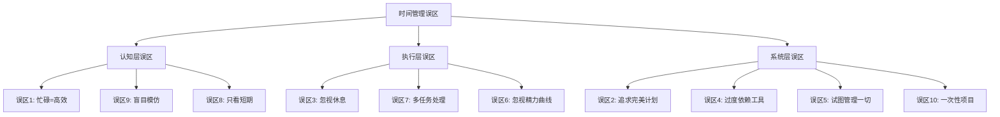
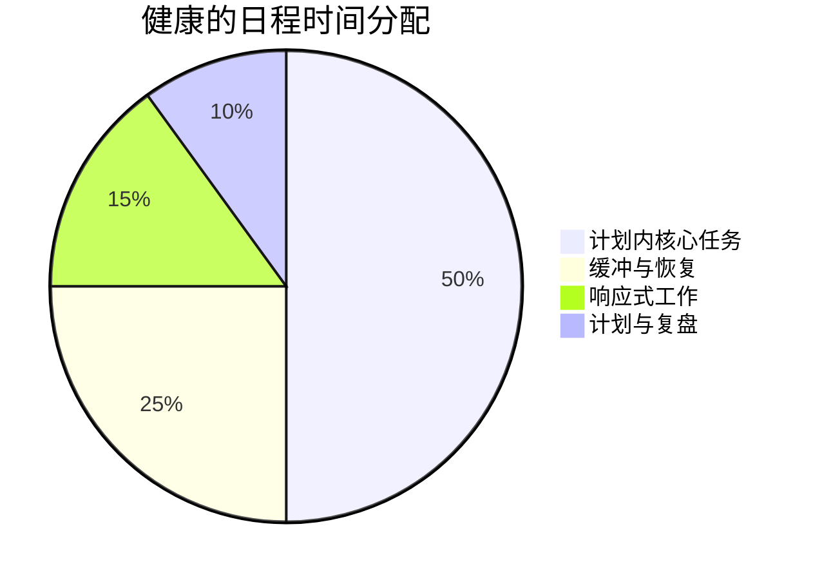
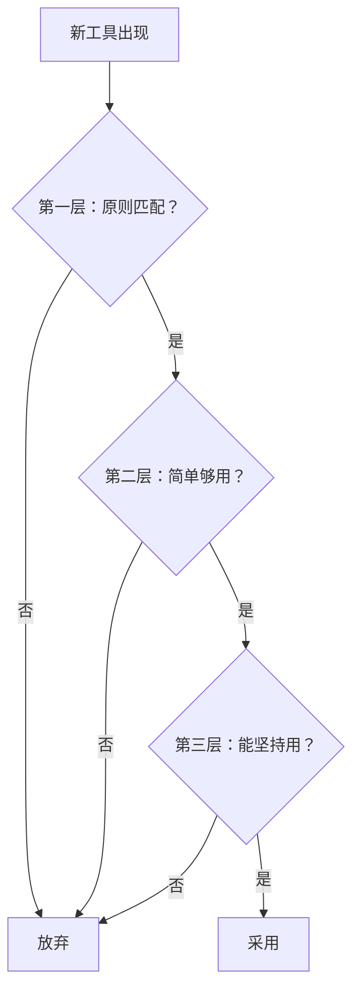
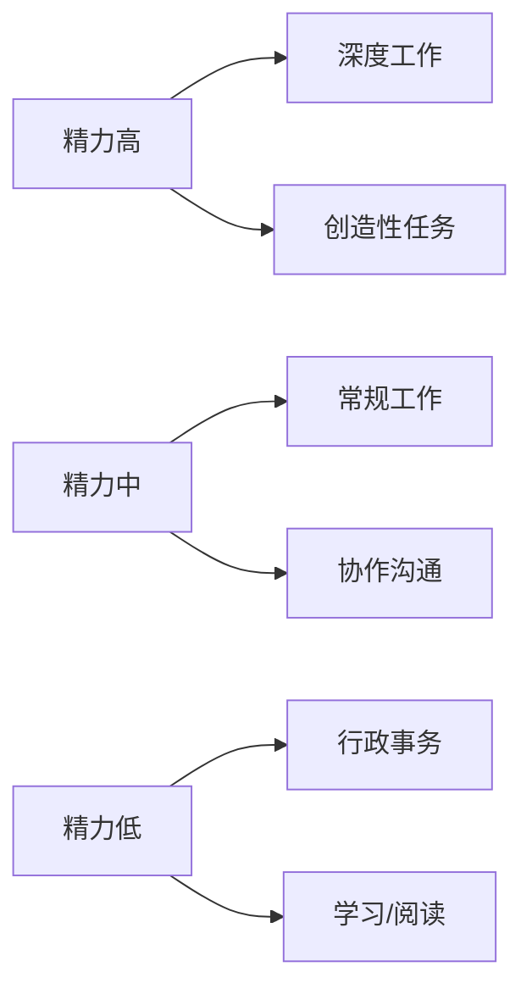

# 常见误区：时间管理中的十大陷阱与破解之道

## 为什么误区比不会更危险

时间管理领域存在一个吊诡的现象：**错误的方法比没有方法更有害**。一个从未学过时间管理的人，至少不会被错误的框架束缚；而一个深陷误区的人，会用越来越复杂的系统来掩盖根本性的问题，最终在"伪勤奋"的泥潭中越陷越深。

认知心理学中有一个概念叫"**达克效应**"（Dunning-Kruger Effect）——在某个领域能力不足的人，往往会高估自己的能力水平。时间管理领域尤其明显：很多人以为自己"已经很擅长管理时间了"，实际上他们的系统充满了低效的惯性和未经验证的假设。

本章的目的是帮你完成一次"认知体检"：逐一举揭十个最常见的误区，分析其背后的认知偏差，提供具体的纠正方案。每个误区都配有真实案例、科学依据和自测清单，让你能够精准识别自己的问题所在。

***

## 误区一：把"忙碌"等同于"高效"

### 典型表现

- "我今天从早忙到晚，肯定很高效"
- 用"忙不忙"来衡量一天的价值
- 以"加班"为荣，认为工作时间越长越好
- 把"日程排满"当作成就，把"有空闲"当作失败

### 为什么这是误区

忙碌和高效是两个完全不同的概念。忙碌描述的是**状态**（你一直在做事），高效描述的是**结果**（你产生了多少价值）。很多人忙了一整天，但真正推动核心目标进展的工作可能只有1-2小时。其余的时间可能花在了低价值的会议、无意义的邮件处理、以及被他人打断后的"恢复"上。

管理学大师彼得·德鲁克说过："没有什么比高效地做一件根本不该做的事更无用的了。"

**认知偏差解析**：这种误区的根源是"**行动偏见**"（Action Bias）——人类大脑天生倾向于"做点什么"，即使"什么都不做"可能是更好的选择。心理学家发现，人们在不确定的环境中更容易产生行动偏见，因为"做事"能带来一种虚假的控制感。

**真实案例**：硅谷某创业公司的产品经理Sarah，每天工作12小时以上，日程排得密不透风。她参加了每一个会议，回复了每一封邮件，处理了每一个请求。但季度复盘时，她负责的三个核心功能全部延期。原因很简单：她把80%的时间花在了"响应别人的需求"上，而不是"推进自己的核心目标"上。

### 量化你的"忙碌质量"

| 指标 | 计算方法 | 健康值 | 警戒值 |
|------|----------|--------|--------|
| 深度工作时间占比 | 深度工作时间 / 总工作时间 | ≥40% | <20% |
| 核心目标推进时间 | 直接推动KPI的时间 / 总工作时间 | ≥30% | <15% |
| 响应式工作占比 | 处理他人请求的时间 / 总工作时间 | ≤30% | >50% |
| 会议效率比 | 有明确产出的会议 / 总会议数 | ≥70% | <40% |

### 纠正方案

**第一步：建立"产出日志"**

每天结束时，花5分钟回答三个问题：

1. 今天推动了哪些核心目标的进展？（具体到可衡量的产出）
2. 今天做了哪些"看起来很忙但没产出"的事情？
3. 如果今天只能做一件事，我会做什么？我实际做了吗？

**第二步：实施"深度工作块"**

每天固定2-3个"深度工作时段"（每个90分钟），期间：
- 关闭所有通知
- 不查看邮件和消息
- 不接受任何打断
- 只专注于最重要的任务

**第三步：执行"任务审计"**

每周花15分钟，统计过去一周的时间分配：
- 列出所有花费时间超过30分钟的任务
- 为每个任务标注"核心/支持/低效"三类
- 计算三类任务的时间占比
- 如果"低效"占比超过30%，说明需要调整

> **进阶思考**：真正的高效不是"做更多的事"，而是"做更少但更重要的事"。沃伦·巴菲特的"两列清单法"值得借鉴：写下25个目标，圈出最重要的5个，然后**坚决避免**做另外20个——因为它们是"伪装成机会的干扰"。

***

## 误区二：追求完美的日程安排

### 典型表现

- 花大量时间制定详细的日程计划
- 每一个小时都安排得满满当当
- 一旦计划被打乱就感到焦虑和挫败
- 不断调整和优化计划，但很少执行

### 为什么这是误区

完美计划的最大问题是：它假设你可以预测一切。但现实是，意外和变化是生活的常态。一项研究发现，人们对自己一天能完成的工作量的预估平均高出50%。这意味着，如果你按"最佳情况"来安排日程，你几乎一定会失败。

更糟糕的是，追求完美计划本身就会消耗大量时间和精力——这些资源本可以用来执行计划。

**认知偏差解析**：这种误区的根源是"**控制幻觉**"（Illusion of Control）——人类倾向于高估自己对不可控事件的控制能力。详细的计划给人一种"一切尽在掌握"的感觉，但这种感觉往往是虚假的。

**真实案例**：某咨询公司的项目经理David，每天早上花45分钟制定精确到15分钟的日程表。但他的工作中有大量不可预测的客户电话和紧急事务。结果是，他的计划每天至少被打乱5次，每次打乱都让他焦虑，然后他又花时间"重新规划"。最终，他每周花在"计划"上的时间超过了5小时，但计划的执行率不到40%。

### 计划制定的"黄金比例"

### 纠正方案

**第一步：采用"时间块"而非"时间点"**

不要精确到"9:00-9:30做A，9:30-10:00做B"，而是用时间块：
- 上午（9:00-12:00）：深度工作块，处理最重要的2-3件事
- 下午（14:00-16:00）：协作时间块，处理会议和沟通
- 碎片时间（16:00-17:00）：处理邮件和琐事

**第二步：应用"2+1法则"**

每天只安排2件"必须完成"的任务和1件"希望完成"的任务。这样即使计划被打乱，你也只需要确保2件事完成即可。

**第三步：建立"应急协议"**

提前定义：当计划被打乱时，我该怎么办？
- 紧急且重要的事：立即处理，重新安排今天剩余时间
- 紧急但不重要的事：委托他人或快速处理（<10分钟）
- 不紧急的事：记录下来，安排到明天

**第四步：进行"计划复盘"**

每周花10分钟：
- 对比计划与实际完成情况
- 分析偏差的原因（是估算不准？还是被打断太多？）
- 调整下周的计划策略

> **进阶思考**：最好的计划不是"精确预测"，而是"弹性适应"。军事领域有一个概念叫"**任务式指挥**"（Mission Command）——只定义目标和边界，不规定具体步骤。把这种思维应用到时间管理：知道今天要达成什么结果（目标），但具体什么时候做、怎么做，保持灵活性。

***

## 误区三：忽视休息和恢复的价值

### 典型表现

- 认为休息是"浪费时间"
- 连续工作数小时不休息
- 用咖啡因和意志力硬撑
- 睡眠不足，认为可以"补回来"
- 把"不休息"当作"自律"的表现

### 为什么这是误区

休息不是工作的对立面，而是工作的必要条件。没有充分的休息，你的注意力、创造力和决策质量都会显著下降。

**神经科学依据**：

大脑的高效运转依赖于两种模式的交替：
- **任务正激活网络**（Task-Positive Network, TPN）：专注工作时激活
- **默认模式网络**（Default Mode Network, DMN）：休息时激活，负责整合记忆、产生创意、进行自我反思

这两种网络是**负相关**的——当一个激活时，另一个被抑制。如果你从不休息，DMN永远无法充分工作，你的创造力和问题解决能力就会持续下降。

**关键研究数据**：

- 连续工作90分钟后，认知能力会显著下降（注意力下降40%，错误率上升25%）
- 睡眠不足6小时连续一周，认知表现相当于连续24小时不睡觉（斯坦福大学研究）
- 午间小憩10-20分钟，可以提升下午34%的工作表现和54%的警觉性（NASA研究）
- 每工作52分钟休息17分钟的员工，生产力比连续工作的员工高30%（DeskTime研究）

### 纠正方案

**第一步：把休息当作"工作的一部分"**

在你的日程表中，明确安排休息时间。就像你不会跳过工作会议一样，你也不应该跳过休息。

**第二步：采用"冲刺-恢复"节奏**

每个恢复时段选择一种主动恢复方式：
- 散步（最好在户外，接触自然光）
- 冥想或深呼吸
- 轻度拉伸
- 与人面对面聊天（非工作话题）

**第三步：保护睡眠**

睡眠是最重要的恢复手段，不可协商的底线：
- 固定时间：每天同一时间入睡和起床（误差<30分钟）
- 睡前仪式：睡前1小时停止使用电子屏幕
- 环境优化：保持卧室黑暗、安静、凉爽（18-20℃）
- 避免干扰：睡前4小时不摄入咖啡因，睡前2小时不剧烈运动

**第四步：区分"主动休息"与"被动休息"**

| 类型 | 活动示例 | 恢复效果 | 适用场景 |
|------|----------|----------|----------|
| 主动休息 | 散步、冥想、运动、社交 | ★★★★★ | 长时间工作后的恢复 |
| 被动休息 | 刷手机、看短视频、发呆 | ★★☆☆☆ | 短暂放松（<10分钟） |
| 睡眠 | 午睡、夜间睡眠 | ★★★★★ | 深度恢复 |

> **进阶思考**：精英运动员的训练模式值得借鉴——他们80%的时间用于"低强度恢复"，只有20%用于"高强度冲刺"。知识工作者也应该采用类似的节奏：大部分时间保持"可持续的节奏"，只在关键时刻进行"高强度冲刺"。

***

## 误区四：过度依赖工具而忽视原则

### 典型表现

- 不断尝试新的时间管理APP和工具
- 花大量时间配置和美化工具系统
- 认为"只要找到完美的工具，时间管理问题就能解决"
- 工具换了一个又一个，但问题依旧

### 为什么这是误区

工具是手段，不是目的。没有正确的时间管理原则和习惯，再好的工具也无法帮你高效利用时间。很多人把"研究工具"当作一种拖延的伪装——他们感觉自己在"做时间管理"，但实际上只是在逃避真正的工作。

**真实案例**：某自由职业者Alex，在两年内尝试了15个不同的任务管理工具——Todoist、Notion、Things 3、OmniFocus、TickTick、Asana、Trello……每次切换工具，他都花2-3天"重新搭建系统"，然后兴奋一周，再然后就逐渐弃用。两年下来，他在"搭建系统"上花了超过100小时，但实际的生产力并没有提升。

### 工具选择的"三层过滤器"

### 纠正方案

**第一步：先学原则，再选工具**

在选择工具之前，先理解时间管理的基本原则：
- 四象限法则（重要/紧急矩阵）
- GTD理念（收集→处理→组织→回顾→执行）
- 番茄工作法（专注+休息的节奏）
- 时间块管理（把时间分块使用）

**第二步：从最简单的工具开始**

一支笔和一个笔记本就足以开始实践时间管理。在你真正理解自己的需求之前，不要急于选择复杂的工具。

**第三步：限制工具数量**

同时使用的工具不超过3-5个。建议的核心工具组合：
- 一个任务管理工具（管理待办事项）
- 一个日历工具（管理时间承诺）
- 一个笔记工具（记录想法和知识）
- 一个专注工具（帮助保持专注）

**第四步：定期审视工具**

每季度检查一次你的工具是否真的在帮你：
- 这个工具是否节省了我的时间？（量化）
- 我是否在维护工具系统上花了太多时间？
- 如果去掉这个工具，我的工作会受影响吗？

> **进阶思考**：工具的价值在于"**减少认知负荷**"——让你不用记住所有事情，不用在脑子里同时处理多个任务。但如果你花在"管理工具"上的认知负荷超过了工具帮你节省的负荷，那就本末倒置了。

***

## 误区五：试图管理所有事情

### 典型表现

- 把生活中的每一分钟都安排得井井有条
- 对每一件小事都做优先级排序
- 试图控制所有变量
- 对"计划外"的事情感到焦虑
- 把"不安排时间"当作"浪费时间"

### 为什么这是误区

时间管理的目的是帮助你把精力聚焦在最重要的事情上，而不是让你成为一个"时间管理狂人"。如果你把80%的精力花在管理20%不重要的琐事上，那就是本末倒置。

过度管理还会消耗大量的认知资源和心理能量，让你在真正重要的事情上反而没有足够的精力。

**心理学依据**：决策疲劳（Decision Fatigue）——每一个决策都会消耗意志力。如果你对每一件小事都做决策（今天穿什么、午饭吃什么、先做哪个小任务），你的意志力会被快速消耗，在面对真正重要的决策时反而无力应对。

**真实案例**：某创业者Mike，用Notion管理了生活中的每一个方面——工作、健身、饮食、社交、阅读、甚至"放松时间"。他每天花30分钟"规划"，花15分钟"复盘"，每周花2小时"优化系统"。结果是，他感觉自己永远在"管理"，永远没有真正"活"。最终他崩溃了，把Notion里的所有数据库都删掉了。

### 纠正方案

**第一步：聚焦关键少数**

只管理最重要的事情（四象限的第一和第二象限），其他的顺其自然。问自己："如果我只能管理3件事，我会选哪3件？"

**第二步：接受"足够好"**

不是所有事情都需要做到完美。学会接受"足够好"的结果。80%的完美度通常只需要20%的努力，而追求100%的完美度需要80%的额外努力。

**第三步：建立"不管理清单"**

明确列出哪些事情不需要管理，给自己"不管"的许可。例如：
- 日常琐事（吃什么、穿什么）
- 低频事件（一年几次的事情）
- 不可控因素（他人的行为、天气等）

**第四步：保持生活的"留白"**

不要把日程排得太满，留出一些自由时间来应对意外和享受生活。建议每天至少留出1-2小时的"未安排时间"。

> **进阶思考**：时间管理的最高境界不是"管理一切"，而是"管理关键"。就像投资一样——你不需要管理每一支股票，只需要管理好你的核心持仓。

***

## 误区六：忽视个人精力曲线

### 典型表现

- 在精力低谷期安排最重要的工作
- 不区分"高效时段"和"低效时段"
- 用咖啡因强行改变精力状态
- 持续工作到精疲力竭才休息

### 为什么这是误区

每个人的精力都有自然的波动周期，这是由**昼夜节律**（Circadian Rhythm）决定的。在精力高峰期做重要的事情，效率可能是低谷期的2-3倍。如果你在精力最差的时候做最重要的工作，不仅效率低下，还会增加出错的风险，长此以往还会导致职业倦怠。

**生物学基础**：

人体的精力波动受多种因素影响：
- **昼夜节律**：由大脑中的视交叉上核（SCN）控制，约24小时一个周期
- **超日节律**（Ultradian Rhythm）：约90-120分钟一个周期，与睡眠周期类似
- **血糖波动**：进食后血糖升高然后下降，影响精力水平
- **荷尔蒙变化**：皮质醇、褪黑素等荷尔蒙的分泌有固定的时间模式

### 常见的精力曲线模式

| 类型 | 高峰时段 | 低谷时段 | 适合的深度工作时间 |
|------|----------|----------|-------------------|
| 早鸟型 | 6:00-10:00 | 14:00-16:00 | 上午 |
| 夜猫型 | 16:00-22:00 | 8:00-11:00 | 下午/晚上 |
| 双峰型 | 8:00-11:00, 16:00-19:00 | 13:00-15:00 | 上午+下午 |
| 稳定型 | 全天相对平稳 | 午后略有下降 | 任意时段 |

### 纠正方案

**第一步：记录精力日志**

花一周时间，每2小时评估一次自己的精力水平（1-10分），记录：
- 当前精力分数
- 刚完成的任务类型
- 最近的饮食和休息情况

**第二步：识别你的黄金时间**

根据精力日志，找到你精力最旺盛的时段。这个时段应该用于：
- 最重要的工作
- 需要创造力的任务
- 需要深度思考的问题

**第三步：匹配任务难度与精力水平**

**第四步：尊重恢复需求**

不要等到精疲力竭才休息，在精力开始下降时就主动恢复。这就像开车——不要等到油箱空了才加油，而是在油量低于1/4时就去加油。

> **进阶思考**：精力管理的最高境界是"**精力预测**"——不仅知道当前的精力状态，还能预测未来的精力走势。例如，你知道下午2点会有精力低谷，就提前在1:30安排一个短暂休息，避免低谷的影响。

***

## 误区七：多任务处理提升效率

### 典型表现

- 同时做多件事情（边开会边回邮件、边写报告边聊天）
- 以"我能同时处理多件事"为荣
- 在工作时频繁切换任务
- 把"忙碌"误认为"高效"

### 为什么这是误区

"多任务处理"是一个被严重误解的概念。神经科学研究表明，大脑并不能真正同时处理多个需要注意力的任务——它只是在快速切换。每次切换都会产生"**注意力残留**"（Attention Residue），即前一个任务的思维惯性会干扰当前任务的处理。

**认知科学依据**：

明尼苏达大学的Sophie Leroy教授的研究发现，当你从任务A切换到任务B时，你的大脑并没有完全"离开"任务A。一部分认知资源仍然被任务A占用，这就是"注意力残留"。残留的程度取决于：
- 任务A的完成程度（未完成的任务残留更多）
- 任务A的复杂度（越复杂残留越多）
- 切换的突然程度（突然切换残留更多）

**密歇根大学的研究数据**：
- 任务切换会导致完成时间增加25-50%
- 错误率增加50%
- 认知疲劳增加
- 长期多任务处理会导致注意力控制能力下降

### 纠正方案

**第一步：单任务工作**

一次只做一件事。在开始一个任务之前：
- 关闭所有不相关的窗口和通知
- 把手机调成静音或放在看不到的地方
- 告诉同事"我接下来一小时在专注工作"

**第二步：批量处理同类任务**

把邮件、消息、电话等集中到固定时段处理，而不是随到随处理。例如：
- 每天只在9:00、12:00、17:00查看邮件
- 每天只在10:00、15:00回复消息
- 每天只在11:00、16:00处理电话

**第三步：使用番茄钟**

25分钟的专注时段是抵抗任务切换诱惑的好方法。在25分钟内，你只做一件事，不做任何切换。

**第四步：区分"真正的多任务"**

有些活动确实可以组合，但需要满足两个条件：
- 其中一个任务是**自动化**的（不需要认知资源）
- 两个任务使用**不同的感官通道**

例如：
- ✓ 运动时听播客（身体自动化+听觉通道）
- ✓ 散步时思考问题（身体自动化+思维通道）
- ✗ 开会时回邮件（两个都需要认知资源）
- ✗ 写报告时聊天（两个都需要语言通道）

> **进阶思考**：真正的高效不是"同时做多件事"，而是"在正确的时间做正确的事"。单任务工作不仅效率更高，还能带来"**心流**"（Flow）体验——一种完全沉浸在任务中的最佳体验状态。

***

## 误区八：只关注短期效率，忽视长期投资

### 典型表现

- 只处理"今天必须完成"的事情
- 没有时间学习新技能，因为"太忙了"
- 不愿意花时间建立系统，因为"太慢了"
- 忽视能力建设、关系维护、健康管理等"第二象限"事务

### 为什么这是误区

时间管理的最高境界不是"今天做了多少事"，而是"你今天做了哪些能让明天更好的事"。如果你只关注短期的效率，长期来看你会陷入"越忙越穷"的恶性循环——因为你的能力没有提升，只能用更多的时间来完成同样的工作。

**经济学视角**：

从投资的角度看，时间可以分为两类：
- **消费时间**：产生即时回报，但不增加未来的能力（处理日常任务）
- **投资时间**：产生延迟回报，但能提升未来的能力（学习、建系统、维护关系）

健康的"时间投资组合"应该是：
- 70-80% 消费时间（维持日常运转）
- 20-30% 投资时间（提升未来能力）

### 纠正方案

**第一步：每天留出"投资时间"**

每天至少花30分钟在能力建设、学习新技能、建立系统等长期投资上。这30分钟应该：
- 安排在精力最好的时段
- 像工作会议一样不可取消
- 有明确的学习目标

**第二步：把"第二象限"当作最重要的象限**

健康、学习、关系、系统建设——这些才是真正值得投入精力的事情。建议每周至少花5小时在第二象限事务上。

**第三步：用"长期回报率"评估任务**

问自己："这个任务一年后还有价值吗？"来判断优先级。例如：
- 回复一封普通邮件：一年后价值为0
- 学习一项新技能：一年后价值可能很高
- 建立一个自动化系统：一年后持续产生价值

**第四步：接受短期的"慢"**

建立系统和提升能力需要时间，短期内可能看不到明显效果，但长期回报巨大。就像投资一样——复利效应需要时间才能显现。

> **进阶思考**：最聪明的时间管理者，是那些"**用今天的时间，创造明天的时间**"的人。例如，花2小时建立一个自动化脚本，可能在未来一年节省200小时。这就是"时间复利"的力量。

***

## 误区九：模仿他人的时间管理方法

### 典型表现

- "马云每天4点起床，我也要4点起床"
- "某博主说每天冥想1小时很有效，我也要这样做"
- 盲目套用成功人士的时间表
- 不考虑自己的实际情况，照搬他人的方法

### 为什么这是误区

每个人的工作性质、生活节奏、精力模式和个人偏好都不同。适合别人的方法不一定适合你。盲目模仿不仅可能无效，还可能让你对自己的能力产生怀疑——"为什么别人能做到，我做不到？"

更糟糕的是，很多"成功人士的时间表"是被媒体美化过的，并不代表他们的真实情况。即使是真的，他们的成功也不是因为时间表，而是因为其他更根本的因素（如战略眼光、资源积累、时代机遇等）。

**真实案例**：某创业者听说某科技CEO每天4点起床，于是也尝试4点起床。结果是，他每天4点起来后昏昏沉沉，工作效率极低，而且因为睡眠不足，下午2点就开始犯困。一个月后，他不仅没有变得更高效，反而因为长期睡眠不足导致免疫力下降，感冒了两次。

### 纠正方案

**第一步：学习原理，而非照搬方法**

理解时间管理的核心原理，然后根据自己的情况设计个性化方案。例如：
- 原理：在精力高峰期做最重要的事
- 应用：找到你自己的高峰期，而不是模仿别人的高峰期

**第二步：从小处实验**

尝试新方法时，先小规模试验一周，看看是否适合自己。例如：
- 不要直接改成4点起床，先试试提前30分钟起床
- 不要直接冥想1小时，先试试5分钟
- 不要直接用GTD系统，先试试收集+处理两个步骤

**第三步：关注自己的数据**

用你的实际表现（效率、满意度、精力水平）来评估方法是否有效，而不是看别人怎么说。建立一个简单的评估系统：
- 每天记录效率评分（1-10）
- 每天记录满意度评分（1-10）
- 每天记录精力水平评分（1-10）
- 每周对比数据，看方法是否有效

**第四步：接受"不同"**

你不需要成为"某个人"才能高效。找到适合自己的节奏，比模仿任何人都重要。记住：**最好的时间管理系统，是你能坚持使用的系统**。

> **进阶思考**：时间管理的个性化不是"任性"，而是"科学"。就像医学一样——同样的病，不同的人可能需要不同的治疗方案。时间管理也是如此——同样的目标，不同的人可能需要不同的路径。

***

## 误区十：认为时间管理是一次性的项目

### 典型表现

- "我已经学了时间管理，现在应该没问题了"
- 建立了一套系统后就不再维护和更新
- 对系统的问题视而不见，直到系统崩溃
- 认为时间管理是一种"技能"，学会就完事了

### 为什么这是误区

时间管理不是一种可以"学会"然后就束之高阁的技能。它更像是一种**持续的实践**——就像健身一样，你不能练了三个月就停止锻炼，然后期望保持身材。

生活中的变化（新的工作、新的角色、新的挑战）会不断对你的系统提出新的要求。一个在"单身程序员"时期很好用的系统，可能在"有孩子的管理者"时期完全不适用。

**系统论视角**：

从系统的角度看，时间管理系统是一个**动态系统**——它的输入（任务、需求、环境）在不断变化，因此它的结构（规则、流程、工具）也需要不断调整。一个静态的系统在动态的环境中必然失效。

### 纠正方案

**第一步：建立定期回顾的习惯**

- **每日回顾**（5分钟）：今天完成了什么？明天最重要的3件事是什么？
- **每周回顾**（30分钟）：这周的系统运行如何？有哪些问题需要调整？
- **每月回顾**（1小时）：这个月的目标完成情况如何？下个月的重点是什么？
- **每季度深度审视**（2小时）：当前的系统是否还适合我？需要做哪些重大调整？

**第二步：保持系统的灵活性**

不要把系统设计得太僵化，留出调整和优化的空间。例如：
- 不要规定"每天必须做X"，而是"每周至少做X次"
- 不要使用过于复杂的工具，保持简单
- 定期清理系统中不再有效的部分

**第三步：持续学习**

时间管理领域不断发展，新的研究和方法不断涌现。保持学习的态度：
- 每年读1-2本时间管理书籍
- 关注相关领域的研究进展
- 与他人交流经验和心得

**第四步：把时间管理当作一种生活方式**

它不是你需要"做"的事情，而是你"活"的方式。时间管理的最终目标，不是让你"管理时间"，而是让你"拥有时间"——有时间做自己真正想做的事情。

> **进阶思考**：时间管理的最高境界是"**无管理**"——当你建立了正确的习惯和系统后，时间管理会变成一种自然的行为，不需要刻意去做。这就像开车——新手需要刻意关注每一个动作，而老手可以"自动驾驶"。

***

## 自测：你陷入了哪些误区？

在阅读完这十个误区后，花几分钟做一次自我评估。对于每个误区，用1-5分评估自己陷入的程度（1=完全没有，5=严重陷入）：

| 误区 | 自评分 | 是否需要改进？ |
|------|--------|---------------|
| 误区一：忙碌=高效 | ___ | □ |
| 误区二：追求完美计划 | ___ | □ |
| 误区三：忽视休息 | ___ | □ |
| 误区四：过度依赖工具 | ___ | □ |
| 误区五：管理所有事情 | ___ | □ |
| 误区六：忽视精力曲线 | ___ | □ |
| 误区七：多任务处理 | ___ | □ |
| 误区八：只看短期 | ___ | □ |
| 误区九：盲目模仿 | ___ | □ |
| 误区十：一次性项目 | ___ | □ |

**行动建议**：
- 选择得分最高的2-3个误区作为重点改进对象
- 针对每个误区，选择一个"纠正方案"开始执行
- 每周回顾一次，评估改进效果
- 一个月后重新自测，看是否有改善

***

## 总结：避开误区的核心原则

回顾这十个误区，我们可以提炼出几个核心原则：

1. **结果导向，而非活动导向**：衡量标准是"产生了多少价值"，而不是"做了多少事"。
2. **精力管理优先于时间管理**：没有精力的时间是无效时间。
3. **系统优于意志力**：建立可靠的系统，而不是依赖每天的意志力。
4. **个性化优于模仿**：根据自己的情况定制方案，而不是盲目照搬他人。
5. **持续优化，而非一次性完成**：时间管理是一个终身的实践过程。
6. **平衡短期效率与长期投资**：既要处理今天的任务，也要为明天积累能力。
7. **接受不完美**：完美是"足够好"的敌人。

> "最大的错误不是犯错，而是害怕犯错而不敢行动。"

时间管理不是关于"做更多的事"，而是关于"做对的事"。避开这些误区，你会发现：你不需要更多的时间，你需要的是更好的时间使用方式。

在下一节中，我们将对本章进行总结，提炼核心要点和行动建议。
