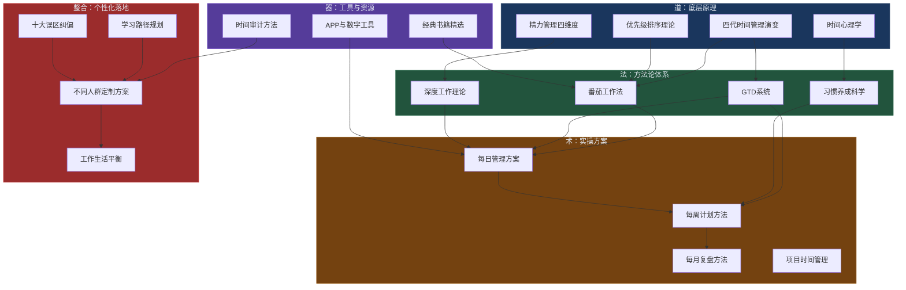
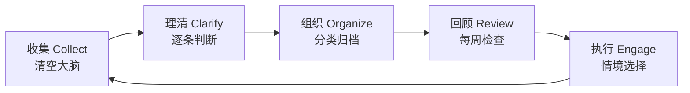
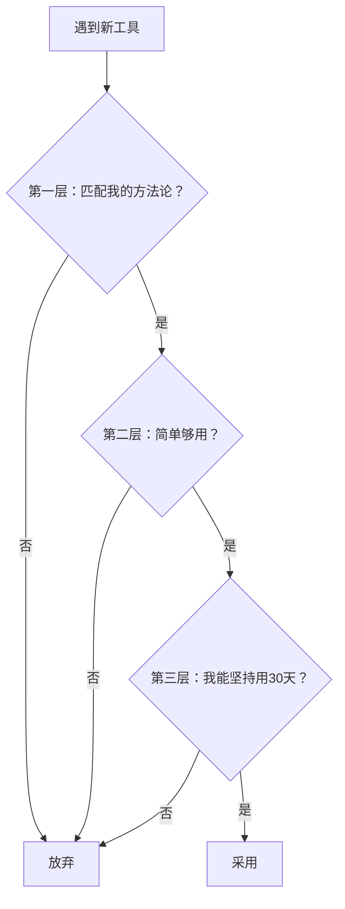

# 第十章 时间管理——本章小结

> "时间是最高贵而有限的资源，不能管理时间，便什么都不能管理。" ——彼得·德鲁克

本章用 32 个专题文件、近 15 万字的篇幅，系统地构建了一套**从认知到行动、从入门到精通**的时间管理知识体系。本小结将全章内容浓缩为一份可快速查阅的全景索引与核心要点提炼，帮助你在学完全章后建立完整的知识框架，也方便日后回顾时快速定位重点。

---

## 一、全章知识架构总览

本章的知识体系遵循**道→法→术→器→整合**五层递进结构，每一层都是下一层的地基：

| 层次 | 核心问题 | 对应章节 | 一句话总结 |
|------|---------|---------|-----------|
| 道（原理） | 为什么要时间管理？底层逻辑是什么？ | 基础理论 1-6 节 | 管理的本质是管理注意力、精力和行为，而非时间本身 |
| 法（方法） | 用什么系统来管理？ | 番茄工作法、GTD、深度工作、习惯科学 | 四大方法论覆盖从专注力训练到系统搭建的完整链路 |
| 术（方案） | 每天/每周/每月具体怎么做？ | 具体方案 1-8 节 | 从日计划到月复盘，提供可直接执行的操作模板 |
| 器（工具） | 用什么工具来放大效果？ | 产品推荐 1-4 节 | 先学方法再选工具，3-5 个核心工具足够 |
| 整合（落地） | 如何根据自己的情况定制？ | 学习路径、误区、不同人群方案 | 入门 4 周→进阶 8 周→精通 12 周+，分阶段递进 |

---

## 二、核心理论精要

### 2.1 时间管理的本质：管理自我而非管理时间

本章开篇即点明一个关键认知：**时间以每秒 1 秒的恒定速度流逝，任何人都无法改变它的速率。** 所谓"时间管理"，真正管理的是我们的**注意力质量、精力水平、优先级准确度和有效执行时长**。

这四个变量构成乘法关系——任何一个趋近于零，整体效能就趋近于零：

时间管理效能 = 注意力质量 × 精力水平 × 优先级准确度 × 执行时长

诺贝尔经济学奖得主赫伯特·西蒙早在 1971 年就洞察到：在一个信息丰富的世界里，信息的丰富意味着注意力的匮乏。50 多年后，智能手机和社交媒体将这个问题放大了 10 倍——斯坦福大学 2023 年的研究显示，智能手机用户平均每天查看手机 96 次，每次打断后重新进入专注状态需要 15-25 分钟。**注意力本身已经成为数字时代最稀缺的资源。**

哈佛商学院教授阿什利·威兰斯的研究揭示了"时间贫困"现象：超过 80% 的全职工作者报告自己"总是觉得时间不够用"，时间贫困与焦虑、抑郁、生活满意度下降显著相关。但时间贫困不是客观时间的缺乏，而是主观时间感知的失调——通过正确的方法，可以在不增加总时间的前提下显著缓解。

### 2.2 四代时间管理理论演变

时间管理思想经历了四个代际的演进，每一代都在前一代基础上扩展，而非取代：

| 代际 | 核心理念 | 代表工具/方法 | 优势 | 局限 |
|------|---------|-------------|------|------|
| 第一代：备忘录 | 把要做的事记下来 | 便签、笔记本 | 简单零门槛，降低遗忘风险 | 无优先级概念，事项增多后混乱 |
| 第二代：日程表 | 为事项分配时间段 | 日历、日程本 | 引入时间维度和预约概念 | 只关注"何时做"，忽视"是否值得做" |
| 第三代：优先级 | 做重要的事 | 四象限、ABC 法 | 引入价值判断，聚焦关键任务 | 以任务为中心，忽视人的精力状态 |
| 第四代：原则中心 | 以角色和原则为中心 | 角色平衡、周计划 | 追求人生角色的平衡 | 实施复杂度高，需要长期训练 |
| 第五代（趋势） | AI 辅助+注意力保护 | AI 任务管理、精力优先 | 人机协作，释放认知资源 | 尚在形成中，工具不成熟 |

**关键洞察**：大多数人的时间管理水平停留在第一代或第二代——用备忘录记录待办，用日历安排日程。要真正提升时间管理效能，需要进化到第三代（优先级思维）甚至第四代（角色平衡思维）。

### 2.3 优先级排序：所有时间管理的地基

如果优先级判断错误，效率越高错得越远。本章深入讲解了三种优先级框架：

**艾森豪威尔矩阵（四象限法则）** 是最经典的优先级工具：

              紧急                不紧急
         ┌──────────────┬──────────────┐
  重要   │   第一象限    │   第二象限    │
         │  立即做       │  计划做       │
         │  危机/截止日期 │  学习/健康/规划│
         ├──────────────┼──────────────┤
  不重要 │   第三象限    │   第四象限    │
         │  委托他人     │  尽量不做     │
         │  大部分会议    │  刷手机/闲聊  │
         └──────────────┴──────────────┘

大多数人的时间被第一象限（紧急且重要）和第三象限（紧急但不重要）吞噬。**真正改变人生轨迹的是第二象限**——学习新技能、锻炼身体、维护关系、战略规划。但第二象限的事不紧急，永远不会"自动"进入你的日程，你必须**主动安排**。

实操中四象限法最大的陷阱是"把所有事都标记为重要且紧急"。本章提供了三个过滤器来校准判断：①这件事一年后还有价值吗？②只有我能做这件事吗？③如果不做，最坏的结果是什么？

**80/20 法则**的正确理解：不是"只做 20% 的事"，而是"识别产出最高的 20% 活动并优先保障它们的时间"。很多人误用 80/20 法则把"不重要的 80%"直接砍掉，但很多低价值任务是高价值任务的前置条件，不能简单删除。

**"吃掉那只青蛙"**（博恩·崔西）：每天早上第一件事完成最难最重要的任务。如果有两只青蛙，先吃更难吃的那只。

### 2.4 番茄工作法：专注力的训练框架

25 分钟不是随意选择的数字。它基于三个认知科学原理：①大多数成年人能持续专注 20-45 分钟，25 分钟在舒适区边缘；②进入心流状态需要 10-15 分钟，25 分钟保证至少 10 分钟深度工作；③25 分钟心理上感觉"不太长"，降低了启动阻力。

**打断管理的三级策略**：

| 打断类型 | 例子 | 处理方式 |
|---------|------|---------|
| 内部打断 | 想起要买牛奶、突然的灵感 | 记在"打断清单"上，番茄钟结束后处理 |
| 外部打断（可延迟） | 同事问个不急的问题 | "我在忙，X 点后回复你"，记入打断清单 |
| 外部打断（不可延迟） | 老板叫你、紧急电话 | 放弃当前番茄钟，处理完后重新开始 |

加州大学欧文分校研究发现，被打断后平均需要 **23 分钟**才能回到之前的专注状态。这就是为什么保护番茄钟的完整性如此重要。

**进阶路径**：从每天 4 个番茄钟起步，逐步增加到 8-10 个。可以在坚持标准 25+5 节奏两周后，根据个人情况调整为 50+10 的长番茄钟节奏。

### 2.5 GTD 系统：清空大脑的外部系统

GTD（Getting Things Done）的核心理念出自戴维·艾伦：**你的大脑是用来产生想法的，不是用来储存想法的。** 平均每个人大脑中同时悬挂着 150-200 个未完成任务（蔡格尼克效应），每一个都在消耗认知资源。

GTD 的五步流程构成一个闭环：

**收集阶段**：把大脑中所有"悬而未决"的事情全部倾倒到一个可信的外部系统。目标是 100-300 条，包括工作项目、家庭事务、人际关系、个人目标、创意灵感、甚至担忧和焦虑。

**理清阶段**：对每一条问"可行动吗？"不可行动的分三种处理——垃圾扔掉、参考资料存档、将来/也许放入清单。可行动的继续问"下一步行动是什么？"

**两分钟规则**：能在 2 分钟内做完的立即做，不进入任何清单。这条规则看似简单，实际效果惊人——它消灭了大量积压的琐碎任务。

**组织阶段**：把任务分类到六个篮子——下一步行动清单、项目清单、等待清单、日历、将来/也许清单、参考资料。

**回顾阶段**：每周花 30-60 分钟回顾所有清单，确保系统可信。这是 GTD 最容易被忽略但最重要的环节——没有每周回顾，系统会在两周内失效。

### 2.6 时间心理学：理解"知行差距"的根源

很多人时间管理失败不是因为方法不好，而是因为不了解自己心理上的弱点。本章深入剖析了四个核心心理机制：

**拖延的本质**不是懒惰，而是**情绪调节失败**——我们通过回避来逃避任务引发的负面情绪（焦虑、无聊、恐惧、自我怀疑）。理解这一点至关重要，因为它意味着战胜拖延的关键不是"更自律"，而是"降低任务引发的负面情绪"。具体策略包括：①把大任务拆成 5 分钟就能完成的小步骤；②先做最容易的部分建立动量；③使用"如果-那么"计划预先应对阻力。

**时间折扣**（temporal discounting）：人类大脑天然倾向于高估眼前奖励、低估未来奖励。这就是为什么刷短视频比写报告更有"吸引力"——前者的奖励是即时的，后者是延迟的。对策是"奖励捆绑"——把不愉快的任务与即时奖励配对（如"完成报告后喝一杯好咖啡"）。

**规划谬误**：我们系统性地低估任务所需时间，平均低估 30-50%。对策是使用"参考类别预测法"——不从"这个任务理论上需要多久"出发，而从"类似任务过去实际花了多久"出发。为每项任务增加 25-50% 的缓冲时间。

**帕金森定律**：工作会自动膨胀，占满所有可用时间。如果你给自己一整天写一份报告，你就会花一整天。对策是人为设置更紧的截止日期，用时间压力激发效率。

### 2.7 精力管理：时间管理的高级形态

吉姆·洛尔在《精力管理》中提出，管理精力比管理时间更重要。精力有四个维度：

| 维度 | 构成要素 | 充电方式 | 耗电行为 |
|------|---------|---------|---------|
| 体能精力 | 睡眠、运动、饮食、呼吸 | 7-8 小时睡眠、规律运动、均衡饮食 | 久坐、熬夜、暴饮暴食 |
| 情绪精力 | 积极情绪的储备 | 社交、感恩练习、兴趣爱好 | 人际冲突、自我批评、焦虑 |
| 注意力精力 | 专注能力 | 深度工作、冥想、单任务 | 多任务切换、信息过载、打断 |
| 意义精力 | 使命感和热情 | 与价值观对齐的工作、利他行为 | 无意义感、价值冲突 |

**超日节律**（ultradian rhythm）：人体以 90-120 分钟为一个精力周期，每个周期后需要 20-30 分钟的恢复。这解释了为什么连续工作 90 分钟后认知能力会显著下降（注意力下降 40%，错误率上升 25%）。正确做法是在精力周期的高峰期安排高强度认知任务，低谷期安排休息或低强度任务。

**精力曲线绘制方法**：连续 2 周每小时记录精力水平（1-10 分），找到你的个人精力模式。大多数人属于以下四种类型之一：

| 类型 | 高峰时段 | 低谷时段 | 适合的深度工作时间 |
|------|---------|---------|-------------------|
| 早鸟型 | 6:00-10:00 | 14:00-16:00 | 上午 |
| 夜猫型 | 16:00-22:00 | 8:00-11:00 | 下午/晚上 |
| 双峰型 | 8:00-11:00, 16:00-19:00 | 13:00-15:00 | 上午+下午 |
| 稳定型 | 全天相对平稳 | 午后略有下降 | 任意时段 |

---

## 三、实操方案体系

### 3.1 每日管理：晨间仪式→日计划→日终回顾

**日计划三步法**（总耗时 10 分钟）：

1. **回顾**（5 分钟）：查看日历和待办清单，了解今天有哪些固定承诺
2. **确定**（3 分钟）：选出今天最重要的 3 件事（"三只青蛙"），不超过 3 件
3. **安排**（2 分钟）：把这 3 件事安排到精力最佳的时间段

**时间块管理法**：不是把每分钟都填满，而是为"最重要的事"预留受保护的专注时段。典型的时间块安排：

上午（精力高峰期）  → 深度工作块：处理最重要的 2-3 件事
中午（精力下降期）  → 协作时间块：开会、沟通、讨论
下午（精力恢复期）  → 常规工作块：处理中等优先级任务
傍晚（精力低谷期）  → 碎片时间块：邮件、消息、行政事务

**批处理法**：把同类任务集中处理——邮件每天看 3 次（9:00、13:00、17:00），消息每天集中回复 2 次，行政事务集中在一个下午处理。批处理的核心价值是减少任务切换带来的认知损耗。

**日终回顾模板**（5 分钟）：回答四个问题——①今天最重要的三件事完成了吗？②今天的亮点是什么？③今天的教训是什么？④明天的三只青蛙是什么？

### 3.2 每周管理：周计划→角色分配→周三微调

**周日晚上的 30 分钟仪式**：

1. **回顾上周**：完成情况如何？哪些目标达成了？哪些没达成？原因是什么？
2. **确定下周 3 个核心目标**：不超过 3 个，每个都具体可衡量
3. **按角色分配时间**：工作者、学习者、家庭成员、个人健康——每个角色至少分配一个时间块
4. **安排大石头**：把最重要的事项安排到日程中，琐事自动填满缝隙

**大石头优先法**（史蒂芬·柯维）：想象一个玻璃罐，如果先放沙子（琐事）再放大石头（重要事项），大石头放不下；但先放大石头再倒沙子，沙子会自动填满缝隙。时间也是如此——先把重要事项安排进日程，琐事会自动找到时间。

**GTD 每周回顾**：这是整个 GTD 系统的"心跳"。没有每周回顾，系统会在两周内失效。回顾内容包括：清空所有收件箱、检查所有"下一步行动"清单、回顾"等待"清单、检查日历未来两周、回顾"项目"清单、审视"将来/也许"清单。

### 3.3 每月管理：月度复盘→目标追踪→系统调优

**月度回顾四问**：

1. 这个月最骄傲的 3 个成就是什么？
2. 最浪费时间的 3 个行为是什么？
3. 下个月最重要的 3 个目标是什么？
4. 时间管理系统需要哪些调整？

**目标追踪仪表盘**：用简单的表格追踪年度目标的月度进展。每月一次的频率足以发现问题又不会造成过度管理。

**系统调优**：根据一个月的实践反馈，调整方法和工具。问自己——哪些方法有效应该坚持？哪些需要修改？哪些应该放弃？时间管理不是一劳永逸的，它需要持续迭代。

### 3.4 项目时间管理

对于跨越多周的长期任务，本章提供了系统化的管理方法：

**项目拆解法**（WBS 工作分解结构）：把大项目拆成可管理的子任务，每个子任务不超过 8 小时。超过 8 小时的任务说明还需要继续拆分。

**里程碑设定**：为项目设定 3-5 个关键里程碑，每个里程碑有明确的交付物和截止日期。里程碑是进度检查的锚点。

**缓冲时间原则**：基于规划谬误的修正——为每个任务增加 25-50% 的缓冲时间，为整个项目增加 15-20% 的整体缓冲。这不是"偷懒"，而是对人类系统性低估时间倾向的科学修正。

### 3.5 时间审计：一切优化的起点

在开始任何时间管理优化之前，你需要知道自己现在的时间花在哪里。时间审计的方法是：

1. **记录 1-2 周的时间日志**：精确到 15-30 分钟
2. **分析时间日志**：识别"时间黑洞"（无意识消耗超过 30 分钟的活动）和"时间错配"（在精力低谷期安排了高强度任务）
3. **计算关键指标**：

| 指标 | 计算方法 | 健康值 | 警戒值 |
|------|---------|--------|--------|
| 深度工作时间占比 | 深度工作时间 / 总工作时间 | ≥40% | <20% |
| 核心目标推进时间 | 推动 KPI 的时间 / 总工作时间 | ≥30% | <15% |
| 响应式工作占比 | 处理他人请求的时间 / 总工作时间 | ≤30% | >50% |
| 会议效率比 | 有明确产出的会议 / 总会议数 | ≥70% | <40% |

---

## 四、工具选择原则

本章的工具推荐遵循一个核心立场：**工具服务于方法，而非相反**。

### 4.1 选工具的三层过滤器

### 4.2 核心工具组合建议

同时使用的工具不超过 3-5 个：

| 类别 | 推荐工具 | 用途 | 选型建议 |
|------|---------|------|---------|
| 任务管理 | Todoist、Microsoft To Do、滴答清单、Things 3 | 管理待办事项和项目 | 追求效率选 Todoist，中文用户选滴答清单 |
| 日历 | Google Calendar、Outlook、Apple Calendar | 管理固定时间承诺 | 跟随自己的操作系统生态选择 |
| 番茄钟 | Forest、潮汐、Toggl Track | 专注力训练和时间追踪 | 需要激励机制选 Forest，需要白噪音选潮汐 |
| 笔记/知识管理 | Notion、Obsidian、Logseq | GTD 的"外部大脑" | 喜欢定制化选 Notion，喜欢纯文本选 Obsidian |

**关键原则**：选好工具后至少用 30 天再考虑更换。频繁切换工具本身就是一种"伪装成勤奋的拖延"。

### 4.3 经典书籍推荐

| 书名 | 作者 | 核心观点 | 适用人群 | 阅读优先级 |
|------|------|---------|---------|-----------|
| 《卓有成效的管理者》 | 彼得·德鲁克 | 时间是最稀缺的资源，有效管理者从时间开始 | 所有人 | ★★★★★ |
| 《高效能人士的七个习惯》 | 史蒂芬·柯维 | 要事第一，关注第二象限 | 想建立完整体系的人 | ★★★★★ |
| 《搞定》（GTD） | 戴维·艾伦 | 大脑用于产生想法，不是储存想法 | 任务复杂的人 | ★★★★★ |
| 《深度工作》 | 卡尔·纽波特 | 深度工作是数字时代的稀缺能力 | 知识工作者 | ★★★★☆ |
| 《原子习惯》 | 詹姆斯·克利尔 | 微小改变带来巨大成果 | 想养成好习惯的人 | ★★★★☆ |
| 《精力管理》 | 吉姆·洛尔 | 管理精力比管理时间更重要 | 感到疲惫的人 | ★★★★☆ |
| 《吃掉那只青蛙》 | 博恩·崔西 | 先做最难最重要的事 | 拖延严重的人 | ★★★☆☆ |
| 《番茄工作法图解》 | Staffan Nöteberg | 图解番茄工作法的操作细节 | 入门者 | ★★★☆☆ |

---

## 五、十大常见误区与纠偏

学习正确的方法很重要，但识别和避免错误同样重要。本章揭示的十大误区，几乎每个人都会在某个阶段踩中：

| # | 误区 | 表面逻辑 | 实际危害 | 纠偏方向 |
|---|------|---------|---------|---------|
| 1 | 把"忙碌"等同于"高效" | "我从早忙到晚，说明我很努力" | 忙于低价值事务，高价值事务被挤压 | 关注产出而非投入，每天问"最重要的一件事做了吗？" |
| 2 | 追求完美的日程安排 | "我要把每一分钟都安排好" | 一旦计划被打乱就焦虑，计划执行率不到 40% | 用时间块代替时间点，留出 30% 弹性时间 |
| 3 | 忽视休息和恢复的价值 | "休息是浪费时间" | 持续疲劳导致效率断崖式下降 | 采用"冲刺-恢复"节奏（90 分钟工作+15 分钟休息） |
| 4 | 过度依赖工具而忽视原则 | "换了新 APP 就能管好时间" | 频繁更换工具，花更多时间在工具上而非做事上 | 先掌握原则，工具不超过 3-5 个 |
| 5 | 用"紧急性"代替"重要性" | "先做最紧急的事" | 永远在救火，没有时间做预防 | 每天为第二象限保留至少 1 小时不可取消的时间块 |
| 6 | 认为时间管理是"一劳永逸"的 | "学完这套方法就行了" | 环境变化后系统失效 | 每月复盘，持续迭代优化 |
| 7 | 忽略精力波动 | "我要像机器一样持续高效" | 在低精力期强行工作，质量极差 | 绘制精力曲线，根据精力安排任务 |
| 8 | 多任务处理 | "同时做几件事效率更高" | 任务切换导致完成时间增加 25-50%，错误率增加 50% | 单任务专注+批量处理同类任务 |
| 9 | 不会说"不" | "拒绝别人会显得不友好" | 日程被别人的优先级占满 | 建立说"不"的策略和话术 |
| 10 | 一个人死磕 | "时间管理是个人的事" | 忽视团队协作和委托的机会 | 学会委托和协作 |

**误区背后的认知偏差**：

- 误区 1（忙碌=高效）的根源是"**行动偏见**"——人类大脑天生倾向于"做点什么"，即使"什么都不做"可能是更好的选择
- 误区 2（追求完美计划）的根源是"**控制幻觉**"——人类倾向于高估自己对不可控事件的控制能力
- 误区 7（多任务处理）的根源是"**注意力残留**"——从任务 A 切换到任务 B 时，一部分认知资源仍被任务 A 占用
- 误区 8（只看短期）的根源是"**时间折扣**"——人类天然倾向于高估眼前奖励、低估未来奖励

---

## 六、不同人群定制方案

时间管理没有放之四海而皆准的方案。本章针对五类人群提供了差异化建议：

| 人群 | 核心挑战 | 关键策略 | 重点方法 |
|------|---------|---------|---------|
| 学生 | 课程表固定但碎片时间多 | 围绕课程表和考试周期构建系统 | 学习时间块、考试冲刺计划、间隔复习 |
| 职场人 | 会议多、打断多、上下班切换 | 围绕工作节奏构建系统 | 会议管理、上下班过渡仪式、深度工作保护 |
| 自由职业者 | 没有外部约束，自律是最大挑战 | 围绕自律挑战构建系统 | 固定工作时间、环境切换（工作区≠休息区） |
| 创业者 | 角色多、不确定性高 | 围绕不确定性构建系统 | 角色切换清单、精力保护、"够好"哲学 |
| 全职妈妈/爸爸 | 碎片时间为主，自我时间稀缺 | 围绕碎片时间构建系统 | 微任务拆分、自我时间的保护、家人协作 |

**工作与生活平衡**是所有人群都需要面对的课题。核心策略包括：①固定下班时间并严格执行；②工作设备和生活设备分离；③建立"下班仪式"（如换衣服、散步 15 分钟）来帮助大脑切换模式；④高质量的休息是"主动恢复"（运动、社交、创造性爱好、亲近自然），而非刷手机那种"伪休息"。

---

## 七、学习路径：从零基础到精通

### 7.1 三阶段学习路径

```mermaid
graph LR
    subgraph 入门["入门阶段（第 1-4 周）"]
        A1["第 1 周：时间意识<br/>记录时间日志"]
        A2["第 2 周：优先级排序<br/>四象限+吃青蛙"]
        A3["第 3 周：番茄工作法<br/>每天 4 个番茄钟"]
        A4["第 4 周：每日计划<br/>三只青蛙+日终回顾"]
    end
    subgraph 进阶["进阶阶段（第 5-12 周）"]
        B1["第 5-6 周：GTD 系统<br/>搭建外部大脑"]
        B2["第 7-8 周：精力管理<br/>绘制精力曲线"]
        B3["第 9-10 周：时间块管理<br/>深度工作保护"]
        B4["第 11-12 周：习惯养成<br/>微习惯+环境设计"]
    end
    subgraph 精通["精通阶段（第 13 周+）"]
        C1["系统整合<br/>形成个人体系"]
        C2["定期复盘<br/>月度优化"]
        C3["教授他人<br/>费曼巩固"]
        C4["AI 辅助<br/>自动化提升"]
    end

    A1 --> A2 --> A3 --> A4
    A4 --> B1 --> B2 --> B3 --> B4
    B4 --> C1 --> C2 --> C3 --> C4

    style 入门 fill:#22543d,stroke:#276749,color:#e2e8f0
    style 进阶 fill:#1a365d,stroke:#2a4365,color:#e2e8f0
    style 精通 fill:#553c9a,stroke:#6b46c1,color:#e2e8f0
```

### 7.2 各阶段验收标准

| 阶段 | 时间投入 | 验收标准 |
|------|---------|---------|
| 入门（1-4 周） | 每周 3-4 小时 | 连续 7 天完成时间记录+每日三件事+至少 4 个番茄钟 |
| 进阶（5-12 周） | 每周 4-5 小时 | 拥有可信赖的 GTD 系统+了解精力曲线+深度工作占比>30% |
| 精通（13 周+） | 每周 3-5 小时 | 形成个性化系统+月度复盘习惯+能教授他人 |

**学习路径的设计原理**基于五大学习理论：布鲁姆认知分类学（层层递进）、刻意练习理论（舒适区边缘练习+即时反馈）、间隔重复效应（分散学习优于集中学习）、习惯回路理论（提示→行为→奖赏）、最近发展区理论（内容略高于当前能力）。

**如果验收未通过**：不要急于进入下一阶段。哪个检查项没通过，就再花一周强化那个技能。降低标准但保持频率——比如番茄钟从 25 分钟降到 20 分钟，但每天必须做。

---

## 八、核心观点提炼：七个不可遗忘的原则

经过全章 32 个专题的系统学习，以下七个原则构成了时间管理的核心骨架：

1. **时间管理的本质是自我管理**——管理注意力、精力和行为习惯，而非时间本身。时间以恒定速度流逝，你能改变的只有自己。

2. **优先级决定价值**——效率是正确地做事，效能是做正确的事。把 80% 的精力投入"重要但不紧急"的第二象限事务上，这是改变人生轨迹的关键。

3. **专注力是稀缺资源**——深度工作状态下的人产出质量是浅层状态的 5-10 倍。番茄工作法和深度工作是保护专注力的有效工具。

4. **大脑需要外部系统**——GTD 帮助清空大脑，建立可信赖的任务管理系统。大脑是用来产生想法的，不是用来储存想法的。

5. **拖延是情绪问题**——拖延的本质不是懒惰，而是情绪调节失败。理解这一点才能从根源上解决执行力问题。

6. **精力是时间的放大器**——同样的时间，不同的精力水平会产生截然不同的结果。管理精力比管理时间更有效。

7. **系统比意志力更可靠**——建立一个可信赖的时间管理系统，比依赖意志力更可持续。习惯是高效的终极形态。

---

## 九、可立即行动的建议

### 9.1 如果你只做一件事

> **每天早上花 5 分钟，写下今天最重要的三件事，然后在精力最好的时候完成第一件。**

这个简单的习惯就足以显著提升你的时间利用效率。它的 ROI 约为 20:1——每天投入 10 分钟做计划，全天效率提升 20-30%。

### 9.2 分阶段行动清单

**今天就可以做（5 分钟）：**

- [ ] 下载一个待办清单 APP（推荐 Microsoft To Do 或滴答清单）
- [ ] 写下"明天最重要的三件事"
- [ ] 设置一个番茄钟，尝试 25 分钟的专注工作

**本周可以做（3-5 小时）：**

- [ ] 记录 3 天的时间日志，了解自己的时间使用模式
- [ ] 尝试四象限法对每天的待办事项进行分类
- [ ] 完成 4 个番茄钟，体验结构化专注的力量
- [ ] 识别自己的 3 个"时间黑洞"

**本月可以做（15-20 小时）：**

- [ ] 阅读《原子习惯》或《搞定》中的一本
- [ ] 建立每日计划和回顾的习惯（连续 21 天）
- [ ] 完成"入门阶段"的 4 周学习计划
- [ ] 绘制自己的精力曲线（连续 2 周每小时记录精力水平）
- [ ] 进行一次完整的时间审计

---

## 十、本章金句集锦

| 金句 | 出处 | 核心启示 |
|------|------|---------|
| "时间管理的本质，不是做更多的事，而是做对的事。" | 彼得·德鲁克 | 关注效能而非效率 |
| "效率是正确地做事，效能是做正确的事。" | 彼得·德鲁克 | 方向比速度更重要 |
| "你的大脑是用来产生想法的，不是用来储存想法的。" | 戴维·艾伦 | 建立外部系统清空大脑 |
| "习惯是高效的终极形态。" | 詹姆斯·克利尔 | 自动化是效率的最高境界 |
| "管理精力比管理时间更重要。" | 吉姆·洛尔 | 精力是时间的放大器 |
| "没有什么比高效地做一件根本不该做的事更无用的了。" | 彼得·德鲁克 | 先确认方向再提升效率 |
| "最好的种树时间是二十年前，其次是现在。" | 中国谚语 | 行动永远不晚 |
| "千里之行，始于足下。" | 老子 | 最重要的一步是开始 |

---

## 结语

时间是我们最公平也最稀缺的资源。每个人每天都只有 24 小时，但如何使用这 24 小时，决定了我们人生的宽度和深度。

时间管理不是苦行，不是把自己变成一个"效率机器"。它的真正目的是帮助你**把时间花在真正重要的事情上**——无论是工作中的核心项目，还是与家人共度的温馨时光，或是独处时的自我成长。

记住开篇那两个同龄人的故事：张明和李然的差距不是天赋、不是资源，而是每天 24 小时中每一个选择的累积。五年下来，李然比张明多出了超过 2000 小时的深度工作时间——相当于整整一年的有效工作量。

当你能够有意识地选择如何度过每一天，当你能够在忙碌中保持从容，当你能够在追求目标的同时享受过程——你就真正掌握了时间管理的艺术。

**现在就开始吧。哪怕只是一个小小的改变，也是通往更好的自己的第一步。**

***

下一章预告：我们将探讨**财务管理**——如何建立健康的财务习惯，实现财务自由。
