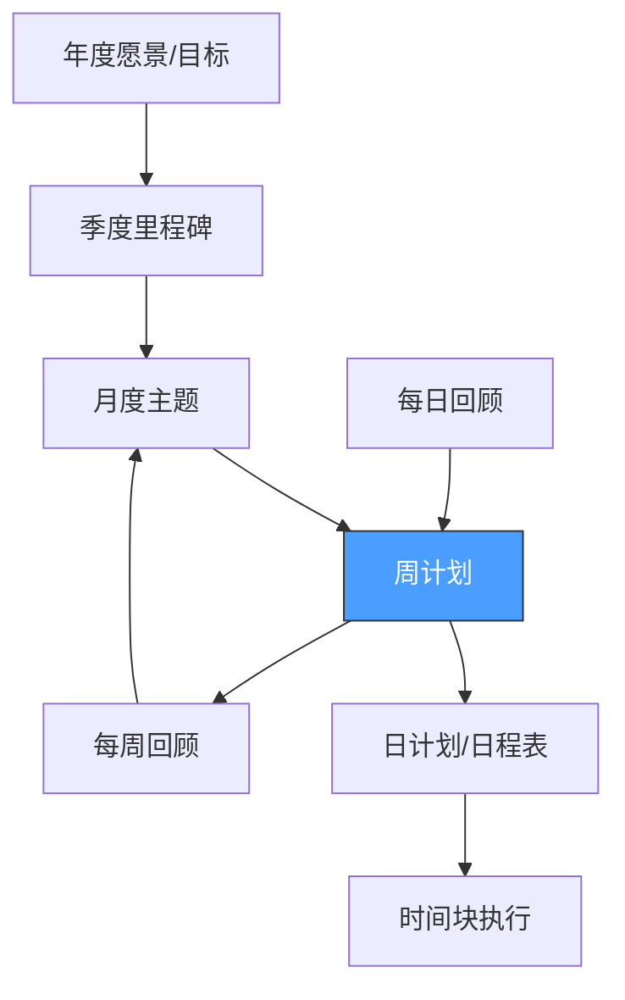
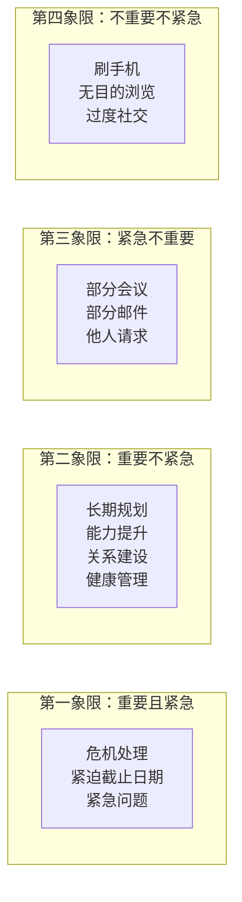

## 二、每周计划方法

日计划太短，容易陷入"灭火模式"——每天都在应对眼前最紧急的事，却从不推进真正重要的长期目标。年计划太长，执行过程中变数太多，年初定的计划到三月就面目全非。周计划恰好处于一个"够远又够近"的甜蜜点：它足够长，能容纳战略思考和深度工作；又足够短，能及时修正偏差、适应变化。

这一节将系统讲解周计划的底层逻辑、完整执行流程、实操模板，以及从新手到高阶的进阶方法。

### 2.1 为什么以"周"为单位最有效

#### 2.1.1 时间管理的"颗粒度"问题

时间管理本质上是对时间颗粒度的选择。不同颗粒度适用于不同场景：

| 颗粒度 | 适用场景 | 核心优势 | 核心缺陷 |
|--------|---------|---------|---------|
| 日计划 | 执行层面、单一项目 | 极度具体，可立即行动 | 视野狭窄，容易忽略全局 |
| **周计划** | **战略执行、多角色平衡** | **兼顾方向感和灵活性** | **需要一定的规划能力** |
| 月计划 | 项目管理、习惯养成 | 能看到趋势和模式 | 反馈周期太长，容易偏离 |
| 年计划 | 人生规划、愿景设定 | 提供方向和动力 | 过于抽象，难以执行 |

史蒂芬·柯维在《要事第一》中明确推荐以周为单位进行规划，他的理由是：

**第一，一周是人类社会节奏的基本单位。** 工作日和休息日的交替形成了天然的节奏感。大多数合同、报告、会议周期都以周为单位。这意味着你的个人计划可以和社会节奏同步，减少摩擦。

**第二，一周提供了足够的战略纵深。** 7天时间足以安排2-3个深度工作时段来推进重要但不紧急的项目。相比日计划只能关注"今天做什么"，周计划能让你思考"这一周我要在哪些方面取得进展"。

**第三，一周的反馈周期恰到好处。** 你可以在周末回顾本周的执行情况，及时发现问题并调整。如果某个方法不行，一周后你就能知道，而不是等到月底或年底。

**第四，一周提供了弹性空间。** 某一天如果被突发事情打断，你还有其他天可以弥补。日计划中最让人沮丧的就是"今天计划全被打乱了"，而周计划的视角下，这不过是"今天没完成，明天或后天补上"。

#### 2.1.2 周计划与其他时间管理方法的关系

周计划不是孤立存在的，它处于时间管理系统的核心层：



周计划承上启下——向上分解月度和季度目标，向下指导每日的具体安排。没有周计划，年度目标只是空中楼阁；没有周计划，日计划只是被动应对。

### 2.2 周计划的完整执行流程

周计划不是"周日晚上随便写写本周要做的事"，而是一个结构化的思考过程。以下是一套经过验证的完整流程，总耗时约45-90分钟。

#### 2.2.1 第一步：周回顾（20-30分钟）

在规划本周之前，必须先回顾上周。没有回顾的计划是盲目的计划。周回顾是整个流程中最重要但最容易被跳过的环节。

**回顾框架——五维回顾法：**

**维度一：目标完成度**

逐项检查上周设定的关键目标和"三只青蛙"：

- 哪些完成了？完成质量如何？
- 哪些未完成？原因是什么？（是优先级变了、能力不足、时间不够、还是拖延了？）
- 未完成的任务是否还需要做？如果需要，安排在本周的哪一天？

实操建议：用简单的完成率来量化——如果上周设定了5个关键目标，完成了3个，完成率就是60%。连续几周的完成率趋势能告诉你计划的准确度是否在提高。

**维度二：时间使用审计**

快速回顾上周的时间实际花在了哪里：

- 实际花费时间与计划时间的偏差有多大？
- 哪些事情花了远超预期的时间？
- 哪些时间块被意外占用或浪费了？

不需要精确到分钟，但要能识别出明显的时间黑洞。比如你发现自己"每天开会4小时，实际深度工作只有1.5小时"，这就是一个需要解决的问题。

**维度三：能量模式观察**

回顾上周的精力状态：

- 哪几天精力最好？哪个时段效率最高？
- 哪几天状态低迷？可能的原因是什么？（睡眠不足？运动中断？压力过大？）
- 有没有发现新的能量规律？

这个维度决定了本周如何安排高难度任务——把最难的事安排在你精力最充沛的时段。

**维度四：关系和承诺检查**

- 有哪些答应别人但还没做的事？
- 有哪些需要跟进但被遗忘的沟通？
- 哪些关系需要维护？（家人、朋友、同事、导师）

很多人的时间管理只关注"做事"，忽略了"做人"。关系维护是第二象限（重要但不紧急）中最容易被忽略的类别。

**维度五：教训与收获**

- 本周最大的收获是什么？（学到了什么、做成了什么、发现了什么）
- 本周最大的教训是什么？（犯了什么错、浪费了什么时间、什么方法行不通）

写下来。这不是自我感动，而是为了在下周的计划中避免重复错误、延续好的做法。

#### 2.2.2 第二步：角色审视（5-10分钟）

这是柯维"以角色为中心的周计划"的核心步骤，也是最容易被忽略的一步。

大多数人的时间管理只关注"工作"这一个角色，导致生活失衡。角色审视的目的是确保你在各个重要角色上都有所投入。

**操作步骤：**

1. 列出你当前生活中最重要的3-5个角色（不要超过5个，否则精力过于分散）
2. 为每个角色确定本周的1个关键目标
3. 检查这些目标是否覆盖了生活的不同维度

**角色示例和目标设定：**

| 角色 | 本周关键目标 | 具体行动 |
|------|------------|---------|
| 工程师 | 完成API重构方案的设计文档 | 周二、周四各安排2小时深度工作 |
| 丈夫 | 和妻子安排一次约会 | 周三晚上预订餐厅、安排保姆 |
| 学习者 | 完成《系统设计》第3章 | 每天早上阅读30分钟 |
| 运动者 | 完成3次运动 | 周一/周三/周五早上跑步 |
| 朋友 | 给老友打电话 | 周六下午安排通话 |

注意：角色目标不是"待办事项"，而是"本周我在这个角色上想要取得的一个有意义的进展"。它比"完成XX任务"更有方向感。

**角色审视的进阶用法——平衡度检查：**

画一个简单的雷达图，评估你最近一个月在每个角色上的投入程度（1-10分）。如果某个角色连续低于4分，说明你的生活正在向那个方向倾斜，需要在本周刻意增加投入。

#### 2.2.3 第三步：任务收集与头脑清空（10-15分钟）

这一步的目标是把脑子里所有"还没做的事"全部倒出来，变成一张清单。这是GTD"收集"环节的周计划版本。

**收集来源清单（逐项检查）：**

1. **上周未完成的任务**：从周回顾中提取
2. **日历和预约**：查看本周已有的会议、约会、截止日期
3. **工作项目管理系统**：Jira、Notion、飞书等工具中分配给你的任务
4. **邮箱和消息**：扫描是否有未回复但需要回复的邮件/消息
5. **"等待"清单**：是否有需要你跟进的他人承诺
6. **"将来/也许"清单**：是否有可以本周启动的项目
7. **生活事务**：缴费、购物、预约维修、体检等
8. **角色目标的分解任务**：第二步中每个角色目标对应的具体行动

**实操技巧：**

- 设一个15分钟的计时器，在这段时间内尽可能多地把脑子里的东西写下来
- 不要在这个阶段做任何判断——先全部写下来，后面再筛选
- 用纸笔或简单的文本编辑器，不要用复杂的工具（避免在收集阶段就陷入格式调整的陷阱）

典型情况下，一个忙碌的人一周可能有30-60项待办任务。不要被这个数字吓到——接下来的步骤会帮你筛选出真正重要的。

#### 2.2.4 第四步：优先级排序与筛选（10-15分钟）

收集完所有任务后，最重要的一步是筛选。时间管理的核心不是"做更多的事"，而是"做对的事"。

**筛选流程：**

**第一层筛选——四象限分类**

将所有任务按照"重要"和"紧急"两个维度分类：



- 第一象限任务：必须本周完成，安排在具体时间
- **第二象限任务：这是重点——必须刻意安排时间，否则永远被推迟**
- 第三象限任务：尽量委托他人，或合并处理
- 第四象限任务：果断删除或无限期推迟

**第二层筛选——关键任务确定**

从第一象限和第二象限中，选出本周的3-5个关键任务（也叫"大石头"或"青蛙"）。这些任务的特点是：

- 完成后能带来显著的进展感
- 如果不做，会产生明显的后果
- 通常需要1-3小时的专注时间

**判断标准——"10-10-10"法则：**

当你犹豫某个任务是否应该成为关键任务时，问自己：
- 完成这个任务后10分钟，我会怎么想？
- 10个月后呢？
- 10年后呢？

如果10个月后和10年后都觉得重要，那就是关键任务。

**第三层筛选——现实可行性检查**

最后检查一下：你选出的这些关键任务，在本周的实际可用时间内是否可行？

- 计算本周的实际可用工作时间（总时间 - 已预约的会议 - 通勤 - 必要的行政事务）
- 估算每个关键任务需要的时间
- 如果关键任务的总时间超过了可用时间的70%，说明你选多了，需要砍掉或推迟一些

留出30%的弹性空间是必须的——计划外的事情总会发生。

#### 2.2.5 第五步：日程安排（10-15分钟）

这是将战略思考转化为具体日程的最后一步。目标是让每一天都知道"今天最重要的一件事是什么"。

**安排原则：**

**原则一：高能量时段留给关键任务**

如果你是晨型人，把最重要的工作安排在上午9-12点。如果你的精力在下午达到高峰，那就下午安排深度工作。不要把最好的精力浪费在回邮件和开会上。

**原则二：一天一个"主旋律"**

如果可能，给每天设定一个主题。比如：

| 星期 | 主题 | 关键任务 |
|------|------|---------|
| 周一 | 规划与启动 | 制定本周详细计划，启动核心项目 |
| 周二 | 深度工作日 | 完成技术方案设计文档 |
| 周三 | 协作与沟通 | 团队会议，1对1，跨部门协调 |
| 周四 | 深度工作日 | 完成代码实现和测试 |
| 周五 | 收尾与复盘 | 代码审查，文档整理，周回顾 |
| 周六 | 个人发展 | 学习、阅读、技能提升 |
| 周日 | 休息与规划 | 放松、周回顾、下周计划 |

这样做的好处是减少上下文切换。当你知道今天是"深度工作日"时，你就不会安排太多会议；当你知道今天是"协作日"时，你就可以把所有的沟通集中在这一天。

**原则三：同类任务批量处理**

不要把回邮件、打电话、审批等零散任务分散在全天，而是集中在某个时段一次性处理。比如每天11:00-11:30和16:00-16:30统一处理消息和邮件。

**原则四：为第二象限任务预留时间块**

这是周计划最重要的价值之一——在日程中硬性安排时间给重要但不紧急的事：

- 健康：每周3次运动，每次1小时
- 学习：每天早上30分钟阅读
- 关系：每周至少一次与家人/朋友的深度互动
- 规划：每周日晚45分钟的周回顾和计划

如果不在日程中安排，这些事情永远会被"紧急"的事挤掉。

**原则五：留出缓冲区**

- 每天至少留出1小时的"空白时间"用于应对意外
- 不要把日程排得满满的——满日程是最脆弱的计划，一个意外就能让所有计划崩盘
- 建议的安排密度：计划时间占可用时间的60-70%

#### 2.2.6 第六步：承诺锁定（5分钟）

这是很多人忽略的最后一步——将计划变成对自己的承诺。

**操作：**

1. 写下"本周我最重要的三件事是：___"
2. 读一遍完整的周计划
3. 问自己："如果这一周结束时，我只完成了三件事，我会因为完成了哪三件事而感到满意？"
4. 将这三个答案写在计划的最上面

这一步的意义在于：在周一精力充沛、充满计划的时候就确定了优先级，这样在周中被各种事情冲击时，你有一个清晰的"锚点"可以回到。

### 2.3 周计划模板

以下是一份经过实战验证的周计划模板。你可以根据自己的需要调整，但建议保持核心结构不变。

```markdown
# 第__周计划 (MM/DD - MM/DD)

## 本周主题
（用一句话概括本周的重点，例如："完成产品2.0方案设计"或"建立每日运动习惯"）

## 本周承诺（最重要的三件事）
1. [ ] _________________________________
2. [ ] _________________________________
3. [ ] _________________________________

## 角色目标
- 💼 职业：___________________________
- 👨‍👩‍👧 家庭：___________________________
- 📚 个人成长：___________________________
- 💪 健康：___________________________
- 🤝 社交：___________________________

## 关键任务清单
| 任务 | 象限 | 预计时间 | 安排日期 | 完成 |
|------|------|---------|---------|------|
| 　　 | 　　 | 　　 | 　　 | [ ] |
| 　　 | 　　 | 　　 | 　　 | [ ] |
| 　　 | 　　 | 　　 | 　　 | [ ] |

## 日程安排
### 周一：_______________
- [09:00-11:00] _____________（关键任务）
- [11:00-11:30] 消息和邮件处理
- [11:30-12:00] _____________
- [14:00-16:00] _____________
- [16:00-16:30] 消息和邮件处理
- [16:30-17:30] _____________

（周二到周日格式相同）

## 第二象限时间块（本周重点保护）
- 🏃 运动：_____ （周一/周三/周五 7:00-7:45）
- 📖 阅读：_____ （每天 6:30-7:00）
- 👫 关系：_____ （周六下午）
- 📋 规划：_____ （周日晚 20:00-20:45）

## 本周注意事项
- 需要提醒自己的事：
- 需要提前准备的事：
- 需要避免的陷阱：
```

### 2.4 GTD每周回顾法

如果你使用GTD（Getting Things Done）系统，每周回顾是整个系统的心跳。David Allen说："如果你不做每周回顾，你就没有真正在做GTD。"

每周回顾的目的是确保你的系统是值得信赖的——你相信系统里的每一件事都是最新的、完整的，这样你才能安心地专注于当前的工作，而不是脑子里时刻担心"是不是忘了什么"。

#### 2.4.1 完整的每周回顾清单

整个回顾大约需要30-60分钟，分为三个阶段：

**阶段一：清空与收集（15-20分钟）**

这一阶段的目标是把所有散落各处的"悬而未决"收拢到系统中。

1. **清空所有收集箱**
   - 物理收件箱：桌面、口袋、包里、车里的所有纸片
   - 数字收件箱：邮件收件箱、微信/QQ未读消息、便签应用
   - 浏览器标签页：打开但还没处理的标签
   - 语音信箱：未听的消息

2. **处理"大脑中的杂念"**
   - 拿一张纸，用5分钟快速写下脑子里所有"好像还有什么事没做"的念头
   - 不要过滤，不要判断，先全部倒出来

3. **逐项处理收集箱中的每一项**
   - 每一项都按照GTD的"2分钟法则"处理：
     - 不需要做？→ 删除或归档
     - 2分钟内能做完？→ 立即做掉
     - 需要别人做？→ 委托，写入"等待"清单
     - 需要多步完成？→ 定义为项目，写入"项目"清单
     - 不是现在做？→ 写入"将来/也许"清单或设定日期
     - 需要你做但不是今天？→ 写入"下一步行动"清单

**阶段二：系统更新（15-25分钟）**

这一阶段的目标是确保你的所有清单都是最新的。

4. **回顾"下一步行动"清单**
   - 删除已完成的任务
   - 更新不再准确的描述
   - 检查是否有任务一直拖着没做——如果一个"下一步行动"在清单上超过两周，要么它的粒度不够细（需要拆解），要么你其实不想做（需要重新评估）

5. **回顾"项目"清单**
   - 列出所有需要多步才能完成的承诺（GTD定义的"项目"）
   - 确保每个项目都有至少一个明确的"下一步行动"
   - 如果某个项目的下一步行动不明确，花2分钟想清楚"这个项目的下一步到底是什么"
   - 标记已经完成的项目（庆祝一下！）

6. **回顾"等待"清单**
   - 检查每一项"等待别人"的任务
   - 是否需要发邮件/消息跟进？
   - 是否有人回复了但你还没处理？
   - 跟进时间是否到了？

7. **回顾"将来/也许"清单**
   - 浏览整个清单
   - 是否有项目现在可以激活？（条件成熟了、有时间了、有兴趣了）
   - 是否有项目其实已经不想做了？（果断删除）
   - 是否有新的"将来/也许"需要添加？

**阶段三：前瞻与规划（10-15分钟）**

这一阶段将回顾与未来的行动计划连接起来。

8. **回顾日历**
   - 回顾过去两周的日历：有没有遗留的承诺或需要跟进的事？
   - 查看未来两周的日历：有哪些需要提前准备的会议或事件？
   - 检查是否有冲突或过于密集的安排

9. **回顾长期目标**
   - 快速查看你的年度目标/季度目标
   - 问自己："我最近的行动是否在推动这些目标？"
   - 如果偏离了，本周可以做一件什么事拉回方向？

10. **确定下周的关键任务**
    - 基于以上所有回顾，确定下周的3-5个关键任务
    - 这些任务要能体现你的角色平衡和长期目标

#### 2.4.2 每周回顾的常见陷阱

**陷阱一："没时间做回顾"**

这是最常见的借口。真相是：你没时间做事，恰恰是因为你没做回顾。30-60分钟的回顾能节省你一周中至少3-5小时的混乱和低效。把周回顾当作投资，不是成本。

建议：在日历中固定一个"周回顾"时间段，像对待重要会议一样对待它。周日晚上8点是一个很好的选择——既不会占用工作日的时间，又能为新的一周做好准备。

**陷阱二："我的系统已经乱了，等整理好了再做回顾"**

这就像说"我太累了所以不睡觉"。系统越乱，越需要通过回顾来整理。每次回顾都是让系统重新变得可信的机会。不要追求完美，先做到"比上周好一点"就够了。

**陷阱三："回顾变成了焦虑的来源"**

如果你在回顾中看到了大量未完成的任务，感到焦虑，这是正常的。但回顾的目的不是让你感到内疚，而是让你重新获得控制感。未完成的任务不代表你失败了——它只是代表你需要重新评估优先级。有些任务你可能需要果断删除。

**陷阱四："只看不改"**

回顾必须产生行动。如果你发现自己每次回顾都在看同样的未完成任务，但从不采取行动，那你的回顾流程有问题。每次回顾后，至少要产生一个新的决定：做、委托、推迟、或删除。

### 2.5 周计划的进阶方法

#### 2.5.1 主题周法

给每周设定一个"主题"，让整周的安排都围绕这个主题展开。

**示例：**
- "写作周"：本周的核心目标是完成一篇长文或报告，所有日程都为此服务
- "社交周"：本周重点维护关系，安排多次会面和沟通
- "整理周"：本周处理积压的行政事务、整理文件和系统
- "学习周"：本周专注学习一个新技能或领域

主题周法的好处是减少"什么都想做但什么都做不好"的焦虑。当你知道本周是"写作周"时，你就不会因为没有去运动而感到内疚——因为那是"运动周"的事。

#### 2.5.2 能量映射法

不是所有时间都是等价的。基于你个人的能量规律来安排任务，而不是简单地按时间顺序安排。

**操作步骤：**

1. 记录一周中每个时段的精力水平（1-10分）
2. 找出你的"黄金时段"（精力最旺盛的2-3小时）
3. 找出你的"低谷时段"（精力最差的1-2小时）
4. 将最高价值的任务安排在黄金时段
5. 将低价值但必要的任务安排在低谷时段

**能量-任务匹配表：**

| 能量水平 | 适合的任务类型 | 示例 |
|---------|-------------|------|
| 高能量（8-10分） | 创造性工作、深度思考、困难决策 | 写方案、写代码、做设计、战略规划 |
| 中能量（5-7分） | 沟通协作、常规工作、学习 | 开会、回邮件、阅读文档、代码审查 |
| 低能量（1-4分） | 行政事务、整理归档、简单重复 | 填表、整理文件、报销、购物 |

#### 2.5.3 承诺可视化法

将每周的承诺和安排可视化，让"时间都去哪了"一目了然。

**甘特图式周视图：**

用一个简单的表格来展示本周时间的分配：

```markdown
| 时间段 | 周一 | 周二 | 周三 | 周四 | 周五 | 周六 | 周日 |
|-------|------|------|------|------|------|------|------|
| 6:00-7:00 | 运动 | 阅读 | 运动 | 阅读 | 运动 | 睡懒觉 | 睡懒觉 |
| 8:00-9:00 | 通勤 | 通勤 | 通勤 | 通勤 | 通勤 | 自由 | 自由 |
| 9:00-12:00 | 深度工作 | 深度工作 | 会议 | 深度工作 | 复盘 | 学习 | 周计划 |
| 12:00-14:00 | 午餐 | 午餐 | 午餐 | 午餐 | 午餐 | 午餐 | 午餐 |
| 14:00-17:00 | 协作 | 深度工作 | 会议 | 深度工作 | 收尾 | 自由 | 自由 |
| 18:00-20:00 | 家庭 | 学习 | 约会 | 家庭 | 社交 | 自由 | 休息 |
| 20:00-22:00 | 阅读 | 阅读 | 阅读 | 阅读 | 影视 | 自由 | 回顾 |
```

这种视图能让你一眼看出：
- 深度工作的时间是否足够？
- 会议是否占用了太多时间？
- 各个角色是否都有时间投入？
- 是否有连续的深度工作时段？

#### 2.5.4 弹性计划法

传统周计划的最大问题是太刚性——一旦计划被打乱，整个周计划就崩了。弹性计划法通过以下机制来增强计划的韧性：

**机制一：核心+弹性结构**

将每周的安排分为两部分：
- **核心时间（60%）**：已经确定的、不会改变的安排
- **弹性时间（40%）**：可以调整的、用于应对变化的缓冲

**机制二：优先级梯队**

不要把所有任务放在一个平面上。建立梯队制度：
- **A梯队**：本周必须完成的任务（通常2-3个）
- **B梯队**：本周应该完成的任务（通常3-5个）
- **C梯队**：有时间就做的任务（不限数量）

当计划被打乱时，先确保A梯队不受影响，B梯队尽量完成，C梯队随缘。

**机制三：替代方案预设**

对于关键任务，提前想好"如果这个时间块被占用，我可以在哪里补回来？"。比如"如果周三下午的深度工作被会议占用了，我就改到周四早上提前一小时开始"。

#### 2.5.5 多人协调周计划

如果你需要和家人或团队协调时间，周计划还需要增加一个"协调"环节。

**家庭协调：**

每周花15分钟和伴侣/家人一起对一下本周的日程：
- 各自有什么重要的安排？
- 是否有冲突？（比如两个人同时有事，没人接孩子）
- 是否有共同的时间可以安排家庭活动？
- 谁负责哪些家务和接送？

**团队协调：**

在周一的团队站会中，用1分钟分享你本周的重点工作：
- "我本周的重点是完成X，周三前能交付第一版"
- "周二下午我需要Y的支持"
- "我周四全天都在开会，不要安排需要我参与的事"

### 2.6 常见误区与纠正

#### 误区一：把周计划当作"愿望清单"

**症状：** 每周列出20+个任务，到周末只完成了5个，感到挫败。

**纠正：** 周计划的核心是"选择"而非"列出"。一个有效的周计划应该只有3-5个关键任务。其他的都是"如果有多余时间才做的事"。宁可计划少一点但全部完成，也不要计划太多但大部分落空。

**判断标准：** 如果你每周的完成率低于50%，说明你计划得太多了。如果完成率持续高于90%，说明你计划得太保守了。最理想的完成率是70-80%。

#### 误区二：忽略第二象限任务

**症状：** 每周都在处理紧急的事，重要的事永远在"下周"。

**纠正：** 在周计划中，第二象限任务必须占据至少30%的计划时间。如果你的周计划中全是第一象限和第三象限任务，你的生活正在被"紧急"驱动，而不是被"重要"驱动。

**实操方法：** 在周计划模板中，先安排第二象限任务的时间块（运动、学习、关系、规划），然后再安排其他任务。先保护"大石头"的位置，再填入"沙子"。

#### 误区三：计划太详细

**症状：** 花了2小时做一份精确到15分钟的周计划，结果周二就完全偏离了。

**纠正：** 周计划应该是"战略级"的——确定关键任务和大致的时间安排，但不要试图规划每一天的每一分钟。日级别的细节留给每天早上的5分钟日计划。

**原则：** 周计划的颗粒度应该是"任务+时间块"，而不是"时间点+活动"。"周二上午安排2小时做方案设计"就够了，不需要"9:00-9:15 列大纲，9:15-10:00 写第一章..."。

#### 误区四：只计划工作，不计划生活

**症状：** 周计划全是工作任务，没有运动、社交、休息、家庭的安排。

**纠正：** 时间管理的目的不是最大化工作效率，而是最大化人生满意度。一个只有工作没有生活的周计划，长期来看会降低你的整体效能（因为精力枯竭、关系疏远、健康恶化）。

**检查清单：** 你的周计划中是否包含以下内容？
- [ ] 运动/健康管理
- [ ] 学习/成长
- [ ] 关系维护
- [ ] 休息/放松
- [ ] 精神/反思

#### 误区五：做了计划不回顾

**症状：** 每周都做计划，但从不回顾上周的执行情况。

**纠正：** 没有回顾的计划是单向的——你只输出不接收反馈。周回顾是让你的计划能力持续提升的唯一途径。不回顾，你就永远在同一个水平上计划。

**最小可行回顾：** 如果你觉得完整的周回顾太花时间，至少做到以下三步（5分钟即可）：
1. 检查上周的关键任务完成了几个
2. 写下上周最大的一个教训
3. 确定下周最重要的三件事

### 2.7 工具推荐

周计划不需要复杂的工具，但一个好工具能降低执行摩擦。以下是不同场景的推荐：

| 工具类型 | 推荐工具 | 适合人群 | 核心优势 |
|---------|---------|---------|---------|
| 纸质手账 | Hobonichi、灯塔笔记本 | 喜欢书写感、需要减少屏幕时间的人 | 无干扰，书写加深记忆 |
| 数字笔记 | Notion、Obsidian、Logseq | 需要搜索和关联、喜欢模板化的人 | 可复用模板，支持链接 |
| 日历工具 | Google Calendar、Outlook | 需要和团队协调、会议很多的人 | 时间块可视化，支持共享 |
| 任务管理 | Todoist、滴答清单、Things | 任务量大、需要提醒功能的人 | 跨设备同步，自然语言输入 |
| 极简方案 | 纯文本文件 + Markdown | 不想在工具上花时间的技术人 | 零学习成本，可版本管理 |

**工具选择原则：** 最好的工具是你愿意持续使用的工具。一个简单的笔记本，如果每周都用，远胜于一个功能强大但三天就弃用的高级应用。

### 2.8 从"知道"到"做到"的行动指南

读完这一节，你可能觉得"道理我都懂，但就是做不到"。这是正常的——周计划是一个需要练习才能掌握的技能。

**21天养成计划：**

| 阶段 | 时间 | 目标 | 最低要求 |
|------|------|------|---------|
| 第一阶段 | 第1-3周 | 养成习惯 | 每周日晚花15分钟写下本周3个关键任务 |
| 第二阶段 | 第4-6周 | 完善流程 | 加入周回顾和角色审视，时间增加到30分钟 |
| 第三阶段 | 第7-9周 | 精细化 | 完整执行六个步骤，包括日程安排和第二象限时间块 |
| 第四阶段 | 第10周+ | 内化 | 周计划成为自动习惯，开始探索进阶方法 |

**关键提醒：** 第一阶段的目标不是"做出完美的周计划"，而是"每周都做计划"。先建立习惯，再优化质量。一个粗糙但每周都做的计划，远胜于一个完美但只做了两次的计划。
