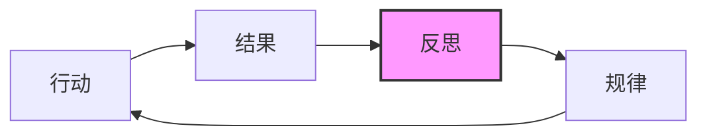
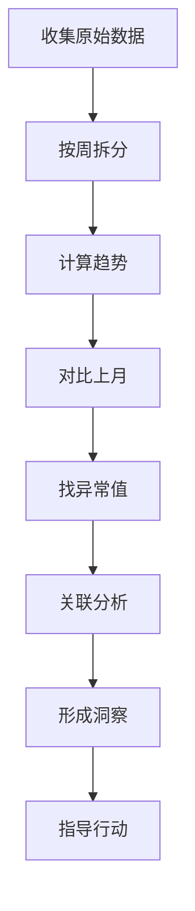
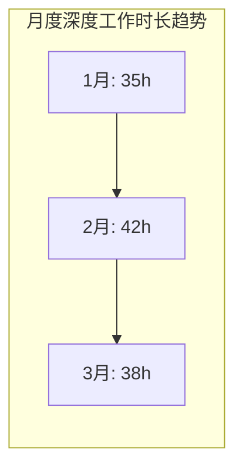
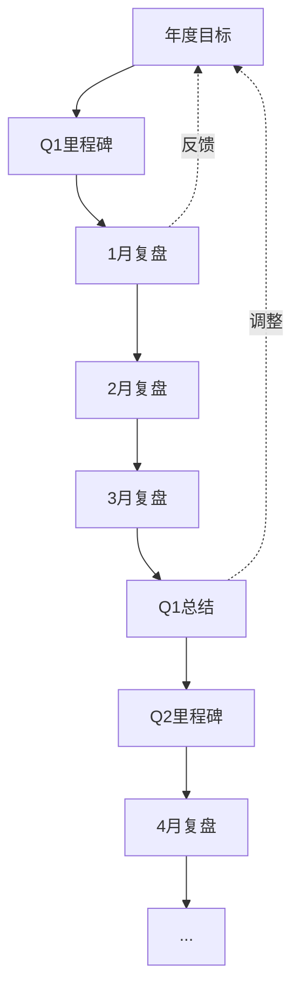

## 三、每月复盘方法

日计划帮你管好每一天，周计划帮你协调一周的节奏，但它们都存在同一个盲区：你可能在错误的方向上高效执行。月度复盘的核心价值，不是检查"做了多少"，而是回答一个更根本的问题——**你这个月的努力，是否正在把你带向你想去的地方？**

这一节将系统讲解月度复盘的底层逻辑、完整执行流程、数据驱动的分析方法、实操模板，以及从新手到高阶的进阶路径。

### 3.1 为什么月度复盘不可替代

#### 3.1.1 复盘的本质：从经验中学习的闭环

"复盘"一词源于围棋术语，指对弈结束后重新摆一遍棋局，分析每一步的得失。柳传志将其引入企业管理，成为联想三大方法论之一。复盘的本质是一个学习闭环：



哈佛商学院的研究表明，**每天花15分钟反思的员工，绩效比不反思的同事高出23%**。但日反思太碎，年反思太慢，月度恰好是一个能看清趋势又不失敏捷的周期。

#### 3.1.2 月度复盘与日/周复盘的区别

三者不是重复，而是分层互补：

| 维度 | 日复盘 | 周复盘 | 月度复盘 |
|------|--------|--------|----------|
| **核心问题** | 今天做了什么？ | 这周进展如何？ | 这个月的方向对吗？ |
| **视角高度** | 执行层 | 战术层 | 战略层 |
| **关注重点** | 任务完成、时间分配 | 目标推进、习惯维持 | 趋势模式、系统优化 |
| **典型时长** | 5-10分钟 | 20-30分钟 | 60-120分钟 |
| **输出物** | 明日待办 | 下周计划 | 系统调整方案 |
| **频率优势** | 即时反馈 | 快速修正 | 深度洞察 |

日复盘是"显微镜"，看细节；周复盘是"望远镜"，看方向；月度复盘是"CT扫描"，看结构。一个健康的时间管理系统，三者缺一不可。

#### 3.1.3 不做月度复盘的代价

不做月度复盘，你会陷入三个陷阱：

**陷阱一：忙碌陷阱。** 你每个月都很忙，但年底回顾时发现，真正重要的事情几乎没有推进。因为你从未停下来检查——每天每周的忙碌，是否在累积成有意义的成果。

**陷阱二：重复犯错陷阱。** 没有复盘，同样的错误会反复出现。比如你每个月都在月初制定雄心勃勃的计划，月中开始拖延，月底匆忙收尾。如果不去分析这个模式，它会一直重复。

**陷阱三：方向漂移陷阱。** 年初设定了目标，但生活中的琐事和他人的需求会不断把你拉偏。没有月度校准，你可能偏离方向好几个月才发现。

### 3.2 月度复盘的完整流程

**时间选择：** 每月最后一个周末的上午，精力最好的时段。避免在疲惫的周五晚上做复盘——那时你的判断力已经下降，容易草草了事或过于自责。

**总时长：** 60-120分钟。不要压缩到30分钟以内——那不是复盘，是走过场。也不要超过2小时——过长会导致疲劳和注意力涣散。

**环境准备：**
- 找一个安静、不被打扰的空间
- 关闭手机通知
- 准备好纸笔（手写有助于深度思考）
- 准备一杯水或茶（避免咖啡因导致的焦躁）
- 打开本月的周复盘记录、日历、时间追踪数据

下面是完整的五步流程，每一步都有详细的操作说明。

#### 第一步：目标回顾（20分钟）

**操作方法：**

拿出月初设定的目标（如果月初没设定，就回顾月初时你认为这个月最重要的事），逐个评估：

1. **完成情况打分。** 不要用"完成/未完成"的二元判断，用0-10分制：
   - 0分：完全没有开始
   - 3分：开始做了但进展很少
   - 5分：做了一半
   - 7分：基本完成但有瑕疵
   - 10分：完美完成，超出预期

2. **成功因素分析。** 对于得分7+的目标，追问：
   - 是什么条件让我能够完成？（时间充裕？外部支持？内在动力？）
   - 这个条件是可以复制的吗？
   - 如果可以复制，下个月如何主动创造这个条件？

3. **阻碍因素分析。** 对于得分3-的目标，区分三种阻碍：
   - **能力阻碍：** 缺乏必要的技能或知识 → 需要学习或求助
   - **资源阻碍：** 缺少时间、金钱、工具 → 需要调整优先级或获取资源
   - **动力阻碍：** 知道该做但不想做 → 需要重新审视目标的意义

**关键原则：** 不要自责。阻碍因素分析的目的是改进系统，不是审判自己。如果一个目标连续两个月得分低于3，问题通常不在你个人，而在于目标设定不合理或缺乏支持系统。

#### 第二步：数据分析（20分钟）

这是月度复盘中最有价值、也最容易被忽略的一步。感觉会骗人，数据不会。

**核心指标清单：**

| 指标 | 数据来源 | 健康范围 | 警戒信号 |
|------|---------|---------|---------|
| 深度工作总时长 | 时间追踪工具/番茄钟记录 | 40-80小时/月 | <30小时 |
| 番茄钟完成总数 | 番茄钟APP | 80-200个/月 | <60个 |
| 第二象限任务占比 | 任务管理工具 | >40% | <25% |
| 核心习惯坚持率 | 习惯追踪器 | >80% | <60% |
| 睡眠质量评分 | 睡眠APP/自评 | 平均7+分 | 平均5-分 |
| 情绪能量均值 | 情绪日记 | 平均6+分 | 平均4-分 |

**数据分析的正确姿势：**

不要只看绝对数字，要看趋势。具体来说：

1. **周维度趋势。** 把月度数据拆成4周，看是上升、下降还是波动。比如深度工作第一周10小时、第二周15小时、第三周8小时、第四周5小时——总体可能还行，但趋势明显下降，说明精力在月末消耗殆尽。

2. **对比上月。** 和上个月的同一指标对比。如果连续三个月下降，说明系统出了问题，需要根本性调整。

3. **找异常值。** 某一周特别好或特别差？找到原因。好的原因可以复制，坏的原因可以预防。

4. **关联分析。** 深度工作时长低的那周，是不是习惯坚持率也低？是不是情绪评分也低？找到指标之间的关联，能帮你发现系统性问题。



#### 第三步：成就盘点（10分钟）

这一步看似"正能量练习"，实际上是复盘中最有心理价值的环节。心理学中的"进展原则"（Progress Principle）表明，**人在感到自己有进展时，动力和创造力最强**。成就盘点的目的不是自我表扬，而是强化"我能行"的信念，为下个月提供心理能量。

**操作方法：**

列出本月的5-10个成就，按以下分类：

- **成果型成就：** 完成了什么项目、交付了什么结果
- **成长型成就：** 学到了什么新技能、突破了什么认知
- **关系型成就：** 建立了什么新连接、改善了什么关系
- **习惯型成就：** 养成了什么新习惯、坚持了什么好行为
- **勇气型成就：** 做了什么让你害怕但还是去做的事

**关键原则：** 不要只列"大事"。"每天坚持早起"和"完成了一个百万项目"同样值得记录。持续的小胜利比偶尔的大成功更能建立持久的自信。

#### 第四步：教训总结（15分钟）

这一步是复盘的核心产出。成就盘点给你信心，教训总结给你方向。

**四个必答问题：**

**问题一：本月最大的时间浪费是什么？**

时间浪费分三种，需要区分对待：

| 类型 | 典型表现 | 根本原因 | 应对策略 |
|------|---------|---------|---------|
| **被动浪费** | 被频繁打断、参加无效会议 | 缺乏边界设定 | 设置"专注时段"，拒绝非必要会议 |
| **主动浪费** | 刷手机、无目的浏览 | 即时满足冲动 | 设置APP使用限制，用番茄钟替代 |
| **系统浪费** | 重复性手工操作、信息查找 | 工具/流程低效 | 自动化、标准化、使用更好的工具 |

**问题二：本月最有效的策略是什么？**

找到那些让你事半功倍的方法，问自己：
- 这个策略为什么有效？
- 它适用的条件是什么？
- 如何让更多任务也能用上这个策略？

**问题三：有哪些反复出现的模式需要打破？**

这是最有深度的一步。列出本月反复出现的行为模式，比如：
- 每周一精力充沛，周三开始下滑
- 每次deadline前两天才开始赶工
- 每次制定计划过于乐观，实际完成率只有60%
- 每次遇到困难任务就想逃避去做简单任务

识别模式是改变的第一步。只有看清模式，才能设计针对性的干预措施。

**问题四：有哪些外部资源需要补充？**

时间管理不是只靠意志力。你需要检查：
- 是否需要学习新技能来提高效率？
- 是否需要购买更好的工具？
- 是否需要找到支持你的社群或导师？
- 是否需要拒绝或减少某些消耗你的事务？

#### 第五步：下月规划（20分钟）

复盘的最终目的是指导下一步行动。没有行动方案的复盘，就像体检了但不治疗。

**下月规划的五个维度：**

1. **目标设定：** 3-5个关键目标，每个目标必须符合SMART原则（具体、可衡量、可达成、相关、有时限）

2. **系统调整：** 基于本月的数据分析和教训总结，需要调整哪些系统？比如：
   - 调整每日时间块分配
   - 修改习惯追踪的项目
   - 更换低效的工具
   - 优化某个重复性流程

3. **习惯重点：** 下个月重点培养或强化哪个习惯？不要同时培养3个以上新习惯——精力分散会导致全部失败。选1-2个最重要的。

4. **学习计划：** 需要学习什么来支持下月的目标？列出具体的学习资源和时间安排。

5. **风险预判：** 预见下个月可能遇到的挑战（出差、节假日、项目deadline），提前制定应对方案。

### 3.3 月度复盘模板

以下模板经过实战检验，覆盖了复盘的所有关键环节。建议打印出来或复制到笔记软件中每月使用：

```markdown
# 月度复盘报告 —— ____年__月

## 一、本月目标回顾

| 目标 | 评分(0-10) | 完成情况说明 | 成功/阻碍因素 |
|------|-----------|-------------|--------------|
| 目标1 |           |             |              |
| 目标2 |           |             |              |
| 目标3 |           |             |              |
| 目标4 |           |             |              |
| 目标5 |           |             |              |

目标完成率：____%  （得分≥7的目标数 / 总目标数）
平均得分：____分

## 二、关键数据

| 指标 | 本月 | 上月 | 变化 | 趋势 |
|------|------|------|------|------|
| 深度工作总时长 |   h |   h |   h | ↑/↓/→ |
| 番茄钟完成数 |   个 |   个 |   个 | ↑/↓/→ |
| 第二象限任务占比 |   % |   % |   % | ↑/↓/→ |
| 核心习惯坚持率 |   % |   % |   % | ↑/↓/→ |
| 平均睡眠时长 |   h |   h |   h | ↑/↓/→ |
| 情绪/能量均值 |   /10 |   /10 |   /10 | ↑/↓/→ |

周趋势拆分：
- 第1周：深度__h / 番茄__个 / 习惯率__%
- 第2周：深度__h / 番茄__个 / 习惯率__%
- 第3周：深度__h / 番茄__个 / 习惯率__%
- 第4周：深度__h / 番茄__个 / 习惯率__%

## 三、成就盘点

### 成果型
1.
2.

### 成长型
1.
2.

### 关系型
1.

### 习惯型
1.

### 勇气型
1.

## 四、教训总结

**本月最大的时间浪费：**
- 类型：被动/主动/系统
- 具体描述：
- 根本原因：
- 下月应对方案：

**本月最有效的策略：**
- 具体描述：
- 为什么有效：
- 如何扩大应用：

**需要打破的模式：**
1. 模式描述： → 干预措施：
2. 模式描述： → 干预措施：

**需要补充的资源：**
1.
2.

## 五、下月规划

**关键目标（3-5个）：**
1.
2.
3.

**系统调整：**

**习惯重点：**

**学习计划：**

**风险预判与应对：**
| 可能的风险 | 应对方案 |
|-----------|---------|
|           |         |

## 六、一句话总结本月

> （用一句话概括这个月，比如："突破了拖延的瓶颈，但精力管理需要加强。"）
```

### 3.4 月度复盘的常见误区

#### 误区一：把复盘当成"检讨大会"

很多人做复盘时，90%的时间在自责——"我又没完成计划""我又浪费了时间""我怎么这么不自律"。这种复盘不仅无效，还会产生负面情绪，让你越来越抗拒复盘。

**正确做法：** 复盘是"系统检修"，不是"人格审判"。你的目标是优化系统（方法、工具、流程），不是评判自己。当发现自己在自责时，把"我怎么这么差"转化为"这个系统哪里可以改进"。

#### 误区二：只看结果不看过程

"这个月的目标完成率是80%"——这个数字本身没有意义。80%的完成率可能意味着你轻松完成了8个简单目标，避开了2个真正重要的困难目标。

**正确做法：** 用"加权完成率"替代简单完成率。重要的目标权重更高。比如3个核心目标各占20%，2个辅助目标各占10%，这样即使辅助目标全完成、核心目标全失败，加权完成率也只有20%。

#### 误区三：数据收集不完整

有些人做复盘时凭感觉填写数据——"这个月大概读了3本书""深度工作大概40小时"。这种模糊的数据无法支撑有效的分析。

**正确做法：** 在月初就建立数据收集系统。使用时间追踪工具（如Toggl、RescueTime）、习惯追踪器（如Habitica、Loop Habit Tracker）、番茄钟APP等自动化收集数据。月底复盘时直接调取数据，而不是凭记忆估计。

#### 误区四：规划过于乐观

"下个月我要读5本书、学一门新语言、每天运动1小时、完成3个项目"——这种规划注定失败。它没有考虑现实中突发状况、精力波动、疲劳积累等因素。

**正确做法：** 规划时使用"70%原则"——只计划你认为能完成的70%。留出30%的缓冲空间应对意外。宁可完成120%的保守计划，也不要完成50%的激进计划——前者给你信心，后者让你沮丧。

#### 误区五：复盘后不跟进

做了漂亮的复盘报告，然后……就没有然后了。下个月的行动和复盘的结论毫无关系。

**正确做法：** 复盘结束后，立即做三件事：
1. 把下月的关键目标写入任务管理系统
2. 把系统调整的具体行动拆解为第一周的任务
3. 在日历中设置月中检查点（15分钟快速回顾进展）

### 3.5 数据驱动的深度分析方法

当你积累了3个月以上的复盘数据后，可以进行更深度的分析，发现隐藏在数据中的规律。

#### 3.5.1 趋势分析

把连续3个月的核心指标做成折线图，观察趋势：



如果某个指标连续3个月下降，说明存在系统性问题，需要根本性调整而非微调。

#### 3.5.2 相关性分析

检查不同指标之间的关联。比如：
- 深度工作时长高的周，情绪评分是否也高？
- 睡眠不足的日子，番茄钟完成率是否下降？
- 社交活动多的周，习惯坚持率是否受影响？

找到相关性后，你可以设计更聪明的策略——比如发现"睡眠>7小时的日子，深度工作效率提升40%"，就应该把保证睡眠作为最高优先级。

#### 3.5.3 预测性分析

基于历史数据，预测下个月的可能情况。比如：
- 历史数据显示，每次长假后的一周，习惯坚持率平均下降30% → 提前制定假期维护计划
- 历史数据显示，月初目标设定过多时，月末完成率平均只有45% → 限制目标数量在3-5个

### 3.6 不同人群的定制化方案

#### 3.6.1 学生群体

学生的月度复盘重点不同于职场人士：

- **学习效率指标：** 替代深度工作时长，关注有效学习时长和知识掌握度
- **考试/作业追踪：** 替代项目进度，关注作业完成率和成绩趋势
- **社交与社团：** 纳入社交投入的评估，平衡学习和社交
- **寒暑假特殊处理：** 假期复盘周期调整为每两周一次，因为假期节奏和学期不同

#### 3.6.2 创业者/自由职业者

- **收入指标：** 纳入月度收入、项目pipeline、客户满意度
- **能量管理优先：** 自由职业者更容易过度工作，需要特别关注休息和恢复
- **不确定性处理：** 计划完成率可能较低是正常的，重点评估"方向正确性"而非"执行完成度"

#### 3.6.3 管理者

- **团队指标：** 纳入团队产出、下属成长、沟通效率
- **时间分配审计：** 检查管理时间vs个人贡献时间的比例是否合理
- **战略vs执行：** 月度复盘是检查是否花足够时间在战略思考上的最佳时机

### 3.7 工具与自动化

#### 3.7.1 数据收集工具

| 工具类型 | 推荐工具 | 用途 | 自动化程度 |
|---------|---------|------|-----------|
| 时间追踪 | Toggl Track, RescueTime | 自动记录时间分配 | 高（自动） |
| 番茄钟 | Forest, Focus To-Do | 记录专注时长 | 中（半自动） |
| 习惯追踪 | Loop Habit Tracker, Habitica | 记录习惯完成情况 | 中（手动打卡） |
| 日记/反思 | Day One, 飞书文档 | 记录成就和教训 | 低（手动） |
| 任务管理 | Todoist, Notion, 滴答清单 | 记录目标和完成情况 | 中（手动标记） |

#### 3.7.2 自动化复盘流程

如果你使用Notion或类似工具，可以建立自动化复盘系统：

1. **数据汇总自动化：** 设置数据库视图，自动计算本月的任务完成率、习惯坚持率等
2. **模板自动生成：** 每月最后一天自动生成复盘模板页面，预填本月数据
3. **趋势图自动生成：** 使用Notion的图表功能或连接Google Sheets，自动生成趋势图
4. **提醒自动化：** 设置日历提醒，在每月最后一个周末提醒你做复盘

#### 3.7.3 纸笔复盘的优势

不要低估纸笔复盘的价值。研究表明，手写比打字更能促进深度思考。手写的速度较慢，恰好迫使你更仔细地思考每个问题。建议：

- 数据分析部分用电子工具（需要精确数字）
- 反思和教训总结部分用手写（需要深度思考）
- 最终报告整理到电子工具中（方便回顾和对比）

### 3.8 月度复盘与年度目标的连接

月度复盘不是孤立的，它是年度目标实现路径上的12个检查点之一。每个月的复盘应该回答：

1. **本月的进展是否与年度目标对齐？** 如果发现偏离，是方向错了还是执行慢了？
2. **本月的调整是否影响年度目标的可行性？** 比如取消了某个项目，是否需要重新评估年度目标？
3. **从本月的数据看，年度目标按当前节奏能否达成？** 如果不能，需要在哪个月做什么调整？



每季度末做一次"季度复盘"（比月度复盘更宏观，耗时2-3小时），检视年度目标的进度，必要时调整年度目标本身。

### 3.9 进阶：建立个人复盘操作系统

当你积累了6个月以上的复盘经验后，可以建立自己的"个人复盘操作系统"——一套标准化、可迭代的复盘流程。

**操作系统的五个组件：**

1. **数据层：** 所有需要追踪的指标及其数据源
2. **分析层：** 固定的分析框架（趋势、对比、关联）
3. **反思层：** 固定的反思问题清单
4. **行动层：** 固定的规划框架和行动转化流程
5. **迭代层：** 每3个月回顾复盘流程本身，优化复盘方法

这个系统的价值在于：你不需要每个月从零开始思考"该怎么复盘"，而是执行一个经过优化的标准流程。就像飞行员的检查清单——无论飞了多少次，每次起飞前都要逐项检查。标准化不是僵化，而是把精力留给真正需要创造力的深度反思。

### 3.10 本节小结

月度复盘是时间管理系统中"战略校准"的关键环节。它的核心价值不在于记录过去，而在于指导未来。

**执行要点回顾：**
- 每月最后一个周末，安排60-120分钟不被打扰的时间
- 遵循五步流程：目标回顾→数据分析→成就盘点→教训总结→下月规划
- 用数据而非感觉来评估进展
- 复盘是优化系统，不是审判自己
- 复盘结束后立即转化为下月的具体行动

**从今天开始：** 如果你从未做过月度复盘，本月就尝试一次。用本节提供的模板，完成你的第一次月度复盘。第一次可能不完美，但完美是进步的敌人。重要的不是做得多好，而是开始做。

**长期目标：** 坚持6个月以上，你会发现三个变化：对自己的行为模式越来越清晰，做决策越来越果断，目标达成率越来越高。这就是复盘的复利效应——每一次微小的改进，经过时间的累积，会带来显著的成长。
