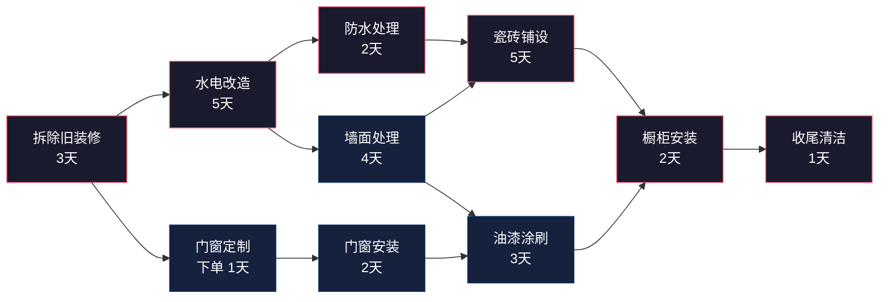
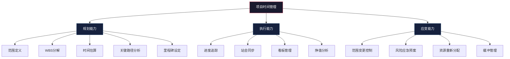

## 四、项目时间管理

日常时间管理解决的是"今天做什么、先做哪个"的问题，而项目时间管理要回答的是一个更复杂的命题——**如何在有限的时间窗口内，协调一群人、完成一系列相互依赖的任务、交付一个明确的成果**。前者是战术层面的效率优化，后者是战略层面的进度把控。

项目时间管理的核心难点不在于单个任务的执行效率，而在于**任务之间的依赖关系、资源冲突、不确定性**三者的叠加效应。一个延期的任务可能像多米诺骨牌一样推倒整条关键路径，一个资源瓶颈可能让看似充裕的时间表突然变得不可能完成。

### 4.1 项目时间管理与日常时间管理的本质区别

理解这两者的差异，是正确运用项目时间管理方法的前提。

| 维度 | 日常时间管理 | 项目时间管理 |
|------|-------------|-------------|
| **时间边界** | 循环往复，无明确终点 | 有明确的起止日期 |
| **任务性质** | 重复性高，可建立习惯 | 一次性为主，每次都有独特性 |
| **目标定义** | 持续性的方向（如"保持健康"） | 具体的交付物（如"上线新功能"） |
| **协作范围** | 以个人为主 | 通常涉及多人、多部门 |
| **失败成本** | 一天没做好，明天可以补 | 项目延期可能导致合同违约、市场窗口关闭 |
| **计划精度** | 粗略计划 + 每日调整 | 需要详细的WBS、甘特图、资源分配表 |
| **核心挑战** | 抵抗拖延、保持专注 | 协调依赖、管理风险、控制范围 |

一个常见的误区是把项目时间管理等同于"更复杂的日常时间管理"。实际上，项目时间管理引入了一整套独特的概念和工具：工作分解结构（WBS）、关键路径法（CPM）、计划评审技术（PERT）、挣值管理（EVM）、资源平衡等。这些工具解决的不是"怎么提高效率"，而是"怎么在不确定性中做可靠的进度规划和控制"。

### 4.2 项目时间管理的六大核心原则

#### 原则一：范围先行——没有清晰的范围就没有可靠的时间表

项目时间管理的第一步不是估算时间，而是定义范围。模糊的范围必然导致模糊的时间表。你需要回答以下问题：

- **这个项目要交付什么？** 用具体、可衡量的语言描述交付物，而不是"做一个好用的系统"
- **什么不算在这个项目里？** 明确排除项比明确包含项更重要——这是防止范围蔓延的第一道防线
- **验收标准是什么？** 什么情况下可以宣布"做完了"？没有验收标准，项目就没有终点

实操建议：写一页纸的项目章程（Project Charter），包含目标、交付物、排除项、约束条件、利益相关者。不需要正式模板，但必须有书面记录。这份文件是后续所有范围变更的参照基准。

#### 原则二：分解到底——WBS是项目时间管理的骨架

工作分解结构（Work Breakdown Structure, WBS）是将项目逐层分解为可管理、可估算、可分配的工作包的过程。WBS不是任务清单——它是项目的**结构化表示**，强调的是层级关系和完整性。

**WBS的分解标准：**

1. **100%原则**：每一层的子项之和必须等于父项的全部范围，不多不少
2. **可管理性**：每个最底层工作包的工作量控制在 **4-40小时** 之间。少于4小时的管理成本不划算，多于40小时的难以准确估算和追踪
3. **可交付性导向**：按交付物分解（"前端页面""后端API"），而不是按活动分解（"写代码""测试"）。前者更容易验证完成度
4. **互不重叠**：每个工作包只属于一个父项，避免职责交叉

**WBS分解示例——线上课程开发项目：**

项目：线上课程开发
├── 1. 课程设计
│   ├── 1.1 需求调研（学员画像、竞品分析）
│   ├── 1.2 课程大纲设计（知识点梳理、逻辑编排）
│   ├── 1.3 教学设计（每节课的教学策略、互动设计）
│   └── 1.4 评审与确认（内部评审、导师审核）
├── 2. 内容制作
│   ├── 2.1 脚本撰写
│   │   ├── 2.1.1 第1-5课脚本
│   │   ├── 2.1.2 第6-10课脚本
│   │   └── 2.1.3 第11-15课脚本
│   ├── 2.2 视频录制
│   ├── 2.3 后期剪辑
│   └── 2.4 配套资料制作（讲义、练习题、参考文献）
├── 3. 平台部署
│   ├── 3.1 课程页面搭建
│   ├── 3.2 视频上传与转码
│   ├── 3.3 支付与权限配置
│   └── 3.4 测试与修复
├── 4. 营销推广
│   ├── 4.1 推广文案撰写
│   ├── 4.2 社交媒体预热
│   ├── 4.3 早鸟优惠设置
│   └── 4.4 KOL合作洽谈
└── 5. 上线运营
    ├── 5.1 正式上线发布
    ├── 5.2 学员社群搭建
    ├── 5.3 首期答疑安排
    └── 5.4 数据收集与效果评估

注意这个示例中，2.1脚本撰写进一步按批次拆分——因为每批脚本可以由不同人并行撰写，这是一个值得分解的信号。如果一个工作包可以被进一步**并行化**或**分配给不同人**，就值得继续分解。

#### 原则三：估算用方法，不用感觉

"这个大概需要两周"——这是最常见的估算方式，也是最不靠谱的方式。人类天生对时间估算存在系统性偏差，心理学上称为**规划谬误（Planning Fallacy）**：人们倾向于低估任务所需时间，即使他们有过去类似任务超期的直接经验。

**四种可靠的估算方法：**

**① 三点估算法（PERT估算）**

这是最推荐的方法，通过三个时间点来捕捉不确定性：

期望时间 E = (O + 4M + P) / 6
标准差 σ = (P - O) / 6

- **O（Optimistic）**：一切顺利情况下的最短时间
- **M（Most Likely）**：最可能需要的时间
- **P（Pessimistic）**：考虑各种意外后的最长时间

举例：开发一个用户注册模块
- O = 3天（一切顺利，没有技术障碍）
- M = 5天（正常情况，有一些小问题需要解决）
- P = 12天（遇到严重技术问题，需要重构部分代码）

E = (3 + 4×5 + 12) / 6 = 35 / 6 ≈ 5.8天
σ = (12 - 3) / 6 = 1.5天

这意味着：有68%的概率在4.3-7.3天内完成，有95%的概率在2.8-8.8天内完成。如果你想达到95%的置信度，应该按9天来排期。

**② 类比估算法**

参考历史项目中类似任务的实际耗时。这要求你有记录和复盘的习惯。建立一个"任务-实际耗时"的历史数据库，哪怕只是一个简单的表格，长期积累下来就是最宝贵的估算资产。

**③ 专家判断法（Delphi法）**

当任务复杂度高、缺乏历史数据时，邀请2-3位有经验的人独立估算，然后取中位数。关键是**独立估算**——避免从众效应。如果三个人的估算差异很大（如3天、5天、15天），说明任务存在重大不确定性，需要进一步拆解或先做技术预研。

**④ 自下而上估算法**

先估算WBS最底层每个工作包的时间，然后逐层汇总。这是最耗时但最准确的方法。适用于需要高精度预算的项目。

**估算的黄金法则：**

- 永远不要只给一个数字，给一个范围（"5-8天"比"一周"靠谱得多）
- 估算要包含等待时间（审批、反馈、第三方响应）
- 第一次做的事情，估算乘以2-3倍
- 团队协作的任务，估算要包含沟通协调的开销（通常增加15-25%）

#### 原则四：识别关键路径——找到决定项目工期的瓶颈

关键路径是项目中**最长的任务链**，决定了项目的最短完成时间。关键路径上的任何任务延期，都会直接导致项目延期。而非关键路径上的任务有一定的浮动时间（slack），可以延迟而不影响项目总工期。

**关键路径的计算步骤：**

1. 列出所有任务及其依赖关系和持续时间
2. 画出网络图（任务节点 + 依赖箭头）
3. 从起点到终点，计算每条路径的总时长
4. 最长的那条路径就是关键路径

**示例——房屋装修项目的关键路径分析：**



关键路径（红色）：拆除 → 水电改造 → 防水处理 → 瓷砖铺设 → 橱柜安装 → 收尾清洁 = 3+5+2+5+2+1 = **18天**

非关键路径（蓝色）：拆除 → 门窗定制 → 门窗安装 → 油漆涂刷 → 橱柜安装 = 1+1+2+3+2 = 9天，有9天的浮动时间。

**关键路径的实战意义：**

- 关键路径上的任务要**重点监控**，任何延期都要立即处理
- 可以通过**赶工（Crashing）**压缩关键路径：增加资源缩短关键任务时间（如水电改造加一倍工人，5天→3天）
- 可以通过**快速跟进（Fast Tracking）**压缩关键路径：将串行任务改为并行（如防水处理完成80%就开始瓷砖铺设）
- 如果通过优化发现新的最长路径，它就变成了新的关键路径——这叫做**关键路径漂移**

#### 原则五：设置里程碑——进度的检查站

里程碑是项目中**重要的节点事件**，通常标记一个阶段的完成或一个关键交付物的交付。里程碑本身不占用时间（持续时间为零），但它是进度检查和决策的锚点。

**好的里程碑应该是：**

- **有明确的完成标准**："完成需求文档评审"而不是"需求阶段完成"
- **有具体的日期**：不是"第三周"，而是"3月15日"
- **有交付物**：可以被验证的成果（文档、代码、原型、报告）
- **间隔合理**：通常每1-2周一个里程碑。太频繁导致管理开销过大，太稀疏导致问题发现太晚

**里程碑的设定技巧：**

在项目的关键决策点设置里程碑——那些你可能需要调整方向、追加资源或决定是否继续的节点。例如：

- 技术方案评审通过 → 决定是否投入开发资源
- MVP原型完成 → 决定是否按原方案推进
- 测试完成 → 决定是否可以发布

每个里程碑都应该有一个明确的"通过/不通过"决策。如果里程碑只是走个形式，它就失去了价值。

#### 原则六：滚动规划——远粗近细

不要试图在项目第一天就规划到最后一天的细节。超过一个月的细节规划大概率是浪费时间，因为变化是不可避免的。

**滚动规划的节奏：**

- **近期（未来1-2周）**：详细到每个任务的具体步骤、负责人、截止时间
- **中期（未来1个月）**：详细到工作包级别，明确负责人和大致时间
- **远期（1个月以后）**：只规划到阶段/里程碑级别，保留调整空间

每个迭代（通常1-2周）结束时，回顾进度，调整下一阶段的详细计划。这就是敏捷方法中"迭代规划"的核心思想。

### 4.3 项目时间管理的完整五步法

#### 第一步：项目启动——定义阶段

这一步的目标是回答"我们到底要做什么"。很多项目的时间管理问题，根源都在于启动阶段的定义不清。

**项目启动清单：**

1. **明确目标**：用SMART原则定义项目目标
   - ❌ "做一个好的企业官网"
   - ✅ "在6月30日前上线一个支持中英双语、移动端适配、加载时间<3秒的企业官网，包含首页、产品页、关于我们、联系我们四个页面"

2. **识别利益相关者**：谁会影响这个项目？谁会被这个项目影响？谁有决策权？

3. **明确约束条件**：
   - 时间约束：硬性截止日期是什么？有没有不可更改的外部依赖？
   - 预算约束：总预算多少？分配到各阶段的比例？
   - 资源约束：有几个人可以投入？他们的可用时间比例是多少？
   - 质量约束：最低可接受的质量标准是什么？

4. **识别主要风险**：在启动阶段就能预见的最大风险是什么？

**实操模板——项目启动一页纸：**

```markdown
## 项目名称：[名称]

### 目标
[用一句话描述项目要达成的成果]

### 交付物
1. [交付物1] - [描述]
2. [交付物2] - [描述]

### 时间线
- 启动日期：[日期]
- 里程碑1：[日期] - [内容]
- 里程碑2：[日期] - [内容]
- 截止日期：[日期]

### 资源
- 项目经理：[姓名]
- 团队成员：[姓名]（可用时间 X%）
- 预算：[金额]

### 约束与排除项
- 约束：[列出]
- 不在范围内：[列出]

### 主要风险
1. [风险1] - 影响程度/应对策略
2. [风险2] - 影响程度/应对策略
```

#### 第二步：任务分解——规划阶段

将第一步定义的项目范围分解为WBS。前文已详细说明了WBS的原则和示例。这里补充一些实操要点：

**分解的粒度判断标准：**

- 一个任务应该可以**分配给一个人**负责
- 一个任务应该可以在**4-40小时**内完成
- 一个任务应该有**明确的完成标准**
- 如果你说不清楚这个任务"做完是什么样"，说明还需要继续分解

**识别任务依赖关系：**

完成WBS后，需要确定任务之间的依赖关系。有四种依赖类型：

| 依赖类型 | 含义 | 示例 |
|----------|------|------|
| **FS（完成-开始）** | A完成后B才能开始 | 水电改造完成后才能铺瓷砖 |
| **SS（开始-开始）** | A开始后B才能开始 | 设计开始后前端开发才能开始（但不需要设计全部完成） |
| **FF（完成-完成）** | A完成后B才能完成 | 测试完成后部署才能完成 |
| **SF（开始-完成）** | A开始后B才能完成 | 新系统上线后旧系统才能下线 |

FS是最常见的依赖类型（约占80%），但很多看似FS的依赖其实可以改为SS，从而实现并行、压缩工期。

#### 第三步：时间估算与排期——规划阶段

完成WBS和依赖关系后，为每个工作包估算时间，然后用**正推法和逆推法**计算每个任务的最早开始时间（ES）、最晚开始时间（LS）、最早完成时间（EF）、最晚完成时间（LF）和浮动时间。

**正推法（Forward Pass）——计算最早时间：**

从项目起点开始，沿着依赖关系依次计算：
- ES = 所有前置任务EF的最大值（如果有多条路径汇入，取最晚的那个）
- EF = ES + 持续时间

**逆推法（Backward Pass）——计算最晚时间：**

从项目终点开始，逆着依赖关系依次计算：
- LF = 所有后续任务LS的最小值
- LS = LF - 持续时间

**浮动时间 = LS - ES = LF - EF**

浮动时间为零的任务都在关键路径上。

**实际排期时的修正因素：**

理论计算完成后，还需要考虑以下现实因素进行修正：

1. **资源约束**：同一个人不能同时做两个任务（资源冲突）
2. **非工作时间**：周末、节假日、请假
3. **沟通开销**：跨团队协作的等待和协调时间
4. **审批等待**：需要上级或客户确认的节点
5. **缓冲时间**：在关键路径上为不确定性预留的时间（通常为总工期的10-20%）

#### 第四步：执行与进度追踪——执行阶段

计划做得再好，执行过程中不追踪也是白搭。进度追踪的目标是**尽早发现问题，争取调整的时间窗口**。

**进度追踪的四个层次：**

**① 每日站会（适合团队项目）**

每天固定时间（建议早上），每人回答三个问题：
1. 昨天完成了什么？
2. 今天计划做什么？
3. 遇到了什么阻碍？

时间控制在**15分钟以内**。站会不是讨论会，遇到问题只记录，会后单独讨论解决方案。

**② 看板管理（适合任务流转类项目）**

将所有任务放在看板上，分为"待办→进行中→已完成"三个区域。核心规则：
- **限制在制品数量（WIP Limit）**：每个人同时进行的任务不超过2-3个
- 任务流转可视化，一眼看出瓶颈在哪里

**③ 甘特图追踪（适合有明确时间线的项目）**

甘特图的时间线底部标注计划进度，用不同颜色标记实际进度。关键路径用红色高亮。每周更新一次，对比计划vs实际。

**④ 挣值管理（适合需要精确进度量化的项目）**

挣值管理（EVM）通过三个指标衡量项目进度和成本绩效：

| 指标 | 含义 | 计算公式 |
|------|------|----------|
| **PV（计划值）** | 到某时间点应该完成的工作量 | 按计划应完成的任务预算之和 |
| **EV（挣值）** | 到某时间点实际完成的工作量 | 已完成任务的预算之和 |
| **AC（实际成本）** | 到某时间点实际花费的成本 | 实际投入的人天×日薪 |

进度绩效指数 **SPI = EV / PV**
- SPI > 1：进度超前
- SPI = 1：进度正常
- SPI < 1：进度落后

成本绩效指数 **CPI = EV / AC**
- CPI > 1：成本节约
- CPI = 1：成本正常
- CPI < 1：成本超支

预测完工估算 **EAC = 总预算 / CPI**（假设当前效率持续）

举例：一个预算10万元的项目，计划到第4周完成40%的工作量（PV=4万），实际完成了30%（EV=3万），已花费3.5万（AC=3.5万）。

- SPI = 3/4 = 0.75 → 进度落后25%
- CPI = 3/3.5 = 0.86 → 成本超支14%
- EAC = 10/0.86 = 11.6万 → 预计总成本将超支1.6万

#### 第五步：项目复盘——收尾阶段

项目完成后进行结构化复盘，这是将经验转化为组织能力的关键环节。

**复盘四步法（联想集团经典复盘方法论）：**

1. **回顾目标**：当初设定的目标是什么？里程碑是什么？
2. **评估结果**：实际结果与目标的差距是什么？哪些超预期？哪些不达标？
3. **分析原因**：做得好的原因是什么？做得不好的原因是什么？（区分主观原因和客观原因）
4. **总结规律**：哪些经验可以固化为流程？哪些教训要在下一个项目中避免？

**项目时间管理的专项复盘问题：**

- 时间估算准确率如何？哪些任务估算偏差超过50%？原因是什么？
- 关键路径是否在执行过程中发生了变化？变化的原因是什么？
- 有哪些任务的延期是可以预防的？预防措施是什么？
- 有哪些任务的时间是浪费在等待上的？等待的原因是什么？

**将复盘成果转化为估算校准因子：**

记录每个任务的估算时间和实际时间，计算历史项目的估算准确率。例如：

任务类型        平均估算偏差    校准因子
前端开发        低估30%         × 1.3
后端开发        低估50%         × 1.5
UI设计          低估20%         × 1.2
测试            低估60%         × 1.6
文档撰写        低估10%         × 1.1

下次估算时，将初步估算乘以对应的校准因子，就能得到更接近实际的时间预测。

### 4.4 项目时间管理中的常见问题与解决方案

#### 问题一：范围蔓延（Scope Creep）

**表现**：项目进行中不断有新需求加入——"这个功能顺便加上吧""既然改了这里，那边也一起改了"——每一个单独看都很小，累积起来却让项目工期翻倍。

**根本原因**：没有明确的范围基准，或者有基准但没有变更控制流程。

**解决方案：**

1. **建立变更控制流程**：任何范围变更必须经过评估——需要多少额外时间？对关键路径有什么影响？由谁来审批？
2. **用"交换"而非"加法"应对新需求**：当客户提出新需求时，不直接拒绝，而是问"好，可以加。但我们目前的计划已经排满了，你想用哪个现有功能来换？"
3. **设置范围冻结日期**：在项目中期设置一个时间点，之后原则上不再接受新需求，除非有紧急的业务原因

#### 问题二：任务依赖导致的等待浪费

**表现**：A任务完成前B任务无法开始，A任务延期了，B任务的人只能干等。

**解决方案：**

1. **识别并减少串行依赖**：审视每一条FS依赖，问"真的必须等A全部完成才能开始B吗？"很多情况下可以改为SS依赖（A完成20%就可以启动B）
2. **为非关键路径任务安排缓冲**：利用非关键路径的浮动时间，提前安排可以做的任务
3. **建立任务交接的标准化流程**：定义好前置任务需要交付什么、后续任务才能开始，减少模糊的等待

#### 问题三：估算持续不准确

**表现**：实际时间总是超出估算，团队已经习惯了"乘以2"的心态。

**根本原因**：规划谬误——系统性地低估困难和不确定性。

**解决方案：**

1. **强制使用三点估算法**：不允许只给一个数字
2. **引入外部视角**：让不做这个任务的人参与估算，他们没有"我能搞定"的乐观偏见
3. **建立估算校准数据库**：记录估算vs实际，逐步修正校准因子
4. **为未知预留缓冲**：将总工期的15-25%作为管理储备，专门用于应对意外

#### 问题四：资源冲突——同一个人被多个项目争抢

**表现**：项目A和项目B都需要同一个开发人员在同一时间段工作，实际可用产能不足。

**解决方案：**

1. **资源负荷图**：画出每个团队成员的时间分配图，找出过载的时段
2. **任务优先级排序**：当资源冲突时，按项目优先级决定谁先占用资源
3. **错峰安排**：将不同项目的关键任务错开，避免同时抢占同一资源
4. **资源平衡**：在不影响关键路径的前提下，将非关键任务的时间调整到资源空闲时段

#### 问题五：沟通协调开销吞噬时间

**表现**：明明估算5天能完成的任务，实际花了8天——其中3天在等反馈、开会、澄清需求。

**解决方案：**

1. **估算时明确包含沟通开销**：团队协作任务在原始估算基础上增加15-25%
2. **减少异步等待**：能当面说的不要发消息，能一次说清楚的不要分三次
3. **建立决策日志**：所有决策记录在案，避免反复讨论同一个问题
4. **固定沟通节奏**：每日站会+每周例会+里程碑评审，减少临时会议

### 4.5 实战案例：三个典型项目的时间管理

#### 案例一：个人副业项目——开发一个SaaS产品

**背景**：一位程序员想利用业余时间开发一个简单的SaaS工具（客户管理系统），预计2个月上线。

**WBS分解与时间估算：**

| 阶段 | 工作包 | 三点估算（天） | 期望时间 | 校准后时间 |
|------|--------|---------------|----------|-----------|
| 设计 | 需求分析与竞品调研 | 2/3/5 | 3.2 | 4 |
| 设计 | UI/UX设计 | 3/5/10 | 5.5 | 7 |
| 开发 | 数据库设计 | 1/2/3 | 2.0 | 3 |
| 开发 | 后端API开发 | 5/10/20 | 10.8 | 16 |
| 开发 | 前端页面开发 | 5/8/15 | 8.7 | 11 |
| 开发 | 第三方集成（支付、邮件） | 2/4/8 | 4.3 | 6 |
| 测试 | 功能测试 | 2/3/5 | 3.2 | 5 |
| 测试 | 修复Bug | 2/5/10 | 5.3 | 8 |
| 部署 | 服务器部署与配置 | 1/2/4 | 2.2 | 3 |
| 上线 | 上线发布与监控 | 1/1/2 | 1.2 | 2 |

原始估算总计：46.4天 → 校准后：65天（增加40%，因为个人项目的校准因子通常较高）

**实际执行情况**：

- 前端开发比预估多花了5天（因为遇到了一个框架兼容性问题）
- 后端API在第8天遇到了一个数据库设计缺陷，花了3天重构
- 项目最终在72天完成，比校准后的估算多出7天（约11%的偏差，属于可接受范围）

**关键经验**：
- 个人项目的最大风险不是技术难度，而是**精力波动**。工作忙的时候一周只能投入5小时，闲的时候能投入20小时。排期时要按"低谷期产能"而非"高峰期产能"来估算
- 设置每周的小里程碑（如"本周完成后端认证模块"），保持持续的进展感知

#### 案例二：团队项目——市场活动策划执行

**背景**：市场部需要在6周内策划并执行一场500人规模的线下行业峰会。

**关键路径分析：**

场地确认（2天）→ 场地合同签署（3天）→ 物料设计（5天）→ 物料制作与配送（7天）→ 现场布置（1天）→ 活动执行（1天）

关键路径总时长：2+3+5+7+1+1 = **19天**

非关键路径（嘉宾邀请）：嘉宾筛选（3天）→ 邀请函发送（2天）→ 确认出席（10天等待）→ 议程安排（2天）= 17天，有2天浮动时间。

**风险管理**：
- 场地确认是关键路径的第一步，如果场地迟迟定不下来，后续全部推迟。应对：同时联系3个候选场地，设置3天的决策截止日期
- 嘉宾确认需要等待回复，10天的等待期存在不确定性。应对：准备备选嘉宾名单，如果7天内未确认就启动备选

**实际执行中的问题与处理**：

第3周发现物料设计比预期复杂（原来2天的设计工作实际用了6天），导致关键路径延迟4天。处理措施：
- 赶工：增加一名设计师，将剩余设计任务从3天压缩到1天（增加成本但保住时间线）
- 快速跟进：物料制作不等设计全部完成，先启动已完成部分的制作

最终活动按时举办，物料比原计划晚1天到场，但因为现场布置预留了缓冲时间，没有影响活动。

#### 案例三：跨部门协作项目——企业系统迁移

**背景**：公司将旧ERP系统迁移到新平台，涉及IT、财务、采购、仓储四个部门，计划周期3个月。

**这类项目的时间管理难点：**

1. **跨部门协调**：每个部门有自己的优先级和排期，很难同步推进
2. **数据迁移**：历史数据的清洗和迁移是最大的不确定性来源
3. **并行试运行**：新旧系统需要并行运行一段时间，增加人力负担
4. **培训**：每个部门的用户都需要培训，而且学习曲线不同

**解决方案：**

- **分阶段上线**：不要试图一次性迁移所有模块。先上线核心模块（如订单管理），稳定后再扩展到其他模块
- **各部门设立联络人**：每个部门指定一个项目联络人，负责本部门的需求对接和进度同步
- **数据迁移前置**：在系统开发阶段就开始数据清洗工作，不要等到开发完再做
- **滚动培训**：不要集中培训，而是在每个模块上线前1周进行针对性培训

### 4.6 项目时间管理的进阶技巧

#### 技巧一：敏捷方法中的时间管理

传统的瀑布式项目管理假设需求是稳定的，但现实中需求经常变化。敏捷方法（Scrum、Kanban）通过短迭代来应对不确定性。

**Scrum中的时间管理要素：**

- **Sprint（迭代）**：固定的时间盒，通常2周。在这个时间盒内，需求范围锁定不变
- **Sprint Planning**：在每个Sprint开始时，团队选择在这个Sprint内能完成的工作量
- **每日站会**：15分钟的进度同步
- **Sprint Review**：在Sprint结束时展示成果
- **Sprint Retrospective**：回顾过程，持续改进

**将Scrum应用于非软件项目**：

即使你不是做软件开发，也可以借鉴Scrum的时间管理思想：
- 将项目拆分为2周一个的迭代
- 每个迭代开始时选择这个迭代要完成的任务（基于团队的实际产能，不是理想产能）
- 每个迭代结束时交付可验证的成果
- 根据上个迭代的实际速度调整下个迭代的计划

#### 技巧二：缓冲管理（Critical Chain方法）

传统方法在每个任务上都加缓冲，但这些分散的缓冲很容易被消耗掉——人们倾向于"学生综合症"（deadline之前才开始做）和"帕金森定律"（工作会膨胀到填满所有可用时间）。

**关键链方法（CCPM）的做法：**

1. 在每个任务的估算中**去掉缓冲**（用50%概率的时间估算）
2. 将所有省下来的时间**集中为项目缓冲（Project Buffer）**，放在关键路径末端
3. 在非关键路径汇入关键路径的地方设置**汇入缓冲（Feeding Buffer）**
4. 管理者只关注缓冲的消耗率，而不是每个任务是否按时完成

这样做的好处是：缓冲集中在一处，管理者有更大的调度灵活性，同时避免了每个任务"浪费"分散的缓冲。

#### 技巧三：风险登记册与应急预案

项目中的意外不是"会不会发生"的问题，而是"什么时候发生"的问题。提前识别风险并准备预案，可以大幅减少意外对进度的冲击。

**风险登记册模板：**

| 风险描述 | 概率 | 影响 | 风险等级 | 应对策略 | 责任人 |
|----------|------|------|---------|----------|--------|
| 核心开发人员离职 | 低 | 极高 | 高 | 关键模块文档化，确保知识不集中于一人 | 项目经理 |
| 第三方API不稳定 | 中 | 中 | 中 | 预留2天缓冲用于故障排查，准备降级方案 | 后端负责人 |
| 客户需求变更 | 高 | 中 | 高 | 设置变更冻结期，超出范围的变更走审批流程 | 产品经理 |

每个风险的应对策略分四类：
- **规避（Avoid）**：改变计划消除风险（如放弃使用不稳定的技术栈）
- **转移（Transfer）**：将风险转嫁给第三方（如购买保险、外包高风险模块）
- **减轻（Mitigate）**：降低风险概率或影响（如增加测试覆盖、提前做技术预研）
- **接受（Accept）**：为风险预留应急储备（时间或预算）

#### 技巧四：多项目并行的时间管理

现实中很少有人只负责一个项目。当你同时参与2-3个项目时，时间管理的挑战从"如何高效完成任务"变成了"如何在多个项目间分配注意力"。

**多项目时间管理策略：**

1. **建立项目优先级矩阵**：不是所有项目都同等重要。用以下标准评估：
   - 战略重要性（对公司/个人的影响）
   - 紧迫程度（截止日期）
   - 资源投入（已投入的沉没成本）

2. **时间分块法**：将一天分为几个时间段，每个时间段专注于一个项目。例如：
   - 上午（9:00-12:00）：项目A
   - 下午（13:30-17:00）：项目B
   - 晚上（20:00-21:30）：项目C
   
   关键是**不要频繁切换**——每次切换项目需要15-30分钟才能进入状态（上下文切换成本）

3. **统一管理所有项目的任务**：不要用5个不同的工具管理5个项目的任务。用一个统一的任务管理系统，按优先级排序所有项目的任务

4. **设置"不可侵犯时间"**：每天保留2-3小时的深度工作时间，不做任何会议和沟通，专注处理最重要项目的最关键任务

### 4.7 项目时间管理工具选择

选择合适的工具可以大幅提升项目时间管理的效率。以下是按场景推荐的工具：

**个人/小团队项目（2-5人）：**

| 工具 | 优势 | 劣势 | 适用场景 |
|------|------|------|----------|
| **Notion** | 灵活的自定义数据库、看板、日历 | 缺少原生甘特图 | 个人项目管理、知识库+项目管理一体化 |
| **Linear** | 极简的UI、快捷操作、自动化 | 功能相对精简 | 小团队的产品开发项目 |
| **GitHub Projects** | 与代码仓库深度集成 | 功能较基础 | 开源项目、开发团队 |
| **滴答清单** | 中文支持好、跨平台、清单+日历 | 高级功能需付费 | 个人时间管理+项目管理 |

**团队/企业项目（5-50人）：**

| 工具 | 优势 | 劣势 | 适用场景 |
|------|------|------|----------|
| **飞书项目** | 与飞书深度集成、中文体验好 | 国际化支持弱 | 国内团队的项目管理 |
| **Jira** | 功能强大、插件丰富、支持复杂工作流 | 学习曲线陡峭、配置复杂 | 大型团队的敏捷开发项目 |
| **Asana** | 界面友好、多种视图（列表/看板/时间线/日历） | 中文支持一般 | 跨职能团队协作 |
| **Monday.com** | 可视化强、模板丰富 | 价格较高 | 营销、运营类项目 |

**工具选择的核心原则：**

- **团队越大，工具越需要结构化**：2人团队用Notion就够了，20人团队需要Jira或飞书项目
- **选择团队已经在用或容易上手的工具**：最好的工具是团队真正会用的工具
- **不要追求工具的大而全**：用到80%的功能就够了，追求100%往往意味着过度配置

### 4.8 本节总结

项目时间管理是一个系统工程，核心能力可以归纳为以下框架：



**关键要点回顾：**

1. **范围先行**：没有清晰的范围就没有可靠的时间表
2. **分解到底**：WBS是所有后续工作的基础，工作包控制在4-40小时
3. **估算用方法**：三点估算法+校准因子，不要凭感觉
4. **抓住关键路径**：集中资源和注意力在决定项目工期的任务上
5. **滚动规划**：远粗近细，不要试图规划到最后一天的细节
6. **进度可视化**：看板、甘特图、挣值指标，让进度一目了然
7. **复盘积累**：记录估算vs实际，持续提高估算准确率

项目时间管理的终极目标不是"按时完成"，而是**在不确定性中建立可控性**——即使发生了意外，你也有足够的信息和灵活性来做出调整，而不是被动地等待延期发生。
