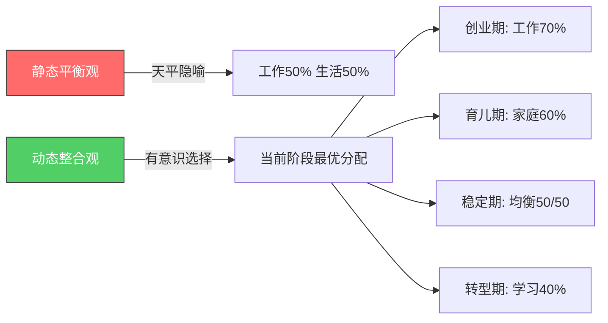
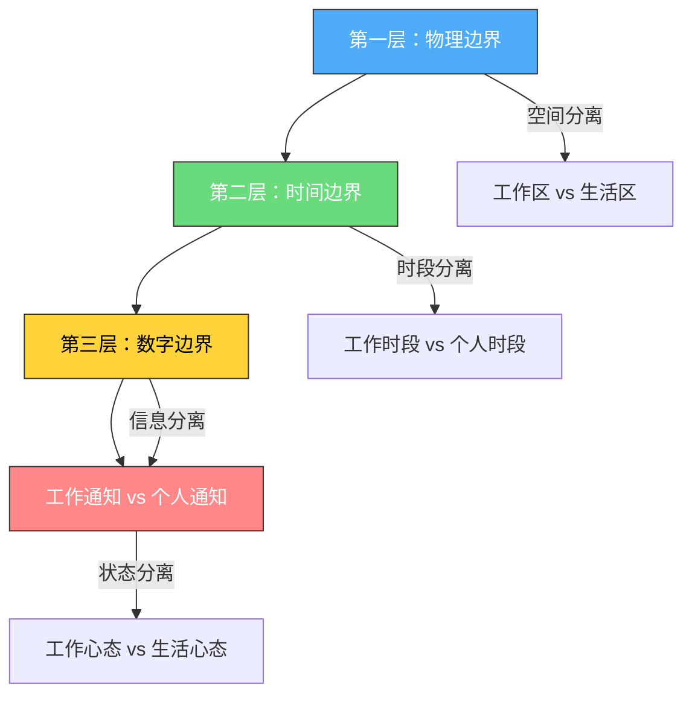
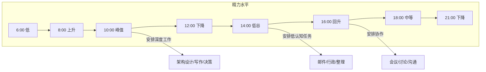

## 五、工作与生活平衡

### 5.1 重新定义"平衡"——从静态分配到动态整合

"工作与生活平衡"（Work-Life Balance）是职场讨论中最常被提及却最少被正确理解的概念之一。大多数人对"平衡"的直觉想象是一台天平——左边放工作，右边放生活，两边等重才算平衡。这个隐像既不准确，也极具误导性。

**为什么"50/50"是错误的心智模型？**

首先，时间是零和博弈——你花在工作上的每一小时，都是从生活中"偷"来的，反之亦然。如果平衡意味着严格的时间均分，那么一个每天工作8小时、通勤2小时的人，只剩下14小时分配给睡眠、家务、育儿、社交、学习和自我关怀。这在数学上就不可能达到"均衡"。

其次，不同人生阶段的最优分配比例天然不同。一个25岁正在建立职业基础的单身人士，和一个40岁有两个学龄孩子的中层管理者，对"理想比例"的定义截然不同。用同一个静态标准衡量所有人，是刻舟求剑。

**更准确的定义：工作与生活整合（Work-Life Integration）**

当代组织心理学更倾向于使用"工作与生活整合"这一概念。其核心含义是：

> 在你当前的人生阶段，有意识地分配注意力和精力，使得工作和个人生活两个领域都能获得足够的投入，并且你对这种分配方式感到满意和可持续。

这个定义包含三个关键要素：

1. **有意识（Intentional）**：不是被动地被工作推着走，而是主动选择如何分配时间
2. **足够投入（Sufficient）**：不是追求完美的均分，而是两个领域都不被严重忽视
3. **可持续（Sustainable）**：不是短期冲刺的临时安排，而是能长期维持的状态



**四个支撑原则：**

**原则一：平衡是动态过程，不是静态状态。** 就像骑自行车——平衡不是静止不动，而是在不断微调中保持前进。某一周加班赶项目，下一周补偿性地陪家人度假，这仍然是平衡的。真正失衡的是连续数月无暇顾及生活，且并非出于自主选择。

**原则二：质量重于数量。** 心理学家Mihaly Csikszentmihalyi的研究表明，一个人的幸福感与其"心流体验"的频率高度相关，而与总休闲时间无显著相关。一个每天高质量陪伴孩子2小时的父亲，比一个心不在焉地陪孩子5小时的父亲，对亲子关系的贡献更大。同理，2小时的深度工作产出，可能超过8小时的碎片化忙碌。

**原则三：边界是核心机制。** 没有边界，工作会像水一样填满你生活的所有缝隙。远程办公时代尤其如此——当家就是办公室，办公室就是家，边界感的丧失是工作-生活冲突的首要来源。

**原则四：自我关怀是前提条件。** 航空安全提示"先给自己戴好氧气面罩，再帮助他人"同样适用于生活。如果你的身心健康已经透支，你既无法高效工作，也无法为家人提供高质量的陪伴。

### 5.2 科学研究告诉我们什么

工作与生活平衡不是一个"软性"话题——它有大量严谨的实证研究支撑。了解这些研究结论，能帮助你做出更明智的决策。

**Spillover Theory（溢出理论）**

这是工作-家庭研究中最基础的理论。它指出，一个人在一个角色中的体验会"溢出"到另一个角色中：

- **正向溢出**：工作中的成就感和自信，会让你在家庭中更有耐心和活力
- **负向溢出**：工作中的压力和挫败，会让你在家中变得易怒和疏离

密歇根大学的研究发现，工作压力的负向溢出效应比正向溢出效应更强——也就是说，坏的工作体验对家庭的伤害，大于好的工作体验对家庭的帮助。这意味着，仅仅追求"工作顺利"不足以保证生活质量，还需要主动建立防止负向溢出的机制。

**Boundary Theory（边界理论）**

Nippert-Eng（1996）提出的边界理论认为，人们通过在工作和生活之间建立"边界"来管理两个领域的冲突。边界分为两种：

| 边界类型 | 特征 | 典型表现 | 适合人群 |
|---------|------|---------|---------|
| **整合者（Integrator）** | 工作和生活边界模糊 | 工作时间处理私事，休息时间处理工作 | 创业者、自由职业者、高管 |
| **分割者（Segmenter）** | 工作和生活边界清晰 | 下班后不看工作消息，工作时不谈私事 | 公务员、教师、需要高度专注的专业人士 |

研究表明，没有哪种类型"更好"——关键是**你选择的边界策略与你的偏好和环境是否匹配**。一个天生的分割者被迫做整合者（或反之），会产生极大的心理压力。

**资源保存理论（Conservation of Resources Theory）**

Hobfoll（1989）提出，人的心理资源（精力、注意力、情绪调节能力）是有限的。当资源持续消耗而得不到补充时，就会产生倦怠。这个理论解释了为什么：

- 单纯减少工作时间不足以解决失衡问题——如果工作时间内精力消耗极大，即使时间缩短也会倦怠
- 主动补充资源（运动、社交、兴趣爱好）比被动休息（刷手机、看剧）更有效
- 资源的"损失螺旋"：资源越少→应对能力越差→损失更多资源→恶性循环

**关键实证数据：**

- 世界卫生组织（WHO）2021年报告：每周工作55小时以上，中风风险增加35%，缺血性心脏病风险增加17%
- 盖洛普（Gallup）2023年调查：完全远程工作者中，27%报告工作与生活边界严重模糊
- 哈佛商学院研究：高管在工作日平均每天查看邮件74次，每次从邮件切换回深度工作需要23分钟
- 《柳叶刀》2015年荟萃分析：适度工作（每周35-40小时）的人群幸福感和健康指标最优

### 5.3 建立工作与生活的四层边界系统

边界不是一条线，而是一个多层防御系统。每一层都有其独特的功能，四层协同工作才能有效保护你的生活质量。



#### 5.3.1 第一层：物理边界——用空间定义角色

物理环境是最强大的行为触发器。人类大脑高度依赖环境线索来切换心理状态——这就是为什么你在图书馆自然会安静，在酒吧自然会放松。

**在家办公的物理边界设计：**

| 方案 | 投入 | 效果 | 适用条件 |
|------|------|------|---------|
| 独立书房 | 高 | 最佳 | 有多余房间 |
| 客厅/卧室分区 | 中 | 良好 | 空间有限，用屏风/书架隔断 |
| 桌面区域标记 | 低 | 尚可 | 仅一张桌子，用不同颜色灯/桌布区分 |
| 咖啡馆/共享办公 | 中 | 良好 | 家中无法隔离工作区 |

**具体操作：**

1. **如果有一间独立房间**：在门口挂一个"工作中/已下班"的牌子（物理信号比电子信号更有效，因为它对家人也可见）
2. **如果在客厅角落工作**：下班后用一块布盖住电脑和显示器——这个简单的仪式感极强，研究显示"遮盖工作物品"的行为能显著降低工作相关的侵入性思维
3. **如果只能在卧室工作**：绝对不在床上工作（大脑会将"床"与"清醒工作"关联，导致失眠）。使用可折叠的站立式办公桌，下班后折叠收纳
4. **通勤作为物理边界**：如果你在办公室工作，通勤实际上是天然的"角色转换缓冲"。远程工作者可以模拟通勤——出门走15分钟再"开始工作"，下班后同样走15分钟再"回家"

#### 5.3.2 第二层：时间边界——用时段定义角色

时间边界的核心不是"工作多少小时"，而是"在哪些时段工作"以及"何时停止"。

**设定不可侵犯的时间块：**

工作日时间结构示例：

06:30-07:30  个人时间（运动/阅读/冥想）
07:30-08:30  家庭时间（早餐/送孩子）
08:30-12:00  深度工作时段（不安排会议）
12:00-13:00  午休（不工作）
13:00-17:00  协作工作时段（会议/沟通/行政）
17:00-17:30  日回顾 + 明日计划
17:30-18:30  通勤/模拟通勤
18:30-20:30  家庭时间（晚餐/陪孩子）
20:30-22:00  个人时间（兴趣/学习/社交）
22:00-22:30  睡前准备
22:30        就寝

**下班仪式（Shutdown Ritual）：**

Cal Newport在其著作《深度工作》中提出的下班仪式，被证明能有效帮助大脑从"工作模式"切换到"生活模式"。完整仪式如下：

1. **回顾今日完成**（2分钟）：快速浏览今天的任务清单，勾选已完成项
2. **检查待办清单**（3分钟）：确认没有遗漏的紧急事项
3. **制定明日计划**（3分钟）：在纸上写下明天最重要的三件事
4. **说出固定短语**（1秒）：如"今天的工作结束了"——听起来简单，但语言的仪式感能触发心理状态转换
5. **关闭所有工作相关设备**（1分钟）：合上笔记本、关闭工作手机

整个仪式约10分钟，但研究表明，坚持执行这一仪式的人，晚间的侵入性工作思维减少了约40%。

**周末边界：**

- **最低标准**：每周至少保留一整天完全不工作
- **理想标准**：周六全天 + 周日晚上不工作
- **紧急例外**：提前设定"什么算紧急"的标准（如：生产环境故障、客户投诉升级），而不是凭感觉判断

#### 5.3.3 第三层：数字边界——用通知定义注意力

数字设备是工作侵入生活最隐蔽的渠道。一封深夜的邮件、一条周末的Slack消息，都可能将你瞬间拉回工作心态。

**具体策略：**

**手机层面：**
- 使用iOS"专注模式"或Android"数字健康"功能，设置"个人时间"配置文件
- 在个人时间模式下，只允许家人和亲密朋友的通知通过
- 工作相关的APP（邮件、Slack、钉钉、飞书）在18:00后自动静默
- 将工作邮件APP放在手机第二屏或文件夹深处——增加打开它的"摩擦成本"

**电脑层面：**
- 如果只有一台电脑，创建两个用户账户："工作"和"个人"
- 工作账户只安装工作相关软件，个人账户只安装娱乐和学习软件
- 使用浏览器的多Profile功能：工作Profile登录公司系统，个人Profile登录个人账号

**通知管理矩阵：**

| 通知类型 | 工作时段 | 非工作时段 | 处理方式 |
|---------|---------|-----------|---------|
| 直属上级消息 | 即时 | 延迟（1小时内检查） | 设定检查窗口 |
| 同事协作消息 | 批量处理 | 静默 | 每2小时集中处理 |
| 客户邮件 | 每2小时检查 | 静默 | 设置自动回复 |
| 系统告警 | 即时 | 仅紧急告警 | 区分告警级别 |
| 社交媒体 | 静默 | 自由时间 | 工作时段完全屏蔽 |

**"第二台手机"策略：** 如果经济条件允许，准备两部手机——一部只装工作APP，一部只装个人APP。下班后将工作手机放在固定位置（如玄关抽屉），不再随身携带。这比任何软件设置都有效，因为物理隔离是最强的边界。

#### 5.3.4 第四层：心理边界——用仪式定义状态

物理、时间和数字边界是外在的"硬"边界，心理边界是内在的"软"边界。即使外在边界完美，如果大脑无法"放下"工作，你仍然处于失衡状态。

**工作反刍（Work Rumination）：** 这是心理边界的最大敌人。它指的是下班后反复思考工作中的问题、未完成的任务、明天的挑战。伦敦大学的研究发现，42%的白领在非工作时间仍频繁思考工作事务，而这些人报告的工作满意度和生活满意度都显著低于平均水平。

**对抗工作反刍的实操方法：**

**方法一：担忧笔记本（Worry Journal）**

当工作念头在非工作时间侵入时，不要试图"压制"它（压制往往适得其反），而是快速写下来：

担忧笔记本格式：

日期：________
时间：________
侵入的想法：________________________________
这个想法需要我现在处理吗？
  □ 是 → 打开工作设备处理（限制15分钟）
  □ 否 → 写下"明天__点处理"，合上笔记本

研究表明，仅仅是"把想法写下来"这个动作，就能将侵入性思维的频率降低约30%。因为大脑知道这个想法已经被"安全存储"，不再需要反复提醒你。

**方法二：状态转换缓冲（Transition Buffer）**

在工作和生活之间插入一个15-30分钟的"缓冲区"，专门用于状态转换：

- **运动缓冲**：下班后立即进行30分钟中等强度运动（跑步、游泳、力量训练）。运动能消耗压力激素皮质醇，同时释放内啡肽，是最快的状态转换方式
- **音乐缓冲**：在通勤路上听一个固定的播放列表，用音乐作为"切换开关"
- **自然缓冲**：下班后散步15分钟，专注于观察周围的自然环境（树木、天空、鸟鸣），将注意力从内在思维转移到外部感官
- **社交缓冲**：回家后先和家人聊5分钟"今天有什么开心的事"，用积极的社交互动取代工作思维

**方法三：角色锚定（Role Anchoring）**

在进入"生活角色"之前，给自己一个明确的角色提示：

- 进家门前，心里默念"现在我是爸爸/妈妈/伴侣"
- 打开家门的瞬间，深呼吸一次，然后带着微笑进入
- 如果心情不好，可以在车里多坐2分钟，用手机看一张家人的照片

这些看起来"做作"的行为，实际上是基于认知行为疗法（CBT）中的"情境激活"技术——通过外部行为暗示来激活对应的内在心理状态。

### 5.4 高效平衡的六大实战策略

理论和原则是基础，但从"知道"到"做到"之间还需要具体的执行策略。以下六个策略经过大量实践验证，适用于大多数职场人士。

#### 策略一：时间块隔离法——在日历上画出生活

**核心原理：** 如果你不在日历上安排个人时间，工作就会自动填满所有空隙。日历上的空白不是"自由时间"，而是"等待被工作吞噬的时间"。

**具体操作：**

1. 在你的日历工具（Google Calendar、Outlook等）中，用不同颜色区分四种时间块：
   - 🔴 红色：不可侵犯的个人/家庭时间
   - 🔵 蓝色：深度工作时间
   - 🟢 绿色：会议和协作时间
   - 🟡 黄色：行政事务和邮件处理时间

2. 先安排红色时间块（逆向规划）：
   - 每周固定的家庭活动（如周六上午亲子时间）
   - 每天的运动时间
   - 每天的个人学习/阅读时间
   - 定期的社交活动

3. 然后安排蓝色时间块（深度工作）
4. 最后在剩余时间安排绿色和黄色

4. 将红色时间块设为"忙碌"状态，不允许其他人在此时段安排会议

**关键原则：像保护CEO会议一样保护你的个人时间。** 你不会接受别人在你和CEO开会时插入一个会议，那为什么要接受别人在你的家庭时间插入工作？

#### 策略二：批量处理法——消灭时间碎片

**核心原理：** 任务切换有隐性成本。加州大学尔湾分校的研究发现，被打断后平均需要23分15秒才能完全恢复到之前的专注状态。将同类任务批量处理，能显著减少切换成本。

**适合批量处理的任务：**

| 任务类型 | 批量方式 | 建议频率 |
|---------|---------|---------|
| 邮件/消息 | 每天集中3次处理 | 早/午/晚各一次 |
| 家务 | 集中在周末半天 | 每周一次 |
| 购物 | 列清单，一次采购 | 每周一次 |
| 社交回复 | 集中时间回复微信/QQ | 每天1-2次 |
| 行政事务（报销、签字等） | 集中在每周固定时段 | 每周一次 |
| 孩子的作业辅导 | 固定时间段 | 每天同一时段 |

**反面案例：** 小王是产品经理，他的典型一天是这样的——9:00到公司，先回复10封邮件，然后被同事拉去讨论一个问题，回来后写了20分钟PRD又被Slack消息打断，下午开了3个会，晚上加班写文档。他一天工作了11小时，但深度工作时间不足2小时。

**正面案例：** 小王改进后——8:30-10:30关闭所有通知，专注写PRD（深度工作），10:30-11:00集中回复邮件和消息，11:00-12:00处理会议和讨论，下午开会和协作，17:00-17:30做日回顾。他一天工作9小时，深度工作时间达到4小时，且准时下班。

#### 策略三：能量管理法——在对的时间做对的事

**核心原理：** 不是所有时间都是等价的。你的精力在一天中呈波动曲线，将高价值任务安排在精力高峰期，将低价值任务安排在精力低谷期，同样的时间投入可以产出截然不同的结果。

**典型精力曲线：**



**操作步骤：**

1. **识别你的精力曲线**：连续一周，在每个整点（0-23点）记录你的精力水平（1-10分），找出你的个人模式
2. **匹配任务类型**：
   - 精力高峰期（通常在上午9-11点）：深度工作、创造性任务、重要决策
   - 精力中等期：会议、协作、讨论
   - 精力低谷期（通常在下午1-3点）：行政事务、邮件、整理、学习
3. **保护高峰期**：将精力高峰期设为"神圣不可侵犯"的深度工作时间，不允许会议和打扰

#### 策略四：优先级对齐法——让时间分配匹配价值观

**核心原理：** 时间是最诚实的投票——你怎么花时间，就说明你真正在乎什么。如果你说"家庭最重要"，但一周70小时花在工作上、陪家人不到5小时，那你的行为在说"工作最重要"。

**月度价值观审计：**

步骤一：写下你最重要的5个价值观（排序）
  1. _______________
  2. _______________
  3. _______________
  4. _______________
  5. _______________

步骤二：记录过去一周的时间分配
  工作：___小时  占比：___%
  家庭：___小时  占比：___%
  健康：___小时  占比：___%
  学习：___小时  占比：___%
  社交：___小时  占比：___%
  其他：___小时  占比：___%

步骤三：对比分析
  排名第一的价值观，时间分配排第几？
  时间分配最多的事情，价值观排第几？

步骤四：制定调整计划
  需要增加时间的领域：___________________
  需要减少时间的领域：___________________
  具体调整措施：_________________________

**案例：** 32岁的软件工程师小陈，在审计后发现：他声称"健康"是第一价值观，但一周运动时间不足1小时，而刷短视频的时间超过10小时。他制定了调整计划：每天早起30分钟运动，将短视频时间限制在每天30分钟。三个月后，他的体重下降了5公斤，精力水平明显改善。

#### 策略五：角色转换法——在不同身份间优雅切换

**核心原理：** 现代人每天需要在多个角色间切换——员工、管理者、父母、伴侣、朋友、子女。角色切换不是瞬间完成的，需要一个"转换缓冲"来帮助大脑完成切换。

**角色转换矩阵：**

| 从 → 到 | 转换时间 | 推荐缓冲活动 |
|---------|---------|-------------|
| 员工 → 父母 | 15-30分钟 | 通勤听音乐、楼下散步、换衣服 |
| 父母 → 伴侣 | 30-60分钟 | 孩子睡后独处时间、一起喝茶聊天 |
| 工作日 → 周末 | 1-2小时 | 周五晚上的放松仪式 |
| 休闲 → 工作 | 10-15分钟 | 周日晚上的计划时间 |
| 高压力 → 低压力 | 20-30分钟 | 运动、冥想、热水澡 |

**具体案例：**

**场景一：从"打工人"切换为"家长"**

张经理每天6点下班，到家6点半。以前他一进门，5岁的女儿就扑上来要他陪玩，但他满脑子还是白天的会议内容，心不在焉地陪了半小时后开始看手机，女儿不高兴，妻子也抱怨。

改进方案：张经理在楼下停车场多坐10分钟，用这10分钟做三件事——(1)深呼吸5次，(2)回忆今天一件开心的事，(3)想想今晚要和女儿玩什么。10分钟后，他带着清晰的"爸爸模式"走进家门，全情投入陪伴。女儿感受到了区别，亲子关系明显改善。

**场景二：从"家长"切换为"个人"**

李老师是两个孩子的妈妈，每天从早到晚都在"教师"和"妈妈"两个角色间切换，几乎没有属于自己的时间。她的解决方案是：每晚9:30孩子入睡后，她有30分钟的"个人时间"——泡一杯花茶，听喜欢的播客，或者看10页小说。这30分钟是她一天中最期待的时光，也是她保持心理健康的关键。

#### 策略六：极简承诺法——学会有策略地说"不"

**核心原理：** 工作与生活失衡的首要原因不是"时间管理不好"，而是"承诺太多"。每一个"好的"都是对已有承诺的一次稀释。Greg McKeown在《Essentialism》中指出：如果你不是主动对少数重要的事情说"是"，你就是被动地对所有事情说"是"。

**说"不"的框架：**

当收到一个新的请求时，用以下决策树判断：

这个请求与我最重要的3个目标相关吗？
├── 否 → 礼貌拒绝
│   措辞："感谢你的信任，但我目前的优先事项无法兼顾这件事。
│          我建议你可以找XX，他在这方面比我更擅长。"
└── 是 → 我是做这件事的最佳人选吗？
    ├── 否 → 推荐更合适的人
    └── 是 → 我现在有带宽承接吗？
        ├── 否 → 能否延期到下个月？
        │   ├── 能 → 接受，但明确时间
        │   └── 不能 → 礼貌拒绝
        └── 是 → 接受

**缓冲话术：** 当你不确定是否要接受时，不要当场回答。使用以下话术给自己争取思考时间：

- "让我看看日程，明天回复你"
- "这个事情我需要想一下，下午给你答复"
- "我需要和家人确认一下时间安排"

**"积极拒绝"的模板：**

| 场景 | 话术 |
|------|------|
| 同事请你帮忙但你很忙 | "我很想帮忙，但今天我的任务已经排满了。如果你下周还需要，我可以抽时间" |
| 领导安排额外工作 | "这个任务很重要，我想确认一下优先级。如果接受这个，A项目可能需要延后，你觉得怎么安排比较合适？" |
| 朋友邀请但你想休息 | "谢谢邀请！这周工作太累了，我需要休息一下。下次活动记得叫我" |
| 亲戚请求帮忙 | "我现在确实忙不过来，但我可以帮你想想有没有其他解决方案" |

### 5.5 特殊场景的平衡方案

#### 5.5.1 远程办公者的工作-生活平衡

远程办公看似自由，实则对边界管理的要求更高。没有了通勤的物理隔离、没有了办公室的空间隔离，工作很容易侵入生活的每一个角落。

**远程办公者的四条军规：**

1. **模拟通勤**：每天早晚各出门步行15分钟，用这段时间完成心理状态切换
2. **穿着仪式**：不要穿着睡衣工作。至少换上"休闲正装"——这个简单的动作能帮助大脑区分"在家"和"在工作"
3. **午餐离开工作区**：绝对不要在办公桌前吃午饭。走到厨房或客厅，专注于食物本身
4. **准时"下班"**：设定闹钟，到点就关闭电脑。远程工作者的平均工作时间比办公室工作者多2.5小时，主要原因是"没有明确的下班信号"

#### 5.5.2 创业者/管理者的工作-生活平衡

创业者和管理者面临的独特挑战是：他们的工作往往没有明确的边界——客户随时可能打电话，团队随时可能需要决策，市场随时可能变化。

**务实策略：**

1. **"值班制"而非"全天在线"**：和团队约定"核心协作时段"（如10:00-17:00），其他时间仅处理真正紧急的事项
2. **授权和系统化**：将可替代性高的工作授权给团队或系统化，减少"只有你能做"的事情数量
3. **设定"最低家庭时间"**：无论多忙，每周至少保证一个完整的家庭日晚餐、一次亲子活动
4. **年度平衡审计**：每季度花1小时回顾过去三个月的时间分配，评估是否在可控范围内

#### 5.5.3 有孩子的双职工家庭

双职工+孩子的家庭，时间是最稀缺的资源。两个人都在工作，孩子需要照顾，家务需要处理，个人时间几乎为零。

**系统化解决方案：**

**家务分工矩阵：**

| 家务类型 | 频率 | 负责人 | 备选方案 |
|---------|------|-------|---------|
| 做饭 | 每天 | 轮流（单双日） | 预制菜/外卖（周末） |
| 洗碗 | 每天 | 非做饭方 | 洗碗机 |
| 扫地拖地 | 每周2次 | 一方固定 | 扫地机器人 |
| 洗衣 | 每周3次 | 一方固定 | 洗衣机定时功能 |
| 采购 | 每周1次 | 一方固定 | 线上买菜 |
| 孩子接送 | 每天 | 轮流/协商 | 托管/老人协助 |
| 孩子辅导 | 每天 | 按学科分工 | 在线课程辅助 |

**关键原则：**
- 每个家庭成员（包括孩子）都应承担力所能及的家务
- 用系统和工具替代人力（扫地机器人、洗碗机、预制菜不是"偷懒"，是"聪明"）
- 每周留出至少2小时的"二人世界"时间（即使只是在孩子睡后一起看一集电视剧）

### 5.6 避免职业倦怠——失衡的极端后果

职业倦怠（Burnout）不是"太累了"那么简单。世界卫生组织在2019年将职业倦怠纳入《国际疾病分类》（ICD-11），定义为"由于长期的工作场所压力未被成功管理而导致的综合征"。

#### 5.6.1 倦怠的三个核心维度

| 维度 | 症状 | 自评问题 |
|------|------|---------|
| **情感耗竭** | 精力枯竭、疲惫不堪、感觉被掏空 | "每天早上想到要上班，感觉如何？" |
| **去人格化** | 对工作冷漠、对同事疏离、愤世嫉俗 | "你是否经常对同事或客户感到不耐烦？" |
| **成就感降低** | 感觉工作无意义、能力不足、效率低下 | "你是否怀疑自己工作的价值？" |

**Maslach倦怠量表（MBI）简化自评：**

对以下1-7分评分（1=从不，7=每天）：

1. 下班后感觉被彻底掏空
2. 早上不想去上班
3. 对工作中的人感到冷漠
4. 感觉工作让我疲惫不堪
5. 感觉自己的工作没有价值

**评分解读：**
- 5-15分：正常范围
- 16-25分：轻度倦怠风险，需要关注
- 26-35分：中度倦怠，需要主动干预
- 36分以上：重度倦怠，强烈建议寻求专业帮助

#### 5.6.2 倦怠的发展阶段


1. **蜜月期**：新工作/新项目初期，热情高涨，精力充沛，愿意额外付出
2. **压力开始**：热情逐渐消退，开始感受到工作压力，但仍有动力
3. **慢性压力**：压力持续积累，出现睡眠问题、焦虑、身体不适等症状
4. **倦怠**：精力枯竭、对工作冷漠、怀疑自我价值，日常功能受损
5. **习惯性倦怠**：倦怠成为常态，出现抑郁、慢性疾病等严重后果

#### 5.6.3 预防和干预策略

**预防层面（日常习惯）：**

1. **能量审计**：每周花15分钟，列出让你"充电"和"耗电"的活动/人，然后增加充电项、减少耗电项
2. **微恢复（Micro-Recovery）**：工作间隙插入5分钟的恢复活动——站起来伸展、喝杯水、窗外远眺、做3次深呼吸
3. **社交支持**：至少有2-3个可以倾诉工作烦恼的"安全对象"——可以是朋友、伴侣、家人或同事
4. **运动**：每周至少150分钟中等强度运动。运动是对抗倦怠最有效的单一干预手段，其效果可与抗抑郁药物相当
5. **睡眠**：保证每晚7-8小时高质量睡眠。睡眠不足会显著降低情绪调节能力和压力耐受力

**干预层面（出现症状后）：**

1. **暂停和评估**：如果可能，请1-2周假，从"应急模式"中抽离出来，客观评估自己的状态
2. **与上级沟通**：坦诚地与直属上级讨论工作负荷问题，提出具体的调整建议（如减少项目数量、调整职责范围）
3. **专业帮助**：如果自我调节无效，寻求心理咨询师的帮助。认知行为疗法（CBT）对职业倦怠有显著疗效
4. **环境改变**：如果问题根源在于组织文化（如加班文化、有毒管理），考虑换岗或换公司。有时候，最好的"平衡策略"是离开一个不健康的工作环境

### 5.7 常见误区与纠正

| 误区 | 真相 | 纠正方法 |
|------|------|---------|
| "平衡意味着工作和生活各占50%时间" | 平衡是动态的，不同阶段比例不同 | 用"满意度"而非"时间比例"衡量平衡 |
| "远程办公=更好的平衡" | 远程办公对边界管理要求更高 | 主动建立物理/时间/数字边界 |
| "减少工作时间就能解决失衡" | 工作质量比数量更重要 | 关注精力管理和深度工作 |
| "休息就是刷手机/看剧" | 被动休息的恢复效果远不如主动恢复 | 运动、社交、自然活动、冥想 |
| "忙碌=有价值" | 忙碌可能只是低效的表现 | 用产出衡量价值，而非工作时长 |
| "说'不'会影响职业发展" | 过度承诺导致质量下降才真正影响发展 | 有策略地说"不"，专注于高价值任务 |
| "等忙完这一阵就好了" | "这一阵"永远不会结束 | 现在就开始建立边界，不要等待 |
| "周末加班说明我敬业" | 长期周末加班是效率低或负荷过重的信号 | 分析原因，从根本上解决问题 |

### 5.8 工具与模板

#### 5.8.1 周平衡检视模板

```markdown
# 第___周 平衡检视

## 时间分配
| 领域 | 计划时间 | 实际时间 | 满意度(1-10) |
|------|---------|---------|-------------|
| 深度工作 | | | |
| 会议协作 | | | |
| 家庭时间 | | | |
| 个人健康 | | | |
| 学习成长 | | | |
| 社交娱乐 | | | |

## 本周亮点
- 工作：_______________________________
- 生活：_______________________________

## 本周遗憾
- ___________________________________

## 下周调整
- ___________________________________

## 能量水平（本周平均 1-10）：___
```

#### 5.8.2 推荐工具

| 工具 | 类型 | 用途 | 平台 |
|------|------|------|------|
| Google Calendar | 日历 | 时间块规划 | 全平台 |
| Toggl Track | 时间追踪 | 了解真实时间分配 | 全平台 |
| Forest | 专注 | 保持专注、减少手机使用 | iOS/Android |
| Headspace | 冥想 | 心理状态切换 | iOS/Android |
| Todoist | 任务管理 | 工作任务管理 | 全平台 |
| Screen Time / Digital Wellbeing | 通知管理 | 设置数字边界 | iOS / Android |

### 5.9 进阶：从个人平衡到团队平衡文化

如果你是管理者，你不仅要管理自己的工作-生活平衡，还要为团队创造一个支持平衡的环境。这是因为：管理者的言行对团队文化有决定性影响——如果你自己深夜发邮件、周末加班，你的团队成员即使没有被要求，也会感到"应该"也这样做。

**管理者可以做的事：**

1. **以身作则**：准时下班、周末不发工作消息、休假时不查看工作邮件
2. **设定规范**：明确规定"非紧急事项不在非工作时间联系团队成员"
3. **结果导向**：用产出而非工时衡量团队成员的表现
4. **保护团队时间**：减少不必要的会议，拒绝不合理的需求
5. **鼓励休假**：主动关心团队成员的休假情况，确保每个人都得到充分休息
6. **心理安全**：创造一个团队成员可以坦诚讨论工作负荷问题的环境

### 5.10 本节小结

工作与生活平衡不是一个目的地，而是一段持续的旅程。它不需要你做出戏剧性的改变——微小的、持续的调整就足够了。

**核心要点回顾：**

1. **重新定义平衡**：从"时间均分"转向"有意识的动态整合"
2. **建立四层边界**：物理边界、时间边界、数字边界、心理边界，层层递进
3. **六大实战策略**：时间块隔离、批量处理、能量管理、优先级对齐、角色转换、极简承诺
4. **预防倦怠**：通过能量审计、微恢复、运动、社交支持等手段维持可持续状态
5. **管理者的责任**：以身作则，为团队创造支持平衡的文化

**下一步行动：**

1. 今天：完成一次"价值观审计"，检查你的时间分配是否与价值观一致
2. 本周：建立一个"下班仪式"，并坚持执行一周
3. 本月：实施"时间块隔离法"，在日历上画出你的个人时间
4. 本季度：进行一次完整的"能量审计"，识别并消除主要的能量消耗源

记住：最好的平衡方案，是你能持续执行的那个方案。不必追求完美，从一个小小的改变开始就好。
