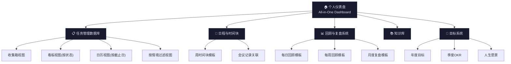

## 六、数字化时间管理工具

数字化工具是时间管理方法论从"纸上谈兵"走向"自动运转"的关键载体。本节不重复具体工具的功能评测（详见"产品推荐"章节），而是聚焦于三个核心问题：**如何选对工具**、**如何把工具组成系统**、**如何让系统长期运转**。如果你已经读过产品推荐章节的各种APP和工具清单，本节会告诉你如何把它们串联成一套可执行、可迭代的数字化时间管理系统。

---

### 6.1 工具选择的底层逻辑：从方法论反推工具需求

大多数人选工具的顺序是：看到别人推荐→下载试用→用两天放弃。这个流程的问题在于，你先选了"锤子"，再去找"钉子"。正确的顺序应该是：先明确你要解决什么问题、用什么方法论，再选择承载这个方法论的工具。

#### 6.1.1 方法论→工具需求的映射

每种时间管理方法论对工具都有特定的功能要求。选工具之前，先确认你正在实践（或打算实践）哪种方法论，然后根据其核心流程匹配工具能力：

| 方法论 | 核心流程 | 工具必须具备的能力 | 工具应该避免的特征 |
|--------|----------|-------------------|-------------------|
| **GTD** | 收集→处理→组织→回顾→执行 | 多层项目结构、上下文标签、延迟任务、定期回顾提醒 | 过于简化的待办列表（缺少"将来/也许"和"等待"状态） |
| **番茄工作法** | 25分钟专注→5分钟休息→长休息 | 计时器、专注统计、休息提醒、日/周番茄数统计 | 无统计功能的简单倒计时（无法追踪趋势） |
| **四象限法则** | 按重要-紧急二维分类 | 优先级标记、矩阵视图或过滤器 | 只有一维优先级（高/中/低）的工具 |
| **时间块法** | 将一天划分为固定时间段 | 日历视图、时间块拖拽、与任务关联 | 纯列表式任务管理（无法可视化时间分配） |
| **艾森豪威尔矩阵** | 二维四象限决策 | 自定义字段、多维标签、筛选视图 | 固定模板、无法自定义分类维度的工具 |
| **能量管理** | 按能量水平匹配任务难度 | 标签/分类系统、灵活排序 | 纯时间驱动的刚性日程安排 |

**关键洞察：** 没有任何单一工具能完美适配所有方法论。大多数人需要 2-3 个核心工具组合使用，而不是追求一个"万能工具"。选择标准不是"功能最多"，而是"对你的核心方法论支持最好"。

#### 6.1.2 四个选择原则的深层解释

**原则一：少即是多——为什么 3-5 个是上限？**

这不是随意的数字。每个工具都有"维护成本"：你需要记住它的操作方式、定期同步数据、适应它的更新。认知心理学中的"工作记忆容量"研究表明，人类同时处理的信息块数量上限约为 4±1 个（Cowan, 2001）。当你的工具超过 5 个时，"管理工具本身"就变成了一项需要管理的任务，这违背了时间管理的初衷。

具体来说，一个完整的数字化时间管理系统通常只需要覆盖以下四个功能域：

功能域           对应工具类型            最低配置
─────────────────────────────────────────────
任务捕获与执行    任务管理APP             1个
时间可视化        日历/时间块工具         1个
知识与记录        笔记/文档工具           1个
专注保护          计时器/屏蔽工具         0-1个

**原则二：生态统一——数据流动比功能强大更重要**

一个功能稍弱但能自动同步的工具组合，胜过三个功能强大但互相隔绝的工具。数据在工具之间手动搬运的时间成本是隐性的——你以为自己只是"复制粘贴一下"，但每天复制 5 次，一年就是 1825 次，按每次 30 秒计算，你浪费了 15 小时在"工具之间的搬运工"上。

主流生态的数据流通能力对比：

| 生态 | 任务管理 | 日历 | 笔记 | 自动化 | 跨设备同步 |
|------|---------|------|------|--------|-----------|
| **苹果** | Things 3 / 提醒事项 | Apple Calendar | Apple Notes / Bear | 快捷指令(Shortcuts) | iCloud 自动同步 |
| **Google** | Google Tasks | Google Calendar | Google Keep / Docs | Apps Script | 全平台 Web 访问 |
| **微软** | Microsoft To Do | Outlook Calendar | OneNote / Loop | Power Automate | Microsoft 365 同步 |
| **Notion** | Notion Tasks | Notion Calendar | Notion | Notion API + Zapier | 全平台客户端 |
| **Obsidian** | Obsidian Tasks插件 | Full Calendar插件 | Obsidian 本体 | Templater + Dataview | 本地/同步服务 |

**原则三：从简开始——渐进式升级路径**

工具选择不是一次性决策，而是一个随着你对时间管理理解的加深而逐步演进的过程。以下是典型的升级路径：


**原则四：定期审视——季度工具审计清单**

每季度花 30 分钟做一次"工具审计"，回答以下问题：

1. **使用频率**：过去 30 天内，每个工具我打开了多少次？（低于 3 次/月的工具需要重新评估）
2. **核心依赖**：如果这个工具明天消失，我的工作流会受到多大影响？（高依赖+低频率 = 需要备份方案）
3. **成本效益**：付费工具的年费除以实际使用天数，单次使用成本是多少？（超过 5 元/次的需要认真考虑替代品）
4. **冗余检测**：有没有两个工具在做同一件事？（最常见的浪费是任务管理APP和笔记APP的"待办"功能重叠）

---

### 6.2 工具组合策略：从入门到专业的三级方案

工具组合不是简单的"功能拼凑"，而是要确保数据能在工具之间顺畅流动，形成一个闭环系统。以下三个方案从简单到复杂，每个都经过实际验证。

#### 6.2.1 极简组合：入门者的零学习成本方案

**适用人群：** 刚开始实践时间管理、不想在工具上花太多时间、预算有限的用户。

**工具清单：**

| 功能域 | 工具 | 选择理由 |
|--------|------|---------|
| 任务管理 | Microsoft To Do | 完全免费，跨平台，"我的一天"功能天然适合每日规划 |
| 日程管理 | Google Calendar | 免费，生态开放，几乎所有其他工具都支持与它集成 |
| 专注计时 | Forest | 25元一次性购买，游戏化机制降低坚持门槛 |
| 笔记记录 | 纸质笔记本 | 零学习成本，手写有助于记忆编码 |

**数据流设计：**

捕获入口：Microsoft To Do 收集箱 + 纸质笔记本速记
    ↓ （每天早上5分钟）
处理与组织：Microsoft To Do "我的一天" + Google Calendar 时间块
    ↓ （全天执行）
执行与专注：Forest 番茄钟 + Microsoft To Do 勾选完成
    ↓ （每晚5分钟）
回顾与调整：纸质笔记本写回顾日志

**关键操作细节：**

- **每日捕获**：任何想法、任务、承诺，先丢进 Microsoft To Do 的收集箱或纸质笔记本的速记区，不做任何处理。捕获和处理是两个独立的步骤，混在一起会导致注意力断裂。
- **每日规划**：每天早上，从收集箱中选出今天要做的 3-5 件事，加入"我的一天"。Google Calendar 上标注固定时间事项（会议、约会）。
- **专注执行**：选一个任务，打开 Forest 种树 25 分钟。期间不切换任务、不看手机。树枯萎 = 专注失败，这个心理惩罚机制比任何自律技巧都有效。
- **每日回顾**：晚上在纸质笔记本上花 5 分钟回答三个问题：今天完成了什么？什么没完成？为什么？明天最重要的三件事是什么？

**优势**：启动成本为零（除 Forest 外全部免费），学习曲线几乎为平，30 分钟内可以搭建完成。
**局限**：没有自动化能力，跨工具数据需要手动同步，不适合管理复杂项目。

#### 6.2.2 进阶组合：有经验者的效率提升方案

**适用人群：** 已经实践时间管理 3 个月以上、需要管理多个项目、愿意投入时间学习工具的用户。

**工具清单：**

| 功能域 | 工具 | 选择理由 |
|--------|------|---------|
| 任务管理 | 滴答清单 | 内置番茄钟+习惯追踪+日历，一站式覆盖多个功能域 |
| 知识管理 | Notion | 高度灵活的数据库系统，可构建任何结构 |
| 日程管理 | Google Calendar | 与滴答清单双向同步 |
| 注意力保护 | Freedom | 跨设备网站/APP屏蔽，主动防御注意力流失 |

**数据流设计：**

捕获入口：滴答清单收集箱（任务）+ Notion快速笔记（想法/知识）
    ↓
处理与组织：滴答清单项目+标签体系 + Notion知识库
    ↓
执行与专注：滴答清单番茄钟 + Freedom网站屏蔽
    ↓
回顾与复盘：滴答清单习惯追踪 + Notion周/月回顾模板
    ↓
自动化：滴答清单 ↔ Google Calendar 双向同步

**关键升级点（相比极简组合）：**

1. **习惯追踪内置化**：滴答清单的习惯追踪功能替代了单独的习惯APP，每日习惯打卡和任务管理在同一个界面完成，减少了工具切换。
2. **知识管理系统化**：Notion 承担了从"信息收集"到"知识沉淀"的全链路。不再只是记笔记，而是构建一个可检索、可关联的个人知识库。
3. **主动注意力保护**：Freedom 不是在你分心后提醒你，而是直接在源头屏蔽干扰。设置"专注模式"后，社交媒体、新闻网站在所有设备上同时不可访问，物理上消除了诱惑。

#### 6.2.3 专业组合：重度用户的全链路自动化方案

**适用人群：** 管理 10+ 并行项目、追求极致效率、有一定技术能力的用户。

**工具清单：**

| 功能域 | 工具 | 选择理由 |
|--------|------|---------|
| 任务管理 | Todoist | 自然语言输入、强大的过滤器系统、开放 API |
| 日程管理 | Fantastical | 自然语言日程创建、多日历聚合、天气集成 |
| 知识管理 | Obsidian | 本地优先、双向链接、强大的插件生态 |
| 时间追踪 | RescueTime | 自动追踪所有设备的使用时间，无需手动记录 |
| 习惯追踪 | Streaks (macOS/iOS) | 设计精美，支持复杂习惯链 |
| 自动化枢纽 | Zapier / IFTTT | 连接所有工具，构建自动化工作流 |

**自动化工作流示例：**

| 触发条件 | 自动执行动作 | 价值 |
|----------|-------------|------|
| Todoist 任务完成 | 自动在 RescueTime 记录对应时间块 | 任务完成与时间数据自动关联 |
| Google Calendar 新增会议 | 自动在 Todoist 创建"会议准备"任务 | 零遗漏的会前准备 |
| RescueTime 检测到低效时间 > 1小时 | 发送 Telegram 通知提醒 | 实时注意力纠偏 |
| 每周五下午5点 | 自动生成本周时间分配报告（RescueTime数据） | 自动化周回顾 |
| Obsidian 新建每日笔记 | 自动从 Todoist 拉取今日任务列表 | 笔记与任务系统自动关联 |

---

### 6.3 用 Notion 构建完整的时间管理系统：从零到精通

Notion 是构建个人时间管理系统最灵活的工具之一。它的数据库系统可以模拟几乎任何结构，从简单的待办列表到复杂的项目管理看板。以下是一个经过实战验证的完整 Notion 时间管理系统架构，包含数据库设计、视图配置和自动化设置。

#### 6.3.1 系统架构总览



#### 6.3.2 核心数据库设计：任务管理

任务管理是整个系统的中枢。一个设计良好的任务数据库，可以通过不同的视图（View）满足收集、处理、执行、回顾全流程的需求，而不需要在多个页面之间跳转。

**数据库字段设计：**

| 字段名 | 字段类型 | 用途说明 | 配置建议 |
|--------|---------|---------|---------|
| 任务名称 | Title | 任务的简短描述 | 使用自然语言，如"给张三发项目报告" |
| 状态 | Select | 任务当前所处阶段 | 选项：收集箱 / 下一步行动 / 进行中 / 等待中 / 完成 / 放弃 |
| 优先级 | Select | 重要性分级 | 选项：🔴 P0紧急重要 / 🟠 P1重要不紧急 / 🟡 P2紧急不重要 / ⚪ P3不紧急不重要 |
| 截止日期 | Date | 任务的 deadline | 可选，无截止日的任务不填 |
| 情境 | Multi-select | 执行任务需要的场景/条件 | 选项：@电脑 / @电话 / @外出 / @家 / @低能量 / @等待 |
| 项目 | Relation | 关联到项目数据库 | 建立与"项目"数据库的关联关系 |
| 预估时间 | Select | 完成任务预估所需时间 | 选项：5分钟 / 15分钟 / 30分钟 / 1小时 / 2小时+ |
| 实际时间 | Number | 实际花费时间（分钟） | 回顾时填写，用于校准预估能力 |
| 能量需求 | Select | 完成任务需要的能量水平 | 选项：⚡高能量 / 🔋中能量 / 🪫低能量 |
| 标签 | Multi-select | 自定义分类标签 | 按需添加，如"学习""工作""健康""财务" |
| 笔记 | Text | 任务的详细说明、链接、附件 | 支持富文本、链接、文件附件 |
| 创建时间 | Created time | 自动记录，无需手动填写 | 用于统计任务平均完成周期 |
| 完成时间 | Date | 实际完成日期 | 用于回顾分析 |

**关键视图配置：**

**视图一：收集箱（GTD 入口）**

过滤条件：状态 = "收集箱"
排序：按创建时间降序
显示字段：任务名称、优先级、创建时间

这是你每天打开 Notion 第一个看到的视图。所有新任务、新想法都先丢进这里，不做任何处理。每处理一条，就把它的状态从"收集箱"改为其他状态。目标是每天清零收集箱。

**视图二：下一步行动看板（GTD 执行）**

视图类型：看板（Board）
分组依据：情境（@电脑、@电话、@外出等）
过滤条件：状态 = "下一步行动" 或 "进行中"
排序：优先级降序

这个视图回答 GTD 的核心问题："在我当前的情境下，我能做的最有价值的事是什么？" 比如你坐在电脑前，就看"@电脑"列；你在地铁上，就看"@低能量"列。

**视图三：本周任务（周计划）**

视图类型：日历（Calendar）
日期字段：截止日期
过滤条件：截止日期在本周内 OR 状态 = "进行中"
排序：优先级降序

这个视图让你一目了然地看到本周的时间压力分布。如果某一天密密麻麻全是截止日，说明你的任务安排有问题，需要提前重新分配。

**视图四：四象限矩阵（优先级决策）**

视图类型：看板（Board）
分组依据：优先级
过滤条件：状态 ≠ "完成" 且状态 ≠ "放弃"

将所有未完成任务按重要-紧急二维展示。定期检查"P1重要不紧急"列——这是时间管理的核心区域，主动投入这里可以减少"P0紧急重要"的被动救火。

**视图五：等待清单（GTD 跟踪）**

过滤条件：状态 = "等待中"
显示字段：任务名称、关联人员/项目、等待原因、创建时间

任何你委托给别人、等待回复、等待审批的任务都在这里。每周回顾时逐条检查——超过 7 天没有进展的，需要主动跟进。

#### 6.3.3 回顾与复盘系统设计

回顾是时间管理系统的"灵魂"。没有回顾的系统只是一个任务堆积场，而不是一个持续改进的引擎。

**每日回顾模板（Notion Template）：**

```markdown
## 📅 每日回顾 — {日期}

### 一、今日完成
- [ ] （从任务数据库中拖入今天完成的任务）

### 二、今日未完成
- （列出计划但未完成的任务）
- 原因分析：（被什么打断了？优先级判断失误？时间预估不准？）

### 三、今日洞察
- 今天最有价值的一件事是什么？
- 今天最大的时间浪费是什么？
- 明天可以改进什么？

### 四、明日规划
1. 最重要的三件事（MIT: Most Important Tasks）
   - 
   - 
   - 
2. 固定日程（会议、约会）
   - 
3. 需要提前准备的事项
   - 
```

**每周回顾模板（Notion Template）：**

```markdown
## 📊 每周回顾 — 第{N}周（{日期范围}）

### 一、目标进展
| 目标 | 本周进展 | 完成度 | 下周计划 |
|------|---------|--------|---------|
|      |         |   %    |         |

### 二、时间分配审计
| 类别 | 目标占比 | 实际占比 | 差异分析 |
|------|---------|---------|---------|
| 深度工作 | 40% |   % |  |
| 浅层工作 | 20% |   % |  |
| 学习成长 | 15% |   % |  |
| 运动健康 | 10% |   % |  |
| 社交关系 | 10% |   % |  |
| 休闲放松 | 5% |   % |  |

### 三、本周高光时刻
- 

### 四、本周教训
- 

### 五、下周调整
- 需要开始做的：
- 需要停止做的：
- 需要继续做的：
```

#### 6.3.4 Notion 时间管理系统的进阶技巧

**技巧一：用 Relation 和 Rollup 实现项目-任务联动**

创建一个"项目"数据库，与"任务"数据库建立 Relation 关系。每个项目可以 Rollup 其下所有任务的完成状态，自动生成项目进度百分比。这样你不需要手动更新项目进度——完成一个任务，项目进度自动更新。

配置步骤：
1. 创建"项目"数据库，字段包括：项目名称、状态、优先级、截止日期、目标
2. 在"任务"数据库中添加 Relation 字段，关联到"项目"数据库
3. 在"项目"数据库中添加 Rollup 字段，统计关联任务的完成率
4. 在项目数据库创建看板视图，按状态分组，一眼看到所有项目的健康状态

**技巧二：用 Notion Calendar 实现时间块管理**

Notion Calendar（原 Cron）可以将 Notion 任务数据库的日历视图直接嵌入日历界面，实现任务与日程的统一视图。你可以把任务拖拽到日历的特定时间段，就像 Google Calendar 的时间块一样操作。

操作步骤：
1. 打开 Notion Calendar（calendar.notion.com）
2. 连接你的 Google Calendar 账号
3. 连接你的 Notion 任务数据库
4. 在日历视图中，左侧是 Google Calendar 的日程，右侧是 Notion 任务
5. 将 Notion 任务拖拽到日历时间段，完成"时间块"分配

**技巧三：用 Notion API 实现自动化**

如果你有基础的编程能力（或者愿意使用 Zapier/Make 等无代码工具），可以通过 Notion API 实现更复杂的自动化：

自动化场景一：邮件→任务
触发器：收到标记为"待处理"的Gmail邮件
动作：在Notion任务数据库的"收集箱"中创建新任务
字段映射：邮件标题→任务名称，邮件正文→笔记，发件人→标签

自动化场景二：每周自动生成回顾模板
触发器：每周五下午4点
动作：在Notion"回顾"页面自动创建本周回顾模板
内容：预填充本周日期范围、待完成任务列表、本周已完

自动化场景三：Slack消息→任务
触发器：在Slack中对自己的消息添加🔖反应
动作：在Notion收集箱创建任务，包含消息链接

---

### 6.4 工具间的数据整合：构建你的"数字中枢"

当你的工具组合超过 2 个时，"数据在工具之间如何流动"就成为系统效率的决定性因素。数据整合有三种策略，从简单到复杂依次递进。

#### 6.4.1 手动同步策略（入门）

适用场景：工具数量 ≤ 3 个，数据量小，不需要实时同步。

**每日同步清单（5 分钟完成）：**

1. 任务管理APP → 日历：把今天计划执行的任务复制到日历的时间块中
2. 日历 → 任务管理APP：把日历中新增的会议/约会，在任务管理APP中创建对应的准备任务
3. 笔记 → 任务管理APP：把笔记中提到的待办事项提取到任务管理APP的收集箱

**避免手动同步的常见错误：**
- 不要在两个工具中维护同一份数据（比如在日历和任务APP中都记录同一个截止日期），选择一个"单一事实来源"（Single Source of Truth），另一个只做引用
- 手动同步时不要追求"完美对齐"，80% 的数据一致就够了，追求 100% 会消耗过多时间

#### 6.4.2 半自动同步策略（进阶）

适用场景：使用同一生态内的工具，或工具之间有原生集成。

**常见原生集成组合：**

| 集成方式 | 工具A | 工具B | 同步内容 | 配置难度 |
|----------|-------|-------|---------|---------|
| Todoist ↔ Google Calendar | Todoist | Google Calendar | 任务↔日历事件双向同步 | ⭐ 低（设置页一键开启） |
| 滴答清单 ↔ Google Calendar | 滴答清单 | Google Calendar | 任务→日历单向同步 | ⭐ 低 |
| Notion Calendar + Google Calendar | Notion | Google Calendar | 日历事件聚合展示 | ⭐⭐ 中（需授权连接） |
| Obsidian + Todoist | Obsidian | Todoist | 在笔记中嵌入任务列表 | ⭐⭐ 中（需安装插件） |

#### 6.4.3 全自动同步策略（专业）

适用场景：工具数量 ≥ 4 个，有复杂的跨工具工作流需求。

**自动化平台选择：**

| 平台 | 特点 | 价格 | 适合谁 |
|------|------|------|--------|
| **Zapier** | 最成熟的自动化平台，5000+应用连接 | 免费(5个Zap)/19.99美元月 | 不会写代码的用户 |
| **Make (原Integromat)** | 可视化流程设计，性价比高 | 免费(1000次操作)/9美元月 | 需要复杂逻辑的用户 |
| **n8n** | 开源，可自托管，无操作次数限制 | 免费(自托管)/20欧元月 | 有技术能力的用户 |
| **IFTTT** | 最简单，适合基础自动化 | 免费(5个Applet)/3.49美元月 | 只需要简单触发的用户 |

**推荐的自动化工作流：**

工作流1：邮件→任务→日历 完整链路
━━━━━━━━━━━━━━━━━━━━━━━━━━━━━━━━━━━━
触发：Gmail收到标记"action"的邮件
  → 在Todoist创建任务（标题=邮件标题，项目=邮件标签）
    → Todoist自动同步到Google Calendar
结果：一封需要你行动的邮件，自动变成日历上的时间块

工作流2：会议结束→自动生成行动项
━━━━━━━━━━━━━━━━━━━━━━━━━━━━━━━━━━━━
触发：Google Calendar会议结束
  → 在Notion会议记录页面创建"行动项"模板
    → 包含：参会人、讨论要点、待办事项模板
结果：每次会议结束，你有一个结构化的模板记录决策和行动

工作流3：每周自动生成时间报告
━━━━━━━━━━━━━━━━━━━━━━━━━━━━━━━━━━━━
触发：每周五下午5点
  → 从RescueTime获取本周时间分配数据
    → 生成格式化报告（工作/社交/娱乐/学习占比）
      → 发送到Notion"周回顾"页面 + 邮件给自己
结果：你的周回顾自动填充了客观的时间数据，不再靠记忆估计

---

### 6.5 移动端与桌面端的协同设计

大多数人的时间管理断裂发生在"手机上捕获的任务没有回到电脑上处理"或"电脑上的计划在手机上看不到"。移动端和桌面端的协同设计是系统顺畅运转的关键。

#### 6.5.1 设备分工原则

| 设备 | 核心角色 | 擅长的事 | 不适合的事 |
|------|---------|---------|-----------|
| **手机** | 捕获 + 快速执行 | 随时随地捕获想法、处理2分钟任务、查看日程 | 长时间深度工作、复杂规划 |
| **电脑** | 深度工作 + 系统管理 | 项目规划、复杂任务执行、系统维护和回顾 | 随时捕获（需要打开电脑） |
| **平板** | 阅读 + 标注 + 轻度创作 | 阅读文档、标注笔记、手写草稿 | 重度输入（键盘效率低） |

**核心原则：** 80% 的捕获发生在手机上，80% 的执行发生在电脑上，80% 的回顾在固定时间固定设备上完成。

#### 6.5.2 手机端优化配置

**主屏幕布局建议（iPhone/Android）：**

第一屏（效率主屏）：
┌─────────────────────────────────┐
│  日历Widget    │  任务Widget     │
│  (今日日程)     │  (今日待办)      │
├─────────────────┼─────────────────┤
│  快速捕获       │  番茄钟         │
│  (任务APP快捷)   │  (Forest/潮汐)   │
├─────────────────┴─────────────────┤
│  笔记快捷入口    │  习惯打卡       │
└─────────────────────────────────┘

第二屏及以后：社交、娱乐、其他APP
（把干扰类APP移到第二屏，增加一步打开的距离）

**通知策略（极其重要）：**

通知是注意力的最大杀手。合理配置通知策略，可以让你的手机从"注意力破坏者"变成"时间管理助手"：

| 通知类型 | 策略 | 配置方法 |
|----------|------|---------|
| 日历提醒 | ✅ 保留，弹出通知 | 开启"日程开始前15分钟"提醒 |
| 任务截止提醒 | ✅ 保留，但设为静默通知 | 只在通知中心显示，不弹出、不响铃 |
| 社交媒体通知 | ❌ 全部关闭 | iOS: 设置→通知→逐个关闭；Android: 应用管理→通知 |
| 新闻/资讯推送 | ❌ 全部关闭 | 同上 |
| 邮件通知 | ⚠️ 仅VIP联系人 | 设置VIP过滤，只接收重要邮件的推送 |

#### 6.5.3 跨设备同步检查清单

在搭建系统时，逐项验证以下同步场景是否正常工作：

□ 手机上创建的任务 → 电脑端5秒内可见
□ 电脑上更新任务状态 → 手机端实时反映
□ 日历上新增事件 → 所有设备均弹出提醒
□ 手机上完成番茄钟 → 电脑端统计数据已更新
□ 离线状态下创建的任务 → 恢复网络后自动同步
□ 在一台设备上删除任务 → 其他设备同步删除（确认无误删除风险）

---

### 6.6 数据安全与工具迁移策略

数字化时间管理系统的数据是你最宝贵的资产之一——它记录了你的所有任务、计划、目标和反思。如果工具突然不可用（公司倒闭、政策变更、涨价离谱），你的数据能否安全导出，是选择工具时必须考虑的因素。

#### 6.6.1 数据可迁移性评估

在选择工具前，评估它的数据可迁移性：

| 评估维度 | 高分标准 | 低分信号 |
|----------|---------|---------|
| **导出格式** | 支持 CSV/JSON/Markdown 等通用格式导出 | 只支持私有格式或不支持导出 |
| **API 开放性** | 有完整的 REST API，支持第三方集成 | 无 API 或 API 功能残缺 |
| **社区生态** | 有活跃的第三方迁移工具和教程 | 几乎没有迁移相关的社区资源 |
| **数据所有权** | 数据存储在本地或你可控制的位置 | 数据完全存储在厂商云端，无法本地备份 |
| **导入能力** | 竞品工具能直接导入该工具的数据 | 竞品工具无法解析该工具的数据格式 |

**各工具数据可迁移性评分：**

| 工具 | 导出格式 | API | 本地存储 | 总评 |
|------|---------|-----|---------|------|
| **Obsidian** | Markdown文件（本身就是） | 插件系统 | ✅ 完全本地 | ⭐⭐⭐⭐⭐ |
| **Todoist** | CSV/JSON | ✅ 完整REST API | ❌ 云端 | ⭐⭐⭐⭐ |
| **Notion** | CSV/Markdown/HTML | ✅ 完整API | ❌ 云端 | ⭐⭐⭐⭐ |
| **滴答清单** | 支持多种格式导出 | 有基础API | ❌ 云端 | ⭐⭐⭐ |
| **Things 3** | Things JSON | URL Scheme | 本地+iCloud | ⭐⭐⭐ |
| **Microsoft To Do** | 不支持直接导出 | Microsoft Graph API | ❌ 云端 | ⭐⭐ |

#### 6.6.2 备份策略

**最低要求：每月一次全量导出**

每月最后一个周末，花 15 分钟执行以下备份流程：

1. 任务管理工具 → 导出全部任务为 CSV，保存到云盘（如 Google Drive / OneDrive）
2. 笔记工具 → 导出全部笔记为 Markdown，保存到本地硬盘 + 云盘
3. 日历 → 导出 .ics 文件，保存到云盘
4. 检查导出文件是否完整（打开 CSV 看看行数是否与APP中任务数一致）

**进阶要求：自动备份**

- **Obsidian**：使用 Git 版本控制，每次修改自动提交（安装 Git 插件即可）
- **Notion**：使用 Notion-backup（GitHub 开源项目）定期自动备份到本地
- **Todoist**：使用 Todoist API + 定时脚本自动导出 JSON

#### 6.6.3 工具迁移实战指南

当你决定从一个工具迁移到另一个工具时，按以下步骤操作：

**第一阶段：准备（迁移前 1-2 周）**

1. 从旧工具导出所有数据（CSV/JSON）
2. 在新工具中导入数据，检查映射是否正确
3. 重点检查：任务关系是否保留、标签/分类是否正确转换、附件是否迁移成功
4. 在新工具中重建视图和自动化规则

**第二阶段：并行运行（1-2 周）**

1. 新旧工具同时使用，以新工具为主
2. 每天检查两端数据是否一致
3. 记录新工具中"缺少的功能"和"比旧工具更好的地方"
4. 评估：新工具是否真的比旧工具好？切换的收益是否大于学习成本？

**第三阶段：切换（1 周）**

1. 确认新工具系统稳定运行 1 周无重大问题
2. 将旧工具中的数据做最后一次全量备份
3. 停止在旧工具中创建新内容
4. 在手机主屏上将旧工具图标移到第二屏（不要立即删除，保留 30 天缓冲）

**第四阶段：收尾（迁移后 30 天）**

1. 确认 30 天内没有需要回到旧工具获取的信息
2. 删除旧工具（或保留免费版作为只读备份）
3. 整理备份文件，标注迁移日期和工具版本

---

### 6.7 常见误区与避坑指南

#### 误区一：追求"完美系统"

**表现：** 花三天时间搭建 Notion 模板，调整配色、图标、布局，结果系统搭好了，一天都没用过。

**真相：** 系统的目的是帮你完成任务，不是帮你获得搭建系统的成就感。一个丑陋但每天在用的系统，远胜于一个精美但从不打开的系统。

**纠正方法：** 给自己设定"5分钟启动规则"——你搭建系统的第一个版本不应该超过 5 分钟。先用最简单的结构（一个收集箱 + 一个日历），运行一周后再根据实际痛点逐步优化。

#### 误区二：工具收集癖

**表现：** 看到推荐就下载试用，手机上有 5 个任务管理APP、3 个番茄钟、4 个笔记APP，每个都只用了皮毛。

**真相：** 每多一个工具，就多一个需要维护的系统、多一个数据孤岛、多一个学习成本。工具的价值不在于数量，在于深度使用。

**纠正方法：** 执行"一进一出"规则——每安装一个新工具，必须卸载一个旧工具。定期（每月）检查手机上时间管理类APP的使用频率，低于每周 3 次的直接卸载。

#### 误区三：忽视"摩擦成本"

**表现：** 选择了一个功能最强大但操作最复杂的工具，结果因为"打开APP→找到项目→创建任务→设置属性→设置标签"这一套操作太长，你干脆不记了。

**真相：** 捕获任务的摩擦成本越低，你越可能坚持使用。一个需要 5 步操作才能创建任务的工具，不如一个需要 1 步操作的工具。

**纠正方法：** 计算每个工具的核心操作步骤数。任务捕获不超过 3 步，查看今日任务不超过 2 步，完成任务不超过 1 步。超过这个标准的工具，要么优化操作流程，要么换掉。

#### 误区四：数据只存在云端

**表现：** 所有数据都在某个APP的云端，从未导出过备份。某天APP涨价到用不起，或者公司倒闭，所有数据瞬间消失。

**真相：** 你的任务记录、笔记、目标规划是多年积累的个人资产。它们应该像你的照片一样，有至少两份备份。

**纠正方法：** 每月执行一次数据导出备份（详见 6.6.2 节）。优先选择支持本地存储或通用格式导出的工具。

#### 误区五：自动化过度

**表现：** 花了两天配置 Zapier 工作流，把 10 个工具串联成复杂网络，结果一个工具更新了API，整条链路全断，花了一周修复。

**真相：** 自动化是为了解放时间，不是为了创造新的维护任务。每增加一条自动化规则，就增加了一个潜在的故障点。

**纠正方法：** 遵循"3 条自动化上限"原则——在你确认自己需要更多之前，最多只配置 3 条自动化规则。优先自动化"高频+低复杂度"的操作（如邮件→任务），不要自动化"低频+高复杂度"的操作（如月度报告生成）。

---

### 6.8 本节小结

数字化工具是时间管理方法论的"执行引擎"，但它永远只是手段，不是目的。以下是本节的核心要点回顾：

1. **先方法论，后工具**：不要被工具的功能列表迷惑，先搞清楚你需要什么方法论，再选择承载它的工具。
2. **3-5 个工具足够**：覆盖任务管理、日程管理、笔记/知识管理、专注保护四个功能域即可。
3. **数据流动是关键**：工具之间能否顺畅同步数据，比单个工具的功能强大与否更重要。
4. **渐进式升级**：从最简单的工具组合开始，随着需求增长逐步升级，不要一开始就追求"终极方案"。
5. **定期回顾和清理**：每季度审计一次工具组合，删除不用的工具，优化低效的工作流。
6. **数据安全第一**：确保你的数据有备份、可导出、可迁移，不要把所有鸡蛋放在一个篮子里。

**最后的忠告：** 如果你读完本节后感到信息过载，不知道从哪里开始，那就做一件事——打开你的手机，下载一个免费的任务管理APP（Microsoft To Do 或 Google Tasks），把今天你想做的三件事写进去。这就是你的数字化时间管理系统的起点。所有进阶工具、自动化工作流、复杂架构，都是在这个起点上逐步生长出来的。
