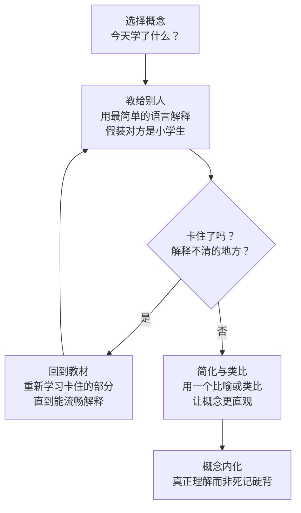
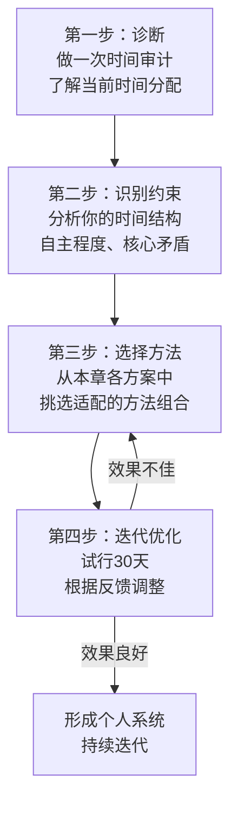

## 七、不同人群的定制方案

时间管理的方法论是普适的，但**落地方式必须因人而异**。一个全职妈妈的可用时间和一个创业者的可用时间，虽然都是24小时，但在连续性、可控性、精力分布上完全不同。把同一套方案塞给所有人，就像给所有病人开同一种药——理论上"对症"，实际上无效。

本节的核心理念：**先理解你所处的约束条件，再选择适配的方法组合**。约束条件包括三大维度：

| 维度 | 说明 | 典型差异 |
|------|------|----------|
| **时间结构** | 你的时间是整块的还是碎片的？ | 创业者 vs 全职妈妈 |
| **自主程度** | 你能多大程度上决定自己的日程？ | 高管 vs 职场新人 |
| **核心矛盾** | 你当前最大的时间管理痛点是什么？ | 学生的拖延 vs 管理者的碎片化 |

下面针对八类典型人群，逐一给出深度定制方案。每个方案包含：核心挑战分析、推荐方法组合、具体实施步骤、常见陷阱与纠偏、30天启动计划。

---

### 7.1 职场新人方案

#### 核心挑战深度分析

职场新人面临的时间管理困境，本质上是一个**认知负荷过载**问题。斯坦福大学组织行为学教授杰弗瑞·菲佛（Jeffrey Pfeffer）的研究指出，新员工入职前6个月的认知负荷是老员工的2-3倍——因为他们同时需要学习业务知识、掌握工作流程、建立人际关系、适应企业文化四件事。

这种多线程学习状态导致三个典型症状：

1. **优先级判断失灵**：缺乏经验意味着你无法准确评估"这件事有多重要""做这件事需要多久"。新员工平均需要6-12个月才能建立对本职工作的优先级直觉。
2. **被动响应模式**：因为不确定什么重要，所以什么都接。上级说一句"你有空帮忙看看这个"，新人往往立刻放下手头工作去响应，导致自己的核心任务被反复打断。
3. **学习与执行的冲突**：想花时间学习提升，但工作任务已经排满；想尽快上手工作，但缺乏知识储备导致效率低下。

#### 推荐方法组合：四象限法则 + 番茄工作法 + 日计划

为什么选这个组合？

- **四象限法则**：帮助你建立优先级判断框架。作为新人，你缺乏直觉判断力，需要一个显式的分类工具来替代经验。
- **番茄工作法**：帮助你在注意力被大量新信息冲击的环境中，保护专注时间。25分钟的短周期降低了"开始工作"的心理门槛。
- **日计划**：帮助你在不确定性中建立每日确定性。新人对周/月级别的规划缺乏信息，但每天早上花10分钟规划当天是可行的。

#### 具体实施

**每日时间分配建议：**

| 时段 | 活动类型 | 占比 | 说明 |
|------|----------|------|------|
| 上午精力高峰期（通常9:00-11:30） | 核心执行任务 | 40% | 处理四象限中"重要且紧急"和"重要不紧急"的任务 |
| 上午后半段+下午前半段 | 学习成长 | 25% | 学习业务知识、技能提升、阅读行业资料 |
| 下午中段 | 沟通协作 | 25% | 回复消息、参加会议、请教同事 |
| 下午末段 | 整理与规划 | 10% | 日回顾、整理笔记、准备明天计划 |

**每日操作流程：**

1. **早上到岗后5分钟**：打开待办清单，用四象限法则对当天任务分类。问自己一个问题："如果今天只能完成一件事，哪件事完成后让我最安心？"——那就是今天的"青蛙"。
2. **上午精力高峰期（2-3个番茄钟）**：处理最重要的任务。关闭IM通知，手机静音面朝下。如果被同事打断，用"告知-协商-回电"四步法：告知对方你正在处理紧急任务，协商一个稍后沟通的时间，承诺时间到了主动回电。
3. **学习时间（1-2个番茄钟）**：建议安排在午饭后精力稍降的时段。内容聚焦于"能立刻用到工作中的知识"，而不是泛泛学习。
4. **沟通时段**：集中回复消息、处理邮件、参加必要会议。学会用"我现在手头有事，下午3点后方便讨论"来延迟非紧急沟通。
5. **下班前10分钟**：日回顾——今天完成了什么？什么没完成？明天最优先的是什么？把未完成的任务转移到明天的清单。

**新人专属技巧——"请教清单"**：

准备一个专门的文档或笔记本，记录工作中遇到的问题和疑惑。不要每遇到一个问题就去问同事（这样会频繁打断双方），而是积累3-5个问题后，在一个固定时间（比如每天下午4点）集中请教。这既尊重了同事的时间，也让你在积累问题的过程中有机会自己先思考。

#### 常见陷阱与纠偏

| 陷阱 | 表现 | 纠偏方法 |
|------|------|----------|
| 来者不拒 | 同事/上级交代什么都接，自己的任务被挤压 | 每次接新任务前问："这和我的核心职责相关吗？我今天还有余力吗？"如果答案是"不确定"或"没有"，学会说"我需要先完成手头的XX，明天可以帮你看" |
| 低估任务时间 | 觉得"这个半小时能搞定"，结果花了2小时 | 使用"参考类别预测法"：第一次做某类任务时，记录实际耗时；第二次做同类任务时，用第一次的实际数据做预估，再加50%缓冲 |
| 只做不学 | 忙于执行，没有时间提升技能，一年后仍是"新手效率" | 把学习时间当作和会议一样的"不可取消日程"，每天至少保留30分钟 |
| 完美主义 | 一份报告反复修改，花费远超合理时间 | 对新人来说，"完成"优于"完美"。先交出80分的成果获得反馈，比独自做到95分效率高得多 |

#### 30天启动计划

| 阶段 | 时间 | 行动 | 预期成果 |
|------|------|------|----------|
| 第1周 | Day 1-3 | 建立待办清单系统（推荐Todoist或微软To Do），记录当前所有任务 | 任务可视化，不再"记在脑子里" |
| 第1周 | Day 4-7 | 学习四象限法则，每天早上花5分钟对任务分类 | 建立优先级判断习惯 |
| 第2周 | Day 8-14 | 引入番茄工作法，每天完成4个番茄钟 | 开始体验"专注时间段"的价值 |
| 第3周 | Day 15-21 | 建立"请教清单"，练习延迟非紧急沟通 | 减少被动打断，沟通更高效 |
| 第4周 | Day 22-30 | 完整运行整套系统，周末做第一次周回顾 | 形成稳定的每日工作节奏 |

---

### 7.2 中层管理者方案

#### 核心挑战深度分析

中层管理者的时间管理困境，本质上是**角色膨胀与注意力碎片化**的叠加。明茨伯格（Henry Mintzberg）的经典研究发现，中层管理者平均每8分钟就会被打断一次，一天中连续工作超过30分钟不被打断的概率不到10%。

中层管理者的角色通常包括：

- **执行者**：自己仍然需要完成一部分专业工作
- **协调者**：团队成员之间的任务分配和冲突解决
- **信息枢纽**：上下级之间的信息传递和翻译
- **教练**：辅导团队成员成长
- **会议参与者**：平均每周15-20小时花在会议上

这五个角色争夺同一块时间资源，导致中层管理者成为组织中**时间最碎片化**的群体。麦肯锡2023年的一项调查显示，中层管理者平均每天只有**1.5小时**的连续深度工作时间——而他们自己认为至少需要4小时才能完成核心工作。

#### 推荐方法组合：时间块管理法 + GTD + 批处理

为什么选这个组合？

- **时间块管理法**：用大块时间保护"执行者"角色的产出。没有时间块，管理者的时间会被会议和沟通蚕食殆尽。
- **GTD系统**：管理者同时推进的项目和待办数量远超普通员工（平均同时跟进15-25个项目），需要一个可靠的外部系统来管理复杂性。
- **批处理法**：把同类管理事务（审批、邮件、一对一沟通）集中处理，减少角色切换的认知成本。

#### 具体实施

**每日时间块设计模板：**

| 时间块 | 时长 | 主题 | 核心活动 | 可被打断程度 |
|--------|------|------|----------|-------------|
| 8:00-10:00 | 2小时 | 深度工作块 | 核心执行任务、方案撰写、数据分析 | 不可打断（IM关闭，助理/团队代接紧急事务） |
| 10:00-10:30 | 30分钟 | 消息批处理 | 集中回复邮件、IM消息、审批流程 | 自主安排 |
| 10:30-12:00 | 1.5小时 | 会议块 | 团队会议、跨部门协调、一对一 | 按日程安排 |
| 12:00-13:30 | 1.5小时 | 午餐+恢复 | 午餐、散步、短暂休息 | 尽量不安排工作 |
| 13:30-14:30 | 1小时 | 团队管理 | 一对一辅导、审批、解决团队问题 | 开放时段 |
| 14:30-16:00 | 1.5小时 | 会议块2 | 下午会议、外部沟通 | 按日程安排 |
| 16:00-16:30 | 30分钟 | 消息批处理2 | 第二次集中处理消息和邮件 | 自主安排 |
| 16:30-17:00 | 30分钟 | 战略思考+日回顾 | 明天计划、周报进度、思考改进 | 不可打断 |
| 17:00-17:30 | 30分钟 | 弹性时间 | 临时事务、缓冲、收尾 | 灵活 |

**关键原则——"深度工作时间块不可侵犯"**：

这个时间块是整个方案的基石。保护它的具体措施：

1. **物理隔离**：如果可能，深度工作时段去会议室或安静区域工作，不在工位。
2. **日历标记**：在共享日历上标记为"忙碌"或"专注时间——非紧急事项请在10:00后联系"。
3. **代理人机制**：和团队约定，深度工作时段由一位资深成员代接紧急事务。
4. **渐进式推进**：如果团队文化不支持，先从30分钟开始，逐步扩展到2小时。

**GTD系统在管理者场景中的适配：**

普通GTD教程的"收集→整理→组织→回顾→执行"流程对管理者需要做以下调整：

| GTD阶段 | 标准做法 | 管理者适配 |
|---------|---------|-----------|
| 收集 | 收集所有待办 | 增加"委托入口"——收到任务时立即判断：自己做 vs 委托他人 vs 需要更多信息 |
| 整理 | 两分钟规则 | 管理者的"两分钟"要更严格——审批、简短回复、指派任务都应在批处理时段完成 |
| 组织 | 六个篮子 | 增加"委派追踪"篮——记录你委托出去的任务，定期跟进进度 |
| 回顾 | 每周回顾 | 增加"团队状态扫描"——检查每个成员的工作负荷和进展 |
| 执行 | 按情境选择 | 优先执行"只有你能做"的任务——你的不可替代性才是你的价值 |

**会议管理专项——减少50%的会议时间：**

管理者的时间黑洞排名第一是会议。以下是经过验证的减会策略：

1. **会议准入标准**：每个会议必须有明确的议题、预期产出和时间限制。没有议程的会议，你有权拒绝参加。
2. **默认30分钟**：把默认会议时长从60分钟改为30分钟。斯坦福大学的研究表明，会议时长和产出质量之间没有正相关——大多数会议30分钟足够。
3. **站会替代**：日常同步用15分钟站会替代60分钟坐会。
4. **异步替代**：信息通报类会议用录屏视频或文档替代。只有需要讨论和决策的事项才值得开同步会议。
5. **会后5分钟**：每次会议结束前5分钟，确认行动项、责任人和截止日期。没有行动项的会议就是浪费时间。

#### 常见陷阱与纠偏

| 陷阱 | 表现 | 纠偏方法 |
|------|------|----------|
| 救火成瘾 | 每天都在处理紧急事务，"重要不紧急"永远排不上 | 每天深度工作块是"与自己的约会"，紧急事务需要走代理人机制 |
| 微管理 | 事事亲力亲为，不放心委托 | 用"70%规则"——如果下属能做到你70%的水平，就应该委托。你的100%不如你做核心事务+下属做其他事务的总产出 |
| 会议膨胀 | 日程被会议占满，只有晚上才能做自己的工作 | 执行"无会日"——每周至少留一天完全不开会 |
| 信息过载 | 每条消息都看，每个群都跟 | 设定"信息消费预算"——每天只在固定时段看消息，非@我的消息可以跳过 |

#### 30天启动计划

| 阶段 | 时间 | 行动 | 预期成果 |
|------|------|------|----------|
| 第1周 | Day 1-3 | 绘制当前时间分配图（做一次时间审计），识别最大时间黑洞 | 数据驱动的认知转变 |
| 第1周 | Day 4-7 | 设计时间块模板，在日历上标记并告知团队 | 建立时间保护框架 |
| 第2周 | Day 8-14 | 建立GTD系统（选一个工具：OmniFocus、Todoist或Notion），完成第一次"大脑清空" | 外部大脑开始运转 |
| 第3周 | Day 15-21 | 引入批处理法，设定消息处理时段；推行会议准入标准 | 碎片化显著减少 |
| 第4周 | Day 22-30 | 完整运行系统，做第一次周回顾，微调时间块安排 | 形成可持续的管理节奏 |

---

### 7.3 创业者方案

#### 核心挑战深度分析

创业者的时间管理困境，本质上是**无限需求与有限资源之间的张力**。与职场人不同，创业者没有"下班时间"的概念——业务24小时运转，竞争不等人，每一天的决策都可能影响公司生死。

创业者面临的独特挑战：

1. **角色切换频率极高**：早上见投资人谈融资，中午面试候选人，下午改产品方案，晚上回复客户投诉。认知心理学研究表明，每次角色切换需要15-25分钟的"认知重新装载"时间。一天切换10次角色，你可能损失了3-4小时的纯切换成本。
2. **优先级不断漂移**：创业环境的VUCA（易变、不确定、复杂、模糊）特性意味着，今天的"最重要事项"可能明天就变得无关紧要。
3. **缺乏外部结构**：没有上级给你设截止日期，没有同事在旁边监督，自律成为唯一的驱动力——而人类大脑天生不擅长自我驱动。
4. **高压力低恢复**：创业者的平均睡眠时间比普通职场人少1.2小时（Kauffman Foundation数据），长期处于"战斗或逃跑"模式，精力储备被持续透支。

#### 推荐方法组合：能量管理 + 批处理法 + 周主题日

为什么选这个组合？

- **能量管理**：创业是一场马拉松，不是百米冲刺。管理精力比管理时间更重要——没有精力，再完美的日程也无法执行。
- **批处理法**：减少角色切换成本。把同类事务集中处理，避免一天内频繁在"CEO角色""产品角色""销售角色"之间切换。
- **周主题日**：把不同类型的工作分配到一周的不同天，大幅降低每天的角色切换次数。

#### 具体实施

**周主题日设计模板：**

| 日期 | 主题 | 核心活动 | 次要活动 |
|------|------|----------|----------|
| 周一 | 战略日 | 本周目标设定、关键决策、复盘上周 | 阅读行业报告、竞争对手分析 |
| 周二 | 产品日 | 产品设计、技术评审、用户研究 | 竞品体验、技术学习 |
| 周三 | 市场日 | 客户拜访、销售跟进、营销策划 | 内容创作、社交媒体 |
| 周四 | 团队日 | 一对一谈话、团队会议、招聘面试 | 团队建设、文化建设 |
| 周五 | 运营日 | 行政事务、财务检查、法律合规 | 下周计划、知识整理 |
| 周六 | 恢复日 | 运动、家庭、兴趣爱好 | 轻度阅读、灵感收集 |
| 周日 | 规划日 | 本周回顾+下周规划（1-2小时） | 自由安排 |

**能量管理四步法：**

1. **绘制个人精力曲线**：连续两周，每小时记录精力水平（1-10分）。创业者常见的精力模式是"早鸟型"（上午高峰→午后低谷→傍晚回升）或"双峰型"（上午高峰→午后低谷→晚上第二高峰）。
2. **精力-任务匹配**：在精力高峰期安排需要创造力和判断力的工作（产品设计、战略思考、重要谈判）；在精力低谷期安排机械性工作（邮件、审批、行政事务）。
3. **主动恢复策略**：创业者最需要警惕的是"伪休息"——刷手机、看新闻不是休息，而是在消耗注意力。真正有效的恢复方式：20分钟午睡（NASA研究显示可提升34%的工作表现和54%的警觉性）、30分钟运动、15分钟冥想。
4. **精力透支预警信号**：连续3天睡眠不足6小时、对原本感兴趣的工作失去热情、决策质量明显下降（后悔增多）、频繁生病。出现任意两项信号，必须强制休息至少一天。

**创业者的"两小时法则"**：

每天至少保留2小时的"不可侵犯时间"——不看消息、不接电话、不开会。这2小时用于：

- **深度思考**：复盘商业模式、思考战略方向
- **创造性工作**：写代码、设计方案、写文章
- **学习成长**：阅读、参加课程、向行业专家请教

硅谷投资人保罗·格雷厄姆（Paul Graham）在《Maker's Schedule, Manager's Schedule》一文中指出，创造性工作需要连续的大块时间，而管理性工作可以切割成1小时的碎片。创业者的悲剧在于，他们同时是"创造者"和"管理者"——如果不刻意保护，管理性事务会吞噬所有创造性时间。

#### 常见陷阱与纠偏

| 陷阱 | 表现 | 纠偏方法 |
|------|------|----------|
| 忙=重要 | 每天处理100件事，但公司核心指标没有进展 | 每周一问自己："这周如果只能做一件事推动公司前进，那是什么？"把50%以上的精力投入这件事 |
| 融资陷阱 | 融资期间所有精力投入见投资人，业务停滞 | 融资期间把业务运营委托给核心团队，自己只处理关键决策 |
| 不会休息 | 连轴转7天，觉得"休息就是落后" | 把恢复当作"战略投资"而非"时间浪费"。谷歌创始人佩奇和布林在创业早期就坚持每周一天"思考日" |
| 决策疲劳 | 每天做几十个小决策（午餐吃什么、邮件怎么回），到重大决策时已经精疲力竭 | 建立"决策规则"减少日常决策：固定午餐、固定穿搭、邮件模板化。把决策精力留给真正重要的事 |

#### 30天启动计划

| 阶段 | 时间 | 行动 | 预期成果 |
|------|------|------|----------|
| 第1周 | Day 1-3 | 做精力曲线记录，识别自己的精力模式 | 数据驱动的精力认知 |
| 第1周 | Day 4-7 | 设计周主题日模板，把下周的日程按主题安排 | 减少每天的角色切换 |
| 第2周 | Day 8-14 | 建立"两小时法则"，在日历上标记不可侵犯时间 | 保护创造性时间 |
| 第3周 | Day 15-21 | 引入批处理法处理邮件、审批、行政事务 | 减少碎片化打断 |
| 第4周 | Day 22-30 | 完整运行系统，做第一次月度复盘 | 建立可持续的创业节奏 |

---

### 7.4 学生方案

#### 核心挑战深度分析

学生的时间管理困境，本质上是**外部结构弱化与内部动机不足**的双重作用。与职场人不同，学生（尤其是大学生）的课程表通常有大量自由时间——一周168小时中，课堂时间可能只有15-20小时，剩余的148小时完全由自己支配。这种自由是双刃剑：对自律的人来说是巨大的成长空间，对缺乏自律的人来说是拖延的温床。

学生面临的具体挑战：

1. **任务模糊性高**：职场人的任务通常有明确的截止日期和验收标准，而"学好这门课""准备考研"这样的目标缺乏具体可执行的定义。
2. **即时奖励匮乏**：学习的回报是延迟的（考试成绩、就业竞争力），而刷短视频、打游戏的奖励是即时的。时间折扣效应（temporal discounting）使得延迟奖励的价值在大脑中被大幅低估。
3. **社交压力**：室友在打游戏、朋友在聚会、社团有活动——学生的社交环境本身就是专注力的天敌。
4. **节奏不规律**：考试周可能每天学习12小时，平时可能每天只学2小时。这种忽松忽紧的节奏不利于习惯养成。

#### 推荐方法组合：番茄工作法 + 习惯追踪 + 费曼学习法

为什么选这个组合？

- **番茄工作法**：25分钟的短周期降低了"开始学习"的心理门槛。对拖延症患者来说，"学25分钟"比"学3小时"更容易启动。
- **习惯追踪**：通过可视化的记录建立正反馈循环。连续完成7天的打卡记录本身就会成为坚持的动力（不要打破链条效应）。
- **费曼学习法**：通过"教别人"来检验自己是否真正理解。这既提升了学习效率，又为学习过程增加了社交元素和即时反馈。

#### 具体实施

**学期时间分配模型：**

| 时段 | 活动 | 占比 | 说明 |
|------|------|------|------|
| 上午（8:00-12:00） | 课堂学习或深度自习 | 30% | 精力高峰期安排高认知负荷的学习任务 |
| 下午（13:30-17:30） | 自习+作业+实验 | 25% | 课堂外的学习核心时段 |
| 晚上（19:00-21:30） | 复习+拓展阅读 | 15% | 当日知识的巩固和延伸 |
| 课余碎片时间 | 课外活动+社交+运动 | 20% | 社团、运动、社交，全面发展 |
| 睡前+周末 | 休息+兴趣+自由安排 | 10% | 恢复精力，避免倦怠 |

**番茄钟学习法实操：**

1. **环境准备**：去图书馆或自习室——环境心理学研究表明，"专门用于学习的物理空间"会触发大脑的"学习模式"。在宿舍学习，大脑已经把宿舍和"休息""娱乐"关联在一起，效率天然偏低。
2. **单任务原则**：一个番茄钟只做一件事。不要在一个番茄钟里既看教材又查手机又写笔记。
3. **打断管理**：学习时最常见的内部打断是"突然想到一个和学习无关的事"。对策：准备一张"杂念纸"，想到什么就快速写下来，番茄钟结束后再处理。
4. **番茄钟数量目标**：
   - 大一/大二：每天6-8个有效番茄钟（含课堂专注）
   - 大三/大四：每天8-10个有效番茄钟
   - 考研/考证冲刺期：每天10-12个有效番茄钟

**费曼学习法四步流程：**

**实操方式**：

- **找学习伙伴**：和同学互相讲解，每周固定2-3次"互教"时间。
- **写学习博客**：把学到的知识写成文章发到知乎、CSDN等平台。写作是最好的思考工具，而读者反馈是最好的即时奖励。
- **录音自检**：用手机录自己讲解某个概念，然后听回放。如果你的解释连自己都觉得啰嗦或不清晰，说明你还没真正理解。

**习惯追踪系统：**

用一张简单的表格追踪每日核心习惯：

| 习惯 | 周一 | 周二 | 周三 | 周四 | 周五 | 周六 | 周日 | 完成率 |
|------|------|------|------|------|------|------|------|--------|
| 完成6个番茄钟 | ✅ | ✅ | ❌ | ✅ | ✅ | ✅ | ❌ | 71% |
| 30分钟英语学习 | ✅ | ✅ | ✅ | ✅ | ❌ | ✅ | ✅ | 86% |
| 10分钟日回顾 | ✅ | ❌ | ✅ | ✅ | ✅ | ❌ | ✅ | 71% |
| 30分钟运动 | ❌ | ✅ | ❌ | ✅ | ✅ | ❌ | ✅ | 57% |

关键技巧：**不追求100%完成率，追求70%以上的持续性**。偶尔一天没完成是正常的，连续三天没完成才是需要警觉的信号。

#### 常见陷阱与纠偏

| 陷阱 | 表现 | 纠偏方法 |
|------|------|----------|
| 假努力 | 在图书馆坐了8小时，实际有效学习不到2小时 | 用番茄钟衡量有效学习时间，而非"坐在书桌前的总时间" |
| 完美计划 | 花1小时制定精确到分钟的学习计划，执行不到半天就放弃 | 计划只需"今天要完成的3件事"，不需要精确到分钟 |
| 考前突击 | 平时不学，考前一周每天学14小时，考完全部忘记 | 用间隔重复法（Spaced Repetition）分散学习，每周花2小时复习前几周内容 |
| 社交绑架 | 室友/朋友叫出去玩就无法拒绝 | 提前和朋友沟通你的学习计划，设定"可社交时段"和"不可社交时段" |
| 碎片化学习 | 刷知乎、B站"学习类"视频代替系统学习 | 碎片化内容只能作为补充，不能替代系统性学习。每天碎片化学习不超过30分钟 |

#### 30天启动计划

| 阶段 | 时间 | 行动 | 预期成果 |
|------|------|------|----------|
| 第1周 | Day 1-3 | 记录当前学习时间（做时间审计），下载番茄钟APP（推荐Forest） | 认清当前真实学习状态 |
| 第1周 | Day 4-7 | 开始每天完成4个番茄钟，建立习惯追踪表 | 建立最基本的学习节奏 |
| 第2周 | Day 8-14 | 将番茄钟增加到6个/天，尝试费曼学习法（找一个同学互教） | 学习效率开始提升 |
| 第3周 | Day 15-21 | 引入每周规划（周日晚上15分钟），开始间隔复习 | 从日级别扩展到周级别的规划 |
| 第4周 | Day 22-30 | 完整运行系统，回顾30天数据，调整方法组合 | 形成适合自己的学习管理系统 |

---

### 7.5 自由职业者方案

#### 核心挑战深度分析

自由职业者的时间管理困境，本质上是**无限自由与有限自律**之间的矛盾。《哈佛商业评论》2022年的一项研究发现，自由职业者中有**42%**报告"自律不足"是他们面临的最大挑战，远超"客户获取"（28%）和"收入不稳定"（21%）。

自由职业者的独特挑战：

1. **工作与生活的物理边界消失**：在家工作意味着卧室旁边就是办公室，沙发就是工位。大脑无法建立"现在是工作时间"的切换信号。
2. **社交隔离**：缺乏同事和团队的"社会监督"效应。研究表明，仅仅知道有人在看你工作，就能提升20-30%的工作效率（霍桑效应的变体）。
3. **收入焦虑驱动的过度工作**：自由职业者容易陷入"有活就接"的模式，因为不知道下一单什么时候来。结果是连续加班几个月，然后因为倦怠停工几个月——收入反而不如稳定节奏。
4. **多项目并行管理**：自由职业者通常同时推进3-5个不同客户的项目，每个项目有不同的截止日期和需求，项目之间的切换成本极高。

#### 推荐方法组合：固定工作时间 + 时间块管理 + 项目看板

为什么选这个组合？

- **固定工作时间**：在缺乏外部结构的情况下，人为建立结构。每天固定时间开始工作、固定时间结束，让大脑建立"工作模式"和"休息模式"的清晰切换。
- **时间块管理**：为不同客户/项目分配专属时间块，减少项目切换成本。
- **项目看板**：用看板（Kanban）可视化所有项目的状态和进度，避免"哪个项目最紧急就做哪个"的被动模式。

#### 具体实施

**自由职业者的"假装上班"系统：**

1. **固定起床时间**：每天同一时间起床（误差不超过30分钟），即使是周末。
2. **启动仪式**：起床后有一套固定的"开工仪式"——换掉睡衣、泡一杯咖啡、打开电脑、查看当天日程。这个仪式向大脑发送"现在进入工作模式"的信号。
3. **专属工作区域**：如果在家工作，必须有一个固定的"工作角落"——哪怕只是一张特定的桌子。不要在床上或沙发上工作。
4. **固定下班时间**：设定一个每天的结束时间并严格执行。下班后关闭工作相关的通知和邮箱。

**自由职业者的时间块模板：**

| 时间 | 活动 | 说明 |
|------|------|------|
| 8:00-8:30 | 日计划+邮件处理 | 开工仪式，查看当天任务和客户消息 |
| 8:30-11:30 | 客户A项目 | 精力高峰期处理最重要的项目 |
| 11:30-12:00 | 消息批处理 | 回复消息、处理行政事务 |
| 12:00-13:30 | 午餐+休息 | 必须离开工作区域 |
| 13:30-16:00 | 客户B项目 | 下午处理第二优先级的项目 |
| 16:00-16:30 | 消息批处理+行政 | 发票、合同、报价等行政事务 |
| 16:30-17:30 | 客户C项目或学习 | 第三优先级项目或技能提升 |
| 17:30-18:00 | 日回顾+明日计划 | 记录当天进展，安排明天日程 |
| 18:00后 | 下班 | 关闭工作通知，进入生活模式 |

**项目看板系统（推荐Notion或Trello）：**

| 状态 | 含义 | 项目示例 |
|------|------|----------|
| 待启动 | 已签约但未开始 | 客户D的网站改版 |
| 进行中 | 本周正在推进 | 客户A的品牌设计、客户B的内容撰写 |
| 待反馈 | 已提交等待客户确认 | 客户C的方案初稿 |
| 已完成 | 项目结束 | 客户E的Logo设计 |
| 已收款 | 项目结束且收到款项 | 最终状态 |

每周一花10分钟更新看板，确保每个项目都在正确的状态列中。

#### 常见陷阱与纠偏

| 陷阱 | 表现 | 纠偏方法 |
|------|------|----------|
| 无限工作 | "反正在家也没事，再多做一会儿"——每天工作12小时，周末也停不下来 | 设定硬性下班时间，用物理手段强制切换（离开工作区域、关闭电脑） |
| 有活就接 | 来者不拒，同时推进7个项目，每个都做不好 | 设定"最大并行项目数"（建议不超过3个），超出的用等待列表管理 |
| 孤岛效应 | 长期独自工作，缺乏反馈和动力 | 加入自由职业者社群，每周至少一次"虚拟咖啡聊天"；或使用"在线共同工作"（co-working直播） |
| 收入焦虑 | 不确定下个月收入，所以不敢拒绝任何项目 | 建立3-6个月的应急基金，有了缓冲才能对不合理的需求说"不" |

#### 30天启动计划

| 阶段 | 时间 | 行动 | 预期成果 |
|------|------|------|----------|
| 第1周 | Day 1-7 | 建立固定作息和启动仪式，做一次时间审计 | 建立基本的日常结构 |
| 第2周 | Day 8-14 | 搭建项目看板，为当前项目分配时间块 | 项目管理可视化 |
| 第3周 | Day 15-21 | 引入消息批处理，减少全天候在线的冲动 | 减少碎片化打断 |
| 第4周 | Day 22-30 | 完整运行系统，做第一次月度复盘，评估收入与时间的关系 | 形成可持续的自由职业节奏 |

---

### 7.6 全职父母方案

#### 核心挑战深度分析

全职父母（全职妈妈/爸爸）的时间管理困境，本质上是**高度碎片化与零自主权**的叠加。与所有其他人群不同，全职父母的时间几乎完全由孩子的需求驱动——孩子饿了要喂、困了要哄、哭了要陪。美国劳工统计局（BLS）的数据显示，全职照顾婴幼儿的父母平均每天只有**2.5小时**的"自由时间"，而且这2.5小时被切割成无数个5-15分钟的碎片。

全职父母面临的具体挑战：

1. **无法预测的时间中断**：孩子的需求是随机的、不可延迟的。你不能对孩子说"等我做完这个番茄钟"。
2. **角色认同危机**：从职场人转变为全职父母后，失去"工作者"身份带来的自我价值感，加上社会对全职父母的价值低估，容易产生焦虑和自我怀疑。
3. **社交圈萎缩**：每天的主要社交对象只有孩子和伴侣，成年人社交几乎为零。
4. **自我时间的愧疚感**：即使有机会拥有自己的时间，很多父母也会感到愧疚——"孩子需要我，我怎么能花时间做自己的事"。

#### 推荐方法组合：微任务法 + 碎片时间利用 + 自我时间保护

为什么选这个组合？

- **微任务法**：把大任务拆解成5-10分钟的微任务，适应碎片化的时间结构。
- **碎片时间利用**：识别并利用每天的碎片窗口（孩子午睡、自己等待的间隙）。
- **自我时间保护**：刻意规划并保护每天至少30分钟的"自我时间"，这不是自私，而是维持长期育儿能力的必要投资。

#### 具体实施

**全职父母的时间结构分析：**

| 时间类型 | 每日可用量 | 特征 | 适合做什么 |
|----------|-----------|------|-----------|
| 孩子午睡时段 | 1-2小时（一次或两次） | 最大的连续时间块，但不稳定 | 需要专注的任务（学习、写作、规划） |
| 孩子独立玩耍时段 | 多个5-15分钟碎片 | 随时可能中断 | 微任务（回复消息、整理笔记、听播客） |
| 伴侣接手时段 | 30分钟-1小时 | 相对稳定，需要提前协调 | 自我时间（运动、阅读、社交） |
| 孩子入睡后 | 1-2小时 | 最稳定的时间块，但精力可能不足 | 低强度活动（阅读、规划、轻度学习） |

**微任务拆解示例：**

| 原始任务 | 微任务拆解 | 每个微任务耗时 |
|----------|-----------|---------------|
| 学习一门在线课程 | 每次看一个5-10分钟的视频片段 | 5-10分钟 |
| 写一篇文章 | 每次写一个段落或列一个提纲要点 | 5-15分钟 |
| 整理家庭财务 | 每次记录一笔支出或核对一个账单 | 5分钟 |
| 保持身材 | 每次做一组5分钟的快速锻炼 | 5分钟 |
| 维护社交关系 | 每次给一个朋友发一条消息 | 2-3分钟 |

**"自我时间"保护策略**：

1. **和伴侣协商固定的"自我时间"**：每天或每周固定时段，由伴侣独立照顾孩子。这不是"帮忙"，而是共同育儿的平等分工。
2. **利用早起时间**：很多全职父母发现，比孩子早起30-60分钟是最可靠的自我时间来源。这段时间安静、不受打扰，适合做对自己最重要的事。
3. **加入互助小组**：和其他全职父母组建"换手看娃"小组——今天你帮我看2小时，明天我帮你看2小时。这既创造了自我时间，又增加了社交。
4. **消除愧疚感**：一个疲惫、焦虑、失去自我的父母，不如一个精力充沛、情绪稳定、有个人追求的父母更能给孩子高质量的陪伴。自我时间不是对孩子的"亏欠"，而是对孩子的"投资"。

**信息输入的碎片化策略**：

| 场景 | 工具 | 内容类型 |
|------|------|----------|
| 做家务时 | 耳机+播客APP | 有声书、知识类播客 |
| 推车散步时 | 手机+笔记APP | 听课程、记录灵感 |
| 等孩子上课外班时 | Kindle或手机阅读 | 电子书、文章 |
| 孩子玩耍时 | 蓝牙耳机+音频 | 语言学习、行业资讯 |

#### 常见陷阱与纠偏

| 陷阱 | 表现 | 纠偏方法 |
|------|------|----------|
| 失去自我 | 全部生活围绕孩子，忘记自己也是有需求的人 | 每周至少安排一次"只属于自己的活动"，哪怕只有1小时 |
| 完美妈妈/爸爸焦虑 | 要求自己做到"100分育儿"，不允许任何瑕疵 | 接受"够好就行"的育儿理念。温尼科特（D.W. Winnicott）提出的"足够好的母亲"（good enough mother）概念指出，孩子需要的不是完美父母，而是稳定、可预测的照顾者 |
| 无法重启 | 孩子上学后想重返职场，但发现技能脱节、信心不足 | 在全职育儿期间，每天用碎片时间保持一项专业技能的学习，哪怕只有15分钟 |
| 情绪耗竭 | 长期面对孩子的哭闹和需求，情绪逐渐枯竭 | 建立"情绪急救包"——5分钟冥想、一首喜欢的歌、给朋友打一个5分钟的电话。这些是快速恢复情绪的小工具 |

#### 30天启动计划

| 阶段 | 时间 | 行动 | 预期成果 |
|------|------|------|----------|
| 第1周 | Day 1-7 | 记录一周的时间使用，识别每天的碎片时间窗口 | 发现"隐藏的可用时间" |
| 第2周 | Day 8-14 | 与伴侣协商固定的"自我时间"，每天至少30分钟 | 建立自我时间保护机制 |
| 第3周 | Day 15-21 | 开始使用微任务法，在碎片时间中完成小任务 | 碎片时间开始产出价值 |
| 第4周 | Day 22-30 | 引入信息输入策略（播客、有声书），做第一次月度回顾 | 形成适合育儿生活的时间管理系统 |

---

### 7.7 远程工作者方案

#### 核心挑战深度分析

远程工作者的时间管理困境，本质上是**物理距离导致的结构缺失与边界模糊**。Buffer公司的《2023远程工作状态报告》显示，远程工作者面临的三大挑战是：无法拔插头（22%）、孤独感（15%）、沟通协作困难（15%）。其中"无法拔插头"本质上就是时间管理问题——工作和生活在同一个物理空间中，大脑无法建立清晰的切换模式。

远程工作者面临的具体挑战：

1. **"永远在线"的压力**：远程工作者常常感到需要通过"秒回消息"来证明自己在工作。这种压力导致全天候处于半工作状态——既没有高效工作，也没有真正休息。
2. **通勤时间的双刃剑**：省去了通勤时间（平均每天1-2小时）是优势，但通勤原本扮演了"工作-生活切换缓冲区"的角色。很多远程工作者反馈，"早上直接从卧室走到书房，感觉还没准备好就开始工作了"。
3. **工作时间膨胀**：斯坦福大学的Nicholas Bloom教授研究发现，远程工作者平均每天比办公室同事多工作**1.4小时**——不是因为效率更高，而是因为难以"停机"。
4. **异步沟通的延迟焦虑**：发了消息对方没有立刻回复，不知道对方是在忙还是没看到——这种不确定性增加了心理负担。

#### 推荐方法组合：边界仪式 + 异步优先 + 时间追踪

为什么选这个组合？

- **边界仪式**：用物理和心理仪式替代通勤的"切换缓冲"功能。
- **异步优先**：默认使用异步沟通，减少"必须实时在线"的压力，保护深度工作时间。
- **时间追踪**：远程工作缺乏外部监督，时间追踪工具帮助你保持对自己时间使用情况的觉察。

#### 具体实施

**"虚拟通勤"仪式设计**：

通勤虽然浪费时间，但它有一个被忽视的功能——帮助大脑完成"工作模式↔生活模式"的切换。远程工作者需要人为建立替代仪式：

| 仪式 | 早上（上班前） | 晚上（下班后） |
|------|---------------|---------------|
| 物理仪式 | 换掉睡衣，穿上"工作服装"（不需要正装，但不能是睡衣） | 关闭电脑，合上笔记本，把工作区域收拾整齐 |
| 空间仪式 | 从卧室走到工作区域，泡一杯"工作咖啡" | 离开工作区域，走到另一个房间 |
| 心理仪式 | 花5分钟看日程表，确认今天的3件最重要的事 | 花3分钟做日回顾，写下明天的第一个任务 |
| 身体仪式 | 10分钟轻度运动（拉伸、快走） | 15-30分钟户外散步 |

**异步沟通协议**：

和团队建立明确的异步沟通规范，减少"实时在线"的压力：

| 沟通类型 | 工具 | 期望响应时间 | 说明 |
|----------|------|-------------|------|
| 紧急事项 | 电话/短信 | 立即 | 仅限真正的紧急情况（系统故障、客户危机） |
| 重要事项 | Slack/企业微信私信 | 2小时内 | 需要对方回复但不紧急 |
| 一般事项 | Slack/企业微信群 | 24小时内 | 可以在消息批处理时段统一回复 |
| 信息通报 | 邮件/文档 | 48小时内 | 供对方有空时查阅 |
| 讨论交流 | Notion/飞书文档 | 按需 | 异步讨论，各方按自己的节奏回复 |

**核心原则**：默认使用异步方式，只在"需要实时讨论和决策"时才发起同步会议或电话。

**远程工作者的深度工作保护**：

1. **状态广播**：在IM工具上设置状态（如"深度工作中——10:00后回复消息"），让同事知道你不是在摸鱼，而是在专注工作。
2. **时间块日历共享**：在共享日历上标记你的深度工作时间块，让同事知道哪些时段你不方便被打断。
3. **专注环境**：如果家里条件允许，使用独立房间作为办公室；如果不行，使用降噪耳机作为"请勿打扰"的物理信号。

#### 常见陷阱与纠偏

| 陷阱 | 表现 | 纠偏方法 |
|------|------|----------|
| 全天候半工作 | 一边看电视一边回消息，8小时"工作"实际有效不到3小时 | 划定明确的工作时段，非工作时段关闭所有工作通知 |
| 孤独感侵蚀动力 | 独自工作数周，缺乏交流，动力下降 | 每周至少2次"虚拟午餐"（和同事/朋友视频聊天）；每月至少1次线下社交 |
| 家务干扰 | "反正在家，先把衣服洗了"——家务蚕食工作时间 | 把家务安排在午休或下班后，工作时段只做工作相关的事 |
| 沟通过度 | 因为无法面对面交流，所以每件事都要发消息确认 | 建立团队Wiki/文档，常见问题和流程写成文档，减少重复沟通 |

---

### 7.8 高管方案

#### 核心挑战深度分析

高管（C-level、VP、总监级别）的时间管理困境，本质上是**决策密度与信息过滤**的问题。与中层管理者不同，高管面对的不是"如何执行"，而是"做什么"和"不做什么"的战略选择。拉姆·查兰（Ram Charan）在《执行》一书中指出，高管最稀缺的资源不是时间，而是**高质量的判断力**——而判断力直接受精力和注意力状态影响。

高管面临的具体挑战：

1. **决策疲劳**：每天需要做出数十个决策，从战略方向到人事安排到资源配置。心理学研究表明，决策质量和决策数量之间存在反比关系——决策越多，每个决策的质量越低（决策疲劳效应）。
2. **信息茧房**：层级越高，获得的一手信息越少。下属倾向于报喜不报忧，你需要刻意建立信息渠道来打破信息茧房。
3. **日程被他人掌控**：高管的日程通常由助理或组织安排，自己的时间支配权反而不如一线员工。
4. **战略与执行的割裂**：大量时间花在"管理"上，真正用于思考战略方向的时间可能不到10%。

#### 推荐方法组合：精力管理 + 战略时间保护 + 委托系统

为什么选这个组合？

- **精力管理**：高管的核心产出是"好决策"，而好决策需要高精力。管理精力就是管理决策质量。
- **战略时间保护**：刻意保护每周用于战略思考的时间，避免被日常管理事务吞噬。
- **委托系统**：建立系统的委托机制，把可以由他人完成的工作交出去，把只有你能做的工作留下来。

#### 具体实施

**高管的"时间投资组合"模型：**

把时间看作投资组合，不同类型的时间投入产生不同的回报：

| 时间类型 | 建议占比 | 具体活动 | 回报类型 |
|----------|---------|----------|----------|
| 战略思考 | 20-25% | 行业趋势分析、竞争策略、长期规划、创新探索 | 长期高回报 |
| 团队建设 | 20-25% | 人才选拔、一对一辅导、文化建设、组织设计 | 中期复利回报 |
| 关键关系 | 15-20% | 投资人、核心客户、合作伙伴、行业人脉 | 外部资源回报 |
| 关键决策 | 15-20% | 重大投资、战略转型、人事任命、危机处理 | 风险管理回报 |
| 信息输入 | 10-15% | 阅读、行业会议、内部巡视、客户走访 | 认知升级回报 |
| 日常管理 | 5-10% | 审批、邮件、行政事务 | 应尽量委托 |

**委托决策矩阵：**

| 象限 | 判断标准 | 处理方式 |
|------|----------|----------|
| 高影响+只有你能做 | 战略决策、关键人事、核心客户关系 | 亲自处理，安排在精力高峰期 |
| 高影响+他人可以做 | 项目管理、跨部门协调、方案审批 | 委托给信任的下属，设定明确的决策权限和汇报机制 |
| 低影响+只有你能做 | 你的个人品牌、特定领域的专业判断 | 批量处理，安排在特定时间块 |
| 低影响+他人可以做 | 日常行政、常规审批、信息收集 | 完全委托，建立标准化流程 |

**高管的"思考日"制度**：

每月至少安排1个"思考日"——整天不安排会议，用于：

- 深度阅读行业报告和战略文档
- 和外部顾问、行业专家进行非正式交流
- 写战略备忘录（梳理思路、记录洞察）
- 复盘组织的关键决策和结果

比尔·盖茨在微软CEO任期内著名的"思考周"（Think Week）就是这种制度的极端版本——每年两次，每次一周，独自在小屋中阅读和思考。

#### 常见陷阱与纠偏

| 陷阱 | 表现 | 纠偏方法 |
|------|------|----------|
| 信息真空 | 只看汇报材料，不了解一线真实情况 | 每月至少一次"一线走访"——不带下属，直接和一线员工、客户交流 |
| 决策瓶颈 | 所有决策都等你拍板，团队形成依赖 | 建立"决策授权矩阵"，明确哪些决策团队可以自行做，哪些需要你参与 |
| 战略时间被侵蚀 | "战略思考"时间块反复被"紧急会议"挤占 | 把战略时间当作和最大客户的约会——你不会为了内部会议取消和大客户的会面 |
| 忽视精力管理 | 认为"我还能撑"，直到身体发出严重警告 | 定期体检、固定运动、保证睡眠——这些不是"浪费时间"，而是"保护决策质量" |

---

### 7.9 人群方案对比总览

下表从六个维度横向对比八类人群的时间管理方案，帮助你快速定位自己的情况：

| 维度 | 职场新人 | 中层管理者 | 创业者 | 学生 | 自由职业者 | 全职父母 | 远程工作者 | 高管 |
|------|---------|-----------|--------|------|-----------|---------|-----------|------|
| **时间结构** | 相对固定 | 高度碎片 | 极不规律 | 弹性大 | 自主但需自律 | 极度碎片 | 自主但边界模糊 | 被他人安排 |
| **核心痛点** | 优先级判断 | 碎片化管理 | 角色切换 | 自律拖延 | 自我驱动 | 零自主权 | 边界模糊 | 决策质量 |
| **推荐核心方法** | 四象限+番茄钟 | 时间块+GTD | 能量管理+周主题日 | 番茄钟+习惯追踪 | 固定作息+看板 | 微任务+碎片利用 | 边界仪式+异步优先 | 精力管理+委托 |
| **每日可控时间** | 4-6小时 | 1.5-3小时 | 2-4小时 | 6-10小时 | 6-8小时 | 2.5小时 | 6-8小时 | 1-3小时 |
| **最大时间黑洞** | 被动响应 | 会议 | 低价值忙碌 | 社交媒体 | 无限工作 | 育儿本身 | 全天候在线 | 日常管理 |
| **关键成功指标** | 番茄钟数/天 | 深度工作时长 | 战略思考时长 | 有效学习时长 | 项目交付准时率 | 自我时间保护 | 深度工作占比 | 战略时间占比 |

---

### 7.10 如何为自己定制方案

如果你不属于上述任何一类，或者你的情况是多种人群的混合（比如"远程工作的创业者"或"有孩子的中层管理者"），以下是**自助定制方案**的四步流程：

**第一步：诊断（1-2周）**

用时间审计（详见第八节）记录1-2周的时间使用情况。重点关注：

- 你每天有多少连续的深度工作时间？
- 你的时间被什么活动消耗最多？
- 你在什么时段精力最好？
- 你最大的时间黑洞是什么？

**第二步：识别约束（分析）**

根据审计结果，确定你的三大约束维度：

- **时间结构**：你的时间是整块的还是碎片化的？碎片化程度有多严重？
- **自主程度**：你能在多大程度上决定自己的日程？哪些时段是被他人/环境控制的？
- **核心矛盾**：你当前最大的痛点是什么？拖延？碎片化？缺乏边界？精力不足？

**第三步：选择方法（组合）**

从本章介绍的所有方法中，挑选2-3个最适配你约束条件的方法。原则是：

- **少即是多**：刚开始不要超过3个方法。方法越多，执行难度越大。
- **从最痛的点切入**：先解决最大的痛点。如果拖延是主要问题，从番茄工作法开始；如果碎片化是主要问题，从时间块管理开始。
- **简单优先**：选择执行成本最低的方法先建立信心，再逐步引入更复杂的方法。

**第四步：迭代优化（持续）**

试行30天后，用以下四个问题评估效果：

1. 我的深度工作时间增加了吗？
2. 我的时间黑洞减少了吗？
3. 我对每天的安排更有掌控感了吗？
4. 这些方法我能否持续执行6个月以上？

如果答案是"是"，说明方案有效，继续优化。如果答案是"否"，回到第三步重新选择方法组合。

**混合人群的叠加策略**：

如果你同时属于多个类别（如"远程工作的创业者"或"有孩子的中层管理者"），使用叠加策略：

1. 确定你的**主身份**——你一天中花最多时间扮演的角色。
2. 以主身份的方案为基础框架。
3. 从其他身份的方案中，挑选1-2个最关键的补充方法叠加进去。

例如，"远程工作的创业者"：以创业者方案（能量管理+周主题日）为基础，叠加远程工作者的"边界仪式"和"异步优先"策略。

---

*本节提供了八类人群的定制方案和自助定制流程。记住：最好的时间管理系统不是"最先进"的系统，而是"最适合你"的系统。从最接近你情况的方案开始，用30天实践检验，然后根据反馈持续迭代。*
