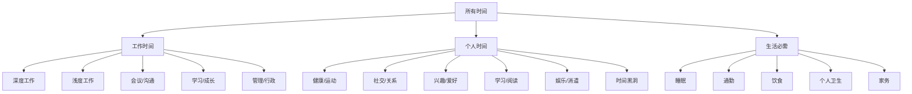
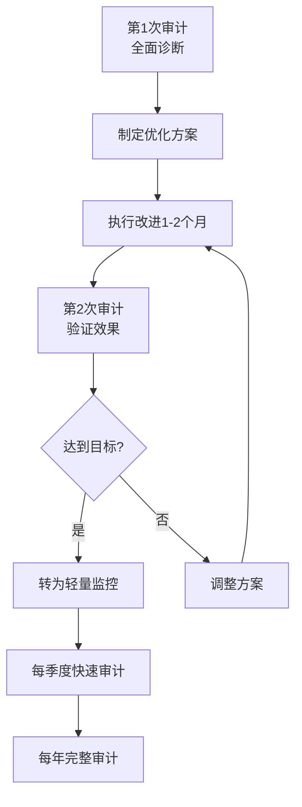

## 八、时间审计——了解你的时间去了哪里

### 8.1 为什么你需要时间审计

#### 8.1.1 时间感知的系统性偏差

人类对时间的感知存在显著的认知偏差。心理学研究表明，人们对自身时间使用情况的主观估计与客观记录之间平均存在 20%-40% 的偏差。这种偏差来源于多个认知机制：

**计划谬误（Planning Fallacy）**：诺贝尔奖得主丹尼尔·卡尼曼的研究指出，人们系统性地低估任务所需时间。你认为"回复邮件只要10分钟"，实际记录往往显示需要25-40分钟。这不是个别人的问题，而是人类认知的普遍特征。

**峰值-终值效应（Peak-End Rule）**：人们对一段经历的记忆取决于高峰时刻和结束时刻的感受，而非整体平均。因此你会记住昨天高效工作的两小时，却忽略了刷手机的一小时——因为高峰体验更鲜明。

**确认偏差**：人们倾向于选择性记忆与自我认知一致的信息。你认为自己"工作很努力"，就会记住加班的场景，忽略频繁查看社交媒体的碎片时间。

这些偏差共同作用，导致大多数人对自己的时间分配存在严重的误解。时间审计通过客观记录打破这种认知泡沫。

#### 8.1.2 时间审计的核心价值

时间审计不是为了让你焦虑，而是为了建立改进的基准线。它的核心价值体现在三个方面：

**诊断价值**：如同体检发现隐藏的健康问题，时间审计能揭示你未曾察觉的时间消耗模式。很多用户在第一次审计后惊讶地发现，自己每天在手机上花费了3-4小时——远超他们估计的1小时。

**决策价值**：审计数据让你能够基于事实而非感觉做时间分配决策。当你知道"会议占据了40%的工作时间"时，优化方向自然清晰。

**追踪价值**：定期审计（如每季度一次）可以追踪时间分配的变化趋势，验证优化措施是否有效。

#### 8.1.3 时间审计 vs 时间记录 vs 时间追踪

| 概念 | 定义 | 持续时间 | 目的 |
|------|------|----------|------|
| 时间审计 | 系统性记录+深度分析+制定改进方案 | 1-4周的集中期 | 全面诊断时间使用模式 |
| 时间记录 | 每日记录时间使用情况 | 持续进行 | 保持时间感知的准确性 |
| 时间追踪 | 使用工具自动记录特定活动 | 持续进行 | 追踪特定项目或习惯的时间投入 |

时间审计是"深度体检"，时间记录是"日常监测"，时间追踪是"专项检查"。三者互补，但本文聚焦于时间审计这一核心方法。

---

### 8.2 时间审计的理论基础

#### 8.2.1 自我监控理论

心理学家迪安·卡尔霍恩（Dean Karlan）的行为经济学研究表明，仅仅是"被观察"这个事实就能改变行为——即使是自己观察自己。这被称为"霍桑效应"的自我版本。时间审计本质上是一种结构化的自我监控，记录行为的同时就在改变行为。

研究数据：一项针对知识工作者的实验显示，开始记录时间后，参与者的"无意识时间浪费"（如无目的地浏览网页）在第一周就下降了约 30%——这不是因为记录本身有什么魔法，而是记录创造了"觉察"。

#### 8.2.2 元认知与时间管理

元认知是"对认知的认知"——你对自己思维过程的觉察能力。时间管理的本质是一种元认知活动：你需要能够"跳出来"观察自己在做什么、做得怎样、应该如何调整。

时间审计正是训练这种元认知能力的系统方法。通过定期审视自己的时间使用，你逐渐建立起对时间的"直觉"——不是盲目相信感觉，而是能够基于经验做出准确的判断。

#### 8.2.3 数据驱动的自我优化

现代生产力研究强调"量化自我"（Quantified Self）的理念：通过数据追踪和分析来优化个人表现。时间审计是这一理念在时间管理领域的具体应用。

关键原则：
- **测量先于改进**：没有数据的优化是盲目的
- **具体优于笼统**："我花了2小时在社交媒体上"比"我浪费了很多时间"更有行动指导意义
- **趋势比快照重要**：一次审计的结果不如多次审计的趋势有意义

---

### 8.3 时间审计的完整方法论

#### 8.3.1 准备阶段（审计前1-3天）

**明确审计目的**

在开始记录之前，花15分钟思考你的审计目的。不同的目的会影响记录的粒度和关注点：

| 审计目的 | 记录粒度 | 重点关注 |
|----------|----------|----------|
| 全面了解时间分配 | 15-30分钟 | 所有活动类别 |
| 诊断工作效率问题 | 15分钟 | 工作时间内的活动细分 |
| 寻找可回收的碎片时间 | 30分钟 | 低效时段和时间黑洞 |
| 验证某项优化措施的效果 | 15分钟 | 特定活动类别 |
| 平衡工作与生活 | 30分钟 | 工作/生活时间比例 |

**选择记录周期**

- **最短周期：7天（1周）** ——覆盖工作日和周末，能捕捉基本模式
- **推荐周期：14天（2周）** ——消除单周异常事件的影响，结果更稳定
- **理想周期：21-28天（3-4周）** ——足够长以发现月度模式（如月初忙、月末闲）

注意：记录周期越长，坚持的难度越大。首次审计建议从7天开始，验证可行性后再延长。

**准备记录工具**

根据你的习惯和场景选择合适的工具：

**纸质方案**：
- 准备一个小巧的随身笔记本（A6尺寸最佳）
- 提前打印好记录模板，贴在笔记本里
- 准备一支好写的笔（这点很重要，书写体验影响坚持意愿）
- 优点：无电池焦虑，书写本身有助于记忆编码
- 缺点：不便统计分析，可能遗忘

**数字方案**：
- 手机备忘录/笔记应用（最简单，零学习成本）
- 专用时间审计APP（功能更完整）
- 电子表格（Google Sheets/Excel，适合喜欢自定义的人）
- 优点：便于统计，可设置提醒
- 缺点：手机使用本身可能成为干扰

**混合方案（推荐）**：
- 日常用手机APP快速记录（便捷性）
- 每晚花5分钟整理到电子表格（分析性）
- 两者结合兼顾了便捷和深度分析的需求

#### 8.3.2 记录阶段（核心执行期）

**记录的时间粒度**

时间粒度的选择需要平衡"精确性"和"可行性"：

| 粒度 | 适用场景 | 优点 | 缺点 |
|------|----------|------|------|
| 5分钟 | 诊断特定效率问题 | 极其精确 | 记录负担大，难以坚持 |
| 15分钟 | 深度审计、效率优化 | 精确度高 | 需要较强的纪律性 |
| 30分钟 | 一般审计（推荐） | 平衡精确和可行 | 可能遗漏短暂活动切换 |
| 1小时 | 初次审计、宏观把握 | 记录轻松 | 精确度低，易遗漏细节 |
| 事件触发式 | 追踪特定活动 | 低干扰 | 不适合全面审计 |

首次审计建议使用30分钟粒度，既有足够的精确度，又不会因为记录太频繁而崩溃。

**记录的核心字段**

每条记录应包含以下信息：

必要字段：
- 时间段：开始时间 - 结束时间
- 活动描述：具体做了什么（越具体越好）
- 活动类别：预先定义好的分类

推荐字段：
- 精力水平：1-10分（1=极度疲惫，10=精力充沛）
- 是否主动：主动选择 vs 被动响应
- 是否被打断：是/否
- 满意度：1-10分（对这段时间使用的满意程度）

可选字段：
- 打断来源：同事/电话/消息/自己
- 情绪状态：积极/中性/消极
- 地点：办公室/家/通勤中

**活动分类体系**

建立一个清晰的活动分类体系是有效审计的关键。以下是推荐的分类框架：

**深度工作 vs 浅度工作的区分标准**：

深度工作（Deep Work）：需要高度认知投入、产生高价值产出的活动。特征是：
- 需要全神贯注
- 难以被他人替代
- 完成后有明显的成就感
- 例如：写方案、编程、研究、创作

浅度工作（Shallow Work）：认知要求低、通常是行政性或回应性的活动。特征是：
- 可以在分心状态下完成
- 容易被他人替代
- 完成后感受平淡
- 例如：回复邮件、填写表格、参加信息同步会议

**时间黑洞的常见类型**

时间黑洞是指你"不知不觉"就消耗了大量时间的活动。常见类型：

| 类型 | 典型表现 | 平均日消耗 |
|------|----------|-----------|
| 社交媒体 | "就看5分钟"变成30分钟 | 1-3小时 |
| 新闻/资讯 | 反复刷新闻APP，信息过载 | 30-60分钟 |
| 无效会议 | 可以邮件解决的会议 | 1-2小时 |
| 邮件/消息 | 频繁检查和回复 | 1-2小时 |
| 完美主义 | 在小事上花太多时间打磨 | 不定 |
| 决策疲劳 | 在不重要的选择上反复纠结 | 30-60分钟 |
| 无目的浏览 | 打开电脑不知道干什么，随机浏览 | 30-60分钟 |

**记录过程中的关键原则**

1. **诚实记录**：不要因为"觉得丢人"而美化记录。审计的目的是了解真相，不是自我安慰。
2. **即时记录**：尽量在活动发生时或刚结束时记录，不要攒到晚上一起补——你会遗忘和美化。
3. **不改变行为**：尽量保持正常的生活和工作节奏。审计期间刻意改变行为会让结果失真。虽然霍桑效应不可避免，但要有意识地减少主动改变。
4. **允许不完美**：漏记几条没关系，不要因为"昨天漏记了"就放弃整个审计。

**应对常见的记录障碍**

| 障碍 | 解决方案 |
|------|----------|
| "太忙了没时间记录" | 设置每30分钟的闹钟提醒，每次只花10秒 |
| "经常忘记记录" | 手机设置定时提醒，或与已有的习惯绑定（如每次喝水时记录） |
| "不知道该归什么类" | 先记录活动，类别留到晚上统一整理 |
| "周末不想记录" | 周末的记录同样重要——很多人周末的时间黑洞更大 |
| "觉得记录影响了效率" | 这正是审计的价值——让你意识到切换成本 |

#### 8.3.3 分析阶段（审计结束后1-3天）

记录期结束后，留出2-3小时的专注时间进行分析。这是整个审计过程中最关键的环节——数据本身没有价值，洞察才有价值。

**步骤一：数据整理**

将所有记录汇总到电子表格中，统一格式和分类。如果使用了多个记录工具，这一步尤为重要。

基本数据结构：

| 日期 | 时间段 | 活动 | 类别 | 时长(分钟) | 精力 | 主动 | 打断 | 满意度 |
|------|--------|------|------|-----------|------|------|------|--------|
| 6/23 | 09:00-09:30 | 写方案 | 深度工作 | 30 | 8 | 是 | 否 | 9 |
| 6/23 | 09:30-10:00 | 回复邮件 | 浅度工作 | 30 | 7 | 否 | 是 | 5 |

**步骤二：时间分配分析**

计算各活动类别的总时间和占比：

类别        | 总时长  | 占比   | 理想占比 | 差距
------------|---------|--------|----------|------
深度工作    | 12h     | 17%    | 35%      | -18%
浅度工作    | 18h     | 26%    | 15%      | +11%
会议/沟通   | 15h     | 21%    | 10%      | +11%
学习/成长   | 3h      | 4%     | 10%      | -6%
时间浪费    | 8h      | 11%    | 0%       | +11%
生活必需    | 14h     | 20%    | 20%      | 0%

这种对比分析能立即暴露问题所在。上例中，深度工作占比远低于理想值，而浅度工作和会议过多。

**步骤三：时间模式识别**

寻找重复出现的模式：

**日内模式**：你的精力和效率在一天中如何变化？

精力曲线示例：

精力水平
10 |        ╱╲
 9 |      ╱    ╲
 8 |    ╱        ╲
 7 |  ╱            ╲      ╱╲
 6 |╱                ╲  ╱    ╲
 5 |                   ╲      ╲
 4 |                           ╲
   +--+--+--+--+--+--+--+--+--+--> 时间
   7  8  9  10 11 12 13 14 15 16 17 18

典型的精力曲线呈现"双峰模式"：上午9-11点和下午3-4点是精力高峰，午后1-2点是低谷。了解自己的精力曲线后，就能把最重要的工作安排在高峰时段。

**周内模式**：哪几天效率最高/最低？很多人的周一用于"热身"和处理周末积压，周三/周四是效率高峰，周五开始下滑。

**打断模式**：
- 打断的主要来源是什么？（同事、消息、电话、自己打断自己）
- 打断集中发生在什么时间段？
- 每次打断后需要多长时间恢复？（研究表明平均需要23分钟）

**步骤四：时间黑洞深度分析**

对识别出的时间黑洞进行深入分析：

时间黑洞分析表：

黑洞类型：社交媒体
- 日均消耗：1.8小时
- 主要平台：微信（45分钟）、抖音（30分钟）、微博（25分钟）
- 触发场景：工作遇到困难时、等待时、无聊时
- 高峰时段：10:00-10:30、14:00-14:30、21:00-22:00
- 主观感受：刷完后空虚，明知不该但停不下来
- 潜在原因：逃避困难任务、缺乏休息的替代方式

**步骤五：高效时段与高效活动的交叉分析**

不同时段适合做不同类型的工作：

| 时段 | 精力水平 | 适合的活动类型 | 具体建议 |
|------|----------|---------------|----------|
| 早起后1-2小时 | 高 | 深度工作、创造性任务 | 写作、编程、策略思考 |
| 上午中段 | 中高 | 协作性工作、会议 | 团队讨论、决策会议 |
| 午后低谷 | 低 | 浅度工作、行政事务 | 回复邮件、整理文件 |
| 下午中段 | 中高 | 深度工作（第二波） | 需要专注的分析工作 |
| 傍晚 | 中 | 学习、复盘 | 阅读、总结当日工作 |
| 晚间 | 低 | 轻松活动、社交 | 阅读、休闲、家庭时间 |

**步骤六：生成洞察报告**

将以上分析汇总为一份简洁的洞察报告，包含：

1. **关键发现**（3-5条最重要的发现）
2. **时间分配概览**（饼图或表格）
3. **主要问题**（时间黑洞、低效模式）
4. **根本原因分析**（为什么会出现这些问题）
5. **改进机会**（具体可操作的优化方向）

---

### 8.4 时间审计的工具箱

#### 8.4.1 电子表格模板（通用方案）

Google Sheets 或 Excel 是最灵活的审计工具。以下是一个完整的模板结构：

**Sheet 1：每日记录**

| 时间 | 结束时间 | 活动 | 类别 | 子类别 | 时长 | 精力 | 主动 | 打断 | 打断源 | 满意度 | 备注 |
|------|----------|------|------|--------|------|------|------|------|--------|--------|------|

**Sheet 2：自动统计**

使用 SUMIF 公式自动计算各类别的总时间和占比：
=SUMIF(类别列, "深度工作", 时长列)

**Sheet 3：可视化仪表板**

使用图表自动生成：
- 时间分配饼图
- 每日精力曲线
- 一周时间热力图（以小时为单位显示活动类别）

#### 8.4.2 专用APP推荐

| 工具 | 平台 | 特点 | 适合人群 | 价格 |
|------|------|------|----------|------|
| Toggl Track | 全平台 | 一键计时，报告丰富 | 需要精确计时的专业人士 | 免费/付费 |
| RescueTime | 桌面+手机 | 自动追踪电脑/手机使用 | 想了解数字设备使用的人 | 免费/付费 |
| aTimeLogger | iOS/Android | 简洁的时间记录 | 喜欢手动记录的人 | 免费/付费 |
| Clockify | 全平台 | 团队时间追踪，功能完整 | 团队使用或需要详细报告 | 免费 |
| 时间块（TimeBloc） | iOS | 按块规划和记录时间 | 喜欢视觉化时间块的人 | 付费 |
| 番茄土豆 | iOS/Android | 番茄钟+时间记录 | 使用番茄工作法的人 | 免费/付费 |

**工具选择建议**：

如果你从未做过时间审计，建议从最简单的工具开始——手机备忘录或一张纸。工具的复杂性不应该成为开始的障碍。等你确认时间审计对你有价值后，再投资更专业的工具。

#### 8.4.3 自动化追踪方案

对于使用电脑工作的人，自动化追踪能大幅降低记录负担：

**RescueTime**：自动记录你在电脑和手机上使用的每个应用和网站，按"高效"和"分心"分类。免费版提供每日效率评分，付费版支持详细报告和目标设定。

**ActivityWatch**（开源免费）：RescueTime的开源替代品，数据完全存储在本地，隐私性更好。支持Windows、macOS、Linux。

**WakaTime**：专为程序员设计，自动追踪你在每个项目、每种编程语言上花费的时间。支持几乎所有主流IDE。

**手动+自动结合**（推荐方案）：
- 使用RescueTime/ActivityWatch自动追踪屏幕时间
- 手动记录非屏幕时间（会议、通勤、运动、社交）
- 每晚花5分钟将两者整合

#### 8.4.4 纸质记录方案

如果你偏好纸质记录，以下设计可以提高效率：

┌─────────────────────────────────────────────┐
│           时间审计快速记录卡                  │
│           日期：____年__月__日               │
├──────┬──────────┬──────┬─────┬──────────────┤
│ 时间 │  活动    │ 类别 │ 精力│    备注      │
├──────┼──────────┼──────┼─────┼──────────────┤
│ :00  │          │      │ /10 │              │
│ :30  │          │      │ /10 │              │
│ 1:00 │          │      │ /10 │              │
│ :30  │          │      │ /10 │              │
│ ...  │          │      │     │              │
│ 晚   │ 今日总结 │      │     │              │
├──────┴──────────┴──────┴─────┴──────────────┤
│ 类别代码：D=深度 S=浅度 M=会议 L=学习       │
│           W=浪费 P=生活 H=健康 X=其他       │
└─────────────────────────────────────────────┘

使用预印的类别代码可以加快记录速度——只写一个字母而非整个词。

---

### 8.5 时间审计的分析框架

#### 8.5.1 四象限分析法

将所有活动按"重要性"和"紧急性"分类，结合时间审计数据：

              重要                    不重要
         ┌──────────────────┬──────────────────┐
  紧急   │  第一象限         │  第三象限         │
         │  危机处理/截止任务│  不必要的会议     │
         │  占比：____%      │  占比：____%      │
         │  目标：15-20%     │  目标：<5%        │
         ├──────────────────┼──────────────────┤
  不紧急 │  第二象限         │  第四象限         │
         │  规划/学习/健康   │  社交媒体/闲聊    │
         │  占比：____%      │  占比：____%      │
         │  目标：60-70%     │  目标：<10%       │
         └──────────────────┴──────────────────┘

理想的时间分配应该以第二象限为主。如果你发现大量时间花在第三、四象限，说明优先级管理有严重问题。

#### 8.5.2 投入产出分析

对每项主要活动评估其"时间投入"与"价值产出"：

活动          | 周投入(小时) | 价值评分(1-10) | 效率指数 | 优先级
--------------|-------------|----------------|---------|--------
核心项目工作   | 15          | 9              | 高      | 增加
常规邮件处理   | 7           | 3              | 低      | 减少/自动化
团队周会       | 3           | 4              | 低      | 优化
专业学习       | 2           | 8              | 高      | 增加
社交媒体       | 8           | 1              | 极低    | 大幅削减

效率指数 = 价值评分 / 周投入小时数。效率指数低且投入时间多的活动是首要优化目标。

#### 8.5.3 打断成本计算

打断的成本远超直觉估计。研究表明，从被打断到恢复深度专注平均需要23分钟。假设你每天被打断10次：

直接成本：10次 × 2分钟/次 = 20分钟（打断本身的时长）
恢复成本：10次 × 23分钟/次 = 230分钟（恢复专注的时间）
总成本：250分钟 ≈ 4小时

如果你的工作日是8小时，这意味着打断可能吞噬了你50%的工作时间！

在时间审计中特别关注打断数据：
- 记录每次打断的来源
- 记录恢复专注所需的时间
- 计算打断的总成本

#### 8.5.4 精力-时间匹配度分析

将精力水平数据与活动类型数据交叉分析：

理想状态：高精力时段 → 深度工作
         中精力时段 → 浅度工作/协作
         低精力时段 → 休息/轻松活动

常见问题：
- 高精力时段被会议占据
- 低精力时段强行做深度工作（效率低且痛苦）
- 没有利用精力曲线安排工作

计算你的"精力-时间匹配度"：高精力时段中实际用于深度工作的比例。优秀水平：>70%。及格水平：>50%。

---

### 8.6 常见时间黑洞的识别与应对

#### 8.6.1 数字设备黑洞

**社交媒体**：最普遍的时间黑洞。典型模式是"就看一眼"变成30分钟无意识浏览。

应对策略：
- 使用Screen Time/数字健康功能设置应用限额
- 将社交媒体APP从主屏幕移到最后一页或文件夹深处
- 使用"灰度模式"降低手机的视觉吸引力
- 设定固定的"社交媒体时间"（如午餐后15分钟）

**即时通讯**：微信群、Slack、钉钉等即时通讯工具创造了一种"永远在线"的期待。

应对策略：
- 关闭非紧急群的通知
- 设定固定的"消息处理时间"（如每2小时集中处理一次）
- 使用"请勿打扰"模式保护深度工作时间

**新闻/资讯**：持续刷新闻创造了一种"信息焦虑"。

应对策略：
- 设定固定的新闻阅读时间（如早上15分钟）
- 取消新闻APP的推送通知
- 使用RSS订阅替代随机浏览

#### 8.6.2 工作场所黑洞

**无效会议**：研究显示，知识工作者平均每周花15小时在会议上，其中约50%被认为是浪费。

应对策略：
- 对每个会议邀请评估：我必须参加吗？能用邮件/文档替代吗？
- 推动会议改革：设定明确议程、时间限制、预期产出
- 对例行会议定期审查：这个会议还有必要吗？

**频繁切换**：在多个任务之间频繁切换导致大量的"切换成本"。

应对策略：
- 使用"时间块"方法：将相似的任务集中处理
- 设定"免打扰时间"：每天至少2小时的不被打断时间
- 关闭不必要的通知

**行政杂务**：报销、填表、整理文件等低价值事务。

应对策略：
- 批量处理：每周固定一个时段处理所有行政事务
- 自动化：能自动化的绝不手动
- 委派：能委派的绝不自己做

#### 8.6.3 心理黑洞

**拖延**：不是"懒"，而是对困难任务的情绪逃避。

应对策略：
- 识别拖延的触发器（通常是恐惧、焦虑或完美主义）
- 使用"2分钟启动法"：承诺只做2分钟，利用启动效应继续
- 将大任务分解为小步骤

**完美主义**：在不重要的细节上花太多时间。

应对策略：
- 区分"够好"和"完美"——对80%的任务，80分就是满分
- 设定时间限制：给每个任务一个"截止时间"，到了就停
- 使用"帕累托原则"：20%的努力产生80%的价值

**决策疲劳**：在不重要的选择上反复纠结。

应对策略：
- 对日常决策建立固定流程（如固定早餐、固定穿衣风格）
- 重要的决策安排在精力最好的时段
- 使用"2分钟规则"：如果一个决策2分钟内能做完，立刻做

---

### 8.7 时间审计的优化策略

#### 8.7.1 基于审计结果的时间重分配

分析完成后，制定具体的时间重分配计划：

当前状态 → 目标状态 → 行动方案

深度工作：12h/周(17%) → 25h/周(35%)
  行动：
  1. 每天上午9-11点设为"深度工作时间"，关闭所有通知
  2. 将3个不必要的会议改为异步沟通
  3. 每周预留2个下午作为"项目推进时间"

浅度工作：18h/周(26%) → 10h/周(14%)
  行动：
  1. 邮件处理集中到每天3个固定时段
  2. 使用模板回复常见邮件
  3. 行政事务集中在周五下午批量处理

时间浪费：8h/周(11%) → 2h/周(3%)
  行动：
  1. 社交媒体设置每日30分钟限额
  2. 删除手机上的新闻APP
  3. 将"碎片时间"用于阅读而非刷手机

#### 8.7.2 建立时间预算

基于审计数据，为下一个月制定"时间预算"——预先分配每类活动的目标时间：

月度时间预算（工作时间，按周计算）

类别          | 目标小时/周 | 占比  | 策略
--------------|-----------|-------|------------------
深度工作      | 25        | 35%   | 上午时间块保护
浅度工作      | 10        | 14%   | 批量处理
会议/沟通     | 8         | 11%   | 精简会议
学习/成长     | 5         | 7%    | 每天1小时
管理/行政     | 4         | 6%    | 周五集中处理
缓冲时间      | 10        | 14%   | 应对突发和打断
休息/恢复     | 10        | 14%   | 午休和短暂休息

注意预留10-15%的"缓冲时间"——零缓冲的日程注定失败，因为总有意外发生。

#### 8.7.3 建立反馈循环

时间审计不是一次性的活动，而是一个持续改进的循环：

**短期反馈**：每周花30分钟回顾本周时间使用情况，与预算对比
**中期反馈**：每月做一次快速审计（3-5天），追踪改进趋势
**长期反馈**：每季度做一次完整审计（2周），评估总体进展

---

### 8.8 不同人群的时间审计要点

#### 8.8.1 知识工作者

核心关注点：
- 深度工作 vs 浅度工作的比例
- 会议效率和必要性
- 邮件/消息处理的模式
- 多任务切换的频率

典型发现：
- 深度工作时间通常只占工作日的20-30%（理想应为50%+）
- 每天查看邮件的次数远超必要（研究显示平均77次/天）
- 大部分会议可以缩短一半或取消

#### 8.8.2 创业者/自由职业者

核心关注点：
- 收入产生活动 vs 行政事务的比例
- 客户工作 vs 自我提升的平衡
- 工作与生活的边界

典型发现：
- 实际产生收入的时间可能只占"工作时间"的30-40%
- 大量时间花在"感觉在工作但没有产出"的活动上
- 缺乏结构化的工作时间导致效率低下

#### 8.8.3 学生

核心关注点：
- 学习时间的质量（专注 vs 分心）
- 课外活动的时间分配
- 社交媒体和娱乐的时间控制

典型发现：
- "学习3小时"可能实际有效学习时间只有1-1.5小时
- 社交媒体使用时间往往被严重低估
- 碎片时间（如课间）没有被有效利用

#### 8.8.4 全职父母

核心关注点：
- 家务劳动的实际时间投入
- "自己的时间"有多少
- 照顾孩子的时间中哪些是高质量陪伴

典型发现：
- 家务时间比想象中多得多
- "碎片时间"几乎全部被占用
- 缺乏连续的个人时间导致疲惫

---

### 8.9 进阶技巧：从审计到系统化管理

#### 8.9.1 自动化时间审计

如果你已经进行了多次手动审计，可以考虑建立自动化系统：

**技术方案**：
- RescueTime + Zapier + Google Sheets：自动将屏幕时间数据同步到电子表格
- ActivityWatch + Python脚本：自动生成每周时间报告
- IFTTT/快捷指令：基于位置或WiFi自动记录活动类别（如到公司自动标记"工作"）

**自动化审计的局限**：
- 只能追踪数字设备的使用
- 无法区分"深度工作"和"浅度工作"（都可能在用电脑）
- 需要定期手动校准

#### 8.9.2 时间审计与OKR结合

将时间审计数据与OKR（目标与关键结果）对齐：

O：提升工作效率
  KR1：深度工作时间从12h/周提升到25h/周
  KR2：会议时间从15h/周降低到8h/周
  KR3：每日社交媒体使用控制在30分钟以内

追踪方式：
- 每周审计数据与KR对比
- 每月评估KR达成趋势
- 每季度调整目标

#### 8.9.3 团队时间审计

如果你是团队管理者，可以组织团队时间审计来发现系统性问题：

实施步骤：
1. 全员进行1-2周的时间审计
2. 汇总团队数据，识别共同问题
3. 分析组织层面的时间黑洞（如过多的审批流程、无效的例会）
4. 制定团队层面的优化措施
5. 3个月后再次审计，追踪改善效果

---

### 8.10 常见误区与纠正

**误区一："我大概知道自己时间花在哪里，不需要记录"**

事实：研究表明，人们对自身时间使用的估计平均偏差30%以上。你觉得"大概知道"往往是错觉。只有实际记录才能揭示真相。

**误区二："记录太麻烦了，坚持不下来"**

事实：每条记录只需要10-15秒。设置每30分钟的闹钟提醒，一天下来也就花5-8分钟在记录上。比起它带来的洞察，这个投入非常值得。如果觉得麻烦，说明你选的工具或粒度不对——降低粒度到1小时，或用更简单的工具。

**误区三："审计一周就够了"**

事实：一周的数据可能被特殊事件扭曲（如恰好这周有个紧急项目）。至少审计2周才能看到稳定模式。理想情况是4周。

**误区四："审计完了就不用再做了"**

事实：时间使用模式会随着生活阶段、工作内容、季节变化而改变。建议每季度做一次快速审计（3-5天），每年做一次完整审计（2周）。

**误区五："审计的目的是把每一分钟都利用起来"**

事实：休息、发呆、闲逛都是有价值的——它们是创造力和恢复力的来源。审计的目的不是消灭"空闲时间"，而是确保时间花在你真正在乎的事情上，包括有意识的休息。

**误区六："数字工具比纸质好"**

事实：最好的工具是你真正会用的工具。很多人买了高级APP却三天后放弃，不如用纸笔坚持完整个审计期。工具的先进性远不如坚持性重要。

---

### 8.11 实战案例

#### 案例一：互联网产品经理的时间审计

**背景**：小王是一名互联网公司的产品经理，工作3年，总觉得"忙但没有成果"。

**审计数据（2周）**：

类别          | 日均时长 | 占比
--------------|---------|------
会议          | 3.5h    | 44%
回复消息/邮件 | 1.5h    | 19%
写PRD/深度思考| 1.0h    | 13%
处理突发需求  | 1.0h    | 13%
学习/阅读     | 0.5h    | 6%
其他          | 0.5h    | 6%

**关键发现**：
1. 44%的时间在会议上，但其中60%的会议他不是核心参与者
2. 深度工作只占13%，且全部发生在上午10点前——因为10点后不断有会议和打断
3. 消息回复频率：平均每12分钟检查一次微信/钉钉

**优化措施**：
1. 与PM沟通，将非核心会议改为"可选出席"或"会后同步纪要"
2. 每天上午9-11点设为"深度工作时间"，关闭消息通知
3. 消息处理改为每2小时集中处理一次
4. 将部分PRD写作移到早上8-9点（提前到公司）

**3个月后复审结果**：
- 会议时间：3.5h → 2h（减少43%）
- 深度工作：1.0h → 2.5h（增加150%）
- 主观满意度：从4/10提升到8/10
- 工作产出：季度PRD完成数量从4个提升到7个

#### 案例二：自由职业设计师的时间审计

**背景**：小李是一名自由平面设计师，收入不稳定，经常感觉"时间不够用"。

**审计数据（2周）**：

类别          | 周均时长 | 占比
--------------|---------|------
实际设计工作   | 15h     | 25%
客户沟通       | 10h     | 17%
寻找新客户     | 8h      | 13%
行政事务       | 6h      | 10%
社交媒体       | 8h      | 13%
无效工作时间   | 7h      | 12%
其他           | 6h      | 10%

**关键发现**：
1. 实际产生收入的设计工作只占25%
2. 社交媒体8小时/周——比"寻找新客户"的时间还多
3. "无效工作时间"（打开电脑不知道干什么、在多个项目间反复切换）高达7小时
4. 客户沟通大量时间花在"来回确认需求"上

**优化措施**：
1. 社交媒体限额：工作日1小时/天，周末2小时/天
2. 制作标准化的需求确认问卷，减少客户沟通时间
3. 使用时间块方法：每天上午为设计时间，下午处理沟通和行政
4. 使用Toggl追踪"实际设计时间"，设定每周目标

**3个月后复审结果**：
- 实际设计工作：15h → 22h（增加47%）
- 社交媒体：8h → 4h（减少50%）
- 月收入：提升约35%
- 工作总时长：反而减少了5小时/周

---

### 8.12 时间审计的长期维护

#### 8.12.1 从审计到习惯

完成2-3次完整审计后，你可以建立一些轻量级的日常习惯来维持时间意识：

**每日习惯**（5分钟）：
- 晚上花5分钟回顾今天的时间使用
- 问自己：今天最有价值的3件事是什么？最大的时间浪费是什么？

**每周习惯**（30分钟）：
- 周日晚上花30分钟回顾本周
- 对比时间使用与计划的差距
- 调整下周的时间安排

**每月习惯**（2小时）：
- 选择一个工作日进行快速审计
- 分析当月的时间使用趋势
- 调整时间预算

#### 8.12.2 建立时间仪表板

如果你是数据驱动型的人，可以建立一个个人时间仪表板：

┌─────────────────────────────────────────────────┐
│           个人时间仪表板 - 第26周                │
├─────────────────────────────────────────────────┤
│                                                 │
│  深度工作：22h ████████████████░░░░ 目标25h     │
│  会议：8h     ████████░░░░░░░░░░░░ 目标8h      │
│  学习：4h     ████░░░░░░░░░░░░░░░░ 目标5h      │
│  运动：3h     ███░░░░░░░░░░░░░░░░░ 目标4h      │
│  屏幕时间：   ██████████████████░░ 5.2h/天     │
│                                                 │
│  效率评分：7.5/10  满意度：8/10                  │
│                                                 │
│  本周亮点：连续3天保持2h深度工作时间块           │
│  待改进：周三下午的精力低谷处理不当              │
└─────────────────────────────────────────────────┘

#### 8.12.3 时间审计的生命周期

---

### 8.13 核心要点回顾

1. **时间审计是所有时间管理改进的起点**——你无法优化你没有测量的东西
2. **人类对时间的感知存在系统性偏差**——只有客观记录才能揭示真相
3. **记录周期至少2周**，首次审计建议从7天开始
4. **分析比记录更重要**——数据本身没有价值，洞察才有价值
5. **关注深度工作占比**——这是衡量时间使用质量的核心指标
6. **识别并应对时间黑洞**——它们是改进空间最大的领域
7. **建立精力-时间匹配**——把最重要的工作安排在精力最好的时段
8. **预留缓冲时间**——零缓冲的日程注定失败
9. **定期复审**——时间审计不是一次性的，而是持续改进的循环
10. **最好的工具是你真正会用的工具**——不要让工具选择成为开始的障碍

时间审计的本质是一种"时间觉察力"的训练。当你能够准确感知自己的时间去了哪里，你就能做出真正有效的改变。开始你的第一次审计吧——你可能会对自己发现的东西感到惊讶。
