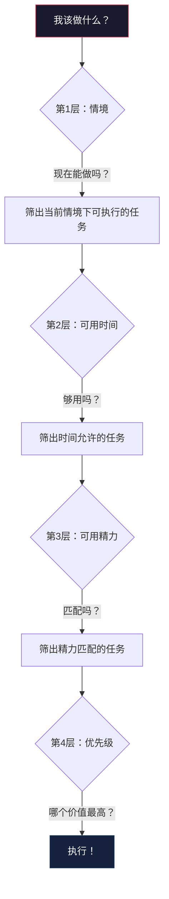

## 九、GTD方法实战方案

GTD的五个步骤——收集、理清、组织、回顾、执行——在理论层面并不复杂（详见本章基础理论第四节）。真正困难的是从"读完一本书"到"每天都在用"之间的鸿沟。本节的目标就是帮你跨越这条鸿沟：不谈理论，只谈怎么落地。

> 本节定位：如果你还没读过基础理论部分的"GTD方法论——无压工作的系统"，建议先回去读一遍。本节假设你已经理解了GTD的核心理念和五个步骤，专注于"怎么把它变成你日常生活的一部分"。

### 9.1 实施前的三个关键准备

很多人尝试GTD失败，不是因为方法有问题，而是因为跳过了准备阶段。在开始之前，你需要做好三件事。

#### 9.1.1 心理准备：接受"不完美系统"

David Allen 在《Getting Things Done》第二版中反复强调：GTD的目标不是建立一个完美的系统，而是一个"足够好且你愿意维护"的系统。

具体含义：

- **不要在选工具上花两周时间。** 工具是手段，不是目的。一张纸+一支笔就能运行GTD。选工具的时间不应超过1小时。
- **不要期望第一天就完全上手。** GTD有一个学习曲线，通常需要4-6周才能形成稳定习惯。前两周的混乱是正常的。
- **不要照搬别人的系统。** 你的工作性质、生活节奏、认知偏好都和别人不同。GTD提供的是框架，具体实现因人而异。

#### 9.1.2 时间准备：预留启动时间

GTD有一个"启动成本"——你需要一段不被打扰的时间来完成初始设置。

| 阶段 | 所需时间 | 具体任务 |
|------|----------|----------|
| 大脑清空 | 1.5-3小时 | 把所有"未完成事项"写下来，目标：100-300项 |
| 系统搭建 | 1-2小时 | 选择工具，创建清单结构 |
| 第一次理清 | 2-4小时 | 对大脑清空的结果逐项处理 |
| 第一次每周回顾 | 1-2小时 | 完整走一遍回顾流程 |

建议安排在一个周末的上午，总共预留6-8小时。不要觉得"太多"——这是你未来几年效率系统的地基。

#### 9.1.3 工具准备：选择你的GTD载体

工具选择的核心原则是"最低可行复杂度"——先用最简单的工具跑通流程，再根据需要升级。

**工具选择决策矩阵：**

| 你的情况 | 推荐工具类型 | 具体推荐 |
|----------|-------------|----------|
| 刚入门，不确定是否长期使用 | 纸笔 | 方格笔记本 + 便利贴 |
| 日常任务以数字工作为主 | 待办清单App | Todoist、滴答清单、Microsoft To Do |
| 需要团队协作 | 项目管理工具 | Notion、飞书文档、Trello |
| 追求极致自动化 | 专业GTD工具 | Omnifocus（Mac/iOS）、MyLifeOrganized（Windows） |
| 极简主义者 | 纯文本 | Markdown文件 + VS Code，或纯文本文件 |

**各工具类型的优劣对比：**

| 维度 | 纸笔 | 待办App | 专业GTD工具 | 纯文本 |
|------|------|---------|------------|--------|
| 上手难度 | 极低 | 低 | 中高 | 低 |
| 情境分类 | 手动翻页 | 标签/筛选 | 原生支持 | 手动搜索 |
| 回顾支持 | 弱 | 中 | 强 | 中 |
| 跨设备同步 | 不支持 | 支持 | 支持 | 需要配置 |
| 灵活性 | 高 | 中 | 中 | 极高 |
| 维护成本 | 低 | 低 | 中 | 低 |

### 9.2 第一步：收集——建立你的"捕获网"

收集是GTD的入口。你的捕获网越可靠，你的大脑就越放松。关键不是"用什么收"，而是"无论在哪里产生想法，都能在5秒内记录下来"。

#### 9.2.1 设计你的收集点

David Allen建议收集点控制在3-5个。原因很简单：收集点越多，你越容易遗漏某个入口，系统可信度就会下降。

**典型的知识工作者收集点设计：**

| 收集点 | 捕获内容 | 工具 | 清空频率 |
|--------|----------|------|----------|
| 随身携带 | 行走/通勤时的灵感、对话中产生的待办 | 手机备忘录/语音备忘录 | 每日 |
| 工作桌面 | 工作中冒出的想法、同事口头交代的事 | 桌面便签/速记本 | 每日 |
| 电子邮件 | 来自邮件的任务和信息 | 邮件客户端收件箱 | 每日 |
| 数字收集箱 | 阅读、浏览网页时的想法 | 微信收藏/稍后读工具 | 每周 |
| 实体收件箱 | 纸质文件、快递、传单 | 桌面物理收件盒 | 每周 |

#### 9.2.2 收集的实操技巧

**技巧一：降低记录摩擦**

记录动作的每一步额外操作都会降低你记录的意愿。对比：

- 不好的流程：解锁手机 → 找到App → 打开 → 新建任务 → 输入标题 → 选分类 → 保存（7步）
- 好的流程：按住快捷键 → 说话 → 松手（3步）
- 最好的流程：拿起笔，在预先打开的笔记本上写一行（2步）

具体做法：
- iOS用户：设置"辅助功能→辅助触控"或使用Siri语音创建提醒事项
- Android用户：使用桌面小组件，一键添加任务
- 纸笔用户：随身携带口袋笔记本（推荐A6尺寸），或用手机壳背面夹一张卡片

**技巧二：使用"触发词清单"帮助全面收集**

第一次大脑清空时，很多人会遗漏事项。David Allen提供了一份"大脑清空检查清单"，按生活领域逐项检查：

【工作领域】
- 当前项目（列出每个项目的名称）
- 每个项目"卡住"的原因是什么
- 需要和谁沟通什么事情
- 有哪些承诺还没有兑现
- 有哪些会议/报告/截止日期在逼近

【个人领域】
- 健康：体检、运动计划、饮食调整
- 财务：账单、投资、保险、税务
- 家庭：维修、装修、家庭活动、家人需求
- 社交：要联系的人、要还的人情、要参加的活动
- 学习：想读的书、想学的技能、想考的证
- 娱乐：想去的地方、想看的电影、想尝试的爱好

【环境领域】
- 家里每个房间有什么需要处理的
- 车/出行工具需要什么维护
- 办公桌/工作区有什么需要整理的

**技巧三：处理"模糊想法"**

很多时候，你脑子里的不是一个明确的任务，而是一种模糊的焦虑："那个项目好像有什么问题……"。对这类想法，记录时加上一个前缀标记 `[模糊]`，在理清阶段再深入追问：

- 这个想法背后，我真正担心的是什么？
- 这件事需要我采取什么具体行动？
- 如果这件事已经完美解决了，会是什么样子？

### 9.3 第二步：理清——建立决策流水线

理清是GTD中最消耗脑力的环节，也是最不能省略的环节。每一个收集项都必须经过理清，否则收集箱就会变成"另一个堆积杂物的抽屉"。

#### 9.3.1 理清的标准流程

对每一个收集项，按顺序问自己以下问题。这个流程不是建议，而是必须严格执行的决策树：

收集项 → 这是什么？
       → 它需要行动吗？
       
  不需要行动 ─┬→ 有价值但不需要行动？→ 归档到参考资料
              ├→ 将来可能需要？→ 放入"将来/也许"清单
              └→ 没有任何价值？→ 删除（垃圾/回收站）
              
  需要行动 ───→ 能在2分钟内完成吗？
  
              能 → 立刻执行，不记录
              
              不能 → 应该由我来做吗？
              
                     不是 → 委托给具体的人
                            → 记录到"等待"清单
                            → 设置跟进提醒
                            
                     是 → 这个结果需要多步骤吗？
                     
                           不需要 → 记录到"下一步行动"清单
                                    → 按情境分类
                                    
                           需要 → 这是一个"项目"
                                    → 记录到"项目"清单
                                    → 定义项目的"成功画面"
                                    → 确定下一步具体行动
                                    → 下一步行动记入对应清单

#### 9.3.2 "下一步行动"的精确定义

GTD中最常见的错误是把"下一步行动"写得太大、太模糊。正确的下一步行动应该是一个"物理动作"——你的身体需要做的具体事情。

| 错误写法（太模糊） | 正确写法（具体物理动作） |
|---|---|
| 处理报销 | 打开电脑，登录报销系统，填写上周三的出租车发票（金额47元） |
| 准备周报 | 打开上周的周报模板，填入本周完成的三个项目名称和进度百分比 |
| 联系客户 | 给李经理发微信，确认下周二下午3点的演示会议室是否可用 |
| 学英语 | 打开"多邻国"App，完成今天的第一课（约15分钟） |
| 整理书房 | 把书桌上不属于书房的三样东西（快递盒、水杯、充电线）归位 |

判断标准：如果你看到这个任务描述，不需要再想"具体要做什么"，就能直接开始行动——这就是一个合格的下一步行动。

#### 9.3.3 理清的实操节奏

- **日常理清：** 每天花10-15分钟清空当天的收集箱。最佳时机是每天工作结束前的最后15分钟。
- **批量理清：** 如果积压了大量收集项（比如休假回来），安排一个1-2小时的专注时段一次性处理。
- **处理顺序：** 先处理最新的（通常最紧迫），再处理最旧的（如果放了很久都不重要，大概率可以直接删除）。

### 9.4 第三步：组织——搭建你的清单架构

组织的目标是让每一个待办事项都能在正确的时机被看到。不是"分得越细越好"，而是"在你需要做决定时，只看到相关选项"。

#### 9.4.1 清单体系的完整搭建方案

**核心清单（必须有）：**

| 清单名称 | 存放内容 | 刷新节奏 | 关键操作 |
|----------|----------|----------|----------|
| 收集箱 | 未经处理的原始想法 | 每日清空 | 理清后移出 |
| 下一步行动 | 每个情境下可立即执行的动作 | 每日检查 | 按情境筛选查看 |
| 项目清单 | 所有需要2步以上完成的结果 | 每周检查 | 确保每个项目有下一步行动 |
| 等待清单 | 委托他人、等待回复的事项 | 每周跟进 | 到期未回复则主动催促 |
| 将来/也许清单 | 目前不执行但不想丢弃的想法 | 每月审视 | 激活或删除 |
| 日程表 | 有硬性时间要求的事项 | 每日查看 | 只放"必须在该时间做的事" |

**辅助清单（可选，根据需要添加）：**

| 清单名称 | 存放内容 | 适用人群 |
|----------|----------|----------|
| 阅读清单 | 待读的文章、书籍 | 需要大量阅读的知识工作者 |
| 采购清单 | 需要购买的物品 | 线上线下混合购物的人 |
| 讨论清单 | 需要和特定人讨论的话题 | 需要频繁一对一沟通的管理者 |
| 健康清单 | 运动计划、饮食记录、医疗预约 | 关注健康管理的人 |

#### 9.4.2 情境标签的现代设计

David Allen最初提出的情境标签（@办公室、@电话、@家）是基于2001年的工作模式。在远程办公和移动办公普及的今天，情境需要重新设计。

**现代情境标签体系：**

| 情境标签 | 含义 | 典型场景 |
|----------|------|----------|
| @深度工作 | 需要25分钟以上不间断专注的任务 | 写报告、编程、设计方案 |
| @快速处理 | 5分钟内能完成的简单任务 | 回复消息、审批流程、确认信息 |
| @沟通 | 需要和他人互动才能推进的事 | 打电话、发邮件、开会讨论 |
| @外出 | 需要离开当前场所才能完成的事 | 取快递、见客户、办事 |
| @电脑 | 必须在电脑前完成的事 | 填表格、做PPT、调代码 |
| @手机 | 只需手机就能完成的事 | 回微信、刷待办、记笔记 |
| @低能量 | 精力低谷期也能做的简单事 | 整理文件、清理邮件、归档资料 |

**设计原则：**
- 情境标签不超过7个。超过7个，大脑在选择时会产生决策疲劳。
- 每个情境标签必须有明确的判断标准（"我什么时候应该看这个清单？"）。
- 情境标签反映的是"工具/精力/场所约束"，不是"主题分类"。

#### 9.4.3 "日程表"的正确使用

日程表是GTD中最容易被滥用的清单。David Allen对日程表有严格的使用规则：

**日程表只放三类事项：**
1. **硬性约会：** 必须在特定时间出现的（会议、约见、航班）
2. **硬性截止日期：** 必须在该日完成的（提交报告、缴纳税款）
3. **需要在特定日期看到的信息：** "某人的生日"、"签证到期提醒"

**日程表不放的东西：**
- "希望今天做完的事" → 放在下一步行动清单
- "如果有多余时间想做的事" → 放在下一步行动清单
- "需要尽快处理的事" → 放在下一步行动清单

原因：如果你把大量任务放进日程表，日程表就会变成一个"永远完不成的待办清单"，你会对它产生心理免疫——反正也完不成，干脆不看了。这会导致真正的硬性约会也被忽视。

### 9.5 第四步：回顾——系统的生命线

没有回顾的GTD系统会在2-3周内崩溃。这不是夸张——David Allen的培训数据显示，超过70%的GTD新手在停止每周回顾后的两周内完全放弃系统。

#### 9.5.1 每日回顾（5-10分钟）

**最佳时机：** 每天工作开始前（规划当天）或工作结束前（清空当天）

**每日回顾清单：**

□ 查看日程表
  - 今天有哪些固定时间的约会/会议？
  - 有没有需要提前准备的事项？

□ 检查收集箱
  - 有没有新的收集项需要理清？
  - 目标：清空或标记为"已处理"

□ 扫视"下一步行动"清单
  - 今天必须完成的是哪2-3件？（标记为"今日重点"）
  - 有哪些快要到期或超期的？

□ 快速检查"等待"清单
  - 有没有今天需要跟进的回复？

#### 9.5.2 每周回顾（45-90分钟）

每周回顾是GTD系统的核心习惯。它不是一个可选项——它是GTD区别于普通待办清单的关键所在。

**推荐时间：** 周五下午（为下周做准备）或周日晚上（为下周做规划）。选一个你最不容易被打扰的时间段，并把它当作一个固定约会写入日程表。

**每周回顾完整流程：**

**阶段一：清空（15分钟）**

1. 清空所有收集点
   □ 物理收件箱 → 处理或归档每一件物品
   □ 邮件收件箱 → 处理到零封或标记为"已读"
   □ 手机备忘录 → 逐条理清
   □ 语音备忘录 → 逐条理清
   □ 桌面便签/速记本 → 逐条理清
   □ 微信收藏/稍后读 → 逐条理清

**阶段二：更新清单（20分钟）**

2. 回顾"下一步行动"清单
   □ 已完成的 → 标记完成或删除
   □ 不再相关的 → 删除
   □ 超过一周未执行的 → 分析原因（太大？不重要？缺条件？）
   
3. 回顾"项目"清单
   □ 每个项目是否都有明确的下一步行动？（没有的 → 补上）
   □ 项目是否还需要继续？（不再需要的 → 关闭）
   □ 有没有新的项目需要添加？
   
4. 回顾"等待"清单
   □ 已收到回复的 → 标记完成
   □ 超过约定时间未回复的 → 设置跟进提醒
   □ 检查是否有过期的委托需要提醒对方
   
5. 回顾"将来/也许"清单
   □ 有没有想激活为正式项目的？
   □ 有没有不再感兴趣的？（删除）
   □ 有没有需要更新描述的？

**阶段三：前瞻（10分钟）**

6. 查看未来两周的日程表
   □ 有没有需要提前准备的约会/会议？
   □ 有没有需要协调的日程冲突？
   □ 有没有需要提前预订的资源（会议室、机票、酒店）？

7. 回顾长期目标和愿景（可选，建议每月至少一次）
   □ 当前的项目和行动是否指向你的长期目标？
   □ 有没有被忽略的重要领域（健康、关系、成长）？

#### 9.5.3 每月回顾（1-2小时）

在每月最后一个周末，除了执行完整的每周回顾外，增加以下内容：

- 审视过去一个月完成的项目，提取经验教训
- 检查"将来/也许"清单中是否有可以启动的项目
- 回顾自己的年度目标，评估进度
- 调整情境标签体系（如果某些标签长期为空，考虑合并或删除）
- 检查工具是否需要优化（换个App、调整清单结构等）

#### 9.5.4 "回顾失败"的应急方案

如果你已经连续两周没有做每周回顾，不要试图"补上"两周的回顾——那会让你更加抵触。正确做法：

1. **接受损失。** 过去两周的系统状态已经不可靠了。
2. **做一次"迷你大脑清空"。** 花30分钟，把当前脑子里所有未完成的事项重新写下来。
3. **只处理最关键的。** 从中挑出3-5件最重要/最紧急的，作为本周的行动重点。
4. **重建系统。** 花30分钟清理现有清单，删除明显过时的项目，补充缺失的下一步行动。
5. **下周恢复正常回顾。** 不要自责，直接回到节奏。

### 9.6 第五步：执行——在正确的时间做正确的事

执行是GTD的最终产出。前面四个步骤都是为了让这一刻更轻松——你不需要在100件事中纠结"现在做什么"，因为你的系统已经按情境、时间、精力帮你做了初步筛选。

#### 9.6.1 执行决策的四层过滤器

当你要决定"现在做什么"时，按顺序应用以下过滤器：

**各层过滤器的操作说明：**

**第1层——情境过滤：** 看你当前所在的情境标签，只看那个标签下的任务。在@办公室的清单里选任务，不要看@家的清单。

**第2层——时间过滤：** 你有多少可用时间？如果接下来30分钟就要开会，不要选一个需要90分钟的任务。选一个能在25分钟内完成的。

**第3层——精力过滤：** 评估你当前的精力水平（1-10分）：
- 精力8-10分：选择需要深度思考的复杂任务
- 精力5-7分：选择中等难度的常规任务
- 精力1-4分：选择简单的执行性任务（整理、归档、回复简单消息）

**第4层——优先级过滤：** 在通过前三层过滤的任务中，问自己："如果今天只能完成一件事，我应该做哪件？"答案就是你的选择。

#### 9.6.2 处理"选择瘫痪"

即使有了系统，有时你仍然会站在清单前不知道选哪个。这通常有两个原因：

**原因一：清单太长。** 一个情境下超过15个待选项就会让大脑不堪重负。
- 解决方案：在每天开始时预选3-5个"今日重点"，执行时只看这个短名单。

**原因二：都是"重要但不紧急"的事。** 没有任何外力推动你选择其中一个。
- 解决方案：用"10-10-10法则"——想象10分钟后、10个月后、10年后的自己，哪个任务在三个时间尺度上都让你觉得"做了更好"？选它。

#### 9.6.3 常见执行场景的处理策略

**场景一：突然被塞了一个紧急任务**

GTD的处理方式：
1. 先花30秒理清：这个任务真正的下一步行动是什么？
2. 如果真正紧急，替换当前任务（不是"加到清单最前面"，而是"替换"）
3. 被替换的任务放回清单，不是丢弃
4. 紧急任务完成后，检查它是否产生新的下一步行动（紧急任务往往有后续）

**场景二：一个任务你已经拖延了一周以上**

这通常意味着以下四种情况之一：
1. **下一步行动太大** → 把它拆成更小的动作，第一步只需要5分钟
2. **你其实不想做这件事** → 认真审视它是否真的需要你做，考虑委托或删除
3. **缺少必要条件** → 把"获得条件"作为新的下一步行动（"给IT部门发邮件申请权限"）
4. **它没有明确的下一步行动** → 这不是拖延，是理清阶段的遗漏。重新理清。

**场景三：一天结束时只完成了计划的一半**

这是正常的。David Allen说："你的待办清单不是承诺，而是选项。"每天能完成计划的60-70%已经很好了。未完成的任务留在清单上，明天继续选择。

### 9.7 GTD与其他方法的融合

GTD不是一个封闭系统，它可以和其他时间管理方法搭配使用。以下是经过验证的组合方案：

#### 9.7.1 GTD + 番茄工作法

**融合方式：** 用GTD管理"做什么"，用番茄工作法管理"怎么做"。

- 从GTD的@深度工作清单中选择任务
- 设定25分钟番茄钟，全身心投入
- 5分钟休息后，决定是继续同一任务还是切换
- 每4个番茄钟后，长休息15-20分钟

**适用场景：** 需要大量专注工作的知识工作者（程序员、写作者、设计师）。

#### 9.7.2 GTD + 艾森豪威尔矩阵

**融合方式：** 在GTD的"执行"阶段引入四象限思维。

- 每天早上，从GTD的"下一步行动"清单中，按四象限分类
- 第一象限（重要紧急）：立即执行
- 第二象限（重要不紧急）：安排到日程表，确保有专门时间
- 第三象限（紧急不重要）：优先考虑委托
- 第四象限（不重要不紧急）：审视是否应该删除

**注意：** David Allen本人反对在GTD中使用传统的优先级标签（A/B/C或1/2/3），因为他的执行决策模型已经用"情境-时间-精力"替代了优先级。但实践表明，对某些人来说，在执行选择时增加一个优先级维度能提高决策速度。如果你发现自己经常选择"容易但不重要"的任务，试试加入四象限过滤。

#### 9.7.3 GTD + 时间块规划

**融合方式：** 用GTD管理任务库，用时间块规划管理日程。

- 保持GTD清单体系不变
- 每天早上，从清单中选择任务，分配到具体的时间块
- 时间块之间留10-15分钟缓冲
- 如果某个时间块的任务提前完成，从清单中选择下一个

**这样做的好处：** 纯GTD的一个批评是"它帮你管理任务，但不帮你管理时间"——你可能在低价值任务上花太多时间。时间块规划弥补了这个短板。

### 9.8 不同职业的GTD定制方案

#### 9.8.1 程序员/技术人员

| GTD环节 | 定制建议 |
|---------|---------|
| 收集 | GitHub Issues作为代码任务收集箱；IDE的TODO注释作为代码内的收集点 |
| 情境标签 | @编码（需要IDE的深度工作）、@审查（Code Review）、@调试（排错）、@文档（写技术文档）、@学习（学新技术） |
| 项目定义 | 每个功能开发是一个项目；每个Bug修复的下一步行动是"在IDE中复现Bug" |
| 回顾 | 每周回顾时检查所有在途分支，确保每个分支都有明确的下一步 |
| 与工具集成 | 将GTD清单和Jira/Linear同步，避免两套系统维护 |

#### 9.8.2 管理者/团队负责人

| GTD环节 | 定制建议 |
|---------|---------|
| 收集 | 会议笔记直接进入收集箱；1:1对话中承诺的事项立即记录 |
| 情境标签 | @会议（需要团队互动）、@一对一（和特定成员沟通）、@战略（需要深度思考的管理决策）、@审批（需要你签字/批准的流程） |
| 等待清单 | 管理者最大的GTD价值在于"等待"清单——你能追踪每个下属的交付物，而不用在脑子里记住 |
| 项目定义 | 团队目标拆解为项目；每个项目的第一步通常是"和某某开会对齐目标" |

#### 9.8.3 自由职业者/创业者

| GTD环节 | 定制建议 |
|---------|---------|
| 收集 | 客户沟通渠道（微信、邮件、电话）都是收集入口；收入相关的想法优先记录 |
| 情境标签 | @客户工作（交付类任务）、@业务开发（找新客户）、@行政（财务、合同、发票）、@内容创作（写文章、录视频） |
| 将来/也许 | 自由职业者的"将来/也许"清单特别重要——它是你的"商业创意库" |
| 每周回顾 | 必须包含"收入检查"——本周有多少项目在推进？下一笔收入来自哪里？ |

### 9.9 常见实施失败的诊断与修复

#### 9.9.1 失败模式一：收集了但不清空

**症状：** 收集箱里积压了50+条待处理项，一看就头疼，越来越不想打开。

**根因：** 理清的启动成本太高——你没有预留专门的时间，导致每次看到收集箱都是在"来不及处理"的时候。

**修复方案：**
1. 每天设置一个固定闹钟（建议下午5点），标记为"5分钟清箱"
2. 闹钟响了就花5分钟处理收集箱——不需要全部清空，处理5条就好
3. 如果5条都处理不了，说明你的理清流程需要简化——可能是在"下一步行动"上想太久了

#### 9.9.2 失败模式二：有清单但不看

**症状：** 清单建好了，但每天的行动全凭感觉和临时需求，根本不会主动去看清单。

**根因：** 清单不在你的工作流必经之路上。你需要一个"触发机制"。

**修复方案：**
1. 把待办App放在手机主屏幕第一屏、第一个位置
2. 把"查看清单"绑定到一个你已经在做的习惯上（比如"倒完咖啡后看清单"）
3. 电脑端设置浏览器主页为待办清单网页版
4. 使用物理提醒：在显示器边缘贴一张纸，写上"先看清单"

#### 9.9.3 失败模式三：每周回顾坚持不下来

**症状：** 做了两周回顾，然后连续三周不做，系统逐渐失灵。

**根因：** 回顾没有被当作"不可协商的约会"。

**修复方案：**
1. 把每周回顾写入日程表，设为"忙碌"状态，就像一个真正的会议
2. 找一个"回顾搭档"——你们同时做回顾，做完后互相分享1-2个发现（社会承诺的力量）
3. 回顾地点固定——不要在你平时工作的地方做回顾，换一个环境（咖啡馆、客厅沙发）
4. 奖励自己——完成回顾后给自己一个小奖励（一杯好咖啡、一集喜欢的剧）

#### 9.9.4 失败模式四：系统越来越复杂

**症状：** 标签越来越多，清单越来越碎，花在维护系统上的时间比执行任务还多。

**根因：** 你把"完善系统"当成了一个项目，并且它没有终点。

**修复方案：**
1. 设定"系统冻结期"——在接下来的一个月内，不允许添加新的标签、清单或工具
2. 做一次"系统审计"——检查每个标签/清单，过去两周是否有使用？没有的合并或删除
3. 记住David Allen的话："系统越简单，你越会用它。系统越复杂，你越会逃避它。"

### 9.10 GTD进阶：从"用"到"精通"

#### 9.10.1 掌握"自然计划法"

David Allen提出了五阶段的"自然计划法"（Natural Planning Model），用于将模糊的想法转化为清晰的项目计划。当你发现一个项目"卡住了"，通常是因为在某个阶段偷工减料了。

| 阶段 | 问题 | 示例 |
|------|------|------|
| 1. 定义目标和原则 | 这个项目成功的标准是什么？为什么要做？ | "在6月30日前完成产品上线，用户可以注册和使用核心功能" |
| 2. 愿景/成功画面 | 如果项目完美成功，会是什么样子？ | "上线首周有1000个注册用户，零级严重Bug" |
| 3. 头脑风暴 | 要实现这个愿景，需要考虑哪些方面？ | 列出所有想法，不判断不筛选 |
| 4. 组织整理 | 这些想法如何分类？依赖关系是什么？按什么顺序执行？ | 按时间线排列，标注依赖关系 |
| 5. 下一步行动 | 第一步具体做什么？ | "给设计团队发邮件，确认UI稿的交付时间" |

#### 9.10.2 建立"水平审视"和"垂直审视"的双重视角

**水平审视（Horizon Focus）：** 定期从高处俯瞰你所有的项目和承诺，确保方向一致。

David Allen定义了六个"高度"：

| 高度 | 关注内容 | 回顾频率 |
|------|----------|----------|
| 5万英尺 | 人生目标和使命 | 每年 |
| 4万英尺 | 3-5年愿景 | 每季度 |
| 3万英尺 | 1-2年目标 | 每月 |
| 2万英尺 | 责任领域（工作、家庭、健康等） | 每月 |
| 1万英尺 | 当前项目清单 | 每周 |
| 跑道 | 下一步行动 | 每日 |

**垂直审视（Vertical Focus）：** 深入到单个项目，用"自然计划法"推动进展。

两者的交替使用能确保你既不会"只见树木不见森林"（只做眼前的事），也不会"只见森林不见树木"（只有愿景没有行动）。

#### 9.10.3 GTD的"心流"状态

当你的GTD系统运行顺畅时，你会进入一种David Allen称为"Mind Like Water"的状态——对每一刻该做什么有清晰的判断，既不焦虑未来，也不纠结过去。这不是一个需要努力维持的状态，而是系统可信之后的自然结果。

达到这个状态的标志：
- 你能随时说出自己最重要的3个项目是什么
- 你不会在半夜突然想起"忘了做某件事"
- 别人临时塞给你任务时，你能在30秒内决定"现在做"还是"记下来"
- 你在休息时是真正放松的，不是"身体在休息，脑子在跑清单"

### 9.11 本节核心要点回顾

| 阶段 | 关键行动 | 时间投入 |
|------|----------|----------|
| 启动准备 | 大脑清空 + 工具选择 + 系统搭建 | 一次性6-8小时 |
| 日常维护 | 每日收集→理清→执行 | 每天15-20分钟 |
| 系统维护 | 每周回顾 | 每周45-90分钟 |
| 战略校准 | 每月回顾 + 高度审视 | 每月1-2小时 |

GTD不是一个需要"学习"然后"使用"的工具——它是一个需要"练习"然后"内化"的思维方式。前4周你会觉得它增加了工作量，但从第6周开始，你会感受到它带来的清晰感和掌控感。坚持到那个时候，你就不会再想回到从前的混乱状态了。

***
