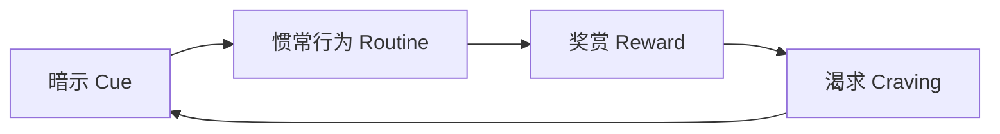
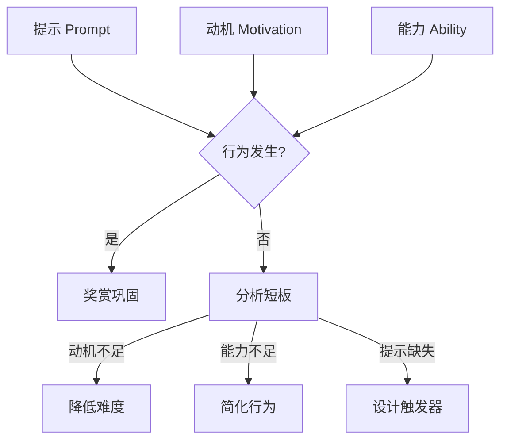
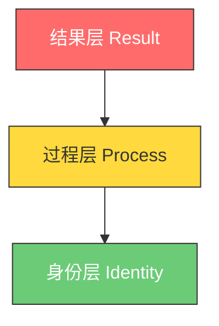

## 十、习惯养成实践方案

习惯是时间管理的终极武器。当一个行为变成习惯，它不再消耗意志力，不再需要决策，而是像呼吸一样自然运行。查尔斯·杜希格在《习惯的力量》中指出：习惯占据我们日常行为的 40% 以上。这意味着，如果你能掌控习惯，你就掌控了将近一半的人生。

本章将从习惯的底层机制出发，提供一套完整的习惯养成方法论——从建立好习惯到戒除坏习惯，从理论原理到每日实操，帮助你将时间管理真正内化为本能。

### 10.1 习惯的底层机制：理解大脑如何运行习惯

#### 10.1.1 习惯回路：暗示→惯常行为→奖赏

MIT 研究人员在 20 世纪 90 年代发现，习惯在大脑中形成了一条固定的神经通路，称为「习惯回路」（Habit Loop）：

三个组成部分各自的作用：

| 组成部分 | 定义 | 示例（早起跑步） |
|---------|------|-----------------|
| **暗示（Cue）** | 触发行为的信号，可以是时间、地点、情绪、前置动作或特定人物 | 闹钟响起（时间暗示）、看到床边的跑鞋（视觉暗示） |
| **惯常行为（Routine）** | 接收到暗示后自动执行的动作序列 | 穿上跑鞋→出门→跑步 30 分钟 |
| **奖赏（Reward）** | 完成行为后获得的满足感，驱动大脑判断是否值得重复 | 跑步后的内啡肽快感、晨间清新的空气、成就感 |

理解这个回路的意义在于：你可以**设计**暗示和奖赏来塑造行为，而不是靠意志力硬撑。当一个习惯的暗示足够明确、奖赏足够诱人时，行为会自动发生。

#### 10.1.2 基底神经节：习惯的存储器

大脑的基底神经节（Basal Ganglia）是习惯的物理存储位置。当一个行为从「刻意执行」变成「自动运行」时，大脑的活动模式会发生根本转变：

- **学习阶段**：前额叶皮层高度活跃，负责决策和注意力
- **习惯化后**：前额叶皮层活动降低，基底神经节接管，行为变成「自动驾驶」

这个转变解释了为什么习惯一旦形成就很难打破——你不是在对抗一个行为，而是在对抗大脑的物理结构重组。好消息是，同样的机制也意味着好习惯一旦建立，维护成本极低。

#### 10.1.3 习惯形成的平均周期：66 天而非 21 天

伦敦大学学院 Phillippa Lally 等人 2009 年发表在《欧洲社会心理学杂志》的研究表明：

- 一个新习惯的自动化程度达到稳定水平，平均需要 **66 天**
- 不同习惯的形成时间差异极大：从 18 天到 254 天不等
- 复杂习惯（如每天做 50 个俯卧撑）比简单习惯（如每天喝一杯水）需要更长时间
- 偶尔错过一天并不会显著影响习惯形成进程

**核心结论**：不要相信「21 天养成习惯」的鸡汤。给自己至少 2-3 个月的时间，并做好心理准备——复杂习惯可能需要 8 个月以上。

### 10.2 微习惯策略：让开始变得毫无阻力

BJ·福格（BJ Fogg）博士是斯坦福大学行为设计实验室的创始人，他的「微习惯」策略是目前被验证最有效的习惯养成方法之一。核心理念是：**把新习惯缩小到不可思议的程度，让「开始」变得毫无阻力。**

#### 10.2.1 行为公式 B=MAP

福格行为模型的核心公式：

**行为（Behavior）= 动机（Motivation）+ 能力（Ability）+ 提示（Prompt）**

当三者同时具备时，行为就会发生。微习惯的精髓在于**大幅降低能力门槛**，使得即使动机很低的时候，行为也能发生：

| 你的目标 | 常规做法 | 微习惯版本 |
|---------|---------|-----------|
| 每天运动 | 跑步 30 分钟 | 穿上跑鞋，走到门口 |
| 每天阅读 | 读 30 页 | 翻开书，读 1 页 |
| 每天写作 | 写 1000 字 | 打开文档，写 1 句话 |
| 每天冥想 | 冥想 15 分钟 | 坐下来，深呼吸 1 次 |
| 每天学英语 | 背 50 个单词 | 打开 APP，看 1 个单词 |

#### 10.2.2 习惯叠加公式

习惯叠加（Habit Stacking）是利用已有习惯作为新习惯的暗示，公式为：

> **在我 [已有习惯] 之后，我会 [新微习惯]**

具体示例：

- 「在我早上泡咖啡之后，我会做 1 个俯卧撑」
- 「在我坐到办公椅上之后，我会打开工作日志写下今天的 3 个优先任务」
- 「在我刷完牙之后，我会做 1 分钟的拉伸」
- 「在我关掉电脑之后，我会整理桌面 30 秒」
- 「在我坐地铁之后，我会打开播客听 5 分钟」

习惯叠加的关键规则：
1. **锚定习惯必须已经稳定存在**——不要叠加到一个你自己还不确定的习惯上
2. **新习惯必须足够小**——小到你几乎没有理由不做
3. **暗示必须具体明确**——「每天早上」太模糊，「在我喝完第一口水之后」才够具体

#### 10.2.3 庆祝：即时情绪强化

福格方法中被低估但极其关键的一步：**在完成微习惯后，立刻给自己一个积极的情绪反馈。**

庆祝方式可以是：
- 在心里对自己说「太棒了！」
- 挥一下拳头
- 露出微笑
- 默默说一句「我是那种坚持运动的人」

这个看似幼稚的动作有严肃的神经科学依据：**情绪是习惯形成的催化剂**。当你在完成行为后立刻产生积极情绪，大脑会更快地将该行为标记为「值得重复」，从而加速习惯回路的形成。

#### 10.2.4 微习惯的进阶：自然扩展

当微习惯稳定运行 2-4 周后，你会发现一个自然现象：你经常超额完成。因为「开始」的阻力已经几乎为零，一旦开始，你往往会继续做下去。

**注意：不要主动提高目标。** 微习惯的最低标准保持不变，但你允许自己多做。区别在于：
- ❌ 错误做法：第一周要求做 1 个俯卧撑，第二周提高到 10 个
- ✅ 正确做法：保持目标是 1 个，但你可以选择做 20 个

最低标准是你的安全网——即使在最糟糕的日子，你也不会失败。

### 10.3 身份驱动的习惯养成：从「我要做什么」到「我要成为谁」

#### 10.3.1 三个层次的习惯改变

詹姆斯·克利尔（James Clear）在《原子习惯》中提出，习惯改变发生在三个层次：

| 层次 | 关注点 | 示例 |
|------|-------|------|
| **结果层** | 我想要什么 | 「我想减肥 10 斤」 |
| **过程层** | 我要做什么 | 「我要每天跑步」 |
| **身份层** | 我要成为谁 | 「我是一个热爱运动的人」 |

大多数人的改变是从外向内（结果→过程→身份），但最持久的改变是从内向外（身份→过程→结果）。

#### 10.3.2 身份驱动的操作方法

**第一步：定义你想要的身份**
- 不要想「我想戒烟」，而要想「我不是一个吸烟的人」
- 不要想「我想读书」，而要想「我是一个终身学习者」
- 不要想「我想减肥」，而要想「我是一个注重健康的人」

**第二步：用每个小行动为身份投票**
- 每做 1 个俯卧撑，就是为「我是一个运动者」投了一票
- 每读 1 页书，就是为「我是一个阅读者」投了一票
- 每存 100 块钱，就是为「我是一个理财者」投了一票

**第三步：累积证据，重塑自我认知**
习惯养成的过程不是一次性的改变，而是**无数次投票的累积**。每一个微小的行动都是一个数据点，持续证明你就是你想成为的那种人。

### 10.4 环境设计：让正确的事情成为最容易的事

#### 10.4.1 让好习惯更容易

人类行为严重依赖环境线索。设计环境的目标是**减少好习惯的摩擦力**：

**物理空间重组：**

| 好习惯 | 环境设计策略 |
|--------|------------|
| 每天运动 | 前一晚把运动服叠好放在床边，醒来第一眼就看到 |
| 每天阅读 | 把书放在你最常坐的沙发/枕头旁，手机放到另一个房间 |
| 每天写作 | 提前打开写作软件，保持文档页面常驻 |
| 每天喝水 | 在桌上放一个大水杯，提前装满水 |
| 每天弹吉他 | 把吉他从盒子里拿出来，放在支架上，放在客厅中央 |
| 健康饮食 | 周末花 2 小时切好蔬菜和水果，分装到透明容器中放冰箱门口 |

**数字环境重组：**
- 把学习 APP 放在手机主屏幕第一屏，社交 APP 移到第三屏
- 设定手机「专注模式」，自动屏蔽干扰 APP
- 把常用的网站加入书签栏，把容易分心的网站用屏蔽插件限制
- 设置浏览器主页为工作/学习相关页面

#### 10.4.2 让坏习惯更困难

同样的道理反过来：**增加坏习惯的摩擦力**。你不需要完全消灭坏习惯，只需要让它变得足够麻烦，大多数人就会放弃。

| 坏习惯 | 增加摩擦力的方式 |
|--------|-----------------|
| 睡前刷手机 | 在卧室门外放一个带锁的手机盒，睡前锁进去 |
| 吃零食 | 不买零食回家。如果已经买了，放到最高的柜子里，需要搬凳子才够得到 |
| 无节制刷短视频 | 卸载 APP，只在电脑浏览器上使用（登录更麻烦，体验更差） |
| 工作时看社交媒体 | 使用 Cold Turkey 或 Freedom 屏蔽，设置复杂密码让朋友保管 |
| 熬夜 | 设定路由器定时关闭（晚上 11:30 自动断网） |

**承诺设备（Commitment Device）** 是一种预先做出的决策，限制未来的选择：
- 把钱存入定期存款，到期前无法取出
- 在朋友面前宣布目标，利用社交压力
- 使用 StickK 等网站，失败就捐款给讨厌的机构
- 删除外卖 APP，只保留需要自己做饭的食材配送服务

#### 10.4.3 环境设计的「一进一出」规则

每当引入一个新的好习惯物品（如健身器材、书籍），就移除一个旧的坏习惯物品（如遥控器、零食罐）。保持环境中的「积极信号」密度逐渐增加。

### 10.5 习惯追踪与可视化

#### 10.5.1 日历链法（Don't Break the Chain）

喜剧演员杰瑞·宋飞（Jerry Seinfeld）的方法：在日历上标记每个完成习惯的日子，形成一条连续链条。你的唯一任务就是——**不要让链条断掉**。

操作方法：
1. 打印一张月历，贴在你每天能看到的地方
2. 每天完成习惯后，在当天的格子上画一个大大的 ✗
3. 连续的 ✗ 形成视觉链条，产生不想断链的心理压力
4. 即使状态不佳，也完成最低版本，保持链条不断

#### 10.5.2 习惯追踪表设计

设计一个有效的追踪表需要包含以下要素：

| 要素 | 说明 | 示例 |
|------|------|------|
| 习惯名称 | 具体、可执行的行为描述 | 「做 1 个俯卧撑」而非「锻炼」 |
| 最低标准 | 最低完成标准（微习惯） | 1 个俯卧撑 |
| 暗示/触发器 | 什么情况下执行 | 「早上起床后」 |
| 追踪方式 | 如何记录完成情况 | 勾选框/日历/APP |
| 反思空间 | 每周回顾的记录区 | 「本周感受」「遇到的障碍」 |

#### 10.5.3 数字工具推荐

| 工具名称 | 平台 | 特点 | 适合场景 |
|---------|------|------|---------|
| **Habitica** | iOS/Android/Web | 游戏化设计，完成习惯获得经验值 | 喜欢游戏机制的用户 |
| **Loop Habit Tracker** | Android | 开源、简洁、数据图表丰富 | 安卓用户，偏数据分析 |
| **Streaks** | iOS/Apple Watch | 最多追踪 12 个习惯，界面精美 | 苹果生态用户 |
| **Notion** | 全平台 | 可高度自定义，结合日记/笔记 | 已在使用 Notion 的用户 |
| **纸质日历** | 无 | 无干扰，物理存在感强 | 不想增加屏幕时间的用户 |

#### 10.5.4 核心规则：永不连续错过两次

偶尔错过一天是正常的——研究表明，单次中断不会显著影响习惯形成。真正致命的是**连续错过两次**，因为第二次缺席会大幅降低第三次执行的概率，形成「破窗效应」。

应对策略：
- **第一道防线**：完成最低标准（哪怕只做 1 个俯卧撑）
- **第二道防线**：如果今天完全错过，明天无论如何必须完成最低标准
- **第三道防线**：记录错过的原因，分析模式，调整暗示或环境

### 10.6 打破坏习惯的系统方法

#### 10.6.1 坏习惯的四层解构

要打破坏习惯，首先要理解它为什么存在——每个坏习惯都在满足某种需求。盲目压制只会让需求以其他方式爆发。

| 层次 | 分析内容 | 示例（深夜刷手机） |
|------|---------|------------------|
| **表层行为** | 你做了什么 | 躺在床上刷短视频 2 小时 |
| **即时奖赏** | 行为满足了什么 | 多巴胺刺激、逃避无聊、暂时忘掉压力 |
| **深层需求** | 真正需要什么 | 放松、社交连接、自主感 |
| **替代方案** | 如何满足需求 | 阅读小说（放松）、打电话给朋友（社交）、规划明天的自由时间（自主） |

#### 10.6.2 四步打破坏习惯

**第一步：识别暗示（Identify the Cue）**

记录每次坏习惯发生时的五要素：
1. **时间**：几点发生的？
2. **地点**：在哪里？
3. **情绪状态**：当时的心情如何？
4. **周围有谁**：独自一人还是有人陪伴？
5. **前置行为**：做这个之前在做什么？

连续记录 1-2 周，你会发现固定的模式——这就是暗示。

**第二步：重新设计环境（Redesign the Environment）**

移除或阻断暗示：
- 如果暗示是「看到手机」→ 把手机放到另一个房间
- 如果暗示是「感到无聊」→ 在手边放一个替代品（书、拼图、健身器材）
- 如果暗示是「特定时间」→ 在那个时间段安排其他活动

**第三步：替换而非消除（Replace, Don't Remove）**

大脑很难「不做某事」，但可以「做另一件事」。直接消除坏习惯会留下一个行为真空，最终往往被另一个坏习惯填补。

替换行为设计原则：
- 替换行为必须满足**同样的深层需求**
- 替换行为的**摩擦力不能太高**
- 替换行为必须**无害或有益**

| 坏习惯 | 深层需求 | 有效替换 |
|--------|---------|---------|
| 压力大时吃零食 | 口腔刺激 + 舒缓情绪 | 嚼口香糖 + 5 分钟深呼吸 |
| 无聊时刷短视频 | 新鲜感 + 多巴胺 | 听播客/有声书（同获新信息但可做其他事） |
| 社交焦虑时逃避 | 减少不适感 | 写日记梳理情绪 + 设定最小社交目标 |
| 疲劳时喝第三杯咖啡 | 提神 + 仪式感 | 短暂午休 + 泡一杯花茶 |

**第四步：逐步加码（Gradually Escalate）**

对于难以一步戒除的习惯（如吸烟、酗酒），使用逐步替代法：
1. 第 1-2 周：减少频率（从每天一包减到半包）
2. 第 3-4 周：替换成低害替代品（电子烟、尼古丁贴片）
3. 第 5-8 周：进一步降低依赖（减少替代品使用）
4. 第 9 周起：完全戒断 + 新习惯巩固

### 10.7 社会环境与问责机制

#### 10.7.1 社会规范的力量

人类是社会性动物，我们的行为深受周围人的影响。研究表明：

- 如果你的朋友肥胖，你肥胖的概率增加 **57%**
- 如果你的同事工作努力，你努力工作的概率显著提高
- 在安静的图书馆，你自然不会大声喧哗

**策略：主动选择你的环境。** 你想养成什么习惯，就去找已经在做那件事的人。

#### 10.7.2 问责伙伴（Accountability Partner）

找一个志同道合的人，互相监督执行情况：

| 问责机制 | 具体做法 |
|---------|---------|
| **每日打卡** | 每天在固定时间向对方汇报完成情况 |
| **每周回顾** | 每周日花 15 分钟通话，回顾本周习惯执行情况 |
| **预付惩罚** | 预先给对方一笔钱，未完成就归对方所有 |
| **共同挑战** | 设定 30 天挑战，两人同步执行，互相激励 |

#### 10.7.3 公开承诺

在社交媒体上公开宣布你的目标，或加入相关的社群/小组。公开承诺的力量在于：
- 社交压力让你更难放弃
- 进展分享获得正向反馈
- 社群中的榜样提供持续动力
- 遇到困难时有人提供经验和建议

### 10.8 实战：30 天习惯养成路线图

以下是具体的 30 天执行计划，你可以套用到任何新习惯上：

#### 第一阶段：准备期（第 1-3 天）

Day 1: 定义身份
  - 写下你想成为的人：「我是一个____的人」
  - 选择 1 个最能体现该身份的习惯
  - 将习惯缩微到最低标准（2 分钟规则）

Day 2: 设计环境
  - 列出习惯的暗示（时间、地点、前置动作）
  - 准备所需工具和材料
  - 移除可能的障碍物
  - 设置环境触发器

Day 3: 预演
  - 完整执行一次微习惯
  - 确认流程顺畅
  - 调整不合理的细节
  - 开始习惯追踪表

#### 第二阶段：启动期（第 4-10 天）

每天执行流程：
  1. 接收暗示 → 触发行为
  2. 完成最低标准（微习惯）
  3. 庆祝（积极情绪反馈）
  4. 在追踪表上标记完成
  5. 允许自己超额完成，但不要强制

关键注意：
  - 第 4-7 天是放弃高峰期，提前做好心理准备
  - 不要追求完美，追求「不断链」
  - 如果某天错过，次日必须完成最低标准

#### 第三阶段：巩固期（第 11-21 天）

新增动作：
  - 开始记录感受和发现
  - 识别容易失败的情境，提前制定应对方案
  - 如有需要，引入问责伙伴
  - 保持最低标准不变，自然扩展

周回顾模板：
  1. 本周完成率是多少？
  2. 哪些天最难？为什么？
  3. 哪些天最容易？为什么？
  4. 有什么意外发现？
  5. 下周想尝试什么调整？

#### 第四阶段：内化期（第 22-30 天）

重点任务：
  - 停止依赖外部追踪，感受行为的「自动化」程度
  - 评估是否可以适度提高标准
  - 如果 30 天完成率 > 80%，开始规划下一个习惯
  - 如果完成率 < 60%，继续巩固，不急于添加新习惯

成功标准：
  - 完成率 > 80%：习惯初步建立，继续保持
  - 完成率 60-80%：习惯正在形成，需要微调
  - 完成率 < 60%：需要重新审视暗示、环境或习惯难度

### 10.9 常见误区与纠正

#### 误区一：一次建立太多习惯

**错误做法**：同时开始每天跑步、读书、冥想、学英语、写日记。
**正确做法**：一次只专注于 1-2 个习惯。当第一个习惯变得自动化后（通常 6-8 周），再添加下一个。

#### 误区二：过度依赖意志力

**错误做法**：用「坚持就是胜利」硬撑，不调整策略。
**正确做法**：意志力是有限资源。如果一个习惯需要每天消耗大量意志力，说明你没有正确设计暗示、降低难度或提供足够的奖赏。调整策略，而非加大意志力投入。

#### 误区三：追求完美执行

**错误做法**：某天没做到完美标准就认为失败，直接放弃。
**正确做法**：完成最低标准就是成功。1 个俯卧撑 > 0 个俯卧撑。质量可以逐渐提高，但中断才是真正的敌人。

#### 误区四：忽略身份层面的改变

**错误做法**：只关注行为和结果，「我要每天跑 5 公里」。
**正确做法**：从身份出发，「我是一个跑者」。身份认同带来持久的行为一致性——即使在没有外部监督的情况下。

#### 误区五：不记录、不回顾

**错误做法**：凭感觉判断自己做得好不好。
**正确做法**：数据不会说谎。追踪完成率、记录感受、每周回顾——这些是调整策略的唯一可靠依据。

#### 误区六：忽视环境因素

**错误做法**：把所有失败归咎于自控力不足。
**正确做法**：大多数习惯失败是环境设计问题，而非意志力问题。改变环境比改变人性容易一万倍。

### 10.10 高级策略与进阶技巧

#### 10.10.1 习惯叠加链（Habit Stacking Chain）

将多个习惯串联成一个固定流程，形成「晨间惯例」或「晚间惯例」：

晨间惯例示例：
  6:30  闹钟响 → 喝一杯水（暗示→微习惯 1）
  6:32  喝完水 → 做 5 个俯卧撑（习惯 1→习惯 2）
  6:35  做完俯卧撑 → 冷水洗脸（习惯 2→习惯 3）
  6:37  洗完脸 → 写今日 3 个最重要任务（习惯 3→习惯 4）
  6:42  写完任务 → 开始第一个任务（习惯 4→深度工作）

每个环节的完成就是下一个环节的暗示，整条链在 15-20 分钟内完成，但建立了 4-5 个好习惯。

#### 10.10.2 习惯评分卡

定期对所有习惯进行评分，决定保留、调整或淘汰：

| 习惯 | 是否满足身份认同？ | 执行频率？ | 带来的改变？ | 决策 |
|------|-------------------|-----------|------------|------|
| 每日冥想 | 是 | 每天 | 明显降低焦虑 | 保留并提高 |
| 每周画画 | 否 | 偶尔 | 没有明显变化 | 淘汰 |
| 早起跑步 | 是 | 每天 | 体能提升明显 | 保留 |

#### 10.10.3 「如果-那么」应急预案

提前为可能的失败情境制定应对方案（心理学中称为「实施意图」Implementation Intentions）：

- **如果**今天加班到很晚没时间跑步 → **那么**我会在办公室做 5 分钟拉伸
- **如果**出差在外没有健身房 → **那么**我会在酒店房间做自重训练
- **如果**感冒发烧无法运动 → **那么**我会用这段时间阅读健身相关书籍
- **如果**心情极度低落不想做任何事 → **那么**我会完成最低标准然后允许自己休息

研究表明，提前制定「如果-那么」计划的人，习惯完成率比没有计划的人高 **2-3 倍**。

#### 10.10.4 习惯的季节性调整

人的精力和生活节奏随季节变化，习惯策略也应该灵活调整：

- **春季**：适合建立新习惯，精力逐渐恢复
- **夏季**：户外运动习惯更容易坚持，但注意不要因为假期打乱节奏
- **秋季**：适合建立室内学习和阅读习惯
- **冬季**：降低标准，保持最低版本不断链，不要在低谷期挑战高难度习惯

### 10.11 本章小结

习惯养成的核心不是意志力，而是**系统设计**。回顾本章的关键原则：

1. **理解机制**：习惯 = 暗示 + 惯常行为 + 奖赏，大脑通过重复将行为自动化
2. **从微小开始**：将习惯缩小到不可思议的程度，降低「开始」的阻力
3. **身份先行**：从「我要成为谁」出发，每个小行动都是为新身份投票
4. **设计环境**：让好习惯成为最容易的选择，让坏习惯变得麻烦
5. **追踪不断链**：记录完成情况，永不连续错过两次
6. **系统化打破坏习惯**：识别暗示、重新设计环境、替换行为、逐步加码
7. **利用社会力量**：问责伙伴、公开承诺、选择正确的社交圈
8. **提前制定应急预案**：「如果-那么」计划让意外情况不再成为借口

最终，习惯养成的目标不是成为一个自律的机器人，而是**让你想成为的那个人变成默认状态**。当好的行为变成习惯，你不再需要「坚持」——它就是你。
