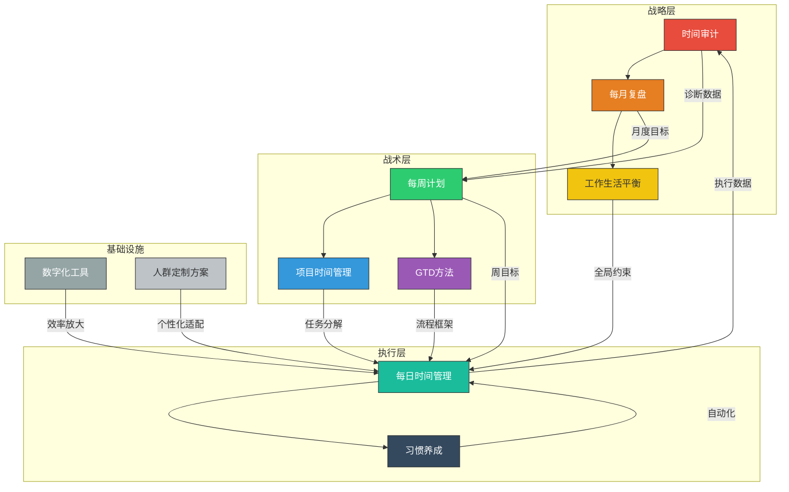

## 十一、本节总结

本节用了十个篇幅，从每日执行到长期习惯，构建了一套完整的时间管理实践方案体系。这不是十个独立的方法，而是一个层层嵌套的操作系统——每日管理是基础单元，每周/每月回顾是校准机制，项目管理是复杂任务的分解器，工作生活平衡是全局约束条件，数字化工具是效率杠杆，人群定制是个性化适配，时间审计是诊断工具，GTD是流程框架，习惯养成是终极自动化。本节将这些模块串联为一个可落地的完整系统。

### 11.1 十个模块的核心要义回顾

#### 11.1.1 每日时间管理——最小执行单元

每日管理是所有时间管理系统的落地层。无论你采用何种宏观框架，最终都必须回答"今天这24小时怎么过"。

**核心要点：**

- **认识昼夜节律**：人的认知能力在一天中并非均匀分布。起床后2-4小时是认知峰值时段，午后1-3点是低谷期。晨型人（约40%）峰值在上午8-11点，夜型人（约30%）峰值在上午10点-下午1点。关键是识别自己的峰值时段并在该时段安排深度工作
- **晨间仪式**：从睡眠到工作的可控过渡区间。五大要素——身体激活（15-20分钟）、心智校准（10-15分钟）、目标对齐（5-10分钟）、日程审视（3-5分钟）、环境启动（3-5分钟）。设定"最小版本"（10分钟）和"完整版本"（45分钟），根据当天情况切换
- **每日计划框架**：从简单到复杂依次为三只青蛙法（锁定3件最重要的事）、1-3-5法则（1件大事+3件中事+5件小事）、时间块计划法（将全天划分为任务区块）。建议从三只青蛙法入门，坚持两周后再升级
- **四象限法则实操**：核心不是分类本身，而是通过主动管理第二象限（重要不紧急）来减少未来的第一象限（重要且紧急）。健康的时间分配目标是第二象限占65-70%
- **番茄工作法**：标准25+5模式，核心铁律是不可分割原则和打断记录法。深度写作/编程建议45-50分钟，ADHD人群建议10-15分钟
- **日终回顾**：五个维度——完成度、能量曲线、打断分析、洞察教训、明日规划。10分钟的回顾投资能解除蔡格尼克效应，为明天提供真实数据
- **中断管理**：自我中断占44%（用打断记录法+环境设计）、他人中断占44%（信号系统+可访问时段+异步沟通）、系统中断占12%（通知大扫除+批量处理）

**关键数据：** 知识工作者平均每11分钟被打断一次，恢复专注状态平均需要23分钟。如果你每小时被中断3次，可能有超过一半的工作时间处于"半专注"状态。

#### 11.1.2 每周计划——承上启下的校准节点

周计划连接着每日执行和月度目标，是时间管理系统中最关键的校准频率。

**核心要点：**

- 周日晚上或周一早上花30-45分钟制定本周计划
- 回顾上周完成情况，识别未完成任务的原因
- 确定本周的3-5个核心目标，分配到具体日期
- 预留20-30%的弹性空间应对突发事件
- GTD每周回顾是周计划的高级形式，包含清单清理、项目审视、下一步行动更新

**关键数据：** 坚持每周计划的人，目标达成率比不做周计划的人高出约42%（基于FranklinCovey的组织效能研究）。

#### 11.1.3 每月复盘——战略层面的时间审视

月度复盘从战术层面上升到战略层面，关注的是方向而非速度。

**核心要点：**

- 每月最后一个工作日花1-2小时进行深度复盘
- 四个审视维度：目标进度（本月目标完成了多少）、时间分配（实际时间分配与计划是否一致）、能量状态（整体精力水平如何）、关键事件（本月最值得记住的事件和教训）
- 运用"继续做/停止做/开始做"框架制定下月改进计划
- 将月度发现反馈到季度和年度目标中

**关键数据：** 只有3%的成年人会写下自己的目标，但研究显示写下目标的人比不写的人成就高出约42%（哈佛/耶鲁目标研究，尽管具体数据存在争议，方向性结论被广泛验证）。

#### 11.1.4 项目时间管理——复杂任务的系统分解

当任务超过一天的容量，就需要项目管理思维。

**核心要点：**

- **五步法**：定义范围→分解任务→估算时间→排定顺序→执行追踪
- **任务分解原则**：每个子任务应该能在1-4小时内完成；如果不能，继续拆分
- **关键路径识别**：找出决定项目总时长的任务链，优先保障关键路径上的资源
- **进度追踪**：使用燃尽图或看板追踪实际进度与计划的偏差
- **里程碑设置**：每3-5天设置一个可交付的里程碑，避免"最后才发现偏离"

**关键数据：** 项目管理协会（PMI）的研究显示，使用正式项目管理方法的项目按时完成率约为73%，而未使用的方法仅为39%。

#### 11.1.5 工作与生活平衡——全局约束条件

平衡不是50/50的时间均分，而是在当前人生阶段有意识地分配注意力和精力。

**核心要点：**

- **重新定义平衡**：从"静态天平"转向"动态整合"。创业期工作70%、育儿期家庭60%、稳定期均衡50/50——这些都是平衡的
- **四大支撑原则**：平衡是动态过程（像骑自行车）、质量重于数量（2小时深度陪伴>5小时心不在焉）、边界是核心机制（没有边界工作会填满所有缝隙）、能量管理优先于时间管理
- **边界建立的实操方法**：物理边界（专门的工作空间）、时间边界（明确的工作时段）、数字边界（工作设备与个人设备分离）、心理边界（下工仪式）
- **能量管理四维度**：身体能量（运动、睡眠、饮食）、情绪能量（积极关系、感恩练习）、心智能量（深度工作vs浅度工作交替）、精神能量（意义感、价值观对齐）

**关键数据：** 世界卫生组织2021年将"职业倦怠"正式列入国际疾病分类（ICD-11），全球约67%的员工报告经历过某种程度的职业倦怠。

#### 11.1.6 数字化时间管理工具——效率杠杆

工具是手段不是目的，但合适的工具能放大系统效果。

**核心要点：**

- **选择原则**：最好的工具是你愿意每天使用的工具。功能强大但复杂的工具，不如简单但你真的每天会打开的工具
- **工具三层级**：轻量级（纸质笔记本+手机备忘录）、中等（Todoist/滴答清单/Notion）、高级（Obsidian+插件/日历时间块/Toggl时间追踪）
- **推荐入门组合**：纸质笔记本（每日计划+回顾）+ Google Calendar（时间块+日程管理）+ 手机备忘录（随时捕捉灵感和待办）
- **数字环境设计**：学习APP放主屏幕第一屏，社交APP移到第三屏；设定"专注模式"自动屏蔽干扰APP

**关键数据：** RescueTime的研究显示，普通知识工作者每天在手机上花费约3.5小时，但主观估计通常只有1小时左右——差距达3.5倍。

#### 11.1.7 人群定制——个性化适配

没有放之四海而皆准的时间管理方案，不同角色有不同的约束条件和优化空间。

**核心要点：**

- **学生党**：以学期为周期规划，考试周和平时采用不同策略；利用"间隔重复"安排复习
- **职场新人**：重点是建立个人品牌和学习曲线，保护学习时间不被低价值会议侵蚀
- **管理者**：从"自己做事"转向"通过他人做事"，核心技能是授权和会议管理
- **自由职业者**：最大的挑战是自律和边界，需要更强的外部结构（共同工作空间、问责伙伴）
- **全职父母**：利用"碎片时间池"（孩子午睡、上学时段），降低对连续大块时间的依赖
- **远程工作者**：建立固定的工作仪式和物理边界，防止工作和生活完全融合
- **ADHD人群**：超短番茄钟（10-15分钟）、外部结构（教练、提醒工具）、奖励即时化

**关键数据：** 盖洛普的调查显示，约70%的员工认为自己的时间被会议严重侵蚀，但其中只有约15%的会议被认为是"真正有必要的"。

#### 11.1.8 时间审计——诊断工具

时间审计是改进的前提——你无法优化你不了解的系统。

**核心要点：**

- **为什么需要审计**：人类对时间的感知存在20%-40%的系统性偏差（计划谬误、峰值-终值效应、确认偏差）
- **审计方法**：连续1-4周客观记录时间使用，每15-30分钟记录一次活动和精力水平
- **分析维度**：时间黑洞（无意识消耗时间的活动）、高效时段（认知峰值的精确定位）、任务实际耗时（与预估的偏差）、价值密度（每小时产出的价值）
- **优化策略**：消除黑洞→保护峰值→压缩低价值活动→重新分配到高价值活动
- **定期审计**：每季度做一次时间审计，追踪优化效果

**关键数据：** 第一次时间审计通常会发现约25-35%的工作时间被低价值活动占据，这意味着每周有约10-14小时的可回收时间。

#### 11.1.9 GTD方法实战——流程框架

GTD（Getting Things Done）提供了最完整的信息和任务处理流程。

**核心要点：**

- **五个步骤**：收集（把所有未完成事项从大脑中清空）→理清（逐项决定是否需要行动）→组织（放入正确的清单和日历）→回顾（每周审视整个系统）→执行（根据情境、时间、精力、优先级选择当前行动）
- **实施准备**：心理准备（接受"不完美系统"）、时间准备（预留6-8小时启动时间）、工具准备（从最简单的纸笔开始）
- **两分钟规则**：如果一件事能在2分钟内完成，立即做，不要放入清单
- **情境清单**：按行动场景组织任务（@电脑、@电话、@外出、@家），而非按项目或优先级
- **每周回顾**：GTD系统的"心跳"，包含清单清理、项目审视、下一步行动更新、日历检查

**关键数据：** David Allen的研究表明，普通知识工作者平均需要跟踪150-200个未完成事项。大脑清空练习通常能列出100-300项，说明大多数人有大量任务处于"未处理"的悬浮状态。

#### 11.1.10 习惯养成——终极自动化

习惯是时间管理的终极武器。当一个行为变成习惯，它不再消耗意志力，而是像呼吸一样自然运行。

**核心要点：**

- **习惯回路**：暗示→惯常行为→奖赏→渴求→回到暗示。设计暗示和奖赏来塑造行为，而非靠意志力硬撑
- **微习惯策略**：把新习惯缩小到不可思议的程度（1个俯卧撑、读1页书、写1句话），让"开始"变得毫无阻力
- **身份驱动**：从"我要做什么"转向"我要成为谁"。"我是一个跑者"比"我要每天跑步"更持久
- **环境设计**：减少好习惯的摩擦力（运动服放床边），增加坏习惯的摩擦力（手机放另一个房间）
- **永不连续错过两次**：偶尔错过一天不会显著影响习惯形成，但连续错过两次会大幅降低第三次执行的概率
- **习惯形成周期**：平均66天，而非流行的21天。不同习惯差异极大，从18天到254天不等

**关键数据：** 查尔斯·杜希格在《习惯的力量》中指出，习惯占据日常行为的40%以上。掌控习惯，就掌控了将近一半的人生。

### 11.2 模块间的协同关系

这十个模块不是并列关系，而是一个分层嵌套的系统架构：

**数据流向说明：**

- **自上而下**：时间审计提供诊断数据→月度复盘确定方向→每周计划分解目标→每日管理执行落地
- **自下而上**：每日执行产生数据→反馈到时间审计→形成持续优化的闭环
- **横向支撑**：数字化工具放大执行效率，人群定制方案确保个性化适配，习惯养成将高频行为自动化

### 11.3 系统集成：从零散工具到统一操作系统

大多数时间管理失败的原因不是方法不好，而是方法之间没有形成系统。以下是一个经过验证的系统集成方案：

#### 第一层：基础设施搭建（第1周）

| 任务 | 具体动作 | 所需时间 |
|------|---------|---------|
| 时间审计 | 连续记录7天时间使用情况 | 每天10分钟记录 |
| 工具选型 | 根据自身情况选择工具组合 | 1-2小时 |
| 环境设计 | 整理物理工作空间，配置数字环境 | 2-3小时 |
| 人群定位 | 确定自己的角色类型，阅读对应定制方案 | 30分钟 |

#### 第二层：核心流程建立（第2-3周）

| 任务 | 具体动作 | 所需时间 |
|------|---------|---------|
| 晨间仪式 | 从最小版本（10分钟）开始 | 每天10-45分钟 |
| 每日计划 | 使用三只青蛙法确定每日优先级 | 每天5-10分钟 |
| 日终回顾 | 执行五维回顾模板 | 每天10分钟 |
| 番茄工作法 | 从4个番茄钟/天开始 | 逐步增加 |

#### 第三层：高级系统接入（第4-6周）

| 任务 | 具体动作 | 所需时间 |
|------|---------|---------|
| 周计划 | 每周日晚上制定下周计划 | 每周30-45分钟 |
| GTD系统 | 完成大脑清空，搭建情境清单 | 启动6-8小时 |
| 习惯养成 | 选择1个微习惯开始 | 每天2分钟 |
| 边界建立 | 设定工作时间和空间的明确边界 | 持续调整 |

#### 第四层：战略优化（第7周起）

| 任务 | 具体动作 | 所需时间 |
|------|---------|---------|
| 月度复盘 | 每月底进行深度复盘 | 每月1-2小时 |
| 季度审计 | 每季度重新进行时间审计 | 每季度1-4周 |
| 系统调优 | 根据数据调整各模块参数 | 持续进行 |
| 习惯扩展 | 在第一个习惯稳定后添加新习惯 | 每6-8周一个 |

### 11.4 最常见的系统崩溃模式与防护

即使搭建了完整系统，以下五种崩溃模式仍需警惕：

#### 崩溃模式一：完美主义瘫痪

**症状：** 花大量时间搭建"完美系统"，追求工具功能的完整性，结果系统本身变成了时间黑洞。

**防护：** 设定"工具选择时间上限"——不超过1小时。先用最简单的系统运行两周，遇到真实痛点再升级。

#### 崩溃模式二：全有或全无

**症状：** 某天没执行晨间仪式或日终回顾，就认为"系统已经坏了"，索性全部放弃。

**防护：** 接受"80%执行率就是成功"的理念。错过一天不等于失败，连续错过两天才是警告信号。

#### 崩溃模式三：过度优化

**症状：** 不断调整工具、切换方法、阅读新书，而不是真正执行。

**防护：** 建立"三个月规则"——选择一个系统后，至少运行三个月再做重大调整。频繁切换系统比使用一个"不完美"的系统更糟糕。

#### 崩溃模式四：忽略能量管理

**症状：** 时间安排看起来很完美，但执行时精力不足，深度工作变成低质量的"坐在那里"。

**防护：** 在每日计划中不仅安排"做什么"，还要标注"需要什么精力水平"。把高精力任务放在认知峰值时段，低精力任务放在低谷时段。

#### 崩溃模式五：系统缺乏反馈闭环

**症状：** 一直在执行，但从不回顾执行效果。系统变成了一种仪式而非生产力工具。

**防护：** 日终回顾是最小反馈单元，每周回顾是中级校准，每月复盘是战略审视。没有反馈的执行是盲目的。

### 11.5 不同阶段的优先级指南

根据你当前的时间管理成熟度，关注不同的模块：

| 成熟度 | 特征 | 优先模块 | 次要模块 | 暂缓模块 |
|--------|------|---------|---------|---------|
| **入门期** | 没有任何系统，全凭感觉做事 | 每日时间管理（三只青蛙法）、时间审计 | 环境设计（习惯养成简化版） | GTD、项目管理、月度复盘 |
| **成长期** | 有基本的日计划习惯，但缺乏系统 | 周计划、GTD基础、番茄工作法 | 四象限法则、数字化工具 | 项目管理高级技巧、习惯评分卡 |
| **进阶期** | 日常系统运行良好，需要优化 | 月度复盘、时间审计进阶、项目管理 | 工作生活平衡、人群定制优化 | 基础每日管理（已自动化） |
| **精通期** | 系统稳定运行，追求极致效率 | 习惯养成高级策略、系统集成优化 | 教授他人（输出倒逼输入） | 重复基础建设 |

**核心建议：** 不要试图一次性实施所有方案。从你当前阶段的优先模块开始，稳定运行2-4周后再逐步添加新模块。一个运行良好的简单系统，远胜于一个搭建完美但从未真正使用的复杂系统。

### 11.6 一页纸速查卡

将本节的核心操作浓缩为一张可打印的速查卡：

┌─────────────────────────────────────────────────────┐
│            时间管理实践方案 · 速查卡                    │
├─────────────────────────────────────────────────────┤
│                                                     │
│  【每日】                                            │
│  ☐ 晨间仪式（最小版10分钟 / 完整版45分钟）              │
│  ☐ 确定今日三只青蛙（最重要的3件事）                    │
│  ☐ 番茄工作法执行（目标8-12个/天）                     │
│  ☐ 日终回顾（10分钟五维回顾）                          │
│                                                     │
│  【每周】                                            │
│  ☐ 周日晚上制定下周计划（30-45分钟）                    │
│  ☐ GTD每周回顾（清单清理+项目审视）                    │
│  ☐ 检查本周时间分配与目标的偏差                        │
│                                                     │
│  【每月】                                            │
│  ☐ 月度复盘（目标进度+时间分配+能量状态+关键事件）       │
│  ☐ 继续做/停止做/开始做 三栏分析                       │
│  ☐ 更新季度目标                                      │
│                                                     │
│  【每季】                                            │
│  ☐ 时间审计（连续1-4周记录时间使用）                    │
│  ☐ 识别时间黑洞和可回收时间                           │
│  ☐ 根据审计数据调整系统参数                           │
│                                                     │
│  【习惯】                                            │
│  ☐ 一次只培养1-2个习惯                               │
│  ☐ 缩微到最低标准（2分钟规则）                         │
│  ☐ 永不连续错过两次                                  │
│  ☐ 设计环境：好习惯减摩擦，坏习惯加摩擦                │
│                                                     │
│  【心态】                                            │
│  ☐ 系统会偏离，快速重新评估而非焦虑追赶                 │
│  ☐ 80%执行率 = 成功                                  │
│  ☐ 一个运行良好的简单系统 > 从未使用的完美系统           │
│                                                     │
└─────────────────────────────────────────────────────┘

### 11.7 从知识到行动：最关键的一步

> "千里之行，始于足下。" ——老子

读完这十个模块，你可能感到信息过载。这是正常的——也是为什么本节反复强调"不要试图一次性实施所有方案"的原因。

**现在，请做这一件事：**

找到本节中"最打动你"的那个模块——可能是晨间仪式的科学依据让你信服，可能是三只青蛙法的简洁让你心动，可能是时间审计的数据让你震惊——**今天就开始实践它**。

哪怕只是"每天早上花5分钟写下三件要事"这样的小改变，也是通往高效时间管理的第一步。根据行为科学的研究，从微小的行动开始比追求完美方案更有效，因为行动本身会产生反馈，反馈会驱动调整，调整会带来优化，优化会形成系统。

**在下一节中，我们将推荐经过筛选的书籍、APP和工具，帮助你更高效地实施这些方案。**
