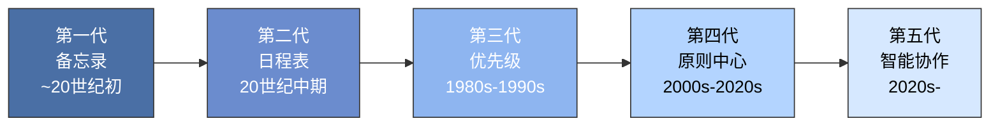
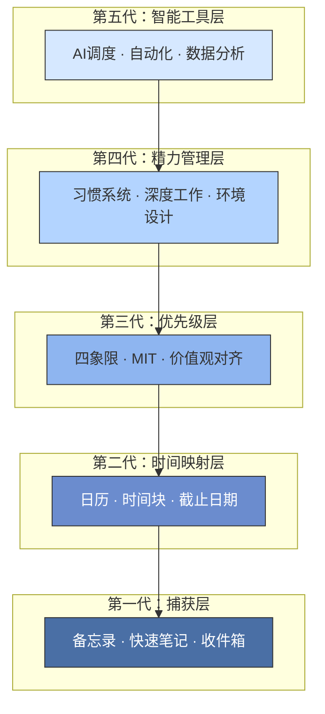

## 一、时间管理理论的演变——从备忘录到智能时代

时间管理并非一个固定不变的概念。它随着社会结构、工作方式、认知科学和技术工具的进步而持续演化。从最早的"记下来别忘了"到今天的"AI辅助决策+精力管理"，时间管理经历了五代范式转变。理解这一演变过程的核心价值在于：**你不会在错误的层级上反复优化**——用第一代的方法去应对第四代的问题，再努力也是徒劳。

### 1.1 演变全景图

每一代时间管理都是对上一代局限性的回应，同时也继承了上一代的核心遗产。这不是简单的"替代"，而是"包含与超越"。

| 代际 | 核心隐喻 | 管理对象 | 关键问题 | 社会背景 |
|------|----------|----------|----------|----------|
| 第一代 | 记账员 | 任务清单 | 怎么不忘事？ | 农业→手工业，事务开始增多 |
| 第二代 | 调度员 | 时间段 | 什么时候做？ | 工业革命，工厂制度兴起 |
| 第三代 | 指挥官 | 优先级 | 先做什么？ | 知识经济，信息爆炸 |
| 第四代 | 架构师 | 精力与系统 | 怎样持续做对的事？ | 注意力经济，倦怠危机 |
| 第五代 | AI协调员 | 决策质量 | 如何让人机各司其职？ | 人工智能，远程协作 |

---

### 1.2 第一代：备忘录式时间管理（20世纪初及以前）

#### 核心理念

**把要做的事情记下来，防止遗忘。**

这是人类最朴素、最直觉的时间管理方式。在事务总量不大、工作节奏缓慢的时代，"不遗忘"本身就是最大的效率提升。

#### 历史渊源

时间管理的概念雏形可以追溯到古罗马时期。塞涅卡在《论生命之短暂》（约公元49年）中写道："生命并非短暂，而是我们浪费了太多。"这可能是人类历史上最早的"时间意识觉醒"。但真正具有系统性的备忘录实践，始于文艺复兴时期。

**本杰明·富兰克林**是第一代时间管理最具代表性的人物。他的日程安排堪称经典：每天早上5点起床，问自己"今天我要做什么好事？"晚上10点睡觉前问"今天我做了什么好事？"这种"晨间计划+晚间回顾"的结构，至今仍是许多高效能人士的核心习惯。富兰克林还发明了"道德账簿"（Virtue Ledger），用表格追踪自己在13项美德上的每日表现——这本质上就是第一代时间管理的进阶形态。

#### 核心特征

- 使用便签纸、备忘录、笔记本记录待办事项
- 完成一项就划掉一项，获得即时的完成感
- 以"不遗忘"为最高目标
- 没有优先级概念，所有事项平级排列
- 工具极简：一支笔、一张纸

#### 为什么"划掉"有魔气？

从神经科学角度解释，每当你划掉一个完成的任务时，大脑会释放少量多巴胺。这种"完成感"（Zeigarnik效应的反面）会带来愉悦，形成正向反馈回路。问题在于：**这个机制会让你倾向于做容易划掉的小事，而回避困难但重要的大事**。这是第一代时间管理最根本的陷阱。

#### 优点

- 零门槛，不需要任何学习成本
- 显著降低遗忘重要事项的风险
- 完成本身就是激励
- 适用于事务量小、结构简单的场景

#### 局限

- 当待办事项超过15-20条时，清单变得冗长且令人焦虑
- 无法区分轻重缓急——"买牛奶"和"写年度报告"在清单上看起来一模一样
- 没有时间维度：不知道"什么时候做"，也不知道"做多久"
- 容易造成"虚假高效"——一天划掉20件小事，但重要的事一件没碰
- 清单会无限膨胀，产生"清单过载"（list overwhelm）现象

#### 现代适用场景

第一代方法并未消亡，在以下场景中仍然最优：

- 临时想法捕捉（灵感、购物清单）
- 低复杂度环境下的任务记录
- 作为更高级系统的"捕获层"（GTD的第一步"收集"本质上就是备忘录）
- 压力过大时的"降级重启"——当高级系统崩溃时，退回备忘录是合理的应急策略

---

### 1.3 第二代：日程表式时间管理（20世纪中期）

#### 核心理念

**为特定事项分配特定时间段——让时间"可见化"。**

第一代的问题是"记下来了但不知道什么时候做"，第二代的解决方案是：把任务映射到具体的时间格子上。

#### 历史背景

1900年代初，美国兴起了"效率运动"（Efficiency Movement）。弗雷德里克·泰勒在1911年出版的《科学管理原理》提出：通过科学方法分析和优化工人的每一个动作，可以大幅提升产出。这一思想从工厂延伸到个人生活，催生了"个人效率"的概念。

同期，**亨利·甘特**发明了甘特图（1910年），用水平条形图展示任务与时间的对应关系。这一工具至今仍是项目管理的基础。日程本和效率手册开始成为商务人士的标配——Franklin Planner、Day-Timer等品牌应运而生。

#### 核心特征

- 使用日历和日程表安排时间
- 引入"预约"和"时间块"（time block）概念
- 强调时间节点和截止日期（deadline）
- 工具包括效率手册、日程本、台历
- 强调"守时"和"按计划行事"

#### 关键突破："时间空间化"

第二代最深刻的贡献是让人们意识到**时间是一种有限的、可分配的资源**。在此之前，人们只是"在时间中做事"；从第二代开始，人们开始"为时间做规划"。这个认知跃迁是根本性的——它意味着时间不再是无限的背景，而是需要管理的稀缺资源。

#### 优点

- 让抽象的时间变得具体可见
- 引入"预约""截止日期""时间预算"等关键概念
- 帮助建立时间的节奏感和秩序感
- 适合需要协调多人的场景（会议、项目排期）

#### 局限

- 过于关注"什么时候做"而忽视"是否值得做"——你会精心安排一个根本不该做的任务
- 容易变成"日程的奴隶"：日程表排得满满当当，但其中大量事项并不重要
- 缺乏灵活性：计划一旦被打乱就容易焦虑，产生"失控感"
- 完全忽略精力状态：在精力低谷期安排重要任务是第二代的典型盲区
- 没有考虑任务间的依赖关系和上下文切换成本

#### 现代工具

日程表在数字时代获得了第二次生命：

- **Google Calendar**：多人共享、自动提醒、智能建议
- **Apple Calendar**：生态系统集成
- **Outlook**：企业级日程管理
- **Calendly/Cal.com**：自动化的预约安排
- **Clockwise/Reclaim.ai**：AI驱动的日程优化

但关键原则不变：**日程表应该是优先级系统的执行工具，而不是反过来**。先决定做什么（第三代），再决定什么时候做（第二代）。

---

### 1.4 第三代：优先级式时间管理（20世纪80-90年代）

#### 核心理念

**以价值观和长期目标为导向，区分事情的轻重缓急——做对的事比把事做对更重要。**

这是时间管理史上最重要的范式跃迁。前两代关注的是"做事的效率"（efficiency），第三代引入了"效能"（effectiveness）的概念——**效率是把事情做对，效能是做对的事情**。

#### 历史背景

1989年，**史蒂芬·柯维**出版了《高效能人士的七个习惯》，成为20世纪最具影响力的管理学著作之一。柯维的核心洞察是：大多数人在"紧急但不重要"的事务上消耗了大量精力，而"重要但不紧急"的事务被持续忽视，最终导致危机不断。

几乎同一时期，**彼得·德鲁克**在《卓有成效的管理者》（1967年）中已经提出了类似的思想："效率是'把事情做对'，效能是'做对的事情'。"但柯维将其系统化并推向大众。

#### 核心工具：艾森豪威尔矩阵

艾森豪威尔矩阵（也称"四象限法则"）是第三代时间管理最经典的工具：

                    紧急                     不紧急
              ┌─────────────────┬─────────────────┐
              │                 │                 │
    重要      │    第一象限     │    第二象限     │
              │    立即做       │    计划做       │
              │    危机/截止    │    学习/规划    │
              │                 │    健康/关系    │
              ├─────────────────┼─────────────────┤
              │                 │                 │
    不重要    │    第三象限     │    第四象限     │
              │    委托他人     │    尽量不做     │
              │    多数会议     │    刷手机       │
              │    部分邮件     │    无意义闲聊   │
              │                 │                 │
              └─────────────────┴─────────────────┘

**关键洞察：大多数人把80%的时间花在第一象限和第三象限，只有不到20%的时间投入第二象限。而真正改变人生轨迹的，恰恰是第二象限的事务。**

#### 第二象限的力量

第二象限事务的特征是：**重要但不紧急**。因为不紧急，所以总被推迟；因为重要，所以长期忽略会酿成大问题。

典型的第二象限事务包括：
- **职业发展**：学习新技能、建立人脉、思考职业方向
- **健康管理**：运动、体检、睡眠优化
- **关系维护**：与家人深度对话、陪伴孩子成长、维系友谊
- **财务规划**：投资理财、保险规划、退休计划
- **个人成长**：阅读、写作、反思、冥想

柯维指出：**你在第二象限投入越多，第一象限的危机就越少**。坚持运动（第二象限）会减少看病（第一象限）；提前规划（第二象限）会减少临时救火（第一象限）。

#### ABC分级法

除了四象限，第三代还发展出了其他优先级工具：

- **ABC法**：A=必须做（后果严重），B=应该做（有影响），C=锦上添花（做了更好，不做也没事）
- **ABCDE法**（Brian Tracy）：在ABC基础上加D=委托他人，E=消除
- **MIT法**（Most Important Tasks）：每天确定1-3件最重要的事，优先完成
- **1-3-5法则**：每天计划做1件大事、3件中事、5件小事

#### 优点

- 引入"价值观驱动"取代"紧急驱动"的范式
- 帮助人们把精力聚焦在真正重要的事情上
- "预防优于救火"的思维方式减少了危机频率
- 建立了"角色平衡"的概念——人在生活中扮演多种角色（职业人、家庭成员、社区成员等），需要平衡各角色的需求

#### 局限

- **分类困难**：真实世界的任务往往横跨多个象限，难以清晰归类
- **过度规划**：花太多时间在计划上，产生"规划幻觉"——感觉规划了就等于做了
- **灵活性不足**：当环境快速变化时，精心制定的优先级很快过时
- **忽视精力**：第三代假设人可以像机器一样持续高效输出，忽略了精力波动
- **执行鸿沟**：知道什么重要和真正做到之间存在巨大鸿沟，第三代没有提供跨越这个鸿沟的有效方法
- **信息过载**：在信息爆炸时代，即使分类后，待处理信息量仍然超出个人管理能力

#### 重要区分：效率 vs 效能

这个区分值得反复强调，因为它是一切时间管理的底层逻辑：

| 维度 | 效率（Efficiency） | 效能（Effectiveness） |
|------|---------------------|-----------------------|
| 定义 | 用最少资源完成任务 | 完成正确的任务 |
| 关注 | 速度、成本、产出量 | 方向、价值、影响 |
| 比喻 | 把梯子搭得更快 | 把梯子搭对墙 |
| 代表 | 第一、二代 | 第三代及以后 |
| 错误 | 做得快但方向错 | 方向对但执行差 |

**德鲁克的原话**："世界上最无用的事情就是高效地做一件根本不该做的事。"（There is nothing so useless as doing efficiently that which should not be done at all.）

---

### 1.5 第四代：以原则为中心的时间管理（21世纪初至今）

#### 核心理念

**管理精力和注意力，而非时间本身；建立系统和习惯，而非依赖意志力和计划。**

第四代时间管理的核心范式转变是：**时间管理的本质不是管理时间（时间不可管理），而是管理自己**。更具体地说，是管理自己的精力、注意力、习惯和决策系统。

#### 为什么"时间管理"是个伪命题？

每个人都拥有相同的24小时，你无法增加或减少时间。你能管理的是：
- **精力**：在什么状态下工作
- **注意力**：把认知资源分配给什么
- **习惯**：自动化什么行为以减少决策消耗
- **环境**：设计什么样的系统来支持好行为
- **选择**：说什么"不"

这就是为什么第四代的核心文献不再叫"时间管理"，而是叫"精力管理""深度工作""原子习惯"。

#### 代表人物与核心思想

**史蒂芬·柯维——以原则为中心**

柯维的后期思想从"七个习惯"扩展为"以原则为中心"的生活方式。核心观点是：所有有效的管理系统都建立在不变的原则之上（如公平、诚信、尊重、成长），而非可变的技巧或工具。当你以原则为中心时，时间管理不再是外在的约束，而是内在价值观的自然表达。

**戴维·艾伦——GTD（Getting Things Done）**

2001年出版的《搞定》提出了至今最具影响力的时间管理系统之一。GTD的核心逻辑链条是：

1. **收集**（Capture）：把所有"悬而未决"的事务从大脑中清空到外部系统
2. **理清**（Clarify）：对每件事决定"需要行动吗？"→"下一步行动是什么？"
3. **组织**（Organize）：按项目、情境、日期分类存放
4. **回顾**（Review）：每周回顾整个系统，确保信任度
5. **执行**（Engage）：根据情境、时间、精力、优先级选择行动

GTD的底层心理学原理是**蔡格尼克效应**（Zeigarnik Effect）：未完成的任务会持续占据工作记忆，造成认知负荷。通过将任务"外包"到可信赖的外部系统，大脑得以释放心智带宽。

**吉姆·洛尔和托尼·施瓦茨——精力管理**

《精力管理》（The Power of Full Engagement, 2003）提出了一个革命性观点：**高效能不是时间管理的结果，而是精力管理的结果**。他们将精力分为四个维度：

- **体精力**（Physical）：睡眠、运动、营养、呼吸
- **情精力**（Emotional）：积极情绪、关系质量、情绪调节
- **心精力**（Mental）：专注力、认知灵活性、乐观思维
- **灵精力**（Spiritual）：目的感、价值观、意义连接

核心方法是"精力波动管理"——像运动员一样，在高消耗后安排恢复，在高峰期安排最重要的工作，而非试图维持恒定输出。

**卡尔·纽波特——深度工作**

《深度工作》（Deep Work, 2016）定义了两种工作模式：
- **深度工作**（Deep Work）：在无干扰状态下进行高认知要求的专业活动
- **浅层工作**（Shallow Work）：低认知要求的、通常在分心状态下完成的任务

纽波特的论点是：在信息经济时代，深度工作的能力正在变得越来越稀缺，同时越来越有价值。能够系统性地进行深度工作的人将获得不成比例的回报。

**詹姆斯·克利尔——原子习惯**

《原子习惯》（Atomic Habits, 2018）提供了习惯形成的实操框架：

- **让它显而易见**（Make it obvious）：环境设计、习惯叠加
- **让它有吸引力**（Make it attractive）：诱惑绑定、群体规范
- **让它容易**（Make it easy）：两分钟规则、减少摩擦
- **让它令人满足**（Make it satisfying）：即时奖励、习惯追踪

核心洞见：**每天进步1%，一年后你将进步37倍**。复利效应不仅适用于金融，也适用于行为改变。

#### 核心特征总结

- 以原则为中心，而非以工具或技巧为中心
- 管理精力（体、情、心、灵）而非单纯管理时间
- 重视系统和习惯的建立，减少对意志力的依赖
- 保护专注力，追求深度工作
- 角色平衡：个人、家庭、职业、社区等多角色的整合
- 追求的不是"做更多的事"，而是"做对的事"

#### 与前三代的关键区别

| 维度 | 第一至三代 | 第四代 |
|------|-----------|--------|
| 关注点 | 任务和时间 | 精力和注意力 |
| 驱动力 | 紧迫感和截止日期 | 价值观和意义感 |
| 衡量标准 | 完成了多少任务 | 产生了多少价值 |
| 管理对象 | 日程和待办清单 | 习惯和系统 |
| 终极目标 | 效率（做更多事） | 效能（做对的事） |
| 失败归因 | 计划不够好/执行不够严 | 系统有缺陷/精力没管理好 |
| 核心工具 | 日历、清单、矩阵 | 习惯系统、精力策略、环境设计 |

---

### 1.6 第五代：智能时代的时间管理（2020年代至今）

#### 核心理念

**人机协作——AI处理信息和优化决策，人类专注于价值观、创造力和关系。**

第五代时间管理不是要让AI替你管理时间，而是让人和AI各自发挥比较优势：AI擅长处理大量信息、识别模式、优化调度；人类擅长定义意义、做出价值判断、建立深层关系。

#### 趋势一：AI辅助决策与日程优化

智能工具正在从"被动记录"进化为"主动建议"：

- **Clockwise**：分析团队成员的日程，自动将会议集中到特定时段，为每个人释放连续的深度工作时间块
- **Reclaim.ai**：基于AI自动为习惯、任务和会议找到最优时间，当冲突发生时自动重新安排
- **Motion**：使用AI算法实时重新排列任务优先级，根据截止日期、优先级和可用时间自动生成每日计划
- **Notion AI / ChatGPT**：辅助任务分解、项目规划、邮件处理，减少认知消耗

#### 趋势二：注意力保护成为核心战场

在信息过载时代，**注意力是比时间更稀缺的资源**。第五代工具开始将"注意力保护"作为核心功能：

- **Focusmate**：虚拟共同工作空间，通过社会承诺提升专注力
- **Opal/one sec**：在打开分心应用前插入延迟，打断自动化行为
- **Freedom/Cold Turkey**：在设定时段内屏蔽指定网站和应用
- **Brain.fm/Endel**：基于神经科学的专注音乐，通过特定频率引导脑波

关键认知：**每次被打断后，平均需要23分钟才能恢复到之前的专注状态**（UC Irvine, Gloria Mark教授研究）。这意味着即使"只看一眼手机"的真实成本远比你想象的高。

#### 趋势三：异步协作与自主时间管理

远程办公和全球化团队催生了"异步优先"（async-first）的工作方式：

- **Loom**：用短视频替代同步会议，接收者在方便时观看
- **Slack/飞书文档**：线程式沟通，减少实时打断
- **GitHub Issues/Linear**：基于任务的异步协作，减少"开会讨论"的需求

核心变化：**工作时间不再由"老板在不在"决定，而由"我什么时候最高效"决定**。

#### 趋势四：生物节律整合

可穿戴设备和生物传感器正在将身体数据纳入时间管理：

- **Oura Ring/Whoop**：监测HRV（心率变异性）、睡眠质量、恢复状态，为当天的工作强度提供数据支持
- **Apple Watch**：站立提醒、运动追踪、睡眠分析
- **动态日程**：未来系统可能根据你当天的恢复状态，自动调整任务难度——恢复好时安排创造性工作，恢复差时安排行政事务

**生物节律的科学基础**：人体存在三种主要节律——
- **昼夜节律**（Circadian）：24小时周期，影响警觉度、体温、激素分泌
- **超日节律**（Ultradian）：90-120分钟周期，专注力自然波动
- **周节律**（Infradian）：7天周期，精力在工作日和休息日之间波动

利用这些节律而不是对抗它们，是第五代时间管理的核心策略之一。

#### 趋势五：个性化系统定制

"一套方法走天下"的时代正在终结。AI可以通过分析个人行为数据，为每个人量身定制时间管理系统：

- 根据你的**性格类型**（内向/外向决定独处vs协作的时间比例）
- 根据你的**精力模式**（早鸟型/夜猫型决定深度工作时段）
- 根据你的**工作性质**（创意型/执行型决定任务安排方式）
- 根据你的**生活阶段**（单身/有幼儿/空巢期决定可用时间块）

#### 对我们的启示

无论技术如何发展，时间管理的核心原则不会过时：

1. **明确价值观**——知道什么对你重要（AI不能替你决定）
2. **区分优先级**——先做对的事（AI可以辅助，但决策权在你）
3. **保护专注力**——减少干扰，进入深度工作（AI可以帮助屏蔽，但纪律在你）
4. **管理精力**——尊重身体节律（AI可以提醒，但执行在你）
5. **建立系统**——用习惯和流程替代意志力（AI可以优化，但设计在你）

**技术是放大器，不是替代品。** 一个没有价值观的人，给他再好的AI工具也只会更高效地做错事。

---

### 1.7 代际整合：如何在实践中混合运用

#### 不存在"最好的一代"

每一代时间管理都有其适用场景和核心价值。实际操作中，最有效的策略是**分层整合**：

- 用第一代的**捕获能力**快速记录想法和任务（备忘录/快速笔记）
- 用第二代的**时间映射**安排需要协调的日程（日历/时间块）
- 用第三代的**优先级框架**决定做什么不做什么（四象限/MIT）
- 用第四代的**精力管理**优化执行状态（习惯系统/深度工作）
- 用第五代的**智能工具**减少决策摩擦（AI调度/自动化）

#### 自我诊断：你卡在哪一代？

回答以下问题，找到你当前的时间管理"代际"：

1. 你是否经常忘记要做的事？→ 你可能还在第一代（或需要第一代的捕获系统）
2. 你是否总感觉时间不够用但说不清为什么？→ 你可能卡在第二代（只关注排程不关注价值）
3. 你是否经常做紧急但不重要的事？→ 你需要第三代的优先级框架
4. 你是否完成了所有待办但仍然感到空虚？→ 你需要第四代的价值观对齐
5. 你是否花大量时间在低价值的重复性操作上？→ 你需要第五代的自动化工具

#### 常见误区

**误区一："用了高级工具就是高级管理"**
工具不等于系统。买了GTD软件不代表你实践了GTD，就像买了跑步鞋不代表你开始运动。先理解原则，再选择工具。

**误区二："一代方法被淘汰了就不值得学"**
没有哪一代是"过时"的。第四代的深度工作仍然需要第二代的日程安排来落地，仍然需要第一代的捕获来防止遗忘。

**误区三："找到完美系统就能一劳永逸"**
时间管理系统需要根据人生阶段、工作环境和个人成长持续调整。每6-12个月重新审视你的系统是正常的维护，不是失败。

**误区四："计划越详细越好"**
过度计划本身是一种拖延。研究显示，详细的长期计划（超过3个月）的准确率极低。更好的策略是：宏观方向+近期详细+每日灵活。

**误区五："时间管理就是让自己更忙"**
时间管理的终极目标不是塞满每一分钟，而是确保你有时间做真正重要的事——包括休息、思考和"什么都不做"。真正的高手日程表里有大量留白。

**误区六："别人的方法照搬就行"**
所有时间管理方法都需要个性化适配。一个内向程序员和一个外向销售员的最优系统完全不同。方法论是起点，不是终点。

---

### 1.8 核心思想家速查表

| 人物 | 代表作 | 核心贡献 | 关键概念 |
|------|--------|----------|----------|
| 本杰明·富兰克林 | 《自传》 | 晨间计划+晚间回顾 | 道德账簿、"今天做什么好事" |
| 弗雷德里克·泰勒 | 《科学管理原理》(1911) | 科学方法应用于效率 | 时间研究、动作分析 |
| 亨利·甘特 | 甘特图(1910) | 任务与时间的可视化 | 甘特图 |
| 彼得·德鲁克 | 《卓有成效的管理者》(1967) | 效率vs效能 | "做对的事情" |
| 史蒂芬·柯维 | 《高效能人士的七个习惯》(1989) | 以原则为中心 | 四象限、要事第一、角色平衡 |
| 戴维·艾伦 | 《搞定》(2001) | GTD方法论 | 清空大脑、下一步行动、每周回顾 |
| 吉姆·洛尔/托尼·施瓦茨 | 《精力管理》(2003) | 精力四维度模型 | 体/情/心/灵精力、波动管理 |
| 卡尔·纽波特 | 《深度工作》(2016) | 深度vs浅层工作 | 注意力保护、生产力公式 |
| 詹姆斯·克利尔 | 《原子习惯》(2018) | 习惯复利效应 | 1%进步、四法则框架 |
| 布莱恩·特雷西 | 《吃掉那只青蛙》(2001) | 最困难的事优先 | MIT、ABCDE法 |

---

### 1.9 进阶思考：时间管理的哲学维度

#### 时间观心理学

心理学家菲利普·津巴多（Philip Zimbardo）提出了"时间观"（Time Perspective）理论，认为人们对时间的感知方式会深刻影响行为模式：

- **过去积极型**：怀恋美好回忆，重视传统和经验
- **过去消极型**：沉溺于过去的失败和遗憾
- **现在享乐型**：追求即时快感，缺乏长远规划
- **现在宿命型**：感觉命运不可控，消极被动
- **未来导向型**：善于规划和延迟满足，但可能忽视当下

**健康的平衡是"超越型时间观"**：从过去的经历中学习，享受当下的体验，同时为未来做有意义的规划。

#### 斯多葛学派的时间智慧

马可·奥勒留在《沉思录》中反复强调一个观点：**我们唯一真正拥有的就是当下这一刻**。过去已经消逝，未来尚未到来，焦虑的本质是把注意力放在了不属于自己掌控的时间上。

这与第四代时间管理的"精力管理"形成了有趣的呼应：你不能管理过去或未来的时间，但你可以管理**当下的精力和注意力**。时间管理的最高境界不是把24小时塞满，而是**在每一个当下，把全部注意力投入在最值得做的事情上**。

#### 忙碌≠高效的文化陷阱

在许多文化中（尤其是东亚和美国），"忙碌"被视为身份和价值的象征。"你忙吗？"成了社交问候语，"我不忙"几乎等于"我不重要"。

但忙碌本身没有任何价值。**产出才是价值**。一个每天工作12小时但产出平庸的人，不如一个每天工作6小时但产出卓越的人。时间管理的真正目标不是让你"忙起来"，而是让你**在有限的时间内产生最大的价值——然后用剩余的时间去过你想要的生活**。

---

### 1.10 本节小结

时间管理理论经历了五代演变，每一代都是对上一代局限性的回应：

- **第一代**（备忘录）解决了"遗忘"问题，但无法区分轻重缓急
- **第二代**（日程表）引入了时间维度，但过于刚性且忽视价值判断
- **第三代**（优先级）引入了价值观驱动，但忽视精力和系统
- **第四代**（原则中心）关注精力管理和系统建设，但缺乏个性化
- **第五代**（智能协作）通过AI实现个性化优化，但核心决策仍在人类

**实践建议**：不要追求"纯正"的某一代方法，而是根据自己的需求和环境，从每一代中提取最有价值的元素，构建个性化的混合系统。下一节我们将深入探讨如何选择和组合这些元素。
