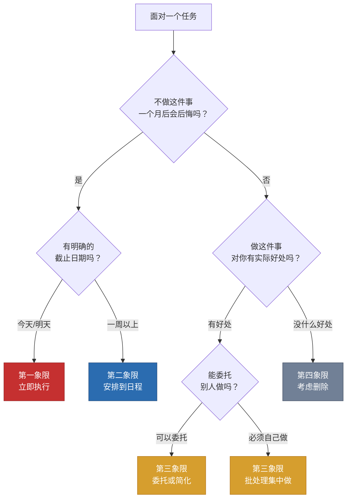
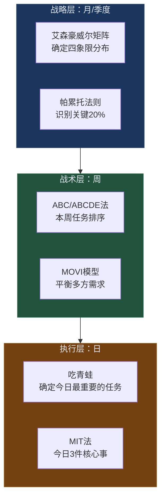

## 二、优先级排序理论——艾森豪威尔矩阵深度解析

优先级排序是时间管理中最核心的技能。没有优先级排序，所有时间管理工具都只是"更高效地做错误的事情"。正如彼得·德鲁克所言："世界上最无用的事情就是高效地做一件根本不该做的事。"优先级排序解决的不是"怎么做更快"的问题，而是"该不该做"的问题——它是效率的前提条件，而非效率本身。

本节将系统讲解五种经典优先级排序方法：帕累托法则、艾森豪威尔矩阵、ABC优先级法、"吃掉那只青蛙"、MOVI模型，以及如何将它们组合运用形成个人优先级系统。

### 2.1 帕累托法则（80/20法则）——不对称性的力量

#### 2.1.1 历史发现与理论背景

意大利经济学家维尔弗雷多·帕累托在1896年研究意大利土地分配时发现了一个惊人的规律：**80%的土地被20%的人口拥有**。他进一步将这一发现推广到其他国家，发现类似的比例普遍存在。后来，罗马尼亚管理学家约瑟夫·朱兰（Joseph M. Juran）在20世纪40年代将这一发现命名为"帕累托法则"（Pareto Principle）并引入质量管理领域，推动了它在商业管理中的广泛应用。

帕累托法则的本质是**幂律分布**（Power Law Distribution），也称为"长尾效应"。在自然界和社会系统中，大量现象并不服从正态分布（钟形曲线），而是服从幂律分布——少数因素产生多数结果，多数因素只产生少数结果。这种分布的数学表达为：

$$P(x) \propto x^{-\alpha}$$

其中α（alpha）决定了分布的倾斜程度。α越大，集中度越高（即"关键少数"的效应越强）。

#### 2.1.2 在时间管理领域的具体应用

帕累托法则在时间管理中的核心启示是：**你的时间投入与产出之间存在严重的不对称性**。以下是经过研究和实践验证的典型80/20分布：

| 领域 | 20%（关键少数） | 80%（琐碎多数） | 数据来源 |
|------|----------------|----------------|----------|
| 工作产出 | 20%的工作时间产生80%的核心成果 | 80%的时间花在低价值事务上 | 约瑟夫·朱兰质量管理研究 |
| 客户价值 | 20%的客户贡献80%的收入 | 80%的客户只贡献20%的收入 | 帕累托原始研究的商业延伸 |
| 软件缺陷 | 20%的模块包含80%的Bug | 80%的模块相对稳定 | 微软内部代码质量研究 |
| 愤怒触发 | 20%的事件导致80%的负面情绪 | 80%的事件影响微弱 | 心理学情绪归因研究 |
| 衣物使用 | 20%的衣服被80%的时间穿着 | 80%的衣服很少被穿 | 行为经济学消费研究 |
| 手机使用 | 20%的App占据80%的使用时间 | 80%的App偶尔打开 | 数字健康统计数据 |

#### 2.1.3 四步实践法

**第一步：数据收集（1-2周）**

连续记录你每天的时间分配和任务产出。记录维度包括：任务名称、花费时间、产出价值（主观评分1-10分）。不要试图优化，只记录真实状态。

**第二步：识别"关键少数"**

回顾记录数据，找出那些投入时间少但产出价值高的活动。问自己这个问题："如果我只能保留20%的工作内容，我会保留哪些？"注意，这个问题不是问"我喜欢做什么"，而是问"什么产生了最大的价值"。

**第三步：重新分配资源**

- **增加**对"关键少数"的时间投入——将它们安排在精力最佳的时间段
- **减少**对"琐碎多数"的时间投入——通过委托、自动化、批处理或直接删除
- **保护**"关键少数"不被打断——设置免打扰时段、关闭通知

**第四步：持续迭代**

每月回顾一次你的80/20分布，因为"关键少数"会随时间变化。年初最重要的20%任务到年中可能已经发生变化。

#### 2.1.4 进阶应用——帕累托的帕累托

80/20法则可以递归应用。在那20%的高价值活动中，又有20%的活动产生了80%的成果。这意味着：

- **第一层**：20%的活动 → 80%的成果
- **第二层**：4%的活动（20%×20%）→ 64%的成果（80%×80%）
- **第三层**：0.8%的活动 → 51.2%的成果

找到这"关键少数中的少数"，就是时间管理的最高境界。一个实际案例：某电商公司的销售数据分析显示，1%的SKU（约50个产品）贡献了35%的总销售额。将营销预算集中在这50个产品上，ROI提升了3倍。

#### 2.1.5 常见误用与纠正

**误用一："只做20%的事，其他全砍掉"**

这是对帕累托法则最危险的误读。很多低价值任务是高价值任务的前置条件——写报告的准备工作、维护客户关系的例行沟通、代码项目的测试环节。正确的做法不是砍掉80%，而是**对80%的低价值活动进行委托、简化或自动化**。

**误用二："80/20是精确比例"**

80/20不是一个精确的数学比例，而是一个描述不对称性的思维框架。实际分布可能是70/30、90/10甚至95/5。重要的是理解"少数因素产生多数结果"的规律，而非执着于精确数字。

**误用三："找到了就能一劳永逸"**

80/20分布是动态的。今天的关键少数可能在三个月后不再是关键少数。持续的数据收集和分析是必要的。

---

### 2.2 艾森豪威尔矩阵（四象限法则）——完全指南

艾森豪威尔矩阵是优先级排序中最经典的工具，它用两个维度——**重要性**和**紧急性**——将所有任务分为四类。这个矩阵得名于美国第34任总统德怀特·艾森豪威尔，他说过一句著名的话："紧急的事很少是重要的，重要的事很少是紧急的。"（What is important is seldom urgent and what is urgent is seldom important.）

#### 2.2.1 历史渊源：从艾森豪威尔到柯维

艾森豪威尔本人并未"发明"这个矩阵。他的贡献在于提出了"重要性vs紧急性"的区分思想。这个思想后来被史蒂芬·柯维在《高效能人士的七个习惯》（1989年）中系统化为四象限矩阵，成为时间管理史上最广泛使用的工具之一。

柯维的核心洞察是：大多数人在第一象限（紧急且重要）和第三象限（紧急不重要）之间疲于奔命，而**第二象限（重要不紧急）才是改变人生轨迹的关键区域**。但因为第二象限的事情没有截止日期、没有外部压力，所以总是被推迟——直到它们变成第一象限的危机。

#### 2.2.2 矩阵结构

|  | **紧急** | **不紧急** |
|---|---|---|
| **重要** | **第一象限：危机处理** 立即执行 | **第二象限：战略规划** 计划执行 |
| **不重要** | **第三象限：干扰应对** 委托或简化 | **第四象限：时间浪费** 消除或最小化 |

#### 2.2.3 "重要"与"紧急"的定义框架

使用矩阵之前，必须先搞清楚"重要"和"紧急"分别是什么意思。很多人把这两个概念混淆，导致所有事情都被标记为"重要且紧急"。

**重要性判断标准——三个过滤器：**

1. **目标对齐度**：这件事是否直接推动你的核心目标（职业目标、个人成长目标、健康目标）？如果完成它，你离目标更近了吗？
2. **后果影响度**：如果不做这件事，一个月后、一年后会有什么后果？后果越严重，重要性越高。
3. **不可替代性**：这件事是否只有你能做？别人能代替你做吗？只有你能做的事情重要性更高。

**紧急性判断标准——两个信号：**

1. **时间刚性**：是否有明确的、不可更改的截止日期？
2. **外部压力**：是否有外部系统（法律、合同、他人依赖）要求你必须在特定时间内完成？

**关键区分**：紧急是外在的时间压力（别人要求你什么时候完成），重要是对你的核心目标有实质影响（你自己决定什么重要）。不要让紧急性伪装成重要性——一个不重要的事情，即使再紧急，也不应该占用你的核心时间。

#### 2.2.4 四象限详解

**第一象限（重要且紧急）——"救火区"**

这个象限包含需要立即处理的重要事务：危机、截止日期临近的项目、突发紧急事件、健康急症等。

*典型事项：*
- 明天就要提交的重要报告
- 客户的紧急投诉
- 系统崩溃需要立即修复
- 孩子突然生病需要送医
- 重大安全漏洞的紧急修补

*行动策略：* 立即执行，集中精力完成。

*关键洞察：* 如果你的第一象限总是满满的，说明你在第二象限的投入不够。第一象限的很多"危机"，其实是第二象限的"预防"没有做好的结果。例如，如果提前一周开始准备报告（第二象限），就不会出现"明天就要交"的紧急情况（第一象限）。柯维把这称为"危机管理的恶性循环"——不做预防→产生危机→忙于救火→没时间做预防→产生更多危机。

*时间预算建议：* 健康状态：10-15%的工作时间。如果超过25%，说明系统出了问题。

**第二象限（重要不紧急）——"黄金象限"**

这是**最应该投入大量精力的象限**。它包含所有对你的长期目标和核心价值有重大影响，但没有紧迫截止日期的事务。

*典型事项：*
- 战略规划和目标设定
- 能力建设和学习新技能
- 健康管理（运动、饮食、睡眠）
- 关系维护（与家人、朋友、导师的深度交流）
- 财务规划和投资
- 预防性措施（定期体检、设备维护、备份数据）
- 个人品牌建设
- 建立系统和流程
- 复盘和反思
- 深度阅读和思考

*行动策略：* 计划执行——安排到日程中，分配专门时间块。第二象限的事务不会自己挤进你的日程，你必须主动为它们"创造空间"。

*核心原则：* 第二象限的工作做得越好，第一象限的危机就越少。把80%的精力投入第二象限，让第一象限自然缩小。具体做法是：每天至少为第二象限保留1小时不受打扰的时间块，把它当作"与自己的约会"——不可取消、不可推迟。

*时间预算建议：* 目标：60-70%的工作时间。

**第三象限（紧急不重要）——"干扰区"**

这些事情看起来很紧急，但对你的核心目标没有实质贡献。它们往往是"别人的优先级"，而不是"你的优先级"。

*典型事项：*
- 大部分电话和邮件
- 不必要的会议
- 别人的紧急请求（但对你不重要）
- 部分社交活动
- 某些行政事务
- 打断你专注工作的即时消息

*行动策略：* 委托或简化——尽量委托他人，或找到更高效的处理方式。如果必须自己做，使用批处理法集中处理（如邮件每天看3次，每次30分钟）。

*关键技巧：* 学会区分"紧急"和"重要"。紧急是外在的时间压力，重要是对你的核心目标有影响。不要让紧急性伪装成重要性。一个实用的检验方法是：如果这件事是别人让你做的，问自己"如果这是我自己的事，我会把它放在优先级的什么位置？"

*时间预算建议：* 目标：15-20%的工作时间。

**第四象限（不重要不紧急）——"时间黑洞"**

这些活动既不重要也不紧急，应该被最小化或消除。

*典型事项：*
- 无目的地刷手机和社交媒体
- 过度看电视或视频
- 无意义的闲聊
- 拖延行为（做无关紧要的事来逃避重要任务）
- 过度游戏
- 无目的地网上冲浪

*行动策略：* 有意识地减少或直接删除。

*重要区分：* 适当的第四象限活动（如休闲娱乐）对恢复精力是有价值的。问题不在于偶尔的放松，而在于**无意识地**在第四象限花费大量时间。关键是"有意识地选择"，而不是"被动地消磨"。看一部好电影是"有意的休息"（有价值），无目的地刷2小时短视频是"无意识的消耗"（有害）。

*时间预算建议：* 目标：5-10%的工作时间（有意的放松）。

#### 2.2.5 决策树：如何快速分类一个任务

当你面对一个任务不知道该放在哪个象限时，按以下决策树操作：

#### 2.2.6 常见实操陷阱与纠偏

**陷阱一："所有事都标记为重要且紧急"**

这是最常见的使用失败。当你发现四个象限都装不满、所有事都在第一象限时，说明你的"重要性判断标准"太宽松了。纠偏方法：使用上面的"三个过滤器"严格审视每件事。一个实用的检验标准是：你一天中标记为"重要且紧急"的事情不应该超过3件。

**陷阱二："画了矩阵但不按矩阵行动"**

很多人把矩阵当成装饰品——画完之后还是按照习惯做事。矩阵的价值不在"画"，而在"执行时对照"。每当你准备开始下一项工作时，花10秒钟确认它在哪个象限，然后按照对应策略行动。

**陷阱三："忽视象限之间的动态转化"**

任务不是静态地待在一个象限里的。第二象限的"定期体检"如果一直不做，会变成第一象限的"确诊重病"。第三象限的"同事请求"如果涉及你的核心项目，可能实际上是第一象限的事。纠偏方法：每天花5分钟审视你的矩阵，检查有没有"即将变质"的任务。

**陷阱四："把第四象限全部砍掉"**

第四象限的活动（如适当休闲）对心理健康和精力恢复是有价值的。完全消灭第四象限会导致精力枯竭。正确做法是：把第四象限从"无意识的消磨"变成"有意识的休息"——选择你真正享受的放松方式，设定时间上限，然后全身心投入。

#### 2.2.7 艾森豪威尔矩阵的高级用法

**用法一：分层矩阵**

为不同角色分别建立矩阵。一个职场人可能同时有"工作者"矩阵、"家庭成员"矩阵、"个人成长者"矩阵。每个矩阵有自己的"重要"定义。周末审视三个矩阵时，你会发现哪个角色被忽视了。

**用法二：团队矩阵**

在团队中使用矩阵进行任务分配。把团队的所有任务列出来，集体讨论每个任务属于哪个象限。第三象限的任务优先考虑委托或自动化，第四象限的任务建议直接删除。这个过程本身就是一次高效的团队优先级对齐。

**用法三：与精力管理结合**

不仅考虑"这件事在哪个象限"，还要考虑"当前的精力状态适合做哪个象限的事"。精力高峰期（通常是上午）安排第一、二象限的高强度认知任务；精力低谷期（通常是下午2-4点）安排第三象限的低强度行政事务。

#### 2.2.8 矩阵的局限性

艾森豪威尔矩阵虽然经典，但并非完美：

1. **二元分类过于粗糙**：重要性和紧急性都是连续的光谱，不是非此即彼的二元判断。一个任务可能"有点重要"但"非常紧急"，矩阵无法精确表达这种程度差异。
2. **缺乏时间维度**：矩阵是静态的快照，但任务的优先级是动态变化的。今天的第二象限可能下周变成第一象限。
3. **不考虑依赖关系**：任务之间存在前置依赖。一个"不重要"的准备步骤可能是"重要"任务的前置条件，矩阵无法表达这种关系。
4. **主观判断偏差**：对"重要性"的判断高度主观，容易受到近因效应（最近发生的事情显得更重要）和显著效应（情绪激烈的事情显得更重要）的影响。

这些局限性的解决方案是：将矩阵与其他方法（如ABC法、GTD系统）结合使用，形成互补的优先级系统。

---

### 2.3 ABC优先级法——简单有效的日常排序

ABC法是一种简单直观的优先级排序方法，由艾伦·莱金（Alan Lakein）在《如何掌控你的时间与生活》（How to Get Control of Your Time and Your Life, 1973）中提出。它的核心优势是**上手极快**——不需要画矩阵、不需要复杂分析，只需要在待办事项旁边标一个字母。

#### 2.3.1 基础分类标准

- **A类任务**：必须完成，对目标有重大影响。如果不做，后果严重。每天通常只有1-3项。
- **B类任务**：应该完成，有一定价值但不如A类重要。不做后果中等。每天通常有3-5项。
- **C类任务**：可以做，但即使不做也不会有严重后果。每天通常有5-10项。

#### 2.3.2 核心使用规则

1. 每天早上（或前一天晚上）列出所有待办事项
2. 用A、B、C标记每项任务的优先级
3. 在A类任务内部再用A1、A2、A3排序
4. **永远先做A1，完成后再做A2**
5. 如果A类任务没完成，不要碰B类
6. B类任务没完成前，不要碰C类

这个规则的关键在于**强制排序**——即使有5件"都挺重要"的事，你也必须选出A1。这种强制选择迫使你直面优先级判断，避免"所有事都重要"的思维陷阱。

#### 2.3.3 进阶——ABCDE法

布莱恩·特雷西（Brian Tracy）在ABC法基础上扩展为ABCDE法：

- **A**：必须做——不做有严重后果（Must do）
- **B**：应该做——不做有轻微后果（Should do）
- **C**：可以做——不做没有后果（Nice to do）
- **D**：委托——可以交给别人做（Delegate）
- **E**：消除——可以不做，直接删除（Eliminate）

ABCDE法比ABC法多了一个维度：**你是否需要亲自做这件事**。D和E的引入使它与艾森豪威尔矩阵的第三、四象限产生了对应关系。

#### 2.3.4 ABC法的优势与局限

| 维度 | 优势 | 局限 |
|------|------|------|
| 学习成本 | 几乎为零，3分钟就能上手 | 缺乏深度分析，容易流于形式 |
| 执行速度 | 快速决策，不纠结 | 分类标准模糊，不同人理解不同 |
| 灵活性 | 随时可以调整 | 没有考虑时间维度和精力状态 |
| 适用场景 | 日常待办管理 | 不适合复杂项目的优先级管理 |

**最佳实践**：ABC法最适合作为**每日执行层面**的优先级工具，而非战略层面。用艾森豪威尔矩阵做周/月级别的优先级规划，用ABC法做每日执行时的任务排序。

---

### 2.4 "吃掉那只青蛙"（Eat That Frog）——战胜拖延的优先级策略

"吃掉那只青蛙"是博恩·崔西（Brian Tracy）在2001年出版的同名著作中提出的方法论。"青蛙"指的是你最重要但最不想做的任务——通常也是最有价值的任务。这个隐喻来自马克·吐温的一句话："如果你每天早上第一件事就是吃一只活青蛙，那你这一天都会很满足，因为最糟糕的事已经过去了。"

#### 2.4.1 核心原则

1. **先吃青蛙**：每天早上第一件事就是完成最重要的任务
2. **先吃更丑的**：如果你必须吃两只青蛙，先吃更丑的那只（先做更困难的）
3. **别盯着青蛙看**：如果你必须吃一只青蛙，盯着它看再久也不会变得更容易（不要拖延）

#### 2.4.2 为什么这个方法有效——科学解释

**原因一：意志力是有限资源**

心理学家罗伊·鲍迈斯特（Roy Baumeister）的"自我损耗"（Ego Depletion）研究表明，意志力像肌肉一样会疲劳。每天早上你的意志力最充沛，适合处理最需要自控力的困难任务。随着一天中不断做决策和抵抗诱惑，到下午意志力已经严重消耗，更难启动困难任务。

**原因二：蔡格尼克效应的反面**

心理学家布鲁玛·蔡格尼克发现，未完成的任务会持续占据大脑的工作记忆。如果你一整天都知道有一个重要任务还没做，它会不断消耗你的认知资源——即使你表面上在做其他事情。反过来，早上完成最重要的任务会释放这部分认知资源，让一天中剩余的工作更轻松、更高效。

**原因三：成就感的正向循环**

完成最难的任务后会产生强烈的成就感，这种成就感会释放多巴胺，带动全天的积极状态。心理学上称之为"胜利效应"（Winner Effect）——一次小胜利会提高你下一次成功的概率。

**原因四：减少决策疲劳**

"今天先做什么？"这个决定本身就在消耗认知资源。如果你有一个明确的规则——"每天早上先吃青蛙"——你就不需要每天花精力去做这个决定。决策自动化是高效能人士的核心策略之一。

#### 2.4.3 实践方法

**第一步：识别你的青蛙**

你的青蛙必须满足两个条件：①对你的核心目标有重大影响（重要）；②你本能地想回避它（困难/不愉快）。如果你不知道自己的青蛙是什么，问自己："如果今天只能完成一件事，哪件事完成后会让今天成为成功的一天？"

**第二步：前一天晚上确定青蛙**

在睡前确定明天的青蛙是什么。这样做的好处是：你的潜意识会在睡眠期间提前"预处理"这个任务（心理学上称为"孵化效应"），第二天早上你会更容易启动。

**第三步：保护青蛙时间**

把每天早上精力最好的1-2小时（通常是起床后的第一个工作时段）保留给青蛙任务。在此期间：关闭手机通知、退出即时通讯工具、关闭邮件客户端、告诉同事你在专注工作中。

**第四步：不要想太多，直接开始**

崔西的原话是："吃青蛙的时候不要想太多。"拖延往往发生在"准备开始"的那一刻——你在脑中预演困难、想象失败、寻找完美起点。克服方法是使用"两分钟启动法"：承诺自己只做2分钟，2分钟后如果实在不想做可以停。实际上，一旦开始，大多数人会继续做下去。

#### 2.4.4 21条核心建议精选

崔西在书中提出了21条建议，以下是与优先级排序最相关的几条：

1. **明确目标**：写下你想要达成的目标。没有清晰的目标，你就无法判断什么是"最重要的任务"。
2. **每天提前计划**：前一天晚上列出明天的待办事项。研究表明，书面计划比脑中计划的执行率高出42%。
3. **运用80/20法则**：专注于20%的高价值任务。问自己："哪些任务对我的目标贡献最大？"
4. **考虑后果**：最重要的任务是对未来影响最大的任务。问自己："做或不做这件事，一年后会有什么不同？"
5. **持续不断地练习"吃青蛙"**：直到成为习惯。习惯一旦形成，你不再需要意志力来启动困难任务。

---

### 2.5 MOVI优先级模型——多维度综合判断

MOVI模型是一个更现代的优先级排序框架，它综合考虑了任务的多个维度，弥补了简单二元分类（重要/紧急）的不足。

#### 2.5.1 四个维度

- **M（Must do）**：必须做——不做有严重后果。这类任务通常与核心职责、法律义务、关键承诺直接相关。例如：合同约定的交付物、法定报税截止日、关键客户的紧急需求。
- **O（Ought to do）**：应该做——对目标有帮助。这类任务不做不会有严重后果，但做了能推动你向目标前进。例如：学习新技能、建立人脉关系、优化工作流程。
- **V（Value to others）**：对他人有价值——委托或协作的候选。这类任务对你的个人目标贡献不大，但对他人很重要。它们是委托和协作的首选对象。例如：帮助同事解决问题、参与社区服务。
- **I（Interesting but not urgent）**：有趣但不紧急——可以安排在空闲时间。这类任务能带来快乐和满足感，但不推动核心目标。它们是有意识的休息和自我照顾的一部分。例如：探索新兴趣、阅读闲书、尝试新餐厅。

#### 2.5.2 使用方法

1. 列出所有待办事项
2. 用M、O、V、I标记每项任务
3. 按以下优先级顺序执行：M → O → V → I
4. 如果M类任务超过3件，在M内部用强制排序法确定先后
5. V类任务优先考虑委托
6. I类任务安排在精力低谷期或专门的休闲时间

#### 2.5.3 与其他方法的对比

| 方法 | 分类维度 | 优点 | 最佳适用场景 |
|------|---------|------|------------|
| 艾森豪威尔矩阵 | 重要性×紧急性 | 直观、框架经典 | 周/月级别的战略规划 |
| ABC法 | 价值高低 | 简单快速 | 每日执行层面的任务排序 |
| 吃青蛙 | 难度×价值 | 克服拖延 | 确定每日最重要的第一件事 |
| MOVI模型 | 价值×他人×兴趣 | 多维度、考虑他人 | 需要平衡多方需求的场景 |
| MIT法 | 最重要任务 | 极简、聚焦 | 快速确定每日核心任务 |

---

### 2.6 方法组合：构建个人优先级系统

单独使用任何一种方法都有局限性。真正高效的优先级管理是**多种方法的组合运用**。以下是经过实践验证的组合方案。

#### 2.6.1 三层优先级系统

**操作流程：**

1. **每月初（15分钟）**：用艾森豪威尔矩阵审视所有正在进行的项目和目标，确认80%的精力投入在第二象限。用帕累托法则识别本月最关键的20%任务。
2. **每周日晚（10分钟）**：用ABCDE法对本周的所有任务进行排序，标注D（委托）和E（删除）的任务。用MOVI模型检查是否忽略了"对他人有价值"的任务。
3. **每天早上（5分钟）**：确定今天的"青蛙"（最重要的1件事）和MIT（最重要的3件事）。把青蛙安排在精力最佳的时间段。

#### 2.6.2 优先级校准的三个问题

每当你对某个任务的优先级拿不准时，问自己这三个问题：

1. **"如果只能做一件事，我选哪个？"**——强制排序，消除"都很重要"的幻觉。
2. **"一年后的自己会怎么看这个决定？"**——拉长时间视角，过滤掉短期的紧急噪音。
3. **"如果我把这个小时花在这件事上，我放弃了什么？"**——考虑机会成本，确保你选择的是最高价值的活动。

#### 2.6.3 实操模板：每日优先级工作表

日期：________
今日青蛙（最重要的1件事）：________
  └─ 预计所需时间：____ 分钟
  └─ 安排在：____:____ - ____:____

今日MIT（最重要的3件事）：
  □ 1. ____________ [象限：__] [预计：__分钟]
  □ 2. ____________ [象限：__] [预计：__分钟]
  □ 3. ____________ [象限：__] [预计：__分钟]

今日B类任务：
  □ 4. ____________
  □ 5. ____________

今日委托/删除：
  → 委托给：________
  → 删除原因：________

今日精力安排：
  高峰期（____:____ - ____:____）→ 做青蛙和MIT
  中等期（____:____ - ____:____）→ 做B类任务
  低谷期（____:____ - ____:____）→ 做行政、回复消息

晚间回顾：
  □ 青蛙完成了吗？
  □ MIT完成了几件？ ___/3
  □ 明天的青蛙是什么？

---

### 2.7 优先级排序的心理学基础

为什么优先级排序这么难？因为你不是在和任务搏斗，而是在和自己的大脑搏斗。

#### 2.7.1 紧急性偏好（Urgency Bias）

人类大脑天生倾向于处理紧急的事情，即使它们不重要。这是因为我们的大脑进化于一个需要对即时威胁做出快速反应的环境——一只老虎出现在你面前比一个长期健康计划更需要你的注意力。

现代心理学研究证实了这一点：Amabile等人在哈佛商学院的研究发现，人们在面对截止日期迫近的任务时，会系统性地低估重要但不紧急任务的价值。这种"紧急性偏好"是第三象限（紧急不重要）长期侵蚀第二象限（重要不紧急）时间的根本原因。

**对策**：使用外部系统（如日历中的"第二象限时间块"）来对抗内在偏好。不要依赖感觉来判断优先级——感觉会告诉你"先处理那封紧急邮件"，系统会告诉你"先做那个重要项目"。

#### 2.7.2 显著性偏差（Salience Bias）

情绪激烈、感官刺激强的事情会显得更重要。一封措辞激烈的投诉邮件会比一个安静的长期项目更能吸引你的注意力——即使后者的实际价值高出十倍。

**对策**：在做优先级判断时，刻意"降温"——问自己"如果这件事用平淡的语气描述，我还会觉得它这么重要吗？"

#### 2.7.3 计划谬误（Planning Fallacy）

卡尼曼和特沃斯基发现，人类系统性地低估任务所需时间和难度。当你判断一个任务"只需要2小时"时，实际可能需要4-6小时。这种偏差会导致你同时安排过多"重要"任务，结果什么都没做好。

**对策**：使用"参考类别预测法"——不从"这个任务理论上需要多久"出发，而从"类似任务过去实际花了多久"出发。给每个任务加上50%的时间缓冲。

#### 2.7.4 决策疲劳（Decision Fatigue）

一天中做大量决策后，你的优先级判断质量会显著下降。以色列研究发现，假释委员会在上午批准假释的概率为65%，到下午降到接近0%——不是因为下午的犯人更危险，而是因为法官的决策能力被消耗了。

**对策**：在精力最佳时做优先级决策（通常是早上），避免在疲劳时做重要选择。提前做好决策（如前一天晚上确定明天的青蛙），减少实时决策的需求。

---

### 2.8 数字时代的优先级管理

在智能手机和即时通讯时代，优先级管理面临前所未有的挑战：你的"紧急但不重要"象限被无限放大了。

#### 2.8.1 数字干扰如何破坏优先级

每一次手机通知、每一封新邮件、每一条即时消息都在试图把你从当前任务中拽走，让你处理它认为"紧急"的事情。斯坦福大学的研究显示，知识工作者平均每11分钟被打断一次，恢复到打断前的专注状态需要23分钟。这意味着你一天中的大量时间花在了"被打断→恢复→再被打断"的循环中。

#### 2.8.2 数字优先级管理策略

**策略一：通知分级**

将所有通知分为三级：
- **一级通知（立即推送）**：仅限真正的紧急事项（如家人的电话、系统的严重告警）
- **二级通知（定时查看）**：邮件、工作消息——每天查看3次（如9:00、13:00、17:00）
- **三级通知（关闭）**：社交媒体、新闻推送、App推广——全部关闭

**策略二：工具辅助矩阵**

利用数字工具实现矩阵的日常执行：

| 工具类型 | 推荐工具 | 对应功能 |
|---------|---------|---------|
| 待办管理 | Todoist、Things 3 | 用标签/优先级实现ABCD分类 |
| 日历 | Google Calendar、Outlook | 为第二象限任务预留时间块 |
| 专注 | Forest、番茄钟 | 保护青蛙时间不被打断 |
| 自动化 | IFTTT、Zapier | 自动化第三象限的重复任务 |

**策略三：批处理而非实时响应**

将所有"可能紧急但通常不重要"的通讯（邮件、消息、电话）集中到固定时段批处理。具体操作：
- 关闭所有通讯工具的实时通知
- 设置每天3个固定的"通讯处理时段"，每个时段30分钟
- 在非处理时段设置自动回复："我将在XX:XX回复您的消息"

---

### 2.9 真实案例：优先级排序的实践效果

#### 案例一：销售经理的80/20优化

某B2B公司的销售经理发现，自己80%的业绩来自20%的大客户。但他的时间分配是均匀的——大客户和小客户各占50%的时间。调整策略后：
- 将与大客户深度沟通的时间从每周5小时增加到15小时
- 将小客户服务委托给助理，每周仅花2小时做质量检查
- **结果**：季度业绩提升40%，客户满意度（大客户）提升25%

#### 案例二：程序员的矩阵实践

一名后端开发工程师使用艾森豪威尔矩阵分析自己的工作：
- **第一象限**：线上Bug修复、紧急需求变更（25%的时间）
- **第二象限**：代码重构、技术文档、学习新技术、自动化测试（15%的时间——太少了）
- **第三象限**：不必要的会议、即时消息回复、他人的"快速问题"（45%的时间——太多了）
- **第四象限**：刷技术新闻、无目的的代码浏览（15%的时间）

调整后：
- 通过拒绝非必要会议和设置"专注时段"，第三象限从45%降到20%
- 通过将释放出的时间投入第二象限（代码重构和自动化），第一象限的Bug修复需求在3个月内减少了30%
- **结果**：加班时间减少60%，代码质量显著提升，获得了晋升

#### 案例三：创业者的优先级系统

一位初创公司CEO面临的问题是"所有事都重要"。他使用以下组合系统解决了这个问题：
- **每月**：用艾森豪威尔矩阵确定公司的3个战略优先级
- **每周**：用ABCDE法对本周任务排序，所有D类任务立即分配给团队成员
- **每天**：确定1只"青蛙"（最重要的战略任务）和3个MIT
- **结果**：从每天工作14小时降到10小时，公司季度增长率从5%提升到15%——因为他终于把时间花在了推动公司增长的战略任务上，而不是"什么都亲自做"

---

### 2.10 常见误区与纠偏

| # | 误区 | 为什么是错的 | 正确做法 |
|---|------|------------|---------|
| 1 | "所有方法都要同时用" | 精力分散，每种方法都用不好 | 选择1-2种作为核心，其他辅助 |
| 2 | "标记完优先级就算完成了" | 分类不等于执行，很多人的矩阵只是一张画 | 分类后立即安排到日程中 |
| 3 | "紧急的事就是重要的事" | 紧急性和重要性是独立的维度 | 使用决策树严格区分 |
| 4 | "确定了优先级就不能改" | 环境变化时优先级需要调整 | 每天审视，每周校准 |
| 5 | "自己的优先级要自己判断就够了" | 独角戏容易产生盲区 | 定期与信任的人讨论你的优先级 |
| 6 | "低优先级的事可以永远不做" | 积累太多未处理的小事会造成心理负担 | 定期清理，删除或批量处理 |
| 7 | "只要效率高，优先级不太重要" | 方向错了，效率越高错得越远 | 先确定方向（优先级），再提升速度（效率） |

---

### 2.11 本节总结

优先级排序不是一个"选哪个工具"的问题，而是一个"建立什么系统"的问题。核心要点：

1. **帕累托法则**告诉你：不是所有时间投入都是等价的，找到并优先保障那20%的高价值活动。
2. **艾森豪威尔矩阵**告诉你：重要性和紧急性是两个独立维度，永远优先做"重要但不紧急"的事。
3. **ABC法**告诉你：每天必须有一个明确的A1任务，先完成它再做其他事。
4. **吃青蛙**告诉你：每天早上第一件事做最难最重要的任务，利用意志力最充沛的时段。
5. **MOVI模型**告诉你：优先级判断不仅要看对自己有没有价值，还要考虑对他人的价值和兴趣因素。
6. **组合使用**才是正解：战略层用矩阵，战术层用ABC/MOVI，执行层用青蛙/MIT。

最后记住：**最好的优先级系统是你真正会使用的系统**。不要追求理论上的完美，而要追求实践中的持续执行。从最简单的ABC法开始，逐步升级到组合系统——这个过程本身就是第二象限的投入。
