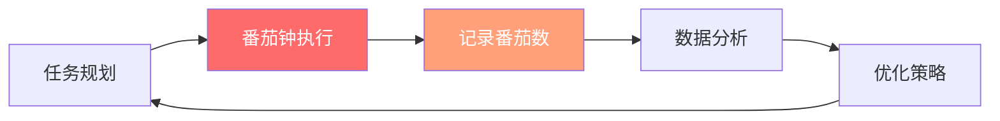

## 三、番茄工作法——专注力的科学

专注力不是天赋，而是一种可以训练的技能——番茄工作法（Pomodoro Technique）是目前被验证最有效的专注力训练系统之一。它由意大利人弗朗西斯科·西里洛（Francesco Cirillo）在 1980 年代末发明，至今仍是全球使用最广泛的时间管理工具。本节将从起源原理、操作流程、科学机制、进阶应用、常见误区五大维度，完整呈现番茄工作法的全貌。

### 3.1 番茄工作法的起源与背景

#### 3.1.1 创始故事

1987 年，罗马自由国际社会学院（Libera Università Internazionale degli Studi Sociali）的学生弗朗西斯科·西里洛发现自己无法集中注意力学习。他挑战自己——"能不能专注学习 10 分钟？"于是拿起厨房里一个番茄形状的计时器，番茄工作法由此诞生。

西里洛后来在 2006 年出版了《番茄工作法图解》（The Pomodoro Technique），系统记录了这一方法。他在书中强调：番茄工作法不是简单的计时技巧，而是一套完整的**个人流程管理框架**。

#### 3.1.2 为什么叫"番茄"

"Pomodoro"在意大利语中就是"番茄"的意思。西里洛用的那只番茄计时器成了这个方法的标志性符号。这个命名本身就传达了一个信息：**最好的工具往往是最简单的**。你不需要昂贵的软件或复杂的系统，一个计时器就够了。

#### 3.1.3 番茄工作法在时间管理体系中的定位

番茄工作法不是孤立存在的，它在时间管理金字塔中处于"执行层"——把计划转化为实际行动的工具：

| 层级 | 职责 | 典型方法 | 番茄工作法的角色 |
|---|---|---|---|
| 战略层 | 确定人生方向 | 人生规划、年度目标 | 不涉及 |
| 计划层 | 分解目标为任务 | GTD、四象限法 | 番茄钟从计划层获取任务 |
| 执行层 | 专注完成任务 | **番茄工作法**、时间块 | **番茄工作法的核心位置** |
| 回顾层 | 复盘优化 | 周报、数据追踪 | 番茄数据用于回顾分析 |

关键洞察：番茄工作法本身不做任务优先级排序——你需要先用四象限法或 GTD 确定做什么，然后用番茄钟来执行。这是很多人使用番茄钟失败的原因：他们直接用番茄钟开始工作，却没有先做好任务规划。

### 3.2 核心机制——为什么 25 分钟有效

#### 3.2.1 神经科学基础

番茄工作法之所以有效，是因为它与人类大脑的注意力机制高度吻合。以下是五个核心科学原理：

**原理一：降低启动阻力——蔡格尼克效应**

心理学家布鲁玛·蔡格尼克（Bluma Zeigarnik）在 1927 年发现：人们对未完成的任务有更强的记忆和焦虑感。这被称为"蔡格尼克效应"（Zeigarnik Effect）。

番茄工作法利用了这一效应的反面——"只需要专注 25 分钟"是一个**足够小的承诺**，大脑不会因为任务的巨大而产生抗拒。一旦你开始了第一个番茄钟，蔡格尼克效应会让你更难停下来，而不是更难开始。

**原理二：制造适度紧迫感——耶克斯-多德森定律**

1908 年，心理学家罗伯特·耶克斯（Robert Yerkes）和约翰·多德森（John Dodson）发现了一个倒 U 形曲线：**适度的压力能提升表现，但过度压力会降低表现**。这被称为"耶克斯-多德森定律"（Yerkes-Dodson Law）。

倒计时创造了适度的时间压力——你知道只有 25 分钟，所以会本能地集中注意力。但这种压力不足以触发焦虑，恰好处于"甜蜜点"。

**原理三：匹配注意力节律——持续注意力窗口**

认知神经科学研究表明，成年人的持续注意力在 20-45 分钟内保持最佳状态，之后会出现显著下降。25 分钟处于这个范围的中段，是一个**安全且有效的时长**——既不会太短（导致还没进入状态就结束了），也不会太长（导致后半段注意力涣散）。

**原理四：激活默认模式网络——结构化休息**

休息期间，大脑会切换到"默认模式网络"（Default Mode Network, DMN）——这是大脑在"不专注"时活跃的神经网络。DMN 对以下功能至关重要：

- 创造力和洞察力（灵感往往在休息时涌现）
- 问题解决（潜意识处理）
- 记忆巩固（将短期记忆转化为长期记忆）
- 自我反思和情绪调节

这意味着：**休息不是偷懒，而是大脑在后台继续工作**。

**原理五：量化反馈——可衡量性**

番茄钟产生的"番茄数"是一个**简单但有效的量化指标**。相比模糊的"我今天很忙"或"我今天效率不高"，"我今天完成了 8 个番茄钟"是可衡量、可比较、可改进的。

#### 3.2.2 25 分钟的生理学基础

从更微观的层面看，25 分钟的设置与神经递质的释放周期有关：

- **多巴胺**：开始一个有明确终点的任务时，大脑会释放多巴胺。25 分钟的倒计时让终点触手可及，维持了多巴胺的持续释放。
- **去甲肾上腺素**：适度的时间压力会触发去甲肾上腺素的释放，这让你保持警觉和专注。但过长时间的压力会导致皮质醇飙升，反而损害认知。
- **乙酰胆碱**：专注工作时，乙酰胆碱维持注意力的集中。25 分钟恰好是乙酰胆碱能有效维持的时间窗口。

### 3.3 完整操作流程

#### 3.3.1 准备工作

开始使用番茄工作法之前，需要做好四项准备：

**第一步：选择任务**

从你的任务管理系统（四象限矩阵、GTD 收集箱等）中选择今天要完成的任务。番茄钟不帮你做决策——你得先决定做什么。

**第二步：预估番茄数**

估计每个任务需要多少个番茄钟（1 个番茄钟 = 25 分钟专注工作）。初学者预估不准是正常的，记录下预估值和实际值的差异，你的预估能力会随时间提升。

**预估经验参考表：**

| 任务复杂度 | 番茄钟数量 | 典型示例 |
|---|---|---|
| 简单 | 1 个 | 回复 5 封邮件、填写表格 |
| 中等 | 2-3 个 | 写一篇博客文章、完成一个代码模块 |
| 较难 | 4-6 个 | 撰写项目方案、学习一个新概念框架 |
| 复杂 | 8+ 个 | 完成一份完整报告、设计系统架构 |

**第三步：准备工具**

你需要以下物品：
- **计时器**：手机 APP（推荐 Forest、Focus To-Do、番茄 Todo）、实体番茄计时器、或浏览器插件（推荐 Marinara）
- **记录表**：纸质笔记本或电子表格，用于记录番茄数和打断
- **打断记录本**：专门记录打断的纸或便签本

**第四步：创造环境**

- 关闭所有非必要的通知（手机静音、电脑关闭弹窗）
- 关闭即时通讯工具（微信、钉钉、Slack）
- 告知周围的人你即将进入专注状态（如戴耳机、放一个"专注中"的牌子）
- 准备好水和可能需要的工具（避免因起身取物而打断）

#### 3.3.2 执行流程

┌──────────────────────────────────────────────────────┐
│                   番茄钟执行流程                        │
│                                                        │
│  1. 选择当前最重要的任务                                │
│  2. 设置 25 分钟计时器                                  │
│  3. 全神贯注工作，直到计时器响起                         │
│  4. 在记录表上标记一个 ✓（完成）或 ✗（作废）            │
│  5. 休息 5 分钟（必须离开工作区域）                      │
│  6. 重复步骤 1-5                                       │
│  7. 每完成 4 个番茄钟，进行 15-30 分钟的长休息          │
│                                                        │
│  一天典型安排（8 个番茄钟）：                            │
│  [番茄][休息][番茄][休息][番茄][休息][番茄]            │
│  [== 长休息 15-30 分钟 ==]                             │
│  [番茄][休息][番茄][休息][番茄][休息][番茄]            │
│  [== 长休息 15-30 分钟 ==]                             │
│                                                        │
│  总专注时间：8 × 25 = 200 分钟（约 3.3 小时）          │
│  总用时：约 4.5-5 小时（含所有休息）                     │
└──────────────────────────────────────────────────────┘

#### 3.3.3 番茄钟期间的三条铁律

**铁律一：番茄钟不可分割**

一个番茄钟不能被中途打断。如果被迫中断（比如紧急会议），这个番茄钟**作废**，需要重新开始一个新的。这不是为了惩罚你，而是为了建立"番茄钟 = 完整专注"的心理锚点。

**铁律二：内部打断——记下就好**

专注时脑子里冒出其他想法（"哦对了，要买猫粮""那个 bug 怎么改"）是完全正常的。处理方法：

1. 在打断记录本上快速写下这个想法（5 秒内）
2. 在记录表上标记一个撇号（'）代表内部打断
3. 立刻回到当前任务

心理学解释：把想法写下来的行为叫做"蔡格尼克释放"——大脑不再需要"记住"这个想法，焦虑感消失，你可以安心回到工作。

**铁律三：外部打断——告知-记录-延迟**

当有人找你时，使用三步策略：

1. **告知**："我正在专注工作，5 分钟后回复你，可以吗？"
2. **记录**：在打断记录本上记下对方的需求
3. **延迟**：番茄钟结束后再处理

如果打断无法延迟（比如老板紧急召见），那么这个番茄钟作废。记录外部打断的数量，这会帮助你优化工作环境。

#### 3.3.4 休息时间做什么

休息时间的核心原则是**恢复注意力**，而不是消耗注意力。

**推荐的休息活动：**
- 站起来走动（促进血液循环，激活大脑）
- 看看窗外远处（缓解眼部肌肉疲劳）
- 喝水或吃点零食（补充水分和能量）
- 做简单的伸展（缓解肩颈紧张）
- 闭眼深呼吸 10 次（激活副交感神经）
- 和同事闲聊几句（社交互动能恢复认知资源）

**休息时间的禁忌：**
- 刷社交媒体（注意力资源进一步消耗）
- 查看工作邮件（无法真正脱离工作状态）
- 开始新的工作任务（休息时间被侵吞）
- 阅读需要深度思考的内容（大脑没有真正休息）

### 3.4 番茄工作法的进阶应用

#### 3.4.1 番茄数预估校准

每周回顾时，制作一个预估-实际对比表。这是提升时间管理能力最有效的练习：

| 任务 | 预估番茄数 | 实际番茄数 | 偏差 | 差异原因分析 |
|---|---|---|---|---|
| 写项目报告 | 4 | 6 | +50% | 中途遇到数据问题，花了额外时间查找 |
| 回复邮件 | 1 | 1 | 0% | 准确 |
| 准备会议 PPT | 3 | 2 | -33% | 使用了模板，节省了时间 |
| 学习新框架 | 6 | 8 | +33% | 概念比预想的复杂 |
| 代码审查 | 2 | 3 | +50% | 代码质量问题比预期多 |

**校准规则：**
- 如果连续 3 个任务都超估 50% 以上，说明你倾向于低估任务复杂度——下次预估乘以 1.5
- 如果连续 3 个任务都低估 30% 以上，说明你可能在番茄钟内不够专注——检查是否有隐藏的打断
- 每月汇总一次数据，你会对自己的"时间感知"有越来越准确的认识

#### 3.4.2 打断日志分析

记录所有打断你专注的事件，每周分析一次。这是优化工作环境最有价值的数据来源：

| 打断类型 | 频率 | 原因分析 | 应对策略 |
|---|---|---|---|
| 同事当面询问 | 每天 3 次 | 没有设置"勿扰时段" | 在桌上放"专注中"提示牌，设置固定"开放时间" |
| 手机消息通知 | 每天 10 次 | 未开启勿扰模式 | 工作时手机静音+背面朝下，或使用 Forest APP |
| 自己想到其他事 | 每天 5 次 | 正常现象 | 准备打断记录本，快速记下后继续 |
| 邮件提醒 | 每天 8 次 | 邮件客户端通知未关闭 | 关闭所有邮件通知，每天固定 2-3 个时段集中处理 |
| 突然饿了/渴了 | 每天 1 次 | 番茄钟前未准备 | 开始前准备好水和零食 |
| 需要上厕所 | 每天 1 次 | 正常生理需求 | 番茄钟前解决，避免中间打断 |

**分析框架：**
- 统计每周总打断次数，画出趋势线
- 计算内部打断 vs 外部打断的比例
- 找出最频繁的打断来源，制定针对性策略
- 目标：将每周打断次数逐步降低 20%

#### 3.4.3 番茄钟与精力管理结合

番茄工作法的真正威力在于**与精力管理结合**。根据你的精力曲线安排不同类型的任务：

| 时段 | 精力状态 | 适合的任务类型 | 番茄钟策略 |
|---|---|---|---|
| 上午 9:00-12:00 | 精力高峰期 | 深度工作、创造性任务、学习新概念 | 标准番茄钟，全力专注 |
| 中午 12:00-13:30 | 精力低谷 | 午餐、午休 | 不安排番茄钟 |
| 下午 13:30-15:00 | 精力恢复期 | 简单任务、邮件处理、整理工作 | 使用较短的番茄钟（20 分钟） |
| 下午 15:00-17:00 | 精力次高峰 | 协作任务、会议、头脑风暴 | 标准番茄钟，可加入社交元素 |
| 晚上 19:00-21:00 | 因人而异 | 学习、轻度创造性工作 | 根据个人精力调整时长 |

#### 3.4.4 番茄钟变形方案

25 分钟不是唯一答案。以下是经过验证的变形方案：

**52/17 法则**

美国时间追踪公司 DeskTime 分析了最高效员工的工作模式，发现他们平均工作 52 分钟，休息 17 分钟。这不是随意的数字——它更接近一个"自然工作单元"，适合需要长时间深度思考的任务（如写代码、写报告）。

适用场景：程序员、作家、研究员等需要深度心流的工作。

**90/20 法则**

基于睡眠研究者纳撒尼尔·克莱特曼（Nathaniel Kleitman）发现的"基本休息-活动周期"（Basic Rest-Activity Cycle, BRAC），人类的大脑以约 90 分钟为一个周期在高度警觉和较低警觉之间波动。90/20 法则利用了这个超日节律（Ultradian Rhythm）。

适用场景：需要长时间沉浸的工作，如大型项目的规划、复杂问题的解决。

**自定义番茄钟**

没有任何科学证据说 25 分钟是"唯一正确"的时长。你需要通过实验找到自己的最佳时长：

1. **从 25 分钟开始**，使用 1-2 周
2. 如果觉得太短（刚进入状态就结束了），增加到 **30 分钟**
3. 如果觉得太长（后半段注意力涣散），缩短到 **20 分钟**
4. 每次调整后使用至少一周再做判断
5. 记录每个时长下你完成的番茄数和打断数

**找到你的"黄金时长"的判断标准：**
- 你能在这个时间内保持 90% 以上的专注度
- 计时器响起时你有适度的疲惫感，而不是完全耗尽或毫无感觉
- 你能在休息后顺利进入下一个番茄钟
- 你一天能完成 6-10 个番茄钟而不感到过度疲劳

#### 3.4.5 番茄工作法与其他方法的组合

番茄钟不是独立系统，它可以与几乎所有主流时间管理方法组合使用：

**与 GTD（Getting Things Done）组合**

GTD 负责任务的收集、处理和组织，番茄钟负责执行。在 GTD 的"下一步行动"列表中，每项都标注需要的番茄钟数量，然后按优先级依次执行。

**与四象限法组合**

四象限法帮你决定任务优先级，番茄钟帮你专注执行。关键是：**把大部分番茄钟花在第二象限（重要不紧急）**，因为这些任务才是长期价值所在。

**与看板法组合**

在看板的每个任务卡片上标注预估番茄数。当你把一个任务从"进行中"移到"完成"时，记录实际花费的番茄数。这让看板从"状态管理工具"升级为"效能管理工具"。

**与时间块（Time Blocking）组合**

在日历上划分出番茄钟时间块。例如：
- 09:00-12:00：深度工作番茄钟（6 个番茄钟）
- 13:30-15:00：浅层工作番茄钟（3 个番茄钟）
- 15:00-17:00：协作时间（会议、讨论）

#### 3.4.6 团队番茄工作法

番茄工作法不仅适用于个人，也可以在团队中实施：

**同步番茄钟**

整个团队同时开始、同时休息。好处是：
- 休息时间可以进行非正式沟通
- 减少团队成员之间的互相打断
- 建立团队专注文化

**异步番茄钟**

每个成员按自己的节奏运行番茄钟，但使用共享的看板展示当前状态。好处是：
- 尊重个人的精力节奏差异
- 灵活性更高
- 适合远程团队

**实施建议：**
- 在 Slack/钉钉设置"专注时间"状态
- 建立团队规范：当某人显示"专注中"时，非紧急事项延迟联系
- 每周分享团队的番茄数数据，用于流程优化

### 3.5 番茄工作法的常见误区

#### 3.5.1 误区一：25 分钟是神圣不可变的

**误区**：很多人把 25 分钟当作绝对标准，不敢调整。

**纠正**：25 分钟只是一个起点。科学上，没有"完美的专注时长"——它因人、因任务、因时段而异。你应该根据自己的实验数据来调整，而不是盲目遵循一个来自 1980 年代厨房计时器的数字。

#### 3.5.2 误区二：番茄钟数量越多越好

**误区**：有些人追求一天完成 12、14、甚至 16 个番茄钟，把番茄数当作"勤奋"的指标。

**纠正**：番茄钟的目标是**质量**，不是数量。一天 6-8 个高质量番茄钟，比 12 个低质量番茄钟更有价值。如果你一天能完成 8 个番茄钟且保持高质量，这已经是非常高效的工作日了（实际专注时间超过 3 小时）。

研究数据：根据 RescueTime 的调查，普通办公室员工每天真正的深度工作时间平均只有 2.5 小时（约 6 个番茄钟）。如果你能稳定达到 8 个，你已经超过了大多数人。

#### 3.5.3 误区三：被打断就等于失败

**误区**：有些人在番茄钟被打断后感到沮丧，认为自己"不够自律"。

**纠正**：打断是**数据**，不是失败。每次打断都是一个信号，告诉你需要优化工作环境或流程。记录打断、分析规律、制定策略——这才是番茄工作法的精髓。完美不被打断的一天几乎不存在，重要的是不断减少打断的频率和影响。

#### 3.5.4 误区四：休息时间可以跳过

**误区**：有人觉得"我正进入状态，为什么要停下来？"

**纠正**：跳过休息会导致：
- 注意力资源的累积消耗（认知疲劳）
- 下一个番茄钟的质量下降
- 一天能完成的番茄钟总数减少
- 长期来看更容易产生倦怠

如果你真的进入心流状态，可以使用"变长番茄钟"方案（见下文），但**休息本身不能省略**。

#### 3.5.5 误区五：只用番茄钟就够了

**误区**：有些人认为番茄工作法是万能的，只需要这一个工具。

**纠正**：番茄钟解决的是"如何专注执行"的问题，但不解决"做什么"和"为什么做"的问题。你需要：

- **目标系统**（年/月/周目标）——决定方向
- **任务系统**（GTD/四象限）——决定做什么
- **番茄工作法**——专注执行
- **回顾系统**（周报/月报）——持续优化

这四个系统缺一不可。

### 3.6 针对不同场景的番茄钟策略

#### 3.6.1 程序员的番茄钟

编程工作有其特殊性——你需要理解复杂的代码逻辑，一旦被打断，恢复上下文的成本非常高。

**推荐策略：使用 45-50 分钟的长番茄钟**

理由：代码审查和编写通常需要更长的预热时间。研究表明，程序员被打断后平均需要 23 分钟才能恢复到之前的专注状态（University of California, Irvine 研究）。长番茄钟减少了切换次数。

**具体做法：**
- 番茄钟开始前，在注释中写下"我正在做什么"和"下一步要做什么"
- 如果遇到 bug 需要调试，先记录下来，当前番茄钟继续处理主任务
- 休息时站起来走动，不要看代码

#### 3.6.2 写作者的番茄钟

写作是高度依赖心流的工作，硬性打断有时会破坏创作状态。

**推荐策略：使用变长番茄钟**

具体做法：
- 设置最短时间（如 25 分钟），但允许自己在状态好时继续
- 当你自然感到疲惫或灵感枯竭时停止，记录实际时长
- 分析你的"最佳写作时长"，以此为基准设定后续番茄钟

#### 3.6.3 学生的番茄钟

学生需要同时处理学习、作业、考试准备等多种任务。

**推荐策略：标准 25 分钟番茄钟 + 主题轮换**

具体做法：
- 每个番茄钟专注一个科目的一个具体任务
- 不同科目之间轮换（如数学→英语→物理），避免单一科目疲劳
- 在番茄钟之间用 5 分钟做"主动回忆"（合上书本，回想刚才学了什么）

#### 3.6.4 管理者的番茄钟

管理者的挑战是：大量会议和频繁被打断是工作的一部分。

**推荐策略：保护"深度工作"番茄钟**

具体做法：
- 在日历上划出不可侵犯的"深度工作"时段（如每天上午 9:00-11:00）
- 将会议集中安排在下午
- 设置固定的"开放时间"供团队咨询
- 在开放时间内不做需要深度思考的任务

### 3.7 番茄工作法的工具生态

#### 3.7.1 APP 工具对比

| 工具 | 平台 | 核心功能 | 特色 | 适合人群 |
|---|---|---|---|---|
| Forest | iOS/Android | 种树激励机制 | 专注时种树，中途退出树会枯死 | 需要视觉激励的用户 |
| Focus To-Do | 全平台 | 番茄钟 + 任务管理 | 与 Todoist 集成，数据统计全面 | 需要任务管理一体化的用户 |
| Toggl Track | 全平台 | 时间追踪 + 番茄钟 | 自动计时，团队协作 | 需要精确时间追踪的专业用户 |
| Marinara | 浏览器插件 | 浏览器内番茄钟 | 无需安装，Chrome/Firefox 可用 | 网页工作者 |
| Be Focused | macOS/iOS | 原生番茄钟 | 与 Apple 生态无缝集成 | 苹果设备用户 |

#### 3.7.2 低科技方案

如果你不想使用电子设备，以下低科技方案同样有效：

- **实体番茄计时器**：旋转上发条的物理计时器，滴答声本身就是专注的白噪音
- **沙漏**：25 分钟沙漏提供了视觉化的"时间流逝感"
- **纸质记录表**：用笔记本记录番茄数和打断，手写本身就有助于记忆

#### 3.7.3 纸质番茄记录表模板

日期：________    今日目标番茄数：______

任务列表：
┌─────────────────────────┬──────┬──────┬──────┐
│ 任务名称                  │ 预估  │ 实际  │ 打断  │
├─────────────────────────┼──────┼──────┼──────┤
│                         │      │      │      │
├─────────────────────────┼──────┼──────┼──────┤
│                         │      │      │      │
├─────────────────────────┼──────┼──────┼──────┤
│                         │      │      │      │
└─────────────────────────┴──────┴──────┴──────┘

番茄钟记录（每完成一个打 ✓，作废打 ✗）：
上午：✓ ✓ ✓ ✓
下午：✓ ✓ ✗ ✓
今日总计：7 个番茄钟（1 个作废）

打断记录：
1. 10:23 - 想起要给客户回邮件（内部）
2. 14:15 - 同事问项目进度（外部）
3. 15:30 - 番茄钟作废原因：紧急电话

今日反思：____________________________________

### 3.8 从入门到精通的成长路径

#### 3.8.1 第一阶段：适应期（第 1-2 周）

**目标**：养成习惯，不追求完美

- 每天完成 4 个番茄钟即可
- 不要因为被打断而沮丧，重点是**坚持使用**
- 记录基本数据（番茄数、打断次数）
- 从标准 25/5 开始，不要急着调整

#### 3.8.2 第二阶段：优化期（第 3-4 周）

**目标**：优化环境，减少打断

- 分析打断日志，制定减少打断的策略
- 开始尝试不同的番茄钟时长
- 每天目标提升到 6 个番茄钟
- 开始预估任务所需的番茄数

#### 3.8.3 第三阶段：精进期（第 2-3 月）

**目标**：形成稳定的个人系统

- 找到自己的"黄金番茄钟时长"
- 预估准确率提升到 ±20% 以内
- 每天稳定完成 6-8 个高质量番茄钟
- 将番茄钟与精力管理结合

#### 3.8.4 第四阶段：精通期（第 3 月以后）

**目标**：番茄钟成为无意识的习惯

- 不需要刻意提醒自己使用番茄钟
- 能根据任务类型自动选择合适的时长
- 番茄数据成为自我管理的核心指标
- 能够指导他人使用番茄工作法

### 3.9 番茄工作法的心理学深度解析

#### 3.9.1 为什么番茄钟能对抗拖延症

拖延症的核心是**情绪调节问题**，不是时间管理问题。我们拖延的不是任务本身，而是任务引发的负面情绪（焦虑、无聊、挫败感）。

番茄工作法从三个维度对抗拖延：

1. **降低启动门槛**："只做 25 分钟"是一个几乎没有心理负担的承诺
2. **提供即时反馈**：每完成一个番茄钟就是一次"小胜利"，激活大脑的奖励回路
3. **分离"开始"和"完成"**：你不需要在开始时就想着完成整个任务，只需要关注当前的 25 分钟

#### 3.9.2 番茄钟与心流状态

米哈里·契克森米哈赖（Mihaly Csikszentmihalyi）提出的"心流"状态是高效工作的巅峰体验。心流需要四个条件：

1. 明确的目标——番茄钟的任务选择满足了这个条件
2. 即时的反馈——计时器的倒计时提供了持续反馈
3. 技能与挑战的平衡——番茄钟的紧迫感创造了适度挑战
4. 不被打断的环境——番茄钟的规则保护了这个条件

矛盾的是：心流一旦形成就不想被打断，而番茄钟要求你在 25 分钟后停止。解决方案是**变长番茄钟**——设定最短时间，但允许在心流状态中继续工作。

#### 3.9.3 承诺装置效应

番茄钟本质上是一个"承诺装置"（Commitment Device）——你通过设定计时器，向自己做出了一个"在这 25 分钟内专注工作"的承诺。研究表明，承诺装置能显著提升任务完成率，因为它：

- 将模糊的意图转化为具体的行动
- 创造了一个"开始"的触发点
- 让你对自己的行为有了觉察

### 3.10 总结

番茄工作法的核心价值不在于"25 分钟"这个数字，而在于它背后的三个原则：

1. **时间是有边界的**——给每个任务设定明确的时间段，而不是模糊地"一直做"
2. **休息是必要的**——不是奖励，而是保持高效运转的必需品
3. **数据驱动改进**——记录、分析、优化，形成正反馈循环

记住：番茄工作法是一种**技能**，不是一种**知识**。你不能通过阅读掌握它，只能通过实践掌握它。从今天开始，选择一个任务，设置一个 25 分钟的计时器，然后开始你的第一个番茄钟。

**速查清单：**

□ 准备：选择任务 → 预估番茄数 → 准备工具 → 创造环境
□ 执行：设 25 分钟 → 专注工作 → 标记结果 → 休息 5 分钟
□ 规则：内部打断记下来 → 外部打断告知延迟 → 番茄钟不可分割
□ 进阶：记录番茄数 → 分析打断 → 结合精力管理 → 找到你的黄金时长
□ 回顾：每周预估校准 → 每月数据汇总 → 持续优化
