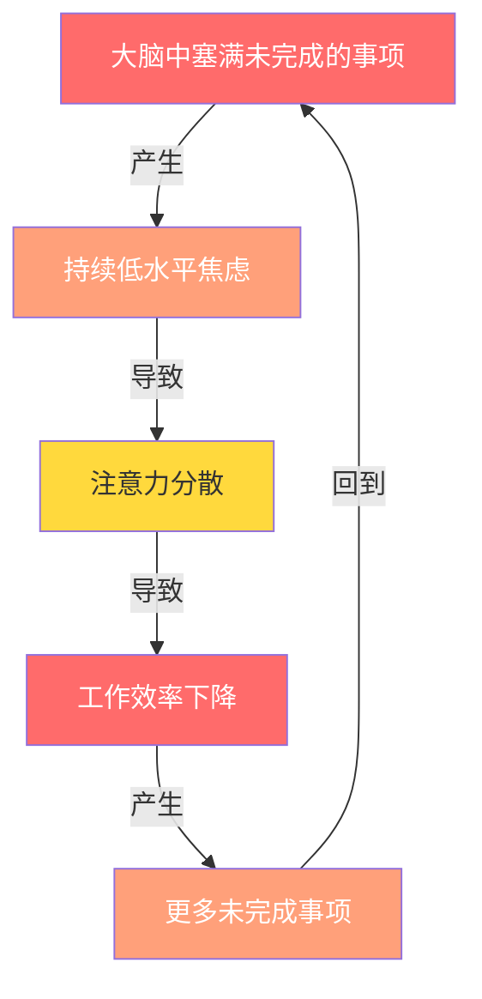
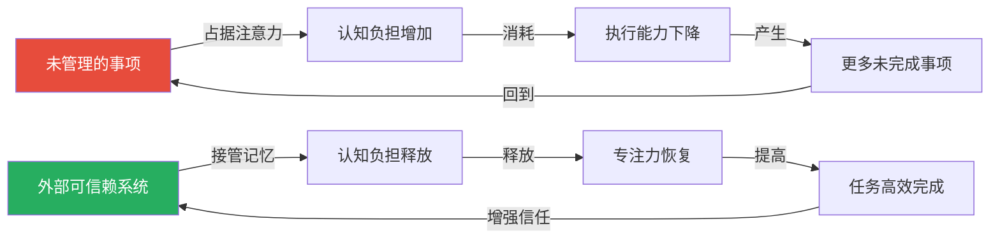
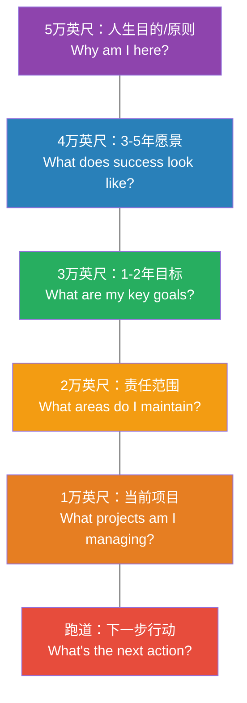
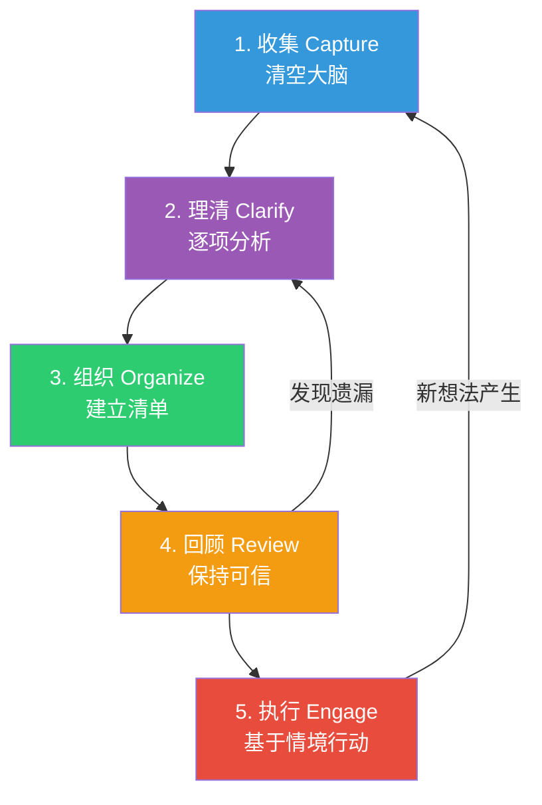
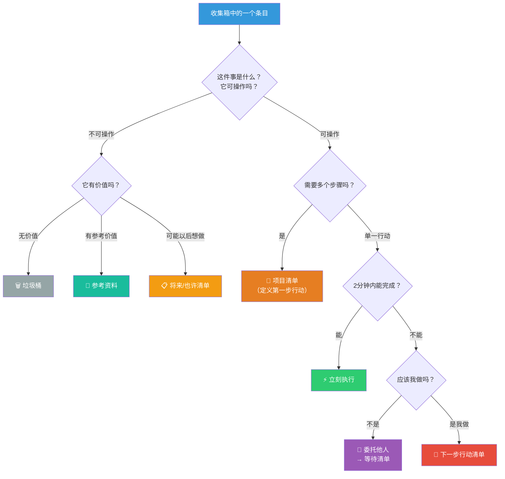
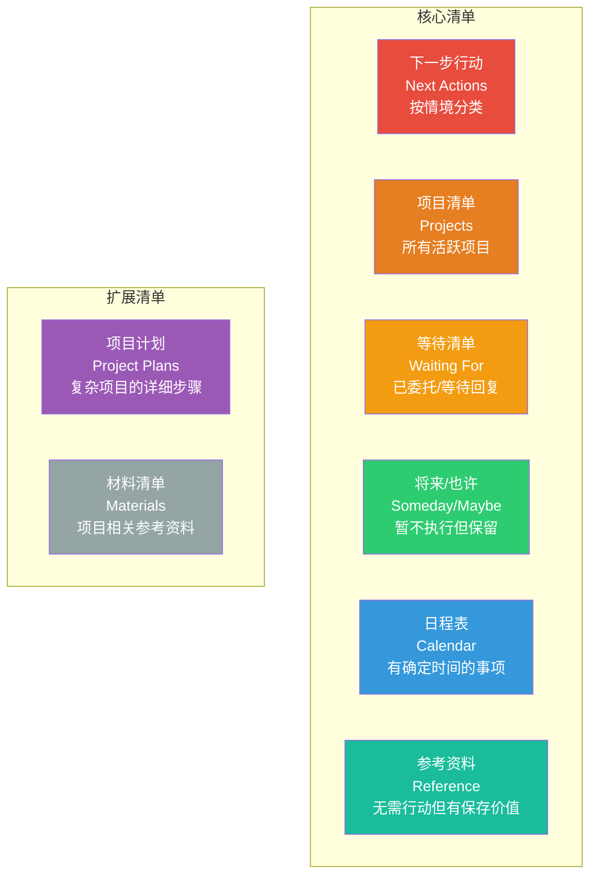
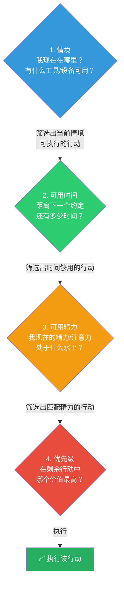
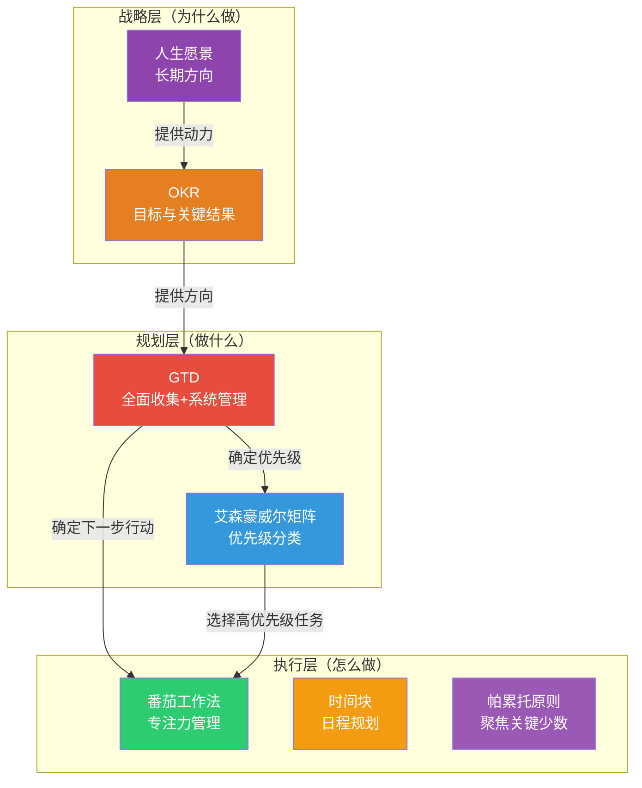
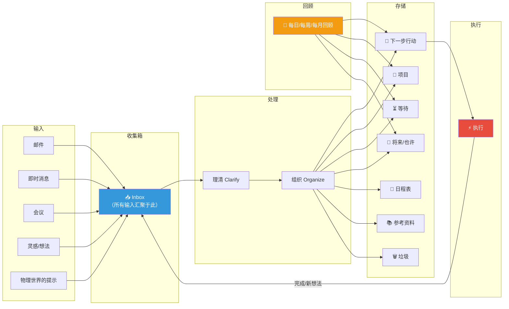

## 四、GTD方法论——无压工作的系统

在所有个人效率系统中，GTD（Getting Things Done）是唯一一个同时解决了"做什么"和"怎么保持内心平静"两个问题的方法。它不仅是一套任务管理流程，更是一种**认知卸载**的思维方式——通过建立可信赖的外部系统，将大脑从记忆负担中解放出来，让你在任何时刻都能做出最优选择且不感到焦虑。

### 4.1 GTD的诞生与创始人

#### 4.1.1 戴维·艾伦的传奇经历

戴维·艾伦（David Allen）并非学术象牙塔中的理论家。他的人生经历是GTD方法论最好的注脚——GTD的每一个原则都来自真实世界的反复验证。

艾伦在1980年代曾做过多个行业的管理咨询工作。他注意到一个普遍现象：**高管们的焦虑往往不是因为工作量太大，而是因为没有把工作"想清楚"**。一个人可能只有一件待办事项，但如果这件事没有被明确界定（需要什么行动、期望的结果是什么、下一步是什么），它就会持续占据大脑后台处理资源，产生挥之不去的焦虑感。

1980年代末，艾伦开始系统化整理他的方法论。经过十多年的实践验证和迭代，他在2001年出版了《Getting Things Done: The Art of Stress-Free Productivity》。这本书一经出版就引发了全球性的生产力运动。《福布斯》杂志将其称为"过去十年最重要的商业书籍之一"，《连线》杂志称艾伦为"个人生产力领域的头号大师"。

#### 4.1.2 为什么GTD影响如此深远

GTD之所以经久不衰，在于它解决了一个被长期忽视的根本问题：**人们感到压力和不堪重负，通常不是因为事情太多，而是因为事情没有被恰当地管理**。

在GTD之前，主流时间管理方法关注的核心是"优先级"——先做重要的事。但艾伦指出，如果你的大脑还在后台不断提醒你"别忘了给客户回邮件""孩子的学校表格还没填""汽车该保养了"，那么即使你知道什么最重要，也很难真正集中注意力。**GTD的突破在于：它首先让你把所有"开放回路"（Open Loops）都清空出来，然后为每一条找到归属，最后让你的大脑安心休息。**

GTD打破了这个恶性循环——通过把一切转移到外部系统，切断了A→B的链条。

### 4.2 GTD的科学基础

GTD并非经验主义的产物，它与认知心理学和神经科学的多个核心理论高度吻合。

#### 4.2.1 蔡格尼克效应（Zeigarnik Effect）

1927年，苏联心理学家布鲁玛·蔡格尼克（Bluma Zeigarnik）在柏林的一家餐厅观察到一个有趣现象：服务员能准确记住未结账桌的订单，但一旦客人结账离开，他们立刻就忘记了。这揭示了一个重要规律：**未完成的任务会在大脑中保持"激活状态"，持续消耗认知资源**。

这就是你总觉得"心里有事"的科学解释。每一个未完成的任务——无论大小——都在你的认知后台占用一个"进程"。当这些进程太多时，系统就会过载，表现为焦虑、注意力涣散和睡眠质量下降。

GTD通过两个机制对抗蔡格尼克效应：
1. **外化承诺**：把任务从大脑转移到外部系统，解除大脑的"记忆责任"
2. **定义下一步行动**：将模糊的"待办事项"转化为具体的"下一步物理行动"，大脑不再需要反复揣摩"我该从哪里开始"

#### 4.2.2 工作记忆的容量限制

认知心理学的经典研究（George Miller, 1956）表明，人类工作记忆的容量约为7±2个信息块（chunks）。但这并不意味着你可以同时管理7个任务——因为每个任务可能包含多个需要追踪的子项、依赖关系和截止日期。

现代研究进一步表明，在多任务环境下，工作记忆的有效容量会降至3-4个信息块。这意味着：**试图在大脑中管理超过3-4个活跃任务，必然导致质量下降和遗忘**。

GTD的解决方案很直接：不要用大脑来管理任务。把管理工作交给外部系统，大脑只需要专注于"执行当前这一个任务"。

#### 4.2.3 前额叶皮层的"带宽"理论

前额叶皮层（Prefrontal Cortex）是大脑中负责计划、决策和自控的区域。它的资源是有限的——每一次你用意志力抵抗诱惑、做决策或抑制冲动，都在消耗前额叶的"带宽"。

斯坦福大学的研究（B.J. Fogg）表明，决策疲劳会显著降低后续决策的质量。当你在一天中反复思考"我接下来该做什么""这件事该不该现在处理""那个项目进展到哪了"，每一次这样的内部对话都在消耗宝贵的前额叶资源。

GTD将这些决策"前置化"和"结构化"：
- **收集阶段**一次性决定"这是否需要行动"
- **组织阶段**一次性决定"这个行动属于哪个情境"
- **执行阶段**只需从当前情境的清单中选择最合适的任务，无需重新思考优先级

### 4.3 GTD的核心理念与哲学

#### 4.3.1 核心命题

GTD的核心理念可以用一句话概括：**你的大脑是用来产生想法的，不是用来储存想法的。**

这句话看似简单，但蕴含了一个深刻的认知原则：大脑的长处是创造性思维、问题解决和决策判断，而非记忆和提醒。当你把大脑当作"待办清单"使用时，你就浪费了它最宝贵的能力，同时让它在不擅长的领域（记忆）中挣扎。

#### 4.3.2 五个核心假设

GTD建立在五个关于人类认知和心理的假设之上：

**假设一：你不可能记住所有需要做的事情。** 无论你的记忆力多强，总有一些事情会被遗忘。而被遗忘的事情并不意味着不重要——它们可能在最不合适的时机跳出来提醒你（比如凌晨三点）。

**假设二：你对任何一件事情感到焦虑，是因为你还没有决定它需要什么行动。** 焦虑的本质是"未决状态"。一旦你明确知道下一步该怎么做，即使还没有开始做，焦虑感也会显著降低。这就是为什么写完待办清单后你会感到轻松——不是因为事情变少了，而是因为你"想清楚了"。

**假设三：你对任何一件事情感到不堪重负，是因为你还没有把结果和行动定义清楚。** "整理车库"是一个让人崩溃的任务。但"把工具箱从车库搬到地下室"就是一个清晰、可执行的行动。模糊产生压力，清晰产生动力。

**假设四：任何占据你注意力的事情，如果不是已经在你的系统中被适当管理，就是在消耗你的精力。** 没有中间状态。要么它在你的系统中有明确的位置，要么它在你的大脑后台持续运行、消耗认知资源。

**假设五：你对自己的系统有信心时，才能真正放松。** 这是GTD最深层的哲学。真正的"无压工作"不是通过冥想或心态调整实现的——它来自于你**确实知道**所有重要的事情都被妥善管理着，没有任何遗漏。这种确定性带来的内心平静，是任何"正念练习"都无法替代的。

### 4.4 五层视界模型——GTD的战略框架

很多人误以为GTD只是一个"待办清单系统"。实际上，戴维·艾伦提出了一个完整的**五层视界模型**（Horizons of Focus），将从日常琐事到人生使命的全部视野纳入同一个框架。理解这个模型，是将GTD从"任务管理"升级为"人生管理"的关键。

| 视界层级 | 高度隐喻 | 时间跨度 | 核心问题 | 示例 |
|---|---|---|---|---|
| 第5层 | 5万英尺 | 终身 | 我的人生目的和原则是什么？ | "成为一个帮助他人成长的人" |
| 第4层 | 4万英尺 | 3-5年 | 成功的样子是什么？ | "创办一家有社会影响力的企业" |
| 第3层 | 3万英尺 | 1-2年 | 我的关键目标是什么？ | "今年完成MBA学位" |
| 第2层 | 2万英尺 | 持续 | 我负责维护哪些领域？ | 工作、家庭、健康、财务、学习 |
| 第1层 | 1万英尺 | 数周-数月 | 我在管理哪些项目？ | "重新装修客厅""准备季度报告" |
| 跑道 | 地面 | 现在 | 下一步具体的物理行动是什么？ | "给装修公司打电话预约量房" |

**关键洞察：** 大多数人只在"跑道"和"1万英尺"层级运作——他们整天忙于处理下一步行动和项目，却很少抬头看看方向是否正确。艾伦建议至少每月回顾一次"3万英尺以上"的内容，确保你忙碌的方向与人生愿景一致。**做正确的事比正确地做事更重要。**

### 4.5 GTD的五个核心步骤——深度解析

GTD的五个步骤构成了一个完整的循环：收集→理清→组织→回顾→执行。这不是一次性的操作，而是持续运转的系统。

#### 4.5.1 步骤一：收集（Capture）——清空大脑

**核心原则：** 把所有引起你注意的事情从大脑中转移到外部的"收集箱"（inbox）中。

**为什么收集如此重要？**

大脑的工作方式决定了它无法"选择性遗忘"。每一个未处理的信息——一封未回复的邮件、一个模糊的想法、一个未完成的承诺——都会在大脑后台保持激活。收集的目的不是整理，而是**卸载**。先把所有东西从大脑里倒出来，再考虑怎么处理。

**收集工具的选择：**

| 工具类型 | 适用场景 | 优点 | 缺点 |
|---|---|---|---|
| 实体笔记本 | 会议、头脑风暴、离线场景 | 零门槛、书写增强记忆 | 不便搜索、不便同步 |
| 手机备忘录 | 随时随地的灵感捕捉 | 永远在手边、可同步 | 打字慢于思考速度 |
| 语音备忘录 | 开车、走路、双手被占用时 | 速度最快、不受环境限制 | 需要事后转录 |
| 邮件转发给自己 | 线上信息的快速收集 | 已有习惯、容易操作 | 容易与其他邮件混淆 |
| 专用收集工具 | 集中收集 | 与其他系统隔离、专注 | 需要学习成本 |
| 实体收据盒 | 物质世界的"收集箱" | 物理物品有归宿 | 占空间 |

**收集的关键原则：**

1. **不要在收集阶段做任何判断。** 收集时你只需要回答一个问题："这件事是否引起了我的注意？"如果答案是"是"，就放进去。不要在这一步思考它是否重要、紧急或可行——这些判断留给"理清"阶段。

2. **捕捉"一切"。** 从"完成公司战略报告"到"买一盒牙签"，从"改善婚姻关系"到"给阳台上的植物浇水"。GTD的前提是：任何占据你注意力的事情，如果不进入系统，就在消耗你的精力。

3. **保持收集箱数量尽可能少。** 原则是"尽量少，但足够多"。通常3-5个收集箱就够了：一个实体笔记本（随身）、一个手机应用、一个工作邮箱。收集箱太多会导致"收集疲劳"——你需要检查的地方越多，越容易遗漏。

4. **定期清空收集箱。** 收集箱是临时存放区，不是最终归宿。理想状态是每天清空一次，最长不超过48小时。堆积的收集箱会让系统失去可信度。

**"大脑清空"练习（Mind Sweep）：**

这是GTD实施中最重要的初始化操作。找一个安静的、不被打扰的地方，花1-2小时，把脑子里**所有**"未完成的事项"（Open Loops）都写下来。

具体操作：
- 准备一个大笔记本或打开一个空白文档
- 设定计时器为20分钟
- 不停地写，不要停顿、不要判断、不要排序
- 写完20分钟后休息5分钟，再继续
- 重复2-3轮，直到你真的想不出更多东西

典型的"大脑清空"清单会包含以下领域的事项：

| 领域 | 典型事项示例 |
|---|---|
| 工作 | 未完成的项目、待回的邮件、需要预约的会议、未提交的报告 |
| 财务 | 账单支付、保险续期、税务申报、投资研究 |
| 健康 | 预约体检、买药、调整饮食计划、购买运动装备 |
| 家庭 | 家居维修、装修计划、孩子学校事务、家庭聚会筹备 |
| 人际关系 | 需要回复的朋友消息、未赴的约会、需要道歉或感谢的事 |
| 个人成长 | 想读的书、想学的技能、想去的地方、想培养的习惯 |
| 数字生活 | 清理邮箱、备份照片、更新软件、注销不用的账号 |
| 物品 | 需要归还的物品、需要购买的东西、需要丢弃的杂物 |

大多数人在第一次做这个练习时能写出**100-300个事项**。这个数字本身就很说明问题——你的大脑一直在后台管理着数百个"待办线程"，难怪你会感到焦虑。

#### 4.5.2 步骤二：理清（Clarify）——逐项决策

收集完成后，你面前是一个包含大量条目的"收集箱"。理清阶段的目标是：**对每一个条目做出明确的决策**。

**关键概念一：两分钟原则（Two-Minute Rule）**

如果一件事能在两分钟内完成，**立刻做掉**。不要记录、不要计划、不要推迟——直接做。

为什么是两分钟？因为记录一件事（写下它、分类它、以后再找回它）加上上下文切换的成本，通常就超过两分钟了。换句话说，对于短任务而言，"管理它"的成本比"做掉它"更高。

两分钟原则的常见应用场景：
- 回复一封简短的邮件
- 签署一份文件
- 给同事发一条确认消息
- 把文件归档到正确的位置
- 更新一个简单的表格
- 付一笔账单（如果已设置自动扣款则更短）
- 记下一个电话号码

**重要提醒：** 两分钟是一个大致的估计，不需要精确计时。关键判断标准是："完成这件事的时间是否比管理它的时间更短？"如果你在实践中觉得两分钟太短，可以适当调整到三或五分钟，但不要超过五分钟——否则你很容易陷入"什么都当场做"的陷阱，反而没有处理完收集箱。

**关键概念二：下一步行动（Next Action）**

这是GTD中最重要的概念之一。每一个可操作的事项，都必须被定义为一个**具体的、可执行的物理行动**。

| 模糊描述 | 具体下一步行动 |
|---|---|
| 准备会议 | 打开日历应用，预约周三下午2点的3号会议室 |
| 处理报销 | 从抽屉中取出上周的出租车发票，贴在报销单上 |
| 学习Python | 在浏览器中打开Coursera，完成第3课的视频和练习 |
| 买车险 | 在浏览器中打开比价网站，输入车辆信息获取三家报价 |
| 整理书房 | 把书架上"已读"的书搬到纸箱中，标注"捐赠" |

为什么要这样定义？因为**大脑执行具体指令的效率远高于处理模糊概念**。当你看到"准备会议"时，大脑需要额外花几秒钟思考"具体要做什么"。但当你看到"预约会议室"时，大脑可以直接进入执行模式——不需要任何额外的思考。

**关键概念三：项目（Project）的定义**

在GTD中，"项目"的定义非常宽泛：**任何需要多个步骤才能完成的结果，都是一个项目**。

这意味着：
- "举办公司年会"是一个项目（数十个步骤）
- "买一个新的笔记本电源适配器"也是一个项目（搜索型号→比价→下单→收货）
- "给妈妈打个电话确认周末安排"也可能是一个项目（如果需要先查日历确认自己的时间）

项目的关键要求：**每个项目都必须有一个明确的"完成标准"**——你怎么知道这件事做完了？"改善英语水平"不是一个合格的项目（没有完成标准）。"通过雅思考试，总分7分"就是一个合格的项目。

#### 4.5.3 步骤三：组织（Organize）——建立清单系统

理清阶段产生的分类结果，需要被放入对应的清单中。GTD建议建立以下核心清单：

**清单系统总览：**

**各清单详解：**

**① 下一步行动清单（Next Actions）**

这是你最频繁使用的清单。它包含你所有项目的所有"下一步具体物理行动"。

重要规则：下一步行动清单必须**按情境（Context）分类**，而不是按项目或优先级分类。

| 情境标签 | 含义 | 典型行动示例 |
|---|---|---|
| @办公室 | 需要在办公室环境中完成 | 打印报告、整理文件、面谈 |
| @电话 | 需要打电话 | 预约医生、跟进客户、确认快递 |
| @电脑 | 需要电脑完成 | 写文档、做表格、发邮件、写代码 |
| @外出 | 需要外出办理 | 去银行、取快递、买办公用品 |
| @家 | 需要在家完成 | 修理物品、整理储物间、研究课程 |
| @阅读 | 需要阅读的材料 | 读论文、读行业报告、读合同 |
| @低精力 | 精力不高时可以做的 | 整理桌面、归档文件、简单数据录入 |

为什么要按情境分类？因为当你切换到一个新情境时（比如到达办公室），你只需要看@办公室清单——不需要扫描所有任务来判断"我现在能做什么"。这大幅降低了选择的认知成本。

**② 项目清单（Projects）**

列出你所有活跃的项目（需要多步完成的事项）。每个项目后面应该标注：
- 当前的"下一步行动"是什么
- 项目的目标/完成标准是什么

项目清单不需要按优先级排序——优先级在执行阶段通过"四标准模型"动态决定。项目清单的功能是**确保每个项目都有人在推进**——如果你有一个项目但没有定义下一步行动，那它就是一个"卡住的项目"。

**③ 等待清单（Waiting For）**

记录你委托给他人、等待他人回复的所有事项。每一项都应该包含：
- 等待的是什么
- 等待谁
- 什么时候委托的
- 什么时候该跟进

| 等待事项 | 等待谁 | 委托日期 | 跟进日期 |
|---|---|---|---|
| 季度报告初稿 | 张三 | 6月15日 | 6月20日 |
| IT部门审批VPN权限 | IT支持 | 6月16日 | 6月18日 |
| 律师回复合同修改意见 | 王律师 | 6月10日 | 6月17日 |

**④ 将来/也许清单（Someday/Maybe）**

这是GTD中最被低估的清单。它不是"垃圾清单"，而是**创意孵化场**——记录那些你目前没有时间或资源去做，但不想完全放弃的想法和愿望。

典型的"将来/也许"清单包含：
- 学习一门新语言
- 去冰岛旅行
- 尝试攀岩
- 学习烘焙
- 写一本小说
- 开一个播客
- 换一种编程语言重写项目

**⑤ 日程表（Calendar）**

日程表在GTD中有非常严格的使用规则——**它只应该包含有确定时间要求的事项**：
- 约会（必须在某个时间到达某个地点）
- 截止日期（到期提醒）
- 需要在特定日期处理的事项

**重要原则：日程表不是待办清单。** 很多人把"写报告"放在周三的日程表上——这是错误的。"写报告"是一个没有确定时间的行动，它应该在"下一步行动"清单中。日程表中只应放入"周三下午3点和客户开会"这类有明确时间点的事项。

违规使用日程表的后果：当你把太多没有确定时间的任务放在日程表上，你就会开始忽略日程表——因为里面一半的事项你都做不完，日程表就失去了可信度。

**⑥ 参考资料（Reference）**

不需要采取任何行动，但可能有保存价值的信息。例如：
- 公司的报销政策文档
- 项目的技术规范
- 旅行攻略
- 餐厅推荐列表

#### 4.5.4 步骤四：回顾（Review）——保持系统可信

GTD系统的生命力在于定期回顾。**没有回顾的GTD系统，就像没有维护的花园——几周之内就会荒废。**

回顾的目标有两个：
1. **保持系统的完整性**：确保所有清单都是最新的、准确的
2. **保持系统的可信度**：确保你信任这个系统，不需要用大脑来"二次检查"

**每日回顾（5-10分钟）：**

建议安排在每天开始工作前。内容包括：
- 查看日程表，了解今天有哪些固定时间安排
- 浏览"下一步行动"清单，选择今天的3-5个重点任务
- 检查是否有新的收集项需要处理（昨晚的邮件、早上的灵感等）
- 回顾昨天的未完成事项

**每周回顾（30-60分钟）：**

**这是GTD系统中最重要的习惯。** 戴维·艾伦曾说："如果你只能从GTD中带走一个习惯，那就是每周回顾。"

建议安排在周五下午（为下周做准备）或周日晚上（为周一做准备）。

每周回顾的完整检查清单：

| 步骤 | 操作 | 目的 |
|---|---|---|
| 1 | 清空所有收集箱 | 确保没有遗漏的事项 |
| 2 | 清空物理收集区 | 处理桌面、抽屉、背包中的待处理物品 |
| 3 | 回顾日程表 | 查看过去一周和未来两周的安排 |
| 4 | 回顾"下一步行动"清单 | 删除已完成、更新过时的行动 |
| 5 | 回顾"项目"清单 | 确保每个项目都有明确的下一步行动 |
| 6 | 回顾"等待"清单 | 跟进需要跟进的事项，更新状态 |
| 7 | 回顾"将来/也许"清单 | 看是否有项目可以激活，删除不再感兴趣的 |
| 8 | 回顾长期目标 | 确保当前方向与3-5年愿景一致 |
| 9 | 检查是否有新的"项目"产生 | 从最近的事件中识别新的项目 |
| 10 | 大脑清空 | 再次扫描大脑，看看是否还有遗漏 |

**季度/年度回顾（1-2小时）：**

在更高层级上审视自己的人生方向：
- 人生目的和核心价值观是否需要调整？
- 3-5年愿景是否仍然准确？
- 今年的关键目标进展如何？
- 哪些责任领域投入过多/过少？
- 有没有需要新增或取消的项目？

#### 4.5.5 步骤五：执行（Engage）——基于情境选择行动

执行是GTD五个步骤中最容易被误解的一个。很多人以为GTD会告诉你"现在该做什么"——其实不会。GTD提供的是一个**决策框架**，让你在任何时刻都能快速做出最优选择。

**四标准模型（Four-Criteria Model）：**

当你要决定"现在做什么"时，依次考虑以下四个标准：

**决策示例：**

| 场景 | 情境 | 时间 | 精力 | 最优选择 |
|---|---|---|---|---|
| 早上到达办公室 | @办公室/@电脑 | 2小时 | 高 | 高难度、高价值的核心任务 |
| 午饭后犯困 | @办公室/@电脑 | 1小时 | 低 | @低精力清单：整理文件、归档邮件 |
| 在地铁上 | @手机/@阅读 | 30分钟 | 中 | 阅读材料、回复消息、规划明天 |
| 周末在家 | @家 | 3小时 | 中高 | 家庭项目、个人学习、深度阅读 |
| 等候室里 | @手机/@阅读 | 15分钟 | 低 | 阅读轻松材料、处理收集箱中的小项 |
| 精力充沛的周末早晨 | @家/@电脑 | 4小时 | 很高 | 最需要创造力的个人项目 |

**三个优先级模型：**

除了四标准模型，艾伦还建议在三个不同的时间尺度上识别优先级：

1. **最重要的1-3件事**（短期）：本周内必须完成的事项
2. **最重要的1-3个项目**（中期）：本月需要推进的项目
3. **最重要的责任领域**（长期）：人生中需要持续投入的领域（如健康、关系、成长）

这三个层级共同决定了你在执行阶段的选择。当情境、时间和精力都匹配时，优先选择与最高层级目标对齐的行动。

### 4.6 自然计划模型——GTD的项目规划方法

GTD不只是管理"下一步行动"，它还包含一个通用的项目规划方法——**自然计划模型**（Natural Planning Model）。这个模型描述了人类大脑在高效思考时的自然过程，可以用于任何需要规划的场景——从组织一场会议到规划职业转型。

**自然计划的五个阶段：**

| 阶段 | 核心问题 | 输出物 |
|---|---|---|
| 1. 定义目标和原则 | 为什么要做这件事？成功是什么样子的？ | 明确的目标陈述和边界条件 |
| 2. 头脑风暴 | 有哪些想法和可能性？ | 所有相关想法的无序清单 |
| 3. 组织整理 | 这些想法之间有什么关系？哪些是关键要素？ | 结构化的行动框架和关键路径 |
| 4. 明确下一步行动 | 对每个关键要素，下一步具体做什么？ | 各要素的第一步行动 |
| 5. 执行并持续更新 | 开始行动，根据反馈调整计划 | 执行中的项目和更新的计划 |

**为什么叫"自然"计划模型？**

因为你其实一直在用这个模式思考——当你计划一次旅行时，你自然会先想"去哪、为什么去"，然后脑暴"想看什么、想做什么"，接着整理"按什么顺序、住在哪里"，最后"第一步——订机票"。GTD只是把这个隐性过程显性化了。

**实际应用场景：**

| 场景 | 定义目标 | 头脑风暴示例 | 组织整理 | 第一步行动 |
|---|---|---|---|---|
| 团队建设活动 | 增进团队凝聚力，预算3000元 | 密室逃脱、烧烤、桌游、户外拓展 | 按预算和参与度筛选，选户外烧烤 | 在群里发起投票，收集大家周末可用时间 |
| 换工作 | 找到薪资涨30%+的后端开发岗位 | 更新简历、准备算法、找内推、了解目标公司 | 按时间线排列：先准备再投递 | 更新LinkedIn简历中的项目经历 |
| 健康改善 | 半年内减重5公斤 | 调整饮食、增加运动、改善睡眠、记录体重 | 按优先级：饮食>运动>睡眠>记录 | 今晚开始记录每餐热量，使用薄荷健康APP |

### 4.7 GTD与其他时间管理方法的对比

理解GTD在时间管理体系中的位置，有助于正确使用它。

**GTD vs 番茄工作法：**
- GTD解决"做什么"——收集、理清、组织任务
- 番茄工作法解决"怎么专注做"——用计时器保持专注
- 两者是**互补关系**，不是替代关系。先用GTD确定下一个行动，再用番茄钟专注执行

**GTD vs 艾森豪威尔矩阵：**
- 艾森豪威尔矩阵用"紧急-重要"两个维度分类任务
- GTD用"情境-时间-精力-优先级"四维模型选择行动
- GTD的分类维度更多、更实用，但上手难度也更高
- 艾森豪威尔矩阵更适合快速判断"哪些事不该做"

**GTD vs OKR：**
- OKR（目标与关键结果）是战略层工具——定义"要达成什么"
- GTD是执行层工具——定义"怎么一步一步达成"
- OKR告诉你方向，GTD告诉你每一步怎么走

### 4.8 GTD的数字化工具生态

GTD本身不绑定任何工具——戴维·艾伦反复强调"一支笔+一张纸就够了"。但在数字化时代，合适的工具可以大幅降低GTD的维护成本。

**工具选择的三个原则：**

1. **快速收集**：能在5秒内记录一个想法
2. **多设备同步**：手机、电脑、平板都能访问
3. **支持情境标签**：能按@办公室、@电话等标签筛选任务

**主流GTD工具对比：**

| 工具 | 核心优势 | 核心劣势 | 适合人群 | 价格 |
|---|---|---|---|---|
| Todoist | 自然语言输入、多平台、标签系统 | 高级功能需付费 | 入门到中阶用户 | 免费/¥28/月 |
| Omnifocus | 最完整的GTD实现、透视功能 | 仅苹果生态、学习成本高 | 苹果用户、重度GTD用户 | ¥388/年 |
| Things 3 | 界面优雅、操作直觉 | 仅苹果生态、同步需iCloud | 追求简洁体验的苹果用户 | ¥688买断 |
| Notion | 高度自定义、数据库功能强大 | 移动端体验一般、需要自己搭建 | 喜欢折腾、需要复杂系统 | 免费/¥8/月 |
| 纸笔系统 | 零门槛、书写增强记忆 | 不便搜索、不便同步 | 偏好手写、减少屏幕时间 | 几乎免费 |

**工具选择建议：**

- **初学者**：从Todoist免费版或纸笔系统开始。不要在选工具上花超过1小时。
- **进阶用户**：根据你的设备生态选择Omnifocus或Things 3。
- **重度自定义需求**：Notion是最佳选择，但需要前期投入时间搭建。
- **极简主义者**：纸笔+一个手机备忘录就够了。

**重要提醒：** 工具是GTD的"器"，不是GTD的"道"。最常见的失败模式是：花了两周研究和对比工具，搭了一个精美的系统，然后用了三天就放弃了。工具再好，也需要你每天使用、每周回顾。

### 4.9 常见陷阱与失败模式分析

GTD的概念并不复杂，但实践中的失败率很高。根据社区调查和研究数据，约有60-70%的人在尝试GTD后会在3个月内放弃。以下是七个最常见的失败模式及其解决方案。

**陷阱一：过度组织（Over-Organizing）**

症状：花大量时间在分类、标签、颜色编码上，反而没有时间执行任务。

原因：追求系统的"完美感"比完成任务更容易获得即时满足。

解决：
- 限制清单数量，不超过7个情境
- 每个任务只允许一个情境标签
- 设定规则：整理时间不超过总工作时间的10%
- 定期问自己："这个标签/分类在实际选择任务时有帮助吗？没有就删掉"

**陷阱二：忽视每周回顾（Skipping Weekly Review）**

症状：系统中的任务逐渐过时，你开始不信任系统，转而用大脑来记忆。

原因：每周回顾需要30-60分钟的专注时间，很多人觉得"太忙了没时间回顾"。

解决：
- 在日历上固定每周回顾的时间，当作不可取消的约会
- 从20分钟的"迷你回顾"开始，不要一开始就追求完整的60分钟回顾
- 回顾不需要在一个地方完成——可以在通勤路上回顾"等待清单"，在咖啡店回顾"项目清单"
- 将回顾与奖励绑定：每周回顾后去喜欢的咖啡店

**陷阱三：收集不彻底（Incomplete Capture）**

症状：大脑清空做得不完整，过一段时间又有新的"未完成事项"从大脑中冒出来。

原因：对"收集"的理解不够全面——只收集了工作任务，忽略了个人生活、家庭、健康、财务等领域。

解决：
- 使用系统化的"领域检查清单"来引导大脑清空（见4.5.1中的领域表格）
- 养成"随时捕捉"的习惯——随身带笔记本或打开手机快捷记录
- 设置"收集提醒"：每天晚上花3分钟扫描大脑，看是否有遗漏

**陷阱四：把日程表当待办清单（Calendar Abuse）**

症状：日程表上塞满了"写报告""整理数据"等没有确定时间的任务。

原因：人们希望通过"安排时间"来保证任务被执行，但这往往适得其反。

解决：
- 严格遵守GTD规则：日程表只放有确定时间点的事项
- 对于需要专注时间的任务，使用"时间块"技术（在日程表上预约专注时段），但标注清楚这是"计划的专注时间"而非"必须的约会"
- 如果一项任务今天必须完成，放入日程表的正确方式是："下午3点前提交报告"（有明确截止时间）

**陷阱五：追求完美的系统设计（Analysis Paralysis）**

症状：不断切换工具、重新设计清单结构、研究他人的GTD系统，却始终没有开始运行。

原因：对"完美系统"的执念，实际上是一种回避执行的拖延。

解决：
- 设定一个"系统搭建截止日期"——最多花4小时搭建初始系统
- 接受"足够好"的原则：系统能运行起来就先用，迭代优化
- 记住艾伦的话："一个运行中的80分系统，胜过一个从未启动的100分系统"

**陷阱六：忘记"上下文切换"成本（Context Switching Overhead）**

症状：频繁在不同项目之间切换，感觉整天都在忙但什么都没完成。

原因：GTD的"情境"分类虽然帮助选择了任务，但没有考虑到同一情境下的任务之间的切换成本。

解决：
- 在同一情境下，尽量批量处理同类任务（如一次性回复所有邮件）
- 使用番茄工作法：至少完成一个完整的番茄钟再切换
- 在"下一步行动"清单中用星标标记"今天最重要的3件事"

**陷阱七：把GTD当作"万能药"（Silver Bullet Thinking）**

症状：认为只要运行GTD，所有时间和效率问题都会消失。

原因：GTD解决的是"任务管理和认知卸载"的问题，但它无法解决以下问题：
- 战略方向错误（做了不该做的事）
- 深层拖延症（情绪管理问题）
- 时间不够的根本问题（过度承诺）
- 技能不足导致的效率低下

解决：GTD应该与其他方法组合使用——用OKR确定方向，用GTD管理执行，用番茄钟保持专注，用精力管理保持状态。

### 4.10 GTD的进阶应用

#### 4.10.1 GTD与创造性工作

很多人认为GTD只适合"行政性"工作，不适合创造性任务（写作、设计、编程）。这是一个误解。

GTD的自然计划模型天然适合创造性项目——它的"头脑风暴"阶段与创意思维高度契合。关键是把创造性项目分解为具体的"下一步物理行动"：

| 创造性任务 | 模糊描述 | 具体下一步行动 |
|---|---|---|
| 写一篇博客 | 写一篇关于AI的文章 | 打开Notion，用10分钟列出5个可能的角度 |
| 设计一个APP | 设计用户注册流程 | 在纸上画出注册页面的线框图 |
| 学习新框架 | 学习React | 打开React官方教程，完成第一个Hello World |
| 准备演讲 | 准备下周的分享 | 用思维导图列出分享的三个核心观点 |

创造性工作需要"无压力启动"——GTD通过定义具体的下一步行动，消除了"从哪里开始"的决策焦虑。

#### 4.10.2 团队GTD

GTD虽然是个人系统，但其原则可以扩展到团队层面：

- **团队收集箱**：共享的项目管理工具（如Jira、Linear）作为团队的"收集箱"
- **团队项目清单**：所有活跃项目的可视化看板
- **团队等待清单**：跨部门依赖关系的追踪
- **团队每周回顾**：每周的站会/周会本质上就是团队层面的GTD回顾

#### 4.10.3 GTD的"工作流"可视化

理解GTD数据流的全景图，有助于调试你的系统：

### 4.11 本节小结

GTD不是一个简单的"待办清单"工具，而是一个完整的**个人认知管理系统**。它的核心价值在于：

1. **认知卸载**：通过外部系统接管大脑的记忆负担，释放认知资源用于创造性思考
2. **决策前置化**：在收集和理清阶段做出所有决策，执行时只需选择，无需思考
3. **系统可信度**：通过定期回顾维持系统的可靠性，让你在任何时候都能放心地专注于当前任务
4. **全景视野**：五层视界模型确保你不仅"做对事"，而且"做对的事"

**GTD的学习路径建议：**

| 阶段 | 目标 | 关键行动 | 预期时间 |
|---|---|---|---|
| 入门 | 完成大脑清空，建立基本清单 | 一次性大脑清空、建立4-5个核心清单 | 第1周 |
| 习惯养成 | 固定每日和每周回顾节奏 | 每天5分钟回顾、每周30分钟完整回顾 | 第2-4周 |
| 深入 | 理解五层视界，开始项目规划 | 使用自然计划模型规划3-5个项目 | 第2-3个月 |
| 精通 | GTD成为自动化的思维习惯 | 无需刻意维护，系统自然运转 | 3-6个月 |

记住：GTD的真正力量不在于任何单个步骤，而在于**五个步骤形成的循环系统**。当你收集了所有事项、理清了每个条目、组织了完整清单、坚持了定期回顾——你会获得一种前所未有的**掌控感**。这种掌控感带来的内心平静，才是GTD的最终目标。

> "你的大脑是用来产生想法的，不是用来储存想法的。"——戴维·艾伦
