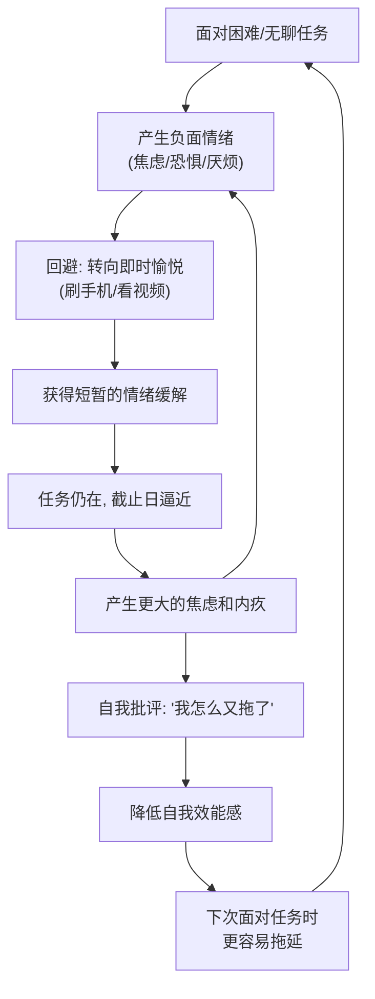

## 五、时间心理学——理解你与时间的关系

时间管理的本质不是管理时间——时间对每个人都是恒定的24小时——而是管理**你自己**。你如何感知时间、如何评估未来、如何应对拖延、如何做出决策，这些深层的心理机制决定了你的时间利用效率。方法论和工具只是表层，心理学才是根。

本节从六个维度解剖你与时间的关系：拖延的心理机制、时间感知的科学原理、时间折扣与双曲贴现、规划谬误与蔡格尼克效应、时间导向理论，以及注意力残留与任务切换的隐性代价。理解这些机制，不是为了"克服人性"，而是为了**顺应人性**——设计出与你的大脑工作方式兼容的时间管理系统。

### 5.1 拖延症的心理学解析

拖延症是时间管理中最普遍的敌人，但它根本不是一个"时间管理"问题——它是一个**情绪调节**问题。加拿大卡尔顿大学心理学教授蒂莫西·皮切尔（Timothy Pychyl）在其十余年的拖延研究中反复强调："拖延是一种情绪管理的失败，而非时间管理的失败。"

#### 5.1.1 拖延的神经科学机制

大脑中有两套系统在博弈，理解它们的冲突是理解拖延的关键：

**前额叶皮层（Prefrontal Cortex）**——理性决策中枢，负责计划、长期目标、自我控制。它知道"应该做那件重要的事"。但它运行缓慢、耗能高、容易疲劳。

**边缘系统（Limbic System）**——情绪与本能中枢，处理即时的情绪反应和奖赏。它追求"现在就舒服"。它反应迅速、力量强大、几乎不讲道理。

当面对一个困难、无聊或令人焦虑的任务时，边缘系统会发出强烈的"回避"信号——不是因为你懒，而是因为你的大脑把"不舒服"等同于"危险"。边缘系统"劫持"了控制权，驱使你去做能立刻带来愉悦感的事情：刷手机、看视频、整理桌面、甚至去打扫卫生（突然对清洁产生热情是拖延的经典信号）。

关键认知：**这不是意志力薄弱，而是大脑进化而来的保护机制。** 在远古环境中，回避不适（潜在危险）是生存优势。只是在现代社会，这种机制让我们在面对一份报告时逃跑，就像面对一头猛兽一样。

#### 5.1.2 拖延的六种心理类型

不同的人拖延的原因截然不同，识别自己的拖延类型是精准干预的前提：

| 类型 | 核心心理 | 典型自语 | 比例估计 |
|------|----------|----------|----------|
| **完美主义型** | 害怕做得不够好 | "如果不能做到完美，不如不做" | ~25% |
| **恐惧失败型** | 害怕失败带来的负面评价 | "万一搞砸了别人会怎么看我" | ~20% |
| **恐惧成功型** | 害怕成功后的更高期望 | "如果这次做得好，以后都得这么好" | ~10% |
| **决策困难型** | 选择过多导致瘫痪 | "我还没想好从哪里开始" | ~15% |
| **任务厌恶型** | 任务本身无聊或无意义 | "这件事太无聊了，我不想做" | ~20% |
| **即时满足型** | 偏好即时回报 | "先刷会儿手机，一会儿再做" | ~10% |

**注意：** 大多数人的拖延是多种类型的混合。完美主义者在面对无聊任务时，会同时触发完美主义型和任务厌恶型两种拖延模式。

#### 5.1.3 拖延的情绪循环模型

拖延不是一次性的行为，而是一个自我强化的循环：

这个循环的关键断裂点在 **B → C** 这一步：如果能在产生负面情绪时不选择回避，循环就被打破。但"硬抗"不是好策略——更好的方式是降低情绪强度（缩小任务规模）或改变情绪性质（找到内在动机）。

#### 5.1.4 科学验证的反拖延策略

**策略一：降低启动门槛（Implementation Intention）**

心理学家彼得·戈尔维策（Peter Gollwitzer）的研究表明，"执行意图"——即提前制定"If-Then"计划——能将目标完成率从34%提升到62%。

- 把任务缩小到"不可能失败"的程度："只写5分钟"、"只读1页"、"只打开文档"
- 使用"2分钟启动法"：告诉自己"我只做2分钟，2分钟后如果不想继续就停"——实际上，90%的情况下你会继续做下去，因为启动才是最难的部分
- 提前消除所有启动阻力：前一天晚上就把需要的工具、文件、环境准备好，第二天坐下就能开始

**策略二：管理情绪而非管理时间**

- **识别触发点：** 记录每次拖延时的情绪状态，找出你的"拖延触发器"是什么——是焦虑？是无聊？是恐惧？还是疲惫？
- **情绪标注（Affect Labeling）：** 加州大学洛杉矶分校的研究发现，仅仅是用语言命名你的情绪（"我现在感到焦虑"），就能降低杏仁核的激活水平，减弱情绪的控制力
- **自我同情而非自我批评：** 卡尔顿大学的研究发现，拖延后的自我批评会加剧拖延循环，而自我同情（"没关系，谁都会拖延，我可以重新开始"）反而能减少下次拖延的概率

**策略三：创造外部约束**

人脑对社会承诺和损失的敏感度远高于对个人目标的敏感度：

- **承诺装置（Commitment Device）：** 把钱交给朋友，完成任务后才能拿回；或公开宣布截止日期——损失厌恶心理会驱动你行动
- **责任伙伴（Accountability Partner）：** 找一个也在努力的人，每天互相汇报进度。研究显示，有责任伙伴的人目标完成率提升约65%
- **环境设计：** 把手机放到另一个房间（普林斯顿大学研究：手机放在视线内就会占用认知资源，即使关机了也一样）

**策略四：增加即时反馈**

大脑偏好即时回报，那就把延迟回报变成即时回报：

- **进度可视化：** 使用习惯追踪器、进度条、打卡日历——"连续打卡21天"本身就是一种即时的成就感
- **小里程碑奖励：** 每完成一个子任务就给自己一个小奖励（一杯好咖啡、10分钟视频），建立"完成→愉悦"的条件反射
- **社交反馈：** 在社交媒体或工作群分享进展，他人的点赞和认可是强大的即时正反馈

**策略五：重新定义任务**

有时候，拖延的根源是任务与你的价值观脱节：

- **价值连接：** 问自己"这个任务和我真正在乎的事情有什么联系？"——如果答不上来，也许这个任务本身就不该做
- **意义重构：** "写报告"可以重构为"展示我的专业能力"或"帮助团队做出更好的决策"——同一任务，不同的意义框架带来完全不同的动力
- **掌控感重建：** 拖延常常源于"被逼做"的无力感。主动选择"我决定现在做这个任务"，哪怕只是语言上的转换，也能改变内在体验

### 5.2 时间感知——为什么时间有时快有时慢

你有没有注意到：无聊的会议像过了一个世纪，而和朋友的聚会像转瞬即逝？这种现象叫做**时间感知**（Time Perception），它不是客观的时间流逝，而是大脑对时间的主观建构。理解时间感知的规律，能帮你"操控"自己对时间的体验。

#### 5.2.1 时间感知的三大原理

**原理一：注意力密度理论（Attentional Gate Model）**

心理学家理查德·布洛克（Richard Block）和丹·扎卡伊（Dan Zakay）提出的注意力门模型是目前最被广泛接受的时间感知理论。其核心机制：

- 大脑内部有一个"起搏器"（pacemaker），以相对恒定的速率发出脉冲信号
- 在起搏器和"计数器"之间有一个"注意力门"（attentional gate）
- 当你**注意时间流逝**时，门打开，更多脉冲信号被计数——感觉时间变长
- 当你**专注于任务**时，门关闭，脉冲信号被拦截——感觉时间飞逝

这就解释了为什么"心流"状态中时间会飞速流逝——你的注意力完全被任务占据，没有认知资源去"检查时间"。也解释了为什么焦虑等待时时间变得漫长——你不断地关注时间本身。

**原理二：新奇编码理论（Novelty Encoding Theory）**

大脑通过记忆中的"标记点"来回顾性地评估时间长度。新奇的体验在记忆中留下更多标记点，回顾时感觉"充实而漫长"；重复的日常活动缺乏标记点，回顾时感觉"一晃而过"。

这解释了一个普遍的主观体验：**童年时期感觉时间过得很慢，成年后感觉时间加速。** 不是因为时间真的变快了，而是因为成年后生活变得高度重复——每天通勤、工作、回家、睡觉——记忆中缺乏足够的标记点。一个5岁孩子的一年是他一生的20%，充满了无数"第一次"；一个30岁成年人的一年只是他一生的3%，且大部分是重复。

**原理三：情绪色彩效应**

情绪状态会系统性地扭曲时间感知：

| 情绪状态 | 时间感知 | 机制 |
|----------|----------|------|
| 恐惧/焦虑 | 时间变慢（"度日如年"） | 大脑加速处理信息，脉冲信号增加 |
| 快乐/兴奋 | 时间变快（"快乐时光总是短暂的"） | 注意力完全被吸引，时间门关闭 |
| 厌恶/无聊 | 时间变慢（"怎么还没结束"） | 不断检查时间，门持续打开 |
| 心流/沉浸 | 时间变快（"不知不觉几小时过去了"） | 完全忘我，时间门完全关闭 |
| 悲伤/抑郁 | 时间变慢（"每一天都好漫长"） | 大脑对负面刺激的编码更深 |

#### 5.2.2 时间感知对时间管理的实践启示

**启示一：增加新奇体验以延长主观生命长度**

重复的生活会让生命在回顾中"缩水"。主动增加新奇体验——学习新技能、尝试新路线、接触新领域——不仅丰富生活，还能让时间在记忆中变得更"长"。心理学家大卫·伊格曼（David Eagleman）的研究证实：在回顾一段充满新奇体验的假期时，人们主观上觉得它比同样长度的例行工作时间要长3-5倍。

**启示二：创造心流以"压缩"工作时间**

心流状态不仅提升效率，还让工作时间在主观体验上大幅缩短。要进入心流，任务难度需要略高于你的当前能力水平——太简单会无聊，太难会焦虑。在工作中刻意匹配任务难度与能力水平，是"让时间变快"的最佳策略。

**启示三：管理等待时间的主观感知**

在不可避免的等待中（等车、排队、候诊），安排轻量任务或学习内容，能有效减少焦虑的时间感知。听播客、背单词、听有声书——这些"微任务"不会让你觉得在浪费时间。

**启示四：通过记录增加时间标记点**

定期写日记、拍照、做周回顾——这些记录行为本身就在创造记忆标记点。年终回顾时，一本日记能让你的时间感知"变长"数倍，因为每一个记录都成了时间线上的锚点。

### 5.3 时间折扣与双曲贴现——为什么我们总是低估未来

#### 5.3.1 时间折扣的本质

**时间折扣（Temporal Discounting）** 是行为经济学中的核心概念：人们对未来的回报会打折扣，而且越远的未来，折扣越大。

经典实验：让你选择"现在拿100元"还是"一年后拿150元"，大多数人选择前者。但从理性投资角度看，一年50%的回报率是非常好的。问题出在哪里？

问题在于大脑不是用**指数函数**（理性模型）来计算未来价值，而是用**双曲函数**——这就是经济学家乔治·安斯利（George Ainslie）发现的**双曲贴现（Hyperbolic Discounting）**。具体表现：

- "现在 vs 1天后"的折扣率极高（几乎不愿意等待）
- "30天 vs 31天后"的折扣率很低（多等一天无所谓）
- 虽然"现在vs30天后"和"30天vs60天后"间隔相同（都是30天），但前者的主观价值损失远大于后者

**这意味着：我们的大脑对"现在的自己"和"未来的自己"使用完全不同的标准。** "现在的自己"被极度偏好，"未来的自己"被系统性地低估和牺牲。

#### 5.3.2 未来自我连续性

斯坦福大学心理学家哈尔·赫什菲尔德（Hal Hershfield）的研究揭示了一个惊人的发现：**当人们与"未来的自己"的心理连接越弱，就越倾向于做出短期享乐的选择**——包括拖延、过度消费、不运动、不储蓄。

他用fMRI扫描发现：当人们想象"未来的自己"时，大脑激活模式与想象"陌生人"几乎一样——你的大脑真的把未来的自己当成了另一个人。这就是为什么"明天的我会做的"这个承诺如此不可靠——你在把任务推给一个大脑认为"不是我"的人。

**实操应用：**

- **写信给未来的自己：** 每月写一封信给一年后的自己，描述你希望他/她的生活是什么样的。研究证实这能显著增强"未来自我连续性"
- **使用年龄模拟工具：** 赫什菲尔德团队开发了一个工具，用AI模拟你年老后的面容，看到自己老去的样子能显著增加储蓄意愿——同样的原理适用于时间管理
- **具象化未来的后果：** 不要说"以后会后悔"，而是具体想象"三个月后项目截止日那天，凌晨三点还在赶工的你，是什么感受"

#### 5.3.3 对抗时间折扣的策略

| 策略 | 原理 | 具体做法 |
|------|------|----------|
| 缩短反馈周期 | 让延迟回报变成近即时回报 | 把大目标拆成每日小目标，每完成一个就记录/奖励 |
| 增加未来可见性 | 降低心理折扣率 | 用视觉化工具（愿景板、进度图）让未来目标"看得见" |
| 承诺装置 | 提前锁定未来行为 | 报课程、约朋友、预付款——增加"不做"的成本 |
| 价值锚定 | 将当下行为与深层价值连接 | "学英语"→"能和世界各地的人直接交流" |
| 环境预设 | 减少未来的决策成本 | 前一晚准备好第二天的工作材料 |

### 5.4 规划谬误与蔡格尼克效应

#### 5.4.1 规划谬误：为什么你的时间预估总是错的

**规划谬误（Planning Fallacy）** 是诺贝尔经济学奖得主丹尼尔·卡尼曼（Daniel Kahneman）提出的概念：人们在估计自己完成任务所需的时间时，会系统性地**低估**，且这种低估不会随着经验的积累而改善。

卡尼曼本人的经历是一个绝佳案例：他和团队编写一本教科书，最初估计需要两年完成。结果花了八年。在这八年中，前两年快结束时，团队成员没有人觉得"我们要完不成了"——每个人都认为自己在按计划推进。

**规划谬误的四大根源：**

1. **内部视角偏差（Inside View）：** 你只关注当前任务的特殊性，忽略了历史基准。你不会去想"我过去十次写报告平均要花多久"，而是想"这次的报告应该没那么难"
2. **最佳情景思维：** 你假设一切都按计划进行——不会生病、不会被打断、不会遇到意外困难、不会犯错。但现实从来不按最佳路径走
3. **动机性推理：** 你想要快速完成的欲望扭曲了你的判断，让你"相信"任务可以在短时间内完成
4. **未完成的任务拆解：** 复杂任务中总有一些隐性步骤——你写"写报告"这个计划时，不会列出"找数据"、"发现数据有问题"、"重新找数据"、"格式调整"这些意外环节

**对抗规划谬误的方法——参考类别预测法（Reference Class Forecasting）：**

卡尼曼推荐的方法：不要从内部视角估计，而是从**外部视角**出发：

1. 找到一个"参考类别"——类似任务的历史数据。"我过去写的5份类似报告分别花了多少时间？"
2. 以参考类别的平均值为基准起点
3. 根据当前任务的特殊因素做微调（不是大幅调整）
4. 加入**缓冲时间**——通常在基准值上加50%-100%

实操模板：当你估计一个任务的时间时，问自己以下问题：

1. 过去我做类似任务平均花了多久？（基准值）
2. 这次任务有没有任何我无法控制的依赖项？（外部依赖）
3. 有没有可能遇到我目前没预料到的困难？（隐性步骤）
4. 如果所有事情都不顺利，最坏情况要多久？（悲观值）
5. 实际预估 = (基准值 + 悲观值) / 2 × 1.3

#### 5.4.2 蔡格尼克效应：未完成任务的"认知占用"

苏联心理学家布鲁玛·蔡格尼克（Bluma Zeigarnik）在1927年发现了一个现象：**人们对未完成的任务的记忆比已完成的任务更深刻。** 未完成的任务会在大脑中形成一种"认知张力"——它会不断占据你的工作记忆，消耗认知资源，即使你正在做别的事情。

后续研究证实了蔡格尼克效应的普遍性：

- 未回复的邮件比已回复的邮件更容易被记住
- 未完成的项目会干扰你在其他项目上的专注力
- 打开但未读的浏览器标签页会持续消耗认知资源
- 甚至"答应了但还没做的小事"也会占据心理空间

**这正是GTD方法论（前一节所述）有效的心理学基础——** 把所有未完成的承诺都记录在可信赖的外部系统中，大脑就会释放那些被占用的认知资源。仅仅"写下来"这一个动作，就能显著降低蔡格尼克效应带来的认知干扰。

**实操建议：**

- **大脑清空练习：** 每天花5分钟把脑中所有"未完成"的事情写到纸上——不管大小、不管是否紧急。写完后你会发现一种明显的心理"释放感"
- **完成清单而非待办清单：** 每天下班前花2分钟写下今天完成的所有事情，而不是只关注明天要做什么。完成感能有效关闭蔡格尼克效应的"认知张力"
- **关闭"开放回路"：** 对于那些你答应了但暂时无法执行的事——要么立刻执行，要么明确安排时间，要么明确拒绝。不要让它们停留在"答应了但还没做"的状态
- **使用"下一步行动"而非"目标"：** "学英语"是一个开放回路（永远做不完），"今天背20个单词"是一个可以关闭的任务

### 5.5 时间导向理论——你属于哪种时间人格

#### 5.5.1 津巴多的时间导向理论

斯坦福大学心理学家菲利普·津巴多（Philip Zimbardo，斯坦福监狱实验的设计者）在研究时间心理学时提出了**时间导向理论（Time Perspective Theory）**。他认为，每个人对过去、现在和未来的时间导向倾向，深刻影响着他们的行为模式、决策方式和生活质量。

**五种时间导向：**

| 时间导向 | 核心特征 | 优势 | 风险 |
|----------|----------|------|------|
| **过去积极型** | 珍惜回忆、重视传统 | 情感稳定、感恩、身份认同强 | 可能抗拒变化、沉溺于"过去的美好" |
| **过去消极型** | 关注过去的失败和创伤 | 能从错误中学习 | 容易抑郁、自我否定、无法前进 |
| **现在享乐型** | 追求即时快乐、活在当下 | 热情、冒险、创造力强 | 冲动、缺乏规划、容易成瘾 |
| **现在宿命型** | 感到无力改变现状 | 接受现实、顺其自然 | 消极、放弃努力、宿命论 |
| **未来导向型** | 关注目标和计划 | 嫘奋、有规划、延迟满足能力强 | 可能错过当下、过度焦虑、工作狂 |

**关键发现：** 最健康、最高效的模式是**"平衡的时间导向"**——既能从过去汲取智慧，又能享受当下，同时为未来做规划。过度偏向任何一端都会产生问题。

#### 5.5.2 识别你的时间导向

以下问题帮你初步判断自己的时间导向倾向（每组用1-5分评估）：

**过去导向测试：**
- 我经常回忆童年的美好时光
- 传统和家庭仪式对我很重要
- 我对过去的遗憾难以释怀

**现在导向测试：**
- 我更看重今天的感觉而非明天的计划
- 我容易被眼前的诱惑吸引
- "活在当下"是我的人生信条

**未来导向测试：**
- 我习惯提前做计划
- 我愿意为了长远目标牺牲当下的快乐
- 完成目标带来的成就感是我最大的动力

#### 5.5.3 时间导向的实践应用

**如果你是"过去消极型"：** 你的主要障碍是过去的失败经历在阻碍你前进。练习"认知重评"——把失败重新定义为学习机会。写一份"失败简历"，列出你所有的失败和从中学到的东西。

**如果你是"现在享乐型"：** 你的主要障碍是即时满足偏好太强。使用"如果-那么"规则预先设定行为反应（"如果我感到无聊想刷手机，那么我先做5分钟工作"），而不是依赖临场的自制力。

**如果你是"未来导向型"：** 你的主要风险是过度计划、忽略当下、过度焦虑。刻意安排"无计划时间"，练习享受过程而非只关注结果。记住：你的人生目标清单上的每一个目标，都是为了让你在达成后"享受生活"——但如果过程中完全不享受，达成目标的意义就大打折扣了。

**如果你是"现在宿命型"：** 你的主要障碍是"做什么都没用"的无力感。从小事开始建立掌控感——每天做一件自己选择的小事（哪怕只是选择午餐吃什么），逐步重建"我能影响自己的生活"的信念。

### 5.6 注意力残留与任务切换的认知代价

#### 5.6.1 注意力残留现象

明尼苏达大学商学院教授索菲·勒罗伊（Sophie Leroy）在2009年发现了**注意力残留（Attention Residue）**现象：当你从任务A切换到任务B时，你的注意力并不会完全转移——一部分注意力会"残留"在任务A上，持续时间可达10-23分钟。

这意味着：如果你在写报告的中间去查看了一封邮件，回到报告后你需要10-23分钟才能恢复到之前的专注水平。如果一小时内切换了3次任务，你可能只有不到30分钟的真正高效工作时间。

**任务切换的隐性成本：**

| 切换场景 | 恢复专注所需时间 | 对效率的影响 |
|----------|-----------------|-------------|
| 简单切换（同类任务之间） | 约1分钟 | 轻微 |
| 复杂切换（不同类型任务） | 10-23分钟 | 严重 |
| 情绪性中断（查看争吵消息等） | 可达30分钟以上 | 极严重 |
| 上下文切换（从深度思考到行政事务） | 15-25分钟 | 严重 |

研究者格洛丽亚·马克（Gloria Mark）在加州大学的研究发现：**办公室工作者平均每11分钟就被打断一次，而恢复到被打断前的专注水平平均需要23分钟。** 这意味着大多数人在一天中从未真正达到过深度专注状态。

#### 5.6.2 多任务处理的认知幻觉

**多任务处理是一个神话。** 你以为你在同时处理多项任务，实际上你的大脑在快速地在任务之间来回切换——每一次切换都有认知成本。

斯坦福大学心理学家安东尼·瓦格纳（Anthony Wagner）的研究发现：自认为擅长多任务处理的人，实际上在切换任务时表现**更差**，而非更好。他们更容易被无关信息分散注意力，工作记忆容量更低。

**多任务处理的真实成本：**

- **错误率增加50%：** 同时处理两件认知任务时，错误率比依次处理高出约50%
- **完成时间增加50%：** 你以为在"同时做两件事省时间"，实际总时间反而更长
- **创造力下降：** 创造性思维需要"发散模式"——大脑在自由联想中产生新连接。频繁的任务切换会阻止大脑进入发散模式
- **皮质醇水平升高：** 持续的任务切换会升高压力激素皮质醇，导致疲劳、焦虑和决策质量下降

#### 5.6.3 减少注意力残留的策略

**策略一：时间块工作法（Time Blocking）**

把一天划分为不同的时间块，每个时间块只做一类任务：

08:00-10:00  深度工作块（写作/编程/设计）——禁止消息
10:00-10:15  休息
10:15-11:30  沟通块（回复邮件/消息/电话）
11:30-12:00  行政块（报销/文档/杂事）
12:00-13:00  午餐
13:00-15:00  深度工作块——禁止消息
15:00-15:30  沟通块
15:30-17:00  协作块（会议/讨论/评审）

**策略二：主题日（Day Theming）**

如果可能的话，把不同类型的工作安排在不同的日子：

- 周一：规划和会议日
- 周二、周四：深度工作日（写作/创作/编程）
- 周三：沟通和协作日
- 周五：回顾、学习和杂事日

**策略三："批处理"同类任务**

不要一收到邮件就查看，而是集中在2-3个固定时间点批量处理。不要一有想法就切换，而是先记在"灵感笔记本"中，等当前任务完成后再处理。

**策略四：创造"专注结界"**

- 物理信号：戴上耳机（即使不放音乐），告诉同事"我正在专注工作，紧急事才打断"
- 数字信号：开启"请勿打扰"模式，关闭所有非必要通知
- 环境信号：如果可能，在专注时段换到一个不同的物理位置（如会议室），建立"这个位置=深度工作"的心理关联

### 5.7 帕金森定律与时间膨胀

#### 5.7.1 定律的本质

英国历史学家西里尔·帕金森（Cyril Parkinson）在1955年发表于《经济学人》的文章中提出了这个观察：**"工作会膨胀到填满完成它所分配的全部时间。"**

这不是懒惰——这是一种深刻的心理机制。当你给自己一周时间来完成一个3小时的任务时：

- 你会增加任务的复杂度（"既然还有一周，不如做得更完美一些"）
- 你会被各种干扰分散注意力（"反正还早"）
- 你会推迟开始（"明天再做也来得及"）
- 你会在任务之间来回切换（"先做这个，不对，先做那个"）

最终，一个3小时的任务真的会消耗你一周——不是因为任务本身需要一周，而是因为分配了一周的时间，你的行为就自动膨胀到填满它。

#### 5.7.2 逆向应用帕金森定律

帕金森定律不是一个需要"克服"的问题，而是一个可以**利用**的工具：

**方法一：人为制造紧迫感**

- 为任务分配比"合理"更少的时间。如果你估计需要2小时完成，给自己1.5小时
- 使用番茄钟——25分钟的时间限制天然地应用了帕金森定律
- 告诉同事或客户"明天给你"——外部截止日期比内部截止日期有效得多

**方法二：限制工作窗口**

- 不是"这周要完成"，而是"周三下午2-4点专门做这件事"
- 限制会议时间：30分钟能解决的问题，如果安排1小时，就会膨胀成1小时。亚马逊公司的"两页备忘录+30分钟会议"文化就是帕金森定律的逆向应用
- 限制每天的工作时间：有研究表明，限制每天工作6小时的人，其产出与工作10小时的人相当——因为紧迫感迫使他们优先做最重要的事

**方法三：帕金森定律 × 帕累托法则**

80%的成果来自20%的努力。如果你给自己10小时做一件事，前2小时可能产出了80%的价值，后8小时在"完善"剩下的20%。设置时间上限，能迫使你集中精力在最有价值的20%上。

### 5.8 时间心理学的综合应用框架

#### 5.8.1 心理阻力诊断清单

当你发现自己在"浪费时间"时，用这个清单诊断根本原因：

| 你正在做的 | 可能的心理根源 | 对应策略 |
|-----------|---------------|---------|
| 刷手机停不下来 | 即时满足偏好 + 任务厌恶 | 2分钟启动法 + 环境设计 |
| 不断检查进度 | 时间感知焦虑 + 注意力门打开 | 进入心流的任务设计 |
| 一直"准备"但不开始 | 完美主义型拖延 | "先完成再完美"的草稿策略 |
| 预估时间总是不够 | 规划谬误 | 参考类别预测法 + 缓冲时间 |
| 脑中杂念很多 | 蔡格尼克效应 | 大脑清空 + 外部系统 |
| 觉得做什么都来不及 | 时间折扣 + 未来自我断裂 | 缩短反馈周期 + 价值锚定 |
| 不断在任务间切换 | 注意力残留 + 缺乏时间块 | 时间块工作法 + 批处理 |
| 感觉时间过得太快/太慢 | 时间感知失衡 | 心流设计 + 新奇体验 |

#### 5.8.2 一周心理调适计划

**第1天：时间感知觉察**
- 每隔2小时记录一次"现在的时间感觉是快还是慢？为什么？"
- 目的：建立对时间感知的觉察能力

**第2天：拖延模式识别**
- 记录每次拖延时的具体情境和情绪
- 晚上回顾：你的拖延主要是哪种类型？

**第3天：未来自我连接**
- 给一年后的自己写一封信
- 详细描述你希望一年后的生活状态

**第4天：规划谬误校准**
- 选择3个今天的任务，预先估计所需时间
- 实际执行后记录真实时间
- 计算你的"低估比率"（真实时间 / 估计时间）

**第5天：注意力残留测试**
- 记录今天被打断的次数和恢复专注的时间
- 尝试一个2小时的"无打断深度工作"时段

**第6天：时间导向评估**
- 用5.5.2节的测试评估自己的时间导向
- 思考：你的时间导向如何影响了你的时间管理？

**第7天：整合与调整**
- 回顾一周的记录
- 选择最影响你的1-2个心理因素
- 制定针对性的调整策略

#### 5.8.3 常见误区与纠正

| 误区 | 真相 | 纠正方法 |
|------|------|---------|
| "我拖延是因为我懒" | 拖延是情绪管理问题，不是品格问题 | 识别拖延背后的情绪，而非惩罚自己 |
| "我需要更强的自制力" | 自制力是有限资源，环境设计更可靠 | 设计环境让正确行为更容易，而非依赖意志力 |
| "我能同时做好几件事" | 多任务是认知幻觉，每次切换都有成本 | 一次只做一件事，使用时间块隔离不同类型工作 |
| "我对时间的预估很准" | 规划谬误是普遍现象，几乎所有人都低估 | 使用历史数据校准预估，加50%缓冲 |
| "只要足够努力就能管好时间" | 时间管理的核心是心理机制的理解和顺应 | 先理解自己的心理模式，再选择匹配的策略 |
| "心流是可遇不可求的" | 心流有明确的触发条件 | 主动匹配任务难度与技能水平，消除干扰 |

### 5.9 本节核心要点

1. **拖延不是时间问题，是情绪问题。** 识别拖延背后的情绪类型，使用情绪管理策略而非意志力硬抗
2. **时间感知是可以"操控"的。** 通过心流、新奇体验、记录和环境设计，你可以改变主观时间的流逝速度
3. **大脑用双曲函数计算未来价值，不是指数函数。** 这导致我们系统性地低估未来回报。对抗方式是缩短反馈周期和增强未来自我连接
4. **规划谬误是人类的默认模式。** 不要从"内部视角"估计时间，要用历史数据和参考类别预测法
5. **未完成的任务会持续消耗认知资源。** 使用外部系统（GTD、清单）关闭大脑中的"开放回路"
6. **你的时间导向塑造了你的行为模式。** 了解自己偏向过去、现在还是未来，然后有意识地寻求平衡
7. **每一次任务切换都有10-23分钟的认知代价。** 减少切换，使用时间块和批处理策略
8. **帕金森定律是可以利用的工具。** 人为制造紧迫感，限制工作窗口，迫使自己聚焦于最有价值的部分
