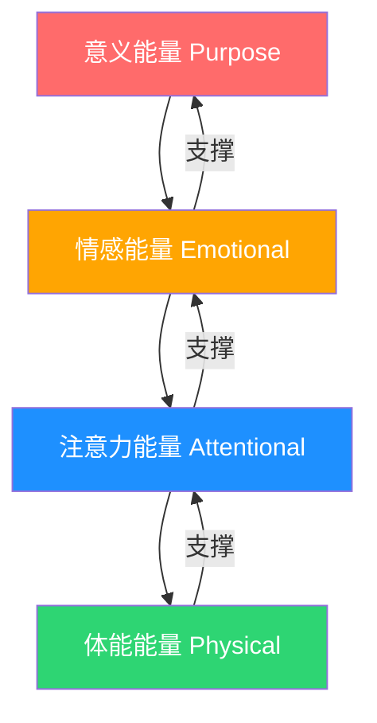
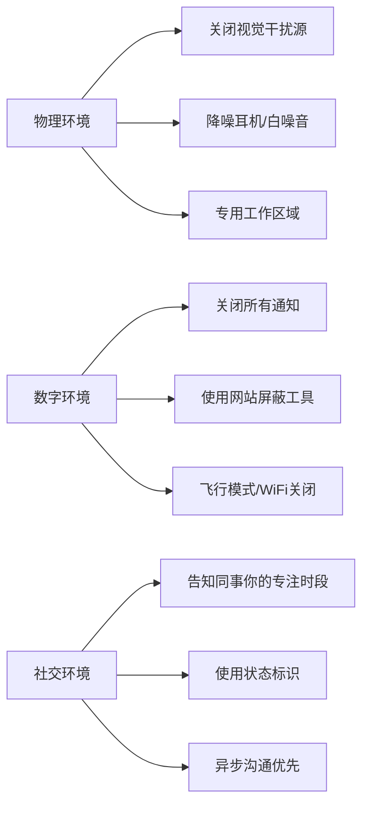
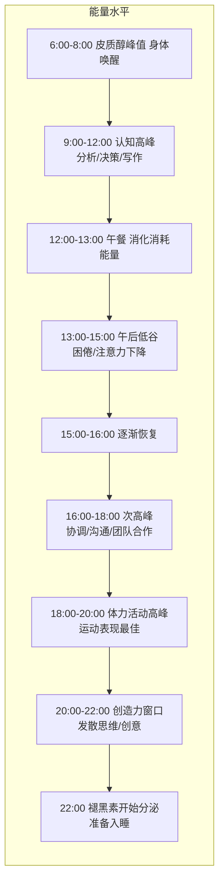
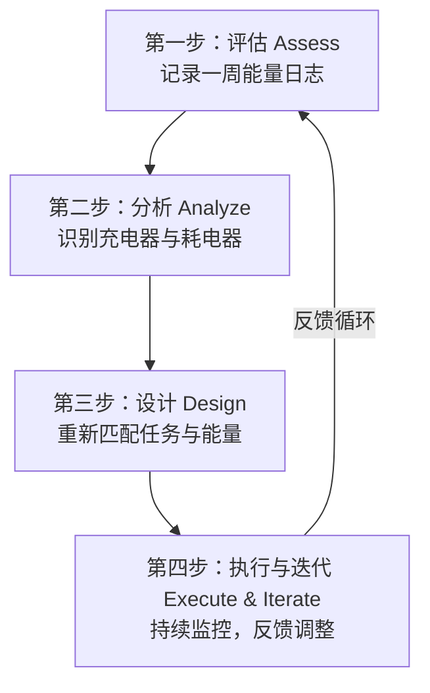
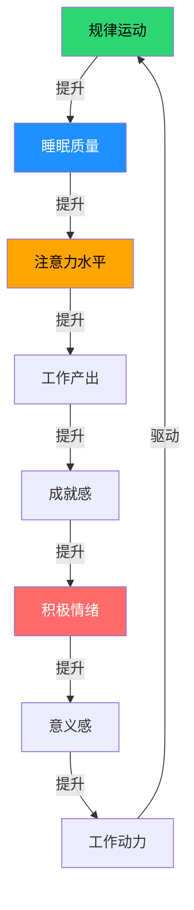

## 六、能量管理——超越时间管理

传统时间管理的核心假设是"时间是有限的资源"，因此一切优化都围绕"如何在单位时间内塞入更多产出"。这个假设没有错，但它忽略了一个更根本的约束条件：**人的精力是有限的，而且精力的质量远比时间的数量更重要。**

吉姆·洛尔（Jim Loehr）和托尼·施瓦茨（Tony Schwartz）在《精力管理》（*The Power of Full Engagement*）一书中，基于对数百名顶级运动员和企业高管的研究，提出了一个颠覆性观点：**高效能的秘诀不是管理时间，而是管理精力。** 同样是8小时的工作时间，一个精力充沛、高度专注的人，产出可以是一个精力低迷、注意力涣散状态下的5-10倍。如果你每天只有2小时的"黄金精力"，把这2小时用对地方，产出可能超过别人漫不经心的10小时。

本节将从科学原理出发，系统讲解能量的四个维度、波动规律、恢复策略和实操框架，帮助你从"时间的奴隶"转变为"精力的主人"。

---

### 6.1 为什么能量管理比时间管理更根本

#### 6.1.1 时间管理的天花板

时间管理技术（GTD、番茄钟、艾森豪威尔矩阵等）解决的是"做什么"和"什么时候做"的问题。但它们有一个共同的盲区：**它们假设你在任何时间点都有相同的执行能力。** 事实显然不是这样——早上9点的你和下午2点的你，认知能力可能相差数倍。

一个严格执行番茄钟的人，如果在精力低谷期强行做深度工作，每25分钟的"专注"可能只有10分钟是真正有效的。时间被"管理"了，但精力被浪费了。

#### 6.1.2 精力的底层逻辑

精力不是一个单一概念，而是一个多维度的系统。托尼·施瓦茨将精力分为四个层次，从基础到高级依次是：

这个层级关系意味着：**体能是一切的基础，但仅有体能远远不够。** 一个身体健康但内心空虚的人，和一个身体疲惫但目标清晰的人，谁的工作效率更高？答案往往出人意料——后者。因为意义能量可以补偿体能的暂时不足（想想deadline前的超常发挥），但体能无法填补意义的缺失（想想每天上班如上坟的状态）。

#### 6.1.3 精力管理的科学基础

精力管理并非玄学，它有坚实的神经科学和生理学基础：

- **自我损耗理论（Ego Depletion）**：罗伊·鲍迈斯特（Roy Baumeister）的研究表明，自控力和认知决策会消耗有限的心理资源。连续做出大量决策后，后续决策质量会显著下降——这就是为什么扎克伯格和乔布斯都选择减少日常决策（固定穿衣、固定饮食），把决策精力留给真正重要的事。
- **注意力恢复理论（Attention Restoration Theory, ART）**：雷切尔和斯蒂芬·卡普兰（Rachel & Stephen Kaplan）提出，在自然环境中花费时间可以恢复被"定向注意力"（directed attention）消耗的认知资源。密歇根大学的实验显示，在自然环境中步行50分钟后，参与者的定向注意力测试成绩提升了约20%。
- **超日节律（Ultradian Rhythm）**：神经科学家纳撒尼尔·克莱特曼（Nathaniel Kleitman）发现，人的注意力和生理机能以约90-120分钟为周期波动，这被称为"基本休息-活动周期"（BRAC, Basic Rest-Activity Cycle）。在每个周期的高效期，大脑的警觉性和认知处理速度达到峰值；进入低效期后，身体发出疲劳信号，此时强行工作效率极低。
- **昼夜节律与皮质醇**：人体的皮质醇水平在早晨6-8点达到峰值（唤醒身体），随后逐渐下降。认知功能的峰值通常出现在起床后2-4小时，这与皮质醇的"唤醒效应"密切相关。

---

### 6.2 能量的四个维度：深度解析

#### 6.2.1 体能能量——一切的基石

体能能量是四个维度中最基础、也最容易被忽视的。很多人把"身体好"等同于"不生病"，但体能能量远不止于此——它直接影响你的注意力持续时间、情绪稳定性、决策质量和创造力。

**睡眠：体能能量的第一来源**

睡眠不是"浪费时间"，而是大脑进行记忆巩固、情绪调节和毒素清除的关键过程。近年来的神经科学研究揭示了"胶质淋巴系统"（Glymphatic System）的机制：在深度睡眠期间，大脑细胞之间的间隙扩大60%，脑脊液大量涌入，冲洗掉白天积累的代谢废物（包括与阿尔茨海默症相关的β-淀粉样蛋白）。

关键数据：
- 连续17小时不睡觉，认知表现下降至血液酒精浓度0.05%的水平（相当于法定酒驾标准的一半）；连续24小时不睡，等同于血液酒精浓度0.10%——已经超标
- 成年人每晚需要7-9小时睡眠，其中深度睡眠（N3阶段）占15-25%，REM睡眠占20-25%
- 睡眠不足6小时连续一周，认知能力下降程度等同于连续48小时完全不睡
- 哈佛医学院研究显示，睡眠不足导致的生产力损失每年给美国经济造成约4110亿美元

**实操：提升睡眠质量的具体方法**

| 维度 | 具体做法 | 原理 |
|------|----------|------|
| 时间一致性 | 每天同一时间上床和起床（包括周末），误差不超过30分钟 | 稳定昼夜节律，让身体的"生物钟"形成可预测的睡眠-觉醒模式 |
| 光照管理 | 早晨起床后30分钟内接受10-30分钟自然光照射；晚上8点后减少蓝光暴露 | 光线是调节褪黑素分泌的最强信号。晨光促进皮质醇释放（清醒），晚间暗光促进褪黑素分泌（困意） |
| 温度控制 | 卧室温度保持在16-19°C；睡前1-2小时洗热水澡 | 核心体温下降是入睡的必要条件。热水澡让体表血管扩张，加速核心体温下降 |
| 咖啡因管控 | 下午2点后不再摄入咖啡因 | 咖啡因的半衰期约5-6小时，下午2点喝的咖啡到晚上10点仍有25%在体内 |
| 酒精回避 | 睡前3小时内不饮酒 | 酒精虽然帮助入睡，但会严重破坏后半夜的睡眠结构，减少REM睡眠 |
| 睡眠环境 | 完全黑暗（使用遮光窗帘或眼罩）、安静（使用耳塞或白噪音） | 即使微弱的光线也会抑制褪黑素分泌；噪音会触发微觉醒（你不记得但大脑记得） |

**运动：体能能量的放大器**

运动对精力的提升不是"做完运动感觉好一点"那么简单。从神经化学角度看，规律运动带来的改变包括：

- **线粒体增殖**：有氧运动刺激肌肉和大脑细胞产生更多线粒体（细胞的"发电厂"），从根本上提升能量生产能力
- **脑源性神经营养因子（BDNF）增加**：运动后大脑海马区的BDNF水平显著升高，促进新神经元生长和突触可塑性，直接提升学习能力和记忆力
- **神经递质平衡**：运动促进多巴胺、血清素和去甲肾上腺素的释放，这三种神经递质分别与动力、情绪和注意力密切相关
- **压力缓冲**：规律运动降低基础皮质醇水平，增强HPA轴（下丘脑-垂体-肾上腺轴）对压力的适应能力

**运动处方（基于精力提升目标）：**

| 运动类型 | 频率 | 时长 | 强度 | 精力效果 |
|----------|------|------|------|----------|
| 有氧运动（跑步、游泳、骑车） | 每周3-5次 | 30-45分钟 | 中等（心率60-70%最大心率） | 提升基础体能，改善心血管功能，增加线粒体密度 |
| 力量训练 | 每周2-3次 | 30-45分钟 | 中高（8-12次/组，3组） | 增加肌肉量，提升基础代谢率，改善胰岛素敏感性 |
| 高强度间歇训练（HIIT） | 每周1-2次 | 15-25分钟 | 高（心率80-90%最大心率） | 短时间高效提升心肺功能，促进生长激素分泌 |
| 低强度活动（散步、瑜伽） | 每天 | 20-30分钟 | 低 | 恢复性，促进血液循环，降低压力 |

> **关键原则**：运动强度和精力之间的关系不是线性的。过度训练会导致"过度训练综合征"（Overtraining Syndrome），表现为持续疲劳、睡眠障碍、情绪低落和免疫力下降。如果你运动后感觉更疲惫而不是更有精力，说明训练量超出了恢复能力。

**营养：能量的化学燃料**

你吃的东西直接影响你的精力水平。这里不讲复杂的营养学，只讲对精力影响最大的三个核心原则：

1. **血糖稳定优先**：高糖食物（白米饭、甜饮料、精制面包）会导致血糖快速升高后快速下降，产生"能量崩溃"（sugar crash）。选择低GI（升糖指数）食物（燕麦、糙米、全麦面包、豆类），让血糖缓慢上升、缓慢下降，维持稳定的能量供应。
2. **蛋白质不能少**：蛋白质是神经递质的前体原料（色氨酸→血清素，酪氨酸→多巴胺）。每餐保证20-30克优质蛋白质（鸡蛋、鱼肉、豆制品），有助于维持注意力和情绪稳定。
3. **间歇性进食并非人人适用**：16:8断食法（8小时进食窗口）对某些人有效，但对另一些人会导致下午精力崩溃。关键是找到适合自己的进食节奏——如果你下午3点总是犯困，试试在午餐中加入更多蛋白质和健康脂肪，减少碳水化合物。

**水分：最被低估的精力因素**

即使是轻度脱水（体重的1-2%，约一个60公斤的人缺水600-1200毫升），也会导致：
- 认知测试成绩下降10-15%
- 头痛和疲劳感增加
- 注意力集中能力降低
- 情绪波动增大

**实操建议**：起床后立即喝300-500毫升温水（经过一夜的呼吸和排汗，身体处于轻度脱水状态）。全天保持每小时饮水200-300毫升的节奏。不要等到口渴才喝水——口渴是身体已经脱水的信号。

**呼吸：即时精力调节器**

呼吸是唯一可以同时被自主神经系统和随意神经系统控制的生理功能，这使它成为调节精力状态的"手动旋钮"。

- **提神呼吸**（4-7-8呼吸法的变体）：快速深吸气4秒→屏气2秒→快速呼气4秒，重复3-5次。激活交感神经系统，快速提升警觉性。
- **放松呼吸**（标准4-7-8法）：吸气4秒→屏气7秒→缓慢呼气8秒，重复4次。激活副交感神经系统，降低心率和压力水平。
- **盒式呼吸（Box Breathing）**：吸气4秒→屏气4秒→呼气4秒→屏气4秒。海豹突击队使用的压力管理技术，在高压环境下快速恢复平静和专注。

---

#### 6.2.2 情感能量——效率的放大器和杀手

情感能量决定了你"愿意"做多少事，以及你能以多高的质量完成。积极情绪不是"锦上添花"的奢侈品，而是生产力的核心引擎。

**积极情绪的科学机制**

芭芭拉·弗雷德里克森（Barbara Fredrickson）的"拓展-建构理论"（Broaden-and-Build Theory）揭示了一个关键机制：积极情绪能拓宽你的注意力范围和思维模式，让你看到更多可能性；而消极情绪则收缩注意力，让你陷入"隧道视野"（tunnel vision）——只看到眼前的威胁，忽略更优的解决方案。

实验证据：在积极情绪状态下，人们在创造性问题解决测试中的表现提升了约50%，在复杂决策任务中的表现提升了约30%。这不仅仅是"感觉好所以做得好"，而是积极情绪真实地改变了大脑的信息处理方式。

**情感能量的消耗与恢复**

情感能量的消耗来源比你想象的更多：

| 消耗类型 | 具体表现 | 消耗程度 |
|----------|----------|----------|
| 人际冲突 | 与同事/家人的争吵、冷暴力、持续的紧张关系 | 极高（一次激烈争吵可以消耗一整天的情感能量） |
| 情绪压抑 | 强迫自己"保持专业"、压抑真实感受、假装积极 | 高（研究表明情绪压抑比情绪表达消耗更多认知资源） |
| 决策疲劳 | 连续做出大量选择（穿什么、吃什么、怎么回复） | 中高 |
| 信息过载 | 无节制地刷社交媒体、看负面新闻 | 中（持续的低强度消耗，但累积效应巨大） |
| 不确定性 | 对未来的焦虑、等待结果的煎熬 | 中高 |
| 无聊感 | 长期从事缺乏挑战或意义的工作 | 中（慢性消耗，容易被忽视） |

**情感能量恢复的核心方法：**

1. **情绪颗粒度训练**：不是简单地说"我不开心"，而是精确识别"我感到被忽视"、"我感到不被尊重"、"我对自己失望"。心理学家丽莎·费尔德曼·巴瑞特（Lisa Feldman Barrett）的研究表明，情绪颗粒度越高的人，情绪调节能力越强。因为精确识别情绪后，你才能找到精确的应对策略。
2. **建立"情绪急救箱"**：提前列出当你情绪低落时可以快速使用的恢复策略清单，并保证这些策略在5分钟内可以启动。例如：听一首特定的歌、给一个特定的朋友发消息、做3分钟深呼吸、看一段搞笑视频、回忆一个让你骄傲的时刻。
3. **"微恢复"习惯**：不要等到情绪崩溃才恢复。在日常工作中嵌入5分钟的"微恢复"——和同事聊几句与工作无关的事、泡一杯好茶、在窗边站一会儿看看天空。这些看似微不足道的中断，能有效防止情绪能量的持续流失。
4. **社交"充电"与"放电"**：不是所有社交都是充电。和某些人在一起你会感到精力充沛，和另一些人在一起你会感到被抽空。有意识地识别你的"充电型关系"和"放电型关系"，增加前者的频率，减少后者的时长。

---

#### 6.2.3 注意力能量——时间转化为价值的转换器

没有注意力的时间是无效时间。你可以坐在办公桌前8小时，但如果其中6小时都在走神、切换任务、被通知打断，真正的产出时间可能只有1-2小时。

**注意力的科学限制**

1. **持续注意力极限**：人类的持续注意力（sustained attention）极限约为90-120分钟，这与超日节律（Ultradian Rhythm）的周期一致。超过这个时间后，注意力会显著下降，表现为频繁走神、错误率上升、反应时间变慢。
2. **注意力残留效应（Attention Residue）**：明尼苏达大学索菲·勒鲁瓦（Sophie Leroy）教授的研究发现，当你从任务A切换到任务B时，你的注意力不会完全转移到任务B上——有一部分仍然"残留"在任务A上。这种"注意力残留"会导致任务B的初始表现下降15-25%。更关键的是，如果你在切换时任务A尚未完成，残留效应更强，持续时间更长。
3. **决策疲劳**：罗伊·鲍迈斯特的研究显示，连续做出决策会消耗有限的心理资源。以色列法官的假释裁决研究发现：刚休息完的法官批准假释的比例约为65%，而在临近下次休息时，这个比例下降到接近0%——不是因为犯人的情况变了，而是法官的决策精力耗尽了。
4. **多任务处理的真相**：大脑不能同时处理两个需要认知资源的任务（cognitive tasks），它只能在两个任务之间快速切换。每次切换都有"切换成本"（switch cost），表现为处理速度变慢和错误率增加。加州大学尔湾分校的研究发现，一次被打断后，平均需要23分钟15秒才能完全恢复到之前的专注状态。

**注意力能量的系统性提升方法：**

**深度工作环境设计**

卡尔·纽波特（Cal Newport）在《深度工作》中提出：深度工作的能力正在变得越来越稀缺，同时变得越来越有价值。以下是一套可执行的深度工作环境设计清单：

**注意力"肌肉"训练**

注意力和肌肉一样，可以通过训练变强。以下是经过验证的训练方法：

1. **冥想训练**：每天10-20分钟的专注冥想（专注呼吸或身体扫描）。哈佛大学的神经可塑性研究显示，8周的正念冥想训练可以增加前额叶皮层（负责注意力和决策）的灰质密度，同时减少杏仁核（负责恐惧和焦虑反应）的灰质密度。
2. **单任务训练**：在日常生活中练习"一次只做一件事"。吃饭时只吃饭（不看手机），走路时只走路（不听播客），和人交谈时只交谈（不想接下来要做什么）。这些看似简单的练习，实际上是在强化你的注意力回路。
3. **"注意力热身"**：在开始深度工作前，花5分钟做低难度的认知任务（如整理笔记、回顾昨天的进度），让大脑逐步进入专注状态，而不是期望自己从零直接跳到高度专注。

---

#### 6.2.4 意义能量——最高层次的驱动力

意义能量是四个维度中最高级、也最持久的驱动力。当你的日常工作与内心深处的价值观和使命感一致时，你会拥有源源不断的动力——即使体能疲惫、情绪低落，意义感依然能支撑你继续前行。

**意义感的神经科学基础**

加州大学洛杉矶分校（UCLA）的神经影像学研究发现，当人们感到生活有意义时，大脑的默认模式网络（Default Mode Network, DMN）——与自我反思、目标导向行为和长期规划相关的脑区——表现出更强的协调活动。同时，意义感与较低水平的炎症标志物（如C反应蛋白和白细胞介素-6）相关，这意味着意义感不仅影响心理状态，还影响生理健康。

维克多·弗兰克尔（Viktor Frankl）在《活出生命的意义》中的核心洞见至今仍然成立：**人可以忍受几乎任何"如何"（how），只要他有一个足够强大的"为什么"（why）。** 这不是鸡汤——神经科学已经证实，明确的目标和意义感可以改变大脑对痛苦和困难的处理方式，降低主观疲劳感。

**意义能量的发现与培养**

1. **核心价值观澄清**：从以下列表中选出对你最重要的5个价值观，然后排序——自由、创造力、安全感、家庭、成就、影响力、学习、诚实、健康、独立、归属感、冒险、公正、爱、智慧、服务他人。排好后问自己：我目前的日常生活，有多大比例与排名第一的价值观一致？如果低于50%，这就是你需要调整的方向。
2. **"墓志铭"练习**：想象你的墓志铭上只有一句话，你希望写什么？这个练习看似沉重，但它是校准人生方向最有效的方法之一。你墓志铭上希望出现的关键词，就是你意义能量的来源。
3. **日常工作与意义的连接**：不是每个人都能从事"改变世界"的工作，但每个人都可以找到日常工作与更大意义之间的连接。一位医院清洁工如果把自己定义为"治疗团队的一部分"，他的工作满意度和绩效会显著高于把自己定义为"打扫卫生的人"。这被称为"工作塑造"（Job Crafting）——不改变工作内容，改变你对工作的认知框架。
4. **个人使命宣言**：用一段话（不超过3句话）定义你的核心使命。这不是空洞的口号，而是具体的行动指南。例如："我通过技术让复杂的事情变简单，帮助人们节省时间去做真正重要的事。"每天早上读一遍，它会像北极星一样指引你的日常决策。

---

### 6.3 能量波动与时间安排

#### 6.3.1 昼夜节律——你的内在时钟

昼夜节律（Circadian Rhythm）是由大脑中的"视交叉上核"（SCN）控制的24小时生物钟。它不仅控制睡眠-觉醒周期，还影响体温、激素分泌、认知能力和情绪状态。

**典型昼夜节律曲线：**

**重要提醒**：以上是一个"中间型"（Intermediate Chronotype）的典型曲线。大约60%的人属于中间型，25%属于"早起型"（Lark/Owl测试得分偏早），15%属于"夜猫子型"。你的真实节律可能与上述曲线有1-3小时的偏移。判断自己类型的最可靠方法是：在没有闹钟的自然状态下（比如连续一周的假期），你通常几点自然醒、几点自然困？

#### 6.3.2 超日节律——90分钟的黄金周期

超日节律（Ultradian Rhythm）是以90-120分钟为周期的生理波动。在每个周期中：

- **前60-75分钟**：高效期，注意力集中、思维敏捷、处理速度快
- **后15-30分钟**：低效期，注意力开始涣散、身体发出疲劳信号（打哈欠、坐立不安、想吃东西）

**应用策略**：

1. **90分钟深度工作块**：把最重要的任务安排在90分钟的工作块中。开始前设定明确的产出目标（"这个90分钟我要完成报告的第三章"），结束后强制休息15-20分钟。
2. **休息质量决定下个周期的质量**：休息时间不是刷手机。最有效的恢复活动是：起身走动、喝水、看看窗外的绿色植物、做几分钟伸展、闭眼休息。卡普兰夫妇的注意力恢复理论指出，"软魅力"（soft fascination，如自然环境中的流水、树叶）比"硬魅力"（hard fascination，如电视、社交媒体）更有效地恢复注意力。
3. **每天安排3-4个深度工作块**：假设你一天有4个90分钟的高效期，总共6小时的深度工作时间。这已经是非常高的产出——大多数知识工作者真正有效的深度工作时间每天只有2-4小时。

#### 6.3.3 任务-能量匹配矩阵

不是所有任务都适合在任何时间做。以下是基于能量水平的任务匹配建议：

| 能量水平 | 适合的任务类型 | 具体示例 |
|----------|---------------|----------|
| 高能量（9-10分） | 需要创造力、复杂决策、深度思考的任务 | 写代码架构设计、撰写重要报告、做战略规划、学习新技能 |
| 中高能量（7-8分） | 需要专注但不需要极致创造力的任务 | 代码编写、数据分析、方案撰写、重要会议 |
| 中等能量（5-6分） | 需要一定注意力但不复杂的任务 | 回复重要邮件、整理文档、日常沟通、简单修改 |
| 低能量（3-4分） | 机械性、重复性任务 | 整理文件、安排日程、录入数据、清理收件箱 |
| 极低能量（1-2分） | 被动性活动 | 听播客/音频学习、轻松阅读、散步、休息 |

---

### 6.4 能量恢复策略：系统化方法

#### 6.4.1 体能恢复

**睡眠优化（进阶）**

除了6.2.1节提到的基础方法，以下是对精力管理特别重要的进阶睡眠策略：

- **午睡的科学**：NASA资助的研究发现，26分钟的午睡可以使飞行员的工作表现提升34%，警觉性提升54%。但午睡超过30分钟会进入深度睡眠，醒来后反而会感到更困（睡眠惯性）。最佳午睡时长是10-20分钟（"Power Nap"）或90分钟（完成一个完整的睡眠周期）。
- **睡眠债务管理**：你不能通过周末"补觉"来偿还工作日的睡眠债务。研究表明，连续多天的睡眠不足造成的认知损伤，需要连续多天的充足睡眠才能恢复，而不是一两次长时间的睡眠。
- **睡前"大脑清空"**：贝勒大学的研究发现，睡前花5分钟写下明天要做的具体任务（不是笼统的担忧清单），可以减少入睡所需时间约9分钟。原因是：把未完成的任务写下来，让大脑相信"这些事情已经被妥善安排"，从而停止对它们的反刍。

**运动的精力优化**

- **晨间运动的特殊价值**：早上运动不仅提升当天的精力基线，还能帮助调节昼夜节律（特别是户外运动，同时获得光照）。一项发表在《英国运动医学杂志》上的元分析显示，晨间有氧运动可以显著改善当天的注意力、学习能力和决策质量。
- **"运动零食"（Exercise Snacks）**：如果无法安排完整的运动时间，可以尝试"运动零食"——每隔1-2小时做1-2分钟的高强度活动（如快速爬楼梯、原地开合跳、深蹲跳）。麦克马斯特大学的研究显示，这种模式可以显著改善心血管健康和精力水平。

#### 6.4.2 情感恢复

**正念冥想的实践路径**

不需要成为禅修大师，以下是一个从零开始的4周渐进计划：

- **第1周**：每天5分钟，专注呼吸。吸气时默念"吸"，呼气时默念"呼"。走神了就温柔地拉回来，不自责。
- **第2周**：每天10分钟，扩展到"身体扫描"——从头顶到脚趾，依次感受每个部位的感觉。
- **第3周**：每天15分钟，加入"标记"技巧——当注意到走神时，在心里标记"想法"或"感受"，然后回到呼吸。
- **第4周**：每天20分钟，尝试在日常活动中保持正念（正念吃饭、正念走路）。

**心流状态的触发条件**

米哈里·契克森米哈赖（Mihaly Csikszentmihalyi）定义的心流状态（Flow State）是情感能量恢复的最高效方式之一。心流的触发条件包括：

1. 任务难度与你的技能水平匹配（太简单→无聊，太难→焦虑）
2. 有明确的目标和即时反馈
3. 全神贯注，不受打扰
4. 对任务有掌控感
5. 任务本身具有内在价值

在日常工作中寻找或创造心流的机会：选择那些"跳一跳够得着"的任务，在精力最好的时段投入，消除一切外部干扰。

#### 6.4.3 注意力恢复

**注意力恢复理论（ART）的实践应用**

卡普兰夫妇的研究指出，自然环境具有四种恢复注意力的特性：
1. **远离（Being Away）**：离开日常环境，即使是走到办公室外的花园
2. **广度（Extent）**：环境有足够的丰富度让眼睛自由探索
3. **迷人（Fascination）**：环境中有"软魅力"元素（流水、树叶、云朵）
4. **兼容（Compatibility）**：环境与你当前的需求匹配

**可执行的注意力恢复方案：**

- **20-20-20法则**（预防视觉疲劳）：每工作20分钟，看20英尺（约6米）以外的物体，持续20秒。这可以缓解睫状肌的持续收缩，减少视觉疲劳导致的注意力下降。
- **自然暴露处方**：每天至少20分钟的户外自然环境暴露。如果没有条件，即使是看窗外的树木、在办公桌上放一盆绿植、或观看自然风景的视频，也能产生一定的恢复效果（效果约为真实自然环境的50-70%）。
- **数字断食（Digital Detox）**：每周安排至少半天完全不使用社交媒体和娱乐性屏幕。斯坦福大学的研究显示，持续的信息输入会过度刺激多巴胺系统，导致注意力阈值不断提高——你需要越来越强的刺激才能保持注意力。

#### 6.4.4 意义恢复

- **每周"意义审计"**：每周花15分钟回顾：这周有哪些时刻让我感到工作有意义？哪些时刻让我感到空虚？找到模式后，有意识地增加前者的频率。
- **"感谢信"练习**：每两周写一封感谢信（可以发出去，也可以不发），感谢一个对你产生过积极影响的人。积极心理学之父马丁·塞利格曼（Martin Seligman）的研究显示，这个简单的练习可以在接下来的一个月内显著提升幸福感和意义感。
- **服务行为**：为他人做一件事（不需要很大——帮助同事解决一个问题、给陌生人指路、在社区做志愿者）。帮助他人时大脑释放的"温暖光辉效应"（Warm Glow Effect）可以显著提升自身的意义感和积极情绪。

---

### 6.5 能量管理的实践框架

#### 6.5.1 能量管理四步法

**第一步：评估（Assess）——能量日志**

连续记录一周的能量状态。每2小时记录一次（可以用手机闹钟提醒），记录以下信息：

| 时间 | 能量水平（1-10） | 当前活动 | 情绪状态 | 影响因素 | 备注 |
|------|-----------------|----------|----------|----------|------|
| 7:00 | 7 | 晨跑 | 积极 | 运动后精力充沛 | 跑了3公里，感觉很好 |
| 9:00 | 9 | 写报告 | 专注 | 早晨认知高峰 | 高度集中，效率很高 |
| 11:00 | 7 | 开会 | 一般 | 会议冗长拖沓 | 讨论偏离主题，能量下降 |
| 13:00 | 4 | 午餐后 | 疲惫 | 高碳水午餐+午后低谷 | 吃了白米饭，血糖崩溃 |
| 15:00 | 6 | 处理邮件 | 一般 | 低谷恢复中 | 略有恢复，开始进入状态 |
| 16:00 | 7 | 项目讨论 | 积极 | 次高峰+团队讨论 | 有创意想法，讨论热烈 |
| 18:00 | 5 | 回家路上 | 放松 | 一天结束 | 需要恢复 |
| 20:00 | 6 | 阅读 | 平静 | 晚间创造力窗口 | 阅读技术文章，有新想法 |

**第二步：分析（Analyze）——识别模式**

记录一周后，分析以下模式：
- 你的能量高峰通常在什么时间？持续多久？
- 哪些活动让你精力充沛（充电器）？哪些让你精疲力竭（耗电器）？
- 你的情绪低谷通常与什么相关（睡眠不足？特定的人？特定的活动？）
- 你的饮食模式与能量波动有什么关联？

**能量充电器 vs 耗电器清单：**

| 能量充电器（示例） | 能量耗电器（示例） |
|-------------------|-------------------|
| 晨间运动 | 无意义的会议 |
| 与好友深度交流 | 处理客户投诉 |
| 阅读好书 | 社交媒体无目的刷屏 |
| 听喜欢的音乐 | 与消极的人长时间相处 |
| 冥想 | 频繁的任务切换 |
| 完成重要任务的成就感 | 等待和拖延（未完成的任务在后台消耗注意力） |
| 在大自然中散步 | 长时间面对屏幕 |
| 学习新技能 | 重复性行政事务 |
| 帮助他人 | 信息过载（同时关注太多信息源） |

**第三步：设计（Design）——重新安排**

根据你的能量日志，重新设计日常安排：

1. **保护黄金时间**：把最重要的、最需要创造力的任务安排在你能量最高的时段。在这段时间内，关闭一切通知，拒绝一切打扰。
2. **批量处理低能量任务**：把邮件回复、文件整理、行政事务等低认知要求的任务集中到能量低谷期。
3. **在充电器和耗电器之间交替**：不要连续做太多耗电器活动。在两个耗电器活动之间插入一个充电器（例如，开完一个耗能的会议后，花10分钟散步或听音乐）。
4. **为恢复留出时间**：不要把日程排满。在每个90分钟的工作块之间留出15-20分钟的恢复时间。

**第四步：执行与迭代（Execute & Iterate）**

- 新安排执行2周后，再次评估效果
- 问自己：精力水平有改善吗？产出质量有提升吗？是否有新的发现？
- 根据反馈持续微调。能量管理不是一次性的项目，而是持续优化的过程。

#### 6.5.2 不同场景的能量管理方案

**知识工作者的典型一天（优化版）：**

| 时间 | 活动 | 能量策略 |
|------|------|----------|
| 6:30-7:00 | 起床、晨间呼吸练习、喝水 | 利用皮质醇自然唤醒，呼吸练习激活交感神经 |
| 7:00-7:45 | 晨间运动（中等强度） | 提升全天精力基线，获得户外光照 |
| 8:00-8:30 | 早餐（高蛋白+低GI碳水） | 稳定血糖，为上午的工作提供持续能量 |
| 8:30-9:00 | 规划当天任务，回顾优先级 | 利用早晨的清晰思维做决策 |
| 9:00-10:30 | 第一个深度工作块（最重要任务） | 匹配认知高峰 |
| 10:30-10:50 | 休息：起身走动、喝水、看窗外 | 恢复注意力，防止超日节律低谷 |
| 10:50-12:20 | 第二个深度工作块 | 利用上午最后一个高效窗口 |
| 12:20-13:30 | 午餐（适量蛋白质，控制碳水）+短时散步 | 避免午后血糖崩溃，自然光照帮助调节节律 |
| 13:30-14:00 | 午睡（15-20分钟）或冥想 | NASA研究证实26分钟午睡提升34%表现 |
| 14:00-15:30 | 中等认知任务（协作、讨论、反馈） | 利用午后逐渐恢复的能量做社交性工作 |
| 15:30-15:50 | 休息+健康零食 | 维持下午的能量水平 |
| 15:50-17:30 | 次高峰工作块（创意/规划/写作） | 利用下午次高峰 |
| 17:30-18:30 | 运动或户外活动 | 运动表现的最佳时段，消耗一天的压力荷尔蒙 |
| 19:00-20:00 | 晚餐+家庭时间 | 社交充电 |
| 20:00-21:30 | 轻松阅读、学习、创意活动 | 晚间创造力窗口，但避免高强度认知任务 |
| 21:30-22:00 | 睡前准备（大脑清空、调暗灯光） | 启动褪黑素分泌，为睡眠做准备 |
| 22:00 | 入睡 | 保证8小时睡眠 |

**创业者/自由职业者的能量管理**

创业者面临特殊的能量挑战：工作边界模糊、决策密度极高、情绪波动大。额外建议：
- **固定工作时间框架**：即使没有固定上下班时间，也要给自己设定"工作模式"的开始和结束信号（例如，穿上特定的衣服、播放特定的音乐、点一支蜡烛）。这帮助大脑区分"工作状态"和"休息状态"。
- **每周"战略休息日"**：至少一天完全不工作。不是"在家远程工作"，而是真正的休息。过度工作导致的慢性疲劳会严重损害判断力和创造力，这对需要高质量决策的创业者来说是致命的。
- **创始人能量日志**：额外记录"决策质量"和"创造力"维度。创业者的核心产出不是执行，而是决策和创意，这两个维度对精力状态的敏感度远高于普通执行工作。

---

### 6.6 常见误区与纠正

| 误区 | 真相 | 纠正方法 |
|------|------|----------|
| "我只需要更努力" | 过度努力导致慢性疲劳，产出反而下降 | 学会在高效期全力冲刺，在低效期主动恢复 |
| "咖啡因可以替代睡眠" | 咖啡因只是掩盖了疲劳信号，不能替代睡眠的生理修复功能 | 限制咖啡因在上午使用，下午2点后不摄入 |
| "多任务处理更高效" | 大脑不能同时处理两个认知任务，每次切换都有成本 | 练习单任务处理，使用时间块方法 |
| "休息是浪费时间" | 休息是高效能的必要条件，不是对立面 | 把恢复活动纳入日程安排，像安排工作一样安排休息 |
| "所有人都适合早起" | 夜猫子型（约占15%）强行走早起路线反而降低效率 | 了解自己的时间类型，找到自己的真实节律 |
| "运动消耗精力" | 适度运动是提升精力最有效的手段之一 | 从每天20分钟的散步开始，逐渐增加运动量 |
| "能量管理是固定不变的" | 能量管理需要根据季节、工作阶段、健康状况持续调整 | 每月回顾一次能量日志，识别新的模式和需求 |

---

### 6.7 四个维度的协同效应

四个能量维度不是孤立运作的，它们之间存在强烈的协同效应：

**正向螺旋**：当你开始改善四个维度中的任何一个，正向的连锁反应会自然发生。例如：开始规律运动→睡眠质量提升→白天注意力更集中→工作产出更高→成就感增强→情绪更积极→更有动力继续运动。

**负向螺旋**：同样，任何一个维度的恶化都可能触发负向连锁。例如：连续加班→运动停止→睡眠变差→注意力下降→工作质量下降→焦虑增加→更难入睡→进一步恶化。

**打破负向螺旋的关键干预点**：不要试图同时改变所有维度。从最容易入手的维度开始——通常是体能维度（因为它的改善最直接、最可量化）。一个简单的起点：**每天保证7小时睡眠 + 每天30分钟运动 + 每天2升水。** 坚持两周，你会明显感受到其他维度的改善。

---

### 6.8 本节核心要点

1. **精力比时间更根本**：管理精力的质量比管理时间的数量更能决定你的产出水平
2. **四个维度缺一不可**：体能、情感、注意力、意义构成一个相互支撑的系统
3. **尊重自然节律**：利用昼夜节律和超日节律安排任务，而不是与之对抗
4. **恢复不是奢侈**：主动、系统、有计划的恢复是高效能的必要条件
5. **从一个维度开始**：不需要同时优化所有维度，从体能维度入手，正向螺旋会自然启动
6. **持续迭代**：能量管理是个性化的持续优化过程，没有一劳永逸的方案
