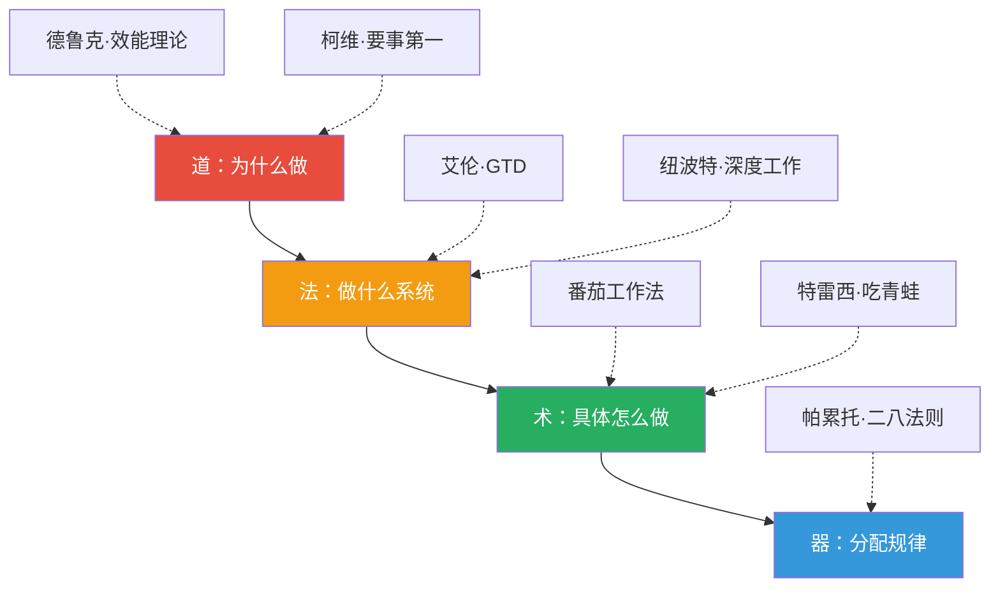
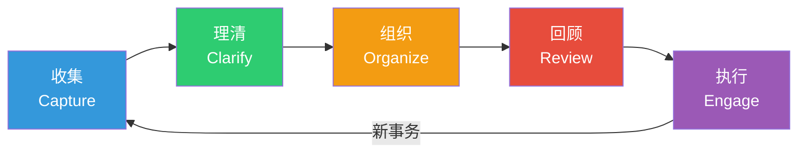
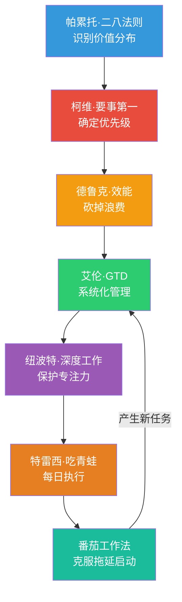
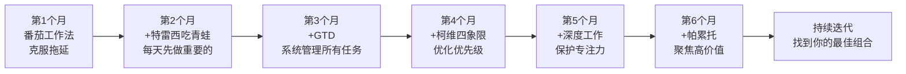

## 七、经典时间管理理论汇总

时间管理领域经过百余年的发展，涌现出众多理论体系。前面的章节已经深入讲解了艾森豪威尔矩阵（第二章）、番茄工作法（第三章）、GTD方法论（第四章），本章将这些理论放入更宏观的框架中，系统梳理最具影响力的七大经典理论，并补充前面未涉及的核心理论——从德鲁克的效能哲学到帕累托的二八法则，帮助你建立完整的时间管理知识图谱。

### 7.1 为什么需要了解经典理论

在进入具体理论之前，先回答一个关键问题：**既然已经有了具体的工具（番茄钟、GTD、四象限），为什么还要学习理论？**

答案是：**理论决定你用工具的方向，工具只决定你执行的速度。** 一个用错了方向的人，工具越好，偏离目标越远。德鲁克的经典名言"世界上最无用的事情就是高效地做一件根本不该做的事"，说的就是这个道理。

七大理论之间的关系可以用"道法术器"四层来理解：

| 层次 | 理论 | 回答的问题 |
|------|------|-----------|
| 道（哲学层） | 德鲁克·效能理论、柯维·要事第一 | 为什么要管理时间？什么才叫"有效"？ |
| 法（方法层） | 艾伦·GTD、纽波特·深度工作 | 用什么系统来管理？如何保护专注力？ |
| 术（技巧层） | 番茄工作法、布莱恩·特雷西·吃青蛙 | 具体怎么执行？从哪里开始？ |
| 器（规律层） | 帕累托·二八法则 | 什么样的分配模式是最优的？ |

---

### 7.2 彼得·德鲁克的"卓有成效"理论

#### 7.2.1 理论背景

彼得·德鲁克（Peter Drucker，1909-2005）被誉为"现代管理学之父"。他在1966年出版的《卓有成效的管理者》（*The Effective Executive*）中提出了一个根本性的问题：**管理者如何让自己和组织的工作变得卓有成效？**

德鲁克的洞察在当时是颠覆性的：**有效性不是天赋，而是一种可以学会的实践。** 在此之前，人们普遍认为"高效的人天生就高效"。德鲁克用大量案例证明，卓有成效是一套可以通过训练获得的习惯和纪律。

#### 7.2.2 核心思想：从时间开始

德鲁克理论的出发点非常朴素——**有效管理者不是从任务开始，而是从时间开始**。他的逻辑链条是：

1. **时间是最稀缺的资源**：时间无法被储存、借用、增加或替代。资金可以借贷，人才可以招聘，唯独时间一去不返
2. **时间的供给完全无弹性**：无论需求多大，供给都不会增加。时间也没有价格，无法用市场机制调节
3. **时间无法被替代**：其他资源在一定程度上可以互相替代（用资本替代劳动），时间没有替代品
4. **一切工作都需要时间**：任何成就都以时间为基本投入，时间是普遍且不可替代的条件

基于这四个特征，德鲁克得出结论：**时间是管理者最稀缺的资源，也是最常被浪费的资源。**

#### 7.2.3 三步法：记录→分析→管理

**第一步：记录时间**

德鲁克要求管理者连续记录3-4周的实际时间使用情况，不是"感觉"或"估计"，而是精确到每15分钟的实际记录。他的原话是：

> "许多管理者自以为知道自己的时间花在了哪里，但他们的'以为'和实际情况往往相差甚远。"

记录方法：
- 准备一个时间日志（纸质或电子表格均可）
- 每完成一项活动立即记录，不要等到一天结束再回忆
- 记录三个要素：时间点、活动内容、持续时长
- 连续记录至少3周，覆盖正常工作周和异常周

为什么是3-4周而不是1周？因为：
- 第1周你可能会因为"被观察"而改变行为（霍桑效应）
- 第2-3周才能看到真实的时间分布模式
- 需要覆盖不同类型的工作日（有会议的、无会议的、紧急事务日等）

**第二步：分析时间**

拿到时间记录后，对每项活动提出三个问题：

1. **"这件事如果根本不做，会有什么后果？"** 如果答案是"不会有什么明显后果"，这件事应该直接取消
2. **"这件事别人能做吗？做得和我一样好吗？"** 如果答案是"能"，这件事应该委托
3. **"我在做这件事时，有没有浪费别人的时间？"** 这是一个经常被忽视的维度——你高效的会议可能对别人来说是低效的时间浪费

德鲁克发现，大多数管理者的时间记录揭示了一个惊人的事实：**真正用于重要且有贡献的工作的时间，通常不超过全部工作时间的25%。** 其余75%被会议、电话、应酬、行政事务等吞噬。

**第三步：管理时间**

分析完时间使用模式后，德鲁克提出了三条管理原则：

1. **取消不必要的活动**：大胆砍掉那些"做了没多大用、不做也没多大损失"的活动。这需要勇气，因为这些活动往往有一定的传统惯性（"我们一直这么做的"）
2. **委托可以由他人做的活动**：德鲁克对"委托"有严格的标准——不是把任务丢给别人，而是判断"这件事是否必须由我亲自做"。如果别人能做得一样好甚至更好，就应该委托
3. **减少浪费他人时间的活动**：管理者浪费的不仅是自己的时间，还有下属、同事和客户的时间。冗长的会议、不清晰的指示、频繁的临时打断，都是浪费他人时间的典型方式

#### 7.2.4 "整块时间"原则

德鲁克特别强调：**知识工作需要大块的连续时间**。他用了一个精妙的类比：

> "把时间切成15分钟的小块来安排知识工作，就像把一块丝绸剪成碎片再缝起来——你得到的不是丝绸，而是补丁。"

他的建议：
- 把零散的任务（签批文件、回复邮件、例行电话）集中到固定时段处理
- 至少保留完整的上午（或下午）用于需要深度思考的工作
- 对于高层管理者，他甚至建议每周留出一整天的"在家工作日"，专门用于战略思考

#### 7.2.5 德鲁克理论的现代应用

德鲁克的方法论诞生于1966年，但其核心原理在今天依然适用。现代工具让"记录时间"变得更加容易：

| 德鲁克的原始方法 | 现代等价工具 |
|-----------------|-------------|
| 手写时间日志 | Toggl Track、Clockify、RescueTime（自动追踪） |
| 3-4周连续记录 | RescueTime自动后台记录，无需手动 |
| 人工分析时间分布 | 工具自动生成时间分布报告 |
| 集中处理零散任务 | 批量处理（Batching）+ 时间块（Time Blocking） |
| 委托判断 | GTD的"下一步行动"+"委派"分类 |

#### 7.2.6 德鲁克理论的局限

- **过于依赖"记录"**：在快节奏环境中，持续记录时间本身可能成为负担
- **缺乏系统框架**：告诉你"砍掉浪费"，但没有提供一个完整的任务管理系统（这部分由GTD补充）
- **未考虑精力因素**：德鲁克假设人可以像机器一样在安排好的时间块内高效工作，忽略了精力波动（这部分由能量管理理论补充）
- **适用范围偏向管理者**：原书面向管理者，个体执行者需要做适配

---

### 7.3 史蒂芬·柯维的"要事第一"原则

#### 7.3.1 理论背景

史蒂芬·柯维（Stephen Covey，1932-2012）在1989年出版的《高效能人士的七个习惯》（*The 7 Habits of Highly Effective People*）是20世纪最具影响力的个人管理著作之一。"要事第一"（Put First Things First）被列为七大习惯中的第三个——前两个习惯（积极主动、以终为始）解决"方向"问题，第三个习惯解决"执行"问题。

柯维的核心贡献不是发明了某个具体工具，而是建立了一套**以原则为中心**的个人管理哲学。他认为：**所有持久有效的时间管理系统，都必须建立在不变的原则之上，而非可变的技巧或工具。**

#### 7.3.2 四象限模型：时间管理的决策框架

柯维发展了艾森豪威尔矩阵，将其系统化为"时间管理矩阵"（详见第二章深度解析）。这里补充柯维版本的独特视角：

**四代时间管理的演进（柯维视角）**：

| 代际 | 核心工具 | 关注焦点 | 回答的问题 |
|------|----------|----------|-----------|
| 第一代 | 备忘录、便签 | 任务记录 | 我要做什么？ |
| 第二代 | 日历、日程表 | 时间安排 | 什么时候做？ |
| 第三代 | 优先级清单 | 价值排序 | 什么最重要？ |
| 第四代 | 原则与角色 | 自我管理 | 我是谁？我为什么做？ |

柯维认为大多数人在前三代之间来回切换，真正进入第四代的人很少。第四代的关键转变是：**管理的对象不再是时间和任务，而是自我——你的角色、价值观和承诺。**

#### 7.3.3 "大石头"隐喻

柯维最著名的教学隐喻是"大石头实验"：

> 想象你有一个玻璃罐、一些大石头、一些小石子、一些沙子和一杯水。如果你先把沙子倒进罐子，再放小石子，最后放大石头——大石头放不进去。但如果你先放大石头，再放小石子，最后倒沙子——沙子会填满缝隙，所有东西都能装下。

翻译成时间管理语言：
- **大石头** = 重要但不紧急的事务（第二象限）
- **小石子** = 重要且紧急的事务（第一象限）
- **沙子** = 不重要但紧急的事务（第三象限）
- **水** = 不重要不紧急的事务（第四象限）

**关键洞见**：如果你不先把"大石头"（第二象限事务）安排进日程，琐碎事务会填满你所有的时间，让你永远没有时间做真正重要的事。

#### 7.3.4 以角色为基础的周计划

柯维提出了一个独特的计划方法——**以角色为基础的周计划**。与传统的"按任务列清单"不同，柯维的计划从"角色"出发：

**第一步：识别你的关键角色**

每个人在生活中扮演多个角色，例如：
- 个人角色：学习者、健康管理者
- 家庭角色：伴侣、父母、子女
- 职业角色：团队领导、项目成员、专业人员
- 社区角色：志愿者、邻居

**第二步：为每个角色设定本周的"大石头"**

在每个角色下，确定1-2件本周最重要的事。例如：
- 作为学习者：完成《深度工作》第三章的阅读和笔记
- 作为健康管理者：运动4次，每次30分钟
- 作为团队领导：与每位成员进行一次15分钟的一对一沟通
- 作为伴侣：安排一次不看手机的晚餐

**第三步：把"大石头"安排进周日程**

将确定的"大石头"优先放入日历，然后再安排其他事务。

这个方法的精妙之处在于：**它确保你在生活的每个重要领域都有投入，而不是在某个领域过度投入、其他领域被忽视。**

#### 7.3.5 "第二象限"事务的典型清单

以下是一份经过整理的第二象限事务清单，按生活领域分类：

| 生活领域 | 第二象限事务（重要但不紧急） |
|----------|---------------------------|
| 职业发展 | 学习新技能、建立行业人脉、思考职业方向、写技术博客 |
| 健康管理 | 规律运动、定期体检、睡眠优化、健康饮食 |
| 财务规划 | 投资理财学习、保险规划、退休计划、应急基金建设 |
| 关系维护 | 与家人深度对话、维系重要友谊、陪伴孩子成长 |
| 个人成长 | 阅读、写作、冥想、参加培训、建立个人知识体系 |
| 预防性工作 | 系统维护、流程优化、团队建设、风险评估 |

#### 7.3.6 柯维理论的核心优势

1. **系统性**：不是零散的技巧，而是从价值观→角色→目标→计划→执行的完整链条
2. **平衡性**：以角色为基础的计划确保生活各领域均衡投入
3. **可持续性**：基于原则而非意志力，减少对"自律"的依赖
4. **预防性**：通过第二象限投资减少第一象限危机，形成正向循环

#### 7.3.7 柯维理论的局限

- **分类困难**：真实世界的任务往往横跨多个象限，难以清晰归类。例如"准备明天的会议"——紧急（明天就要开）还是不紧急（如果今天不准备也不会死）？重要（关键项目会议）还是不重要（例行周会）？
- **过度规划**：柯维的方法需要较高的规划投入，对于变化极快的环境（如创业公司、前线销售），精心制定的优先级可能很快过时
- **执行鸿沟**：知道什么重要和真正做到之间存在巨大鸿沟。柯维的框架告诉你"要事第一"，但没有提供"如何确保你真的去做了"的机制（这部分由习惯理论和番茄工作法补充）
- **忽视精力因素**：和德鲁克一样，柯维假设人可以持续执行优先级安排，忽略了精力波动对执行力的影响

---

### 7.4 卡尔·纽波特的"深度工作"理论

#### 7.4.1 理论背景

乔治城大学计算机科学教授卡尔·纽波特（Cal Newport）在2016年出版的《深度工作》（*Deep Work*）中提出了一个在数字时代尤为紧迫的命题：**在信息经济中，深度工作的能力正在变得越来越稀缺，同时变得越来越有价值。能够系统性进行深度工作的人将获得不成比例的回报。**

纽波特的观察基于一个悖论：技术工具的本意是提高效率，但实际效果是让人们越来越多地处于"浅层工作"状态——回复消息、处理通知、参加冗长的会议、在社交媒体上"保持存在"。

#### 7.4.2 核心概念定义

**深度工作（Deep Work）**：在无干扰状态下进行的高认知需求的专业活动。它能创造新价值，提升技能，且难以复制。

**浮浅工作（Shallow Work）**：低认知需求的、通常在干扰下完成的任务。这类工作往往不创造太多新价值，且容易被复制。

纽波特用一个公式量化深度工作的价值：

> **高质量工作产出 = 时间 × 专注强度**

这个公式的含义是：在深度工作状态下，1小时的产出可能等于浅层工作状态下的5-10小时。问题不在于"你工作了多久"，而在于"你在多高的专注水平下工作了多久"。

#### 7.4.3 为什么深度工作变得稀缺

纽波特分析了四个原因：

1. **开放办公室的普及**：协作导向的办公空间设计让持续的视觉和听觉干扰成为常态
2. **即时通信工具**：Slack、飞书、企业微信创造了"随时在线"的期望，打断成为默认行为
3. **社交媒体的注意力经济**：平台通过算法最大化用户注意力消耗，训练了人们频繁切换注意力的习惯
4. **"可见性偏差"**：在许多组织中，快速回复消息、频繁参加会议被视为"努力工作"的信号，而长时间不回复的深度工作者反而被认为"不够投入"

#### 7.4.4 四种深度工作安排模式

纽波特识别了四种不同的深度工作模式，适用于不同类型的人和工作：

**模式一：禁欲模式（Monastic Philosophy）**

完全切断与浮浅工作的联系，将全部精力投入深度工作。

- **适用人群**：作家、研究者、独立开发者等可以完全控制工作内容的人
- **典型做法**：不使用社交媒体、不查看邮件、不参加非必要会议
- **代表人物**：科幻作家尼尔·斯蒂芬森（Neal Stephenson）不提供电子邮件地址，解释说"如果我容易联系，我就会花大量时间回复，而没有时间写作"
- **局限**：对大多数人不现实，因为现代工作需要一定程度的沟通和协作

**模式二：双模式（Bimodal Philosophy）**

将时间明确分为"深度工作期"和"浮浅工作期"，在深度期内完全专注，浅层期处理其他事务。

- **适用人群**：需要交替进行深度创作和日常管理的人
- **典型做法**：每周安排2-3天完全用于深度工作，其余天处理行政和沟通
- **代表人物**：卡尔·荣格在伯林根的"塔楼"中进行深度思考和写作，回到苏黎世后进行临床工作和学术交流
- **时间尺度**：通常以周或月为单位切换

**模式三：节奏模式（Rhythmic Philosophy）**

将深度工作变成日常习惯，每天在固定时间进行固定时长的深度工作。

- **适用人群**：大多数知识工作者（推荐首选模式）
- **典型做法**：每天早上8:00-10:00为深度工作时间，雷打不动
- **核心优势**：习惯化减少启动成本——不需要每次都"决定"是否做深度工作，到了时间自动进入状态
- **配套工具**：习惯链（Habit Chain）——在日历上标记每天完成深度工作的记录，连续的标记形成视觉激励

**模式四：记者模式（Journalistic Philosophy）**

在任何空闲时刻都能快速切换到深度工作状态。

- **适用人群**：已经深度工作能力极强、能够快速进入专注状态的资深从业者
- **典型做法**：在会议间隙、候机等待、午休时间都能立即进入深度工作
- **警告**：纽波特明确指出这种模式不适合初学者。它需要大量的训练才能实现快速切换，没有经验的人尝试只会导致挫败感

#### 7.4.5 深度工作的实操框架

**框架一：时间块（Time Blocking）**

在每天开始前，将全部工作时间分配到具体的活动上，包括深度工作块和浮浅工作块。

典型深度工作日程：
08:00-08:15  规划当天任务，确认优先级
08:15-09:45  深度工作块 #1（核心任务）
09:45-10:00  休息（起身走动、喝水）
10:00-11:30  深度工作块 #2（核心任务）
11:30-12:00  浮浅工作（邮件、消息回复）
12:00-13:00  午餐
13:00-14:30  深度工作块 #3 或 协作工作
14:30-15:00  浮浅工作（会议、沟通）
15:00-16:00  深度工作块 #4（如果有余力）
16:00-17:00  浮浅工作（收尾、邮件、规划明天）

**框架二：禁入规则（Rituals）**

为深度工作建立固定的仪式和规则，减少决策消耗：

1. **物理隔离**：指定一个专门的深度工作区域，进入这个区域就代表"我现在要深度工作了"
2. **数字隔离**：飞行模式、关闭WiFi、使用网站屏蔽工具（Freedom、Cold Turkey）
3. **社交隔离**：告知同事/家人你的深度工作时段，设置"勿扰"标识
4. **时间承诺**：设定明确的开始和结束时间，以及产出目标

**框架三：生产力计量**

纽波特建议用简单的指标来追踪深度工作：

- **深度工作小时数**：每天记录实际进行深度工作的小时数
- **产出里程碑**：为每个深度工作块设定具体的产出目标（如"完成报告第三章"、"解决算法复杂度问题"）
- **周回顾**：每周回顾深度工作小时数和产出质量，识别改进空间

#### 7.4.6 对抗浮浅工作

纽波特提出了两个关键策略：

**策略一：安排浮浅工作时间**

不要试图消灭浮浅工作（那是不可能的），而是为其分配固定的时间窗口。在这些时间窗口内处理邮件、回复消息、参加必要的会议。在窗口之外，除非紧急情况，否则不处理浮浅事务。

**策略二：五分钟法则**

如果你不确定一项任务是深度还是浮浅的，问自己："如果我现在开始做这件事，5分钟后我还能保持专注吗？"如果答案是"不能"，这很可能是浮浅工作。

#### 7.4.7 深度工作的神经科学基础

为什么深度工作如此有效？神经科学给出了答案：

- **注意力残留（Attention Residue）**：明尼苏达大学索菲·勒鲁瓦教授的研究发现，从任务A切换到任务B时，你的注意力不会完全转移——有一部分仍然"残留"在任务A上。任务A未完成时，残留效应更强。这意味着**频繁的任务切换会让你的每个任务都在"部分注意力"状态下完成**
- **髓鞘化（Myelination）**：当你反复练习某个技能时，大脑会在相关的神经通路上形成更厚的髓鞘（myelin sheath），信号传导速度提升100倍。深度工作提供的是集中的、高质量的练习，直接促进髓鞘化
- **默认模式网络（Default Mode Network）**：即使在"不工作"时，大脑的默认模式网络也在进行信息整合和创意孵化。深度工作为这个网络提供了高质量的原材料——你在深度状态下思考的问题，会在休息时被大脑继续处理

#### 7.4.8 深度工作理论的局限

- **对工作环境要求高**：开放办公室、频繁的会议文化、即时响应的工作期望都会严重限制深度工作的可行性
- **不适合所有职业**：客服、销售、管理者等需要大量人际互动的角色难以安排大块深度工作时间
- **可能忽视协作价值**：过度强调"独自深度工作"可能低估了创意碰撞和团队协作的价值
- **启动门槛高**：对于习惯浅层工作的人来说，从0到1建立深度工作习惯需要相当大的意志力投入

---

### 7.5 戴维·艾伦的GTD方法论

GTD（Getting Things Done）在前面第四章有完整讲解，这里从经典理论的角度做总结性回顾。

#### 7.5.1 核心问题

戴维·艾伦（David Allen）在2001年出版的《搞定》（*Getting Things Done*）中解决的核心问题是：**如何让大脑从"记住要做什么"的负担中解放出来，专注于"执行"本身？**

#### 7.5.2 底层心理学原理

GTD的理论基础是**蔡格尼克效应**（Zeigarnik Effect）：未完成的任务会持续占据工作记忆，造成认知负荷。大脑会不断提醒你"还有事没做"，即使你在做其他事情。这种持续的背景噪音会降低你在任何单个任务上的表现。

艾伦的解决方案是：**把所有"悬而未决"的事务从大脑中清空到一个可信赖的外部系统。** 当大脑相信"这些事情已经被妥善记录和安排"时，它会释放心智带宽，让你真正专注于当下的任务。

#### 7.5.3 五步流程

1. **收集**：把大脑中所有"悬而未决"的事务清空到收集箱（inbox）。包括任务、想法、承诺、担忧——任何占据你心智带宽的东西
2. **理清**：对收集箱中的每一条逐一处理。核心判断是："需要行动吗？"→ 如果需要，"下一步行动是什么？"→ 如果需要多步，定义为"项目"
3. **组织**：按项目、情境（@电脑、@电话、@外出、@办公室）、日期分类存放
4. **回顾**：每周回顾整个系统（"每周回顾"），确保所有项目都有明确的下一步行动，系统保持可信
5. **执行**：根据当前情境、可用时间、精力水平和优先级选择行动

#### 7.5.4 GTD的核心价值

- **心理清空**：从"记住一切"的焦虑中解放出来
- **全景视角**：通过"六个高度"（跑道-10000英尺-20000英尺-30000英尺-40000英尺-50000英尺）建立从日常任务到人生愿景的完整层次
- **情境驱动**：不只按优先级，还按"我现在能做什么"来选择行动
- **每周回顾**：确保系统不会过时，保持信任度

> **GTD的详细实操方法、工具推荐和常见问题，请参见第四章"GT方法论——无压工作的系统"。**

---

### 7.6 弗朗西斯科·西里洛的番茄工作法

番茄工作法（Pomodoro Technique）在前面第三章有完整讲解，这里做总结性回顾。

#### 7.6.1 核心问题

意大利人弗朗西斯科·西里洛（Francesco Cirillo）在1980年代末发明了番茄工作法，解决的核心问题是：**如何在面对困难或无聊的任务时，克服拖延并保持专注？**

#### 7.6.2 核心方法

- 设定一个25分钟的计时器（"一个番茄钟"）
- 在这25分钟内全神贯注于单一任务
- 计时器响后休息5分钟
- 每完成4个番茄钟后，休息15-30分钟

#### 7.6.3 为什么25分钟有效

- **心理门槛低**："只需要专注25分钟"比"需要专注一整天"更容易开始
- **对抗拖延**：开始是最难的部分，番茄钟把"开始"的心理成本降到最低
- **利用超日节律**：25分钟的工作+5分钟的休息形成了一个微循环，接近大脑的自然注意力周期
- **创造进度感**：每个完成的番茄钟都是一个可计量的进展单位，满足大脑的"完成感"需求

#### 7.6.4 番茄工作法的进阶技巧

| 技巧 | 说明 |
|------|------|
| 任务拆分 | 一个番茄钟（25分钟）内可以完成的任务不需要拆分；需要多个番茄钟的任务记录预估数量 |
| 内部中断记录 | 走神时想到的事记在纸上，标记为"'"，稍后处理，不打断当前番茄钟 |
| 外部中断处理 | 有人打断时用"告知-协商-回复-回拨"四步法，尽量保护当前番茄钟 |
| 番茄钟不切割 | 一个番茄钟是不可分割的最小单位——完成后才算数，中途放弃不算 |
| 记录与回顾 | 每天记录完成的番茄钟数量和类型，分析效率模式 |

> **番茄工作法的完整科学原理、实操方法和工具推荐，请参见第三章"番茄工作法——专注力的科学"。**

---

### 7.7 布莱恩·特雷西的"吃掉那只青蛙"

#### 7.7.1 理论背景

布莱恩·特雷西（Brian Tracy）是加拿大裔美国励志演说家和商业顾问。他在2001年出版的《吃掉那只青蛙》（*Eat That Frog!*）提出了一个极其简单但深刻的时间管理原则：**如果你每天早上第一件事就是吃掉一只活青蛙，那么你这一天接下来都不会遇到更糟糕的事了。**

"青蛙"的隐喻来自马克·吐温的一句话（虽然来源存疑，但隐喻本身非常有效）：青蛙代表你当天最重要、最困难、最可能被拖延的任务。

#### 7.7.2 核心原则

**原则一：明确你的"青蛙"**

每天开始工作前，确定1-3件最重要的任务。这些任务的判断标准是：**完成它们会对你的工作和生活产生最大的积极影响。**

特雷西建议使用"ABCDE法"来确定青蛙：

| 等级 | 定义 | 后果 | 处理方式 |
|------|------|------|---------|
| A | 必须做 | 不做的后果严重 | 立即、优先做 |
| B | 应该做 | 不做会有一些不适 | A做完后做 |
| C | 可以做 | 做了更好，不做也没事 | 有余力再做 |
| D | 可以委托 | 别人做也行 | 委托给他人 |
| E | 可以消除 | 根本不需要做 | 直接删除 |

**原则二：先吃最大的青蛙**

如果有多只"青蛙"（多个A级任务），先吃最大、最难的那只。原因是：

1. **意志力递减**：自控力在一天中逐渐消耗（自我损耗理论），早上是你意志力最强的时刻
2. **启动效应**：完成最困难的任务会产生强烈的成就感，为当天剩余时间注入动力
3. **避免拖延螺旋**：拖延最大的任务会产生持续的焦虑，消耗其他任务的执行精力

**原则三：在吃青蛙之前不要做任何其他事情**

特雷西的规则非常严格：**早上第一件事就是你的A级任务，不要先"看看邮件""刷刷消息""整理桌面"。** 这些看似无害的"热身活动"实际上会消耗你的最佳精力窗口，并可能让你陷入反应模式（responding mode）而非主动模式（proactive mode）。

#### 7.7.3 特雷西的21条法则（精选）

《吃掉那只青蛙》列出了21条提高生产力的法则，以下是最核心的几条：

1. **明确目标**：写下你的目标，按优先级排序。没有明确目标的人就像没有目的地的船——哪里都到不了
2. **每天提前计划**：每天晚上花10分钟列出明天的任务清单。研究表明，1分钟的计划可以节省10分钟的执行时间
3. **应用80/20法则**：20%的任务产生80%的价值（详见7.8节）
4. **考虑后果**：最高效的优先级判断标准是"做这件事的后果是什么"——后果越重要的任务越优先
5. **"创意拖延"**：有意识地拖延低价值任务。你不可能做所有事，所以必须选择不做哪些事
6. **使用ABCDE法**：每天对任务进行分级，确保A级任务得到优先处理
7. **聚焦关键结果领域**：识别你工作中产出最关键的2-3个领域，在这些领域中吃最大的青蛙
8. **"三的法则"**：列出你的全部工作，问自己"如果我只能做其中三件，哪三件对结果的影响最大？"然后只做那三件
9. **准备充分再开始**：准备好所有需要的材料后再开始工作。频繁地起身找东西会打断专注状态
10. **一次一个任务**：不要试图同时做多件事。专注于一个任务直到完成，然后开始下一个

#### 7.7.4 "吃青蛙"的现代应用

特雷西的方法论诞生于前数字时代，但其核心原则在今天更加强大：

**晨间例行程序（示例）**：

06:30  起床，喝水，简短运动
07:00  回顾今天的"青蛙"（昨晚已提前计划）
07:15  开始吃最大的青蛙（关闭所有通知）
09:15  第一只青蛙完成，休息10分钟
09:25  开始第二只青蛙
11:00  青蛙时间结束，处理其他任务

**与GTD的整合**：

特雷西的"吃青蛙"可以完美融入GTD的执行层。GTD解决了"管理所有任务"的问题，"吃青蛙"解决了"每天先做什么"的问题。具体方法：
- 在GTD的"每周回顾"中识别本周的"大青蛙"
- 在GTD的"执行"阶段，用"吃青蛙"原则确定每天的第一个行动

#### 7.7.5 "吃青蛙"的局限

- **过于简化**：不是所有工作都适合在早上做——创意型工作可能在晚上更高效（取决于个人的昼夜节律）
- **忽视协作**：如果你的"青蛙"需要等待他人的输入，"早上第一件事做"可能不可行
- **意志力假设**：假设早上的意志力最强，但这因人而异
- **缺乏系统性**：只解决"先做什么"的问题，不解决"如何管理全部任务"的问题

---

### 7.8 帕累托的二八法则

#### 7.8.1 理论背景

维尔弗雷多·帕累托（Vilfredo Pareto，1848-1923）是意大利经济学家，他观察到一个惊人的现象：意大利约80%的土地被20%的人口拥有。后来，管理学家约瑟夫·朱兰（Joseph Juran）将这一观察推广为普遍原则，命名为"帕累托原则"（Pareto Principle），也就是广为人知的"二八法则"。

**核心表述：大约80%的结果来自20%的原因。**

这个比例不是精确的73/27或85/15——"80/20"只是一个便于记忆的近似值。关键是：**投入和产出之间存在严重的不对称性。**

#### 7.8.2 二八法则在时间管理中的应用

将二八法则应用于时间和任务管理，会得到以下结论：

| 现象 | 二八法则的解读 |
|------|---------------|
| 你20%的工作产出贡献了80%的工作价值 | 识别那20%的高价值任务，把最好的时间分配给它们 |
| 你20%的客户贡献了80%的收入 | 优先服务和维护核心客户关系 |
| 你20%的习惯决定了80%的生活质量 | 找到并强化那些关键习惯 |
| 你20%的学习产生了80%的技能提升 | 识别最高效的学习方法，减少低效学习 |
| 你20%的人际关系带来了80%的支持和快乐 | 投资维护核心关系 |

#### 7.8.3 如何找到你的"关键20%"

**步骤一：数据收集**

追踪你一周内的工作产出。记录每项任务的时间投入和产出价值（可以用1-10分主观评估）。

**步骤二：价值排序**

对所有任务按"单位时间产出价值"排序。不是看"花了多少时间"，而是看"每小时产出了多少价值"。

**步骤三：识别模式**

找到那20%的高价值任务，问自己：
- 这些任务有什么共同特征？
- 它们是否集中在我能力最强的领域？
- 它们是否需要我的独特优势（别人做不了）？
- 我是否在这些任务上投入了足够的时间？

**步骤四：重新分配**

把更多的时间分配给高价值任务，减少或消除低价值任务。具体方法：
- **放大**：对高价值任务投入更多时间和精力
- **委托**：对中等价值任务，评估是否可以委托给他人
- **消除**：对低价值任务，大胆砍掉

#### 7.8.4 二八法则的递归应用

二八法则最强大的特性是**递归性**——在那关键的20%中，还可以再应用二八法则，找到其中最关键的4%（20%×20%）。

全部任务（100%）→ 关键20% → 核心4%
           ↓              ↓            ↓
       产出80%价值   产出64%价值   产出51%价值

这意味着：**你全部工作的51%的价值，可能来自4%的任务。** 这4%就是你必须投入最多精力保护和优先处理的"超级任务"。

#### 7.8.5 与其他理论的整合

二八法则不是一个独立的时间管理系统，而是一个**诊断工具**——它帮助你识别"在其他系统中应该优先处理什么"。

| 整合理论 | 如何应用二八法则 |
|----------|----------------|
| 艾森豪威尔矩阵 | 80%的第二象限价值来自20%的第二象限任务 |
| GTD | 80%的项目价值来自20%的项目 |
| 吃青蛙 | "青蛙"就是那20%的高价值任务 |
| 深度工作 | 深度工作应该集中于那20%的高价值任务 |
| 周计划 | 80%的周计划价值来自20%的计划项目 |

#### 7.8.6 二八法则的常见误区

**误区一："80%不重要，可以不做"**

二八法则不意味着那80%的低价值任务可以完全忽略——它们可能包含维持基本运转的必要活动（如回复客户邮件、参加例行会议）。关键是**减少在这些任务上的时间和精力投入**，而不是完全不做。

**误区二："找到20%就一劳永逸"**

高价值任务会随着环境、目标和阶段的变化而改变。上个季度的20%可能不等于这个季度的20%。需要定期（至少每季度）重新评估。

**误区三："二八法则适用于所有场景"**

有些场景的投入产出关系更接近线性（如体力劳动、生产线工作），二八法则更适用于知识工作和创意工作。

---

### 7.9 七大理论的对比与整合

#### 7.9.1 理论对比矩阵

| 维度 | 德鲁克 | 柯维 | 纽波特 | 艾伦(GTD) | 番茄工作法 | 特雷西 | 帕累托 |
|------|--------|------|--------|----------|-----------|--------|--------|
| 核心关注 | 效能 | 优先级 | 专注深度 | 任务管理 | 执行启动 | 任务选择 | 价值分配 |
| 解决的问题 | 做对的事 | 哪件事最重要 | 如何深度工作 | 如何管理所有事 | 如何开始做 | 每天先做什么 | 应该投入哪里 |
| 适用层级 | 道 | 道 | 法 | 法 | 术 | 术 | 器 |
| 管理对象 | 时间使用 | 角色与价值 | 注意力 | 所有承诺 | 当前任务 | 当天任务 | 任务价值 |
| 主要工具 | 时间日志 | 四象限+角色 | 时间块 | 收集→组织→回顾 | 25分钟计时器 | ABCDE法 | 价值分析 |
| 最佳搭档 | GTD | 深度工作 | 番茄钟 | 吃青蛙 | 深度工作 | GTD | 所有理论 |

#### 7.9.2 理论之间的互补关系

**整合逻辑**：

1. **帕累托**帮你识别哪些任务/领域投入产出比最高
2. **柯维**帮你从价值观和角色出发确定优先级
3. **德鲁克**帮你砍掉不必要的活动，释放时间
4. **艾伦(GTD)**帮你系统化地管理所有剩余任务
5. **纽波特**帮你保护专注力，为高价值任务创造深度工作条件
6. **特雷西**帮你每天确定并优先执行最重要的任务
7. **番茄工作法**帮你在执行层面克服拖延，持续专注

#### 7.9.3 常见的理论搭配误区

**误区一：只用一个理论**

"我只用GTD就够了"或"番茄钟解决了我所有问题"——单个理论都有盲区。GTD擅长管理但不擅长选择，番茄钟擅长执行但不擅长规划。需要多层理论配合。

**误区二：理论之间冲突**

"GTD说按情境选择行动，特雷西说先吃青蛙，到底听谁的？"——不冲突。特雷西解决的是"在可选行动中先做什么"，GTD解决的是"有哪些可选行动"。它们在不同层面运作。

**误区三：理论太多导致系统过载**

"用了GTD+番茄钟+四象限+二八法则+深度工作，反而更焦虑了"——理论是分析工具，不是每天都要用的操作系统。你只需要一套简单的每日执行流程，其他理论用于定期回顾和调整。

---

### 7.10 如何选择适合自己的理论组合

#### 7.10.1 按职业类型选择

| 职业类型 | 核心挑战 | 推荐理论组合 |
|----------|---------|-------------|
| 程序员/工程师 | 深度工作被打断 | 纽波特（深度工作）+ 番茄工作法 + GTD |
| 管理者 | 会议过多，时间碎片化 | 德鲁克（砍浪费）+ 柯维（角色平衡）+ GTD |
| 创业者 | 方向不明确，什么都想做 | 帕累托（聚焦）+ 柯维（优先级）+ 特雷西（执行） |
| 学生 | 拖延，注意力分散 | 番茄工作法 + 特雷西（吃青蛙）+ 深度工作 |
| 自由职业者 | 自律不足，缺乏结构 | GTD + 番茄工作法 + 德鲁克（时间记录） |
| 创意工作者 | 需要大量深度思考时间 | 纽波特（深度工作）+ 德鲁克（整块时间）+ 帕累托 |

#### 7.10.2 按问题类型选择

| 你的主要问题 | 最相关的理论 |
|-------------|-------------|
| 总是忘记事情 | GTD（收集+组织） |
| 不知道什么最重要 | 柯维（四象限）+ 帕累托（二八法则） |
| 无法集中注意力 | 纽波特（深度工作）+ 番茄工作法 |
| 拖延症严重 | 特雷西（吃青蛙）+ 番茄工作法 |
| 时间总是不够用 | 德鲁克（砍浪费）+ 帕累托（聚焦高价值） |
| 工作生活失衡 | 柯维（角色平衡）+ 德鲁克（效能） |
| 做了很多但没有成就感 | 柯维（价值观对齐）+ 德鲁克（效能 vs 效率） |

#### 7.10.3 起步建议

如果你是时间管理的新手，不要试图一次掌握所有理论。建议的渐进路径：

每个阶段只需要掌握一个新理论，并将其融入已有的系统。不要跳步——前面的基础是后面的前提。

---

### 7.11 核心思想家速查表

| 人物 | 代表作 | 年份 | 核心贡献 | 一句话总结 |
|------|--------|------|----------|-----------|
| 彼得·德鲁克 | 《卓有成效的管理者》 | 1966 | 效能vs效率 | 做对的事比把事做对更重要 |
| 史蒂芬·柯维 | 《高效能人士的七个习惯》 | 1989 | 要事第一、四象限 | 大石头先放，沙子自然填满 |
| 卡尔·纽波特 | 《深度工作》 | 2016 | 深度vs浮浅工作 | 深度工作的能力越稀缺，回报越大 |
| 戴维·艾伦 | 《搞定》 | 2001 | GTD方法论 | 清空大脑，建立可信赖的外部系统 |
| 弗朗西斯科·西里洛 | 《番茄工作法图解》 | 1987 | 番茄工作法 | 25分钟的专注比8小时的散焦更有效 |
| 布莱恩·特雷西 | 《吃掉那只青蛙》 | 2001 | 最困难的事优先 | 每天早上先吃最大的青蛙 |
| 维尔弗雷多·帕累托 | 《政治经济学讲义》 | 1896 | 二八法则 | 80%的结果来自20%的原因 |
