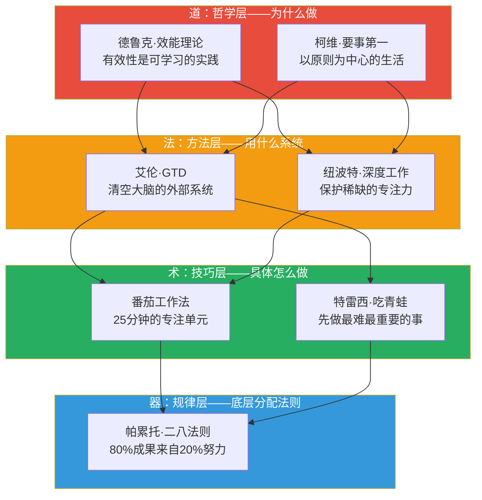
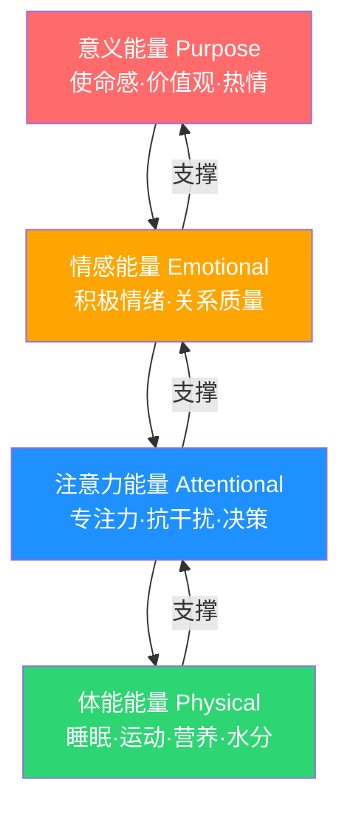
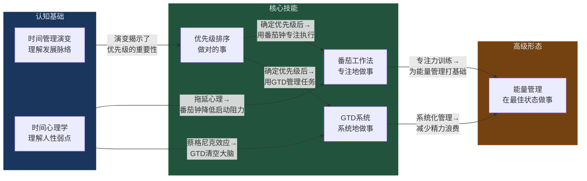

## 八、本节总结

经过前七节的系统学习，我们已经构建了一个完整的时间管理理论体系——从历史演变到优先级科学，从专注力方法论到任务管理框架，从心理机制到能量管理。本节将对所有核心内容进行结构化总结，提炼关键洞见，建立理论之间的联系，并指出从理论到实践的转化路径。

### 8.1 基础理论全景回顾

本节（基础理论）共覆盖六大知识领域，它们构成了时间管理的"道"层——回答的不是"怎么做"，而是"为什么这样做"以及"底层逻辑是什么"。

| 知识领域 | 核心问题 | 代表性理论/框架 | 关键洞见 |
|---------|---------|---------------|---------|
| 时间管理演变 | 时间管理思想是如何发展的？ | 四代时间管理范式 + 第五代趋势 | 从"管理时间"进化到"管理自我"，当前处于第四代向第五代过渡的阶段 |
| 优先级排序 | 如何区分"重要"和"紧急"？ | 80/20法则、艾森豪威尔矩阵、ABC法、吃青蛙 | 所有时间管理的基础——优先级错了，效率越高错得越远 |
| 番茄工作法 | 如何战胜拖延、保护专注力？ | 25+5节奏、打断管理、番茄数预估 | 最易上手的专注力训练工具，降低启动阻力是核心机制 |
| GTD系统 | 如何清空大脑、建立可信赖的外部系统？ | 收集→理清→组织→回顾→执行 | 蔡格尼克效应是GTD有效的心理学基础——写下来就能释放认知资源 |
| 时间心理学 | 为什么"知道"却"做不到"？ | 拖延机制、时间折扣、规划谬误、帕金森定律 | 拖延是情绪问题而非时间问题；人类大脑用双曲函数计算未来价值 |
| 能量管理 | 如何在有限精力下最大化产出？ | 精力四维度、超日节律、精力曲线 | 精力的质量远比时间的数量更重要——这是时间管理的高级形态 |

### 8.2 七大核心理论的道法术器层次

基础理论部分涉及的七大经典理论，可以用"道法术器"四层框架来理解它们之间的关系：

**道层决定方向**：德鲁克告诉我们"有效性可以习得"，柯维告诉我们"要事第一"。如果方向错了，越努力偏离越远。

**法层提供框架**：GTD给了我们一个清空大脑、系统化管理任务的完整流程；深度工作理论告诉我们在信息时代如何保护专注力这一稀缺资源。

**术层落地执行**：番茄工作法把"专注"变成可量化、可训练的单元；吃青蛙原则确保每天第一件事就啃最硬的骨头。

**器层揭示规律**：80/20法则告诉我们不是所有投入都等价——找到那关键的20%，就是时间管理的杠杆支点。

### 8.3 六大理论板块的核心要点提炼

#### 8.3.1 时间管理演变：从"管时间"到"管自己"

时间管理经历了四代范式演变，当前正在进入第五代：

| 代际 | 核心理念 | 代表工具 | 关注焦点 |
|------|---------|---------|---------|
| 第一代 | 记下来 | 备忘录、便签 | 不遗忘 |
| 第二代 | 排日程 | 日历、日程表 | 什么时候做 |
| 第三代 | 分优先级 | 四象限、ABC法 | 什么最重要 |
| 第四代 | 管理自我 | 原则中心、精力管理 | 我是谁？为什么做？ |
| 第五代（趋势） | 人机协作 | AI辅助、生物节律整合 | 让AI处理低价值任务，人专注于创造 |

**关键认知升级**：大多数人停留在第一代到第三代之间——用备忘录记事、用日历排日程、偶尔用优先级排序。真正的突破是进入第四代：**管理的对象不再是时间和任务，而是自我——你的注意力、精力、角色和价值观。**

#### 8.3.2 优先级排序：所有时间管理的地基

优先级排序是整个时间管理大厦的地基。核心工具包括：

- **80/20法则**：不是"只做20%的事"，而是"识别产出最高的20%活动并优先保障它们的时间"。可以递归应用——在20%中再找20%，即4%的活动可能产生64%的成果。
- **艾森豪威尔矩阵**：用"重要性"和"紧急性"两个维度将任务分为四类。核心策略是把80%精力投入"重要但不紧急"的第二象限——这是"黄金象限"，投入越多，第一象限的危机越少。
- **ABC法**：A类必须做（后果严重），B类应该做（后果中等），C类可以做（不做也没事）。永远先做A1。
- **吃青蛙**：每天早上第一件事完成最重要最困难的任务。意志力在一天中递减，早上是最佳窗口。

**核心警示**：如果你不知道自己最重要的事是什么，所有时间管理工具都只是"更高效地做错误的事"。

#### 8.3.3 番茄工作法：专注力的科学

番茄工作法的核心不是"25分钟"这个数字，而是它背后的四个科学机制：

1. **降低启动阻力**（蔡格尼克效应）："只专注25分钟"比"完成整个项目"容易接受得多
2. **制造适度紧迫感**（耶克斯-多德森定律）：倒计时创造的适度压力恰好处于表现最佳点
3. **符合注意力节律**：25分钟处于人类持续注意力最佳范围（20-45分钟）的中段
4. **提供结构化休息**：休息期间大脑的默认模式网络进行信息整合和创意孵化

**进阶要点**：番茄钟可以变形——52/17法则（DeskTime研究发现的高效节奏）、90/20法则（基于超日节律）。关键是找到适合自己的节奏，而非死守25分钟。

#### 8.3.4 GTD系统：清空大脑的外部系统

GTD有效的心理学基础是**蔡格尼克效应**：未完成的任务持续占据工作记忆，消耗认知资源。GTD的解决方案是把所有"悬而未决"的事务从大脑清空到可信赖的外部系统。

**五步流程**：收集（把一切倒出来）→ 理清（逐一判断"需要行动吗"）→ 组织（按项目/情境/日期分类）→ 回顾（每周审视确保系统可信）→ 执行（根据情境、时间、精力、优先级选择行动）

**核心价值**：不是"更高效地做事"，而是"让大脑从'记住要做什么'的负担中解放出来，专注于执行本身"。

#### 8.3.5 时间心理学：理解"知行差距"的根源

时间心理学揭示了六个影响时间利用的深层心理机制：

| 心理机制 | 核心发现 | 对抗策略 |
|---------|---------|---------|
| 拖延 | 不是懒惰，是情绪调节失败——大脑把"不舒服"等同于"危险" | 降低启动门槛（2分钟启动法）、管理情绪而非硬抗、创造外部约束 |
| 时间感知 | 大脑通过记忆"标记点"评估时间长度；新奇体验让时间"变长" | 增加新奇体验、创造心流、定期记录 |
| 时间折扣 | 大脑用双曲函数（非指数函数）计算未来价值，极度偏好即时回报 | 缩短反馈周期、增强未来自我连接、承诺装置 |
| 规划谬误 | 人类系统性地低估任务所需时间（平均低估30-50%） | 参考类别预测法——用历史数据而非直觉预估 |
| 蔡格尼克效应 | 未完成任务持续消耗认知资源 | 外部系统（GTD）、大脑清空练习、完成清单 |
| 帕金森定律 | 工作自动膨胀填满所有可用时间 | 人为制造紧迫感、限制工作窗口 |

**最关键的认知**：拖延不是意志力薄弱，而是大脑进化而来的保护机制。对抗拖延的正确方式不是"更自律"，而是"降低情绪强度、改变情绪性质、设计环境让正确行为更容易"。

#### 8.3.6 能量管理：时间管理的高级形态

能量管理是本节的最高阶内容——它回答的问题是"在有限的精力下，如何最大化产出"。

**精力四维度模型**（吉姆·洛尔《精力管理》）：

**体能是一切的基础**，但仅有体能不够——意义能量可以补偿体能的暂时不足（想想deadline前的超常发挥），体能无法填补意义的缺失（想想每天上班如上坟的状态）。

**核心节律**：人体以90-120分钟为一个超日节律周期，每个周期后需要15-20分钟恢复。在高峰期安排高强度认知任务，低谷期安排休息或低强度任务。

**四个维度存在强烈的协同效应**：规律运动→睡眠质量提升→注意力更集中→产出更高→成就感增强→情绪更积极→更有动力运动。打破负向螺旋的关键干预点是**体能维度**——因为它改善最直接、最可量化。

### 8.4 理论之间的逻辑关系网络

六大理论板块不是孤立的知识点，而是一个相互支撑的系统：

**自下而上的逻辑**：认知基础（理解时间管理的演变和心理机制）→ 核心技能（掌握优先级排序、专注力工具、任务管理系统）→ 高级形态（在前两者基础上引入能量管理，实现"在最佳状态做对的事"）。

**自上而下的反馈**：能量管理的实践会让你意识到哪些优先级排序需要调整（比如发现精力低谷期不适合安排重要任务），也会反过来加深你对时间心理学的理解（比如理解为什么下午更容易拖延）。

### 8.5 从理论到实践的转化框架

理论的价值在于指导实践。以下是将六大理论板块转化为具体行动的路径：

| 理论板块 | 核心实践动作 | 立即可做 | 需要养成 |
|---------|------------|---------|---------|
| 时间管理演变 | 从"管时间"思维升级到"管自我"思维 | 审视自己当前处于第几代 | 持续迭代个人管理系统 |
| 优先级排序 | 每天确定1-3件最重要的事 | 今天就用ABC法给任务排序 | 每日/每周固定的优先级规划习惯 |
| 番茄工作法 | 用25分钟专注单元训练注意力 | 今天就尝试一个番茄钟 | 从4个/天逐步提升到8-10个/天 |
| GTD系统 | 清空大脑到外部系统 | 花30分钟做一次"大脑清空" | 建立每周回顾习惯 |
| 时间心理学 | 识别自己的拖延类型和时间导向 | 记录今天的一次拖延情境 | 用"如果-那么"计划对抗拖延 |
| 能量管理 | 记录能量日志，找到自己的精力曲线 | 今天每2小时记录一次精力水平 | 根据精力曲线安排任务类型 |

**实践路径建议**：

1. **第一步（本周）**：做一次"大脑清空"（GTD），然后用ABC法确定今天最重要的三件事（优先级排序），用番茄工作法完成其中最重要的一件
2. **第二步（本月）**：记录一周的能量日志，找到自己的精力高峰期，把最重要的任务安排在高峰期
3. **第三步（持续）**：建立每周回顾习惯，持续迭代个人时间管理系统

### 8.6 一句话总结每个理论板块

如果把每个理论板块压缩到一句话：

1. **时间管理演变**：从"管时间"到"管自己"——你管理的不是时间，而是注意力、精力和行为选择
2. **优先级排序**：不是所有投入都等价——找到关键的20%，把精力聚焦在"重要但不紧急"的第二象限
3. **番茄工作法**：专注力可以训练——25分钟的专注单元降低启动阻力，结构化休息保护长期效能
4. **GTD系统**：大脑是用来思考的，不是用来记事的——把所有"悬而未决"清空到可信赖的外部系统
5. **时间心理学**：拖延是情绪问题，不是时间问题——理解大脑的运作机制，顺应而非对抗人性
6. **能量管理**：精力的质量远比时间的数量更重要——在最佳状态做对的事，是时间管理的终极形态

> "效率是正确地做事，效能是做正确的事。" ——彼得·德鲁克

这句话浓缩了整个基础理论部分的核心精神：先确保方向正确（效能），再追求执行效率。优先级排序确保你在做正确的事，番茄工作法和GTD确保你在正确地做事，能量管理确保你在最佳状态下做事。三者合一，就是时间管理的完整图景。

### 8.7 下一步：从理论到实践

在接下来的"具体方案"部分，我们将把这些理论转化为可直接执行的操作方案——每日时间管理、每周计划、每月复盘、项目时间管理、不同人群定制方案、数字化工具选型，以及工作与生活平衡的系统方法。

理论是地图，实践是旅程。地图告诉你方向，但只有迈出脚步才能到达目的地。

